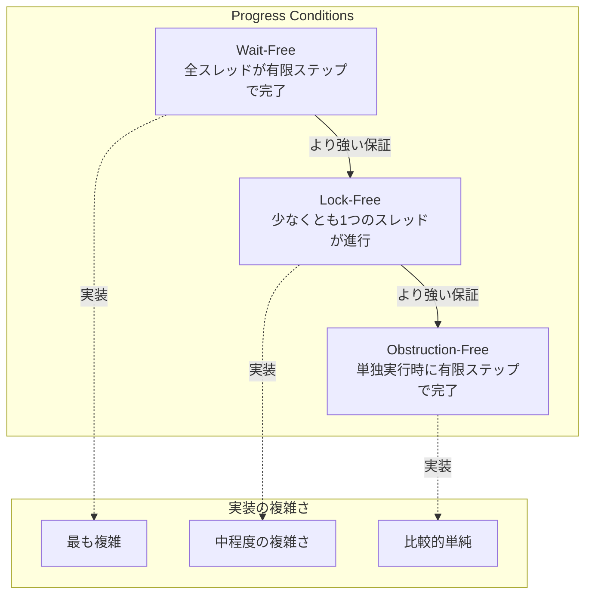
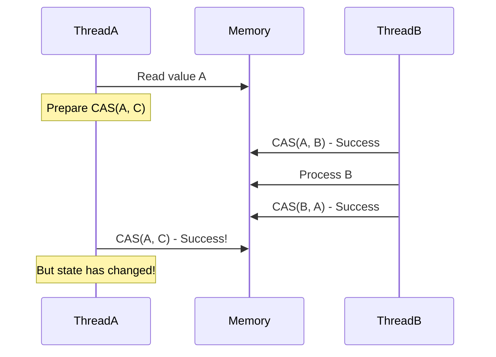
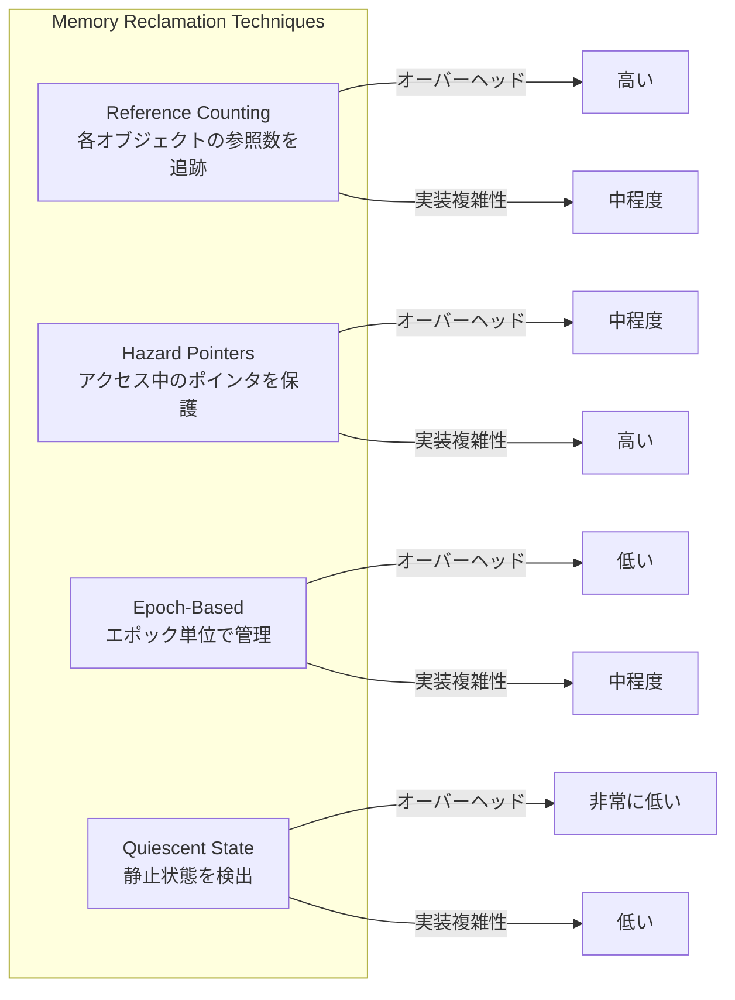

# Lock-Free

Lock-Freeプログラミングは、並行プログラミングにおける同期手法の一つであり、従来のミューテックスやセマフォといったブロッキング同期プリミティブを使用せずに、複数のスレッドが共有データ構造に安全にアクセスすることを可能にする技術である。この手法は、高性能コンピューティングやリアルタイムシステムにおいて、スケーラビリティとレスポンスタイムの改善のために広く採用されている。

Lock-Freeアルゴリズムの本質は、システム全体の進行保証（progress guarantee）にある。Maurice Herlihy[^1]によって定式化された進行条件によれば、Lock-Freeアルゴリズムは「無限に実行ステップが与えられた場合、少なくとも一つのスレッドが必ず進行する」ことを保証する。この定義は一見単純に見えるが、実際のシステムにおいて重要な意味を持つ。従来のロックベースのアルゴリズムでは、ロックを保持したスレッドがクラッシュやスケジューリングの遅延により停止した場合、他のすべてのスレッドがブロックされる可能性がある。Lock-Freeアルゴリズムは、このような状況でも少なくとも一つのスレッドが進行を続けることを保証する。



Lock-Freeアルゴリズムの実装において中心的な役割を果たすのが、Compare-And-Swap（CAS）操作である。CAS操作は、メモリ位置の値が期待値と等しい場合にのみ、その値を新しい値に更新するアトミック操作である。現代のプロセッサアーキテクチャの多くがハードウェアレベルでCAS命令をサポートしており、x86-64では`CMPXCHG`命令、ARMでは`LDREX/STREX`命令対として実装されている。

```cpp
// CAS operation conceptual implementation
bool compare_and_swap(std::atomic<T>* ptr, T expected, T desired) {
    // This entire operation is atomic
    if (*ptr == expected) {
        *ptr = desired;
        return true;
    }
    return false;
}
```

CAS操作を用いたLock-Freeアルゴリズムの典型的なパターンは、読み取り・修正・条件付き更新のループである。この手法では、共有データの現在の値を読み取り、必要な修正を加えた新しい値を計算し、CAS操作で更新を試みる。更新が失敗した場合（他のスレッドが先に更新した場合）、操作を最初からやり直す。

Lock-Freeプログラミングにおいて最も悪名高い問題の一つがABA問題である。この問題は、ポインタや値が一度変更された後、再び元の値に戻ることで発生する。スレッドAがある値Aを読み取り、CAS操作の準備をしている間に、スレッドBがその値をAからBに変更し、さらに別の操作でBからAに戻すという状況を考える。スレッドAがCAS操作を実行する時点では、値は確かにAであるため操作は成功するが、その間にデータ構造の状態が大きく変化している可能性がある。



ABA問題の解決策として最も一般的なのは、ポインタにバージョン番号やスタンプを付加する手法である。64ビットシステムでは、128ビットのダブルワードCAS操作を使用して、ポインタとカウンタを同時に更新することができる。また、ハザードポインタ[^2]やエポックベースの回収[^3]といった、より洗練されたメモリ管理手法も開発されている。

メモリ順序（memory ordering）は、Lock-Freeプログラミングにおいて極めて重要な概念である。現代のプロセッサは性能最適化のために命令の実行順序を変更したり、キャッシュの一貫性プロトコルによってメモリ操作の可視性に遅延が生じたりする。C++11以降の標準では、アトミック操作に対して以下のメモリ順序を指定できる：

- `memory_order_relaxed`: 最も弱い保証。単一のアトミック変数に対する操作の順序のみを保証
- `memory_order_acquire`: 読み取り操作に使用。この操作以降のメモリアクセスが、この操作より前に移動しないことを保証
- `memory_order_release`: 書き込み操作に使用。この操作以前のメモリアクセスが、この操作より後に移動しないことを保証
- `memory_order_acq_rel`: 読み取り・修正・書き込み操作に使用。acquireとreleaseの両方の保証を提供
- `memory_order_seq_cst`: 最も強い保証。全順序の一貫性を提供

適切なメモリ順序の選択は、正確性とパフォーマンスのトレードオフである。`memory_order_seq_cst`は最も理解しやすく安全だが、特にARMやPowerPCなどの弱いメモリモデルを持つアーキテクチャでは、追加のメモリバリアによる性能低下を招く可能性がある。

Lock-Freeキューの実装例として、Michael & Scott Queue[^4]を考える。このアルゴリズムは、リンクリストベースのFIFOキューを実装し、enqueue操作とdequeue操作の両方がLock-Freeである。

```cpp
template<typename T>
class LockFreeQueue {
    struct Node {
        std::atomic<T*> data;
        std::atomic<Node*> next;
        Node() : data(nullptr), next(nullptr) {}
    };
    
    std::atomic<Node*> head;
    std::atomic<Node*> tail;
    
public:
    void enqueue(T item) {
        Node* newNode = new Node;
        T* data = new T(std::move(item));
        newNode->data.store(data);
        
        Node* prevTail = tail.load();
        while (true) {
            Node* last = prevTail;
            Node* next = last->next.load();
            
            if (last == tail.load()) {
                if (next == nullptr) {
                    // Try to link new node at the end
                    if (last->next.compare_exchange_weak(next, newNode)) {
                        // Enqueue done, try to swing tail
                        tail.compare_exchange_weak(last, newNode);
                        break;
                    }
                } else {
                    // Tail was not pointing to last node
                    tail.compare_exchange_weak(last, next);
                }
            }
            prevTail = tail.load();
        }
    }
};
```

Lock-Freeアルゴリズムの性能特性は、従来のロックベースのアルゴリズムとは大きく異なる。低競合状態では、Lock-Freeアルゴリズムはロックの取得・解放のオーバーヘッドがないため、優れた性能を発揮する。しかし、高競合状態では、CAS操作の失敗によるリトライが増加し、性能が低下する可能性がある。この現象は「ライブロック」と呼ばれ、デッドロックとは異なり、スレッドは動作を続けているが有益な作業を完了できない状態である。

メモリ管理は、Lock-Freeデータ構造における最大の課題の一つである。ノードの削除時に、他のスレッドがまだそのノードを参照している可能性があるため、単純にメモリを解放することはできない。この問題に対する解決策として、Reference Counting、Hazard Pointers、Epoch-Based Reclamation（EBR）、Quiescent State-Based Reclamation（QSBR）などの手法が開発されている。

Hazard Pointersは、各スレッドが現在アクセスしているポインタを「危険」として登録し、他のスレッドがこれらのポインタが指すメモリを解放しないようにする仕組みである。一方、EBRは、グローバルなエポックカウンタを使用し、すべてのスレッドが新しいエポックに移行した時点で、古いエポックのメモリを安全に解放できることを保証する。



Lock-Freeアルゴリズムの正当性の証明は、線形化可能性（linearizability）[^5]の概念に基づいて行われる。線形化可能性は、並行実行される操作が、ある順次実行と等価であることを保証する。各操作には「線形化点」と呼ばれる瞬間があり、その時点で操作が論理的に発生したとみなされる。Lock-Freeアルゴリズムでは、通常、成功したCAS操作が線形化点となる。

実践的な設計指針として、Lock-Freeアルゴリズムを採用する際には以下の点を考慮すべきである。まず、本当にLock-Freeが必要かを慎重に検討する必要がある。多くの場合、適切に設計されたロックベースのアルゴリズムで十分な性能が得られる。Lock-Freeアルゴリズムは実装が複雑で、デバッグが困難であり、微妙なバグが潜む可能性が高い。

Lock-Freeアルゴリズムが適している状況は、レイテンシが重要なリアルタイムシステム、高度にスケーラブルなシステム、フォルトトレラントなシステムなどである。また、読み取りが多く書き込みが少ないワークロードでは、Read-Copy-Update（RCU）[^6]のような手法が効果的である。

アーキテクチャ固有の考慮事項も重要である。x86-64は比較的強いメモリモデル（Total Store Ordering）を持つため、多くの場合デフォルトの順序で十分だが、ARMやPowerPCなどの弱いメモリモデルでは、明示的なメモリバリアが必要になることが多い。また、キャッシュラインの偽共有（false sharing）を避けるため、頻繁に更新される変数は異なるキャッシュラインに配置すべきである。

デバッグとテストの観点では、Lock-Freeアルゴリズムは従来の手法では検出が困難なバグを含む可能性がある。ThreadSanitizerなどの動的解析ツール、モデル検査器、ストレステストなどを組み合わせて使用することが推奨される。特に、異なるメモリ順序の組み合わせや、プリエンプションのタイミングによって発生する稀な競合状態を検出することが重要である。

[^1]: Maurice Herlihy. "Wait-free synchronization." ACM Transactions on Programming Languages and Systems (TOPLAS) 13.1 (1991): 124-149.

[^2]: Maged M. Michael. "Hazard pointers: Safe memory reclamation for lock-free objects." IEEE Transactions on Parallel and Distributed Systems 15.6 (2004): 491-504.

[^3]: Keir Fraser. "Practical lock-freedom." PhD thesis, University of Cambridge, 2004.

[^4]: Maged M. Michael and Michael L. Scott. "Simple, fast, and practical non-blocking and blocking concurrent queue algorithms." Proceedings of the fifteenth annual ACM symposium on Principles of distributed computing. 1996.

[^5]: Maurice P. Herlihy and Jeannette M. Wing. "Linearizability: A correctness condition for concurrent objects." ACM Transactions on Programming Languages and Systems (TOPLAS) 12.3 (1990): 463-492.

[^6]: Paul E. McKenney and John D. Slingwine. "Read-copy update: Using execution history to solve concurrency problems." Parallel and Distributed Computing and Systems. 1998.