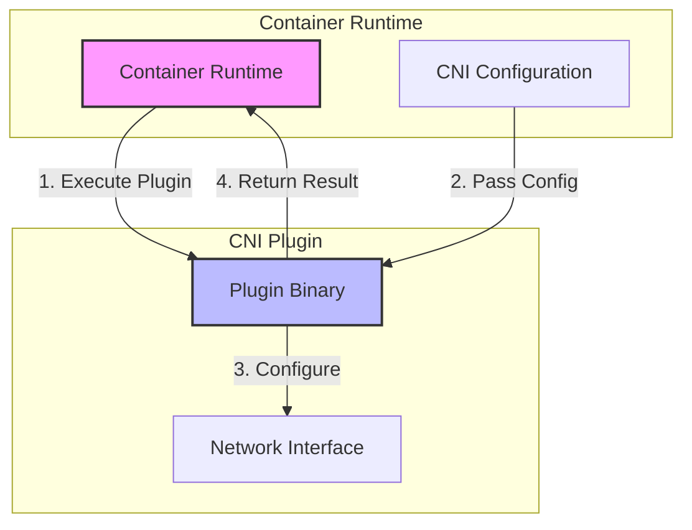
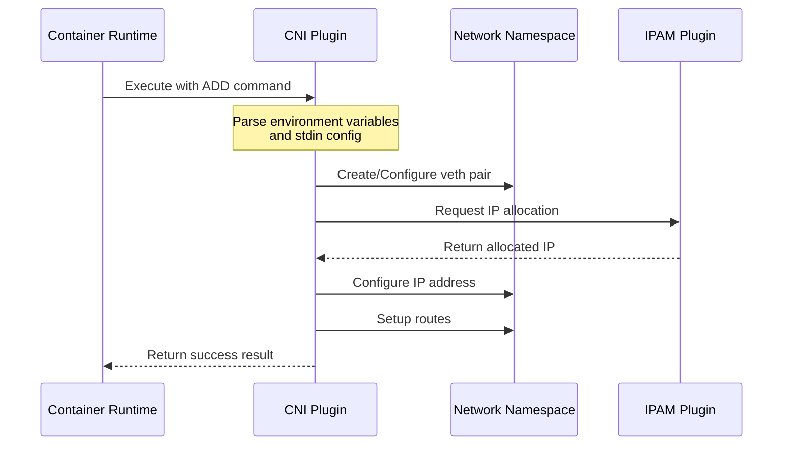
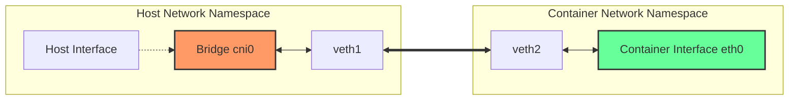
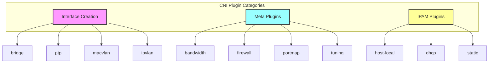
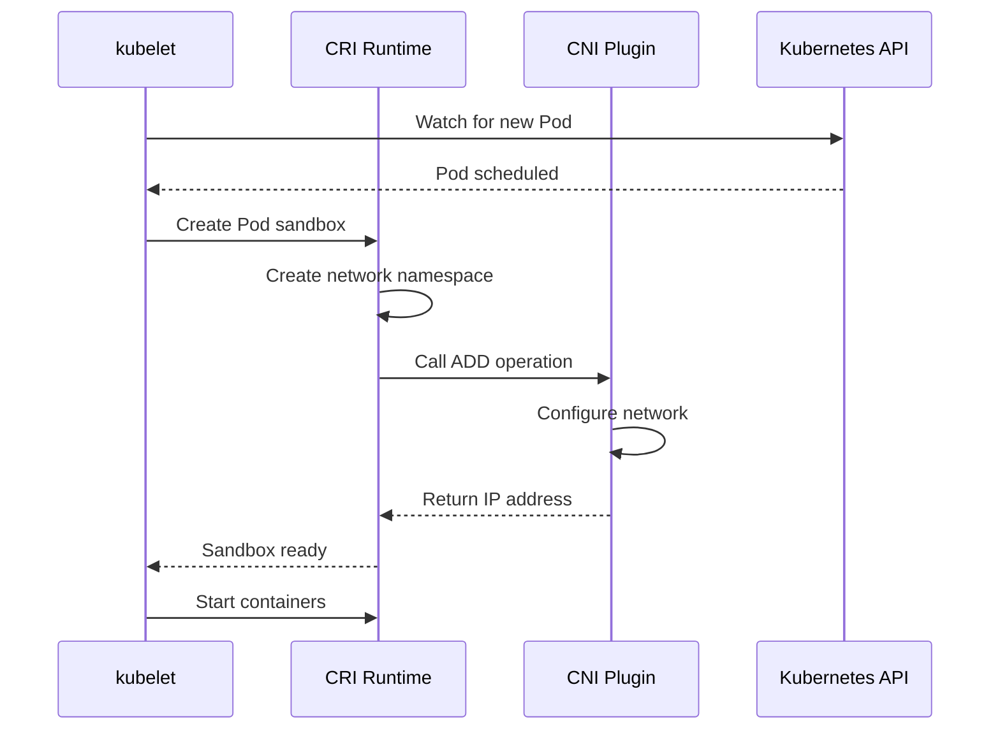

# CNI (Container Network Interface)

コンテナオーケストレーションの普及に伴い、コンテナのネットワーク設定を統一的に扱う必要性が高まってきた。異なるコンテナランタイムやオーケストレータがそれぞれ独自のネットワーク実装を持つことは、エコシステムの断片化を招き、ネットワークプロバイダーにとっても負担となる。こうした背景から、CNI（Container Network Interface）が誕生した。CNIは、コンテナのネットワーク設定を抽象化し、プラグイン形式で様々なネットワーク実装を可能にする仕様である[^1]。

CNIの設計思想は極めてシンプルである。コンテナランタイムとネットワークプラグインの間のインターフェースを定義し、プラグインの実行方法とデータフォーマットを規定する。この単純さが、CNIが広く採用される要因となっている。KubernetesをはじめとするCNCFプロジェクトの多くがCNIを採用し、現在ではコンテナネットワーキングのデファクトスタンダードとなっている。

## CNI仕様の詳細

CNI仕様は、コンテナランタイムとネットワークプラグイン間のプロトコルを定義している[^2]。この仕様の中核は、5つの操作（ADD、DEL、CHECK、GC、VERSION）と、それらの操作を実行するための環境変数およびJSON形式の設定である。



ADD操作は、コンテナをネットワークに追加する最も重要な操作である。コンテナランタイムは、CNIプラグインのバイナリを実行し、環境変数を通じてコンテナID、ネットワーク名前空間のパス、インターフェース名などの情報を渡す。同時に、標準入力を通じてJSON形式のネットワーク設定を提供する。プラグインは、この情報を基にネットワークインターフェースを作成・設定し、結果をJSON形式で標準出力に返す。

DEL操作は、コンテナをネットワークから削除する際に呼び出される。プラグインは、ADD操作で割り当てたリソース（IPアドレス、ネットワークインターフェース、ルーティングエントリなど）を解放する責任を持つ。CNIの設計原則として、プラグインはべき等性を保証する必要があり、同じDEL操作を複数回実行してもエラーを返してはならない。

CHECK操作は、CNI仕様のバージョン0.4.0で導入された機能で、プラグインが以前に設定したネットワーク構成が正しく維持されているかを確認する。これにより、ネットワーク設定のドリフトを検出し、必要に応じて修正することが可能になる。GC（Garbage Collection）操作は、孤立したネットワークリソースをクリーンアップするために使用される。

## プラグインアーキテクチャとプロトコル

CNIプラグインは、実行可能なバイナリとして実装される。このアーキテクチャの選択は、言語の独立性と実装の簡潔性を重視した結果である。プラグインは、特定のディレクトリ（通常は`/opt/cni/bin`）に配置され、コンテナランタイムによって直接実行される。



プラグインの実行時、コンテナランタイムは以下の環境変数を設定する：

- `CNI_COMMAND`: 実行する操作（ADD、DEL、CHECK、GC、VERSION）
- `CNI_CONTAINERID`: コンテナの一意識別子
- `CNI_NETNS`: ネットワーク名前空間のパス
- `CNI_IFNAME`: コンテナ内のインターフェース名
- `CNI_PATH`: CNIプラグインバイナリの検索パス

標準入力を通じて渡されるネットワーク設定は、以下のような構造を持つ：

```json
{
  "cniVersion": "1.0.0",
  "name": "mynet",
  "type": "bridge",
  "bridge": "cni0",
  "isGateway": true,
  "ipMasq": true,
  "ipam": {
    "type": "host-local",
    "subnet": "10.22.0.0/16",
    "routes": [
      { "dst": "0.0.0.0/0" }
    ]
  }
}
```

この設定には、使用するプラグインのタイプ、プラグイン固有のパラメータ、そしてIPアドレス管理（IPAM）の設定が含まれる。IPAMは別のプラグインとして実装されることが多く、IPアドレスの割り当てと管理を担当する。

## ネットワーク設定の流れ

CNIによるネットワーク設定のプロセスは、複数のステップから構成される。まず、コンテナランタイムが新しいコンテナを作成する際、空のネットワーク名前空間を作成する。この名前空間は、コンテナのネットワークスタックを他のコンテナやホストから分離する役割を果たす。



次に、コンテナランタイムはCNI設定を読み込み、指定されたプラグインを実行する。最も一般的なbridge型プラグインの場合、以下の処理が行われる：

1. ホスト側にLinuxブリッジが存在しない場合は作成する
2. vethペアを作成し、一方をホストのブリッジに接続する
3. もう一方のvethインターフェースをコンテナのネットワーク名前空間に移動する
4. IPAMプラグインを呼び出してIPアドレスを取得する
5. コンテナ側のインターフェースにIPアドレスを設定する
6. 必要なルーティングエントリを追加する
7. iptablesルールを設定してNATやフィルタリングを行う

この一連の処理は原子的に実行される必要があり、途中でエラーが発生した場合は、それまでに行った変更をロールバックする必要がある。

## 主要なCNIプラグインの実装

CNIエコシステムには、様々な用途に応じた多数のプラグインが存在する。標準的なプラグインセットは、containernetworking/pluginsリポジトリで管理されており、以下のようなカテゴリに分類される。

**インターフェース作成プラグイン**は、ネットワークインターフェースの作成と基本的な設定を行う。bridgeプラグインは最も広く使用されており、Linuxブリッジを使用してコンテナを接続する。ptp（point-to-point）プラグインは、vethペアを使用してコンテナとホスト間の直接接続を提供する。macvlanプラグインは、物理ネットワークインターフェースから複数の仮想MACアドレスを持つサブインターフェースを作成する。

**メタプラグイン**は、他のプラグインと組み合わせて使用される。bandwidthプラグインは、トラフィックシェーピングを実装し、コンテナの帯域幅を制限する。firewallプラグインは、iptablesルールを管理し、コンテナ間のトラフィックを制御する。portmapプラグインは、ホストのポートをコンテナのポートにマッピングする。



**IPAMプラグイン**は、IPアドレスの割り当てと管理を担当する。host-localプラグインは、ローカルファイルシステムを使用してIPアドレスの割り当てを追跡する。単一ホストでの使用に適しているが、マルチホスト環境では調整が必要になる。dhcpプラグインは、外部のDHCPサーバーを使用してIPアドレスを動的に取得する。staticプラグインは、設定で指定された固定IPアドレスを割り当てる。

高度なネットワーキング要件に対応するため、サードパーティによる実装も多数存在する。CalicoのCNIプラグインは、BGPを使用したL3ネットワーキングとネットワークポリシーの実装を提供する。CiliumのCNIプラグインは、eBPFを活用して高性能なネットワーキングとセキュリティ機能を実現する。

## Kubernetesとの統合

KubernetesはCNIを採用することで、ネットワーク実装の詳細をプラガブルにしている。kubeletは、Podの作成時にCNIプラグインを呼び出し、Podのネットワークを設定する。この統合により、Kubernetesクラスタは様々なネットワークソリューションを使用できる柔軟性を持つ。

Kubernetesのネットワークモデルは、以下の要件を定めている：

1. すべてのPodは、NATなしで他のすべてのPodと通信できる
2. すべてのノードは、NATなしですべてのPodと通信できる
3. Podが自身のIPアドレスとして認識するアドレスは、他のPodがそのPodを識別するアドレスと同じである

CNIプラグインは、これらの要件を満たすようにネットワークを構成する責任がある。例えば、flannelは、各ノードにサブネットを割り当て、オーバーレイネットワークを使用してノード間の通信を可能にする。Calicoは、BGPを使用してルーティング情報を交換し、オーバーレイなしでPod間の直接通信を実現する。



Kubernetesにおけるネットワークポリシーの実装も、CNIプラグインに依存している。NetworkPolicyリソースは、Pod間のトラフィックフローを制御するルールを定義するが、その実装はCNIプラグインが担当する。Calico、Cilium、Weavenetなどのプラグインは、それぞれ異なるアプローチでネットワークポリシーを実装している。

## 設計上のトレードオフと考慮事項

CNIの設計には、いくつかの重要なトレードオフが存在する。最も顕著なのは、シンプルさと機能性のバランスである。CNI仕様は意図的に最小限に保たれており、複雑な機能は個々のプラグインの実装に委ねられている。この設計により、仕様の安定性と後方互換性が維持される一方で、高度な機能を実装する際の標準化が難しくなっている。

プラグインの実行モデルも、重要な設計上の選択である。各ネットワーク操作に対してプロセスを起動するアプローチは、オーバーヘッドを生じさせる可能性がある。特に、大規模なクラスタで頻繁にPodが作成・削除される環境では、このオーバーヘッドが無視できなくなる。一部の実装では、デーモンプロセスを使用してこの問題を緩和しているが、これはCNI仕様の範囲外である。

状態管理も課題の一つである。CNI仕様自体は状態を持たず、プラグインが独自に状態を管理する必要がある。これにより、プラグインの実装が複雑になり、特にマルチホスト環境での調整が困難になる。IPAMプラグインは、IPアドレスの割り当て情報を永続化する必要があるが、その方法は実装に依存する。

エラーハンドリングとロールバックも重要な考慮事項である。ネットワーク設定は複数のステップから成り、途中でエラーが発生した場合、部分的に設定されたリソースをクリーンアップする必要がある。CNI仕様は、プラグインがべき等性を持つことを要求しているが、実際の実装では、すべてのケースで完全なロールバックを保証することは困難である。

性能とスケーラビリティの観点から、CNIプラグインの選択は重要である。オーバーレイネットワークを使用するプラグインは、カプセル化によるオーバーヘッドが発生する。一方、ネイティブルーティングを使用するプラグインは、より高い性能を実現できるが、ネットワークインフラストラクチャとの統合が必要になる。

セキュリティも重要な考慮事項である。CNIプラグインは通常、root権限で実行され、ネットワーク名前空間やiptablesルールを操作する。これにより、プラグインのバグやセキュリティ脆弱性が、システム全体のセキュリティに影響を与える可能性がある。プラグインの選択と設定には、セキュリティの観点からの慎重な検討が必要である。

CNIの将来的な発展として、より高度な機能のサポートが検討されている。Service Function Chaining、ハードウェアアクセラレーション、より細かい粒度のQoS制御などが候補として挙げられている。しかし、これらの機能を追加する際には、CNIの基本的な設計原則であるシンプルさを維持することが課題となる。

[^1]: Container Network Interface Specification v1.0.0. https://github.com/containernetworking/cni/blob/master/SPEC.md
[^2]: CNI - the Container Network Interface. https://www.cni.dev/