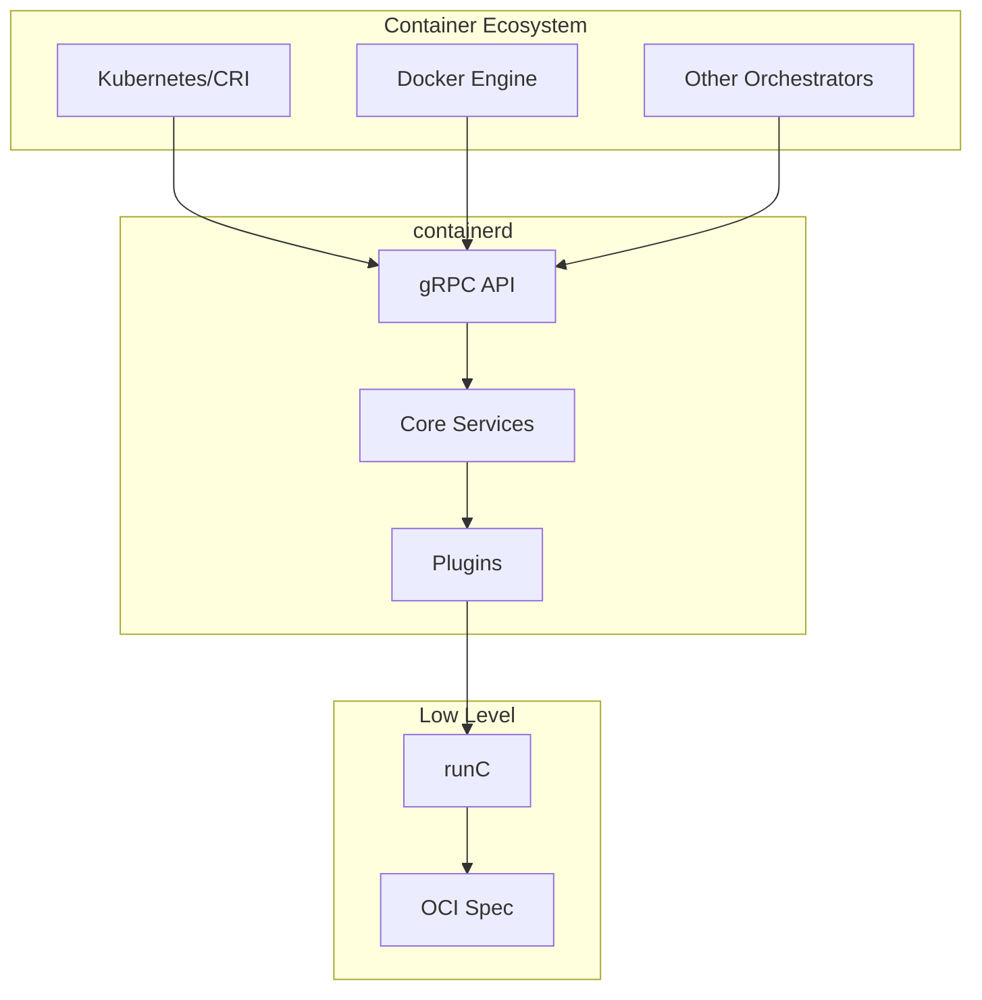
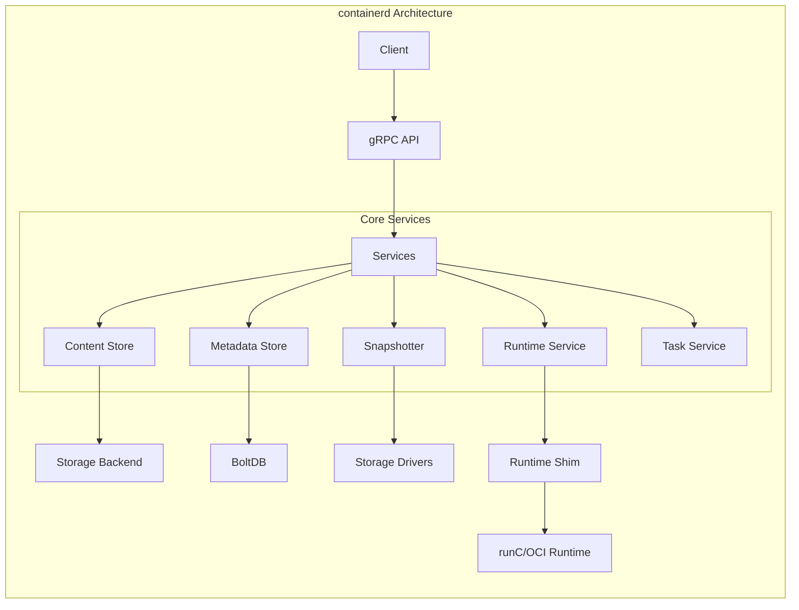
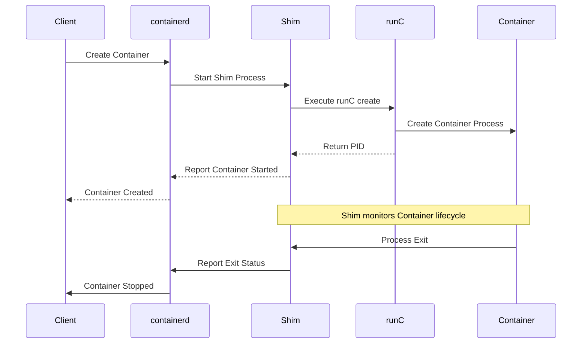
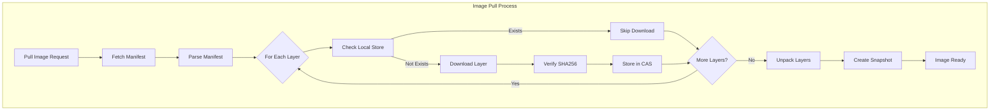
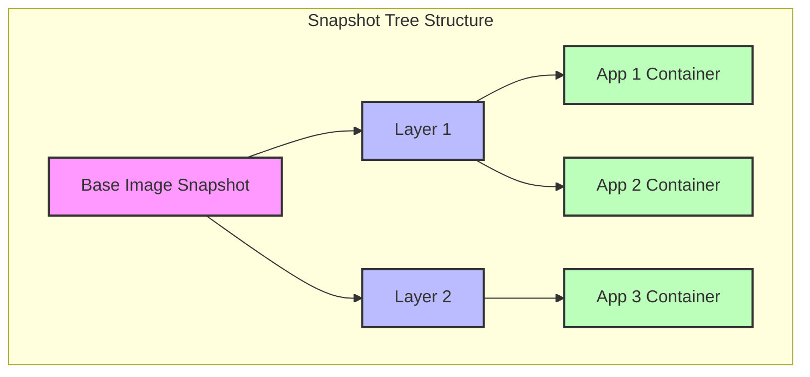
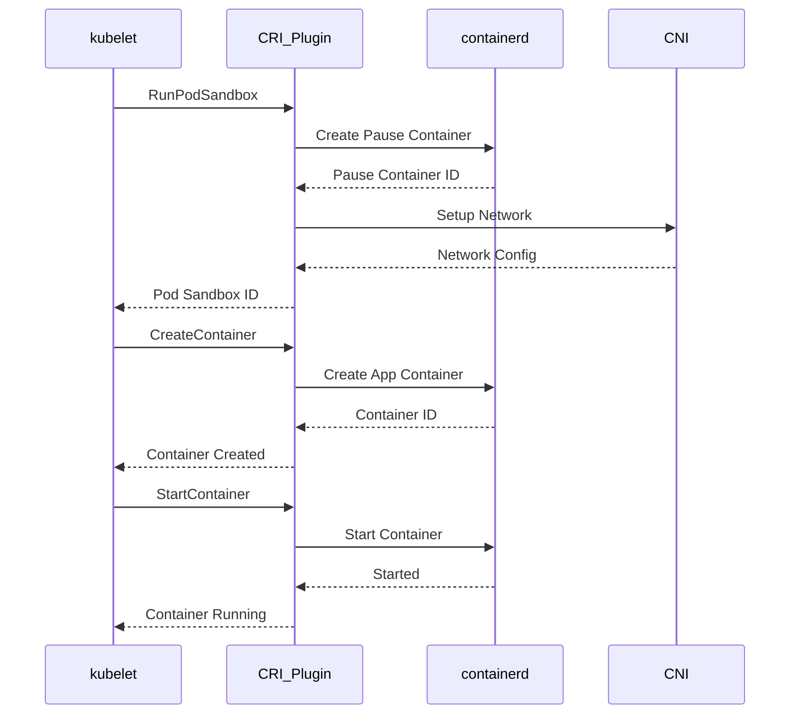
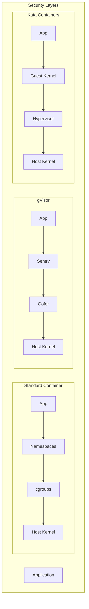
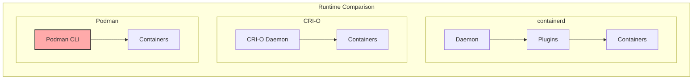

# containerd

containerdは、CNCFがホストするオープンソースのコンテナランタイムであり、現代のコンテナエコシステムにおいて中核的な役割を果たしています。DockerやKubernetesなどの上位レイヤーのコンテナ管理システムは、実際のコンテナライフサイクル管理をcontainerdに委譲することで、シンプルで堅牢なアーキテクチャを実現しています。containerdは、コンテナイメージの管理、コンテナの実行、ストレージとネットワークの管理といった基本的な機能を提供し、これらの機能を統一されたAPIを通じて公開します。

コンテナ技術の進化において、containerdは重要な転換点を表しています。当初、Dockerはモノリシックなアーキテクチャを採用していましたが、コンテナ技術の成熟とともに、より小さく専門化されたコンポーネントへの分離が求められるようになりました。containerdは、この要求に応える形で、Dockerから分離されたコンテナランタイムとして誕生しました[^1]。この分離により、異なるオーケストレーターやツールが共通のランタイムを利用できるようになり、エコシステム全体の相互運用性が向上しました。



## アーキテクチャと設計原則

containerdのアーキテクチャは、モジュラリティと拡張性を重視して設計されています。中核となるのは、gRPCベースのAPIサーバーであり、これが外部クライアントとの通信を担います。内部的には、各機能がサービスとして実装され、それぞれが明確に定義された責任を持ちます。この設計により、必要な機能だけを選択的に有効化でき、また新しい機能を追加する際も既存のコードベースへの影響を最小限に抑えることができます。

containerdの内部アーキテクチャは、以下の主要なコンポーネントから構成されています。コンテンツストアは、コンテナイメージとそのメタデータを管理し、コンテンツアドレッサブルストレージ（CAS）として実装されています。これにより、同一のレイヤーを複数のイメージ間で効率的に共有できます。メタデータストアは、コンテナ、イメージ、スナップショットなどのメタデータを管理し、BoltDBをバックエンドとして使用します。スナップショッターは、コンテナのファイルシステムのスナップショットを管理し、オーバーレイFS、デバイスマッパー、BTRFSなど複数のストレージドライバーをサポートします。



containerdのプラグインシステムは、その拡張性の核心です。プラグインは、初期化時に登録され、依存関係に基づいて順序付けられて起動されます。各プラグインは、特定のインターフェースを実装し、他のプラグインが提供するサービスを利用できます。この設計により、新しいスナップショッター、ランタイム、コンテンツストアの実装を容易に追加できます。

## ランタイムシムとプロセス管理

containerdにおける最も興味深い設計決定の一つは、ランタイムシムの導入です。シムは、containerdデーモンとコンテナプロセスの間に位置する軽量なプロセスで、コンテナのライフサイクル全体を通じて存在します。この設計により、containerdデーモンはコンテナプロセスの親プロセスである必要がなくなり、デーモンの再起動やアップグレードがコンテナの実行に影響を与えないようになっています[^2]。

シムプロセスは、各コンテナに対して個別に起動され、以下の責任を持ちます。まず、OCI準拠のランタイム（通常はrunC）を起動し、コンテナプロセスを作成します。次に、コンテナプロセスの標準入出力をリダイレクトし、ログの収集や対話的なセッションのサポートを可能にします。また、コンテナプロセスの終了を監視し、終了ステータスをcontainerdに報告します。さらに、コンテナプロセスがゾンビプロセスにならないよう、適切にreapします。



シムのもう一つの重要な役割は、TTYサポートとリサイズ処理です。対話的なコンテナセッションでは、シムがpseudo-TTYを管理し、ターミナルのリサイズイベントをコンテナ内のプロセスに伝播します。これにより、ユーザーは通常のシェルセッションと同様の体験を得ることができます。

## イメージ管理とコンテンツアドレッサブルストレージ

containerdのイメージ管理システムは、OCI Image Specification[^3]に準拠し、効率的なストレージと配布を実現しています。コンテンツアドレッサブルストレージ（CAS）の採用により、同一のコンテンツは一度だけ保存され、異なるイメージ間でレイヤーを共有できます。各レイヤーは、その内容のSHA256ハッシュによって識別され、これにより整合性の検証と重複排除が自動的に行われます。

イメージのpull操作は、複数のステップから構成される複雑なプロセスです。まず、レジストリからマニフェストを取得し、イメージの構成を理解します。次に、各レイヤーを並行してダウンロードし、ローカルのコンテンツストアに保存します。ダウンロード中は、各レイヤーの進捗を追跡し、失敗した場合は自動的にリトライします。すべてのレイヤーがダウンロードされた後、それらを展開してスナップショットを作成します。



containerdのコンテンツストアは、レイヤーの共有を最大化するよう設計されています。例えば、同じベースイメージを使用する複数のアプリケーションイメージがある場合、ベースイメージのレイヤーは一度だけストレージに保存されます。この最適化により、ディスク使用量が大幅に削減され、イメージのpull時間も短縮されます。

## スナップショット管理とストレージドライバー

スナップショット管理は、containerdの中核機能の一つであり、コンテナのファイルシステムを効率的に管理します。スナップショッターインターフェースは、異なるストレージバックエンドを抽象化し、統一されたAPIを提供します。各スナップショッターは、親子関係を持つスナップショットのツリー構造を管理し、効率的なクローンとレイヤー化を可能にします。

オーバーレイFSスナップショッターは、最も一般的に使用される実装です。これは、Linuxカーネルのオーバーレイファイルシステムを利用し、複数の読み取り専用レイヤーと一つの書き込み可能レイヤーを組み合わせて、統合されたファイルシステムビューを提供します。オーバーレイFSの利点は、その単純さと効率性にあり、ほとんどのLinuxディストリビューションでサポートされています。



デバイスマッパースナップショッターは、より高度な機能を提供しますが、設定が複雑です。これは、LVMのシンプロビジョニング機能を使用し、ブロックレベルでのスナップショットを作成します。各コンテナは独自のブロックデバイスを持ち、これによりI/Oパフォーマンスの予測可能性が向上します。しかし、デバイスマッパーの設定と管理は複雑であり、適切なストレージプールのサイジングが必要です。

BTRFSスナップショッターは、BTRFSファイルシステムのネイティブなスナップショット機能を利用します。BTRFSは、Copy-on-Write（CoW）ファイルシステムであり、効率的なスナップショットとクローンをサポートします。しかし、BTRFSの採用は限定的であり、パフォーマンスと安定性の懸念から、多くの本番環境では使用されていません。

## CRIの実装とKubernetesとの統合

Container Runtime Interface（CRI）[^4]は、Kubernetesがコンテナランタイムと通信するための標準化されたインターフェースです。containerdは、CRIプラグインを通じてこのインターフェースを実装し、Kubernetesのデフォルトランタイムとして広く採用されています。CRIの実装により、KubernetesはDockerデーモンを介さずに直接containerdと通信でき、これによりアーキテクチャが簡素化され、パフォーマンスが向上しました。

CRIプラグインは、Kubernetesのポッドとコンテナの概念をcontainerdの低レベルプリミティブにマッピングします。ポッドは、共有ネットワーク名前空間を持つコンテナのグループとして実装され、pauseコンテナがこの名前空間を保持します。各アプリケーションコンテナは、pauseコンテナのネットワーク名前空間に参加し、localhost通信が可能になります。



CRIプラグインは、コンテナのリソース管理も担当します。cgroupsを使用してCPU、メモリ、I/Oの制限を設定し、Kubernetesのリソース要求と制限を実装します。また、デバイスプラグインAPIをサポートし、GPUなどの特殊なハードウェアリソースへのアクセスを管理します。

## セキュリティとサンドボックス

containerdは、複数のレベルでセキュリティを提供します。基本的なレベルでは、Linuxの名前空間とcgroupsを使用してコンテナを分離します。しかし、より強力な分離が必要な場合、containerdは複数のサンドボックス技術をサポートします。

gVisorとの統合により、containerdはユーザー空間でのシステムコールインターセプションを提供します。gVisorは、コンテナ内のアプリケーションとホストカーネルの間に追加の分離レイヤーを提供し、カーネルの攻撃対象面を大幅に削減します[^5]。ただし、この追加の分離は、パフォーマンスのオーバーヘッドを伴います。

Kata Containersとの統合は、別のアプローチを提供します。各コンテナを軽量な仮想マシンで実行することで、ハードウェアレベルの分離を実現します。これにより、共有カーネルの脆弱性からの保護が強化されますが、起動時間とメモリ使用量が増加します。



SELinuxとAppArmorのサポートにより、containerdは強制アクセス制御（MAC）を提供します。これらのセキュリティモジュールは、コンテナプロセスがアクセスできるリソースを細かく制御し、侵害された場合の影響を限定します。containerdは、コンテナごとに異なるセキュリティプロファイルを適用でき、アプリケーションの要件に応じてセキュリティレベルを調整できます。

## パフォーマンス特性と最適化

containerdのパフォーマンスは、多くの要因によって影響を受けます。イメージのpull性能は、並行ダウンロードの数、レジストリの帯域幅、ローカルストレージの速度に依存します。containerdは、デフォルトで3つの並行ダウンロードを実行しますが、この値は設定可能です。また、レイヤーの展開は、利用可能なCPUコアを最大限活用するよう並列化されています。

コンテナの起動時間は、イメージのサイズ、スナップショッターの種類、ランタイムの初期化時間によって決まります。オーバーレイFSを使用した場合、コンテナの起動は通常数百ミリ秒で完了します。しかし、初回起動時にはイメージの展開が必要なため、より長い時間がかかる場合があります。containerdは、頻繁に使用されるイメージのスナップショットをキャッシュし、起動時間を最適化します。

メモリ使用量は、管理するコンテナとイメージの数に比例します。containerdデーモン自体のメモリフットプリントは比較的小さく、通常は数十MBから数百MBの範囲です。しかし、大規模なデプロイメントでは、メタデータストアのサイズが増大し、より多くのメモリが必要になる場合があります。定期的なガベージコレクションにより、使用されていないイメージとコンテナのメタデータを削除し、メモリ使用量を制御できます。

## 他のコンテナランタイムとの比較

containerdと他のコンテナランタイムを比較する際、それぞれの設計哲学と使用ケースを理解することが重要です。CRI-Oは、Kubernetesに特化したランタイムとして設計され、最小限の機能セットを提供します。CRI-Oは、Kubernetesのワークロードに必要な機能のみを実装し、それ以外の機能を省くことで、攻撃対象面を削減しています。一方、containerdは、より汎用的なランタイムとして設計され、KubernetesだけでなくDockerや他のオーケストレーターもサポートします。

Podmanは、デーモンレスアーキテクチャを採用し、各コンテナ操作を独立したプロセスとして実行します。これにより、単一障害点が排除され、rootless実行が容易になります。しかし、デーモンレスアーキテクチャは、状態管理とイベント処理において課題があり、大規模なデプロイメントでは管理が複雑になる可能性があります。containerdは、中央集権的なデーモンアーキテクチャを採用することで、効率的な状態管理とイベント処理を実現しています。



パフォーマンスの観点から、containerdとCRI-Oは同様の特性を示します。両者ともrunCを基盤として使用し、同じOCI仕様に準拠しています。主な違いは、機能の範囲とエコシステムのサポートにあります。containerdは、より成熟したエコシステムを持ち、多くのツールとの統合が確立されています。

## トラブルシューティングとデバッグ

containerdのトラブルシューティングには、複数のレベルでのアプローチが必要です。ログ分析は、問題診断の第一歩です。containerdは、構造化ログを出力し、各操作にコンテキスト情報を含めます。ログレベルは設定可能で、詳細なデバッグ情報を取得できます。

ctrコマンドラインツールは、containerdと直接対話するための主要なインターフェースです。これを使用して、コンテナ、イメージ、スナップショットの状態を検査できます。また、名前空間の概念により、異なるクライアント（DockerとKubernetesなど）が使用するリソースを分離して表示できます。

```bash
# List containers in the k8s.io namespace
ctr -n k8s.io containers list

# Inspect a specific container
ctr -n k8s.io containers info <container-id>

# View snapshots
ctr -n k8s.io snapshots list

# Debug plugin registration
ctr plugins list
```

メトリクスの収集と分析も重要です。containerdは、Prometheusフォーマットでメトリクスをエクスポートし、操作のレイテンシ、エラー率、リソース使用量を追跡できます。これらのメトリクスは、パフォーマンスの問題や異常な動作を特定するのに役立ちます。

## 実装上の考慮事項

containerdを本番環境で使用する際には、いくつかの重要な考慮事項があります。まず、適切なストレージドライバーの選択が重要です。ほとんどの場合、オーバーレイFSが推奨されますが、特定のワークロードでは他のオプションが適している場合があります。例えば、大量の小さなファイルを扱うワークロードでは、デバイスマッパーのパフォーマンスが優れている場合があります。

ガベージコレクションの設定は、ディスク使用量を制御する上で重要です。containerdは、使用されていないイメージとコンテナを自動的に削除しますが、この動作は設定可能です。保持期間と閾値を適切に設定することで、ディスク容量の枯渇を防ぎながら、必要なイメージの再ダウンロードを最小限に抑えることができます。

高可用性の要件がある場合、containerdの状態の永続性について理解することが重要です。containerdは、すべてのメタデータをローカルのBoltDBに保存し、この情報はデーモンの再起動後も保持されます。しかし、複数のノード間での状態の同期は、上位レイヤー（Kubernetesなど）の責任です。

セキュリティの観点から、最小権限の原則を適用することが重要です。containerdは通常rootとして実行されますが、rootlessモードもサポートされています。rootlessモードでは、一部の機能が制限されますが、セキュリティが向上します。また、各コンテナに適切なSeccompプロファイルとケーパビリティを設定することで、攻撃対象面を削減できます。

containerdは、現代のコンテナエコシステムにおいて不可欠なコンポーネントとして確立されています。その設計は、シンプルさ、拡張性、信頼性のバランスを取り、様々な使用ケースに対応しています。継続的な開発により、新しい機能とパフォーマンスの改善が追加されていますが、後方互換性と安定性への commitment は維持されています。エンジニアがcontainerdを理解し、効果的に使用することで、スケーラブルで信頼性の高いコンテナインフラストラクチャを構築できます。

[^1]: containerd: An industry-standard container runtime, https://containerd.io/

[^2]: Michael Crosby, "containerd Deep Dive", KubeCon + CloudNativeCon North America 2017

[^3]: OCI Image Format Specification, https://github.com/opencontainers/image-spec

[^4]: Kubernetes Container Runtime Interface (CRI) Specification, https://github.com/kubernetes/cri-api

[^5]: gVisor: A container sandbox runtime, https://gvisor.dev/docs/