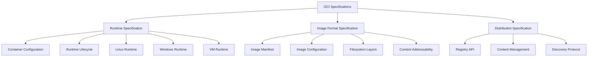
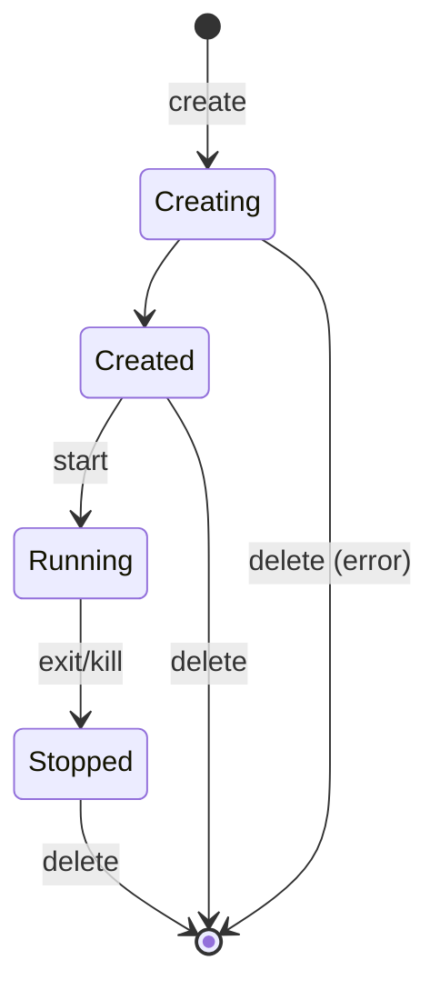
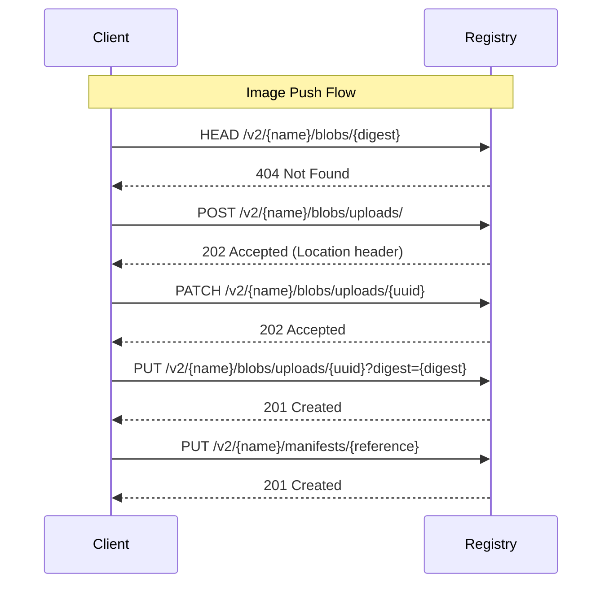
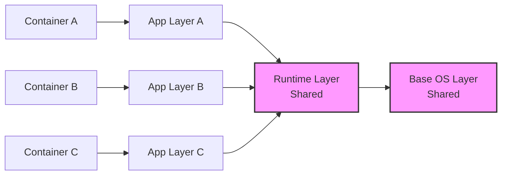

# OCI（Open Container Initiative）

コンテナ技術は2013年のDockerの登場以降、急速に普及し、アプリケーションのパッケージングと配布の標準的な手法となった。しかし、複数のコンテナランタイムやレジストリが登場するにつれ、相互運用性の欠如が大きな課題として浮上した。この状況を受けて、2015年6月にLinux Foundationの支援のもと、Docker社とCoreOS社を中心にOpen Container Initiative（OCI）が設立された[^1]。OCIは、コンテナ技術の標準化を通じて、ベンダーロックインを防ぎ、エコシステム全体の健全な発展を促進することを目的としている。

OCIの仕様は、コンテナエコシステムの基盤となる3つの主要な仕様から構成されている。Runtime Specification（runtime-spec）はコンテナの実行環境を定義し、Image Format Specification（image-spec）はコンテナイメージのフォーマットを規定し、Distribution Specification（distribution-spec）はコンテナイメージの配布方法を標準化している[^2]。これらの仕様は相互に補完し合い、コンテナのライフサイクル全体をカバーする包括的な標準を形成している。



## Runtime Specification

Runtime Specificationは、コンテナランタイムが実装すべきインターフェースと動作を定義している。この仕様の中核は、コンテナの設定を記述するconfig.jsonファイルと、コンテナのライフサイクルを管理するための操作セットである。config.jsonは、コンテナのルートファイルシステム、実行するプロセス、環境変数、リソース制限、セキュリティ設定など、コンテナの実行に必要なすべての情報を含む包括的な設定ファイルである[^3]。

```json
{
  "ociVersion": "1.0.2",
  "process": {
    "terminal": false,
    "user": {
      "uid": 1000,
      "gid": 1000
    },
    "args": ["/bin/sh"],
    "env": [
      "PATH=/usr/local/sbin:/usr/local/bin:/usr/sbin:/usr/bin:/sbin:/bin",
      "TERM=xterm"
    ],
    "cwd": "/",
    "capabilities": {
      "bounding": ["CAP_AUDIT_WRITE", "CAP_KILL", "CAP_NET_BIND_SERVICE"],
      "effective": ["CAP_AUDIT_WRITE", "CAP_KILL"],
      "permitted": ["CAP_AUDIT_WRITE", "CAP_KILL"]
    }
  },
  "root": {
    "path": "rootfs",
    "readonly": true
  },
  "linux": {
    "namespaces": [
      {"type": "pid"},
      {"type": "network"},
      {"type": "ipc"},
      {"type": "uts"},
      {"type": "mount"}
    ]
  }
}
```

Runtime Specificationは、プラットフォーム固有の実装詳細を抽象化しながら、一貫性のあるコンテナ実行環境を提供する。Linux環境では、namespaces、cgroups、capabilities、seccomp、AppArmor/SELinuxなどのカーネル機能を活用してコンテナの分離とセキュリティを実現する。Windows環境では、Windows Containersの機能を使用し、VM環境では仮想化技術を活用する。この抽象化により、異なるプラットフォーム上で同じコンテナイメージを実行できる可搬性が実現される。

コンテナのライフサイクル管理は、create、start、kill、deleteといった基本的な操作を通じて行われる。これらの操作は、コンテナランタイムが実装すべき最小限のインターフェースを定義している。createフェーズでは、config.jsonに基づいてコンテナ環境を準備し、startフェーズで実際にプロセスを起動する。この2段階のアプローチにより、コンテナの初期化と実行を分離し、より柔軟な制御が可能になる。



## Image Format Specification

Image Format Specificationは、コンテナイメージの構造とフォーマットを定義している。OCIイメージは、レイヤー化されたファイルシステム、設定情報、メタデータから構成される。この仕様の重要な特徴は、コンテンツアドレッシングを採用していることである。すべてのコンポーネントは、その内容のSHA256ハッシュによって識別され、これによりイメージの完全性と不変性が保証される[^4]。

イメージマニフェストは、イメージを構成するすべてのコンポーネントへの参照を含むJSONドキュメントである。マニフェストには、設定オブジェクトへの参照と、ファイルシステムレイヤーへの参照のリストが含まれる。各レイヤーは、前のレイヤーに対する差分として表現され、Union File Systemの概念に基づいて積み重ねられる。

```json
{
  "schemaVersion": 2,
  "mediaType": "application/vnd.oci.image.manifest.v1+json",
  "config": {
    "mediaType": "application/vnd.oci.image.config.v1+json",
    "size": 1470,
    "digest": "sha256:c5b1261d6d3e43071626931fc004f70149baeba2c8ec672bd4f27761f8e1ad6b"
  },
  "layers": [
    {
      "mediaType": "application/vnd.oci.image.layer.v1.tar+gzip",
      "size": 977,
      "digest": "sha256:6c02e65f1f8b6c0e8f4ed6e0a5d9c622f22b8e7b7d26c9c5e3e7e8c0f8d2a3c4e5"
    },
    {
      "mediaType": "application/vnd.oci.image.layer.v1.tar+gzip",
      "size": 1024,
      "digest": "sha256:8f4ed6e0a5d9c622f22b8e7b7d26c9c5e3e7e8c0f8d2a3c4e5f6a7b8c9d0e1f2"
    }
  ]
}
```

イメージ設定は、コンテナの実行時設定と履歴情報を含むJSONドキュメントである。これには、環境変数、実行コマンド、作業ディレクトリ、ポート情報などの実行時パラメータと、各レイヤーの作成コマンドや作成時刻などの履歴情報が含まれる。この設定は、Runtime Specificationのconfig.jsonを生成するための基礎となる。

レイヤーの実装では、各レイヤーはtar形式でアーカイブされ、オプションでgzipやzstdなどで圧縮される。レイヤーの適用順序は重要であり、下位のレイヤーから順に適用される。ファイルの削除は、whiteoutファイル（.wh.プレフィックスを持つ特殊なファイル）によって表現される。この仕組みにより、効率的な差分管理とストレージの最適化が実現される。

## Distribution Specification

Distribution Specificationは、コンテナイメージをレジストリ間で配布するためのHTTP APIを定義している。この仕様は、Docker Registry HTTP API V2を基礎としており、RESTfulな設計原則に従っている[^5]。APIは、イメージの検索、アップロード、ダウンロード、削除などの基本的な操作をサポートし、大規模なイメージの効率的な転送を可能にする。

レジストリAPIの中核は、マニフェストとブロブ（Binary Large Object）の管理である。マニフェストはイメージのメタデータを含み、ブロブは実際のレイヤーデータと設定データを含む。APIは、これらのコンポーネントを個別に管理し、重複を避けるための最適化を提供する。



チャンクアップロードは、大きなレイヤーを効率的に転送するための重要な機能である。クライアントは、レイヤーを複数のチャンクに分割してアップロードでき、ネットワークの中断に対する耐性を提供する。各チャンクは、Range headerを使用して特定の位置にアップロードされ、最終的に完全なブロブとして結合される。

認証と認可は、Bearer tokenスキームを使用して実装される。クライアントは、認証サーバーからトークンを取得し、そのトークンを使用してレジストリAPIにアクセスする。この分離により、柔軟な認証メカニズムの実装が可能になり、企業環境での統合が容易になる。

## 実装の詳細と性能特性

OCIランタイムの実装において、パフォーマンスの観点から重要なのは、コンテナの起動時間とリソースのオーバーヘッドである。runcのような低レベルランタイムは、直接システムコールを使用してコンテナを作成するため、起動時間は通常数十ミリ秒程度である。一方、containerdやCRI-Oのような高レベルランタイムは、追加の抽象化層を提供するため、わずかに長い起動時間を要する。

メモリ使用量の観点では、各コンテナは独立したnamespaceとcgroupsの設定を持つが、カーネルレベルでの共有により、実際のオーバーヘッドは最小限に抑えられる。典型的なLinuxコンテナのメモリオーバーヘッドは、ホストプロセスと比較して1-2MB程度である。これは、仮想マシンの数百MBから数GBのオーバーヘッドと比較して、極めて効率的である。

ストレージの効率性は、レイヤーの共有とコンテンツアドレッシングによって最適化される。同じベースイメージを使用する複数のコンテナは、共通のレイヤーを共有するため、ディスク使用量が大幅に削減される。また、デduplicationとコンプレッションにより、ネットワーク転送時のデータ量も最小化される。



## セキュリティアーキテクチャ

OCIのセキュリティモデルは、多層防御の原則に基づいて設計されている。最も基本的なレベルでは、Linux namespacesによるプロセス、ネットワーク、ファイルシステムの分離が行われる。これに加えて、cgroupsによるリソース制限、capabilitiesによる権限の制限、seccompによるシステムコールのフィルタリング、そしてLSM（Linux Security Module）によるMACが適用される。

イメージの完全性は、コンテンツアドレッシングとデジタル署名によって保証される。各レイヤーとマニフェストは、そのSHA256ハッシュによって識別されるため、改ざんは即座に検出される。さらに、Notaryのような署名システムを使用することで、イメージの出所と完全性を暗号学的に検証できる。

ランタイムセキュリティでは、最小権限の原則が適用される。デフォルトでは、コンテナ内のプロセスは限定されたcapabilitiesセットのみを持ち、危険なシステムコールはseccompによってブロックされる。また、ユーザーnamespaceを使用することで、コンテナ内のrootユーザーをホスト上の非特権ユーザーにマッピングし、権限昇格攻撃のリスクを軽減する。

## 相互運用性とエコシステム

OCIの最大の成果の一つは、コンテナエコシステムにおける相互運用性の実現である。OCI準拠のイメージは、Docker、containerd、CRI-O、Podmanなど、さまざまなランタイムで実行できる。同様に、これらのランタイムで作成されたイメージは、OCI準拠のレジストリに保存し、他のランタイムで使用できる。

この相互運用性は、Kubernetesのようなオーケストレーションプラットフォームにとって特に重要である。Container Runtime Interface（CRI）は、OCIランタイムの上に構築され、Kubernetesが異なるコンテナランタイムを統一的に管理できるようにする。これにより、ユーザーは自身の要件に最適なランタイムを選択できる柔軟性を得る。

エコシステムの発展により、OCIは単なる仕様から、実装、ツール、ベストプラクティスを含む包括的なフレームワークへと進化している。buildah、skopeo、umociなどのツールは、OCI仕様に基づいてイメージの構築、検査、操作を行う。これらのツールは、Dockerデーモンに依存することなく、OCI準拠のイメージを直接操作できる。

## パフォーマンス最適化の実践

実運用環境でのOCIコンテナのパフォーマンス最適化には、複数の側面からのアプローチが必要である。イメージサイズの最適化は、起動時間とネットワーク転送時間に直接影響する。マルチステージビルドを使用して、実行時に不要なビルド依存関係を除外し、最小限のベースイメージ（Alpine Linux、distrolessなど）を選択することで、イメージサイズを大幅に削減できる。

レイヤーキャッシングの効果的な活用も重要である。Dockerfileやbuildahスクリプトでは、変更頻度の低い命令を先に配置し、頻繁に変更される命令を後に配置することで、キャッシュヒット率を向上させる。また、レイヤーの数を適切に管理し、過度に細分化されたレイヤーによるオーバーヘッドを避ける。

ランタイムパフォーマンスの観点では、cgroupsの設定を適切に調整することが重要である。CPU quotaとperiodの設定により、CPUリソースの公平な配分を実現しながら、バースト的な負荷に対応できる。メモリ制限は、OOMキラーによる予期しない終了を避けるため、アプリケーションの実際の使用量に基づいて慎重に設定する必要がある。

## 実装上の考慮事項

OCI仕様を実装する際には、いくつかの重要な設計上の決定が必要となる。ファイルシステムドライバの選択は、パフォーマンスとストレージ効率に大きく影響する。OverlayFS、DeviceMapper、Btrfs、ZFSなど、各ドライバには固有のトレードオフがある。OverlayFSは最も広く使用されており、良好なパフォーマンスと互換性を提供するが、inode使用量が多いという欠点がある。

ネットワーキングの実装では、bridge、host、none、overlayなど、複数のネットワークモードをサポートする必要がある。各モードは異なるユースケースに適しており、パフォーマンスとセキュリティのトレードオフを持つ。例えば、hostモードは最高のネットワークパフォーマンスを提供するが、ネットワークの分離は失われる。

ログ管理も重要な実装の側面である。コンテナのログは、json-file、syslog、journald、fluentdなど、様々なドライバを通じて収集できる。各ドライバは、パフォーマンス、永続性、統合の容易さにおいて異なる特性を持つ。大規模な環境では、ログの集中管理とローテーションの戦略が不可欠である。

[^1]: Open Container Initiative. "About the Open Container Initiative." https://opencontainers.org/about/overview/

[^2]: Open Container Initiative. "OCI Specifications." https://github.com/opencontainers/specs

[^3]: Open Container Initiative. "Runtime Specification v1.0.2." https://github.com/opencontainers/runtime-spec/blob/v1.0.2/spec.md

[^4]: Open Container Initiative. "Image Format Specification v1.0.2." https://github.com/opencontainers/image-spec/blob/v1.0.2/spec.md

[^5]: Open Container Initiative. "Distribution Specification v1.0.1." https://github.com/opencontainers/distribution-spec/blob/v1.0.1/spec.md