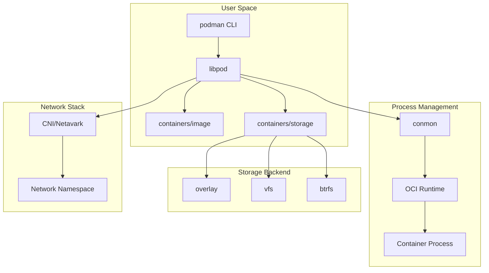
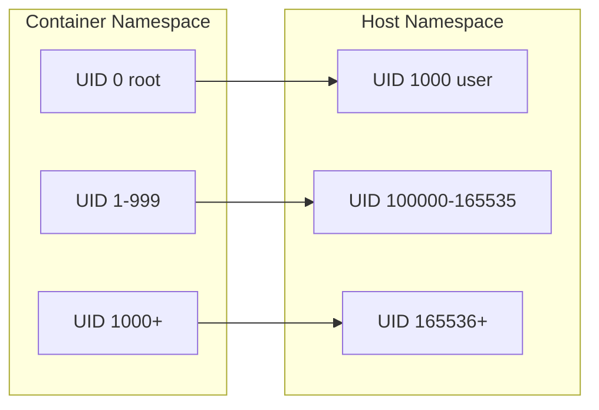
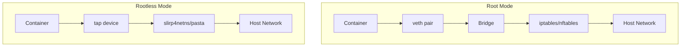
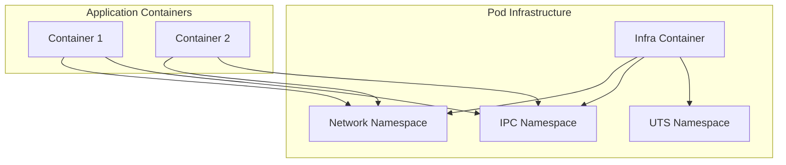

# Podman

Podmanは、OCI準拠のコンテナエンジンとして設計された、デーモンレスなコンテナ管理ツールである。Red Hatが主導して開発されており、Dockerとの高い互換性を保ちながら、根本的に異なるアーキテクチャ設計を採用している。その名称は「Pod Manager」の略であり、Kubernetesのpod概念をローカル環境で実現する機能を持つことに由来する。

Podmanの最大の特徴は、特権デーモンを必要としないアーキテクチャにある。従来のDockerがdockerdという常駐デーモンを介してコンテナを管理するのに対し、Podmanは各コンテナプロセスを直接fork/execすることで、より単純かつセキュアな実行モデルを実現している。この設計選択は、単なる実装の違いではなく、コンテナ技術のセキュリティモデルと運用形態に関する根本的な思想の違いを反映している。

## アーキテクチャの詳細

Podmanのアーキテクチャは、複数のコンポーネントが協調して動作する分散型の設計となっている。中核となるコンポーネントは、libpod（Podmanライブラリ）、conmon（コンテナモニター）、そしてOCIランタイム（通常はruncまたはcrun）である。



libpodは、Podmanの中核ライブラリであり、コンテナのライフサイクル管理、イメージの取り扱い、ネットワーク設定などの主要な機能を提供する。このライブラリは、containers/imageとcontainers/storageという二つの重要なライブラリに依存している。containers/imageは、OCI Image Specification[^1]に準拠したイメージの取得、検証、変換を担当し、containers/storageは、レイヤードファイルシステムの管理を行う。

conmonは、各コンテナプロセスの親プロセスとして動作する軽量なモニタープログラムである。conmonの主な役割は、コンテナプロセスの標準入出力のリダイレクト、終了ステータスの監視、そしてコンテナプロセスがゾンビプロセスにならないようにすることである。Podman本体がコンテナを起動した後に終了しても、conmonがコンテナプロセスを管理し続けることで、デタッチドモードでのコンテナ実行が可能となる。

## ルートレスコンテナの実現

Podmanの革新的な機能の一つが、完全なルートレスコンテナの実現である。これは、特権ユーザー権限を一切必要とせずに、一般ユーザーがコンテナを実行できる仕組みである。この機能は、Linuxカーネルのuser namespace機能を活用することで実現されている。

user namespaceは、プロセスが見るUID/GIDの名前空間を分離する機能である。これにより、コンテナ内ではroot（UID 0）として動作するプロセスが、ホスト側では一般ユーザーのUIDにマッピングされる。Podmanは、この機能を使用して、コンテナ内のrootユーザーをホスト側の実行ユーザーにマッピングし、その他のUIDは/etc/subuidと/etc/subgidで定義された範囲にマッピングする。



この仕組みにより、コンテナ内でroot権限を必要とするアプリケーションも、ホスト側では一般ユーザー権限で安全に実行できる。ただし、ルートレスモードにはいくつかの制限がある。例えば、ホストのネットワークインターフェースに直接アクセスすることはできず、ポート1024未満へのバインドも通常は許可されない。これらの制限は、slirp4netnsやpasta[^2]などのユーザーモードネットワークスタックを使用することで部分的に回避できる。

## ネットワーキングアーキテクチャ

Podmanのネットワーキングは、CNI（Container Network Interface）またはNetavarkという二つのバックエンドをサポートしている。CNIは、Kubernetesでも使用される標準的なネットワークプラグインインターフェースであり、Podmanは長らくこれを採用してきた。しかし、より高度な機能とパフォーマンスを実現するため、Rustで実装されたNetavarkが新たに開発された。

Netavarkは、Aardvark-dnsと組み合わせて使用され、コンテナ間の名前解決機能を提供する。各ネットワークは独立したブリッジインターフェースを持ち、iptablesまたはnftablesを使用してNATとポートフォワーディングを設定する。ルートレスモードでは、前述のslirp4netnsまたはpastaを使用して、ユーザー権限でネットワーク機能を実現する。



ネットワーク設定は、JSON形式の設定ファイルで管理され、複数のネットワークを定義して使い分けることができる。各コンテナは複数のネットワークに接続でき、それぞれ異なるIPアドレスを持つことができる。この柔軟性により、複雑なマイクロサービスアーキテクチャも容易に実現できる。

## ストレージドライバとイメージ管理

Podmanのストレージ層は、containers/storageライブラリによって実装されており、複数のストレージドライバをサポートしている。主要なドライバには、overlay、vfs、btrfs、zfsなどがある。最も一般的に使用されるのはoverlayドライバであり、OverlayFS[^3]を使用してレイヤードファイルシステムを実現する。

overlayドライバは、読み取り専用の下位レイヤー（lowerdir）と書き込み可能な上位レイヤー（upperdir）を組み合わせて、統合されたファイルシステムビューを提供する。コンテナイメージの各レイヤーは下位レイヤーとして積み重ねられ、コンテナ実行時には新たな上位レイヤーが作成される。この仕組みにより、効率的なストレージ利用とCopy-on-Write（CoW）セマンティクスが実現される。

ルートレスモードでのストレージは、特別な考慮が必要である。OverlayFSの使用にはカーネルの設定に依存し、すべての環境で利用できるわけではない。そのため、ルートレスモードではfuse-overlayfsやvfsドライバが代替として使用される。fuse-overlayfsは、FUSE（Filesystem in Userspace）を使用してユーザー空間でOverlayFSの機能を実現するが、パフォーマンスの低下というトレードオフがある。

## Pod概念とKubernetesとの統合

PodmanのPod機能は、Kubernetesのpod概念をローカル環境で実現するものである。podは、共通のネットワーク名前空間とIPC名前空間を共有する複数のコンテナのグループである。この機能により、密結合したアプリケーションコンポーネントを、Kubernetesと同様の方法で管理できる。



各podには、インフラコンテナと呼ばれる特殊なコンテナが含まれる。このコンテナは、pauseコマンドを実行するだけの最小限のコンテナであり、pod内の他のコンテナが共有する名前空間を保持する役割を持つ。インフラコンテナが存在することで、pod内の他のコンテナが再起動されても、ネットワーク設定やIPアドレスが維持される。

PodmanのPod定義は、Kubernetes YAML形式で出力でき、`podman generate kube`コマンドを使用して、実行中のpodからKubernetesマニフェストを生成できる。逆に、`podman play kube`コマンドでKubernetesマニフェストからpodを作成することも可能である。この双方向の互換性により、ローカル開発環境とKubernetesクラスタ間でのアプリケーションの移行が容易になる。

## systemdとの統合

Podmanとsystemdの統合は、コンテナをシステムサービスとして管理する上で重要な機能である。Podmanは、systemdのユニットファイルを自動生成する機能を提供し、コンテナやpodをsystemdサービスとして登録できる。

`podman generate systemd`コマンドは、実行中のコンテナまたはpodからsystemdユニットファイルを生成する。生成されたユニットファイルには、コンテナの起動、停止、再起動のロジックが含まれ、システム起動時の自動起動も設定できる。さらに、Podman 4.0以降では、Quadlet[^4]という新しい統合方法が導入された。

Quadletは、簡略化されたユニットファイル形式（.container、.volume、.network、.kube）を使用し、systemd-generatorを通じて完全なsystemdユニットファイルを動的に生成する。この仕組みにより、コンテナの定義がより宣言的になり、systemdの依存関係管理やリソース制限機能を直接活用できる。

```ini
# example.container
[Unit]
Description=Example Container
After=network-online.target

[Container]
Image=registry.example.com/myapp:latest
PublishPort=8080:80
Volume=mydata:/data
Environment=NODE_ENV=production

[Service]
Restart=always

[Install]
WantedBy=multi-user.target
```

## セキュリティ機能とポリシー

Podmanは、複数層のセキュリティ機能を提供している。基本的なセキュリティは、Linux名前空間とcapabilityの制限によって実現される。デフォルトでは、コンテナプロセスは必要最小限のcapabilityのみを持ち、不要な権限は削除される。

SELinux統合も重要なセキュリティ機能である。Podmanは、各コンテナに固有のSELinuxコンテキストを割り当て、コンテナ間およびホストシステムとの分離を強化する。コンテナプロセスは`container_t`タイプで実行され、アクセス可能なリソースが制限される。

seccompプロファイルによるシステムコール制限も実装されている。デフォルトのseccompプロファイルは、一般的なアプリケーションには不要な危険なシステムコールをブロックする。必要に応じて、カスタムプロファイルを適用することも可能である。

## パフォーマンス特性と最適化

Podmanのパフォーマンス特性は、使用するストレージドライバ、ネットワークモード、およびランタイム設定に大きく依存する。一般的に、ルートモードでのoverlayドライバとネイティブネットワークの組み合わせが最高のパフォーマンスを提供する。

コンテナ起動時間に関しては、crun[^5]ランタイムの使用により大幅な改善が見られる。crunは、C言語で実装された軽量なOCIランタイムであり、Go言語で実装されたruncと比較して、起動時間とメモリ使用量の両面で優れている。特に、大量のコンテナを頻繁に起動・停止するワークロードでは、この差が顕著に現れる。

イメージのプル操作においては、並列ダウンロードとzstd圧縮のサポートにより、従来のgzip圧縮と比較して大幅な高速化が実現されている。また、イメージレイヤーの共有とデデュプリケーションにより、ストレージ使用量の最適化も図られている。

## APIとリモート操作

Podmanは、Docker互換のREST APIを提供しており、既存のDockerクライアントツールからの移行を容易にしている。このAPIは、Unixソケットまたはネットワークソケット経由でアクセスでき、`podman system service`コマンドで起動できる。

リモート操作のサポートも充実しており、SSH経由でリモートホスト上のPodmanインスタンスを操作できる。この機能により、開発者のローカルマシンからリモートサーバー上のコンテナを透過的に管理できる。接続設定は、`podman system connection`コマンドで管理され、複数のリモートエンドポイントを登録して切り替えることができる。

```bash
# Remote connection setup
podman system connection add prod ssh://user@prod.example.com/run/user/1000/podman/podman.sock
podman --remote ps
```

## 実装の詳細とコードベース

Podmanのコードベースは、主にGo言語で実装されており、モジュール化された設計となっている。主要なパッケージには、libpod（コア機能）、pkg/domain（ビジネスロジック）、cmd/podman（CLIインターフェース）などがある。

エラーハンドリングは、Go言語の慣習に従い、明示的なエラー返却により行われる。各操作は、トランザクション的に設計されており、失敗時には可能な限りロールバックが行われる。例えば、コンテナ作成中にエラーが発生した場合、部分的に作成されたリソース（ネットワーク設定、マウントポイントなど）は自動的にクリーンアップされる。

ロギングシステムは、構造化ログを採用しており、logrusライブラリを使用している。各操作には一意のリクエストIDが割り当てられ、分散トレーシングが可能となっている。これにより、複雑な操作のデバッグとトラブルシューティングが容易になる。

## 今後の技術的方向性

Podmanの開発は活発に続いており、いくつかの重要な技術的改善が計画されている。その一つが、cgroup v2への完全な移行である。cgroup v2は、より一貫性のあるAPIと改善されたリソース管理機能を提供し、Podmanはこれらの機能を最大限活用するよう設計されている。

また、WASM（WebAssembly）コンテナのサポートも実験的に導入されている。WASMランタイムとの統合により、より軽量で高速なコンテナ実行が可能となり、エッジコンピューティングやサーバーレス環境での新たな利用シーンが開拓される。

ネットワーク機能の拡張も続いており、IPv6の完全サポート、マルチキャストトラフィックの処理、より高度なロードバランシング機能などが開発されている。これらの機能により、Podmanはより複雑なネットワークトポロジーとエンタープライズ要件に対応できるようになる。

[^1]: Open Container Initiative (OCI) Image Format Specification v1.0.2, https://github.com/opencontainers/image-spec/blob/v1.0.2/spec.md
[^2]: pasta - Pack A Subtle Tap Abstraction, https://passt.top/passt/about/#pasta-pack-a-subtle-tap-abstraction
[^3]: OverlayFS Documentation, Linux Kernel Documentation, https://www.kernel.org/doc/html/latest/filesystems/overlayfs.html
[^4]: Podman Quadlet Documentation, https://docs.podman.io/en/latest/markdown/podman-systemd.unit.5.html
[^5]: crun - A fast and lightweight fully featured OCI runtime, https://github.com/containers/crun