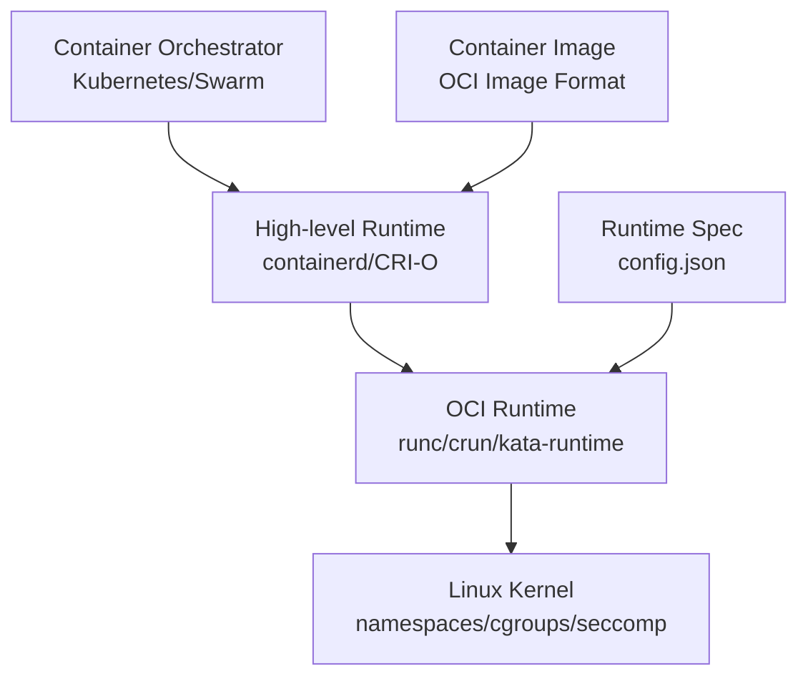
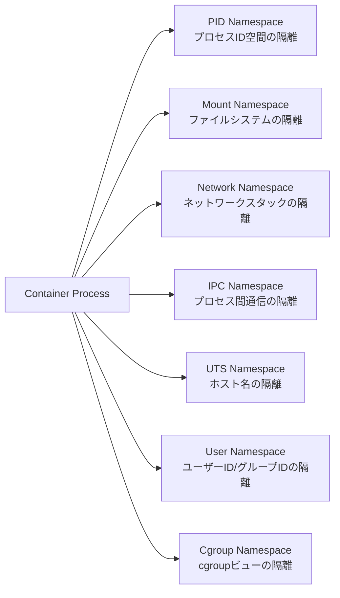
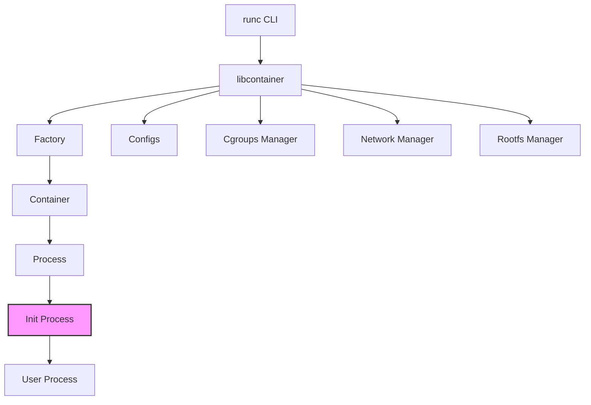
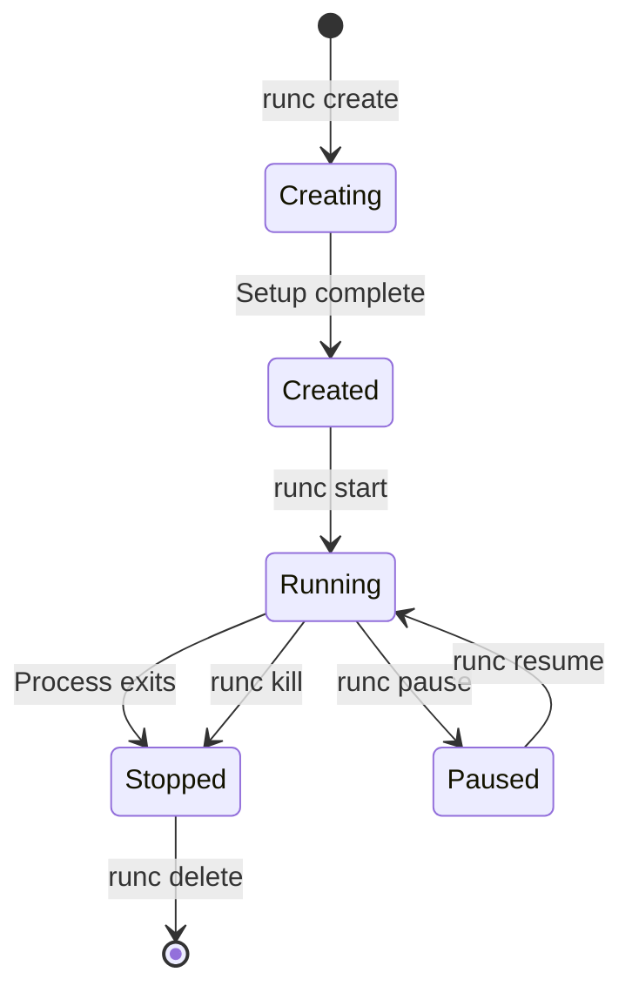
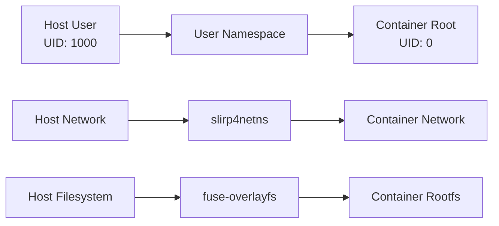

# runc: OCIコンテナランタイムの実装と内部構造

コンテナ技術は現代のクラウドネイティブアプリケーションの基盤となっており、その中核を担うのがコンテナランタイムである。runcは、Open Container Initiative (OCI) 仕様[^1]に準拠した低レベルコンテナランタイムとして、DockerやKubernetesなどの高レベルコンテナプラットフォームの基盤技術となっている。本稿では、runcの内部構造とLinuxカーネル機能との協調動作について、その実装の詳細まで踏み込んで解説する。

[^1]: Open Container Initiative Runtime Specification v1.0.2, https://github.com/opencontainers/runtime-spec

## コンテナランタイムの階層構造

コンテナエコシステムにおいて、runcは低レベルランタイムとして位置づけられる。この階層構造を理解することは、runcの役割と責務を明確にする上で重要である。



高レベルランタイムであるcontainerdやCRI-Oは、イメージ管理、ネットワーク設定、ボリューム管理などの複雑な機能を提供する。一方、runcはOCIランタイム仕様に定義された最小限の機能、すなわちコンテナプロセスの生成と管理に特化している。この分離により、異なるランタイム実装間での互換性が確保され、エコシステムの柔軟性が向上している。

## OCI Runtime Specificationとruncの実装

OCI Runtime Specificationは、コンテナの設定フォーマットとライフサイクル操作を定義している。runcはこの仕様の参照実装として開発され、仕様で定義されたすべての機能を実装している。

仕様の中核となるのは`config.json`ファイルである。このファイルは、コンテナのルートファイルシステム、実行するプロセス、環境変数、リソース制限、セキュリティ設定などを宣言的に記述する。runcはこの設定ファイルを解析し、対応するLinuxカーネル機能を適切に設定することでコンテナ環境を構築する。

```json
{
    "ociVersion": "1.0.2",
    "process": {
        "terminal": true,
        "user": {
            "uid": 0,
            "gid": 0
        },
        "args": [
            "/bin/bash"
        ],
        "env": [
            "PATH=/usr/local/sbin:/usr/local/bin:/usr/sbin:/usr/bin:/sbin:/bin",
            "TERM=xterm"
        ],
        "cwd": "/",
        "capabilities": {
            "bounding": ["CAP_AUDIT_WRITE", "CAP_KILL", "CAP_NET_BIND_SERVICE"],
            "effective": ["CAP_AUDIT_WRITE", "CAP_KILL", "CAP_NET_BIND_SERVICE"],
            "permitted": ["CAP_AUDIT_WRITE", "CAP_KILL", "CAP_NET_BIND_SERVICE"]
        }
    },
    "root": {
        "path": "rootfs",
        "readonly": false
    },
    "mounts": [
        {
            "destination": "/proc",
            "type": "proc",
            "source": "proc"
        },
        {
            "destination": "/dev",
            "type": "tmpfs",
            "source": "tmpfs",
            "options": ["nosuid", "strictatime", "mode=755", "size=65536k"]
        }
    ],
    "linux": {
        "namespaces": [
            {"type": "pid"},
            {"type": "network"},
            {"type": "ipc"},
            {"type": "uts"},
            {"type": "mount"}
        ],
        "resources": {
            "memory": {
                "limit": 536870912
            },
            "cpu": {
                "shares": 1024,
                "quota": 50000,
                "period": 100000
            }
        }
    }
}
```

## Linuxカーネル機能による隔離メカニズム

runcの中核となる機能は、Linuxカーネルが提供するnamespaceとcgroupsを活用したプロセス隔離である。これらの機能により、コンテナ内のプロセスは独立した実行環境を持つことができる。

### Namespaceによる資源の隔離

Linuxカーネルは7種類のnamespace[^2]を提供しており、runcはこれらを組み合わせてコンテナ環境を構築する。各namespaceは特定のシステムリソースの視点を隔離する。

[^2]: Linux namespaces man page, https://man7.org/linux/man-pages/man7/namespaces.7.html



PID namespaceは、コンテナ内のプロセスに独立したプロセスID空間を提供する。コンテナ内の最初のプロセスはPID 1として見え、ホストシステムのプロセス階層から隔離される。Mount namespaceは、コンテナ専用のファイルシステムビューを作成し、ホストのファイルシステムから独立したマウントポイントを管理できる。

Network namespaceは特に重要で、独立したネットワークインターフェース、ルーティングテーブル、ファイアウォールルールを持つ。これにより、各コンテナは独自のIPアドレスを持ち、ポート番号の衝突を回避できる。

User namespaceは、コンテナ内のroot権限をホストの非特権ユーザーにマッピングすることで、セキュリティを大幅に向上させる。この機能により、コンテナ内でroot権限が必要なアプリケーションも、ホストシステムを危険にさらすことなく実行できる。

### Cgroupsによるリソース制御

Control Groups (cgroups) [^3]は、プロセスグループに対するリソース使用量の制限と監視を提供する。runcはcgroups v1とv2の両方をサポートしており、CPU、メモリ、I/O、ネットワークなどのリソースを細かく制御できる。

[^3]: Control Groups v2, https://www.kernel.org/doc/html/latest/admin-guide/cgroup-v2.html

cgroups v2では、統一された階層構造とより洗練されたAPIが提供される。runcは、設定ファイルで指定されたリソース制限を、対応するcgroupコントローラーの設定に変換する。例えば、メモリ制限は`memory.max`ファイルに、CPU制限は`cpu.max`ファイルに書き込まれる。

```
# Memory limit (512MB)
echo "536870912" > /sys/fs/cgroup/container-id/memory.max

# CPU quota (50% of one CPU)
echo "50000 100000" > /sys/fs/cgroup/container-id/cpu.max
```

## runcのアーキテクチャと実装詳細

runcのアーキテクチャは、OCIランタイム仕様を効率的に実装するために最適化されている。主要なコンポーネントは、コマンドラインインターフェース、libcontainer、そして各種ヘルパープロセスから構成される。



### libcontainerの役割

libcontainerは、runcの中核となるライブラリであり、コンテナの作成と管理に必要なすべての低レベル操作を実装している。このライブラリは、もともとDockerの一部として開発されたが、後にruncプロジェクトとして独立した。

libcontainerの主要な責務には、namespace の作成と参加、cgroupsの設定、ルートファイルシステムの準備、セキュリティ機能の適用などが含まれる。これらの操作は、適切な順序で実行される必要があり、エラーハンドリングも重要である。

### Init processの重要性

runcの実装で特に重要なのが、init processの存在である。コンテナを作成する際、runcは最初に特別なinit processを起動する。このプロセスは、コンテナ環境のセットアップを完了させる責任を持つ。

init processは、親プロセス（runc）から必要な情報を受け取り、以下の処理を実行する：

1. 追加のnamespace設定の適用
2. セキュリティ機能（seccomp、AppArmor、SELinux）の有効化
3. ユーザー指定のプロセスへのexec

この二段階のプロセス起動により、権限の昇格を防ぎながら、必要な設定をすべて適用できる。init processは、すべての設定が完了した後、ユーザーが指定したプロセスにexecシステムコールで置き換わるため、追加のオーバーヘッドは発生しない。

## コンテナライフサイクルの管理

OCIランタイム仕様は、コンテナのライフサイクルを明確に定義している。runcは、これらの状態遷移を正確に実装し、各状態で適切な操作を提供する。



### 状態管理とチェックポイント

runcは、コンテナの状態をファイルシステム上に永続化する。デフォルトでは`/run/runc`ディレクトリに状態ファイルが保存される。この状態情報には、コンテナID、プロセスID、作成時刻、現在の状態などが含まれる。

状態管理の実装は、複数のruncプロセスが同じコンテナを操作しようとした場合の競合状態を防ぐために、ファイルロックを使用している。また、プロセスの異常終了やシステムクラッシュに対する耐性も考慮されている。

### CRIUによるチェックポイント/リストア

runcは、CRIU (Checkpoint/Restore In Userspace) [^4]と統合することで、実行中のコンテナのチェックポイント作成とリストアをサポートしている。この機能により、コンテナの状態を完全に保存し、後で復元することができる。

[^4]: CRIU - Checkpoint/Restore In Userspace, https://criu.org/

CRIUは、プロセスのメモリ、ファイルディスクリプタ、ネットワーク接続などの状態をダンプし、後で同じまたは異なるホストで復元できる。runcは、CRIUのAPIをラップし、コンテナ固有の設定を適切に処理する。

## セキュリティ機能の統合

コンテナのセキュリティは多層防御の原則に基づいており、runcは複数のLinuxセキュリティ機能を統合している。これらの機能は、設定ファイルを通じて柔軟に制御できる。

### Seccompによるシステムコールフィルタリング

Seccomp (Secure Computing Mode) は、プロセスが実行できるシステムコールを制限する機能である。runcは、デフォルトのseccompプロファイルを提供し、一般的なコンテナワークロードに必要なシステムコールのみを許可する。

seccompプロファイルは、BPF (Berkeley Packet Filter) プログラムとして実装され、カーネルレベルで高速にフィルタリングを行う。runcのデフォルトプロファイルは、300以上のシステムコールのうち、約50のシステムコールをブロックする。

### Capabilitiesの細分化

Linux capabilitiesは、従来のroot権限を細分化し、必要最小限の権限のみを付与する仕組みである。runcは、OCIランタイム仕様で定義されたcapabilities設定を解析し、適切にプロセスに適用する。

デフォルトでは、コンテナプロセスには限定されたcapabilitiesセットのみが付与される。例えば、`CAP_NET_BIND_SERVICE`（1024番未満のポートへのバインド）、`CAP_KILL`（プロセスへのシグナル送信）などは許可されるが、`CAP_SYS_ADMIN`（システム管理操作）などの強力な権限は付与されない。

### MACシステムとの統合

runcは、AppArmorとSELinux という2つの主要なMandatory Access Control (MAC) システムをサポートしている。これらのシステムは、ファイルアクセス、ネットワーク通信、プロセス間通信などに対する細かいアクセス制御を提供する。

AppArmorの場合、runcはコンテナプロセスに指定されたプロファイルを適用する。SELinuxの場合は、適切なセキュリティコンテキストでプロセスを起動する。これらの設定は、ホストシステムのセキュリティポリシーと協調して動作する必要がある。

## 実装の最適化とパフォーマンス特性

runcの実装には、パフォーマンスとリソース効率を最適化するための様々な工夫が施されている。コンテナの起動時間は、特にサーバーレスコンピューティングやマイクロサービスアーキテクチャにおいて重要な指標となる。

### ファイルシステムの準備

コンテナのルートファイルシステムの準備は、起動時間に大きく影響する。runcは、複数のファイルシステムレイヤーを効率的に組み合わせるために、OverlayFSを活用する。また、bind mountを使用して、ホストのファイルやディレクトリを選択的にコンテナ内に公開する。

ファイルシステムの準備プロセスは、以下の手順で実行される：

1. ルートファイルシステムのマウント
2. 必要なデバイスノードの作成（/dev/null、/dev/zero など）
3. procfs、sysfs、tmpfs などの仮想ファイルシステムのマウント
4. 設定ファイルで指定された追加のマウントポイントの処理

### メモリとCPUのオーバーヘッド

runcそのものは、コンテナの実行中には存在しない。init processがユーザープロセスにexecで置き換わるため、追加のメモリオーバーヘッドはほぼゼロである。CPUオーバーヘッドも、初期設定時のみに発生し、実行時には影響しない。

ただし、cgroupsとnamespaceの管理には、カーネル側で若干のオーバーヘッドが発生する。特に、ネットワークnamespaceは、独立したネットワークスタックを維持するため、メモリ使用量が増加する。

## 他のOCIランタイムとの比較

runcは最も広く使用されているOCIランタイムだが、特定の用途に最適化された代替実装も存在する。これらの実装との比較により、runcの位置づけがより明確になる。

**crun**は、C言語で実装された軽量なOCIランタイムである。runcがGo言語で実装されているのに対し、crunはより小さなバイナリサイズと高速な起動時間を実現している。メモリ制約の厳しい環境や、頻繁にコンテナを起動する用途では、crunが有利である。

**kata-runtime**は、軽量仮想マシンを使用してより強力な隔離を提供する。各コンテナは独自のカーネルを持つため、カーネルレベルの脆弱性に対する防御が可能である。ただし、起動時間とリソース使用量のオーバーヘッドが大きい。

**gVisor**のrunscは、ユーザー空間でLinuxカーネルの一部を再実装することで、セキュリティを向上させている。システムコールはgVisorカーネルで処理され、ホストカーネルへの直接アクセスを最小限に抑える。

これらの代替実装と比較すると、runcは汎用性とエコシステムのサポートで優れている。DockerやKubernetesとの統合が最も成熟しており、本番環境での実績も豊富である。

## rootlessモードの実装

runcは、root権限なしでコンテナを実行するrootlessモードをサポートしている[^5]。この機能は、セキュリティを重視する環境や、共有システムでの利用において重要である。

[^5]: Rootless Containers, https://rootlesscontaine.rs/

rootlessモードの実装は、user namespaceを中心に構築されている。コンテナ内のroot（UID 0）は、ホスト上の非特権ユーザーにマッピングされる。また、ネットワークの設定には、slirp4netnsやfuse-overlayfsなどの補助ツールが使用される。



rootlessモードには制限事項も存在する。例えば、複数のUID/GIDを使用するアプリケーションのサポートが限定的であり、一部のネットワーク機能が利用できない。しかし、多くのユースケースでは、これらの制限は許容可能である。

## 実践的な利用パターンとベストプラクティス

runcを直接使用することは稀だが、その動作を理解することは、コンテナ技術のトラブルシューティングや最適化において重要である。以下では、実践的な利用パターンとベストプラクティスを示す。

### デバッグとトラブルシューティング

コンテナの問題を診断する際、runcのログとイベントは貴重な情報源となる。`runc events`コマンドは、コンテナのリソース使用状況をリアルタイムで監視できる。また、`runc ps`は、コンテナ内で実行されているプロセスの一覧を表示する。

straceを使用してruncの動作をトレースすることで、システムコールレベルでの問題を特定できる。特に、権限関連の問題やファイルシステムのエラーの診断に有効である。

### パフォーマンスチューニング

コンテナのパフォーマンスを最適化するには、cgroupsの設定を適切に調整する必要がある。CPU制限は、`cpu.shares`（相対的な重み）と`cpu.cfs_quota_us`/`cpu.cfs_period_us`（絶対的な制限）の組み合わせで制御できる。

メモリ制限は、`memory.limit_in_bytes`で設定するが、スワップの制御も重要である。`memory.swappiness`を調整することで、メモリ圧迫時の動作を最適化できる。

I/Oパフォーマンスは、blkio cgroupコントローラーで制御できる。特定のデバイスに対する読み書き速度の制限や、I/O操作の優先度を設定できる。

### セキュリティの強化

本番環境では、デフォルトのセキュリティ設定をさらに強化することが推奨される。カスタムseccompプロファイルを作成し、アプリケーションに必要なシステムコールのみを許可する。また、読み取り専用のルートファイルシステムを使用し、書き込みが必要な領域のみをtmpfsでマウントする。

ユーザー名前空間の有効化により、コンテナ内のroot権限を無効化できる。これは、特に信頼できないコードを実行する場合に重要である。

## 将来の展望と技術的課題

コンテナ技術は継続的に進化しており、runcも新しい要求に対応するために発展を続けている。現在進行中の開発には、以下のような項目が含まれる。

cgroups v2への完全な移行は、重要な技術的課題である。v2は、より一貫性のあるAPIと改善されたリソース制御を提供するが、既存のワークロードとの互換性を維持する必要がある。

Windows コンテナのサポートも検討されているが、Windowsのプロセスモデルとセキュリティモデルの違いにより、実装は複雑である。現在は、別プロジェクトのhcsshimがこの役割を担っている。

また、機密コンピューティング環境でのコンテナ実行も重要なトピックである。Intel SGXやAMD SEVなどの技術と統合することで、クラウド環境でもデータの機密性を保証できる。

runcは、コンテナエコシステムの基盤技術として、安定性と互換性を維持しながら、新しい技術トレンドに対応していく必要がある。その実装の詳細を理解することは、次世代のコンテナ技術を構築する上で不可欠である。