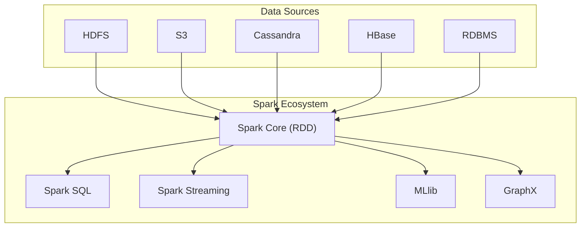
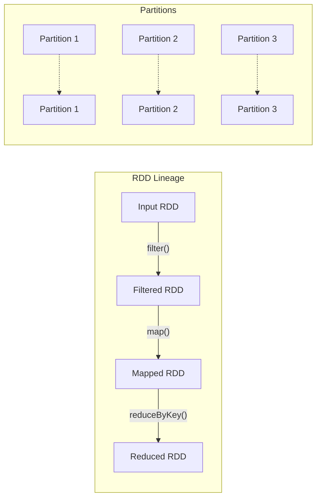
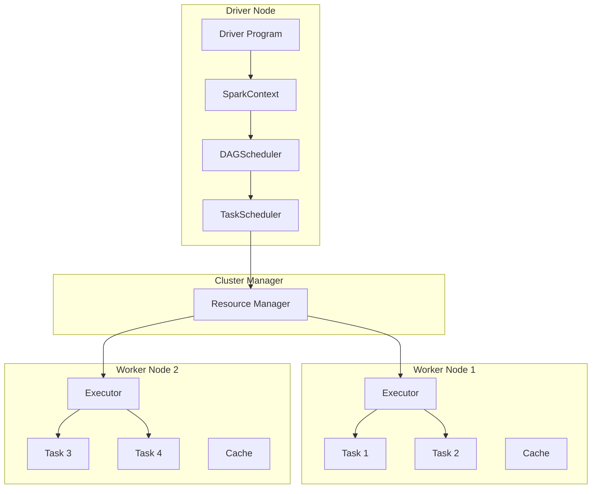
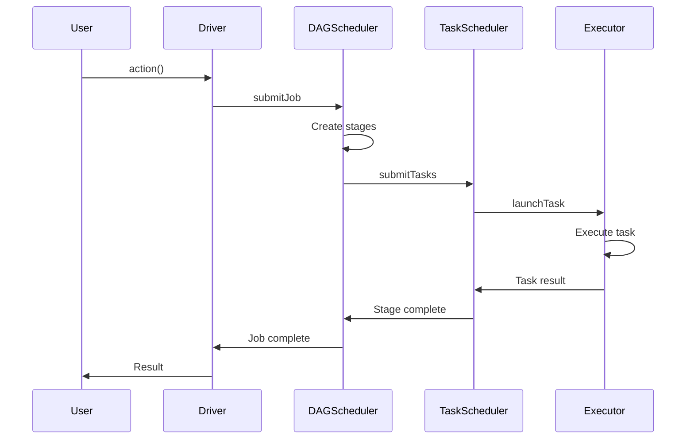
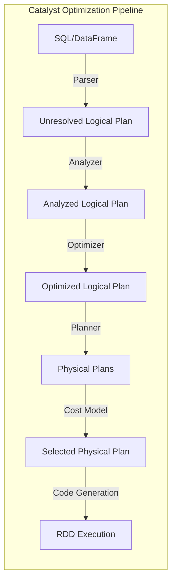
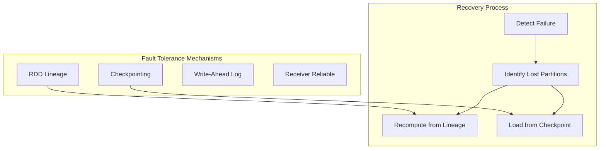
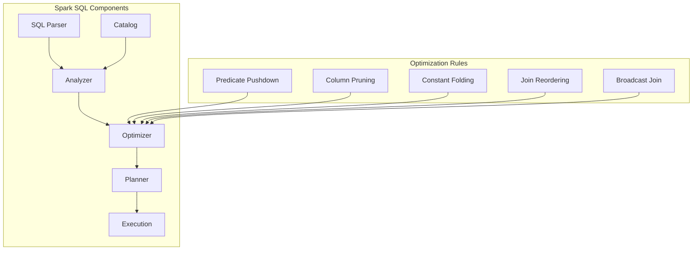
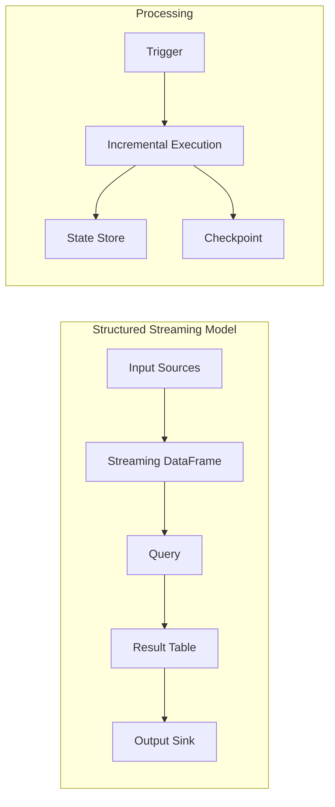

# Apache Spark

Apache Sparkは、大規模データ処理のために設計された統合分析エンジンである。2009年にUC BerkeleyのAMPLabで開発が始まり、MapReduceの計算モデルの制約を克服することを目的として生まれた。Sparkの中核となる設計思想は、メモリ上でのデータ処理によって反復的なアルゴリズムとインタラクティブなクエリを高速化することにある。MapReduceが各処理ステップでディスクにデータを書き込むのに対し、Sparkはインメモリコンピューティングによって中間結果をメモリ上に保持し、100倍以上の高速化を実現する場合がある。

## RDD（Resilient Distributed Dataset）の概念

RDDはSparkの基本的なデータ抽象化であり、フォルトトレラントな方法で並列処理可能な要素の不変分散コレクションを表す[^1]。RDDの設計は、分散システムにおけるデータ処理の効率性と信頼性を両立させるという課題に対する解答である。RDDは変換（transformation）とアクション（action）という2種類の操作をサポートし、遅延評価（lazy evaluation）によって計算を最適化する。

RDDの重要な特性として、パーティション化されたデータ構造、依存関係の追跡、計算の決定性、フォルトトレランスが挙げられる。各RDDは複数のパーティションに分割され、クラスタ内の異なるノードで並列処理される。RDDは親RDDからの変換として定義され、この系譜（lineage）情報を使用してフォルトトレランスを実現する。ノード障害が発生した場合、失われたパーティションは系譜情報を使用して再計算される。

## Sparkのアーキテクチャ

Sparkアプリケーションはマスター・ワーカーアーキテクチャに基づいて動作する。アプリケーションは、ドライバプログラムと複数のエグゼキュータで構成される。ドライバプログラムはメインメソッドを実行し、SparkContextを作成してクラスタへの接続を確立する。エグゼキュータは、ワーカーノード上で実行されるプロセスであり、タスクの実行とデータの保存を担当する。

クラスタマネージャは、リソースの割り当てとスケジューリングを管理する。SparkはStandalone、Apache Mesos、Hadoop YARN、Kubernetesなど、複数のクラスタマネージャをサポートしている。クラスタマネージャの選択は、既存のインフラストラクチャと要件に依存する。たとえば、既存のHadoopクラスタがある場合はYARNを使用し、コンテナ化された環境ではKubernetesを選択することが一般的である。

## 実行モデルとスケジューリング

Sparkの実行モデルは、ジョブ、ステージ、タスクという3つのレベルで構成される。アクション操作が呼び出されると、ジョブが作成される。DAGSchedulerは、RDDの系譜グラフを解析し、ジョブをステージに分割する。ステージの境界は、シャッフル操作（wide transformation）によって決定される。各ステージ内では、narrow transformationのみが実行され、データの移動を最小限に抑える。

TaskSchedulerは、各ステージ内のタスクをエグゼキュータに割り当てる。タスクのスケジューリングでは、データローカリティが重要な考慮事項となる。Sparkは、PROCESS_LOCAL、NODE_LOCAL、RACK_LOCAL、ANYという4つのレベルのローカリティを定義し、可能な限りデータに近い場所でタスクを実行しようとする。この最適化により、ネットワーク転送のオーバーヘッドを削減し、処理性能を向上させる。

## DataFrameとDatasetの進化

Spark 1.3でDataFrameが導入され、Spark 1.6でDatasetが追加された。これらの高レベルAPIは、RDDの上に構築され、構造化データの処理に最適化されている。DataFrameは名前付きカラムを持つ分散データコレクションであり、概念的にはリレーショナルデータベースのテーブルやPandasのDataFrameに似ている。Datasetは、DataFrameの型安全性を強化したバージョンであり、コンパイル時の型チェックを提供する。

DataFrame/Dataset APIの最大の利点は、Catalyst Optimizerによる自動最適化である。開発者が記述した論理的なクエリプランは、物理的な実行プランに変換される前に、複数の最適化ルールが適用される。述語プッシュダウン、定数畳み込み、カラムプルーニングなどの最適化により、実行効率が大幅に向上する。また、Tungsten実行エンジンによって、メモリ管理とCPU効率がさらに改善される。

## Catalyst Optimizerの仕組み

Catalyst Optimizerは、Sparkの中核となるクエリ最適化フレームワークである[^2]。Catalystは、ルールベースの最適化アプローチを採用し、拡張可能な設計となっている。最適化プロセスは、解析、論理最適化、物理計画、コード生成の4つのフェーズで構成される。

解析フェーズでは、SQL文やDataFrame操作が抽象構文木（AST）に変換される。論理最適化フェーズでは、述語プッシュダウン、定数畳み込み、カラムプルーニングなどのルールが適用される。物理計画フェーズでは、コストベースの最適化を使用して、最適な実行戦略を選択する。最後に、コード生成フェーズでは、Janino compilerを使用してJVMバイトコードを生成し、実行性能を最大化する。

## メモリ管理とシリアライゼーション

Sparkのメモリ管理は、実行とストレージの2つの主要な領域に分かれている。Spark 1.6以降、統合メモリ管理（Unified Memory Management）が導入され、実行メモリとストレージメモリが動的に共有されるようになった。実行メモリは、シャッフル、ソート、集約などの操作に使用され、ストレージメモリは、RDDのキャッシュとブロードキャスト変数の保存に使用される。

メモリ管理の設定は、アプリケーションのパフォーマンスに大きな影響を与える。spark.memory.fractionパラメータは、JVMヒープのうちSparkが使用する割合を制御し、デフォルトは0.6である。spark.memory.storageFractionは、統合メモリ領域内でストレージに予約される割合を指定し、デフォルトは0.5である。これらのパラメータの調整は、ワークロードの特性に基づいて行う必要がある。

シリアライゼーションは、ネットワーク転送とディスク永続化の際にオブジェクトをバイト配列に変換するプロセスである。SparkはデフォルトでJavaシリアライゼーションを使用するが、Kryoシリアライゼーションを使用することで、シリアライズされたオブジェクトのサイズを削減し、パフォーマンスを向上させることができる。特に、複雑なオブジェクトグラフを持つアプリケーションでは、Kryoの使用が推奨される。

## フォルトトレランスメカニズム

Sparkのフォルトトレランスは、RDDの系譜情報とチェックポイントという2つのメカニズムに基づいている。系譜ベースの復旧では、失われたパーティションを再計算するために必要な変換の履歴が保持される。この方法は、短い系譜を持つRDDに対して効率的だが、長い系譜や反復的なアルゴリズムでは再計算のコストが高くなる可能性がある。

チェックポイントは、RDDのデータを信頼性の高いストレージ（HDFSなど）に永続化することで、系譜を切断し、復旧時間を短縮する。チェックポイントは、長い系譜を持つRDDや、計算コストの高い操作の後で使用することが推奨される。Sparkは、信頼性の高いチェックポイントとローカルチェックポイントの2種類をサポートしており、要件に応じて選択できる。

## パーティショニングとデータローカリティ

パーティショニングは、Sparkにおけるパフォーマンス最適化の重要な要素である。適切なパーティショニング戦略により、データのスキューを回避し、並列処理の効率を最大化できる。Sparkは、HashPartitionerとRangePartitionerという2つの組み込みパーティショナーを提供している。HashPartitionerは、キーのハッシュ値に基づいてデータを分散し、RangePartitionerは、キーの順序に基づいてデータを分散する。

カスタムパーティショナーの実装により、アプリケーション固有の要件に対応できる。たとえば、地理的なデータを処理する場合、地域ごとにデータをパーティショニングすることで、関連するデータを同じパーティションに配置し、シャッフルを最小化できる。パーティション数の選択も重要であり、一般的にはクラスタのコア数の2-3倍が推奨される。

データローカリティの最適化は、ネットワーク転送を削減し、処理速度を向上させる。Sparkは、タスクをスケジューリングする際に、データが存在する場所でタスクを実行しようとする。spark.locality.wait パラメータは、より良いローカリティレベルを待つ時間を制御し、デフォルトは3秒である。この値を調整することで、ローカリティとタスク開始の遅延のトレードオフを管理できる。

## Spark SQLとその最適化

Spark SQLは、構造化データ処理のための高レベルAPIを提供し、SQLクエリとDataFrame/Dataset APIを統合する。Spark SQLの中核となるコンポーネントは、Catalyst OptimizerとTungsten実行エンジンである。これらにより、宣言的なクエリが高度に最適化された実行計画に変換される。

Spark SQLの最適化技術には、述語プッシュダウン、パーティションプルーニング、ブロードキャストジョイン、動的パーティション削除などが含まれる。述語プッシュダウンは、フィルタ条件をデータソースに近い場所で適用し、処理するデータ量を削減する。パーティションプルーニングは、クエリ条件に基づいて不要なパーティションをスキップする。ブロードキャストジョインは、小さなテーブルを各エグゼキュータにブロードキャストすることで、シャッフルを回避する。

適応的クエリ実行（Adaptive Query Execution, AQE）は、Spark 3.0で導入された機能であり、実行時の統計情報に基づいてクエリプランを動的に最適化する[^3]。AQEは、動的パーティション結合、動的結合選択、動的パーティション集約という3つの主要な最適化を提供する。これらの最適化により、データスキューやカーディナリティの推定誤差による性能問題が軽減される。

## Structured Streamingの設計と実装

Structured Streamingは、Spark 2.0で導入されたストリーム処理エンジンであり、バッチ処理と同じAPIを使用してストリームデータを処理できる。Structured Streamingの基本概念は、ストリームデータを無限に成長するテーブルとして扱うことである。新しいデータが到着すると、テーブルに新しい行が追加され、クエリは増分的に処理される。

Structured Streamingは、exactly-once処理保証を提供し、イベント時間ベースのウィンドウ処理、遅延データの処理、ウォーターマークによる状態管理をサポートする。チェックポイントメカニズムにより、障害からの回復が可能であり、処理の進行状況が永続化される。出力モードには、append、update、completeの3種類があり、用途に応じて選択できる。

ウォーターマークは、遅延データの処理とメモリ使用量の管理において重要な役割を果たす。ウォーターマークを設定することで、システムは特定の時間を超えて遅延したデータを破棄し、状態のサイズを制限できる。ウォーターマークの設定は、データの遅延特性とビジネス要件のバランスを考慮して行う必要がある。

## パフォーマンスチューニング

Sparkアプリケーションのパフォーマンスチューニングは、複数のレベルで行う必要がある。アプリケーションレベルでは、適切なAPIの選択、パーティショニング戦略、キャッシュの使用が重要である。設定レベルでは、メモリ管理、並列度、シリアライゼーションの設定が性能に大きく影響する。

データスキューは、Sparkアプリケーションで頻繁に発生する性能問題である。特定のキーに大量のデータが集中すると、一部のタスクが他のタスクよりもはるかに長い時間を要し、全体の処理時間が増加する。データスキューの対処方法には、ソルティング（キーにランダムな接尾辞を追加）、カスタムパーティショナーの使用、AQEの活用などがある。

メモリ関連の問題は、OutOfMemoryErrorやGCオーバーヘッドとして現れる。これらの問題に対処するには、エグゼキュータメモリの増加、パーティション数の調整、キャッシュ戦略の見直しが必要である。spark.sql.shuffle.partitionsパラメータは、シャッフル後のパーティション数を制御し、デフォルトの200から調整することで、メモリ使用量と並列度のバランスを改善できる。

## 動的リソース割り当て

動的リソース割り当て（Dynamic Resource Allocation, DRA）は、アプリケーションの負荷に応じてエグゼキュータの数を自動的に調整する機能である。DRAを有効にすることで、リソースの効率的な使用とコスト削減が可能になる。アイドル状態のエグゼキュータは解放され、負荷が増加すると新しいエグゼキュータが追加される。

DRAの設定には、spark.dynamicAllocation.minExecutors、spark.dynamicAllocation.maxExecutors、spark.dynamicAllocation.executorIdleTimeoutなどのパラメータが含まれる。これらのパラメータは、アプリケーションの特性とクラスタの容量に基づいて調整する必要がある。外部シャッフルサービスの有効化は、DRAを使用する際の前提条件である。

## データソースとファイルフォーマット

Sparkは、多様なデータソースとファイルフォーマットをサポートしている。Parquet、ORC、Avroなどの列指向フォーマットは、分析ワークロードに最適化されており、圧縮率が高く、カラムプルーニングをサポートする。JSONやCSVなどのテキストフォーマットは、人間が読めるが、パフォーマンスとストレージ効率の面で劣る。

データソースAPIは、述語プッシュダウンとカラムプルーニングをサポートし、必要なデータのみを読み取ることで効率を向上させる。カスタムデータソースの実装も可能であり、既存のシステムとの統合を容易にする。Delta Lake、Apache Iceberg、Apache Hudiなどのレイクハウスフォーマットは、ACID トランザクション、スキーマ進化、タイムトラベルなどの高度な機能を提供する。

## セキュリティとガバナンス

Sparkのセキュリティは、認証、認可、暗号化の3つの主要な側面で構成される。認証は、Kerberos、LDAP、OAuthなどのメカニズムを使用して実装できる。認可は、Apache RangerやApache Sentryなどのツールと統合して、細かいアクセス制御を提供する。暗号化は、転送中のデータ（TLS）と保存データ（透過的暗号化）の両方に適用できる。

監査ログは、コンプライアンスとトラブルシューティングのために重要である。SparkのイベントログとHistoryServerは、ジョブの実行履歴と性能メトリクスを提供する。カスタムリスナーの実装により、アプリケーション固有の監査要件に対応できる。データリネージの追跡は、データガバナンスの観点から重要であり、Apache Atlasなどのツールと統合できる。

## 機械学習とグラフ処理

MLlibは、Sparkの機械学習ライブラリであり、分類、回帰、クラスタリング、協調フィルタリングなどのアルゴリズムを提供する。MLlibは、DataFrame APIと統合されており、機械学習パイプラインの構築を容易にする。特徴変換、モデル選択、ハイパーパラメータチューニングなどの機能により、エンドツーエンドの機械学習ワークフローをサポートする。

GraphXは、グラフ並列計算のためのAPIであり、グラフ構造とグラフ並列計算を統合する。PageRank、連結成分、三角形カウントなどの一般的なグラフアルゴリズムが実装されている。Pregel APIにより、頂点中心の反復アルゴリズムを表現できる。GraphXは、ソーシャルネットワーク分析、推薦システム、不正検出などの用途で使用される。

## 今後の発展と課題

Sparkエコシステムは継続的に進化しており、新しい機能と最適化が定期的に追加されている。Project Tungstenによるメモリとコード生成の最適化、Hydrogen projectによるディープラーニングの統合、Delta Lakeによるレイクハウスアーキテクチャのサポートなど、重要な進展が見られる。

現在の課題には、超大規模データセットの処理、リアルタイムストリーミングの低レイテンシ要件への対応、複雑な機械学習ワークフローの効率的な実行などが含まれる。GPU acceleration、persistent memory、disaggregated storageなどの新しいハードウェア技術の活用も、今後の重要な方向性である。

Sparkの将来は、統合分析プラットフォームとしての役割をさらに強化することにある。バッチ処理、ストリーム処理、機械学習、グラフ処理を統一されたAPIで提供し、データエンジニアリングとデータサイエンスのワークフローをシームレスに統合することが目標である。クラウドネイティブアーキテクチャへの適応、サーバーレスコンピューティングとの統合、エッジコンピューティングのサポートなど、新しいコンピューティングパラダイムへの対応も進められている。

[^1]: Zaharia, M., et al. (2012). Resilient Distributed Datasets: A Fault-Tolerant Abstraction for In-Memory Cluster Computing. NSDI'12.
[^2]: Armbrust, M., et al. (2015). Spark SQL: Relational Data Processing in Spark. SIGMOD'15.
[^3]: Venkataraman, S., et al. (2016). SparkR: Scaling R Programs with Spark. SIGMOD'16.