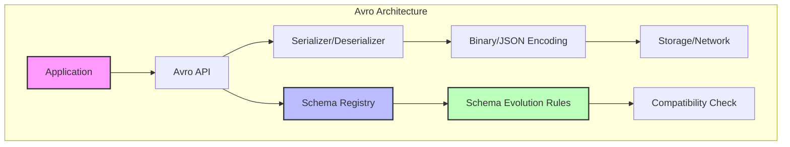
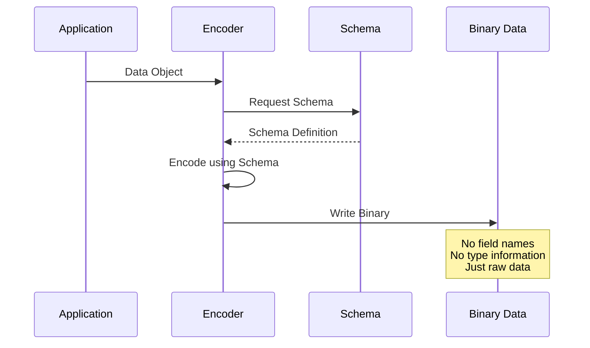
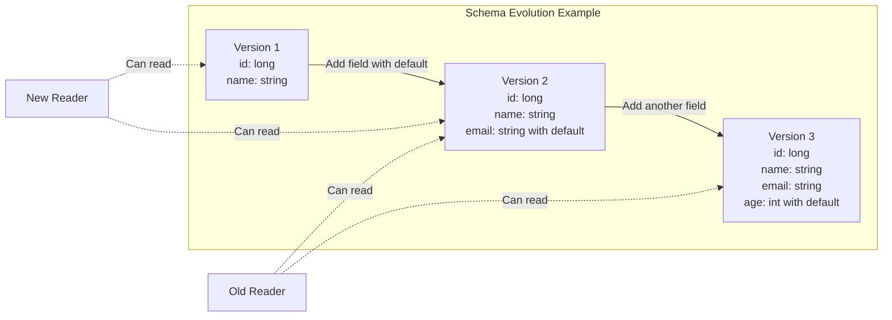

# Apache Avro

Apache Avroは、Hadoopエコシステムの一環として開発されたデータシリアライゼーションフレームワークです。Doug Cuttingによって2009年に開始されたこのプロジェクト[^1]は、言語やプラットフォームに依存しないデータ交換を可能にする堅牢なスキーマ進化メカニズムを特徴としています。

分散システムにおけるデータ交換では、送信側と受信側でデータ構造の定義が一致している必要がありますが、システムの進化に伴い、この定義は時間とともに変化していきます。Avroは、この問題に対してスキーマ進化という独創的なアプローチを採用しました。データとそのスキーマを分離し、読み取り時と書き込み時で異なるスキーマを使用できるようにすることで、後方互換性と前方互換性の両方を実現しています。



## スキーマシステムの詳細

AvroのスキーマはJSON形式で定義され、プリミティブ型と複合型の階層構造を形成します。プリミティブ型にはnull、boolean、int、long、float、double、bytes、stringが含まれ、複合型にはrecord、enum、array、map、union、fixedが含まれます[^2]。

スキーマ定義において特筆すべきは、unionタイプの存在です。これは複数の型のいずれかを取りうるフィールドを表現でき、特にnullableなフィールドの定義において重要な役割を果たします。例えば、`["null", "string"]`というunionは、nullまたは文字列のいずれかの値を取るフィールドを定義します。

```json
{
  "type": "record",
  "name": "User",
  "namespace": "com.example",
  "fields": [
    {"name": "id", "type": "long"},
    {"name": "username", "type": "string"},
    {"name": "email", "type": ["null", "string"], "default": null},
    {"name": "age", "type": "int", "default": 0},
    {"name": "metadata", "type": {
      "type": "map",
      "values": "string"
    }}
  ]
}
```

この例では、Userレコードが定義されており、emailフィールドはnullableで、ageフィールドにはデフォルト値が設定されています。metadataフィールドは文字列値を持つマップとして定義されています。

スキーマの解決プロセスは、Avroの中核をなす機能です。読み取り時に使用されるreader's schemaと、データが書き込まれた時のwriter's schemaが異なる場合、Avroは一連のルールに従ってスキーマの解決を行います。このプロセスでは、フィールドの追加、削除、デフォルト値の適用、型の昇格（例：intからlongへ）などが自動的に処理されます。

## シリアライゼーション形式

Avroは複数のエンコーディング形式をサポートしていますが、最も効率的なのはバイナリエンコーディングです。バイナリ形式では、フィールド名やタイプ情報を含まず、純粋なデータのみが格納されます。これは、スキーマが別途利用可能であることを前提としているためです。



バイナリエンコーディングの詳細を見ると、各データ型は特定の方法でエンコードされます。整数値はvariable-length zig-zag encodingを使用し、負の数値も効率的に表現できます。文字列とバイト配列は、長さを先頭に付けた後、実際のデータが続く形式です。レコードは、スキーマで定義された順序でフィールドを連続して配置します。

この効率的なエンコーディングにより、Avroは他のシリアライゼーション形式と比較して、特に数値データが多い場合において、コンパクトなデータ表現を実現します。例えば、Protocol BuffersやThriftと比較しても、Avroのバイナリ形式は同等かそれ以上の圧縮率を達成することが多く、さらにスキーマ進化の柔軟性という追加の利点があります。

Container File Formatは、Avroのもう一つの重要な機能です。このフォーマットでは、ファイルの先頭にマジックバイト、メタデータ（スキーマを含む）、同期マーカーが配置され、その後にデータブロックが続きます。各データブロックは複数のレコードを含み、オプションで圧縮することができます。

```
[Magic Bytes: 4 bytes]["Avro"]
[Metadata: Map<String, Bytes>]
  - avro.schema: JSON schema
  - avro.codec: compression codec (null, deflate, snappy)
[Sync Marker: 16 bytes random]
[Data Block 1]
  [Record Count: long]
  [Data Size: long]
  [Serialized Records]
  [Sync Marker]
[Data Block 2]
  ...
```

## スキーマ進化のメカニズム

スキーマ進化は、分散システムにおける段階的なデプロイメントを可能にする重要な機能です。Avroは、後方互換性（新しいコードが古いデータを読める）、前方互換性（古いコードが新しいデータを読める）、および完全互換性（両方向の互換性）をサポートします。

互換性を保つための基本的なルールは以下の通りです：

1. **フィールドの追加**: デフォルト値を持つフィールドは、reader's schemaに追加できます。古いデータを読む際、このフィールドにはデフォルト値が使用されます。

2. **フィールドの削除**: writer's schemaから削除されたフィールドは、reader's schemaでデフォルト値を持つ必要があります。

3. **型の昇格**: 一部の型変換は自動的にサポートされます（例：int → long, float → double）。

4. **Union型の拡張**: 新しい型をunionに追加することで、フィールドが取りうる値の範囲を拡張できます。



スキーマレジストリの概念は、大規模な分散システムにおけるスキーマ管理を効率化します。Confluentが開発したSchema Registry[^3]は、スキーマの中央管理、バージョン管理、互換性チェックを提供し、プロデューサーとコンシューマー間でのスキーマの一貫性を保証します。

## 他のシリアライゼーション形式との比較

データシリアライゼーション形式の選択は、システムの性能、保守性、相互運用性に大きな影響を与えます。Avroを他の主要なフォーマットと比較することで、その特徴がより明確になります。

**Protocol Buffers (protobuf)** は、Googleが開発したシリアライゼーション形式で、静的型付けと効率的なバイナリエンコーディングを特徴とします。protobufはフィールドにタグ番号を使用し、これによってフィールドの順序変更に対する柔軟性を提供します。しかし、スキーマはコンパイル時に必要であり、動的なスキーマ処理はAvroほど柔軟ではありません。

**Apache Thrift** は、Facebookが開発し、後にApacheプロジェクトとなったRPCフレームワークです。Thriftはprotobufと同様にIDLを使用し、多言語対応に優れています。しかし、スキーマ進化の面では、Avroの方がより洗練されたアプローチを提供します。

**JSON** は人間可読性に優れ、Web APIで広く使用されていますが、スキーマの標準化（JSON Schema）とデータの分離が不十分で、バイナリ効率も劣ります。Avroはこれらの問題に対処しつつ、JSONとの相互変換も可能です。

| 特性 | Avro | Protocol Buffers | Thrift | JSON |
|------|------|------------------|--------|------|
| スキーマ定義 | JSON | IDL (.proto) | IDL (.thrift) | JSON Schema (オプション) |
| 動的型付け | ◎ | △ | △ | ◎ |
| スキーマ進化 | ◎ | ○ | ○ | △ |
| バイナリ効率 | ◎ | ◎ | ◎ | × |
| 人間可読性 | △ (JSON mode) | × | × | ◎ |
| コード生成 | オプション | 必須 | 必須 | 不要 |

## 実装の詳細と性能特性

Avroの実装は、多くのプログラミング言語で利用可能です。Java実装が最も成熟しており、リファレンス実装として機能します。Python、C++、C#、Ruby、PHPなどの実装も存在し、それぞれが言語固有の最適化を含んでいます。

パフォーマンスの観点から、Avroのバイナリエンコーディングは非常に効率的です。フィールド名を含まないため、特に大量の小さなレコードを扱う場合に優れた圧縮率を示します。ベンチマークテストでは、Avroは以下のような特性を示します：

1. **シリアライゼーション速度**: メモリ内のオブジェクトからバイナリへの変換は、スキーマ駆動のアプローチにより高速です。
2. **デシリアライゼーション速度**: スキーマを使用した直接的なバイナリ解析により、JSONパースよりも大幅に高速です。
3. **メモリ効率**: コンパクトなバイナリ表現により、メモリ使用量を削減します。

実際の実装では、以下のような最適化技術が使用されています：

```java
// Example: Efficient record reading with specific reader
DatumReader<User> userDatumReader = new SpecificDatumReader<>(User.class);
DataFileReader<User> dataFileReader = new DataFileReader<>(file, userDatumReader);

// Reuse objects for better performance
User reuse = new User();
while (dataFileReader.hasNext()) {
    User user = dataFileReader.next(reuse);
    // Process user
}
```

メモリプールの使用、オブジェクトの再利用、バッファリングの最適化などにより、大規模データ処理においても効率的な動作を実現しています。

## 実践的な設計指針

Avroを実際のプロジェクトで使用する際には、いくつかの重要な設計原則に従う必要があります。

**スキーマ設計の原則**として、将来の拡張性を考慮することが重要です。新しいフィールドには必ずデフォルト値を設定し、既存フィールドの削除は慎重に行います。enum型を使用する場合は、将来の値の追加を考慮して、unknown値を含めることを検討します。

**名前空間の管理**は、大規模システムにおいて特に重要です。組織のドメイン名を逆にした形式（例：com.example.data）を使用し、機能やサービスごとに適切に階層化します。これにより、異なるチーム間でのスキーマの衝突を防ぎます。

**パフォーマンスの最適化**では、適切な圧縮アルゴリズムの選択が重要です。Snappyは圧縮速度を重視する場合に適しており、Deflateはより高い圧縮率が必要な場合に使用します。また、データブロックサイズの調整により、読み取り性能とメモリ使用量のバランスを取ることができます。

**エラーハンドリング**においては、スキーマ進化に伴う潜在的な問題に対処する必要があります。型の不一致、必須フィールドの欠如、不正なenum値などに対する適切な処理を実装します。

```python
# Example: Robust error handling in Python
from avro.io import DatumReader, BinaryDecoder
import avro.schema

try:
    reader = DatumReader(reader_schema, writer_schema)
    decoder = BinaryDecoder(data_stream)
    record = reader.read(decoder)
except avro.schema.SchemaResolutionException as e:
    # Handle schema compatibility issues
    logger.error(f"Schema resolution failed: {e}")
    # Implement fallback logic
except Exception as e:
    # Handle other errors
    logger.error(f"Deserialization failed: {e}")
```

**テスト戦略**では、スキーマの互換性テストが不可欠です。新しいスキーマバージョンが既存のデータと互換性があることを確認するため、自動化されたテストスイートを構築します。これには、前方互換性と後方互換性の両方のテストケースを含めます。

**運用上の考慮事項**として、スキーマのバージョン管理とデプロイメント戦略が重要です。スキーマレジストリを使用する場合は、そのHA構成と災害復旧計画を策定します。また、スキーマの変更履歴を追跡し、必要に応じてロールバック可能な仕組みを構築します。

分散トレーシングやメトリクス収集においても、Avroは有用です。構造化されたイベントデータをコンパクトに表現し、異なるサービス間で一貫したデータモデルを維持できます。

Apache Avroは、現代の分散システムにおけるデータ交換の複雑性に対する洗練されたソリューションを提供します。スキーマ進化のサポート、効率的なバイナリエンコーディング、言語中立性という特徴により、マイクロサービスアーキテクチャ、ストリーミングデータ処理、データレイクなど、様々な用途で価値を発揮します。その設計哲学は、システムの進化と運用の現実を深く理解した上で構築されており、長期的な保守性と拡張性を重視するプロジェクトにとって、優れた選択肢となります。

[^1]: Apache Avro Specification 1.11.1, The Apache Software Foundation, https://avro.apache.org/docs/current/specification/
[^2]: Kleppmann, M. (2017). Designing Data-Intensive Applications. O'Reilly Media. Chapter 4: Encoding and Evolution.
[^3]: Confluent Schema Registry Documentation, https://docs.confluent.io/platform/current/schema-registry/