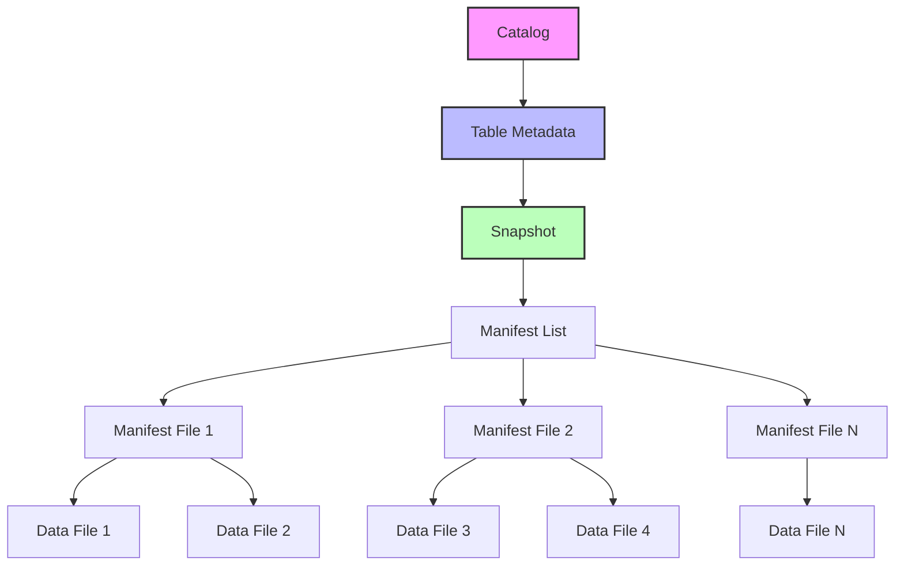
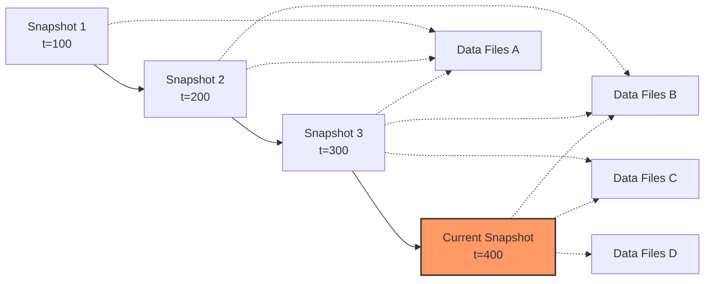
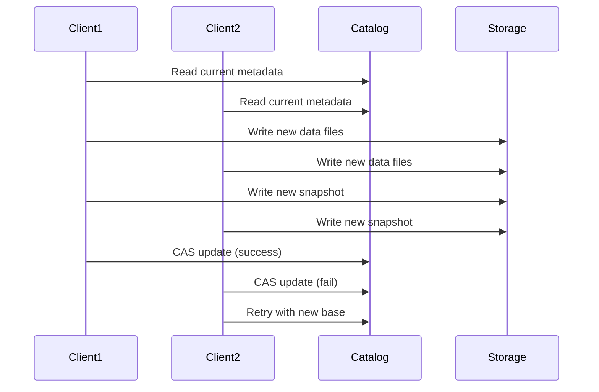
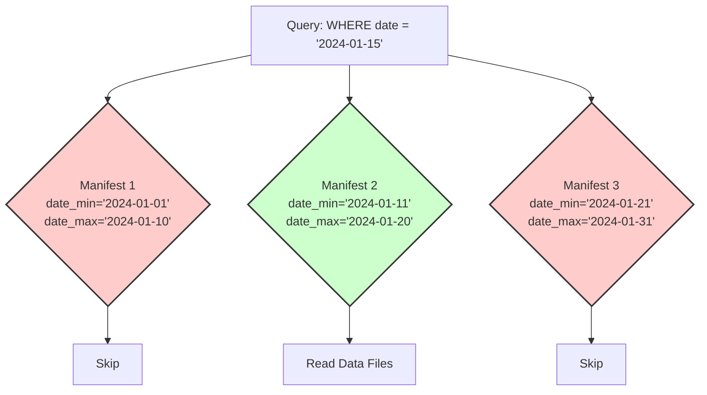
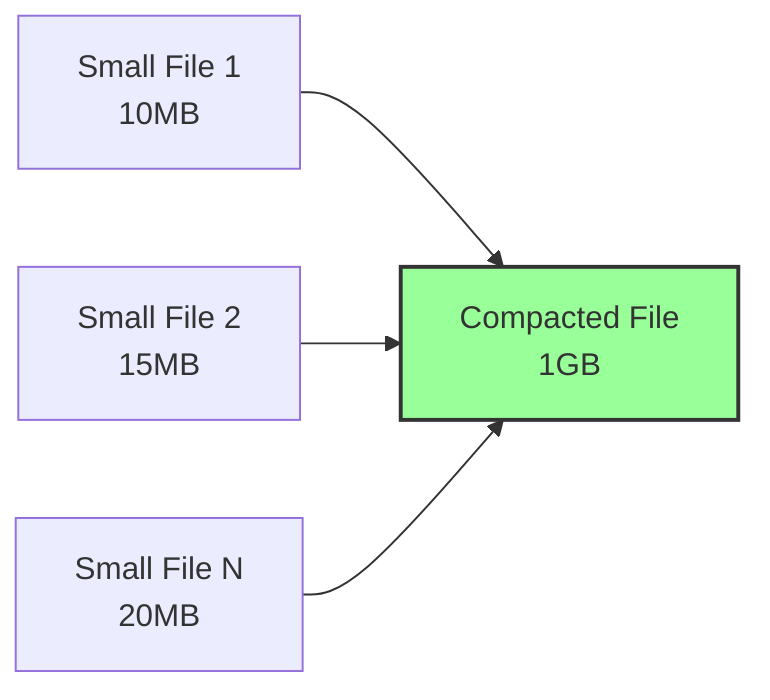

# Apache Iceberg

Apache Icebergは、大規模な分析データセットのための高性能テーブルフォーマットである。データレイクにおけるデータ管理の複雑性を解決するために設計され、ACIDトランザクション、スキーマ進化、タイムトラベル、パーティション進化などの高度な機能を提供する。Netflix社が2018年にオープンソース化し、現在はApache Software Foundationのトップレベルプロジェクトとして開発が続けられている[^1]。

従来のHiveテーブルフォーマットが抱えていた問題点を克服するために設計されたIcebergは、ペタバイト規模のテーブルに対して高速かつ信頼性の高いアクセスを可能にする。その革新的なメタデータ管理とスナップショットベースのアーキテクチャにより、複数の計算エンジンから同時にアクセスされる環境でも、データの一貫性と高いパフォーマンスを維持できる。

## アーキテクチャとデータ構造

Icebergのアーキテクチャは、階層的なメタデータ構造を中心に構築されている。最上位にカタログがあり、その下にテーブルメタデータ、マニフェストリスト、マニフェストファイル、そして実際のデータファイルという階層構造になっている。



カタログは、テーブルの現在のメタデータポインタを管理する責任を持つ。これは、HadoopカタログやHiveメタストア、AWS Glueカタログなど、様々な実装が可能である。テーブルメタデータは、テーブルのスキーマ、パーティショニング仕様、プロパティ、そして現在のスナップショットへの参照を含むJSONファイルとして保存される。

スナップショットは、ある時点でのテーブルの完全な状態を表現する不変のメタデータである。各スナップショットは、マニフェストリストファイルへの参照を持ち、このマニフェストリストがテーブルを構成するすべてのマニフェストファイルのインデックスとなる。マニフェストファイルは、データファイルのメタデータ（パス、サイズ、パーティション値、カラム統計など）を含むAvroファイルである。

この階層構造により、Icebergは効率的なメタデータ管理とクエリプランニングを実現している。例えば、特定のパーティションのデータを読み取る際、Icebergはマニフェストファイルレベルでフィルタリングを行い、不要なデータファイルを読み取らないようにすることができる。

## スナップショットとタイムトラベル

Icebergの最も重要な機能の一つが、スナップショットベースのデータ管理である。各書き込み操作は新しいスナップショットを作成し、以前のスナップショットは保持される。これにより、タイムトラベル機能が実現される。



スナップショットの作成は原子的に行われ、読み取り操作に影響を与えることなく新しいデータを追加できる。各スナップショットには一意のIDとタイムスタンプが付与され、ユーザーは特定の時点のデータを読み取ることができる。

タイムトラベル機能は、データ分析において非常に有用である。例えば、バグのあるETLジョブが実行された場合、問題が発生する前の状態にアクセスし、データを修復することができる。また、監査やコンプライアンスの要件に対応するため、過去の特定時点でのデータ状態を確認することも可能である。

## スキーマ進化とパーティション進化

Icebergは、テーブルのスキーマとパーティショニング戦略を安全に進化させる機能を提供する。これらの変更は、既存のデータファイルを書き換えることなく実現される。

スキーマ進化においては、カラムの追加、削除、リネーム、型の昇格（例：intからlong）などがサポートされている。Icebergは各データファイルが書き込まれた時点のスキーマIDを記録しており、読み取り時に適切なスキーマ投影を行う。

```sql
-- Schema evolution example
ALTER TABLE events ADD COLUMN user_agent STRING;
ALTER TABLE events DROP COLUMN deprecated_field;
ALTER TABLE events ALTER COLUMN event_time TYPE TIMESTAMP;
```

パーティション進化は、Icebergの特に革新的な機能である。従来のHiveテーブルでは、パーティショニング戦略を変更するためにはテーブル全体を再作成する必要があったが、Icebergでは新しいパーティショニング仕様を追加し、新しく書き込まれるデータに対してのみ適用することができる。

```mermaid
graph TD
    A[Original Partitioning<br/>day&#40;created_at&#41;] --> B[Add New Spec<br/>hour&#40;created_at&#41;]
    B --> C[New Data Files<br/>Use Hour Partitioning]
    A --> D[Old Data Files<br/>Keep Day Partitioning]
    
    style B fill:#9f9,stroke:#333,stroke-width:2px
```



この機能により、データの成長やアクセスパターンの変化に応じて、パーティショニング戦略を柔軟に調整できる。例えば、データ量が増加してきた場合、日次パーティションから時間単位のパーティションに移行することができる。

## トランザクションとコンカレンシー制御

IcebergはACIDトランザクションを完全にサポートしており、複数の書き込み操作が同時に実行される環境でもデータの一貫性を保証する。トランザクションの実装は、楽観的並行性制御（Optimistic Concurrency Control）に基づいている。

書き込み操作を実行する際、クライアントは現在のテーブルメタデータを読み取り、新しいスナップショットを作成する。その後、カタログに対してアトミックなcompare-and-swap操作を実行し、テーブルメタデータポインタを更新する。もし他のクライアントが同時に更新を行っていた場合、操作は失敗し、リトライが必要となる。



この楽観的並行性制御により、読み取り操作は一切ブロックされることなく、常に一貫性のあるデータビューを取得できる。また、書き込み操作も、競合が発生しない限り高いスループットを維持できる。

## Hidden Partitioningとカラム統計

Icebergの革新的な機能の一つが、Hidden Partitioningである。従来のテーブルフォーマットでは、ユーザーがクエリでパーティションカラムを明示的に指定する必要があったが、Icebergではパーティショニングがユーザーから隠蔽される。

パーティション値は、元のカラム値から自動的に導出される。例えば、タイムスタンプカラムから年、月、日、時間などのパーティション値を生成できる。この変換は、パーティション変換関数として定義される。

```python
# Partition transform examples
year(timestamp_column)      # Extract year
month(timestamp_column)     # Extract month  
day(timestamp_column)       # Extract day
hour(timestamp_column)      # Extract hour
bucket(N, column)          # Hash bucket with N buckets
truncate(L, string_column) # Truncate string to L characters
```

各マニフェストファイルには、含まれるデータファイルのカラム統計（最小値、最大値、null数など）が記録される。これにより、クエリ実行時に不要なファイルを効率的にスキップできる。



## ファイルフォーマットと圧縮

Icebergは、データファイルのフォーマットとして、Parquet、ORC、Avroをサポートしている。これらのフォーマットは列指向ストレージであり、分析ワークロードに最適化されている。各フォーマットは異なる特性を持ち、ユースケースに応じて選択できる。

Parquetは最も広く使用されているフォーマットであり、優れた圧縮率と列プルーニング機能を提供する。ORCはHiveエコシステムで人気があり、より高度な統計情報とインデックス機能を持つ。Avroは行指向フォーマットであり、ストリーミングワークロードに適している。

圧縮アルゴリズムとしては、Snappy、Gzip、Zstd、LZ4などがサポートされている。圧縮の選択は、ストレージコストとクエリパフォーマンスのトレードオフを考慮して決定される。

## メンテナンス操作

Icebergテーブルの長期的な健全性を維持するために、いくつかのメンテナンス操作が提供されている。

**スナップショットの有効期限管理**：古いスナップショットを定期的に削除することで、メタデータのサイズを制御できる。デフォルトでは、5日以上古いスナップショットが削除対象となる。

**オーファンファイルの削除**：失敗した書き込み操作により、どのスナップショットからも参照されないデータファイルが残ることがある。これらのオーファンファイルを定期的にクリーンアップする必要がある。

**小さなファイルのコンパクション**：頻繁な書き込み操作により、多数の小さなファイルが生成されることがある。これらをより大きなファイルに統合することで、読み取りパフォーマンスを向上させることができる。



**マニフェストの書き換え**：マニフェストファイルが大きくなりすぎた場合や、削除されたファイルのエントリが多く含まれる場合、マニフェストを書き換えることで効率を改善できる。

## 他のテーブルフォーマットとの比較

データレイクにおけるテーブルフォーマットとして、Iceberg以外にもDelta LakeやApache Hudiが存在する。これらはそれぞれ異なる設計思想と強みを持っている。

Delta Lakeは、Databricksが開発したフォーマットで、Spark生態系との統合が強みである。トランザクションログベースのアーキテクチャを採用し、変更データキャプチャ（CDC）機能に優れている。一方で、マルチエンジンサポートはIcebergほど成熟していない。

Apache Hudiは、Uberが開発したフォーマットで、増分処理とニアリアルタイムのデータ取り込みに特化している。Copy-on-WriteとMerge-on-Readの2つのストレージタイプを提供し、書き込みパフォーマンスと読み取りパフォーマンスのトレードオフを柔軟に選択できる。

Icebergは、これらの中で最もベンダー中立的な設計となっており、複数の計算エンジン（Spark、Trino、Flink、Impalaなど）から同等にサポートされている。また、スキーマとパーティション進化の機能が最も洗練されている。

## パフォーマンス最適化

Icebergのパフォーマンスを最大化するためには、いくつかの最適化技術を理解し適用する必要がある。

**ブルームフィルタ**：高カーディナリティカラムに対して、ブルームフィルタを使用することで、false positiveを許容しながら効率的にデータファイルをフィルタリングできる[^2]。

**ソート順序**：データファイル内でのレコードのソート順序を指定することで、範囲スキャンの効率を向上させることができる。Icebergは複数のソート順序をサポートし、時間とともに最適なソート順序に進化させることができる。

**削除ベクトル**：行レベルの削除を効率的に処理するため、Icebergは削除ベクトルという仕組みを提供する。これは削除された行の位置を記録するビットマップであり、データファイルを書き換えることなく削除を実現できる。

**メタデータキャッシング**：頻繁にアクセスされるメタデータをキャッシュすることで、クエリプランニングの時間を短縮できる。特に大規模なテーブルでは、マニフェストファイルの読み取りがボトルネックになることがある。

## 実装の詳細とファイルレイアウト

Icebergの実装は、ファイルシステムの特性を最大限に活用するように設計されている。メタデータファイルとデータファイルは、以下のような階層構造で配置される。

```
table_location/
├── metadata/
│   ├── v1.metadata.json
│   ├── v2.metadata.json
│   ├── v3.metadata.json
│   ├── snap-1234567890-1-uuid.avro
│   └── manifest-list-uuid.avro
└── data/
    ├── partition1=value1/
    │   ├── data-file-1.parquet
    │   └── data-file-2.parquet
    └── partition2=value2/
        └── data-file-3.parquet
```

メタデータディレクトリには、すべてのテーブルメタデータのバージョンが保存される。各バージョンは不変であり、新しいバージョンが作成されても古いバージョンは保持される。これにより、メタデータの履歴を追跡し、必要に応じてロールバックすることができる。

データディレクトリの構造は、パーティショニング戦略に依存する。Hidden Partitioningにより、パーティションディレクトリの命名規則はIcebergが自動的に管理する。

## 分散環境での考慮事項

Icebergは分散環境での使用を前提として設計されているが、いくつかの考慮事項がある。

**ネットワーク分断**：カタログとストレージが異なるネットワークセグメントに存在する場合、一時的な不整合が発生する可能性がある。Icebergは、このような状況でもデータの一貫性を保つため、厳密な検証とリトライメカニズムを実装している。

**スケーラビリティ**：数百万のファイルを含む巨大なテーブルでは、メタデータの管理がチャレンジとなる。Icebergは、マニフェストファイルの分割とパラレル処理により、このスケーラビリティの課題に対処している。

**マルチリージョン展開**：グローバルに分散したデータレイクでは、レイテンシとコストの最適化が重要である。Icebergは、リージョン固有のキャッシュとレプリケーション戦略をサポートしている。

Apache Icebergは、現代のデータレイクが直面する複雑な課題に対する包括的なソリューションを提供している。その革新的なアーキテクチャと豊富な機能セットにより、ペタバイト規模のデータを効率的かつ信頼性高く管理することが可能となっている。

[^1]: Apache Iceberg Documentation, https://iceberg.apache.org/docs/latest/
[^2]: Bloom, Burton H. (1970). "Space/time trade-offs in hash coding with allowable errors". Communications of the ACM. 13 (7): 422–426.