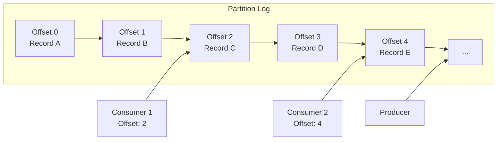
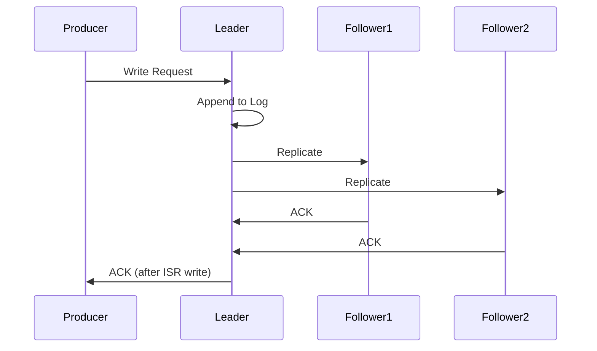
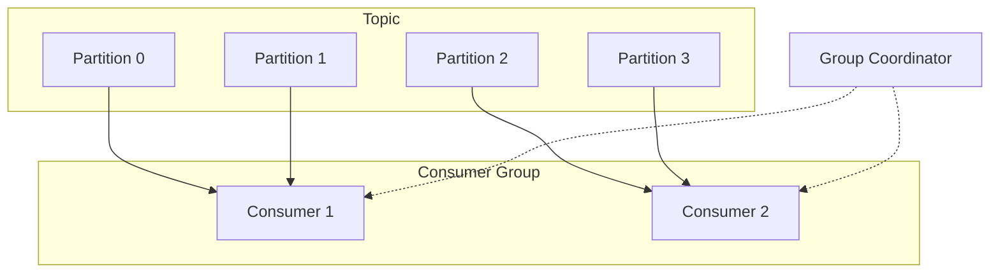
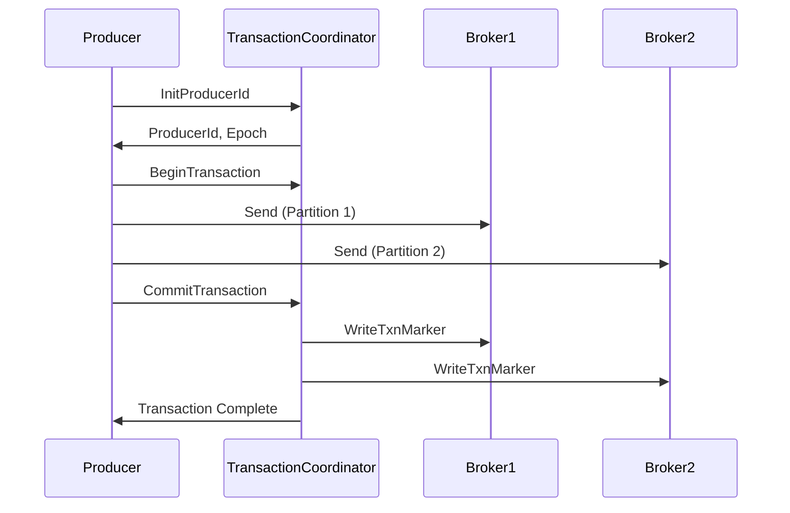

# Apache Kafka

Apache Kafkaは分散ストリーミングプラットフォームとして、大規模なデータストリームの処理において重要な役割を果たしている。LinkedInで開発され、2011年にオープンソース化されたKafkaは、高スループットでスケーラブルなメッセージングシステムとして設計された。従来のメッセージキューやログ集約システムの限界を克服するため、分散コミットログという概念を中心に据えた独自のアーキテクチャを採用している。

本稿では、Kafkaの内部アーキテクチャ、分散システムとしての設計原理、パフォーマンス特性について詳細に解説する。特に、パーティショニング、レプリケーション、コンシューマグループといった核心的な概念と、それらがどのように連携して高い可用性とスケーラビリティを実現しているかを明らかにする。

## 基本アーキテクチャ

Kafkaのアーキテクチャは、プロデューサー、ブローカー、コンシューマー、ZooKeeper（またはKRaft）という主要コンポーネントから構成される。メッセージはトピックと呼ばれる論理的なカテゴリに分類され、各トピックは複数のパーティションに分割される。この設計により、並列処理とスケーラビリティが実現される。

```mermaid
graph TB
    subgraph Producers
        P1[Producer 1]
        P2[Producer 2]
        P3[Producer 3]
    end
    
    subgraph Kafka Cluster
        subgraph Broker1
            B1P1[Partition 1<br/>Leader]
            B1P2[Partition 2<br/>Follower]
        end
        subgraph Broker2
            B2P1[Partition 1<br/>Follower]
            B2P2[Partition 2<br/>Leader]
            B2P3[Partition 3<br/>Follower]
        end
        subgraph Broker3
            B3P3[Partition 3<br/>Leader]
        end
    end
    
    subgraph Consumers
        subgraph Consumer Group A
            C1[Consumer 1]
            C2[Consumer 2]
        end
        C3[Consumer 3<br/>Group B]
    end
    
    ZK[ZooKeeper/KRaft]
    
    P1 --> B1P1
    P2 --> B2P2
    P3 --> B3P3
    
    B1P1 --> C1
    B2P2 --> C2
    B3P3 --> C3
    
    Kafka Cluster -.-> ZK
```

プロデューサーはメッセージをトピックに送信する際、パーティショニング戦略に基づいて特定のパーティションを選択する。デフォルトでは、メッセージキーのハッシュ値を用いてパーティションを決定するが、カスタムパーティショナーを実装することも可能である。この仕組みにより、同一キーを持つメッセージは常に同じパーティションに送信され、順序性が保証される。

ブローカーはKafkaクラスタの中核を成すサーバープロセスであり、メッセージの永続化と配信を担当する。各ブローカーは複数のパーティションのレプリカを保持し、そのうちいくつかはリーダーレプリカとして、残りはフォロワーレプリカとして機能する。リーダーレプリカはすべての読み書きリクエストを処理し、フォロワーレプリカはリーダーからデータを複製する。

## 分散コミットログ

Kafkaの中心的な抽象化は分散コミットログである。コミットログは追記専用のデータ構造であり、新しいレコードは常に末尾に追加される。各レコードにはオフセットと呼ばれる単調増加する整数が割り当てられ、これがレコードの一意な識別子となる。



この設計には複数の利点がある。第一に、シーケンシャルな書き込みによりディスクI/Oが最適化される。現代のオペレーティングシステムは、シーケンシャルアクセスに対して高度に最適化されており、ランダムアクセスと比較して桁違いのパフォーマンスを発揮する[^1]。第二に、イミュータブルなログ構造により、複数のコンシューマーが互いに影響を与えることなく、独立してメッセージを消費できる。

Kafkaはゼロコピー技術を活用してネットワーク転送を最適化している。従来のメッセージングシステムでは、ディスクからアプリケーションバッファ、カーネルバッファ、ネットワークバッファへとデータが複数回コピーされる。Kafkaは`sendfile`システムコールを使用することで、ディスクからネットワークへの直接転送を実現し、CPUオーバーヘッドを大幅に削減している[^2]。

## パーティショニングとスケーラビリティ

パーティショニングはKafkaのスケーラビリティの基礎となる概念である。トピックを複数のパーティションに分割することで、単一マシンの制約を超えた水平スケーリングが可能となる。各パーティションは独立したログとして機能し、異なるブローカーに配置できる。

パーティション数の決定は重要な設計上の判断である。パーティション数が多いほど並列性は向上するが、メタデータの管理オーバーヘッドも増加する。一般的なガイドラインとして、目標スループットを単一パーティションのスループット（通常10MB/s程度）で割った値を基準とすることが推奨される。

```math
\text{パーティション数} = \frac{\text{目標スループット}}{\text{パーティションあたりのスループット}}
```

ただし、この計算は簡略化されたものであり、実際にはレプリケーションファクター、コンシューマーの並列度、フェイルオーバー時の負荷分散なども考慮する必要がある。

## レプリケーションと耐障害性

Kafkaのレプリケーションメカニズムは、In-Sync Replicas（ISR）という概念を中心に構築されている。ISRは、リーダーレプリカと完全に同期しているフォロワーレプリカの集合を表す。レプリカがISRに含まれるためには、設定された時間内（`replica.lag.time.max.ms`）にリーダーの最新メッセージまで追いついている必要がある。



プロデューサーは`acks`パラメータを通じて、必要な確認応答のレベルを制御できる。`acks=0`では確認応答を待たず、`acks=1`ではリーダーへの書き込み完了を待ち、`acks=all`（または`-1`）ではすべてのISRへの書き込み完了を待つ。この設定により、レイテンシと耐久性のトレードオフを調整できる。

リーダー選出はZooKeeperまたはKRaftコントローラーによって管理される。リーダーが失敗した場合、ISRの中から新しいリーダーが選出される。この設計により、データの損失を防ぎながら高可用性を実現している。ただし、すべてのISRが失敗した場合の動作は`unclean.leader.election.enable`設定によって制御され、データ損失のリスクと可用性のトレードオフが存在する。

## コンシューマグループとオフセット管理

コンシューマグループは、Kafkaにおける並列消費の基本単位である。同一グループ内のコンシューマーは、トピックのパーティションを分担して消費する。この仕組みにより、メッセージの重複消費を防ぎながら、スケーラブルな処理が可能となる。



パーティションの割り当ては、グループコーディネーターによって管理される。Kafkaは複数の割り当て戦略を提供しており、`RangeAssignor`、`RoundRobinAssignor`、`StickyAssignor`などがある。`StickyAssignor`は、リバランス時のパーティション移動を最小化することで、処理の中断を減らす。

オフセット管理はコンシューマーの重要な責務である。Kafka 0.9以降、オフセットは特別な内部トピック`__consumer_offsets`に保存される。コンシューマーは定期的に現在の処理位置をコミットし、障害からの復旧時にはこの位置から処理を再開する。

オフセットコミットのタイミングは、メッセージ処理の信頼性に直接影響する。自動コミット（`enable.auto.commit=true`）は簡便だが、メッセージ処理の完了前にコミットされる可能性があり、障害時にメッセージが失われるリスクがある。手動コミットでは、処理完了後に明示的にコミットすることで、At-least-once配信を保証できる。

## ストレージレイヤーとログセグメント

Kafkaのストレージレイヤーは、効率的なディスク利用と高速な読み書きを実現するよう設計されている。各パーティションは複数のログセグメントに分割され、各セグメントは独立したファイルとして保存される。アクティブセグメントには新しいメッセージが追記され、設定されたサイズまたは時間に達すると新しいセグメントにロールオーバーされる。

```
partition-0/
├── 00000000000000000000.index
├── 00000000000000000000.log
├── 00000000000000000000.timeindex
├── 00000000000000368769.index
├── 00000000000000368769.log
├── 00000000000000368769.timeindex
└── 00000000000000737337.log  (active)
```

各セグメントには、オフセットインデックスとタイムインデックスが付属する。オフセットインデックスは、論理オフセットから物理ファイル位置へのマッピングを提供し、効率的なランダムアクセスを可能にする。インデックスは疎であり、設定されたバイト間隔（`log.index.interval.bytes`）ごとにエントリを持つ。

ログの圧縮は、ストレージ効率とネットワーク帯域幅の最適化において重要な役割を果たす。Kafkaは、GZIP、Snappy、LZ4、Zstandard などの圧縮アルゴリズムをサポートしている。圧縮はプロデューサー側で行われ、バッチ単位で適用される。これにより、圧縮率とCPU使用率の良好なバランスが達成される。

## ログコンパクション

ログコンパクションは、Kafkaの特徴的な機能の一つであり、キーベースの最新値保持を可能にする。通常の時間ベースまたはサイズベースの削除ポリシーとは異なり、ログコンパクションは各キーの最新値を保持しながら古い値を削除する。

```mermaid
graph LR
    subgraph Before Compaction
        B1[K1:V1] --> B2[K2:V1] --> B3[K1:V2] --> B4[K3:V1] --> B5[K2:V2] --> B6[K1:V3]
    end
    
    subgraph After Compaction
        A1[K1:V3] --> A2[K3:V1] --> A3[K2:V2]
    end
    
    Before Compaction -.-> After Compaction
```

この機能により、Kafkaはイベントソーシングやチェンジデータキャプチャ（CDC）のユースケースに適している。コンパクションはバックグラウンドで非同期に実行され、クリーナースレッドが定期的にログセグメントをスキャンして重複キーを削除する。

コンパクションの効率性は、`min.cleanable.dirty.ratio`パラメータによって制御される。この値は、クリーニング対象となるログの「汚れ」の割合を定義する。低い値はより頻繁なクリーニングを意味するが、I/Oオーバーヘッドも増加する。

## パフォーマンス特性とチューニング

Kafkaのパフォーマンスは、多くの要因に依存する。主要なパフォーマンス指標には、スループット（メッセージ/秒またはMB/秒）、レイテンシ（エンドツーエンドの遅延）、耐久性（データ損失の可能性）がある。これらの指標は相互にトレードオフの関係にあり、ユースケースに応じた最適化が必要である。

プロデューサーのパフォーマンスチューニングにおいて、バッチングは最も重要な要素の一つである。`batch.size`と`linger.ms`パラメータにより、メッセージのバッチング動作を制御できる。大きなバッチサイズは高いスループットをもたらすが、レイテンシも増加する。

```math
\text{実効スループット} = \frac{\text{バッチサイズ}}{\max(\text{linger.ms}, \text{バッチ充填時間})}
```

ブローカー側では、`num.network.threads`、`num.io.threads`、`socket.send.buffer.bytes`、`socket.receive.buffer.bytes`などのパラメータがパフォーマンスに影響する。ネットワークスレッドはクライアントリクエストの受信と応答の送信を処理し、I/Oスレッドはディスクへの読み書きを担当する。

OSレベルの最適化も重要である。Linuxでは、`vm.swappiness`を低く設定してスワップを抑制し、`vm.dirty_background_ratio`と`vm.dirty_ratio`を調整してページキャッシュの動作を最適化する。また、XFSまたはext4ファイルシステムの使用が推奨される。

## 他のメッセージングシステムとの比較

Kafkaと他のメッセージングシステムを比較する際、アーキテクチャの根本的な違いを理解することが重要である。RabbitMQやActiveMQなどの伝統的なメッセージブローカーは、メッセージの配信と削除に焦点を当てているが、Kafkaはログベースのストレージを中心に設計されている。

RabbitMQはAMQPプロトコルに基づき、複雑なルーティングロジックと配信保証を提供する。メッセージは消費後に削除され、キューの深さが浅い場合に最適なパフォーマンスを発揮する。一方、Kafkaはメッセージを設定された期間保持し、複数のコンシューマーが独立して消費できる。

Apache Pulsarは、Kafkaと同様の分散ログアーキテクチャを採用しているが、ストレージとサービングを分離した設計となっている。BookKeeperをストレージレイヤーとして使用することで、より柔軟なスケーリングとマルチテナンシーを実現している。しかし、この追加の抽象化レイヤーは、運用の複雑性とレイテンシの増加をもたらす可能性がある。

Amazon KinesisやGoogle Cloud Pub/Subなどのマネージドサービスは、運用の簡素化を提供するが、カスタマイズ性とコスト効率の面でトレードオフが存在する。これらのサービスは、Kafkaの概念を多く借用しているが、クラウドネイティブな環境に最適化されている。

## セキュリティとアクセス制御

Kafkaのセキュリティモデルは、認証、認可、暗号化の三つの柱から構成される。認証メカニズムとして、SASL/PLAIN、SASL/SCRAM、SASL/GSSAPI（Kerberos）、SSL/TLSクライアント証明書がサポートされている。

認可はAccess Control Lists（ACL）を通じて実装される。ACLは、プリンシパル（ユーザーまたはサービス）に対して、特定のリソース（トピック、コンシューマグループ、クラスタ）への操作権限を定義する。権限は細かく制御でき、READ、WRITE、CREATE、DELETE、ALTER、DESCRIBE、CLUSTER_ACTION などの操作タイプが定義されている。

```
kafka-acls --authorizer-properties zookeeper.connect=localhost:2181 \
  --add --allow-principal User:alice \
  --operation Read --operation Write \
  --topic my-topic
```

転送中のデータ暗号化は、TLSを使用して実現される。ブローカー間通信、クライアント・ブローカー間通信の両方で暗号化を有効にできる。保存データの暗号化は、Kafka自体では提供されないが、ファイルシステムレベルまたはディスクレベルで実装できる。

## ストリーム処理とKafka Streams

Kafka Streamsは、Kafkaエコシステムに統合されたストリーム処理ライブラリである。従来のストリーム処理フレームワークとは異なり、Kafka Streamsは独立したクラスタを必要とせず、アプリケーションに組み込まれるライブラリとして動作する。

Kafka Streamsの処理トポロジーは、ソース、プロセッサー、シンクから構成される有向非巡回グラフ（DAG）として表現される。状態ストアは、集約やジョイン操作のための状態を保持し、フォールトトレラントな方法で管理される。

```java
StreamsBuilder builder = new StreamsBuilder();
KStream<String, String> source = builder.stream("input-topic");

KTable<String, Long> counts = source
    .flatMapValues(value -> Arrays.asList(value.toLowerCase().split("\\W+")))
    .groupBy((key, word) -> word)
    .count(Materialized.as("word-counts"));

counts.toStream().to("output-topic", Produced.with(Serdes.String(), Serdes.Long()));
```

Exactly-once処理セマンティクスは、Kafka Streamsの重要な機能である。これは、入力メッセージの読み取り、状態の更新、出力メッセージの書き込みを原子的なトランザクションとして実行することで実現される。内部的には、Kafkaのトランザクショナルプロデューサーとコンシューマーを活用している。

## 運用上の考慮事項

Kafkaクラスタの運用には、継続的な監視とメンテナンスが必要である。主要な監視メトリクスには、以下が含まれる：

- **ブローカーメトリクス**: CPU使用率、メモリ使用量、ディスクI/O、ネットワークI/O、GCパフォーマンス
- **トピック/パーティションメトリクス**: メッセージレート、バイトレート、ログサイズ、レプリケーションラグ
- **コンシューマーメトリクス**: ラグ（オフセットの遅れ）、コミットレート、リバランス頻度

JMXを通じてこれらのメトリクスを収集し、Prometheus、Grafana、Datadog などの監視ツールと統合することが一般的である。特にコンシューマーラグは、システムの健全性を示す重要な指標であり、継続的に監視すべきである。

容量計画は、Kafkaクラスタの安定運用において重要な要素である。ディスク容量は、メッセージレート、保持期間、レプリケーションファクター、圧縮率を考慮して計算する必要がある：

```math
\text{必要ディスク容量} = \text{メッセージレート} \times \text{保持期間} \times \text{レプリケーションファクター} \times \frac{1}{\text{圧縮率}}
```

クラスタの拡張は、新しいブローカーの追加とパーティションの再割り当てによって実現される。`kafka-reassign-partitions`ツールを使用して、パーティションを新しいブローカーに移動できるが、この操作はネットワークとディスクI/Oに大きな負荷をかけるため、慎重に計画する必要がある。

## トランザクションとExactly-Onceセマンティクス

Kafka 0.11で導入されたトランザクション機能は、プロデューサーが複数のパーティションへの書き込みを原子的に実行することを可能にする。これにより、ストリーム処理アプリケーションにおけるExactly-Onceセマンティクスが実現される[^3]。

トランザクショナルプロデューサーは、`transactional.id`を設定することで有効化される。この識別子は、プロデューサーインスタンスを一意に識別し、障害からの復旧時に未完了のトランザクションを適切に処理するために使用される。



トランザクションコーディネーターは、トランザクションの状態を管理し、2フェーズコミットプロトコルを実装する。トランザクションログは`__transaction_state`トピックに保存され、コーディネーターの障害時でもトランザクションの状態を復元できる。

コンシューマー側では、`isolation.level`を`read_committed`に設定することで、コミットされたトランザクションのみを読み取ることができる。これにより、部分的に書き込まれたトランザクションやアボートされたトランザクションのメッセージが見えなくなる。

## パフォーマンスの限界と最適化

Kafkaのパフォーマンスは、ハードウェア、設定、ワークロードの特性によって大きく変動する。典型的なコモディティハードウェア（24コアCPU、64GB RAM、12×2TB SATA SSD）では、単一ブローカーで100万メッセージ/秒以上のスループットを達成できる。

しかし、いくつかの要因がパフォーマンスを制限する可能性がある。第一に、小さなメッセージサイズは、メッセージあたりのオーバーヘッドを増加させる。100バイト未満のメッセージでは、プロトコルオーバーヘッドが支配的になり、実効スループットが低下する。バッチングによってこの問題を緩和できるが、レイテンシとのトレードオフが生じる。

第二に、パーティション数の増加は、メタデータ管理とレプリケーションのオーバーヘッドを増大させる。各パーティションは独立したログファイルとインデックスファイルを持つため、ファイルディスクリプタの枯渇やファイルシステムのinode制限に達する可能性がある。一般的に、ブローカーあたり4000パーティション以下に保つことが推奨される。

第三に、コンシューマーのフェッチ動作は、ネットワーク帯域幅とCPU使用率に影響する。`fetch.min.bytes`と`fetch.max.wait.ms`パラメータは、フェッチリクエストの頻度とサイズを制御する。これらの値を適切に調整することで、ネットワークの効率性を向上させることができる。

## 障害シナリオとリカバリ

Kafkaクラスタにおける障害は、様々なレベルで発生する可能性がある。単一ブローカーの障害は、最も一般的なシナリオであり、Kafkaのレプリケーション機構によって透過的に処理される。リーダーパーティションを持つブローカーが失敗した場合、ISRから新しいリーダーが自動的に選出される。

ネットワーク分断は、より複雑な障害シナリオである。Kafkaは、ZooKeeperのセッションタイムアウトを使用してブローカーの生存を監視する。ネットワーク分断によってブローカーがZooKeeperから切断された場合、そのブローカーはクラスタから除外される。この設計により、スプリットブレインの問題を回避している。

ディスク障害に対しては、JBODサポート（Kafka 1.1以降）により、単一ディスクの障害がブローカー全体の停止を引き起こさないようになっている。障害したディスクのログディレクトリは自動的にオフラインとなり、そのディスク上のパーティションは他のブローカーに再割り当てされる。

データセンター全体の障害に対応するため、マルチデータセンターレプリケーションが必要となる。Kafka MirrorMakerやConfluent Replicatorなどのツールを使用して、クラスタ間でデータを非同期に複製できる。ただし、この場合のRPO（Recovery Point Objective）は、レプリケーションラグに依存する。

## 将来の発展方向

KafkaはKRaft（Kafka Raft）モードの導入により、ZooKeeper依存からの脱却を進めている。KRaftは、Raftコンセンサスアルゴリズムに基づいた内蔵メタデータ管理システムであり、運用の簡素化とスケーラビリティの向上をもたらす[^4]。

階層型ストレージ（Tiered Storage）は、コスト効率とスケーラビリティを改善する重要な機能である。ホットデータはローカルディスクに保持し、コールドデータはオブジェクトストレージ（S3、GCSなど）に移動することで、事実上無制限の保持期間を実現できる。

これらの進化により、Kafkaはより広範なユースケースに対応し、クラウドネイティブ環境での運用がさらに容易になることが期待される。分散システムの基盤技術として、Kafkaは今後も重要な役割を果たし続けるだろう。

---

[^1]: Jacobs, A. (2009). The pathologies of big data. Communications of the ACM, 52(8), 36-44.

[^2]: Kreps, J., Narkhede, N., & Rao, J. (2011). Kafka: A distributed messaging system for log processing. Proceedings of the NetDB Workshop.

[^3]: Narkhede, N., Shapira, G., & Palino, T. (2017). Kafka: The Definitive Guide. O'Reilly Media. Chapter 8: Exactly-Once Semantics.

[^4]: Apache Kafka KIP-500: Replace ZooKeeper with a Self-Managed Metadata Quorum. https://cwiki.apache.org/confluence/display/KAFKA/KIP-500%3A+Replace+ZooKeeper+with+a+Self-Managed+Metadata+Quorum