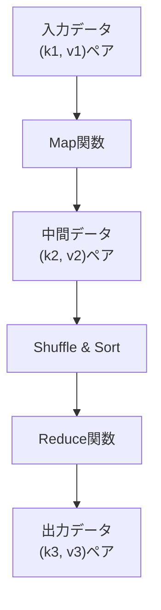
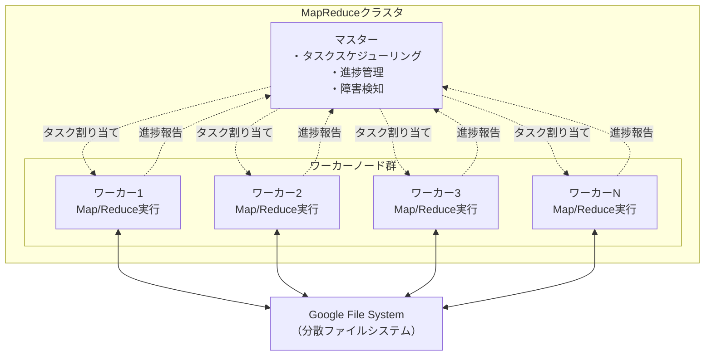
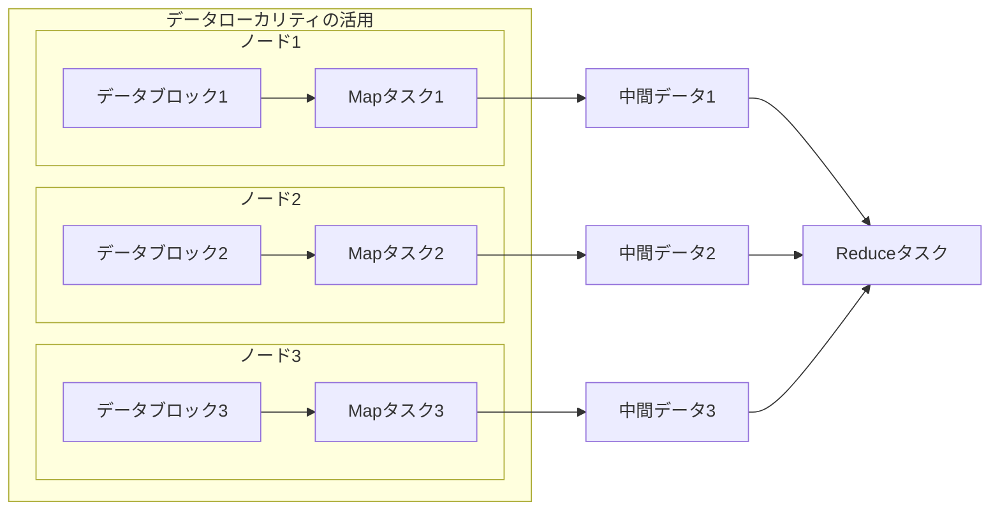
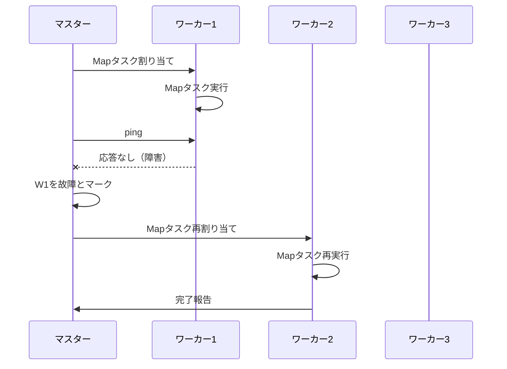
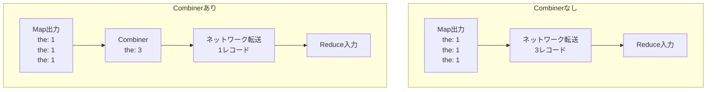
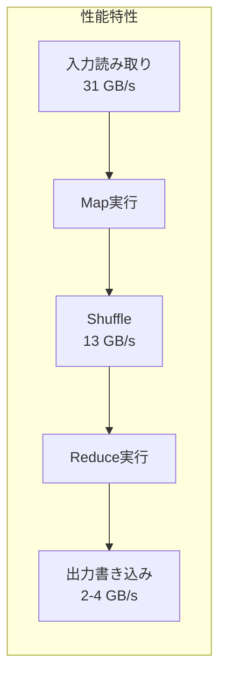

# MapReduce

MapReduceは、Googleによって開発された大規模データセットの分散処理を行うためのプログラミングモデルおよび実装である[^1]。2004年に発表されたこの技術は、数千台のマシンで構成されるクラスタ上でテラバイトからペタバイト規模のデータを処理することを可能にし、ビッグデータ処理の基盤技術として広く採用されている。

MapReduceの革新性は、複雑な分散処理の詳細を抽象化し、開発者が並列処理やフォルトトレランス、データ分散、負荷分散といった困難な問題を意識することなく、大規模データ処理プログラムを記述できる点にある。プログラマは、map関数とreduce関数という2つの関数を定義するだけで、フレームワークが自動的に並列実行、障害処理、最適化を行う。

## プログラミングモデル

MapReduceのプログラミングモデルは、関数型プログラミングのmap操作とreduce操作から着想を得ている。入力データは(key, value)ペアの集合として表現され、出力も同様に(key, value)ペアの集合として生成される。



Map関数は入力の(key, value)ペアを処理し、中間的な(key, value)ペアの集合を生成する。MapReduceライブラリは、同じ中間キーに関連付けられたすべての中間値をグループ化し、それらをReduce関数に渡す。Reduce関数は、中間キーとそのキーに対する値の集合を受け取り、より小さな値の集合にマージする。通常、Reduce関数は0個または1個の出力値を生成する。

```
map(k1, v1) → list(k2, v2)
reduce(k2, list(v2)) → list(v3)
```

この単純なインターフェースの背後には、強力な計算モデルが存在する。Map関数の各呼び出しは独立しており、並列実行が可能である。同様に、異なるキーに対するReduce関数の呼び出しも並列実行できる。この特性により、MapReduceは大規模な並列処理を実現している。

## 実行フレームワークのアーキテクチャ

MapReduceの実行フレームワークは、マスターワーカーアーキテクチャを採用している。システムは1つのマスターノードと多数のワーカーノードで構成される。マスターは全体の制御を担当し、ワーカーはMap/Reduceタスクの実際の処理を行う。



マスターノードは、MapタスクとReduceタスクを管理し、アイドル状態のワーカーに割り当てる。各Mapタスクは入力データの一部（通常64MBまたは128MBのチャンク）を処理する。マスターは、M個のMapタスクとR個のReduceタスクの進捗状況を追跡し、各タスクの状態（アイドル、実行中、完了）を管理する。

実行フローは以下の段階を経る：

1. **入力データの分割**: 入力ファイルをM個の断片に分割する。各断片のサイズは設定可能だが、通常16MBから64MBの範囲である。

2. **Mapフェーズ**: ワーカーはマスターから割り当てられたMapタスクを実行する。入力断片を読み込み、Map関数を適用して中間(key, value)ペアを生成する。これらの中間データはメモリにバッファリングされる。

3. **中間データの書き込み**: バッファリングされた中間データは定期的にローカルディスクに書き込まれ、パーティション関数によってR個の領域に分割される。これらのローカルファイルの位置情報はマスターに報告される。

4. **Shuffleフェーズ**: Reduceワーカーは、マスターから中間データの位置情報を受け取り、リモートプロシージャコール（RPC）を使用してMapワーカーのローカルディスクから該当するパーティションのデータを読み取る。

5. **Reduceフェーズ**: Reduceワーカーは、すべての中間データを読み込んだ後、中間キーでソートし、同じキーを持つすべての値をグループ化する。その後、各ユニークな中間キーとその値のリストに対してReduce関数を適用する。

## 分散処理の詳細メカニズム

MapReduceの分散処理は、データローカリティを最大限に活用するよう設計されている。Google File System（GFS）[^2]やHadoop Distributed File System（HDFS）のような分散ファイルシステムと密接に統合され、計算をデータの近くで実行することでネットワーク帯域幅の使用を最小限に抑える。



マスタースケジューラは、入力データのレプリカが存在するマシン上でMapタスクを実行しようとする。これにより、ほとんどの入力データがローカルディスクから読み取られ、ネットワーク帯域幅の消費が削減される。クラスタが数千台のマシンで構成されている場合、この最適化は大幅な性能向上をもたらす。

パーティショニングは、中間データをReduceタスクに分配する重要なメカニズムである。デフォルトのパーティション関数は`hash(key) mod R`であるが、ユーザーは独自のパーティション関数を定義できる。例えば、URLをキーとする場合、同じホストのURLを同じ出力ファイルに集めるために、ホスト名でパーティショニングすることが有効である。

## フォルトトレランスとデータ整合性

大規模クラスタでは、マシンの故障は日常的に発生する。MapReduceは、透過的なフォルトトレランスを提供し、数千台のマシンで長時間実行されるジョブでも確実に完了できるよう設計されている。

### ワーカーの障害処理

マスターは定期的に各ワーカーにpingを送信する。一定時間内に応答がない場合、そのワーカーは故障したとマークされる。故障したワーカーで完了したMapタスクは、中間出力がワーカーのローカルディスクに保存されているため、アクセス不可能となる。したがって、これらのMapタスクは再実行される必要がある。実行中だったMapまたはReduceタスクも、他の利用可能なワーカーで再スケジュールされる。



Reduceタスクの出力は、グローバルファイルシステムに書き込まれるため、完了したReduceタスクは再実行する必要がない。MapReduceは、Map関数とReduce関数が決定的であることを前提としており、同じ入力に対して常に同じ出力を生成することが期待される。

### マスターの障害処理

マスターの障害は比較的まれであるが、発生した場合の対処も重要である。マスターは定期的にチェックポイントを作成し、内部データ構造の状態を保存する。マスタープロセスが終了した場合、新しいマスタープロセスが最後のチェックポイントから状態を復元して処理を継続できる。

ただし、Googleの初期実装では、マスターが単一障害点であり、マスターの障害時にはMapReduce計算全体が中止される設計となっていた。これは、単一のマスターの障害確率が低く、実装の複雑さを避けるための実用的な選択であった。

### データ整合性の保証

MapReduceは、原子的なコミットを使用して出力の整合性を保証する。各Reduceタスクは、その出力を一時ファイルに書き込む。Reduceタスクが完了すると、一時ファイルを最終的な出力ファイルに原子的にリネームする。複数のReduceタスクが同じ出力ファイルに書き込もうとした場合、ファイルシステムが提供する原子的なリネーム操作により、最終的に1つの実行結果のみが残る。

## 最適化技法

MapReduceの性能を向上させるため、様々な最適化技法が実装されている。これらの最適化は、実際の大規模データ処理での経験から生まれたものである。

### Combiner関数

多くのMapReduceジョブでは、中間データに大きな繰り返しが存在する。例えば、単語カウントの例では、各Map関数が`<the, 1>`のような多数の同一ペアを生成する可能性がある。これらをネットワーク経由で送信する前に部分的に集約することで、通信量を大幅に削減できる。

Combiner関数は、Map関数の出力に対してローカルで実行される。通常、CombinerのコードはReduce関数と同じである。唯一の違いは、出力の扱いで、Reduce関数の出力は最終出力ファイルに書き込まれるが、Combiner関数の出力は中間ファイルに書き込まれ、Reduceタスクに送信される。



### 投機的実行（Speculative Execution）

大規模クラスタでは、一部のマシンが他よりも著しく遅い「ストラグラー」となることがある。これは、ディスクの不良、CPU競合、ネットワークの混雑など、様々な要因によって引き起こされる。MapReduceは、投機的実行によってこの問題に対処する。

MapReduceの処理が完了に近づくと、マスターは進行中のタスクのバックアップ実行をスケジュールする。元のタスクまたはバックアップタスクのいずれかが完了すると、そのタスクは完了とマークされる。この機構により、ストラグラーによる全体の処理時間への影響を最小限に抑えることができる。

### 入力データの事前分割とタスク粒度

Mapフェーズの分割数（M）とReduceフェーズの分割数（R）の選択は、性能に大きな影響を与える。理想的には、MとRはワーカーマシンの数よりもはるかに大きくすべきである。各ワーカーが多くの異なるタスクを実行することで、動的な負荷分散が改善され、ワーカーの障害からの回復も高速化される。

実際の制約として、マスターはO(M+R)のスケジューリング決定を行い、O(M×R)の状態をメモリに保持する必要がある。Googleの実装では、Mを入力データサイズが16MBから64MBになるように選択し、Rをワーカー数の小さな倍数にすることが一般的であった。例えば、2000台のワーカーマシンでM=200,000、R=5,000を使用することが典型的である。

### 順序保証

特定のアプリケーションでは、中間キーが処理される順序が重要である。MapReduceは、与えられたパーティション内で、中間(key, value)ペアが昇順のキー順序で処理されることを保証する。この順序保証により、パーティションごとにソートされた出力ファイルを生成することが容易になる。

## 実装の詳細と性能特性

GoogleのMapReduce実装は、C++で記述され、様々な環境に移植されている。最も広く使用されているのは、コモディティPCの大規模クラスタを対象とした実装である。典型的なクラスタ構成は以下の通りである：

- デュアルプロセッサx86マシン（2-4GBメモリ）
- コモディティネットワーク（マシンあたり100Mbpsまたは1Gbps）
- 数千台のマシンで構成されるクラスタ
- 安価なIDEディスクを使用したストレージ

性能測定の一例として、1TBのデータに対するソート処理（TeraSort）では、1800台のマシンを使用して約1000秒で完了することが報告されている[^3]。この処理では、M=15,000、R=4,000の設定が使用された。



MapReduceの性能は、以下の要因に大きく依存する：

1. **ネットワーク帯域幅**: Shuffleフェーズでは大量のデータがネットワーク経由で転送される。ネットワークトポロジーを考慮した最適化（ラック認識スケジューリングなど）が重要である。

2. **ディスクI/O**: 中間データの書き込みと読み取りが頻繁に発生するため、ローカルディスクの性能が全体のスループットに影響する。

3. **CPU利用率**: Map関数とReduce関数の計算複雑度によって、CPUがボトルネックになる場合がある。

4. **メモリ使用量**: 中間データのバッファリングとソートのために十分なメモリが必要である。

## 他の分散処理フレームワークとの比較

MapReduceの登場以降、多くの分散処理フレームワークが開発されている。それぞれに特徴があり、異なるユースケースに適している。

### Apache Spark

Apache Spark[^4]は、メモリ内計算を活用してMapReduceよりも高速な処理を実現する。Resilient Distributed Dataset（RDD）という抽象化により、中間データをメモリに保持し、反復的なアルゴリズムやインタラクティブなデータ分析に適している。


Sparkは、MapReduceの単純な2段階処理モデルを拡張し、より複雑なデータフローグラフをサポートする。これにより、機械学習アルゴリズムやグラフ処理など、より複雑な計算パターンを効率的に実装できる。

### Apache Flink

Apache Flink[^5]は、ストリーム処理を第一級の概念として扱う分散処理フレームワークである。バッチ処理を有限のストリームとして扱うことで、統一されたプログラミングモデルを提供する。真のストリーム処理により、低レイテンシでのデータ処理が可能である。

### Dryad

Microsoft Research のDryad[^6]は、より一般的な計算グラフをサポートする分散実行エンジンである。MapReduceの固定的な処理パターンと異なり、任意の有向非巡回グラフ（DAG）として計算を表現できる。

これらのフレームワークと比較すると、MapReduceの強みは以下の点にある：

1. **シンプルさ**: Map関数とReduce関数という2つの抽象化のみで、複雑な分散処理を記述できる。
2. **堅牢性**: フォルトトレランスが組み込まれており、大規模な障害にも対処できる。
3. **スケーラビリティ**: 数千台のマシンで確実に動作することが実証されている。

一方で、MapReduceの制限事項として以下が挙げられる：

1. **反復処理の非効率性**: 機械学習のような反復的なアルゴリズムでは、各反復でディスクI/Oが発生し、性能が低下する。
2. **リアルタイム処理の困難さ**: バッチ処理に特化しており、低レイテンシのストリーム処理には適さない。
3. **表現力の制限**: すべての計算をMap-Reduceパターンに当てはめる必要があり、一部のアルゴリズムでは不自然な実装となる。

## 実世界での応用と進化

MapReduceは、Googleで広範囲に使用され、Web検索インデックスの構築、ログ分析、機械学習、統計的機械翻訳など、様々なアプリケーションで活用されている。2004年の論文発表から2008年までに、Googleでは毎日数千のMapReduceジョブが実行され、ペタバイト規模のデータが処理されていた。

オープンソース実装であるApache Hadoopは、MapReduceをより広いコミュニティに普及させた。Yahoo!、Facebook、Twitterなどの企業が、大規模データ処理のためにHadoopクラスタを構築し、運用している。Hadoopエコシステムは、Hive（SQLライクなクエリ言語）、Pig（高レベルデータフロー言語）、HBase（分散データベース）など、MapReduceを基盤とした多様なツールを生み出した。

MapReduceパラダイムの影響は、単なる実装を超えて、分散コンピューティングの考え方を変革した。「計算をデータに移動する」という原則、透過的なフォルトトレランス、シンプルなプログラミングモデルといった概念は、後続の多くのシステムに受け継がれている。

技術の進化とともに、MapReduceの役割も変化している。純粋なMapReduceジョブの使用は減少傾向にあるが、その基本概念は現代の分散処理システムの基礎として生き続けている。例えば、Apache BeamやApache Flinkのような統一処理モデルも、MapReduceから学んだ教訓を基に構築されている。

[^1]: Dean, J., & Ghemawat, S. (2004). MapReduce: Simplified Data Processing on Large Clusters. In OSDI'04: Sixth Symposium on Operating System Design and Implementation.

[^2]: Ghemawat, S., Gobioff, H., & Leung, S. T. (2003). The Google file system. In Proceedings of the nineteenth ACM symposium on Operating systems principles (pp. 29-43).

[^3]: Dean, J., & Ghemawat, S. (2008). MapReduce: simplified data processing on large clusters. Communications of the ACM, 51(1), 107-113.

[^4]: Zaharia, M., Chowdhury, M., Franklin, M. J., Shenker, S., & Stoica, I. (2010). Spark: Cluster computing with working sets. HotCloud, 10(10-10), 95.

[^5]: Carbone, P., Katsifodimos, A., Ewen, S., Markl, V., Haridi, S., & Tzoumas, K. (2015). Apache flink: Stream and batch processing in a single engine. Bulletin of the IEEE Computer Society Technical Committee on Data Engineering, 36(4).

[^6]: Isard, M., Budiu, M., Yu, Y., Birrell, A., & Fetterly, D. (2007). Dryad: distributed data-parallel programs from sequential building blocks. In Proceedings of the 2nd ACM SIGOPS/EuroSys European Conference on Computer Systems 2007 (pp. 59-72).