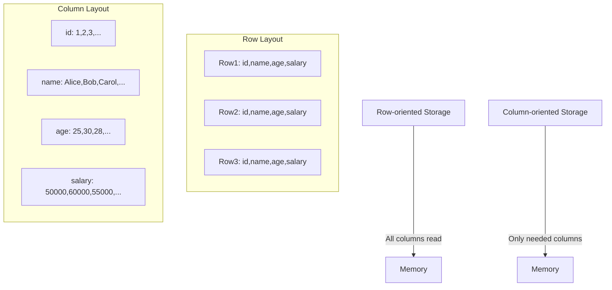
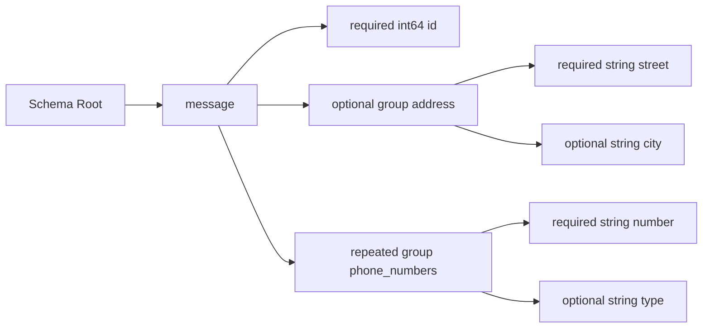
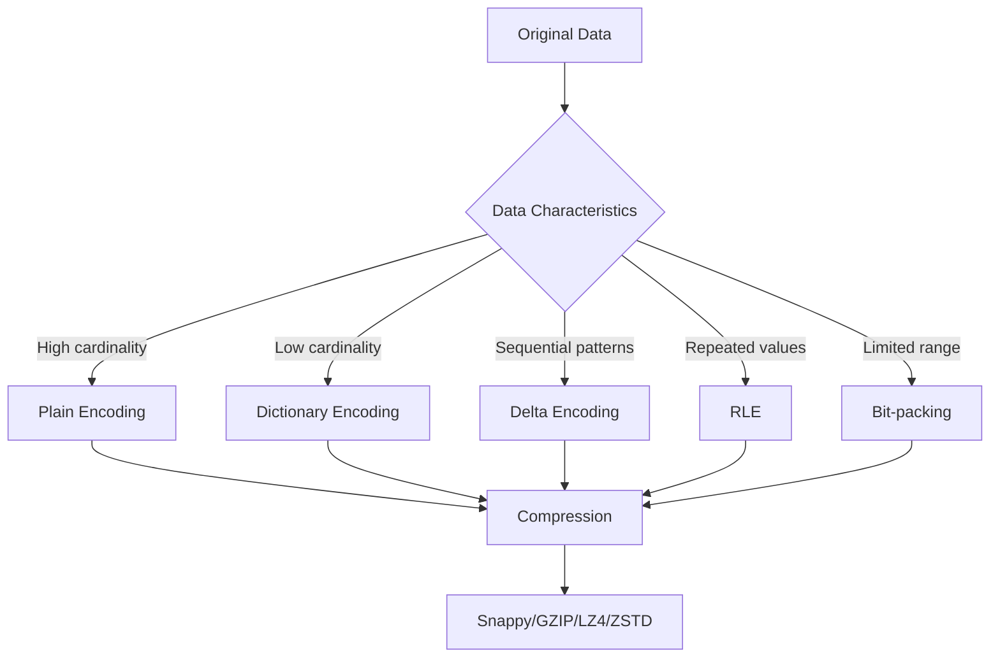
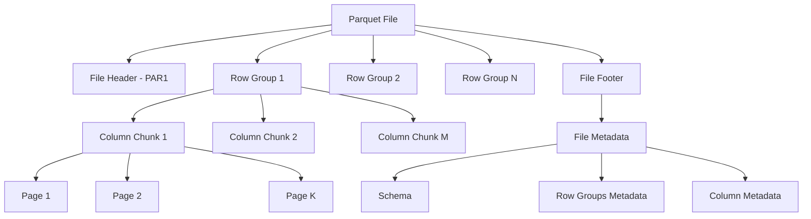
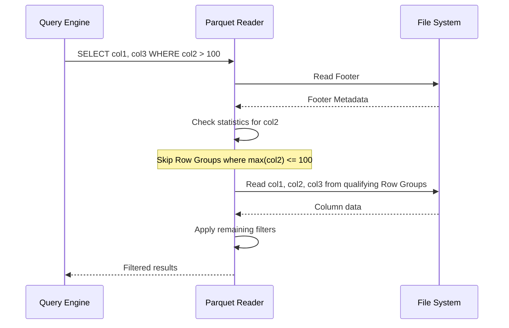
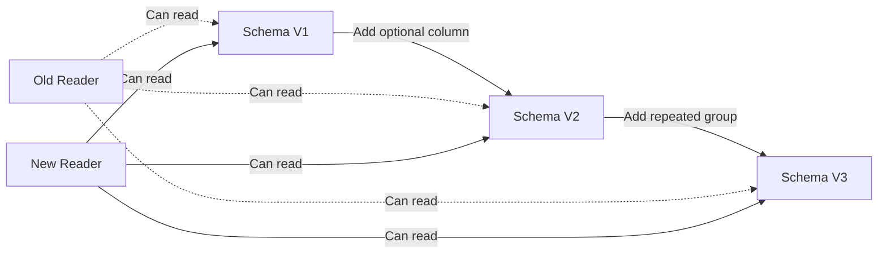

# Parquet

Apache Parquetは、Hadoopエコシステムを中心とした分析ワークロードのために設計された列指向ストレージフォーマットである。2013年にTwitterとClouderaによって開発が開始され、現在ではApache Software Foundationのトップレベルプロジェクトとして、ビッグデータ処理の標準的なファイルフォーマットの一つとなっている[^1]。

列指向ストレージの本質は、同じ列の値を物理的に連続して配置することにある。これは行指向ストレージとは根本的に異なるアプローチであり、分析クエリのパフォーマンスに劇的な影響を与える。例えば、1000万行のテーブルから特定の3つの列だけを読み取る場合、行指向フォーマットでは全データを読み込む必要があるが、列指向フォーマットでは必要な列のデータのみを読み込めばよい。この差は、I/O帯域幅が制約となる現代のシステムにおいて決定的な意味を持つ。



## データモデルとスキーマ定義

Parquetのデータモデルは、Google Dremelの論文[^2]で提案されたrecord-shredding and assemblyアルゴリズムに基づいている。このアプローチの核心は、ネストした階層的なデータ構造を効率的に列形式で表現することにある。単純なフラットなテーブルとは異なり、Parquetは任意の深さのネストしたデータ構造を扱うことができる。

スキーマ定義において、Parquetは3つの基本的な概念を導入している：definition level、repetition level、そしてvalueである。これらの概念により、NULLを含む可能性のあるネストしたデータを曖昧さなく表現できる。Definition levelは、ある値がどの深さまで定義されているかを示し、repetition levelは、どのレベルで繰り返しが発生しているかを示す。



この例では、addressフィールドは省略可能なグループで、その中にstreetとcityという2つのフィールドを持つ。phone_numbersは繰り返し可能なグループで、複数の電話番号を格納できる。各フィールドのdefinition levelとrepetition levelを追跡することで、元のネストした構造を完全に再構築できる。

## エンコーディングと圧縮戦略

Parquetの性能の秘密は、洗練されたエンコーディングと圧縮戦略にある。列指向ストレージの利点の一つは、同じ型の値が連続して配置されることで、より効果的な圧縮が可能になることである。Parquetは複数のエンコーディング手法をサポートしており、データの特性に応じて最適な手法を選択する。

Plain encodingは最も基本的な手法で、値をそのまま格納する。しかし、多くの場合、より洗練された手法が使用される。Dictionary encodingは、重複する値が多い列に対して特に効果的である。各ユニークな値に整数IDを割り当て、実際のデータではIDのみを格納する。これにより、文字列のような大きな値を持つ列でも大幅な圧縮が可能になる。

Run-length encoding (RLE)は、同じ値が連続して出現する場合に有効である。Bit-packingは、整数値が取りうる範囲が限定されている場合に、各値を表現するのに必要な最小ビット数で格納する。Delta encodingは、連続する値の差分のみを格納することで、時系列データのような単調増加するデータに対して効果的である。



エンコーディングの後、データはさらに汎用圧縮アルゴリズムで圧縮される。Parquetは複数の圧縮アルゴリズムをサポートしており、Snappy、GZIP、LZ4、ZSTDなどが利用可能である。Snappyは圧縮率よりも速度を重視し、GZIPは圧縮率を重視する。ZSTDは両者のバランスを取った比較的新しい選択肢である。

## ファイル構造とメタデータ管理

Parquetファイルの物理的な構造は、効率的なデータアクセスを可能にするよう慎重に設計されている。ファイルは複数のRow Groupに分割され、各Row Groupは複数のColumn Chunkを含む。Column Chunkはさらに複数のPageに分割される。この階層的な構造により、必要なデータだけを選択的に読み込むことが可能になる。



各Pageは通常8KB〜1MB程度のサイズで、これがParquetの読み取りの基本単位となる。Pageには複数の種類があり、Data Pageは実際のデータを含み、Dictionary PageはDictionary encodingで使用される辞書を含む。各Pageはヘッダーを持ち、エンコーディング方式、圧縮方式、値の数などのメタデータを含む。

File Footerは、ファイル全体のメタデータを含む重要な部分である。ここにはスキーマ情報、各Row GroupとColumn Chunkの位置とサイズ、統計情報（最小値、最大値、NULL値の数など）が格納される。この設計により、ファイルを開いた際に最初にFooterを読み込むだけで、ファイル全体の構造を把握できる。

## クエリ最適化とPredicate Pushdown

Parquetの真の力は、クエリ実行時の最適化機能にある。Predicate pushdownは、WHERE句の条件をストレージレイヤーにプッシュダウンすることで、不要なデータの読み込みを避ける技術である。Parquetは各Column ChunkとPageに対して統計情報を保持しているため、クエリエンジンは実際にデータを読み込む前に、そのデータが条件を満たす可能性があるかを判断できる。

例えば、`WHERE age > 30`という条件がある場合、あるColumn Chunkの最大値が25であれば、そのChunk全体をスキップできる。この最適化は、Row Group、Column Chunk、Pageの各レベルで適用される。統計情報にはmin/max値だけでなく、Bloom Filterを使用することもでき、より複雑な条件に対しても効果的なフィルタリングが可能になる。

Projection pushdownは、必要な列のみを読み込む最適化である。列指向ストレージの基本的な利点であるが、Parquetの場合、メタデータを活用してさらに効率化される。必要な列のColumn Chunkの位置が事前にわかるため、ファイル内の該当部分のみを選択的に読み込むことができる。



## ページインデックスとBloom Filter

Parquet format version 2.4以降では、ページレベルのインデックスが導入された[^3]。これにより、Row Group内でもより細かい粒度でのデータスキップが可能になった。ページインデックスには、Column IndexとOffset Indexの2種類がある。

Column Indexは各ページの統計情報（min/max値、null count、データページのサイズなど）を含む。これにより、Row Group全体ではなく、個々のページレベルでpredicate pushdownを適用できる。Offset Indexは各ページの物理的な位置を記録し、必要なページのみを効率的に読み込むことを可能にする。

Bloom Filterは、確率的データ構造を使用して、特定の値が存在しないことを高速に判定する。False positiveは発生する可能性があるが、false negativeは発生しない。つまり、Bloom Filterが「存在しない」と判定した場合、その値は確実に存在しない。これは、高カーディナリティの列に対するpoint lookupクエリで特に有効である。

## 実装の詳細と性能特性

Parquetの実装において重要な設計決定の一つは、メモリ効率である。大規模なデータセットを扱う際、全てのデータをメモリに読み込むことは現実的でない。Parquetリーダーは、ストリーミング方式でデータを処理し、必要最小限のメモリで動作するよう設計されている。

書き込み時には、Row Groupのサイズが重要なパラメータとなる。Row Groupが大きすぎると、メモリ使用量が増加し、また読み取り時の粒度が粗くなる。一方、小さすぎると、メタデータのオーバーヘッドが増加し、圧縮効率が低下する。一般的には、Row Groupのサイズは128MB〜1GB程度に設定される。

```
// Typical write configuration
ParquetWriter.Builder builder = ParquetWriter.builder(path)
    .withRowGroupSize(128 * 1024 * 1024)  // 128MB
    .withPageSize(1024 * 1024)             // 1MB
    .withDictionaryPageSize(2 * 1024 * 1024)  // 2MB
    .withDictionaryEncoding(true)
    .withCompressionCodec(CompressionCodecName.SNAPPY);
```

パフォーマンスの観点から、Parquetは特に分析クエリに対して優れた性能を発揮する。列の選択性が高いクエリ（少数の列のみを参照）では、行指向フォーマットと比較して10〜100倍の性能向上が観測されることもある。また、集計クエリでは、列データが連続して配置されているため、CPUキャッシュの効率が良く、ベクトル化された処理が可能になる。

## データ型とスキーマ進化

Parquetは豊富なデータ型をサポートしており、プリミティブ型（boolean、int32、int64、float、double、binary、fixed_len_byte_array）と論理型（文字列、日付、時刻、10進数など）を区別している。論理型は、プリミティブ型の上に意味的な解釈を追加するもので、例えばUTF-8文字列はbinary型に論理型アノテーションを付けることで表現される。

スキーマ進化は、長期間にわたってデータを保存する際の重要な考慮事項である。Parquetは、後方互換性のあるスキーマ変更をサポートしている。新しい列の追加は常に安全であり、古いリーダーは単に新しい列を無視する。列の削除や型の変更はより複雑で、アプリケーションレベルでの注意深い管理が必要となる。



## 圧縮アルゴリズムの選択とトレードオフ

圧縮アルゴリズムの選択は、ストレージコスト、CPU使用率、I/O帯域幅のトレードオフを考慮する必要がある。Snappyは圧縮・解凍速度が速く、CPUオーバーヘッドが小さいため、リアルタイムに近い処理が必要な場合に適している。圧縮率は他のアルゴリズムと比較して低いが、多くの場合、I/O削減による利益がCPUコストを上回る。

GZIPは高い圧縮率を提供するが、CPU使用率も高い。長期保存やネットワーク転送コストが高い環境では有効な選択肢となる。LZ4はSnappyよりも若干良い圧縮率を提供しながら、同等の速度を維持する。ZSTDは最新のアルゴリズムで、圧縮レベルを調整可能であり、幅広い用途に対応できる。

実際の選択は、ワークロードの特性に依存する。頻繁にアクセスされるホットデータにはSnappyやLZ4、コールドストレージにはGZIPやZSTDの高圧縮レベルを使用するというような使い分けが一般的である。

## 他のフォーマットとの比較

ビッグデータエコシステムには、ORC、Avro、CSVなど複数のファイルフォーマットが存在する。ORCはParquetと同様の列指向フォーマットで、特にHiveでの使用に最適化されている。ORCはより積極的な統計情報の収集とインデックスを行い、一部のワークロードではParquetよりも高速である。しかし、Parquetの方がより広いエコシステムサポートを持つ。

Avroは行指向フォーマットで、ストリーミングやメッセージングシステムでの使用に適している。スキーマ進化に対する優れたサポートを持ち、データの書き込みが高速である。しかし、分析クエリの性能ではParquetに劣る。

CSVは人間が読めるテキストフォーマットで、シンプルさが最大の利点である。しかし、型情報の欠如、圧縮効率の悪さ、パース処理の遅さなど、大規模データ処理には適さない。

## 実践的な設計ガイドライン

Parquetを効果的に使用するためには、いくつかの設計原則に従うことが重要である。まず、パーティショニング戦略を慎重に検討する必要がある。時系列データであれば日付でパーティショニングし、地理データであれば地域でパーティショニングするなど、クエリパターンに応じた設計が必要である。

列の順序も重要な考慮事項である。頻繁にフィルタリングに使用される列を前方に配置することで、predicate pushdownの効果を最大化できる。また、相関の高い列を近くに配置することで、圧縮効率を向上させることができる。

データ型の選択も性能に影響する。可能な限り最小のデータ型を使用し、文字列よりも列挙型や辞書エンコーディングが適用可能なカテゴリカルデータを使用することが推奨される。NULL値の扱いも重要で、NULLが多い列は別のテーブルに分離することで、ストレージ効率を向上させることができる。

[^1]: Apache Parquet公式ドキュメント: https://parquet.apache.org/docs/
[^2]: Melnik, S., et al. (2010). "Dremel: Interactive Analysis of Web-Scale Datasets." Proceedings of the VLDB Endowment, 3(1-2), 330-339.
[^3]: Apache Parquet Format Specification v2.9.0: https://github.com/apache/parquet-format/blob/master/README.md