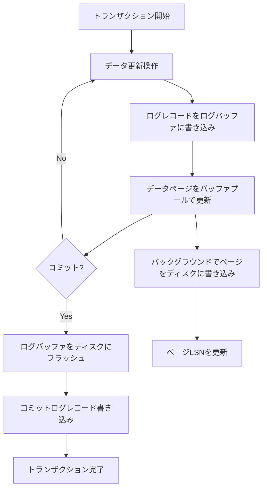
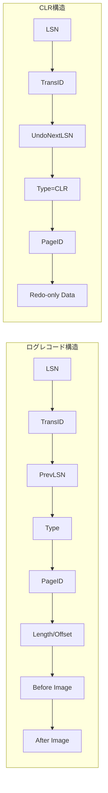
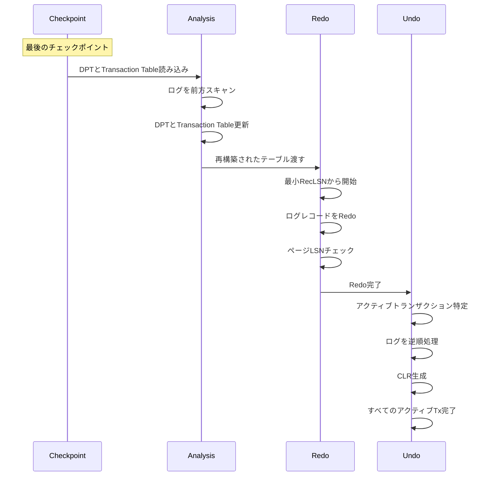
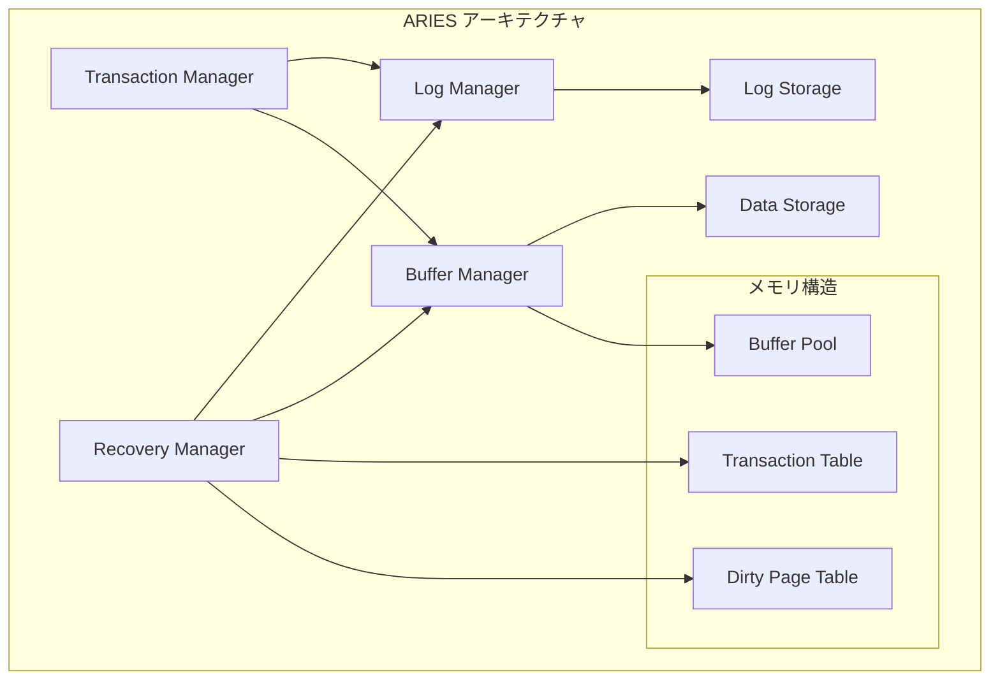

# ARIES (Algorithm for Recovery and Isolation Exploiting Semantics)

ARIESは、1992年にIBMのC. Mohanらによって提案されたデータベース管理システムのトランザクション処理とリカバリーのためのアルゴリズムである[^1]。このアルゴリズムは、システムクラッシュや障害からの効率的な回復を可能にし、現代の商用データベースシステムの基盤となっている。ARIESの設計は、高い並行性を維持しながら、トランザクションのACID特性を保証することを目的としている。

ARIESが登場する以前、データベースシステムのリカバリー機構は、シャドウページングやディファード更新などの手法を採用していた。しかし、これらの手法は、ページレベルのロックによる並行性の制限や、リカバリー時の非効率性といった問題を抱えていた。ARIESは、Write-Ahead Logging（WAL）プロトコルを基礎とし、物理ログと論理ログの組み合わせ、ページ指向のリカバリー、そして効率的なチェックポイント機構を統合することで、これらの問題を解決した。

## Write-Ahead Loggingの原則

ARIESの中核を成すのがWrite-Ahead Logging（WAL）プロトコルである。このプロトコルは、データベースページへの変更を永続ストレージに書き込む前に、その変更を記述するログレコードを必ず先にログファイルに書き込むという原則に基づいている。この単純な原則により、システムクラッシュが発生した場合でも、ログを参照することで失われた変更を再構築できる。

WALプロトコルは以下の2つの基本ルールから構成される。第一に、修正されたデータベースページをディスクに書き込む前に、そのページに関連するすべてのログレコードをディスクに書き込まなければならない。これは「force-log-at-commit」ルールとして知られ、トランザクションの永続性を保証する。第二に、トランザクションがコミットされる前に、そのトランザクションのすべてのログレコードをディスクに書き込まなければならない。これにより、コミット済みトランザクションの変更は、システムクラッシュ後も確実に復元される。

## ログレコードの構造とLog Sequence Number

ARIESにおけるログレコードは、データベースで発生したすべての変更を記録する基本単位である。各ログレコードは、Log Sequence Number（LSN）と呼ばれる単調増加する一意の識別子を持つ。LSNは通常、ログファイル内のバイトオフセットとして実装され、ログレコードの順序関係を明確に定義する。

ログレコードには複数の種類が存在し、それぞれが特定の目的を持つ。更新ログレコードは、データページへの変更を記録し、以下の情報を含む：LSN、トランザクションID、前のログレコードへのポインタ（PrevLSN）、ログレコードタイプ、ページID、変更の長さとオフセット、変更前のデータ（Undo情報）、変更後のデータ（Redo情報）。この構造により、変更を適用（Redo）することも、取り消す（Undo）ことも可能となる。

Compensation Log Record（CLR）は、ARIESの重要な革新の一つである。CLRは、ロールバック操作中に生成される特別なログレコードで、元の更新操作を取り消す操作を記録する。CLRの特徴は、それ自体は決してUndoされないことであり、これによりロールバック中のクラッシュからの回復が簡潔になる。CLRは、取り消された操作の次にUndoすべきログレコードへのポインタ（UndoNextLSN）を含み、Undo処理の進行状況を追跡する。

## リカバリーの3フェーズ

ARIESのリカバリープロセスは、Analysis、Redo、Undoの3つのフェーズから構成される。この3フェーズアプローチにより、システムクラッシュ時の状態を正確に再構築し、コミット済みトランザクションの永続性を保証しながら、未コミットトランザクションの影響を完全に除去できる。

Analysisフェーズは、最後のチェックポイントから開始し、ログを前方にスキャンして、クラッシュ時のシステム状態を再構築する。このフェーズでは、Dirty Page Table（DPT）とTransaction Tableを構築する。DPTは、クラッシュ時にメモリ上で修正されていたがディスクに書き込まれていない可能性のあるページを追跡する。各エントリは、ページIDとそのページがダーティになった最初のLSN（RecLSN）を含む。Transaction Tableは、クラッシュ時にアクティブだったトランザクションと、各トランザクションの最後のログレコードのLSNを記録する。

Redoフェーズは、「履歴を繰り返す」フェーズとも呼ばれ、DPT内の最小のRecLSNから開始してログを前方にスキャンする。各更新ログレコードとCLRに対して、そのページがDPTに存在し、かつログレコードのLSNがページのLSNより大きい場合、その操作を再適用する。この条件チェックにより、すでにディスクに書き込まれた変更を重複して適用することを防ぐ。Redoフェーズは、ページの内容をクラッシュ直前の状態まで復元し、バッファプールの状態を再現する。

Undoフェーズは、未コミットトランザクションの影響を取り消す。Transaction Tableに残っているアクティブトランザクション（コミットもアボートも記録されていないトランザクション）に対して、そのログレコードを逆順に処理する。各更新ログレコードに対してUndo操作を実行し、対応するCLRを生成する。CLRに遭遇した場合は、UndoNextLSNを使用して次にUndoすべきログレコードにジャンプする。この最適化により、部分的にロールバックされたトランザクションの処理が効率化される。

## チェックポイントとファジーチェックポイント

ARIESは、ファジーチェックポイントと呼ばれる非ブロッキングチェックポイント機構を採用している。従来のチェックポイント手法では、チェックポイント中にすべてのトランザクション処理を停止する必要があったが、ファジーチェックポイントは、システムの通常動作を妨げることなくチェックポイントを取得できる。

チェックポイントプロセスは、begin_checkpointログレコードの書き込みから始まる。その後、現在のDirty Page TableとTransaction Tableの内容をend_checkpointログレコードに記録する。重要なのは、チェックポイント中もトランザクション処理が継続され、ダーティページのディスクへの書き込みも強制されないことである。これにより、チェックポイントのオーバーヘッドが最小限に抑えられる。

マスターレコードと呼ばれる特別なレコードが、最後に完了したチェックポイントのbegin_checkpointレコードのLSNを保持する。リカバリー時には、このマスターレコードを読み込んで、どこからAnalysisフェーズを開始すべきかを決定する。ファジーチェックポイントの採用により、チェックポイント頻度を高めることができ、結果としてリカバリー時間を短縮できる。

## 物理ログと論理ログの統合

ARIESは、物理ログと論理ログの両方の利点を活かすハイブリッドアプローチを採用している。物理ログは、ページ内の特定のバイト位置での変更を記録し、適用が単純で冪等性を持つという利点がある。一方、論理ログは、高レベルの操作（例：「レコードを挿入」）を記録し、ログサイズが小さく、スキーマ変更に対して柔軟であるという特徴を持つ。

ARIESでは、通常の更新操作には物理ログを使用し、ページ分割やマージなどの構造変更操作には論理ログを使用する。この使い分けにより、単純な更新操作の高速な処理と、複雑な操作の正確な記録の両立を実現している。特に、Bツリーのようなアクセスメソッドでは、リーフページの更新は物理ログで記録し、ノードの分割やマージは論理ログで記録することが一般的である。

論理操作の実行中にクラッシュが発生した場合の処理は特に重要である。ARIESは、論理操作を「ミニトランザクション」として扱い、操作の開始と終了を明示的にログに記録する。リカバリー時に未完了の論理操作を検出した場合、その操作全体をUndoし、必要に応じて再実行する。

## ページ指向リカバリーとログ記録の最適化

ARIESのもう一つの重要な特徴は、ページ指向のリカバリーアプローチである。各データベースページには、そのページに適用された最後のログレコードのLSN（PageLSN）が記録される。このPageLSNにより、Redoフェーズで特定の変更がすでに適用されているかどうかを効率的に判断できる。

ログ記録の最適化として、ARIESは複数の技術を採用している。グループコミットは、複数のトランザクションのコミットログレコードを一度のI/O操作でディスクに書き込む技術である。これにより、ディスクI/Oの回数を削減し、スループットを向上させる。また、ログレコードの圧縮技術も重要である。連続する同一ページへの更新を単一のログレコードに統合したり、デルタ記録（変更された部分のみを記録）を使用することで、ログサイズを削減できる。

バッファ管理との統合も、ARIESの効率性に貢献している。Steal/No-Forceポリシーの採用により、未コミットトランザクションの変更を含むページをディスクに書き込むこと（Steal）が可能であり、コミット時にすべての変更をディスクに強制的に書き込む必要がない（No-Force）。このポリシーにより、バッファプールの効率的な利用とトランザクションの高速なコミットが可能となる。

## 実装における重要な考慮事項

ARIESの実装において、いくつかの重要な考慮事項が存在する。まず、ログの切り詰め（truncation）である。ログファイルは無限に成長することはできないため、不要になった古いログレコードを定期的に削除する必要がある。ARIESでは、最も古いアクティブトランザクションの最初のログレコードと、DPT内の最小のRecLSNより前のログレコードは切り詰め可能である。

メディア障害からの回復も重要な課題である。ARIESは、定期的なバックアップとアーカイブログの組み合わせにより、メディア障害からの回復をサポートする。バックアップからデータベースを復元した後、アーカイブログを使用してバックアップ時点から障害発生時点までの変更を再適用する。

並行性制御との統合も慎重に設計する必要がある。ARIESは特定のロック機構に依存しないが、ロックマネージャーとの適切な連携が必要である。特に、Undoフェーズでは、ロールバック中のトランザクションが保持していたロックを適切に解放し、デッドロックを防ぐ必要がある。

性能の最適化には、複数の側面がある。ログバッファのサイズとフラッシュ戦略の調整、チェックポイント頻度の最適化、並列リカバリーの実装などが含まれる。特に大規模なデータベースでは、複数のログストリームを使用した並列ログ記録や、パーティションごとの独立したリカバリーが有効である。

ARIESは、その設計の優雅さと実装の効率性により、商用データベースシステムの標準的なリカバリーアルゴリズムとなった。IBM DB2、Microsoft SQL Server、PostgreSQLなど、多くの主要なデータベースシステムがARIESまたはその変種を採用している。ARIESの原則は、分散データベースやインメモリデータベースなど、新しいアーキテクチャにも適応され続けている。トランザクション処理とリカバリーの分野において、ARIESは理論と実践の完璧な融合を示す傑作であり、その影響は今後も続くことが予想される。

[^1]: C. Mohan, D. Haderle, B. Lindsay, H. Pirahesh, and P. Schwarz. "ARIES: A Transaction Recovery Method Supporting Fine-Granularity Locking and Partial Rollbacks Using Write-Ahead Logging." ACM Transactions on Database Systems, Vol. 17, No. 1, March 1992.