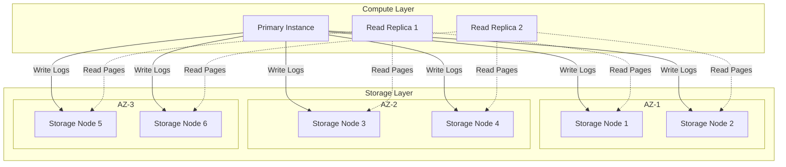
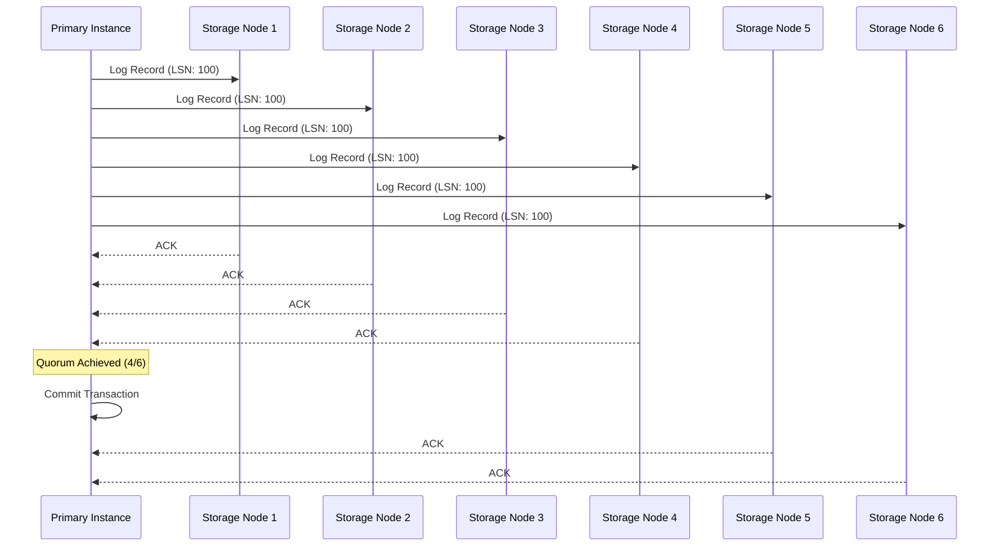
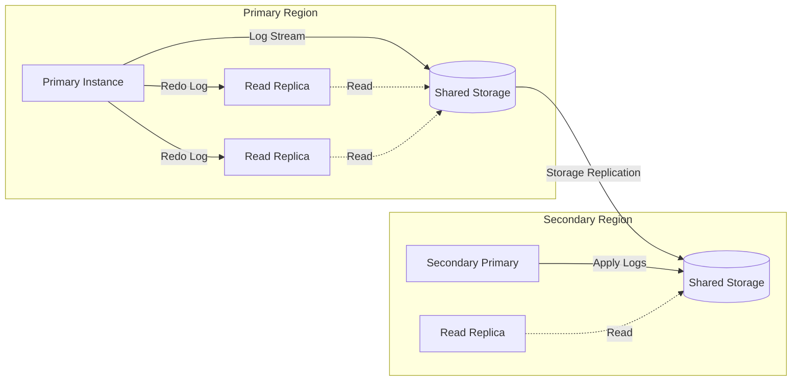
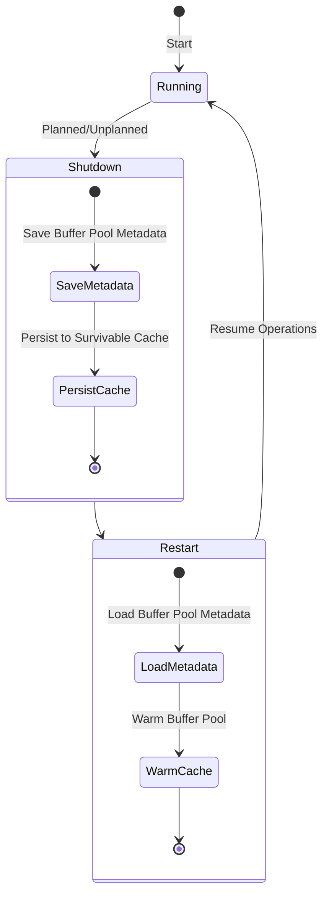

# Amazon Aurora

Amazon Auroraは、MySQLおよびPostgreSQLと互換性を持つクラウドネイティブなリレーショナルデータベースサービスである。2014年のAWS re:Inventで発表されたAuroraは、従来のモノリシックなデータベースアーキテクチャを根本的に見直し、クラウド環境に最適化された分散ストレージシステムを基盤とすることで、高い可用性とスケーラビリティを実現している[^1]。

Auroraの設計思想は、計算層とストレージ層の分離という原則に基づいている。この分離により、それぞれの層を独立してスケールさせることが可能となり、従来のデータベースシステムが抱えていた多くの制約を克服している。特に注目すべきは、ストレージ層におけるログ構造化設計の採用であり、これによりネットワーク帯域の効率的な利用と高速なリカバリが実現されている。

## アーキテクチャの全体像

Auroraのアーキテクチャは、大きく分けて計算層（Database Engine）とストレージ層（Aurora Storage）の2つのコンポーネントから構成される。計算層は従来のMySQLやPostgreSQLのエンジンをベースとしているが、ストレージインターフェースは完全に書き換えられている。一方、ストレージ層は完全にAWS独自の実装となっており、複数のアベイラビリティゾーン（AZ）にまたがる分散システムとして設計されている。

計算層のプライマリインスタンスは、トランザクションの処理とログの生成を担当する。生成されたログは、6つのストレージノードに並列に送信され、各ノードはログを永続化して必要に応じてデータページを生成する。この設計により、プライマリインスタンスはデータページの書き込みから解放され、ネットワーク帯域を大幅に削減することができる。

## ログ構造化ストレージの革新

Auroraの最も革新的な設計決定の一つは、ログ構造化ストレージの採用である。従来のデータベースシステムでは、データページとログの両方をディスクに書き込む必要があったが、Auroraではログのみを永続化し、データページはログから必要に応じて生成される。この「The log is the database」という設計思想により、書き込み時のI/O量を大幅に削減している[^2]。

ストレージノードは受信したログレコードを永続化し、バックグラウンドでデータページを生成する。この処理は非同期で行われるため、書き込みレイテンシに影響を与えない。また、各ストレージノードは独立してログを処理できるため、システム全体のスケーラビリティが向上している。

## Quorumベースのレプリケーション

Auroraは、データの耐久性と可用性を確保するために、Quorumベースのレプリケーションプロトコルを採用している。各データセグメント（10GBのチャンク）は6つのコピーを持ち、3つのAZにそれぞれ2つずつ配置される。書き込み操作は6つのうち4つのコピーへの書き込みが成功した時点で完了とみなされ（Write Quorum = 4）、読み取り操作は6つのうち3つのコピーから読み取ることができれば成功する（Read Quorum = 3）。

この構成により、Auroraは以下の障害シナリオに対して耐性を持つ：
- 1つのAZ全体の障害に対して、書き込みと読み取りの両方が継続可能
- 2つのストレージノードの同時障害に対して、書き込みが継続可能
- 3つのストレージノードの同時障害に対して、読み取りが継続可能

Quorumの設定（Vw = 4, Vr = 3）は、以下の条件を満たすように選択されている：
- Vr + Vw > V（読み取りクォーラムと書き込みクォーラムの和が総レプリカ数より大きい）
- Vw > V/2（書き込みクォーラムが過半数を超える）

これらの条件により、読み取り時に必ず最新のデータを取得できることが保証される。

## 障害検出と自動修復

Auroraのストレージシステムは、継続的に障害を検出し、自動的に修復する機能を持っている。各ストレージノードは、ピアツーピアのゴシッププロトコルを使用して相互に監視し合い、障害が検出されると即座に修復プロセスが開始される。

修復プロセスは以下のステップで実行される：

1. 障害が検出されると、該当するセグメントの新しいコピーを作成する場所が選択される
2. 健全なノードから最新のデータがコピーされる
3. 新しいノードがQuorumに参加し、障害ノードがQuorumから除外される

この修復プロセスは10秒程度で完了し、MTTRを大幅に短縮している。また、修復中もシステムは通常通り動作を継続できるため、可用性への影響は最小限に抑えられる。

## 読み取りレプリカの実装

Auroraの読み取りレプリカは、従来のMySQLレプリケーションとは根本的に異なる方式で実装されている。従来の方式では、プライマリからレプリカへバイナリログを転送し、レプリカ側で再実行する必要があったが、Auroraでは全てのインスタンスが同じストレージ層を共有しているため、ログの転送や再実行は不要である。

読み取りレプリカは、プライマリインスタンスが生成したログのメタデータのみを受信し、自身のバッファプールを更新する。これにより、レプリケーションラグは通常10-20ミリ秒程度に抑えられ、ほぼリアルタイムでの読み取りが可能となっている。

## パフォーマンス特性と最適化

Auroraのパフォーマンス特性は、従来のデータベースシステムとは大きく異なる。最も顕著な違いは、書き込み性能がネットワーク帯域に依存し、ディスクI/Oには依存しないという点である。プライマリインスタンスは、各トランザクションで生成されるログレコード（通常は数KB）のみをネットワーク経由で送信すればよく、データページ（16KB）の書き込みは不要である。

この設計により、Auroraは以下のようなパフォーマンス特性を示す：

書き込みパフォーマンスは、ログレコードのサイズとネットワーク帯域幅に依存する。一般的なOLTPワークロードでは、従来のMySQLと比較して5倍程度のスループット向上が観測されている。特に、大量の小さなトランザクションを処理する場合に、この優位性が顕著に現れる。

読み取りパフォーマンスは、バッファプールのヒット率に大きく依存する。ミスが発生した場合、ストレージノードからページを取得する必要があるが、この処理は並列化されており、複数のストレージノードから同時に読み取ることができる。また、読み取りレプリカを追加することで、読み取りスループットを線形にスケールさせることが可能である。

## バックアップとリカバリ

Auroraのバックアップメカニズムも、従来のデータベースシステムとは根本的に異なる。継続的バックアップが自動的に実行され、任意の時点（秒単位）へのリストアが可能である。バックアップデータはS3に保存され、ストレージノードは増分バックアップのみを送信するため、バックアップによるパフォーマンスへの影響は最小限に抑えられている。

Point-in-Time Recovery（PITR）は、保存されているログレコードを指定された時点まで再生することで実現される。この処理は並列化されており、データベースのサイズに関わらず、通常は5分以内にリストアが完了する。

## キャッシュ管理とウォームアップ

Auroraは、インスタンスの再起動後もバッファプールの内容を保持する「サバイバルキャッシュ」機能を提供している。この機能により、計画的なメンテナンスや予期しない再起動の後でも、すぐに高いパフォーマンスを発揮することができる。

サバイバルキャッシュは、バッファプール内のページのメタデータを別プロセスで管理し、データベースエンジンのプロセスがクラッシュしても失われないようにしている。再起動時には、このメタデータを使用してバッファプールを迅速に再構築する。

## グローバルデータベースとディザスタリカバリ

Aurora Global Databaseは、複数のAWSリージョンにまたがるデータベースクラスタを構成する機能である。プライマリリージョンでの更新は、1秒未満の遅延でセカンダリリージョンにレプリケートされる。この低遅延レプリケーションは、ストレージレベルでの物理レプリケーションによって実現されており、論理レプリケーションと比較して効率的である。

ディザスタリカバリのシナリオでは、セカンダリリージョンを数分以内にプライマリに昇格させることができる。この処理は完全に自動化されており、アプリケーションコードの変更は最小限で済む。RPO（Recovery Point Objective）は通常1秒未満、RTO（Recovery Time Objective）は1分未満を達成している。

## トランザクション処理とMVCC

Auroraは、MySQLおよびPostgreSQLと同じMVCC（Multi-Version Concurrency Control）モデルを採用しているが、その実装は最適化されている。特に、undo logの管理がストレージ層で効率的に行われることで、長時間実行されるトランザクションがシステム全体のパフォーマンスに与える影響が軽減されている。

Read Viewの生成と管理も最適化されており、読み取り専用トランザクションのオーバーヘッドは最小限に抑えられている。また、ストレージ層でのガベージコレクションは、アクティブなトランザクションの状態を考慮して適応的に実行される。

## 実践的な設計指針

Auroraを効果的に活用するためには、その特性を理解した上でアプリケーションを設計する必要がある。以下に主要な設計指針を示す。

接続プーリングは必須である。Auroraは高いスループットを実現できるが、接続の確立にはオーバーヘッドがある。アプリケーション側で適切な接続プールを実装し、接続の再利用を行うことが重要である。ProxySQL[^3]やPgBouncerなどの接続プーラーの使用も検討すべきである。

書き込みと読み取りの分離は、Auroraの能力を最大限に活用するために重要である。読み取りレプリカのレプリケーションラグは非常に小さいため、多くのユースケースで読み取りレプリカを活用できる。ただし、強い一貫性が必要な場合は、プライマリインスタンスからの読み取りが必要である。

バッチ処理の最適化も重要な考慮事項である。大量のデータを挿入する場合、適切なバッチサイズを選択することで、ネットワーク効率とトランザクションオーバーヘッドのバランスを取る必要がある。一般的には、1トランザクションあたり1000-5000行程度が適切とされている。

## モニタリングとチューニング

Auroraの運用において、適切なモニタリングは不可欠である。CloudWatchメトリクスに加えて、Performance Insightsを活用することで、詳細なパフォーマンス分析が可能となる。特に重要なメトリクスは以下の通りである：

- **VolumeReadIOPS / VolumeWriteIOPS**: ストレージ層でのI/O操作数を示す。これらの値が急激に増加する場合、バッファプールのヒット率が低下している可能性がある。
- **AuroraReplicaLag**: 読み取りレプリカの遅延を示す。通常は20ミリ秒以下であるべきだが、大量の書き込みが発生している場合は増加する可能性がある。
- **CommitLatency**: トランザクションのコミットにかかる時間を示す。ネットワークレイテンシやストレージノードの負荷を反映する。
- **BufferCacheHitRatio**: バッファプールのヒット率を示す。95%以上を維持することが推奨される。

パラメータチューニングにおいては、Auroraは多くのパラメータを自動的に管理するため、手動でのチューニングは最小限で済む。ただし、ワークロードの特性に応じて、innodb_buffer_pool_sizeやmax_connectionsなどの基本的なパラメータは調整が必要な場合がある。

## コスト最適化戦略

Auroraのコストは、インスタンスの使用時間、ストレージ容量、I/O操作数、バックアップストレージなどの複数の要素から構成される。コスト最適化のためには、以下の戦略が有効である：

Aurora Serverlessの活用は、変動の大きいワークロードに対して効果的である。アイドル時には自動的にスケールダウンし、負荷が増加すると自動的にスケールアップする。開発環境やテスト環境では、特にコスト効率が高い。

読み取りレプリカの適切な配置も重要である。全てのアベイラビリティゾーンに読み取りレプリカを配置する必要はなく、アプリケーションの要求に応じて最適な数と配置を選択すべきである。

I/O操作の最適化は、直接的にコストに影響する。効率的なインデックス設計、適切なクエリ最適化、バッファプールの有効活用により、I/O操作数を削減できる。

## セキュリティ考慮事項

Auroraは、複数のレイヤーでセキュリティを提供している。ネットワークレベルでは、VPC内での実行とセキュリティグループによるアクセス制御が基本となる。データベースレベルでは、IAM認証[^4]との統合により、より細かいアクセス制御が可能である。

暗号化については、保管時の暗号化と転送時の暗号化の両方がサポートされている。保管時の暗号化はKMSと統合されており、暗号化キーのローテーションも自動的に行われる。転送時の暗号化は、SSL/TLSを使用して実現される。

監査ログの有効化により、全てのデータベースアクティビティを記録し、コンプライアンス要件を満たすことができる。ログはCloudWatch LogsまたはS3に送信され、長期保存と分析が可能である。

Auroraは、クラウドネイティブなアーキテクチャにより、従来のデータベースシステムの限界を超えた可用性、スケーラビリティ、パフォーマンスを実現している。その革新的な設計、特にログ構造化ストレージとQuorumベースのレプリケーションは、分散システムの設計における重要な先例となっている。実践的な利用においては、その特性を理解し、適切な設計パターンを適用することで、真の価値を引き出すことができる。

[^1]: Verbitski, A., Gupta, A., Saha, D., Brahmadesam, M., Gupta, K., Mittal, R., ... & Bao, T. (2017). Amazon Aurora: Design considerations for high throughput cloud-native relational databases. In Proceedings of the 2017 ACM International Conference on Management of Data (pp. 1041-1052).

[^2]: The log-structured storage design in Aurora eliminates the need to write data pages from the database tier, reducing network traffic by an order of magnitude compared to traditional mirrored databases.

[^3]: ProxySQL is an advanced MySQL proxy that provides connection pooling, query routing, and caching capabilities, making it particularly suitable for Aurora deployments.

[^4]: AWS Identity and Access Management (IAM) database authentication provides an additional layer of security by allowing database access using IAM credentials instead of passwords.