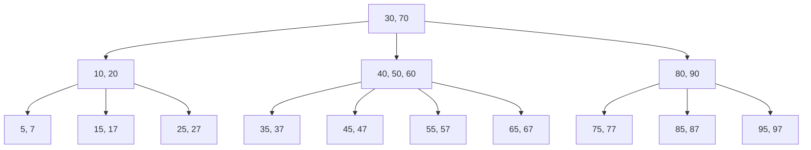
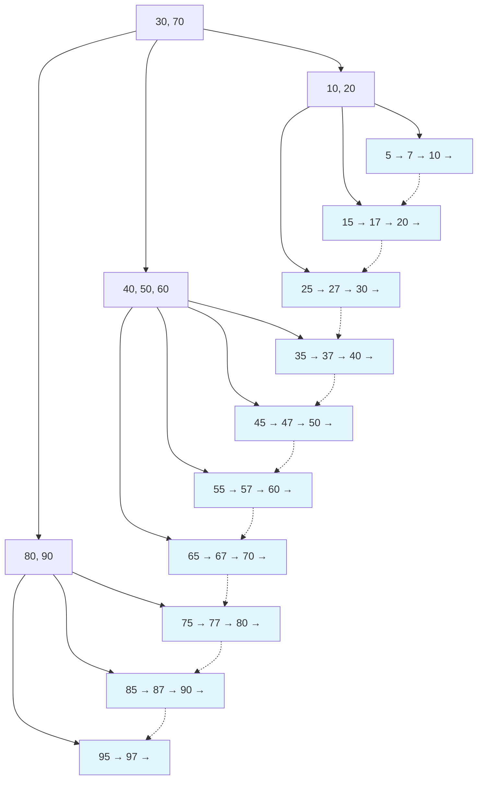
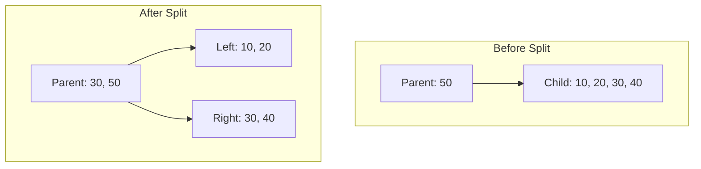

# B-Tree/B+Tree

B-TreeとB+Treeは、現代のデータベース管理システムにおいて最も重要なデータ構造の一つである。1970年代にボーイング・コンピュータ・サービスのRudolf BayerとEdward M. McCarrightによって考案されたB-Tree[^1]は、大量のデータを効率的に管理し、高速な検索・挿入・削除を可能にする平衡木構造として設計された。その後、B-Treeの変種として開発されたB+Treeは、特にデータベースのインデックス構造として広く採用され、現在ではPostgreSQL、MySQL、SQLiteなど主要なRDBMSの標準的なインデックス実装となっている。

これらのデータ構造が誕生した背景には、当時のコンピュータシステムにおける主記憶装置と二次記憶装置（主にハードディスク）間の速度差という根本的な問題があった。メモリアクセスに比べてディスクアクセスは数万倍から数十万倍遅く、この差は現在のSSDでも依然として大きい。B-TreeとB+Treeは、ディスクI/Oの回数を最小化することで、この速度差を効果的に緩和する設計となっている。

## B-Treeの構造と特性

B-Treeは多分木（multi-way tree）の一種であり、各ノードが複数の子を持つことができる平衡木構造である。次数（order）mのB-Treeは以下の特性を満たす：

1. 各ノードは最大m-1個のキーと最大m個の子ポインタを持つ
2. ルートノードを除く各ノードは最小⌈m/2⌉-1個のキーを持つ
3. 葉ノードはすべて同じ深さに位置する
4. 各ノード内のキーは昇順にソートされている
5. キーKiの左の子ポインタが指すサブツリーのすべてのキーはKiより小さく、右の子ポインタが指すサブツリーのすべてのキーはKiより大きい



この構造により、B-Treeは以下の重要な特性を実現している：

**ディスクI/Oの最適化**: 各ノードのサイズをディスクのブロックサイズ（典型的には4KBや8KB）に合わせることで、1回のディスクI/Oで多数のキーを読み込むことができる。例えば、4KBのブロックサイズで整数キー（4バイト）とポインタ（8バイト）を格納する場合、1ノードあたり約340個のキーを格納できる。これにより、数百万レコードのテーブルでも3〜4回のディスクアクセスで目的のレコードに到達できる。

**自己平衡性**: B-Treeは挿入・削除操作時に自動的に平衡を保つ。これは、各ノードが持つキーの数に制約を設けることで実現される。ノードがオーバーフロー（キーが多すぎる）やアンダーフロー（キーが少なすぎる）を起こした場合、分割や統合、キーの再配分により平衡を回復する。

**空間効率**: B-Treeの各ノードは少なくとも半分程度のキーを含むことが保証されるため、空間使用率は最悪でも50%以上となる。実際の運用では、ランダムな挿入パターンにおいて約69%の空間使用率が期待できる[^2]。

## B+Treeの構造と改良点

B+Treeは、B-Treeの基本構造を継承しながら、データベースのインデックス用途に特化した最適化を施したデータ構造である。B-Treeとの主要な違いは以下の通りである：

1. **データの配置**: B+Treeでは、すべてのデータ（実際のレコードへのポインタや値）は葉ノードにのみ格納される。内部ノードは検索用のキーとルーティング情報のみを保持する。

2. **葉ノードの連結**: すべての葉ノードは双方向リンクリストで連結されており、範囲検索やシーケンシャルアクセスが効率的に行える。

3. **キーの重複**: 内部ノードのキーは葉ノードのキーのコピーであり、同じキー値が複数の階層に存在する。



これらの設計上の違いにより、B+Treeは以下の利点を提供する：

**範囲検索の効率化**: 葉ノードが連結リストを形成しているため、開始キーから終了キーまでの範囲検索を葉ノード間のポインタを辿るだけで実行できる。例えば、`SELECT * FROM table WHERE key BETWEEN 100 AND 200`のようなクエリは、最初に100を含む葉ノードを見つけた後、リンクを辿って200まで順次アクセスするだけで完了する。

**内部ノードのキャッシュ効率**: データが葉ノードにのみ存在するため、内部ノードはより多くのキーを格納でき、ツリーの高さを低く保つことができる。また、頻繁にアクセスされる内部ノードをメモリキャッシュに保持しやすくなる。

**クラスタリングインデックスとの親和性**: B+Treeの葉ノードに実際のデータ行を格納することで、クラスタリングインデックスを効率的に実装できる。InnoDB（MySQL）では、主キーインデックスがこの方式で実装されている。

## 検索操作の詳細

B-TreeとB+Treeにおける検索操作は、基本的に同じアルゴリズムに従う。キーKを検索する場合、ルートノードから開始して以下の手順を繰り返す：

1. 現在のノード内でKと各キーKiを比較する
2. K < K1の場合、最左の子ポインタを辿る
3. Ki < K < Ki+1の場合、KiとKi+1の間の子ポインタを辿る
4. K > Knの場合（nは最後のキー）、最右の子ポインタを辿る
5. K = Kiの場合、B-Treeではそのノードで検索終了、B+Treeでは葉ノードまで辿る

検索の時間計算量はO(logt n)である。ここで、tは各ノードが持つ平均キー数、nは全キー数である。実際のシステムでは、tの値が大きいため（数百から数千）、非常に少ない回数のノードアクセスで検索が完了する。

## 挿入操作の実装

挿入操作は検索よりも複雑であり、ノードの分割が必要になる場合がある。キーKを挿入する基本的なアルゴリズムは以下の通りである：

1. 検索アルゴリズムを用いて、Kを挿入すべき葉ノードLを見つける
2. Lに空きがある場合、適切な位置にKを挿入して終了
3. Lが満杯の場合、ノードの分割を実行する：
   - Lの中央のキーKmidを選択
   - Kmidより小さいキーを含む新しいノードL1と、Kmidより大きいキーを含む新しいノードL2を作成
   - Kmidを親ノードに昇格させる
   - 親ノードも満杯の場合、再帰的に分割を行う



分割操作により、最悪の場合ルートまで分割が伝播し、ツリーの高さが1増加する。これはB-Treeが成長する唯一の方法であり、すべての葉ノードの深さが同じに保たれる理由でもある。

## 削除操作の複雑性

削除操作は最も複雑な操作であり、ノードのアンダーフローを防ぐための再配分や統合が必要になる。キーKを削除する手順は以下の通りである：

1. Kを含むノードを検索する
2. B-Treeの場合：
   - Kが葉ノードにある場合、単純に削除
   - Kが内部ノードにある場合、inorder predecessor（左部分木の最大値）またはinorder successor（右部分木の最小値）と置換してから削除
3. B+Treeの場合：
   - 必ずKは葉ノードにあるため、単純に削除
   - 内部ノードにKのコピーがある場合、そのまま残すか更新する
4. 削除によりノードのキー数が最小値を下回った場合：
   - 隣接ノードから借用（再配分）が可能な場合、キーを移動
   - 借用が不可能な場合、隣接ノードと統合

削除操作の最も困難な点は、統合が親ノードのキー数減少を引き起こし、連鎖的に上位ノードでも統合が必要になる可能性があることである。最悪の場合、ルートまで統合が伝播し、ツリーの高さが1減少する。

## 実装上の考慮事項

実際のデータベースシステムにおけるB+Tree実装では、理論的な構造に加えて多くの実践的な最適化が施されている：

**バルクローディング**: 大量のデータを一度に挿入する場合、通常の挿入アルゴリズムは非効率的である。代わりに、データを事前にソートし、ボトムアップでB+Treeを構築するバルクローディング手法が用いられる。この方法により、ほぼ100%の空間使用率を達成でき、構築時間もO(n log n)からO(n)に改善される。

**ラッチング（Latching）とロック**: 並行アクセス制御のため、各ノードにラッチ（短期間のロック）を実装する必要がある。一般的な手法として、検索操作ではルートから葉に向かってラッチを取得し、親ノードのラッチは子ノードのラッチ取得後に解放する「ラッチカップリング」が使用される。

**ノードの先行分割**: ノードが満杯になってから分割するのではなく、一定の充填率（例えば80%）に達した時点で予防的に分割することで、挿入操作の平均的なレイテンシを改善できる。

**圧縮技術**: キーの圧縮により、各ノードにより多くのエントリを格納できる。プレフィックス圧縮（共通プレフィックスの除去）やサフィックス切り詰め（判別に不要な部分の除去）が一般的である。

```cpp
// Example: Prefix compression in internal nodes
// Original keys: "database", "datastore", "datetime"
// After compression: "datab", "datas", "datet"
```

**適応的なノードサイズ**: 固定サイズのノードではなく、可変サイズのノードを使用することで、メモリ使用効率を向上させることができる。例えば、頻繁にアクセスされる上位ノードは大きく、葉ノードに近い下位ノードは小さくするなどの戦略が考えられる。

## 性能特性とトレードオフ

B+Treeの性能特性を理解するためには、様々なワークロードにおける振る舞いを考察する必要がある：

**ポイントクエリ**: 単一のキーを検索する操作では、O(logB n)回のディスクアクセスが必要である。ここで、Bはブランチングファクタ（各ノードの平均子数）である。実際のシステムでB=100〜1000の場合、10億レコードでも4〜5回のディスクアクセスで検索が完了する。

**範囲クエリ**: k個の連続したキーを取得する範囲クエリでは、最初のキーを見つけるのにO(logB n)、その後の走査にO(k/B)のディスクアクセスが必要である。葉ノードの連結により、この操作は非常に効率的である。

**挿入性能**: ランダムな挿入パターンでは、平均的にO(logB n)のディスクアクセスで完了する。ただし、分割が発生する確率は1/Bであり、ほとんどの挿入は葉ノードへの単純な追加で済む。

**削除性能**: 削除も平均的にO(logB n)だが、統合や再配分により挿入よりも若干遅い傾向がある。実際のシステムでは、削除を遅延実行したり、論理削除（削除フラグの設定）を使用することが多い。

B+Treeの主要なトレードオフは以下の通りである：

**空間効率 vs アクセス効率**: ノードの充填率を高く保つと空間効率は向上するが、分割や統合の頻度が増加する。逆に充填率を低く保つと、更新操作は高速になるが、空間効率が低下し、ツリーの高さも増加する可能性がある。

**ノードサイズの選択**: 大きなノードサイズは、各ノードにより多くのキーを格納でき、ツリーの高さを低く保てる。しかし、ノード内での線形探索時間が増加し、メモリキャッシュの効率が低下する可能性がある。

**並行性 vs 実装の複雑さ**: 高度な並行制御機構（例：Blink-Tree[^3]）を実装すると、複数のスレッドが同時にツリーを更新できるが、実装が著しく複雑になる。

## 現代的な拡張と変種

B+Treeの基本設計は40年以上前に確立されたが、現代のハードウェアとワークロードに対応するため、様々な拡張が提案されている：

**CSB+-Tree（Cache Sensitive B+-Tree）**: CPUキャッシュの効率を考慮し、ノード内のポインタを削減することでキャッシュラインの使用効率を向上させる。子ノードを連続したメモリ領域に配置することで、ポインタの代わりにオフセットを使用できる。

**Fractal Tree Index**: 各内部ノードにバッファを持たせ、更新操作をバッファに蓄積してからバッチで下位ノードに伝播させる。これにより、書き込み増幅を大幅に削減できるが、読み取り時にバッファの確認が必要になる。

**Bw-Tree**: ロックフリーなB+Tree実装であり、Compare-And-Swap（CAS）操作を使用して並行更新を実現する。Microsoft SQL ServerのHekaton（インメモリOLTP）で使用されている[^4]。

**NVM最適化B+Tree**: 不揮発性メモリ（NVM）の特性を考慮し、書き込み回数を最小化する設計。例えば、ノードの部分的な更新や、ログ構造化された葉ノードなどが提案されている。

これらの変種は、特定の環境や要求に対してB+Treeの基本設計を最適化したものであり、根本的な原理は共通している。データベースシステムの設計者は、対象とするワークロード、ハードウェア特性、実装の複雑さなどを総合的に考慮して、適切な変種を選択する必要がある。

B-TreeとB+Treeは、理論的な美しさと実践的な有用性を兼ね備えた、計算機科学における最も成功したデータ構造の一つである。その設計原理は、ディスクベースのストレージシステムが存在する限り、今後も重要であり続けるだろう。

[^1]: Bayer, R., & McCreight, E. (1972). Organization and maintenance of large ordered indexes. Acta Informatica, 1(3), 173-189.

[^2]: Yao, A. C. (1978). On random 2-3 trees. Acta Informatica, 9(2), 159-170.

[^3]: Lehman, P. L., & Yao, S. B. (1981). Efficient locking for concurrent operations on B-trees. ACM Transactions on Database Systems, 6(4), 650-670.

[^4]: Levandoski, J. J., Lomet, D. B., & Sengupta, S. (2013). The Bw-Tree: A B-tree for new hardware platforms. In 2013 IEEE 29th International Conference on Data Engineering (pp. 302-313).