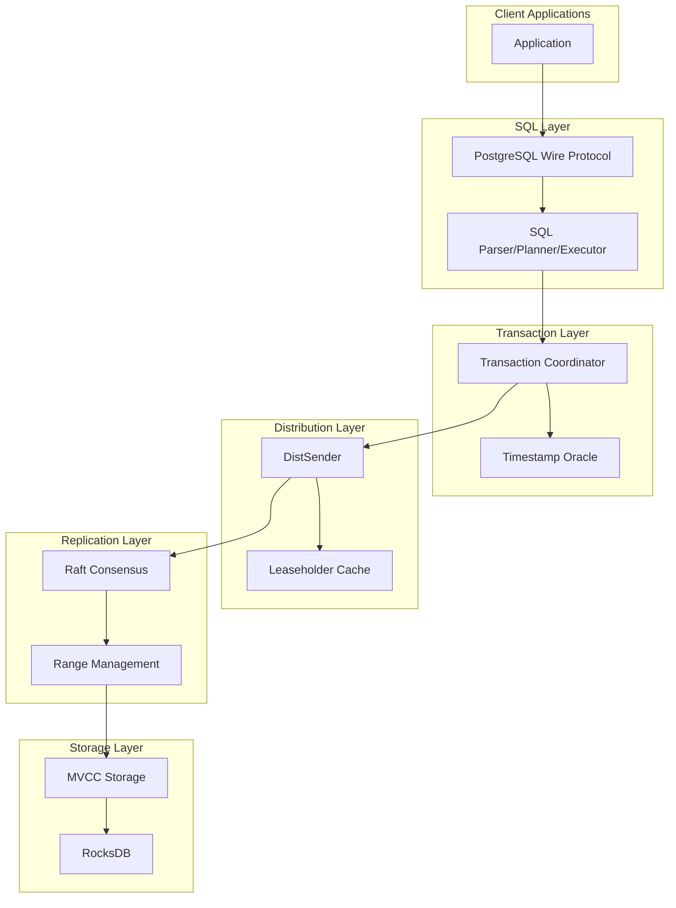
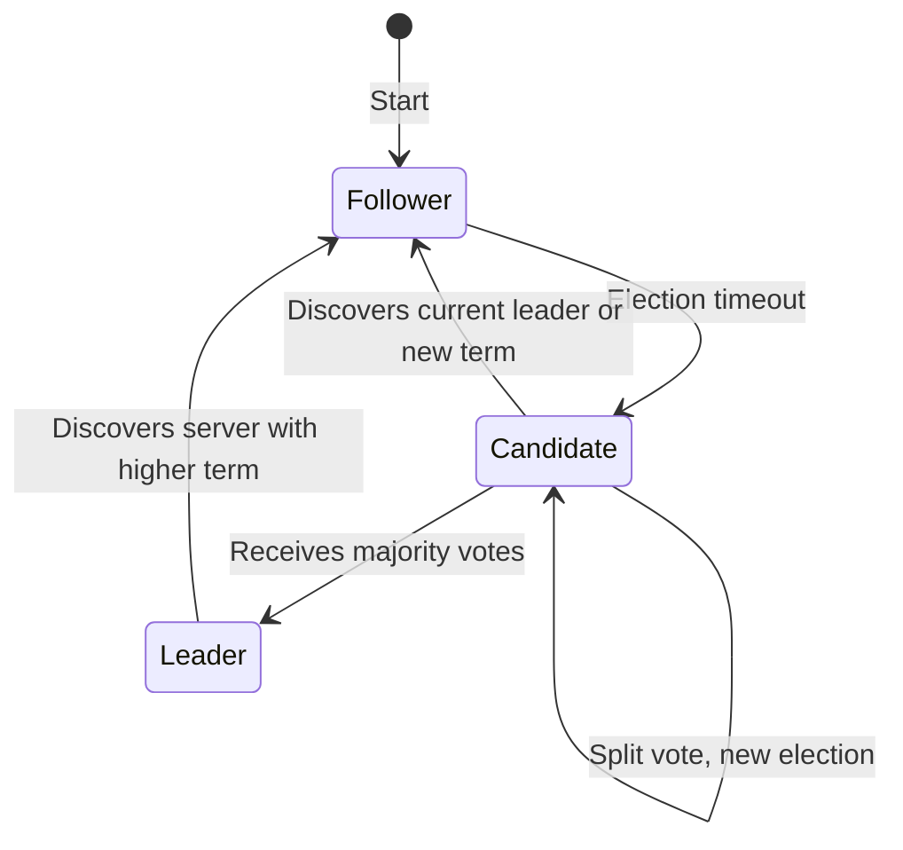
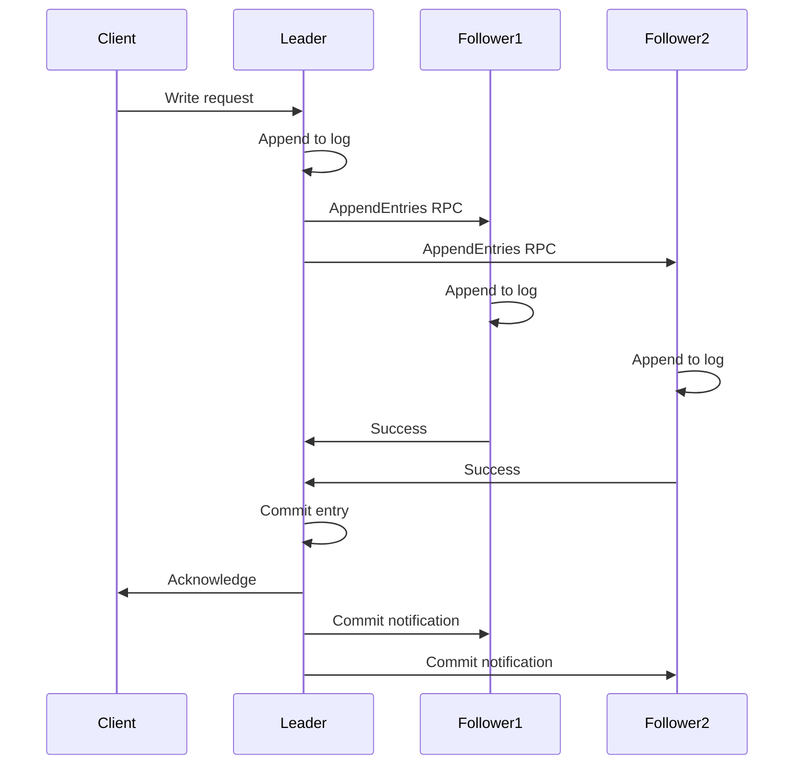
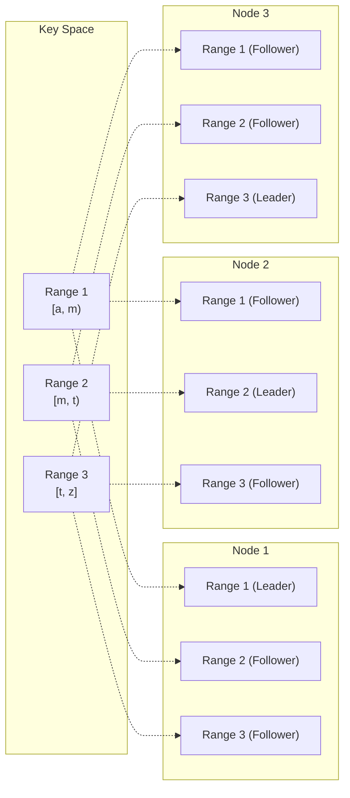
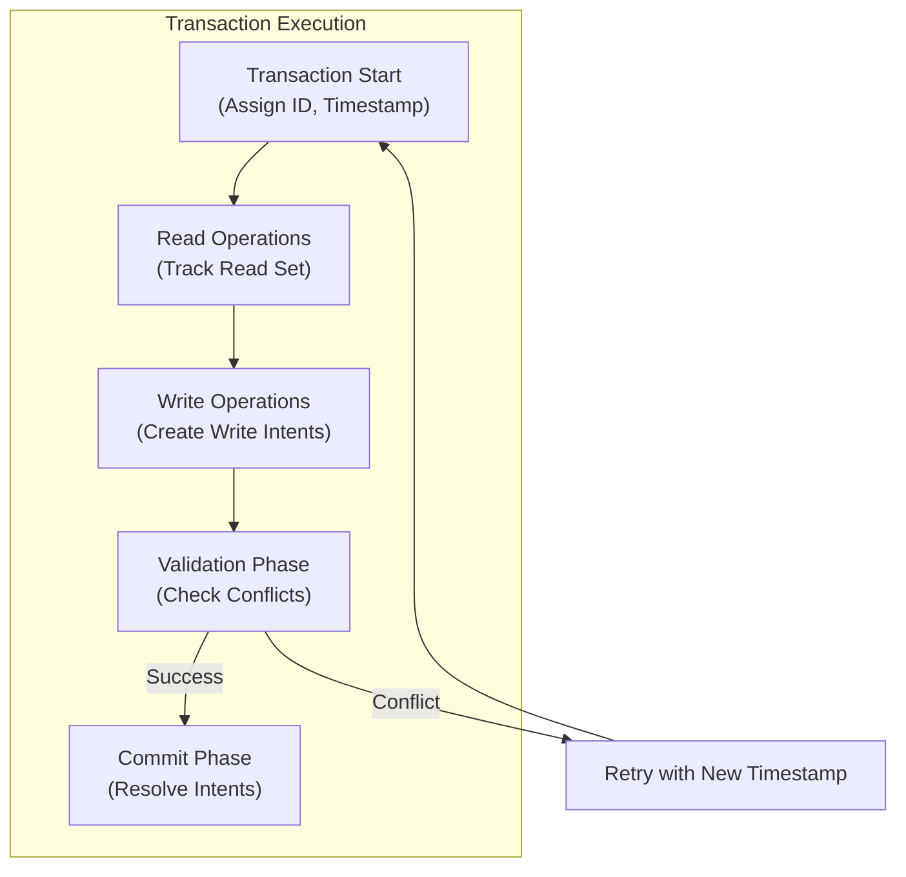
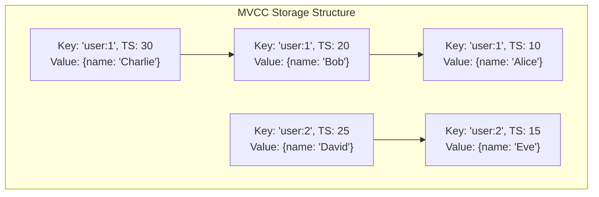
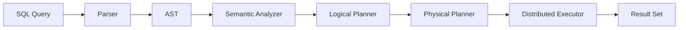
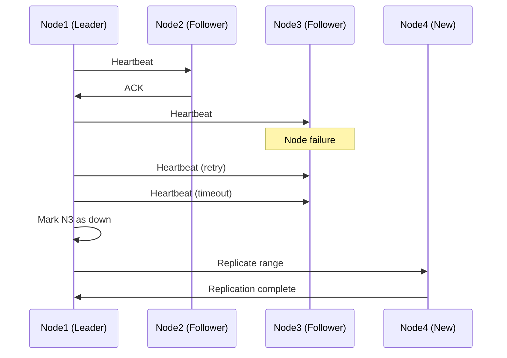
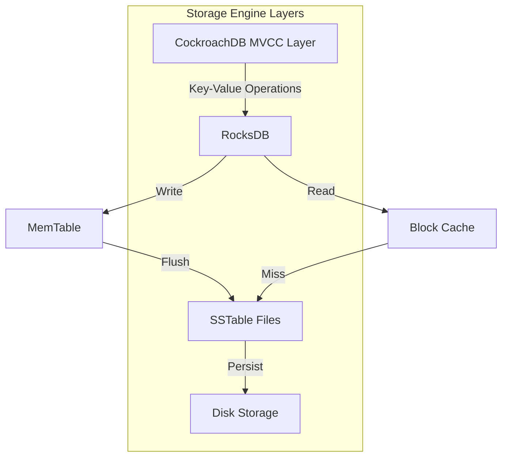

# CockroachDB

CockroachDBは、Googleの内部システムであるSpannerの設計思想に影響を受けて開発された、地理的に分散したSQLデータベースシステムである。従来のリレーショナルデータベースが単一マシンでの動作を前提としていたのに対し、CockroachDBは最初から分散環境での動作を念頭に設計されており、強い一貫性、高可用性、水平スケーラビリティという、従来はトレードオフの関係にあった特性を同時に実現することを目指している。

CockroachDBの名前は、ゴキブリのような生存能力の高さを表現している。システムの一部が故障しても、残りの部分が正常に動作を継続できる設計となっており、データセンター全体が停止するような大規模な障害にも耐えることができる。この特性は、現代のクラウドネイティブアプリケーションが要求する可用性とレジリエンスの要件を満たすために不可欠である。

本稿では、CockroachDBが採用している分散システムの基本概念から始め、Raftコンセンサスアルゴリズムによる合意形成、分散トランザクションの実装、マルチバージョン同時実行制御（MVCC）によるトランザクション分離、そしてPostgreSQL互換のSQLインターフェースまで、その技術的な詳細を体系的に解説する。

## アーキテクチャの全体像

CockroachDBのアーキテクチャは、複数の層に分かれており、それぞれの層が特定の責務を持つように設計されている。最上位層はSQLレイヤーであり、クライアントからのSQL文を受け取り、実行計画を生成する。その下にトランザクションレイヤーがあり、分散トランザクションの調整を行う。さらに下層には分散KVストアがあり、実際のデータの永続化とレプリケーションを担当する。



各ノードは完全に独立して動作可能であり、すべての層のコンポーネントを含んでいる。これにより、どのノードもクライアントからのリクエストを受け付けることができ、単一障害点が存在しない設計となっている。ノード間の通信はgRPCを使用して行われ、効率的なバイナリプロトコルによってネットワーク帯域幅の使用を最小限に抑えている。

データの物理的な配置は、キー空間を連続した範囲（レンジ）に分割することで管理される。各レンジは通常64MBのサイズを持ち、3つ以上の異なるノードにレプリケートされる。この設計により、データの局所性を保ちながら、負荷に応じて動的にレンジを分割・移動することで、システム全体の負荷分散を実現している。

## Raftコンセンサスアルゴリズムの実装

CockroachDBの中核を成すのは、Raftコンセンサスアルゴリズムである。Raftは、Diego Ongaro氏とJohn Ousterhout氏によって2014年に発表された分散合意アルゴリズムであり[^1]、理解しやすさを設計目標の一つとしている点で、従来のPaxosアルゴリズムとは一線を画している。

[^1]: Diego Ongaro and John Ousterhout. "In Search of an Understandable Consensus Algorithm." In Proceedings of the 2014 USENIX Annual Technical Conference (USENIX ATC '14), pages 305-319, 2014.

Raftにおいて、各レプリカは以下の3つの状態のいずれかを取る：リーダー（Leader）、フォロワー（Follower）、候補者（Candidate）。通常時は、1つのレプリカがリーダーとなり、残りはフォロワーとなる。リーダーはクライアントからのリクエストを受け付け、ログエントリとしてフォロワーに複製する責任を持つ。



CockroachDBのRaft実装は、etcd/raftライブラリをベースとしているが、パフォーマンスと信頼性を向上させるために多くの最適化が施されている。特に重要な最適化として、パイプライニングとバッチングがある。リーダーは、前のログエントリの確認を待たずに次のエントリを送信でき（パイプライニング）、また複数のログエントリを1つのメッセージにまとめて送信できる（バッチング）。

リーダー選出プロセスは、フォロワーが一定期間リーダーからのハートビートを受信しなかった場合に開始される。選出タイムアウトは150〜300ミリ秒の範囲でランダムに設定され、複数のノードが同時に候補者になることを防いでいる。候補者は自身の任期（term）をインクリメントし、他のノードに投票を要求する。過半数の票を獲得した候補者が新しいリーダーとなる。

ログレプリケーションにおいて、リーダーは各ログエントリに連続したインデックス番号と任期番号を付与する。フォロワーは受信したログエントリをローカルに保存し、確認応答を返す。リーダーは過半数のレプリカから確認応答を受信すると、そのエントリをコミット済みとマークし、状態機械に適用する。



CockroachDBは、Joint Consensusと呼ばれる手法を使用してメンバーシップの変更を安全に行う。この手法では、古い構成と新しい構成の両方で過半数の合意が必要な移行期間を設けることで、構成変更中もシステムの一貫性を保証している。

## レンジとデータ分散

CockroachDBのデータモデルは、すべてのデータを単一の順序付きキー値ストアとして扱う。このキー空間は、レンジと呼ばれる連続した区間に分割される。各レンジは、開始キーと終了キーによって定義され、デフォルトでは64MBのサイズ制限を持つ。レンジがこのサイズを超えると、自動的に2つのレンジに分割される。



レンジのレプリケーション戦略は、ゾーン設定と呼ばれる機構によって制御される。管理者は、データベース、テーブル、インデックス、さらには行レベルでレプリケーション要件を指定できる。例えば、特定のテーブルのデータを特定の地理的リージョンに配置したり、重要なデータのレプリカ数を増やしたりすることが可能である。

レンジのリースホルダーは、そのレンジに対する読み取りリクエストを単独で処理できる特別な役割を持つ。リースは通常9秒間有効であり、リースホルダーはこの期間中、Raftコンセンサスを経ることなく一貫性のある読み取りを提供できる。書き込みリクエストは依然としてRaftを通じて処理される必要があるが、リースホルダーがRaftリーダーでもある場合（通常はそうなるように最適化されている）、ネットワークホップ数を最小限に抑えることができる。

レンジの分割と結合は、システムの負荷とデータ分布に基づいて自動的に行われる。分割の決定は、レンジのサイズ、QPS（Queries Per Second）、および書き込み負荷を考慮して行われる。一方、隣接する小さなレンジは、効率性を向上させるために結合される場合がある。これらの操作は、オンラインで実行され、クライアントに対して透過的である。

## 分散トランザクションの実装

CockroachDBは、ACIDトランザクションを分散環境で完全にサポートしている。トランザクションの実装は、二相コミット（2PC）プロトコルの改良版を使用しており、デッドロックを回避しながら高いスループットを実現している。

トランザクションの開始時に、各トランザクションには一意のトランザクションIDと開始タイムスタンプが割り当てられる。このタイムスタンプは、ハイブリッド論理クロック（HLC）[^2]によって生成され、物理時間と論理時間の両方の特性を持つ。HLCは、NTPによる時刻同期の不完全性を補完し、因果関係を正確に追跡することを可能にする。

[^2]: Kulkarni, Sandeep S., et al. "Logical Physical Clocks." International Conference on Principles of Distributed Systems. Springer, 2014.



書き込み操作は、書き込みインテント（write intent）として記録される。インテントは、トランザクションがコミットされるまでの暫定的な値であり、トランザクションレコードへのポインタを含んでいる。他のトランザクションがインテントに遭遇した場合、トランザクションレコードを確認して、元のトランザクションの状態を判断する必要がある。

トランザクションの分離レベルは、デフォルトでSerializable Snapshot Isolation（SSI）を提供する。SSIは、スナップショット分離の効率性と、直列化可能性の正確性を組み合わせたものである。読み取り操作は、トランザクション開始時のスナップショットから値を読み取り、書き込み操作は他のトランザクションとの競合を検出する。

競合検出は、読み取り更新の検出と書き込み競合の検出の2つの側面がある。読み取り更新の検出では、トランザクションが読み取った値が、そのトランザクションのタイムスタンプ以降に更新されていないかを確認する。書き込み競合の検出では、複数のトランザクションが同じキーに書き込もうとした場合に、タイムスタンプの順序に基づいて競合を解決する。

トランザクションのリトライは、楽観的な方法で処理される。競合が検出された場合、トランザクションは新しいタイムスタンプで自動的に再試行される。この際、クライアントに対してはトランスペアレントに処理され、アプリケーションコードの変更は不要である。ただし、副作用のある操作（外部APIの呼び出しなど）は、リトライセーフでない可能性があるため、注意が必要である。

## MVCCとタイムスタンプ管理

マルチバージョン同時実行制御（MVCC）は、CockroachDBの並行性制御の基礎となる技術である。各キーの値は、タイムスタンプと共に保存され、異なる時点での値の履歴が保持される。これにより、読み取り操作が書き込み操作をブロックすることなく、高い並行性を実現している。

MVCCストレージ層では、各キーが以下の形式で保存される：
- キー: `(user_key, timestamp)`
- 値: `(value, transaction_id)`

タイムスタンプは降順で保存されるため、最新の値が最初に見つかるようになっている。トランザクションが特定のタイムスタンプでキーを読み取る場合、そのタイムスタンプ以前の最新の値が返される。



ガベージコレクション（GC）は、古いバージョンの値を定期的に削除する重要なプロセスである。GCは、設定されたTTL（Time To Live）に基づいて動作し、もはや必要のない古いバージョンを削除する。ただし、アクティブなトランザクションが参照する可能性のある値は保持される。GCの閾値は、`gc.ttlseconds`設定によって制御され、デフォルトでは25時間（90000秒）に設定されている。

タイムスタンプキャッシュは、読み取り操作のパフォーマンスを向上させる重要な最適化である。各ノードは、最近アクセスされたキーの範囲と、それらに対する最高の読み取りタイムスタンプを記録する。新しい書き込み操作は、このキャッシュを確認して、読み取り後の書き込み競合を検出できる。

不確実性ウィンドウは、クロックスキューの存在下でも因果関係を保証するメカニズムである。各ノードは、最大クロックオフセット（デフォルトでは500ms）を考慮して、トランザクションのタイムスタンプに不確実性の範囲を設定する。この範囲内の値に遭遇した場合、トランザクションは安全のために再起動される。

## SQLレイヤーとPostgreSQL互換性

CockroachDBのSQLレイヤーは、PostgreSQLのワイヤプロトコルと互換性を持つように設計されている。これにより、既存のPostgreSQLドライバーやツールの多くが、変更なしにCockroachDBで動作する。しかし、分散システムとしての制約から、一部のPostgreSQL機能はサポートされていないか、異なる動作を示す。

SQL文の実行は、以下のフェーズを経て処理される：

1. **解析（Parsing）**: SQL文を抽象構文木（AST）に変換
2. **意味解析（Semantic Analysis）**: 型チェックとスキーマ検証
3. **論理計画（Logical Planning）**: 論理的な実行計画の生成
4. **物理計画（Physical Planning）**: 分散実行を考慮した物理計画の生成
5. **実行（Execution）**: 計画の実行とデータの取得



クエリオプティマイザは、コストベースの最適化を行い、統計情報に基づいて最適な実行計画を選択する。統計情報は、テーブルの行数、カーディナリティ、ヒストグラムなどを含み、定期的に自動更新される。オプティマイザは、結合順序、インデックスの選択、分散実行の並列度などを決定する。

分散SQLの実行では、データの局所性を最大限に活用する。可能な限り、データが存在するノードで計算を実行し、ネットワーク転送を最小限に抑える。例えば、集約演算は部分的に各ノードで実行され、最終的な結果のみが調整ノードに送信される。

セカンダリインデックスは、プライマリデータとは独立したキー値ペアとして保存される。インデックスのキーは、インデックス列の値とプライマリキーの組み合わせで構成され、値は空またはカバリング列の値を含む。インデックスも通常のデータと同様にレンジに分割され、レプリケートされる。

スキーマ変更は、オンラインで実行され、ダウンタイムを必要としない。新しいスキーマバージョンは、段階的にロールアウトされ、すべてのノードが新しいスキーマを認識するまで、互換性のある方法で処理される。大規模なスキーマ変更（例：新しいインデックスの追加）は、バックグラウンドジョブとして実行され、システムの通常の動作に影響を与えないように調整される。

## 障害処理とリカバリ

CockroachDBの設計において、障害は例外ではなく通常の動作の一部として扱われる。システムは、ノード障害、ネットワーク分断、ディスク故障など、様々な種類の障害に対して自動的に対処し、データの一貫性と可用性を維持する。

ノード障害の検出は、Raftのハートビートメカニズムによって行われる。リーダーは定期的にフォロワーにハートビートを送信し、応答がない場合はそのノードを利用不可とマークする。レンジのレプリカが失われた場合、システムは自動的に新しいレプリカを別のノードに作成し、設定されたレプリケーション係数を維持する。



ネットワーク分断に対しては、Raftの過半数ルールが安全性を保証する。分断によって過半数のレプリカと通信できなくなったレンジは、書き込みを受け付けなくなる。これにより、スプリットブレイン状態を防ぎ、データの一貫性を保護する。分断が解消されると、システムは自動的に正常な状態に戻る。

レプリカの修復は、Raftのログ複製メカニズムによって行われる。遅れているレプリカは、リーダーから不足しているログエントリを受信し、最新の状態に追いつく。大きく遅れている場合は、スナップショットが送信され、効率的に状態を同期する。

データの耐久性は、各書き込み操作がコミットされる前に、過半数のレプリカのディスクに永続化されることで保証される。さらに、各ノードはWrite-Ahead Log（WAL）を維持し、クラッシュ後のリカバリを可能にする。WALは、RocksDBによって管理され、定期的にコンパクションされる。

一貫性のあるバックアップとリストアは、MVCCの特性を活用して実装されている。バックアップは、特定のタイムスタンプでの一貫したスナップショットを作成し、増分バックアップもサポートされる。リストアは、新しいクラスタまたは既存のクラスタの特定のデータベースに対して実行できる。

## パフォーマンス特性と最適化

CockroachDBのパフォーマンスは、分散システムとしての制約と、強い一貫性の保証によって特徴付けられる。単一ノードのデータベースと比較すると、ネットワーク遅延とコンセンサスのオーバーヘッドが存在するが、水平スケーラビリティによって総スループットを大幅に向上させることができる。

読み取りパフォーマンスは、リースホルダーの概念によって最適化されている。リースホルダーへの読み取りは、Raftコンセンサスを必要とせず、単一のネットワークホップで完了する。フォロワー読み取りも設定可能であり、わずかに古いデータを許容することで、読み取り負荷を分散できる。

書き込みパフォーマンスは、バッチングとパイプライニングによって向上している。複数の書き込み操作を単一のRaftプロポーザルにまとめることで、コンセンサスのオーバーヘッドを削減する。また、並列コミットプロトコルにより、分散トランザクションのレイテンシを削減している。

ホットスポットの回避は、適切なスキーマ設計によって実現される。単調増加するキー（タイムスタンプなど）は、特定のレンジに書き込みが集中する原因となる。これを避けるため、キーの先頭にハッシュ値やランダムな値を付加する手法が推奨される。また、自動的なレンジ分割により、負荷の高いレンジは小さく分割され、複数のノードに分散される。

```sql
-- Avoiding hotspots with hash-sharded index
CREATE TABLE events (
    id UUID DEFAULT gen_random_uuid(),
    timestamp TIMESTAMPTZ DEFAULT now(),
    data JSONB,
    PRIMARY KEY (id),
    INDEX idx_timestamp (timestamp) USING HASH WITH BUCKET_COUNT = 8
);
```

接続プーリングは、クライアントサイドとサーバーサイドの両方で重要である。各SQL接続は、ゴルーチンとメモリを消費するため、アプリケーションは接続プールを使用して接続数を制限すべきである。CockroachDB自体も、ノード間の接続をプールして再利用する。

キャッシングは、複数のレベルで実装されている。RocksDBのブロックキャッシュは、頻繁にアクセスされるデータブロックをメモリに保持する。SQLレイヤーでは、準備されたステートメントのキャッシュが、解析と計画のオーバーヘッドを削減する。

## 実装の詳細と内部構造

CockroachDBの実装は、Go言語で書かれており、並行性とネットワークプログラミングに優れた特性を活用している。主要なコンポーネントは、明確に定義されたインターフェースによって分離され、テスタビリティと保守性を高めている。

ストレージエンジンとして採用されているRocksDBは、Facebook社が開発したLSM-tree（Log-Structured Merge-tree）ベースのキー値ストアである。LSM-treeは、書き込みパフォーマンスに優れ、範囲スキャンも効率的に実行できる。CockroachDBは、RocksDBの上にMVCC層を実装し、トランザクション処理に必要な機能を提供している。



ノード間通信は、gRPCフレームワークを使用して実装されている。各サービスは、Protocol Buffersで定義されたインターフェースを持ち、効率的なバイナリエンコーディングとスキーマ進化をサポートする。通信は暗号化され、相互TLS認証によってセキュリティが確保される。

メモリ管理は、パフォーマンスに直接影響する重要な要素である。CockroachDBは、各コンポーネントにメモリ予算を割り当て、メモリ使用量を監視する。メモリ圧迫が検出されると、キャッシュのエビクションやクエリの実行制限などの対策が取られる。

並行性制御において、CockroachDBは楽観的な方法を採用している。トランザクションは、競合がないことを仮定して進行し、コミット時に競合を検出する。これにより、読み取り専用のワークロードでは高いスループットを実現できるが、競合の多いワークロードではリトライが増加する可能性がある。

## 運用上の考慮事項

CockroachDBを本番環境で運用する際には、いくつかの重要な考慮事項がある。まず、クラスタのサイジングにおいて、最小3ノードから始めることが推奨される。これにより、1ノードの障害に耐えることができる。より高い可用性が必要な場合は、5ノードまたは7ノードのクラスタを検討する。

監視とメトリクスは、システムの健全性を維持するために不可欠である。CockroachDBは、Prometheusフォーマットでメトリクスをエクスポートし、様々な監視ツールと統合できる。重要なメトリクスには、レプリケーション遅延、トランザクションのリトライ率、ノード間のクロックスキューなどが含まれる。

容量計画では、データサイズ、レプリケーション係数、および圧縮率を考慮する必要がある。一般的に、実際のディスク使用量は、論理データサイズの2〜3倍になる（3倍レプリケーションと圧縮を考慮）。また、各ノードには十分なIOPSとネットワーク帯域幅が必要である。

チューニングパラメータの中で最も重要なものは、キャッシュサイズとガベージコレクションの設定である。RocksDBのブロックキャッシュは、使用可能メモリの25〜50%に設定することが推奨される。GCのTTLは、履歴クエリの要件とストレージ容量のバランスを考慮して調整する。

セキュリティ面では、転送中のデータと保存データの両方の暗号化がサポートされている。ノード間通信とクライアント接続にはTLSを使用し、ディスク上のデータは暗号化at-restによって保護できる。また、SQLレベルでの認証と認可により、きめ細かなアクセス制御が可能である。

CockroachDBは、地理的に分散したデプロイメントをサポートし、データの局所性と規制要件の両方に対応できる。マルチリージョンクラスタでは、テーブルやレンジを特定のリージョンに固定したり、レプリカの配置を制御したりすることが可能である。これにより、データ主権の要件を満たしながら、グローバルな可用性を実現できる。

パフォーマンスのトラブルシューティングでは、実行計画の分析が重要である。`EXPLAIN`文を使用して、クエリがどのように実行されるかを理解し、適切なインデックスが使用されているかを確認する。また、`SHOW TRACE`コマンドにより、分散実行の詳細なトレースを取得できる。

災害復旧計画では、定期的なバックアップと、それらのリストアテストが不可欠である。CockroachDBの増分バックアップ機能を活用し、RPO（Recovery Point Objective）を最小化する。また、異なる地理的リージョンにレプリカを配置することで、大規模な災害に対する耐性を高めることができる。