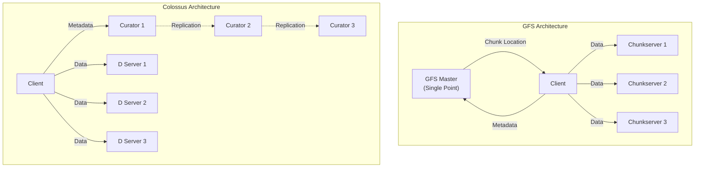
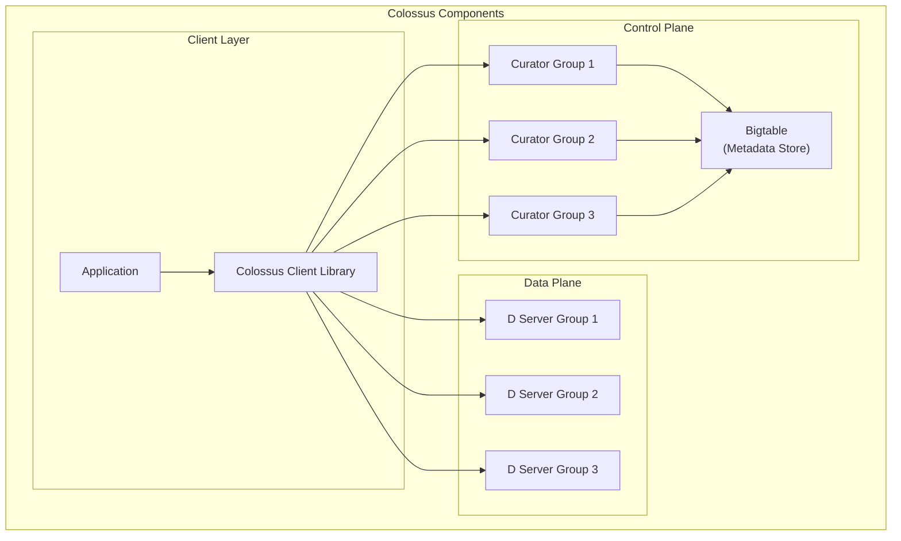
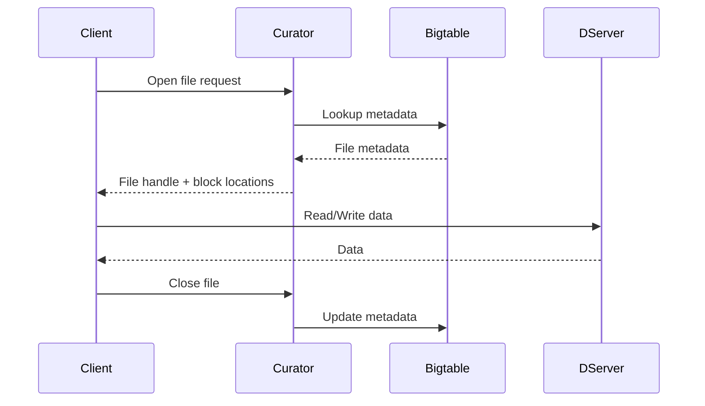
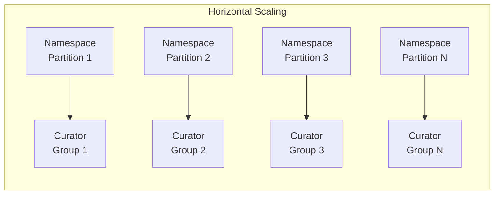
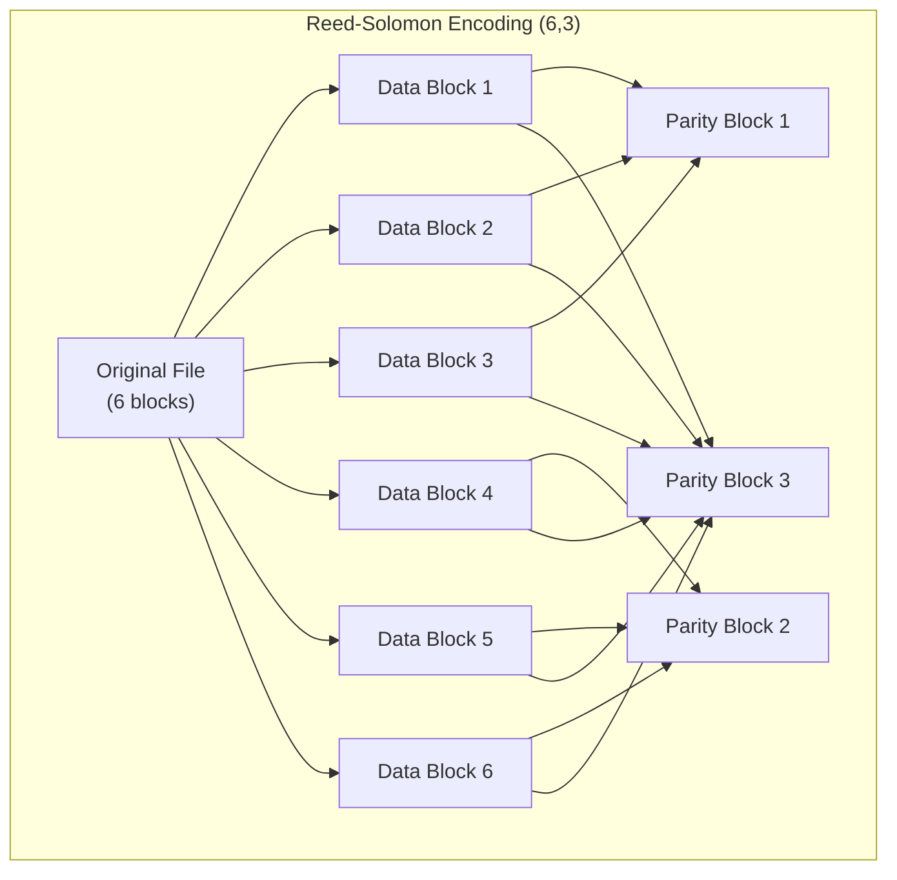
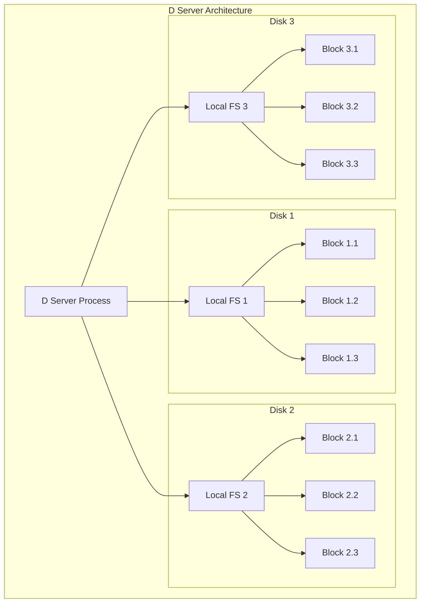
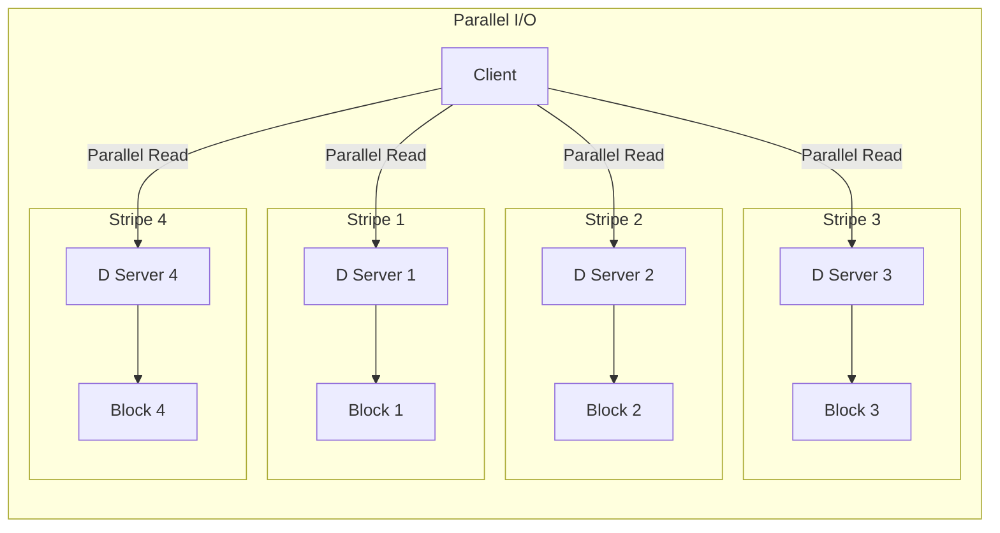
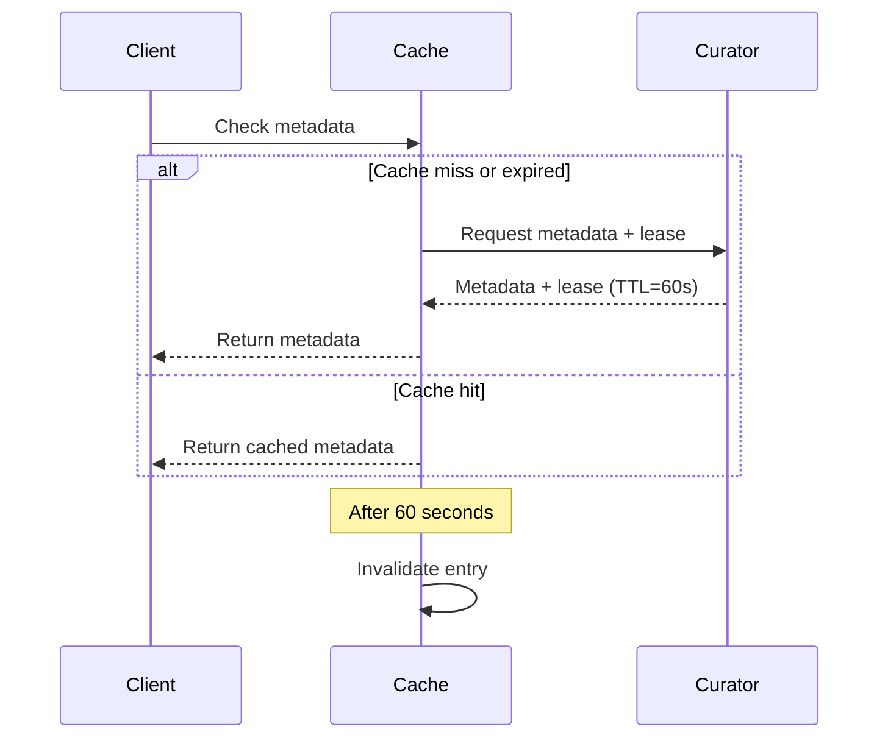
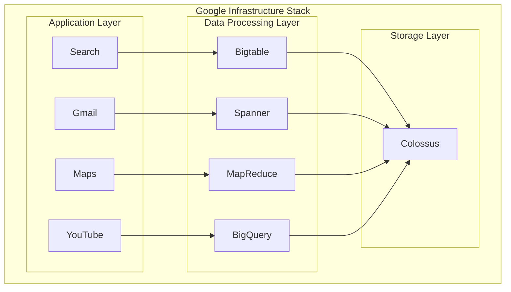

# Colossus: Googleの次世代分散ファイルシステム

Colossusは、Googleが開発した第二世代の分散ファイルシステムであり、2003年に発表されたGoogle File System (GFS)の後継として設計された。GFSは当時としては革新的なシステムであったが、Googleのインフラストラクチャの急速な成長と変化する要求に対応するため、より高度なスケーラビリティと可用性を持つシステムが必要となった。Colossusは2010年頃から段階的に導入され、現在ではGoogleの大規模なデータ処理基盤の中核を担っている。

## GFSからの進化の背景

GFSは、大規模な分散環境において安価なコモディティハードウェアを使用してペタバイト級のデータを管理することを可能にした画期的なシステムであった。しかし、運用を続ける中でいくつかの根本的な制限が明らかになってきた。最も重要な問題は、シングルマスターアーキテクチャによるスケーラビリティの限界であった。GFSでは、すべてのメタデータ操作が単一のマスターサーバーを経由する必要があり、これがボトルネックとなっていた。また、マスターの障害時には手動での介入が必要であり、可用性の面でも課題があった。

さらに、GFSは当初1MBから数百MBのファイルを想定して設計されていたが、実際の運用では数GBから数TBの巨大なファイルを扱う必要が生じた。64MBの固定チャンクサイズも、現代のアプリケーションには必ずしも最適ではなくなっていた。これらの課題を解決するため、Googleは根本的に新しいアーキテクチャを持つColossusの開発に着手した。

## アーキテクチャの全体像

Colossusの最も重要な革新は、メタデータ管理の分散化である。GFSのシングルマスターアーキテクチャを廃止し、複数のCurator（キュレーター）と呼ばれるメタデータサーバーによる分散管理システムを採用した。各Curatorは、ファイルシステムの名前空間の一部を担当し、Bigtableを使用してメタデータを永続化する。この設計により、メタデータ操作のスループットが大幅に向上し、システム全体のスケーラビリティが飛躍的に改善された。

データの保存については、GFSのChunkserverに代わってD（ディスク）と呼ばれる新しいストレージレイヤーを導入した。Dは、各物理ディスクを独立したファイルシステムとして扱い、より細かい粒度でのストレージ管理を可能にしている。これにより、ディスク障害時の復旧時間が大幅に短縮され、ストレージの利用効率も向上した。

## Curatorによるメタデータ管理

Curatorは、Colossusの中核となるコンポーネントであり、ファイルシステムのメタデータを管理する役割を担っている。各Curatorグループは、名前空間の特定の部分（サブツリー）を担当し、そのサブツリー内のすべてのファイルとディレクトリのメタデータを管理する。メタデータには、ファイル名、サイズ、アクセス権限、ブロックの位置情報などが含まれる。

Curatorは、Paxosアルゴリズムを使用してレプリケートされ、高可用性を実現している。各Curatorグループは通常5つのレプリカで構成され、過半数のレプリカが稼働している限りサービスを継続できる。メタデータの永続化にBigtableを使用することで、Curator自体はステートレスに近い設計となっており、障害からの復旧が迅速に行える。

メタデータのシャーディングは、ファイルシステムの名前空間に基づいて行われる。例えば、`/home/user1`以下のファイルは Curatorグループ1が、`/home/user2`以下のファイルはCuratorグループ2が管理するといった具合である。この分散により、単一のCuratorグループがボトルネックになることを防いでいる。

## スケーラビリティの実現

Colossusのスケーラビリティは、複数の設計上の工夫によって実現されている。まず、メタデータ管理の分散化により、システム全体で処理できるメタデータ操作の数が線形にスケールする。Curatorグループを追加することで、より多くのファイルとより高いメタデータ操作スループットに対応できる。

データプレーンのスケーラビリティも同様に重要である。Dサーバーは、物理的なディスクごとに独立して動作するため、ストレージ容量とI/Oスループットの両方が、ディスクを追加することで線形にスケールする。さらに、Colossusは動的なロードバランシング機能を持ち、ホットスポットを検出して自動的にデータを再配置することができる。

クライアントライブラリも、スケーラビリティに重要な役割を果たしている。クライアントは、Curatorから取得したメタデータをキャッシュし、データの読み書きは直接Dサーバーと通信する。この設計により、Curatorへの負荷を最小限に抑えつつ、高いI/Oパフォーマンスを実現している。

## Reed-Solomon符号化による効率的なストレージ

Colossusの重要な革新の一つは、Reed-Solomon符号化の広範な採用である。GFSでは主に3つのレプリカによる冗長性を確保していたが、これは200%のストレージオーバーヘッドを意味していた。Colossusでは、Reed-Solomon符号化を使用することで、同等以上の信頼性を維持しながら、ストレージオーバーヘッドを大幅に削減している。

例えば、(6,3) Reed-Solomon符号化では、6つのデータブロックから3つのパリティブロックを生成する。この構成では、任意の3つのブロックが失われても、残りの6つのブロックから元のデータを復元できる。これにより、ストレージオーバーヘッドは50%となり、3レプリケーションの200%と比較して大幅な改善となる。

Reed-Solomon符号化の採用には、計算コストというトレードオフが存在する。エンコーディングとデコーディングにはCPUリソースが必要であり、特に小さなファイルに対しては、このオーバーヘッドが無視できない。そのため、Colossusは柔軟なストレージポリシーをサポートしており、ファイルのサイズやアクセスパターンに応じて、レプリケーションとReed-Solomon符号化を使い分けることができる。

## Dファイルシステムとの統合

Dは、Colossusのデータ永続化層として機能する分散ファイルシステムである。各Dサーバーは、ローカルディスク上のファイルを管理し、Colossusからの読み書き要求を処理する。Dの設計の特徴は、各物理ディスクを独立したファイルシステムとして扱うことである。これにより、ディスク障害の影響を最小限に抑え、障害からの復旧を高速化している。

Dサーバーは、ブロックレベルでのチェックサムを実装しており、データの整合性を継続的に検証している。定期的なスクラビングプロセスにより、サイレントデータ破損を早期に検出し、修復することができる。また、Dは効率的なガベージコレクション機能を持ち、削除されたブロックの領域を自動的に回収する。

ColossusとDの統合により、柔軟なストレージ管理が可能となっている。例えば、頻繁にアクセスされるホットデータはSSDに、アーカイブデータはHDDに配置するといった階層的ストレージ管理が実現されている。この動的な配置は、アクセスパターンの分析に基づいて自動的に行われる。

## 性能特性とトレードオフ

Colossusの性能特性は、その設計思想を反映している。メタデータ操作のレイテンシは、Curatorへのネットワークラウンドトリップとbigtableへのアクセス時間に依存するが、通常は数ミリ秒から数十ミリ秒の範囲である。これはローカルファイルシステムと比較すると高いが、分散システムとしては優れた性能である。

データアクセスのスループットは、並列性によって高い性能を実現している。大きなファイルは複数のブロックに分割され、これらのブロックは異なるDサーバーに分散して保存される。クライアントは、これらのブロックを並列に読み書きすることで、単一のディスクの物理的な限界を超えたスループットを達成できる。

しかし、この設計にはトレードオフも存在する。小さなファイルへのアクセスは、メタデータ操作のオーバーヘッドが相対的に大きくなるため、効率が低下する。また、強い整合性を維持するため、書き込み操作は読み取り操作よりもレイテンシが高い傾向がある。

Colossusは、これらのトレードオフを軽減するためのいくつかの最適化を実装している。クライアント側のキャッシング、バッチ処理、プリフェッチングなどの技術により、多くのワークロードで良好な性能を実現している。また、アプリケーション開発者は、Colossusの特性を理解した上で、適切なファイルサイズやアクセスパターンを選択することで、最適な性能を得ることができる。

## 実装の詳細と最適化

Colossusの実装には、多くの巧妙な最適化が含まれている。クライアントライブラリは、メタデータのキャッシングを積極的に行い、Curatorへのラウンドトリップを最小化している。キャッシュの一貫性は、リース機構によって保証される。クライアントは、一定期間有効なリースを取得し、その期間中はキャッシュされたメタデータを安全に使用できる。

ネットワーク通信の最適化も重要である。Colossusは、TCPの永続的な接続プールを維持し、接続確立のオーバーヘッドを削減している。また、小さな要求をバッチ処理することで、ネットワークの利用効率を向上させている。データ転送には、ゼロコピー技術を使用し、不要なメモリコピーを避けている。

障害検出と復旧のメカニズムも洗練されている。各コンポーネントは定期的にハートビートを送信し、障害を迅速に検出する。Dサーバーの障害が検出されると、影響を受けるブロックのレプリカまたはパリティから、新しいレプリカが自動的に作成される。この再レプリケーションプロセスは、優先度に基づいてスケジューリングされ、重要なデータから順に復旧される。

## セキュリティとアクセス制御

Colossusは、エンタープライズ環境での使用を想定した包括的なセキュリティ機能を提供している。認証は、Kerberosベースのシステムを使用し、すべてのクライアントとサーバー間の通信で相互認証を行う。アクセス制御は、POSIXスタイルの権限に加えて、より細かい粒度のACL（Access Control List）をサポートしている。

データの暗号化は、転送時と保存時の両方で行われる。転送時の暗号化はTLSを使用し、保存時の暗号化は、ブロックレベルでAESを使用して実装されている。暗号鍵の管理は、専用のキーマネージメントサービスと統合されており、定期的な鍵のローテーションが自動的に行われる。

監査ログ機能により、すべてのアクセスとメタデータの変更が記録される。これらのログは、コンプライアンス要件を満たすために必要な情報を提供し、セキュリティインシデントの調査にも使用される。

## 運用上の考慮事項

Colossusの運用には、いくつかの重要な考慮事項がある。まず、容量計画が重要である。Reed-Solomon符号化を使用する場合、実効容量はエンコーディングパラメータに依存する。例えば、(6,3)エンコーディングでは、物理容量の約67%が実効容量となる。また、ガベージコレクションとメタデータのオーバーヘッドのために、追加の容量を確保する必要がある。

モニタリングとアラーティングも重要である。Colossusは、詳細なメトリクスを提供し、システムの健全性を継続的に監視できる。重要なメトリクスには、メタデータ操作のレイテンシ、データスループット、ディスク使用率、障害率などが含まれる。これらのメトリクスに基づいて、適切なアラートを設定し、問題を早期に検出することが重要である。

アップグレードとメンテナンスは、サービスの可用性を維持しながら行う必要がある。Colossusは、ローリングアップグレードをサポートしており、サービスを停止することなくソフトウェアの更新が可能である。ただし、アップグレード中は一時的に性能が低下する可能性があるため、適切なタイミングで実施する必要がある。

## Googleエコシステムとの統合

ColossusはGoogleの内部インフラストラクチャの重要な部分であり、多くの他のシステムと密接に統合されている。Bigtable、Spanner、MapReduceなどの分散データ処理システムは、すべてColossusをストレージバックエンドとして使用している。この統合により、これらのシステムは、Colossusの高い可用性とスケーラビリティを活用できる。

特にBigtableとの統合は重要である。Bigtableは、そのSSTables（Sorted String Tables）をColossusに保存し、Colossusの信頼性とパフォーマンスに依存している。同様に、SpannerもそのログとデータファイルをColossusに保存している。この階層的なアーキテクチャにより、各層は自身の責務に集中でき、全体として効率的なシステムが構築されている。

## 将来の展望と継続的な進化

Colossusは、継続的に進化している。新しいハードウェア技術の採用、例えばNVMeやpersistent memoryの活用により、さらなる性能向上が期待されている。また、機械学習を活用した自動最適化、例えばアクセスパターンの予測に基づく動的なデータ配置なども研究されている。

エッジコンピューティングとの統合も重要な方向性である。データの生成源により近い場所でのストレージと処理を可能にすることで、レイテンシの削減とネットワーク帯域の節約が期待できる。Colossusの分散アーキテクチャは、このような地理的に分散した環境にも適応できる柔軟性を持っている。

Colossusは、大規模分散ファイルシステムの設計と実装における多くの革新を実現した。メタデータ管理の分散化、Reed-Solomon符号化の広範な採用、Dファイルシステムとの統合など、これらの技術は、ペタバイトからエクサバイト級のデータを効率的に管理することを可能にしている。その設計思想と実装の詳細は、次世代の分散ストレージシステムの開発において重要な指針となっている。

---

参考文献¹：
1. D. Ford et al., "Availability in Globally Distributed Storage Systems," in Proceedings of the 9th USENIX Conference on Operating Systems Design and Implementation (OSDI'10), 2010.
2. A. Fikes, "Storage Architecture and Challenges," Google Faculty Summit, 2010.
3. S. Quinlan and S. Dorward, "Venti: A New Approach to Archival Storage," in Proceedings of the FAST 2002 Conference on File and Storage Technologies, 2002.

¹ ColossusはGoogleの内部システムであり、公式な論文は限定的である。本稿は公開されている講演資料と関連システムの論文から推測される内容を含む。