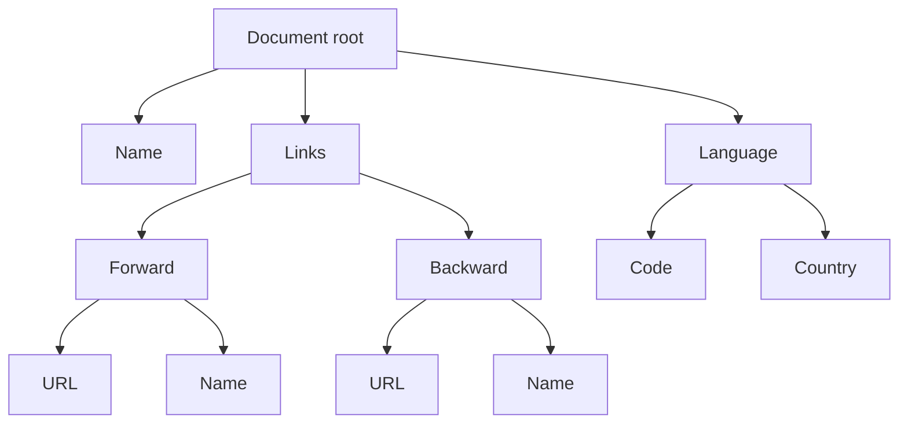
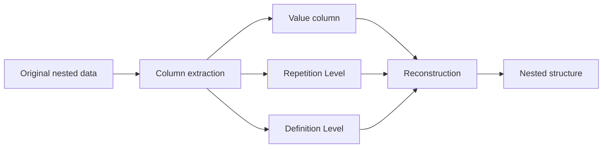
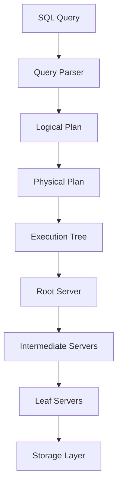
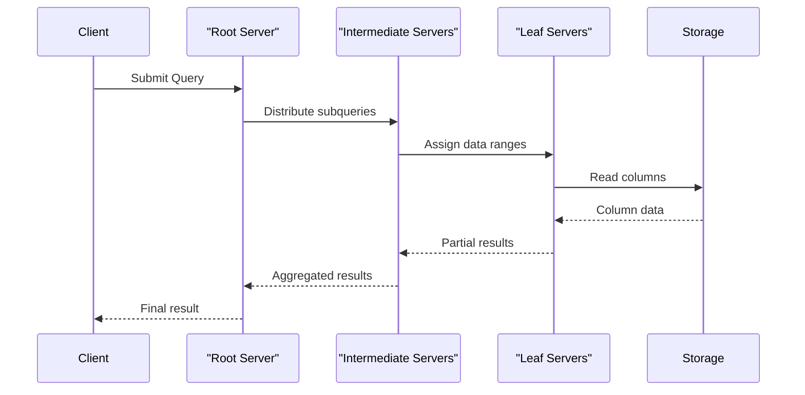
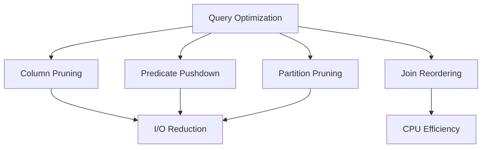
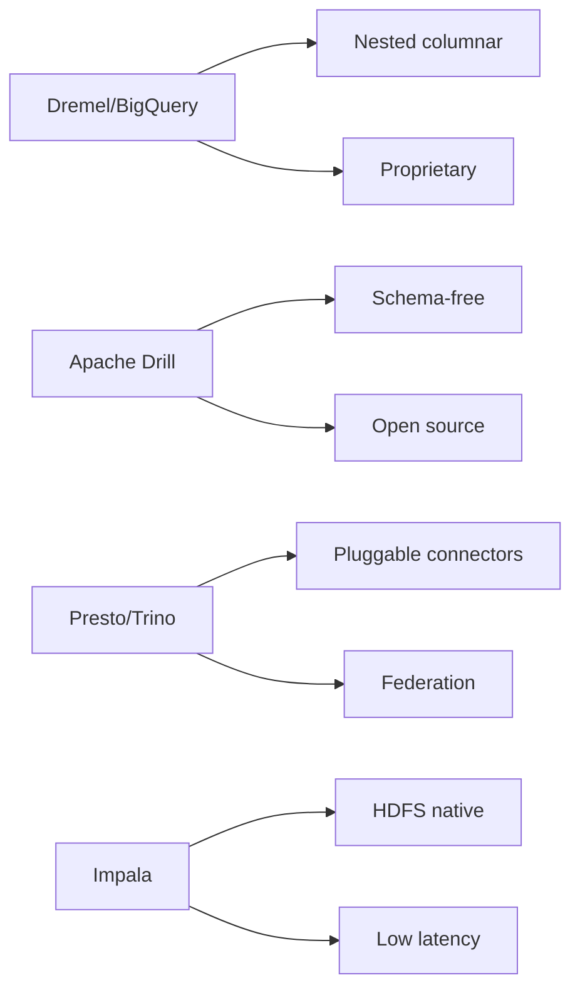
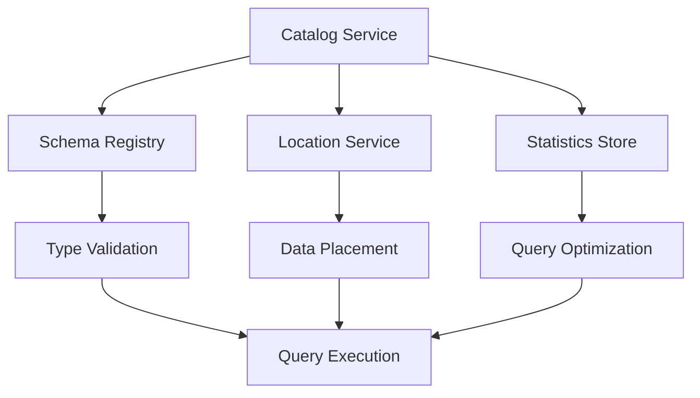
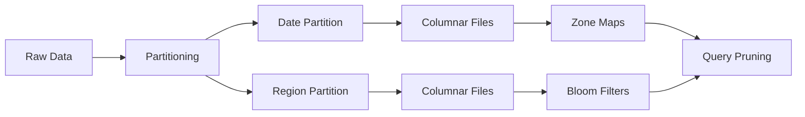
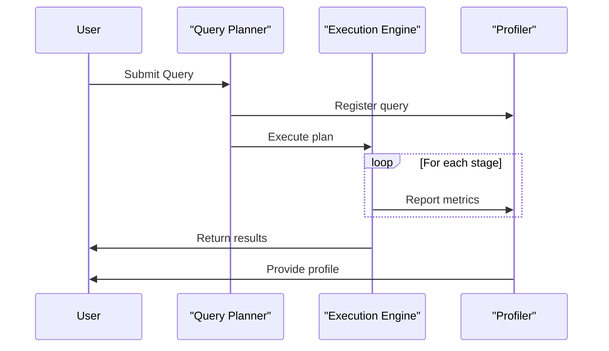

# Dremel: インタラクティブなWeb規模データ分析システム

Googleが2010年に発表したDremelは、ペタバイト規模のデータに対してインタラクティブなクエリ実行を可能にする革新的な分析システムである[^1]。従来のMapReduceが数分から数時間かかる処理を、Dremelは数秒から数十秒で完了させることができる。この劇的な高速化は、カラムナーストレージ形式の採用と、ネストしたデータ構造を効率的に扱う独自のデータモデル、そして数千台規模のマシンで動作する分散実行エンジンの組み合わせによって実現されている。

## カラムナーストレージとネストしたデータ構造

リレーショナルデータベースの世界では、カラムナーストレージは既に確立された技術であった。しかし、Dremelが直面した課題は、Googleの内部で広く使用されているProtocol Buffersのような、深くネストした繰り返し構造を持つデータをどのようにカラムナー形式で表現するかという点にあった。従来のアプローチでは、このようなデータをフラットな形式に変換する必要があったが、これは情報の損失や爆発的なデータ量の増加を招く可能性があった。



Dremelは、ネストしたデータ構造をそのまま保持しながら、効率的にカラムナー形式で保存する手法を開発した。この手法の核心は、各カラムに対してRepetition LevelとDefinition Levelという2つのメタデータを付加することである。これらのレベル情報により、フラットに格納されたカラムデータから元のネストした構造を完全に復元することが可能になる。

## Repetition LevelとDefinition Level

Repetition Level（R）は、現在の値がどの階層の繰り返しフィールドで新しく開始されたかを示す。値は0から最大繰り返し階層数までの範囲を取る。例えば、あるドキュメントの最初の値は常にR=0となり、同じドキュメント内の繰り返しフィールドの2番目以降の値は、その繰り返しが発生した階層に応じたR値を持つ。

Definition Level（D）は、その値に至るまでに定義されたフィールドの数を示す。これにより、どのオプショナルフィールドがNULLであるかを判断できる。D値は0から最大定義可能階層数までの範囲を取る。



この手法の優れた点は、スキーマ情報と組み合わせることで、部分的なカラムデータからでも必要な構造を再構築できることである。例えば、特定のカラムのみを読み込んで集計を行う場合でも、そのカラムが属するレコードの境界を正確に識別できる。

## データエンコーディングの詳細

実際のデータエンコーディングにおいて、Dremelは各カラムの値とそのR/Dレベルを効率的に格納する必要がある。以下のような最適化手法が採用されている：

カラムの値自体は、データ型に応じた圧縮手法を使用する。整数値にはビットパッキングやデルタエンコーディング、文字列には辞書エンコーディングが適用される。R/Dレベルは小さな整数値であるため、ランレングスエンコーディングやビットパッキングで効率的に圧縮される。

```
message Document {
  optional string name = 1;
  repeated group links = 2 {
    repeated string forward = 1;
    repeated string backward = 2;
  }
  repeated group language = 3 {
    required string code = 1;
    optional string country = 2;
  }
}
```

このようなProtocol Buffersスキーマに対して、例えば`links.forward`フィールドは最大繰り返し深度が2（links自体とforwardの2階層）、最大定義深度が2（Document rootとlinksの2階層、forwardは必須ではないため）となる。

## クエリ実行モデル

Dremelのクエリ実行は、SQLライクな言語で記述されたクエリを、カラムナーデータに対する効率的な実行計画に変換することから始まる。クエリエンジンは、必要なカラムのみを読み込み、フィルタリングや集計を分散環境で実行する。



クエリ実行の最適化において重要なのは、述語プッシュダウンとカラムプルーニングである。WHERE句の条件は可能な限りストレージ層に近い場所で評価され、不要なデータの読み込みを避ける。また、SELECT句で指定されたカラムのみを読み込むことで、I/Oコストを大幅に削減する。

## 分散実行アーキテクチャ

Dremelの分散実行アーキテクチャは、数千台規模のサーバーで構成される多層ツリー構造を採用している。このアーキテクチャは、高い並列性とフォルトトレランスを実現しながら、レイテンシを最小限に抑えることを目的として設計されている。

ルートサーバーはクエリを受け取り、実行計画を生成する。中間サーバーは、クエリの一部を下位のサーバーに配布し、結果を集約する。リーフサーバーは、実際にストレージからデータを読み込み、フィルタリングや部分集計を実行する。



各サーバーは独立して動作し、障害が発生した場合は他のサーバーがその作業を引き継ぐ。このアプローチにより、大規模なクラスタでも高い可用性を維持できる。さらに、クエリの実行中に動的にリソースを再配分することで、ストラグラー（遅いサーバー）の影響を最小限に抑える。

## スキーマ進化とバージョニング

実運用環境では、データスキーマは時間とともに進化する。Dremelは、Protocol Buffersの柔軟なスキーマ進化機能を活用して、異なるバージョンのデータを同時に扱うことができる。新しいフィールドの追加、オプショナルフィールドの削除、フィールドの型変更などが、既存のデータとの互換性を保ちながら可能である。

スキーマの進化に対応するため、Dremelは各カラムのメタデータにスキーマバージョン情報を含める。クエリ実行時には、この情報を使用して適切なデシリアライゼーションロジックを選択する。これにより、古いデータと新しいデータを透過的に処理できる。

## パフォーマンス特性と最適化

Dremelのパフォーマンスは、いくつかの要因に大きく依存する。まず、カラムナーストレージによるI/O削減効果は、クエリが参照するカラム数が少ないほど顕著になる。典型的なログ分析クエリでは、数百のフィールドを持つレコードから数個のフィールドのみを参照するため、95%以上のI/O削減が可能である。

圧縮効率も重要な要素である。同じ型の値が連続して格納されるカラムナー形式は、高い圧縮率を実現する。特に、カーディナリティの低いカラム（例：国コード、ステータスフラグ）では、10:1以上の圧縮率が一般的である。



クエリレイテンシの観点では、Dremelは数秒から数十秒での応答を目標としている。これは、従来のバッチ処理システムと比較して2〜3桁の改善である。低レイテンシを実現するため、以下の最適化が重要である：

並列度の動的調整により、データサイズとクエリの複雑さに応じて適切な数のサーバーを使用する。キャッシング戦略により、頻繁にアクセスされるデータやメタデータをメモリに保持する。投機的実行により、遅いサーバーの影響を軽減する。

## BigQueryへの進化

DremelはGoogleの内部システムとして開発されたが、その技術はGoogle BigQueryとして商用化された。BigQueryは、Dremelの中核技術を継承しながら、標準SQLのサポート、ストリーミングインサート、機械学習機能の統合など、多くの拡張が加えられている。

BigQueryにおける重要な進化の一つは、完全な標準SQL（SQL:2011）のサポートである。Dremelの独自クエリ言語から標準SQLへの移行により、既存のSQLツールやスキルセットとの互換性が大幅に向上した。また、ウィンドウ関数、共通テーブル式（CTE）、ユーザー定義関数（UDF）などの高度な機能もサポートされている。

## 実装の詳細と内部動作

Dremelの実装において、特に注目すべきは有限状態機械（FSM）を使用したレコード再構築アルゴリズムである。カラムデータからネストした構造を効率的に再構築するため、FSMはR/Dレベルの変化を追跡し、適切なタイミングでレコードやフィールドの境界を識別する。

```cpp
// Simplified FSM for record reconstruction
void ReconstructRecord(ColumnReader* reader) {
  while (reader->HasNext()) {
    int repetition_level = reader->RepetitionLevel();
    int definition_level = reader->DefinitionLevel();
    
    if (repetition_level == 0) {
      // Start of new record
      StartNewRecord();
    }
    
    // Navigate to appropriate field based on levels
    NavigateToField(repetition_level, definition_level);
    
    if (definition_level == reader->MaxDefinitionLevel()) {
      // Field has value
      EmitValue(reader->Value());
    } else {
      // Field is null or missing
      EmitNull(definition_level);
    }
    
    reader->Next();
  }
}
```

メモリ管理も重要な実装課題である。大規模なデータセットを扱う際、メモリ使用量を制限しながら高いスループットを維持する必要がある。Dremelは、ストリーミング処理とバッファリングを組み合わせて、メモリフットプリントを最小限に抑える。

## トレードオフと制限事項

Dremelのアーキテクチャには、いくつかのトレードオフが存在する。カラムナーストレージは分析クエリには優れているが、行指向のアクセスパターンには適していない。したがって、OLTPワークロードや頻繁な更新が必要なアプリケーションには不向きである。

レコード再構築のオーバーヘッドも考慮すべき点である。SELECT * のように多数のカラムを参照するクエリでは、カラムナーストレージの利点が薄れ、行指向ストレージと比較してパフォーマンスが劣る可能性がある。

データの更新と削除も課題である。Dremelは主に追記型のワークロードを想定して設計されており、既存データの変更は新しいバージョンの追加として実装される。これにより、ストレージ使用量が増加し、定期的なコンパクションが必要になる。

## 他の分散クエリエンジンとの比較

Dremelの登場以降、Apache Drill、Presto（現Trino）、Apache Impalaなど、多くのオープンソース分散クエリエンジンが開発された。これらのシステムは、Dremelのアイデアを参考にしながら、それぞれ独自の最適化や機能を追加している。

Apache Drillは、Dremelの直接的なオープンソース実装として始まったが、より広範なデータソースのサポートを追加した。JSONやParquetファイルだけでなく、HBase、MongoDB、さらにはRDBMSへの接続も可能である。

Presto（Trino）は、Facebookが開発した分散SQLエンジンで、プラグイン可能なアーキテクチャを採用している。異なるデータソースを統一的なSQLインターフェースで扱えることが特徴で、データレイクアーキテクチャでの採用が進んでいる。



## 将来の技術動向との関連

Dremelが確立したカラムナーストレージとネストしたデータの処理技術は、現代のデータ処理における標準的なアプローチとなった。Apache ParquetフォーマットはDremelのストレージ形式を参考に開発され、現在では事実上の標準となっている。

機械学習ワークロードとの統合も重要な発展である。BigQuery MLのように、SQLインターフェースを通じて機械学習モデルのトレーニングと推論を実行できる機能は、データ分析と機械学習の境界を曖昧にしている。

リアルタイム分析への拡張も進んでいる。従来のDremelはバッチ指向であったが、ストリーミングデータの取り込みと、ほぼリアルタイムでのクエリ実行をサポートする機能が追加されている。これにより、ラムダアーキテクチャやカッパアーキテクチャのような複雑なシステム構成を単純化できる。

## データ型とNull値の処理

Dremelにおけるデータ型の処理は、Protocol Buffersの型システムに基づいている。基本的なスカラー型（int32、int64、float、double、bool、string、bytes）に加えて、メッセージ型と繰り返しフィールドをサポートする。これらの型情報は、効率的なエンコーディングとクエリ最適化において重要な役割を果たす。

Null値の処理は、Definition Levelメカニズムを通じて洗練された方法で実現されている。従来のリレーショナルデータベースでは、各値に対してNullビットを保持する必要があったが、DremelのDefinition Levelは、ネストした構造全体のNull情報を効率的にエンコードする。

```
// Example: Processing nullable nested fields
Document doc1 = {
  name: "doc1",
  links: {
    forward: ["url1", "url2"],
    // backward is missing (null)
  },
  // language is missing (null)
}

// Encoded as columns:
// links.forward: ["url1", "url2"]
// links.forward.R: [0, 2]  // New doc, then repeat at level 2
// links.forward.D: [2, 2]  // Both values fully defined
```

## メタデータ管理とカタログシステム

大規模なデータセットを扱う上で、メタデータ管理は極めて重要である。Dremelは、テーブルスキーマ、パーティション情報、統計情報などを管理する包括的なカタログシステムを備えている。このカタログは、クエリプランニングとオプティマイゼーションにおいて中心的な役割を果たす。

カタログシステムは、以下の情報を管理する：

テーブルとカラムのスキーマ定義により、クエリパーサーは型チェックと検証を実行できる。データの物理的な配置情報（ファイルパス、レプリカの位置）により、効率的なデータアクセスが可能になる。統計情報（行数、個別値数、値の分布）により、クエリオプティマイザーは最適な実行計画を選択できる。



## アクセス制御とセキュリティ

エンタープライズ環境での利用を考慮して、Dremelは細粒度のアクセス制御メカニズムを実装している。テーブルレベル、カラムレベル、さらには行レベルのセキュリティポリシーを定義できる。これらのポリシーは、クエリ実行時に透過的に適用される。

カラムレベルのアクセス制御は、個人情報保護規制（GDPR、CCPAなど）への準拠において特に重要である。機密性の高いカラム（例：社会保障番号、クレジットカード番号）へのアクセスを制限しながら、他のカラムは自由に分析できるようにする。

行レベルセキュリティは、マルチテナント環境や部門別のデータ分離において活用される。各ユーザーは、自身がアクセス権を持つ行のみを参照でき、これはクエリに自動的にフィルタ条件として追加される。

## ストレージフォーマットの進化

Dremelの初期実装では、独自のカラムナーフォーマットが使用されていたが、その後、より標準化されたフォーマットへの移行が進んだ。Apache Parquetは、Dremelのアイデアを基に開発されたオープンな仕様であり、現在では多くのビッグデータシステムで採用されている。

Parquetフォーマットの主要な特徴：

ページ単位でのデータ組織により、効率的なI/Oとキャッシングが可能である。各ページには、値のエンコーディング情報と統計情報が含まれる。複数のエンコーディング手法（プレーンエンコーディング、辞書エンコーディング、ランレングスエンコーディング、デルタエンコーディング）を、データの特性に応じて選択できる。ブルームフィルタやMin/Max統計により、不要なデータの読み込みをスキップできる。

## インデックスとパーティショニング戦略

大規模データセットに対する効率的なクエリ実行には、適切なインデックスとパーティショニング戦略が不可欠である。Dremelは、複数のレベルでのデータ組織化をサポートする。

パーティショニングは、日付、地域、カテゴリなどの属性に基づいてデータを物理的に分割する。これにより、クエリが特定のパーティションのみを参照する場合、他のパーティションを完全にスキップできる。動的パーティショニングにより、データの取り込み時に自動的に適切なパーティションに振り分けられる。



ゾーンマップは、各データブロックの最小値と最大値を記録する軽量なインデックス構造である。範囲クエリやフィルタ条件に対して、読み込む必要のないブロックを迅速に特定できる。ブルームフィルタは、特定の値の存在確認に使用され、等価条件での効率的なフィルタリングを可能にする。

## 並行性制御とトランザクション

Dremelは主に読み取り専用の分析ワークロードを対象としているため、従来のOLTPシステムのような厳密なトランザクション機能は提供していない。しかし、データの一貫性を保証するための仕組みは実装されている。

スナップショット分離により、クエリ実行中のデータの一貫したビューが保証される。クエリが開始された時点でのデータの状態が、クエリ全体を通じて維持される。これにより、長時間実行されるクエリでも、途中でデータが変更されることによる不整合を避けられる。

マルチバージョン管理により、データの更新は新しいバージョンとして追加される。古いバージョンは一定期間保持され、必要に応じて過去の時点でのデータを参照できる。これは、監査やコンプライアンス要件への対応において重要である。

## コスト最適化とリソース管理

クラウド環境でのDremel（BigQuery）の利用において、コスト最適化は重要な考慮事項である。処理されるデータ量に基づく課金モデルでは、クエリの効率性が直接的にコストに影響する。

クエリコストの最適化手法：

適切なパーティショニングとクラスタリングにより、スキャンするデータ量を削減する。必要なカラムのみを選択し、SELECT * の使用を避ける。WHERE句の条件を可能な限り具体的にし、早期のフィルタリングを促進する。マテリアライズドビューを活用し、頻繁に実行される集計処理を事前計算する。

```sql
-- Cost-inefficient query
SELECT * FROM large_table
WHERE DATE(timestamp) = '2024-01-01';

-- Cost-optimized query
SELECT user_id, event_type, COUNT(*) as cnt
FROM large_table
WHERE timestamp >= '2024-01-01' 
  AND timestamp < '2024-01-02'
  AND event_type IN ('click', 'view')
GROUP BY user_id, event_type;
```

## 機械学習との統合

現代のデータ分析では、SQLベースの分析と機械学習の境界が曖昧になってきている。BigQuery MLのような機能により、SQLクエリの中で直接機械学習モデルのトレーニングと推論を実行できる。

線形回帰、ロジスティック回帰、K-meansクラスタリング、時系列予測などの基本的なアルゴリズムがSQLから利用可能である。モデルのトレーニングは、通常のクエリと同様に分散環境で実行され、大規模データセットでも効率的に処理される。

```sql
-- Example: Training a logistic regression model
CREATE OR REPLACE MODEL `project.dataset.customer_churn_model`
OPTIONS(model_type='logistic_reg', 
        input_label_cols=['churned'],
        max_iterations=20) AS
SELECT
  customer_age,
  account_balance,
  transaction_count,
  support_tickets,
  churned
FROM `project.dataset.customer_data`
WHERE date >= '2023-01-01';

-- Using the model for prediction
SELECT
  customer_id,
  ML.PREDICT(MODEL `project.dataset.customer_churn_model`, 
             (SELECT * FROM new_customers)) AS churn_probability
FROM new_customers;
```

## ストリーミングデータの処理

初期のDremelは純粋なバッチ処理システムであったが、リアルタイム分析のニーズに応えるため、ストリーミングデータの取り込み機能が追加された。これにより、データが到着してから数秒以内にクエリで参照可能になる。

ストリーミングインサートは、小さなバッチで継続的にデータを追加する。内部的には、これらのストリーミングデータは一時的なバッファに保持され、定期的にメインのカラムナーストレージにマージされる。この二層アーキテクチャにより、低レイテンシの取り込みと効率的なクエリ実行を両立している。

## デバッグとプロファイリング

複雑なクエリのパフォーマンスを理解し最適化するため、Dremelは詳細な実行プロファイル情報を提供する。各実行ステージでの処理時間、データ量、並列度などの情報が記録される。

クエリプランの可視化により、オプティマイザーが選択した実行戦略を理解できる。実行統計により、ボトルネックとなっているステージを特定できる。データスキューの検出により、特定のワーカーに負荷が集中していないかを確認できる。



## エラーハンドリングとフォルトトレランス

大規模分散システムにおいて、部分的な障害は避けられない。Dremelは、様々なレベルでのフォルトトレランスメカニズムを実装している。

タスクレベルでの再試行により、一時的な障害は自動的に回復される。失敗したタスクは、異なるワーカーで再実行される。投機的実行により、遅いタスクのバックアップコピーが別のワーカーで開始される。最初に完了したタスクの結果が使用され、ストラグラーの影響を軽減する。

チェックポイント機能により、長時間実行されるクエリは中間結果を保存する。障害発生時には、最後のチェックポイントから処理を再開でき、全体を最初からやり直す必要がない。

[^1]: Melnik, S., Gubarev, A., Long, J. J., Romer, G., Shivakumar, S., Tolton, M., & Vassilakis, T. (2010). Dremel: Interactive Analysis of Web-Scale Datasets. Proceedings of the VLDB Endowment, 3(1-2), 330-339.