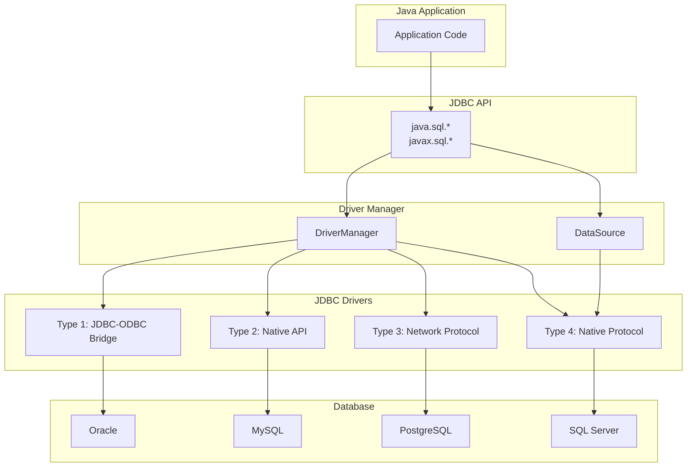
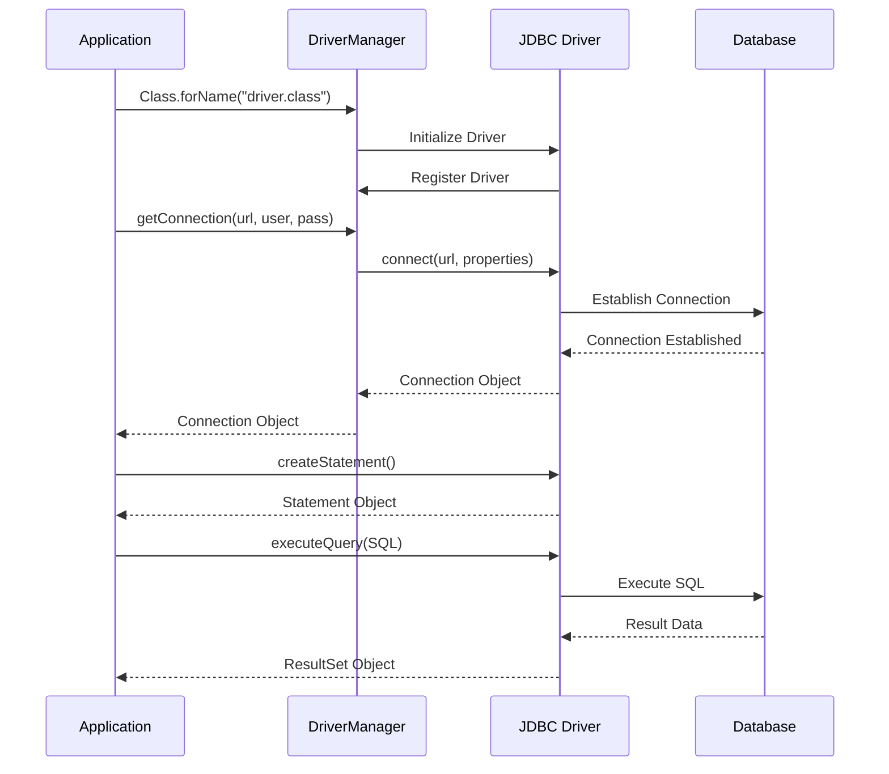
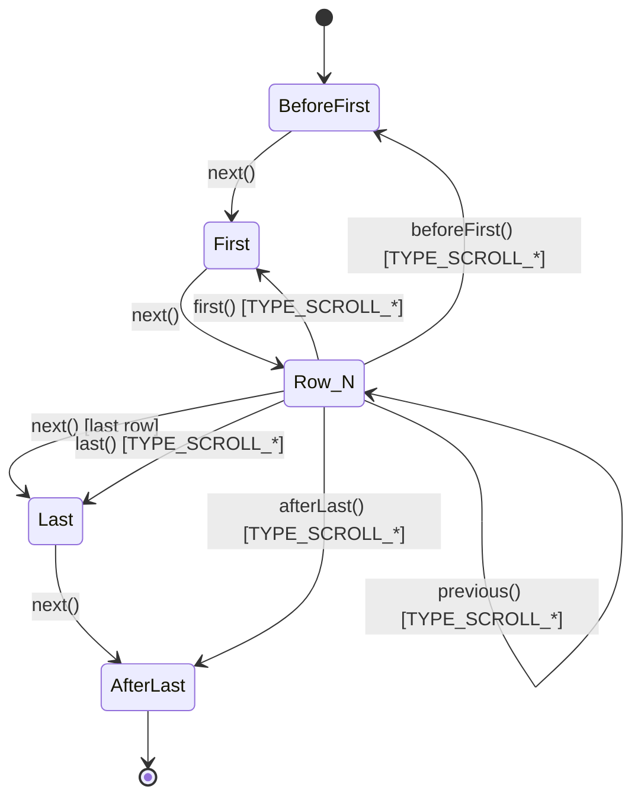
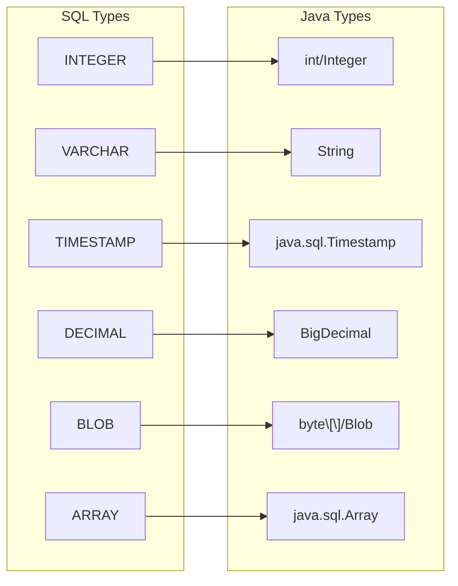
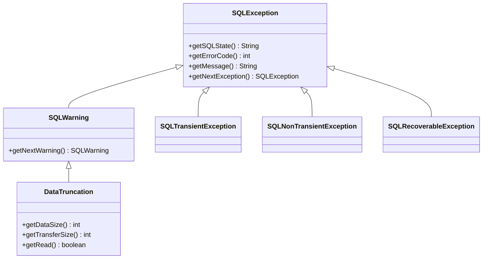

# JDBC

Java Database Connectivity (JDBC) は、Javaアプリケーションからリレーショナルデータベースへアクセスするための標準APIです。1997年にJDK 1.1の一部としてリリースされたJDBCは、データベース独立性を実現するための抽象化層として設計されました。Sun Microsystems（現Oracle）によって開発されたこのAPIは、SQLベースのデータアクセスを標準化し、異なるデータベースベンダー間での移植性を提供することを目的としています。

JDBCの設計理念は、データベース固有の実装詳細をドライバ層に隠蔽し、アプリケーション開発者に統一されたインターフェースを提供することにあります。この設計により、理論的にはデータベースを変更してもアプリケーションコードの修正を最小限に抑えることができます。しかし実際には、各データベースベンダーのSQL方言やデータ型の違い、パフォーマンス特性の差異により、完全な移植性を実現することは困難です。

## アーキテクチャ

JDBCアーキテクチャは、アプリケーション層、JDBC API層、ドライバマネージャ層、JDBCドライバ層、そしてデータベース層という多層構造を採用しています。この階層化されたアーキテクチャにより、各層の責務が明確に分離され、拡張性と保守性が確保されています。



JDBC APIの中核となるインターフェースは、`java.sql`パッケージに定義されています。主要なインターフェースには、`Connection`、`Statement`、`PreparedStatement`、`CallableStatement`、`ResultSet`、`DatabaseMetaData`、`ResultSetMetaData`などがあります。これらのインターフェースは、データベース操作に必要な基本的な機能を抽象化しています。

`javax.sql`パッケージは、JDBC 2.0で導入された拡張APIであり、接続プーリング、分散トランザクション、行セット（RowSet）などの高度な機能を提供します。特に`DataSource`インターフェースは、接続管理をより洗練された方法で行うために重要な役割を果たしています。

## ドライバタイプと実装

JDBCドライバは、その実装方式により4つのタイプに分類されます[^1]。各タイプには固有の特性とトレードオフが存在し、使用するシステムの要件に応じて適切なタイプを選択する必要があります。

Type 1ドライバ（JDBC-ODBCブリッジドライバ）は、JDBCの呼び出しをODBC（Open Database Connectivity）の呼び出しに変換します。このドライバタイプは、JDBCの初期に広く使用されましたが、パフォーマンスの問題とプラットフォーム依存性のため、現在では非推奨とされています。Java 8以降、JDKからJDBC-ODBCブリッジは削除されました。

Type 2ドライバ（ネイティブAPIドライバ）は、JDBCの呼び出しをデータベース固有のネイティブクライアントライブラリの呼び出しに変換します。このアプローチは、Type 1よりも高速ですが、クライアントマシンにデータベース固有のライブラリをインストールする必要があり、プラットフォーム依存性の問題が残ります。

Type 3ドライバ（ネットワークプロトコルドライバ）は、ミドルウェアサーバーを介してデータベースと通信します。JDBCの呼び出しは、ミドルウェア固有のプロトコルに変換され、ミドルウェアサーバーがデータベース固有のプロトコルに再変換します。このアーキテクチャは、複数のデータベースへのアクセスを統一的に管理できる利点がありますが、追加のネットワークホップによるレイテンシの増加が課題となります。

Type 4ドライバ（ネイティブプロトコルドライバ）は、純粋なJavaで実装され、データベースのネイティブプロトコルを直接実装します。このドライバタイプは、プラットフォーム独立性とパフォーマンスの両立を実現し、現在最も広く使用されています。各データベースベンダーは、独自のType 4ドライバを提供しており、最適なパフォーマンスと機能を実現しています。



## 接続管理とConnectionプール

データベース接続は、システムリソースを大量に消費する高コストな操作です。TCP/IPソケットの確立、認証、セッション初期化などの処理が必要となるため、頻繁な接続の作成と破棄はアプリケーションのパフォーマンスに深刻な影響を与えます。この問題を解決するために、接続プーリングという技術が広く採用されています。

接続プーリングは、事前に作成されたデータベース接続をプール（集合）として管理し、アプリケーションからの要求に応じて再利用可能な接続を提供します。接続が不要になった場合、接続を閉じる代わりにプールに返却し、次の要求で再利用します。この仕組みにより、接続確立のオーバーヘッドを削減し、システム全体のスループットを向上させることができます。

`javax.sql.DataSource`インターフェースは、接続プーリングを実現するための標準的な抽象化を提供します。`DataSource`の実装は、単純な接続ファクトリーから、洗練された接続プーリング機能を持つものまで様々です。一般的な接続プーリング実装には、Apache Commons DBCP、HikariCP、C3P0などがあります。

```java
// DataSource configuration example (conceptual)
HikariConfig config = new HikariConfig();
config.setJdbcUrl("jdbc:postgresql://localhost:5432/mydb");
config.setUsername("user");
config.setPassword("password");
config.setMaximumPoolSize(10);
config.setMinimumIdle(5);
config.setConnectionTimeout(30000);
config.setIdleTimeout(600000);
config.setMaxLifetime(1800000);

HikariDataSource dataSource = new HikariDataSource(config);
```

接続プーリングの設定では、以下のパラメータが重要な役割を果たします。最大プールサイズは、同時に保持できる接続の最大数を制限し、データベースサーバーの過負荷を防ぎます。最小アイドル接続数は、アイドル状態で維持する接続の最小数を指定し、突発的な負荷に対する応答性を確保します。接続タイムアウトは、新しい接続の取得を待つ最大時間を制御し、システムのハングアップを防ぎます。

接続のライフサイクル管理も重要な考慮事項です。長時間使用された接続は、メモリリークやネットワークの問題により劣化する可能性があります。そのため、接続の最大寿命を設定し、定期的に接続を更新することが推奨されます。また、アイドル接続の検証により、無効な接続がプールに残ることを防ぐことができます。

## SQL実行とStatement処理

JDBCにおけるSQL実行は、`Statement`、`PreparedStatement`、`CallableStatement`の3つのインターフェースを通じて行われます。各インターフェースは異なる用途と特性を持ち、適切な選択がアプリケーションのパフォーマンスとセキュリティに大きく影響します。

`Statement`インターフェースは、最も基本的なSQL実行メカニズムを提供します。静的なSQLクエリの実行に適していますが、SQLインジェクション攻撃に対して脆弱であり、パフォーマンスの観点からも最適ではありません。`Statement`を使用する場合、SQLクエリは実行のたびに解析され、実行計画が作成されるため、同じクエリを繰り返し実行する場合には非効率です。

`PreparedStatement`は、パラメータ化されたSQLクエリの実行に特化しています。SQLクエリは事前にコンパイルされ、パラメータのみが実行時に設定されます。この仕組みにより、SQLインジェクション攻撃を防ぎ、同じクエリの繰り返し実行時のパフォーマンスを向上させることができます。パラメータの設定は型安全であり、JDBCドライバが適切なエスケープ処理を行います。

```java
// PreparedStatement usage pattern
String sql = "SELECT * FROM users WHERE age > ? AND city = ?";
try (PreparedStatement pstmt = connection.prepareStatement(sql)) {
    pstmt.setInt(1, 25);
    pstmt.setString(2, "Tokyo");
    
    try (ResultSet rs = pstmt.executeQuery()) {
        while (rs.next()) {
            // Process results
        }
    }
}
```

`CallableStatement`は、ストアドプロシージャやストアドファンクションの呼び出しに使用されます。データベース側で事前に定義されたロジックを実行するため、複雑なビジネスロジックをデータベース層で実装する場合に有用です。`CallableStatement`は、入力パラメータ、出力パラメータ、入出力パラメータをサポートし、複数の結果セットを返すことも可能です。

## ResultSetの処理とカーソル管理

`ResultSet`は、SQLクエリの実行結果を表現するインターフェースであり、データベースから取得したデータへのカーソルベースのアクセスを提供します。`ResultSet`の設計は、大量のデータを効率的に処理するために、一度にすべてのデータをメモリにロードするのではなく、必要に応じてデータをフェッチする仕組みを採用しています。

`ResultSet`のタイプは、その機能性により3つに分類されます。`TYPE_FORWARD_ONLY`は、カーソルが前方向のみに移動可能な最も基本的なタイプです。`TYPE_SCROLL_INSENSITIVE`は、双方向のスクロールが可能ですが、他のトランザクションによる変更を反映しません。`TYPE_SCROLL_SENSITIVE`は、双方向のスクロールが可能で、かつ他のトランザクションによる変更を反映します。



`ResultSet`の同時実行性も重要な特性です。`CONCUR_READ_ONLY`は、読み取り専用の`ResultSet`を作成し、データの変更はできません。`CONCUR_UPDATABLE`は、`ResultSet`を通じてデータの更新が可能ですが、すべてのデータベースとJDBCドライバがこの機能をサポートしているわけではありません。

フェッチサイズは、`ResultSet`のパフォーマンスに大きく影響する重要なパラメータです。フェッチサイズは、データベースから一度に取得する行数を指定します。小さすぎるフェッチサイズは、ネットワークラウンドトリップの増加によりパフォーマンスが低下します。一方、大きすぎるフェッチサイズは、メモリ使用量の増加とレスポンスタイムの悪化を招きます。適切なフェッチサイズは、データの特性とネットワーク環境により異なりますが、一般的には10から100の範囲が推奨されます。

`ResultSetMetaData`インターフェースは、`ResultSet`の構造に関する情報を提供します。カラム数、カラム名、カラムのデータ型、NULL可能性などの情報を取得できます。この情報は、動的なクエリ結果の処理や、汎用的なデータ処理ロジックの実装に不可欠です。

## トランザクション管理

トランザクションは、データベース操作の論理的な単位であり、ACID特性（原子性、一貫性、独立性、永続性）を保証します。JDBCにおけるトランザクション管理は、`Connection`インターフェースを通じて行われ、自動コミットモードと手動コミットモードの2つの動作モードをサポートしています。

デフォルトでは、JDBC接続は自動コミットモードで動作します。このモードでは、各SQL文が独立したトランザクションとして扱われ、実行後に自動的にコミットされます。自動コミットモードは、単純な操作には便利ですが、複数の関連する操作を原子的に実行する必要がある場合には不適切です。

```java
// Manual transaction management
connection.setAutoCommit(false);
try {
    // Execute multiple SQL statements
    PreparedStatement pstmt1 = connection.prepareStatement("UPDATE accounts SET balance = balance - ? WHERE id = ?");
    pstmt1.setBigDecimal(1, amount);
    pstmt1.setLong(2, fromAccount);
    pstmt1.executeUpdate();
    
    PreparedStatement pstmt2 = connection.prepareStatement("UPDATE accounts SET balance = balance + ? WHERE id = ?");
    pstmt2.setBigDecimal(1, amount);
    pstmt2.setLong(2, toAccount);
    pstmt2.executeUpdate();
    
    connection.commit();
} catch (SQLException e) {
    connection.rollback();
    throw e;
}
```

トランザクション分離レベルは、同時実行されるトランザクション間の相互作用を制御する重要な概念です。JDBCは、SQL標準で定義された4つの分離レベルをサポートしています[^2]。

`TRANSACTION_READ_UNCOMMITTED`は最も低い分離レベルであり、ダーティリード、非反復読み取り、ファントムリードのすべてが発生する可能性があります。`TRANSACTION_READ_COMMITTED`は、ダーティリードを防ぎますが、非反復読み取りとファントムリードは発生する可能性があります。`TRANSACTION_REPEATABLE_READ`は、ダーティリードと非反復読み取りを防ぎますが、ファントムリードは発生する可能性があります。`TRANSACTION_SERIALIZABLE`は最も高い分離レベルであり、すべての異常を防ぎますが、パフォーマンスへの影響が最も大きくなります。

セーブポイントは、トランザクション内の特定の時点を記録し、必要に応じてその時点まで部分的にロールバックする機能を提供します。この機能により、複雑なトランザクション処理において、より細かい制御が可能になります。

```java
Savepoint savepoint = null;
try {
    // First operation
    statement.executeUpdate("INSERT INTO log_table VALUES (...)");
    
    savepoint = connection.setSavepoint("after_log");
    
    // Risky operation
    statement.executeUpdate("UPDATE critical_table SET ...");
    
    connection.commit();
} catch (SQLException e) {
    if (savepoint != null) {
        connection.rollback(savepoint);
        // Commit the log entry only
        connection.commit();
    } else {
        connection.rollback();
    }
}
```

## 型マッピングとデータ変換

JDBCは、JavaのデータとSQLデータの相互変換を透過的に処理するための包括的な型マッピングシステムを提供しています。この型マッピングは、JDBC仕様で詳細に定義されており、異なるデータベースシステム間での一貫性を保証します[^3]。

基本的なSQLデータ型とJavaデータの対応関係は明確に定義されています。例えば、SQL `INTEGER`はJavaの`int`または`Integer`に、SQL `VARCHAR`はJavaの`String`に、SQL `TIMESTAMP`はJavaの`java.sql.Timestamp`にマッピングされます。しかし、データベースベンダー固有の拡張型や、標準SQLに含まれない型については、ベンダー固有の実装に依存します。



NULL値の処理は、JavaとSQLの型システムの違いにより特別な注意が必要です。Javaのプリミティブ型はNULL値を表現できないため、`ResultSet`から値を取得する際には、`wasNull()`メソッドを使用してNULL値を確認する必要があります。あるいは、プリミティブ型の代わりにラッパークラスを使用することで、NULL値を自然に扱うことができます。

大きなオブジェクト（LOB）の処理は、特別な考慮を必要とします。BLOB（Binary Large Object）とCLOB（Character Large Object）は、大量のデータを効率的に処理するための特殊な型です。これらの型は、ストリーミングAPIを提供し、メモリに全データをロードすることなく、大きなデータを処理できます。

```java
// BLOB handling example
PreparedStatement pstmt = connection.prepareStatement("INSERT INTO documents (id, content) VALUES (?, ?)");
pstmt.setLong(1, documentId);

// Stream large file to BLOB
try (InputStream is = new FileInputStream(largeFile)) {
    pstmt.setBinaryStream(2, is, largeFile.length());
    pstmt.executeUpdate();
}

// Reading BLOB
ResultSet rs = statement.executeQuery("SELECT content FROM documents WHERE id = " + documentId);
if (rs.next()) {
    Blob blob = rs.getBlob("content");
    try (InputStream is = blob.getBinaryStream()) {
        // Process stream
    }
}
```

JDBC 4.0以降では、`SQLXML`型のサポートが追加され、XMLデータの効率的な処理が可能になりました。`SQLXML`インターフェースは、DOMSource、SAXSource、StreamSourceなど、様々な形式でXMLデータにアクセスする方法を提供します。

カスタム型マッピングは、`SQLData`インターフェースを実装することで実現できます。これにより、複雑なユーザー定義型（UDT）をJavaオブジェクトにマッピングすることが可能になります。この機能は、オブジェクトリレーショナルデータベースとの統合において特に有用です。

## バッチ処理とパフォーマンス最適化

大量のデータ操作を効率的に実行するために、JDBCはバッチ処理機能を提供しています。バッチ処理により、複数のSQL文を一度にデータベースに送信し、ネットワークラウンドトリップを削減することができます。この技術は、大量のINSERT、UPDATE、DELETE操作を実行する際に特に効果的です。

```java
// Batch processing example
PreparedStatement pstmt = connection.prepareStatement("INSERT INTO users (name, email, age) VALUES (?, ?, ?)");

for (User user : userList) {
    pstmt.setString(1, user.getName());
    pstmt.setString(2, user.getEmail());
    pstmt.setInt(3, user.getAge());
    pstmt.addBatch();
    
    // Execute batch every 1000 records
    if (++count % 1000 == 0) {
        int[] results = pstmt.executeBatch();
        connection.commit();
    }
}

// Execute remaining records
int[] results = pstmt.executeBatch();
connection.commit();
```

バッチサイズの選択は、パフォーマンスに大きく影響します。小さすぎるバッチサイズは、バッチ処理の利点を十分に活用できません。一方、大きすぎるバッチサイズは、メモリ使用量の増加とトランザクションの長時間化により、システムの安定性に影響を与える可能性があります。一般的に、100から1000の範囲が推奨されますが、最適な値はシステムの特性により異なります。

ステートメントキャッシングは、もう一つの重要なパフォーマンス最適化技術です。`PreparedStatement`のコンパイル結果をキャッシュすることで、同じSQL文の再コンパイルを避けることができます。多くのJDBCドライバと接続プーリング実装は、ステートメントキャッシング機能を提供しています。

接続プロパティの適切な設定も、パフォーマンスに大きく影響します。例えば、PostgreSQLドライバの`prepareThreshold`プロパティは、サーバーサイドプリペアドステートメントを使用する前に、同じステートメントを実行する必要がある回数を指定します。MySQLドライバの`useServerPrepStmts`プロパティは、サーバーサイドプリペアドステートメントの使用を制御します。

## メタデータとスキーマ情報

`DatabaseMetaData`インターフェースは、データベースの包括的な情報を提供する強力な機能です。このインターフェースを通じて、データベースの製品名、バージョン、サポートする機能、スキーマ情報、テーブル構造、インデックス情報、外部キー制約など、データベースに関する詳細な情報を取得できます。

```java
DatabaseMetaData metadata = connection.getMetaData();

// Database product information
String productName = metadata.getDatabaseProductName();
String productVersion = metadata.getDatabaseProductVersion();
int majorVersion = metadata.getDatabaseMajorVersion();
int minorVersion = metadata.getDatabaseMinorVersion();

// Supported features
boolean supportsTransactions = metadata.supportsTransactions();
boolean supportsBatchUpdates = metadata.supportsBatchUpdates();
boolean supportsStoredProcedures = metadata.supportsStoredProcedures();

// Schema information
ResultSet schemas = metadata.getSchemas();
while (schemas.next()) {
    String schemaName = schemas.getString("TABLE_SCHEM");
    String catalog = schemas.getString("TABLE_CATALOG");
}

// Table information
ResultSet tables = metadata.getTables(null, null, "%", new String[]{"TABLE"});
while (tables.next()) {
    String tableName = tables.getString("TABLE_NAME");
    String tableType = tables.getString("TABLE_TYPE");
}
```

メタデータ情報は、動的なアプリケーションの構築において重要な役割を果たします。例えば、ORMフレームワークは、メタデータを使用してデータベーススキーマからJavaクラスを生成します。データベース管理ツールは、メタデータを使用してデータベースの構造を視覚的に表示します。マイグレーションツールは、メタデータを使用して現在のスキーマ状態を確認し、必要な変更を適用します。

## エラー処理と例外管理

JDBCにおけるエラー処理は、`SQLException`とその派生クラスを中心に構築されています。`SQLException`は、SQLState、エラーコード、エラーメッセージという3つの重要な情報を提供します。SQLStateは、SQL標準で定義された5文字のコードであり、エラーの分類を示します。エラーコードは、データベースベンダー固有の数値コードです。エラーメッセージは、人間が読める形式のエラー説明です。



JDBC 4.0では、`SQLException`の階層が拡張され、より詳細なエラー分類が可能になりました。`SQLTransientException`は、リトライにより成功する可能性がある一時的なエラーを表します。`SQLNonTransientException`は、同じ操作をリトライしても成功しない永続的なエラーを表します。`SQLRecoverableException`は、アプリケーションが何らかの回復処理を実行すれば成功する可能性があるエラーを表します。

エラー処理のベストプラクティスとして、適切なログ記録、リトライロジックの実装、トランザクションのロールバック、リソースのクリーンアップが重要です。特に、try-with-resourcesステートメントの使用により、リソースの確実なクローズを保証できます。

## JDBC 4.xの進化と新機能

JDBC 4.0（Java 6）以降、JDBCは継続的に進化を続けています。主要な改善点には、自動ドライバ登録、拡張された例外階層、新しいデータ型のサポート、接続とステートメントのプーリング標準化などがあります。

自動ドライバ登録機能により、`Class.forName()`を使用した明示的なドライバ登録が不要になりました。ServiceLoaderメカニズムを使用して、クラスパスに存在するJDBCドライバが自動的に検出され、登録されます。この機能により、アプリケーションコードがより簡潔になり、設定の柔軟性が向上しました。

JDBC 4.1（Java 7）では、try-with-resourcesステートメントのサポートが追加されました。`Connection`、`Statement`、`ResultSet`インターフェースが`AutoCloseable`を実装するようになり、自動的なリソース管理が可能になりました。

```java
// JDBC 4.1 try-with-resources
try (Connection conn = dataSource.getConnection();
     PreparedStatement pstmt = conn.prepareStatement("SELECT * FROM users WHERE id = ?")) {
    pstmt.setLong(1, userId);
    try (ResultSet rs = pstmt.executeQuery()) {
        while (rs.next()) {
            // Process results
        }
    }
} // All resources are automatically closed
```

JDBC 4.2（Java 8）では、Java 8の新しい日時APIのサポートが追加されました。`java.time.LocalDate`、`java.time.LocalTime`、`java.time.LocalDateTime`などの新しい時間型を、対応するSQL型と相互変換できるようになりました。

JDBC 4.3（Java 9）では、大きな機能追加はありませんでしたが、Java 9のモジュールシステムへの対応が行われました。`java.sql`モジュールと`java.sql.rowset`モジュールが定義され、モジュール化されたアプリケーションでのJDBCの使用が可能になりました。

## リアクティブプログラミングとR2DBC

従来のJDBCは、同期的なブロッキングI/Oモデルに基づいて設計されています。この設計は、スレッドプールモデルでは効果的ですが、大量の同時接続を処理する必要がある現代のアプリケーションでは、スケーラビリティの制限となることがあります。この問題に対処するため、R2DBC（Reactive Relational Database Connectivity）という新しい仕様が開発されました[^4]。

R2DBCは、リアクティブストリームAPIに基づいた非同期でノンブロッキングなデータベースアクセスを提供します。JDBCとは異なり、R2DBCはゼロから設計された新しいAPIであり、JDBCとの直接的な互換性はありません。しかし、両者は共存可能であり、アプリケーションの要件に応じて使い分けることができます。

## セキュリティ考慮事項

JDBCアプリケーションのセキュリティは、複数の層で考慮する必要があります。最も重要なセキュリティ脅威の一つは、SQLインジェクション攻撃です。この攻撃を防ぐための最も効果的な方法は、`PreparedStatement`の使用とパラメータ化されたクエリの採用です。

接続文字列に含まれる認証情報の管理も重要なセキュリティ考慮事項です。パスワードをソースコードにハードコーディングすることは避け、環境変数、設定ファイル、または専用の認証情報管理システムを使用すべきです。

SSL/TLSを使用した暗号化された接続の確立も重要です。多くのJDBCドライバは、SSL/TLS接続をサポートしており、適切な設定により、ネットワーク上でのデータの盗聴を防ぐことができます。

```java
// SSL connection example for PostgreSQL
String url = "jdbc:postgresql://localhost:5432/mydb?ssl=true&sslmode=require";
Properties props = new Properties();
props.setProperty("user", "username");
props.setProperty("password", "password");
props.setProperty("sslcert", "/path/to/client-cert.pem");
props.setProperty("sslkey", "/path/to/client-key.pem");
props.setProperty("sslrootcert", "/path/to/ca-cert.pem");

Connection conn = DriverManager.getConnection(url, props);
```

最小権限の原則に従い、アプリケーションが使用するデータベースユーザーには、必要最小限の権限のみを付与すべきです。読み取り専用のアプリケーションには、SELECT権限のみを付与し、管理者権限を持つユーザーの使用は避けるべきです。

監査ログの実装も、セキュリティの観点から重要です。重要な操作、特に機密データへのアクセスや変更操作は、適切にログ記録されるべきです。多くのデータベースシステムは、組み込みの監査機能を提供していますが、アプリケーションレベルでの補完的なログ記録も必要です。

[^1]: JDBC™ 4.3 Specification, JSR 221, Oracle Corporation, 2017
[^2]: ISO/IEC 9075-2:2016 Information technology - Database languages - SQL - Part 2: Foundation (SQL/Foundation)
[^3]: JDBC™ API Tutorial and Reference, Third Edition, Fisher, Ellis, Bruce, Addison-Wesley, 2003
[^4]: R2DBC Specification 0.9.1.RELEASE, R2DBC Working Group, 2022