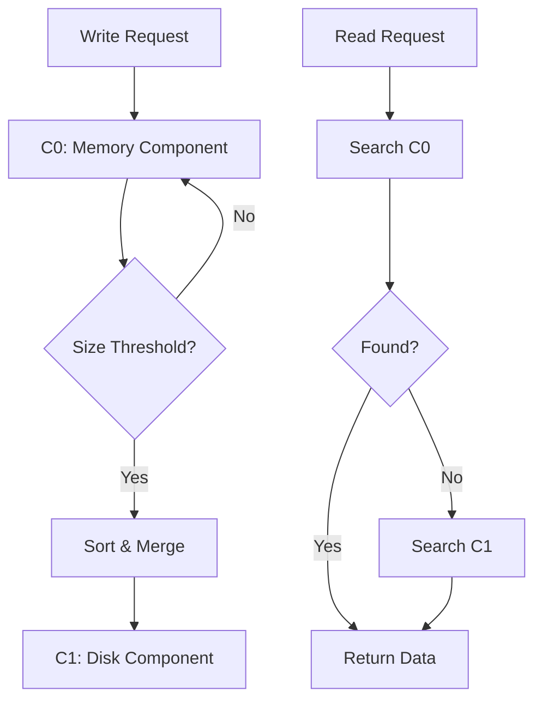
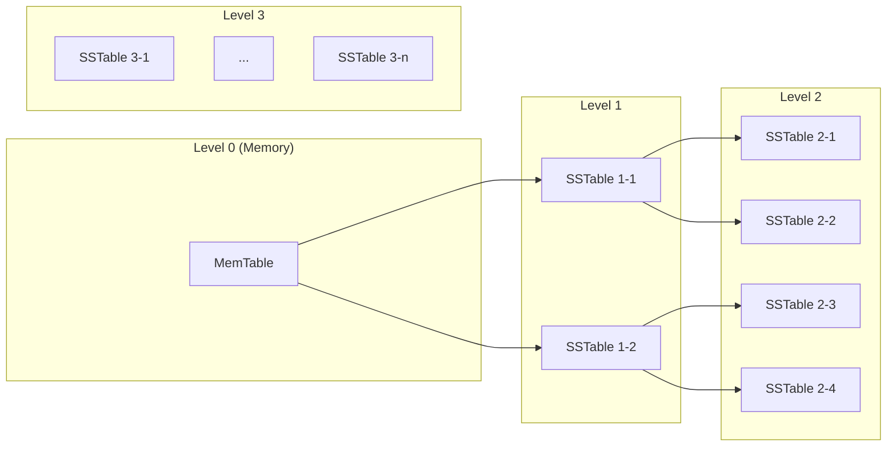
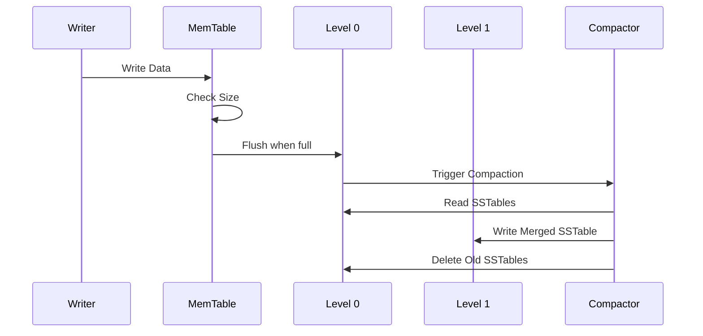
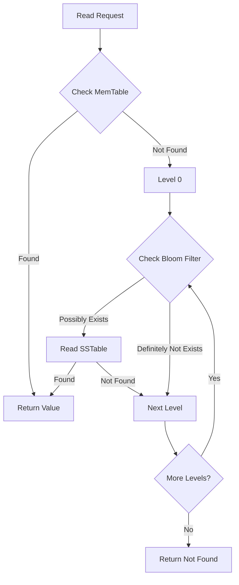
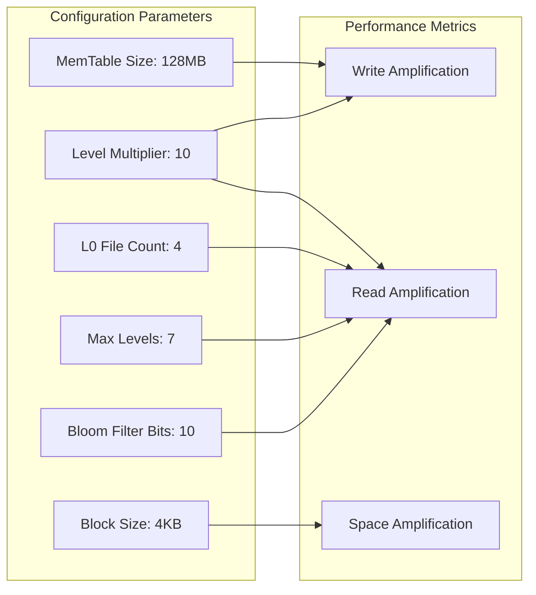

# LSM-Tree: Log-Structured Merge-Tree

Log-Structured Merge-Tree（LSM-Tree）は、1996年にPatrick O'NeilらによってACM Transactionsで発表されたインデックス構造である[^1]。従来のB-Treeが読み取りと書き込みのバランスを重視するのに対し、LSM-Treeは書き込み性能を大幅に向上させることを主目的として設計された。この設計思想は、現代の大規模分散システムにおいて、特にwrite-intensiveなワークロードを扱うデータベースシステムで広く採用されている。

LSM-Treeの核心的なアイデアは、書き込み操作をシーケンシャルな追記操作に変換することである。ランダムな書き込みをメモリ上のデータ構造に一旦蓄積し、定期的にディスクへシーケンシャルに書き出すことで、ディスクI/Oの効率を最大化する。この設計により、特にSSDやHDDといった物理的な記憶媒体において、ランダムアクセスのコストが高い環境で顕著な性能向上を実現できる。

## 基本構造と動作原理

LSM-Treeは複数のコンポーネントから構成される階層的なデータ構造である。最も基本的な構成では、メモリ上のC0コンポーネントとディスク上のC1コンポーネントという2つの要素を持つ。C0はメモリ上に存在し、通常はスキップリストや赤黒木などの効率的なインメモリデータ構造として実装される。新しい書き込みはすべてC0に対して行われ、C0が一定のサイズに達すると、その内容をソートしてC1へマージする。

C1コンポーネントはディスク上にソートされた形式で保存される。これはSSTable（Sorted String Table）やB-Treeなどの形式で実装されることが多い。重要な点は、C1への書き込みが常にバルクで行われ、シーケンシャルなI/O操作として実行されることである。これにより、ディスクのシーク時間を最小化し、スループットを最大化できる。

実際の実装では、より多くのレベルを持つ多層構造が採用されることが一般的である。各レベルは前のレベルよりも大きなサイズを持ち、典型的には10倍程度の倍率で増加する。この倍率は増幅係数（amplification factor）と呼ばれ、システムの性能特性に大きな影響を与える重要なパラメータである。

## 書き込み経路の詳細

LSM-Treeにおける書き込み操作は、まずWrite-Ahead Log（WAL）に記録される。これは耐久性を保証するための重要な機構であり、システムクラッシュ時のデータ復旧を可能にする。WALへの書き込みは追記専用のシーケンシャル操作であるため、高速に実行できる。

WALへの記録後、データはメモリ上のMemTableに挿入される。MemTableは通常、キーでソートされた順序を維持するデータ構造として実装される。スキップリストは並行性制御が比較的簡単であるため、多くの実装で採用されている。MemTableが閾値サイズに達すると、新しいMemTableが作成され、古いMemTableは読み取り専用となってディスクへのフラッシュがスケジュールされる。

フラッシュプロセスでは、MemTableの内容がソートされた形式でSSTableとしてディスクに書き出される。SSTableは不変（immutable）なファイル形式であり、一度作成されると内容が変更されることはない。この特性により、並行アクセス制御が簡素化され、キャッシュの効率も向上する。

## コンパクション戦略

LSM-Treeの性能を左右する最も重要な要素の一つがコンパクション戦略である。時間の経過とともに、各レベルには多数のSSTableが蓄積され、読み取り性能の劣化や空間効率の低下を引き起こす。コンパクションは、複数のSSTableをマージして新しいSSTableを作成するプロセスであり、重複したキーの削除、削除済みレコードの物理的な除去、データの再編成を行う。

最も基本的なコンパクション戦略はサイズ階層型コンパクション（Size-Tiered Compaction）である。この方式では、同じレベル内で似たサイズのSSTableをグループ化し、一定数に達したらマージして次のレベルに移動する。実装が単純で、書き込み増幅が比較的小さいという利点があるが、空間増幅が大きくなる傾向がある。

レベル型コンパクション（Leveled Compaction）は、RocksDBで採用されている戦略であり[^2]、各レベルのサイズを厳密に制御する。レベルLのサイズはレベルL-1の約10倍に維持され、各レベル内でキー範囲の重複を最小化する。この方式では読み取り増幅が小さく、空間効率も良いが、書き込み増幅が大きくなる傾向がある。

Universal Compactionは、書き込み増幅を最小化することを目的とした戦略である。すべてのSSTableを時系列順に管理し、空間増幅の制約の下でコンパクションの頻度を最小化する。この方式は、書き込みが非常に多いワークロードに適しているが、読み取り性能や空間効率で妥協が必要となる。

## 読み取り経路と最適化

LSM-Treeの読み取り操作は、複数のコンポーネントを検索する必要があるため、B-Treeと比較して複雑である。基本的な読み取りプロセスは、まずMemTableを検索し、見つからない場合は各レベルのSSTableを新しいものから順に検索する。最悪の場合、すべてのレベルを検索する必要があるため、読み取り増幅が問題となる。

この問題を緩和するため、多くの最適化技術が開発されている。Bloom Filterは最も重要な最適化の一つであり、各SSTableに対して確率的データ構造を維持することで、キーが存在しない場合の無駄な読み取りを回避する[^3]。Bloom Filterは偽陽性（false positive）の可能性があるが、偽陰性（false negative）は発生しないため、存在しないキーの検索を高速化できる。

ブロックキャッシュは、頻繁にアクセスされるSSTableのブロックをメモリにキャッシュする機構である。LRU（Least Recently Used）やCLOCK[^4]などのアルゴリズムを使用して、限られたメモリ資源を効率的に活用する。適応的なキャッシュポリシーを実装することで、ワークロードの特性に応じて性能を最適化できる。

圧縮も重要な最適化技術である。SSTableは不変であるため、書き込み時に一度だけ圧縮を行えばよい。Snappy、LZ4、Zstandardなどの高速な圧縮アルゴリズムを使用することで、I/O帯域幅を節約し、全体的な性能を向上させることができる。圧縮率と圧縮・展開速度のトレードオフを考慮して、適切なアルゴリズムを選択する必要がある。

## 性能特性とトレードオフ

LSM-Treeの性能特性は、読み取り増幅、書き込み増幅、空間増幅という3つの指標で評価される。これらの指標は相互に関連しており、一つを最適化すると他の指標が悪化する傾向がある。このトレードオフの関係は、Rum Conjectureとして知られている[^5]。

書き込み増幅は、ユーザーが書き込んだデータ量に対する実際のディスクへの書き込み量の比率である。LSM-Treeでは、データが複数回コンパクションされるため、書き込み増幅が発生する。レベル型コンパクションでは、最悪の場合O(L × 増幅係数)の書き込み増幅が発生する。ここでLはレベル数である。

読み取り増幅は、一つのクエリを処理するために必要なディスクI/O操作の数である。最悪の場合、各レベルで一つのSSTableを読む必要があるため、O(L)の読み取り増幅が発生する。Bloom Filterやキャッシュにより、実際の読み取り増幅は大幅に削減できる。

空間増幅は、実際のデータサイズに対するストレージ使用量の比率である。削除されたレコードや古いバージョンのデータがコンパクションされるまで残るため、空間増幅が発生する。サイズ階層型コンパクションでは最大で2倍程度の空間増幅が発生する可能性がある。

## 実装における設計指針

LSM-Treeを実装する際には、多くの設計上の決定を行う必要がある。まず、MemTableのサイズは重要なパラメータである。大きなMemTableは書き込み増幅を削減するが、復旧時間が長くなり、メモリ使用量も増加する。一般的には、数十MBから数百MB程度が選択される。

レベル数と増幅係数も慎重に選択する必要がある。増幅係数が大きいほどレベル数は少なくなるが、各レベルでのコンパクション作業量が増加する。典型的な値は10であるが、ワークロードの特性に応じて調整される。SSDでは書き込み増幅がデバイスの寿命に影響するため、より小さな増幅係数が選択されることもある。

並行性制御も重要な設計要素である。複数のスレッドが同時に読み書きを行う環境では、適切なロック戦略が必要となる。MemTableへの書き込みには細粒度のロックやロックフリーデータ構造を使用し、SSTableの読み取りは不変性を利用してロックフリーで実装できる。コンパクションは独立したスレッドで実行し、フォアグラウンドの操作への影響を最小化する。

フェイルオーバーと復旧のメカニズムも実装において重要である。WALの管理、チェックポイントの作成、一貫性の保証など、信頼性を確保するための機構が必要となる。分散環境では、レプリケーションとの統合も考慮する必要がある。

## B-Treeとの比較

LSM-TreeとB-Treeは、それぞれ異なるワークロードに最適化されたインデックス構造である。B-Treeは読み取りと書き込みのバランスが取れたワークロードに適しており、インプレース更新により空間効率が良い。一方、LSM-Treeは書き込みが多いワークロードで優れた性能を発揮する。

B-Treeでは、各書き込み操作が潜在的にランダムI/Oを引き起こす。ページ分割やマージが発生する場合、複数のページへの書き込みが必要となる。これに対してLSM-Treeでは、すべての書き込みがシーケンシャルであるため、特に大量の書き込みを処理する場合に有利である。

読み取り性能では、B-Treeが一般的に優れている。B-Treeでは最大でもツリーの高さ分のI/Oで済むのに対し、LSM-Treeでは複数のコンポーネントを検索する必要がある。ただし、適切な最適化により、LSM-Treeでも十分な読み取り性能を達成できる。

## 実世界での採用事例

LSM-Treeは多くの現代的なデータベースシステムで採用されている。Apache Cassandraは、分散環境での高い書き込みスループットを実現するためにLSM-Treeを採用している[^6]。各ノードが独立してLSM-Treeを管理し、最終的な一貫性モデルと組み合わせることで、高い可用性とスケーラビリティを実現している。

RocksDBは、Facebookが開発したembeddable key-value storeであり、LSM-Treeの高度な実装として知られている。レベル型コンパクション、Universal Compaction、FIFO Compactionなど、複数のコンパクション戦略をサポートし、ワークロードに応じて最適な戦略を選択できる。また、Column Familyという概念により、異なる特性を持つデータを効率的に管理できる。

Apache HBaseは、Hadoopエコシステムの一部として開発された分散データベースであり、LSM-Treeをベースとしたストレージエンジンを使用している。BigTableの設計を参考にしており、行指向のデータモデルとLSM-Treeを組み合わせることで、大規模なデータセットの効率的な管理を実現している。

LevelDBは、GoogleがChromeブラウザのIndexedDB実装のために開発した軽量なkey-value storeである。シンプルで効率的な実装として知られており、多くのプロジェクトで組み込みデータベースとして使用されている。レベル型コンパクションを採用し、予測可能な性能特性を提供する。

これらの実装は、それぞれ異なる要件や制約に対応するための独自の最適化や拡張を行っている。例えば、Cassandraはタイムスタンプベースの競合解決、RocksDBは列指向の圧縮、HBaseは階層的なブロックキャッシュなど、アプリケーションの特性に応じた機能を提供している。

## 最新の研究動向

LSM-Treeの研究は現在も活発に行われており、新しい最適化技術や変種が提案されている。WiscKeyは、キーと値を分離して管理することで、大きな値を持つワークロードでの性能を改善する手法である[^7]。値をログ構造で管理し、LSM-Tree内にはキーとポインタのみを保存することで、コンパクションのオーバーヘッドを削減する。

PebblesDBは、ガード（guard）という概念を導入してフラグメンテーションを削減する手法を提案している[^8]。各レベルを複数のガードに分割し、ガード間でのオーバーラップを許容することで、コンパクションの柔軟性を高めている。

Dostoevsky[^9]は、Lazy Levelingという技術により、書き込み増幅と読み取り増幅のトレードオフをより細かく制御できるようにしている。最下層のレベルではレベル型、上位レベルではティア型のハイブリッド構造を採用することで、両方の利点を活かしている。

機械学習を活用した最適化も研究されている。ワークロードの特性を学習し、動的にコンパクション戦略やパラメータを調整する手法が提案されている。また、NVMeやOptaneなどの新しいストレージ技術に対応した最適化も重要な研究テーマとなっている。

[^1]: O'Neil, P., Cheng, E., Gawlick, D., & O'Neil, E. (1996). The log-structured merge-tree (LSM-tree). Acta Informatica, 33(4), 351-385.

[^2]: Facebook Inc. (2021). RocksDB: A Persistent Key-Value Store for Fast Storage Environments. https://rocksdb.org/

[^3]: Bloom, B. H. (1970). Space/time trade-offs in hash coding with allowable errors. Communications of the ACM, 13(7), 422-426.

[^4]: Corbato, F. J. (1968). A paging experiment with the multics system. MIT Project MAC Report MAC-M-384.

[^5]: Athanassoulis, M., Kester, M. S., Maas, L. M., Stoica, R., Idreos, S., Ailamaki, A., & Callaghan, M. (2016). Designing access methods: The RUM conjecture. In EDBT (pp. 461-466).

[^6]: Lakshman, A., & Malik, P. (2010). Cassandra: a decentralized structured storage system. ACM SIGOPS Operating Systems Review, 44(2), 35-40.

[^7]: Lu, L., Pillai, T. S., Arpaci-Dusseau, A. C., & Arpaci-Dusseau, R. H. (2016). WiscKey: Separating Keys from Values in SSD-conscious Storage. In FAST (pp. 133-148).

[^8]: Raju, P., Kadekodi, R., Chidambaram, V., & Abraham, I. (2017). PebblesDB: Building key-value stores using fragmented log-structured merge trees. In SOSP (pp. 497-514).

[^9]: Dayan, N., & Idreos, S. (2018). Dostoevsky: Better space-time trade-offs for LSM-tree based key-value stores via adaptive removal of superfluous merging. In SIGMOD (pp. 505-520).