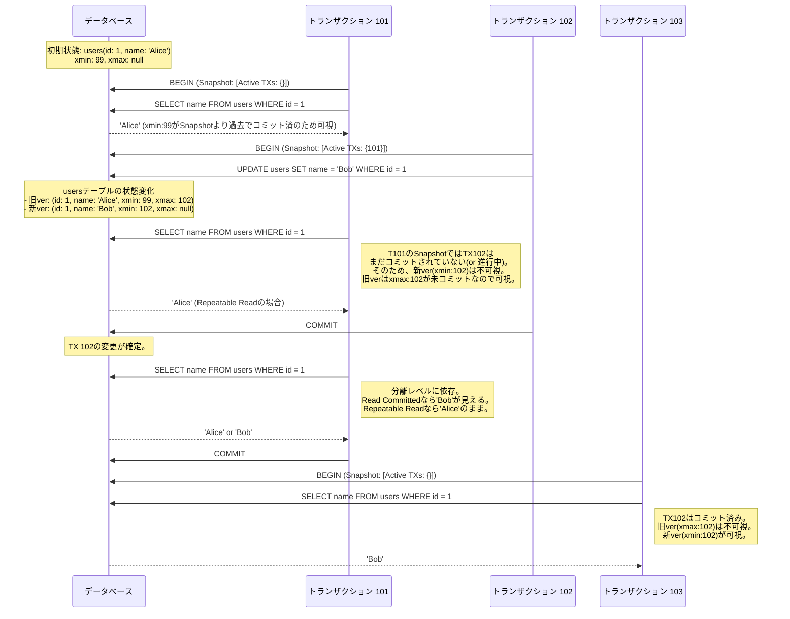

# データベースの心臓部を探る：MVCC（Multi-Version Concurrency Control）の包括的解説

現代のデータベースシステム、特に高い並行処理性能が求められるシステムにおいて、その心臓部とも言える技術が **MVCC (Multi-Version Concurrency Control)** です。日本語では「多版型同時実行制御」と訳されます。

なぜデータベースは、同時に複数のユーザーからの読み書き要求を、矛盾なく、かつ高速に処理できるのでしょうか？その答えの核心にMVCCはあります。単純な「ロック」による制御では、誰かがデータを書き換えている間、他の人はそのデータを読むことすら待たなければなりませんでした。しかしMVCCは、「**読み手は書き手をブロックせず、書き手もまた読み手をブロックしない**」という、一見すると魔法のような状況を実現します。

この記事では、MVCCがどのような概念であり、いかにしてその魔法を実現しているのか、その内部メカニズムから利点、そして避けては通れない課題まで、深く掘り下げていきます。単なる用語の羅列ではなく、その本質的な仕組みを理解し、新たな疑問や探求心へと繋がるような解説を目指します。

---

## 第1章: MVCC以前の世界 - 「待つ」ことが前提だった時代

MVCCの革新性を理解するためには、まずそれ以前の主流であった「ロックベース」の同時実行制御が築いた世界を旅する必要があります。そこは、「待つ」ことが秩序を保つための基本的なルールでした。

データベースの重要な責務の一つに、ACID特性の保証があります。特に **I (Isolation: 独立性)** は、複数のトランザクションが同時に実行されても、それぞれが独立して実行されているかのように振る舞うことを保証するものです。

この独立性を最も単純に実現する方法が、データに「鍵（ロック）」をかけることです。

> **共有ロック (Shared Lock)**
> 読み取り時に取得する、言わば「部屋の合鍵」です。他の人も合鍵を使って部屋（データ）を覗くことはできますが、誰も部屋の模様替え（書き込み）はできません。
>
> **排他ロック (Exclusive Lock)**
> 書き込み時に取得する「マスターキー」です。誰かがマスターキーで部屋に入っている間、他の人は合鍵を使うことも、もちろん別のマスターキーを使うことも許されません。

この仕組みは堅牢ですが、深刻なパフォーマンス問題を抱えています。特に、書き込み処理のために排他ロックが取得されると、そのデータ（あるいはテーブル全体）にアクセスしようとする他の全ての処理が待機状態に陥ります。読み取りが書き込みを圧倒的に上回るような現代的なアプリケーションでは、このブロッキングは致命的なボトルネックとなり得ます。

さらに、複数のトランザクションが互いに相手のロック解除を待ち続ける **デッドロック** という、永遠に解決されない膠着状態に陥る危険性も常にありました。

このようなロックが支配する「待つ」世界から脱却し、より流動的で高速な並行処理を実現するために、MVCCという新たなパラダイムが生まれたのです。

---

## 第2章: MVCCの核心概念 - 「時間」を操るデータベース

MVCCの根本的なアイデアは、驚くほどエレガントです。

**「データを上書きするではなく、新しいバージョンを作る」**

この一つの原則がすべてを変えました。データベースは単一の「現在」の状態を持つのではなく、時間の流れに沿った「歴史の記録」を持つようになります。各データ行は、その生成から削除（無効化）までのライフサイクルを持つ複数のバージョンとして存在し得るのです。

各トランザクションは、自分が始まった時点での「一貫したデータベースのスナップショット」という、いわば過去のある一点におけるデータベースの「写真」を与えられます。たとえ他のトランザクションがその裏で次々と新しい歴史を刻んでいても、自分の手元にある「写真」の内容が変わることはありません。

これにより、読み取りはロックという重い鎖から解放され、他の書き込み処理を待つことなく、常に自分だけの時間を旅ることができるのです。

この魔法を実現する2つの要素、「バージョニング」と「スナップショット」を詳しく見ていきましょう。

### 2.1. バージョニング - データに刻まれる歴史

MVCCでは、テーブルの各行（より正確には、行の各バージョン）に、そのバージョンが「いつ生まれ、いつ消えたか」という歴史情報が内部的に記録されます。多くのMVCC実装（例えばPostgreSQL）では、このために各行にシステムが管理する隠しカラムが付与されます。

- $t\_{min}$ (or `xmin`): このバージョンを作成（`INSERT`）したトランザクションのID ($T\_{id}$)
- $t\_{max}$ (or `xmax`): このバージョンを削除（`DELETE` or `UPDATE`）したトランザクションのID ($T\_{id}$)

この仕組みの上では、DML（データ操作言語）は以下のように解釈されます。

- **INSERT**: 新しい行バージョンを作成し、の $t\_{min}$ に自身の $T\_{id}$ を記録する。$t\_{max}$ は空のままです。
- **DELETE**: 対象の行バージョンの $t\_{max}$ に自身の $T\_{id}$ を記録する。物理的なデータはすぐには消えません。
- **UPDATE**: これは **DELETE** + **INSERT** の複合操作として扱われます。
  1.  まず、古いバージョンの $t\_{max}$ に自身の $T\_{id}$ を記録し、無効化します（論理的なDELETE）。
  2.  次に、更新後のデータを持つ新しい行バージョンを作成し、その $t\_{min}$ に自身の $T\_{id}$ を記録します（INSERT）。

つまり、データベースの更新とは、古い事実に「ここまで」という終止符を打ち、新しい事実を歴史に書き加える行為に他ならないのです。

### 2.2. スナップショットと可視性ルール

トランザクションが `BEGIN` または最初のSQLを実行したとき、データベースはその瞬間の「スナップショット」を定義します。このスナップショットは、一種のフィルタとして機能し、データベースに存在する無数の行バージョンの中から、どれが「見える」べきかを決定します。

スナップショットには、主に以下のような情報が含まれます。

- $T\_{id}$ の上限: このスナップショットより新しいトランザクションによる変更は無視する。
- 進行中の $T\_{id}$ のリスト: このスナップショット作成時点でまだコミットもロールバックもしていないトランザクションのリスト。

あるトランザクションが特定の行バージョンを読み取る際、このスナップショットと行の $t\_{min}, t\_{max}$ を照らし合わせ、以下の**可視性ルール**に従ってフィルタリングを行います。

> #### **MVCCにおける可視性判定の原則**
>
> ある行バージョンがトランザクション $T\_{A}$ から**可視 (Visible)** であるためには、以下の条件を**すべて**満たす必要があります。
>
> 1.  その行バージョンの作成元トランザクション（$t\_{min}$ が示す $T\_{id}$）が、**コミット済み**であること。
> 2.  かつ、その作成元トランザクションの $T\_{id}$ が、$T\_{A}$ のスナップショットの範囲内（つまり、スナップショットより過去）であること。
> 3.  その行バージョンの削除元トランザクション（$t\_{max}$）が、**存在しない**こと。
>
>     **--- または ---**
>
> 4.  $t\_{max}$ が存在する場合、それが示す $T\_{id}$ が、以下のいずれかであること。
>
>     - まだ**コミットされていない**（進行中か、ロールバックされた）。
>     - $T\_{A}$ のスナップショットの範囲外（つまり、スナップショットより未来）である。

このルールは複雑に見えますが、要は「**自分が知っている過去の確定した事実であり、かつ、自分が知らない未来の事実や未確定な事実によって消されていないもの**」だけが見える、という直感的な原則に基づいています。

### MermaidによるMVCCの動作フロー

2つのトランザクションが、それぞれのスナップショットに基づいてどのように異なる世界を見るのかを図で確認しましょう。

この図が示すように、T101のトランザクションは、T102によるデータ更新の影響を全く受けません。T101は自分が始めた時点の「時が止まった世界」を旅し続けているからです。これが、読み取りが書き込みをブロックしない理由です。

---

## 第3章: MVCCとトランザクション分離レベル

MVCCは、SQLで定められたトランザクション分離レベルを実現するための、強力で柔軟な基盤となります。特に、**Read Committed** と **Repeatable Read** という2つの重要な分離レベルは、MVCCのスナップショット管理戦略によってその挙動が定義されます。

本質的な違いは、**スナップショットの寿命（Lifecycle）** にあります。

### 3.1. Read Committed (コミット済み読み取り)

多くのデータベースでデフォルトとなっているこの分離レベルでは、**スナップショットはステートメント（SQL文）ごとに使い捨て**されます。SQL文が実行されるたびに、その瞬間の最新のコミット状況を反映した新しいスナップショットが取得されるのです。

これにより、同じトランザクション内であっても、SQLを実行するたびに見えるデータが変わる可能性があります。ある`SELECT`と次の`SELECT`の間に、他のトランザクションがデータを更新して`COMMIT`した場合、2回目の`SELECT`はその新しいデータを読み取ってしまいます。これは「**非再現読み (Non-Repeatable Read)**」と呼ばれますが、少なくともコミットされていないダーティなデータを読む（ダーティリード）ことは防げます。

### 3.2. Repeatable Read (反復可能読み取り)

より厳格な分離レベルである`Repeatable Read`では、**スナップショットはトランザクションと共に生まれ、トランザクションが終わるまで生き続けます**。トランザクションが開始された時に一度だけスナップショットが取得され、そのトランザクションが終了するまで、何度SQLを実行しても同じスナップショットが使い回されます。

これにより、トランザクション内での「時間の流れ」は完全に停止します。何度同じ`SELECT`を実行しても、常に同じ結果が返ってくることが保証され、「再現読み」が可能となります。

### Mermaidによる分離レベルの比較

スナップショットの寿命の違いがもたらす挙動の違いを、図で視覚的に比較してみましょう。

```mermaid
graph TD
    subgraph "トランザクション A"
        direction LR
        A_BEGIN["BEGIN"] --> A_S1["SELECT * FROM T; (結果: X)"]
        A_S1 --> A_WAIT["...待機..."]
        A_WAIT --> A_S2["SELECT * FROM T;"]
        A_S2 --> A_COMMIT["COMMIT"]
    end

    subgraph "トランザクション B"
        direction LR
        B_BEGIN["BEGIN"] --> B_UPDATE["UPDATE T SET val='Y'"]
        B_UPDATE --> B_COMMIT["COMMIT"]
    end


    subgraph "分離レベル: Read Committed"
        RC_FLOW["T-A: BEGIN"] --> SNAP1["T-A: S1実行時にSnapshot1取得<br/>結果: X"]
        SNAP1 --> T_B_RUN["T-B: 実行 & COMMIT<br/>(データがYに変わる)"]
        T_B_RUN --> SNAP2["T-A: S2実行時に<br/><b>新しいSnapshot2取得</b>"]
        SNAP2 --> RC_RESULT["T-A: S2の結果は <b>Y</b><br/>(非再現読み発生)"]
    end

    subgraph "分離レベル: Repeatable Read"
        RR_FLOW["T-A: BEGIN時に<br/><b>Snapshot1を固定</b>"] --> RR_S1["T-A: S1実行<br/>(Snapshot1を使用)<br/>結果: X"]
        RR_S1 --> T_B_RUN2["T-B: 実行 & COMMIT<br/>(データがYに変わる)"]
        T_B_RUN2 --> RR_S2["T-A: S2実行<br/>(<b>同じSnapshot1</b>を使用)"]
        RR_S2 --> RR_RESULT["T-A: S2の結果は <b>X</b><br/>(再現読みを保証)"]
    end

    %% スタイリング
    style A_BEGIN fill:#c9f,stroke:#333,stroke-width:2px
    style B_BEGIN fill:#9cf,stroke:#333,stroke-width:2px
```

この図は、分離レベルの本質が、単なるルールの違いではなく、トランザクションの時間認識、すなわち「スナップショット」という名の時計をいつ進めるか、あるいは止めるかという戦略の違いであることを明確に示しています。

---

## 第4章: MVCCの光と影 - 恩恵と避けられない代償

MVCCは高い並行性を実現する強力なパラダイムですが、その恩恵は無償ではありません。光が強ければ影もまた濃くなるように、MVCCはその設計思想からいくつかの避けられない課題、すなわち運用上の「代償」を伴います。

### 4.1. 光: MVCCの圧倒的な恩恵

- **読み書きの非ブロッキング**: これが最大の利点です。読み取りは書き込みを、書き込みは読み取りを待つ必要がありません。これにより、読み取り中心のアプリケーションでは劇的なパフォーマンス向上が見込めます。
- **デッドロックの劇的な削減**: 読み取りがロックを取得しないため、書き込みロックとの間で発生する典型的なデッドロックシナリオの多くを回避できます。
- **一貫性のある時点参照**: 長時間かかる集計クエリやバックアップ中でも、トランザクション開始時点の一貫したデータを安全に取得できます。

### 4.2. 影: MVCCが開発者に課す責務

MVCCの「データを上書きせず、新バージョンを作る」という特性は、裏を返せば「古いデータのゴミが溜まり続ける」ことを意味します。この「ゴミ」＝ガベージの管理が、MVCCを扱う上での最大の課題です。

#### 課題1: ストレージの肥大化とガベージコレクション

更新や削除が行われるたびに、古いバージョンのデータは「不要」にはなりますが、すぐには物理的に削除されません。その古いバージョンを必要とするトランザクションがまだ存在す可能性があるからです。

この不要になったが行儀よく残っている行バージョン（**ガベージ**または**タプル**）は、放置すればデータベースを肥大化させます。これは単にディスクを圧迫するだけでなく、`SELECT`がスキャンすべきデータの量を増やし、インデックスの効率を下げ、データベース全体のパフォーマンスを徐々に蝕んでいきます。

この問題を解決するため、MVCCを採用するデータベースは必ず**ガベージコレクション**の仕組みを持っています。PostgreSQLでは、このプロセスを**VACUUM (バキューム)** と呼びます。VACUUMは、どのトランザクションからも参照され得なくなった不要な行バージョンを特定し、再利用可能な領域としてマーク（あるいは物理的に削除）する、データベースのお掃除係です。定期的なVACUUMの実行は、MVCCデータベースの健康を維持するために絶対に欠かせない運用作業なのです。

#### 課題2: ロングトランザクションという時限爆弾

このガベージコレクションの存在が、MVCCにおける最も深刻な問題、「**ロングトランザクション問題**」を生み出します。

もし、あるトランザクションが非常に長い時間（数時間、あるいは数日）実行され続けた場合、何が起こるでしょうか？ そのトランザクションは、自分が開始した時点の非常に古いスナップショットを保持し続けます。すると、VACUUMは「この大量のガベージは、まだあのロングラン・トランザクションから見える可能性があるから、掃除できない」と判断し、クリーンアップを延期し続けます。

その結果、ガベージは掃除されることなく際限なく蓄積し、データベースは急速に肥大化、パフォーマンスは著しく劣化します。さらに深刻なのは、トランザクションIDの枯渇です。多くのデータベースでは $T\_{id}$ は32ビット整数（約$2 \\times 10^9$）であり、有限です。ロングトランザクションによってVACUUMが妨げられると、この $T\_{id}$ が一周して古いトランザクションと新しいトランザクションの区別がつかなくなる「**トランザクションID周回問題 (Transaction ID Wraparound)**」を引き起こし、最終的にはデータベースの強制停止に至る可能性さえあるのです。

#### 課題3: 書き込み増幅 (Write Amplification)

MVCCにおける`UPDATE`が、内部的には`DELETE` + `INSERT`であることは既に述べました。これは、単にデータを上書き（in-place update）するよりも多くのディスクI/Oを発生させることを意味します。特に、インデックスが存在するテーブルでは、古いバージョンのインデックスエントリーを無効化し、新しいバージョンのために新しいインデックスエントリーを追加する必要があり、書き込みコストはさらに増加します。この現象は**書き込み増幅**と呼ばれ、書き込み負荷の高いシステムでは無視できないオーバーヘッドとなります。

---

## 結論 - MVCCという設計思想とどう向き合うか

MVCCは、単なる一技術ではなく、データベースにおける並行性と一貫性の問題を「時間」という概念を用いて解決しようとする、一つの洗練された**設計思想**です。その恩恵は計り知れず、現代のデータベースアプリケーションの性能と安定性を根底から支えています。

しかし、その魔法のような振る舞いは、無償で手に入るものではありません。MVCCの内部で何が起きているのかを理解することは、データベースを扱う全ての開発者や管理者にとって不可欠な知識です。

- **トランザクションは可能な限り短く保つ**: ロングトランザクションがシステム全体に及ぼす害を理解し、長時間にわたる処理は適切に分割・設計する。
- **VACUUMの重要性を認識する**: ガベージコレクションがMVCCの生命線であることを理解し、その動作を監視し、適切にチューニングする。
- **更新コストを意識する**: `UPDATE`が決して軽い処理ではないことを知り、頻繁な更新が必要な場合は設計を見直す。

MVCCというデータベースの心臓部の動きを理解することで、私たちは初めて、その真の力を引き出し、安定したパフォーマンスを維持し、予期せぬトラブルを未然に防ぐことができるのです。この記事が、その深遠なる内部世界を探求する旅の一助となれば幸いです。
