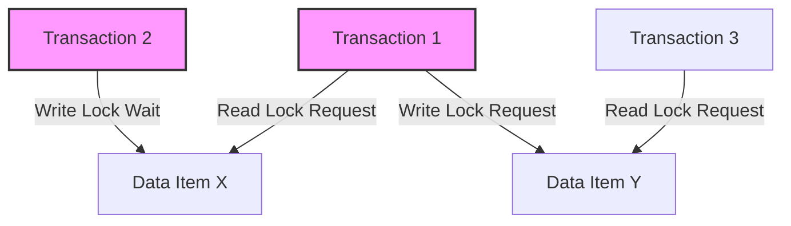
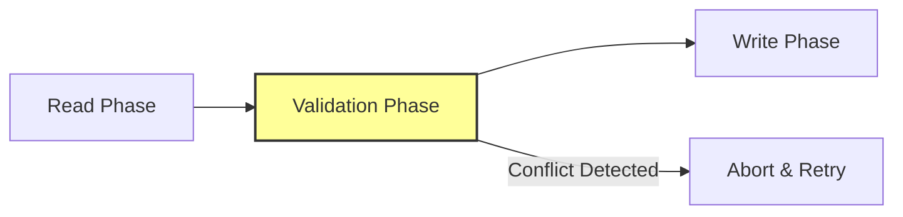
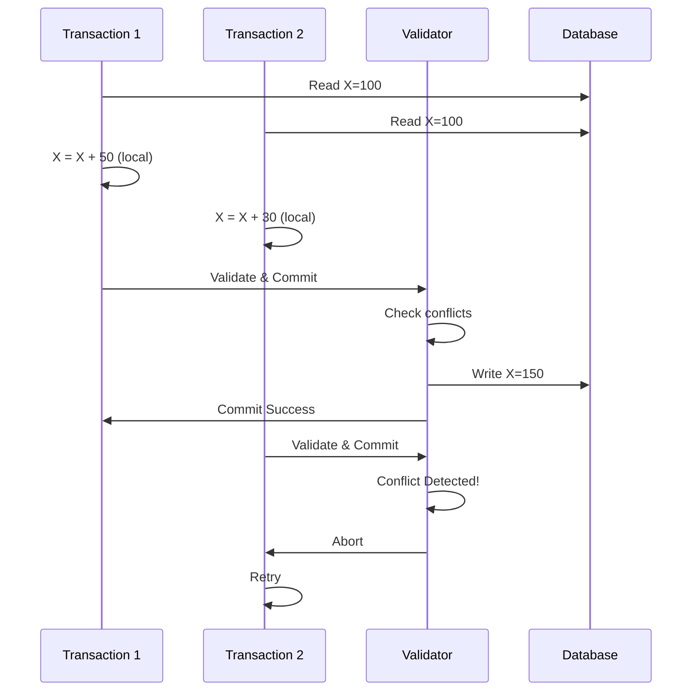
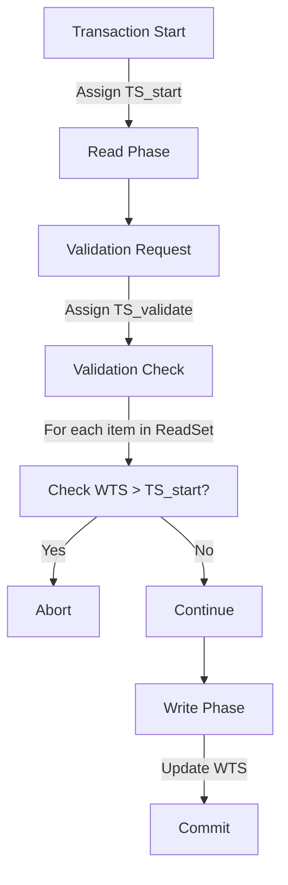
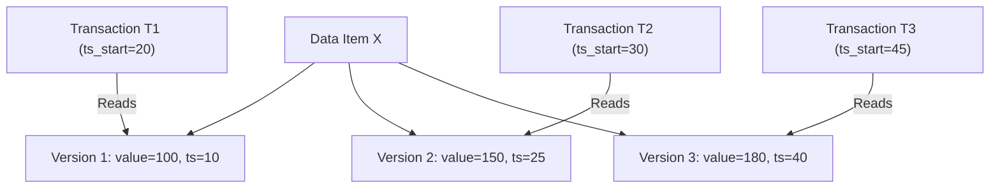
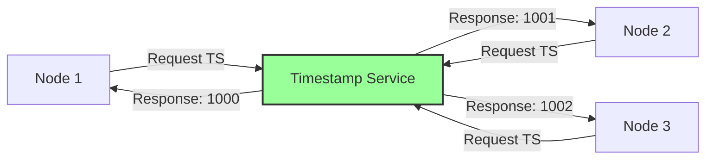
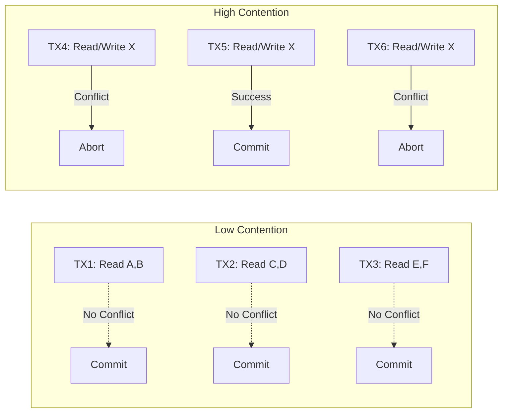
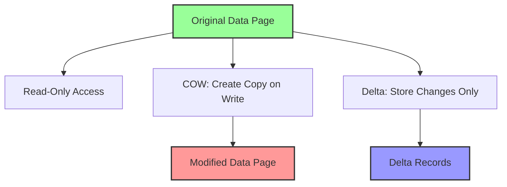
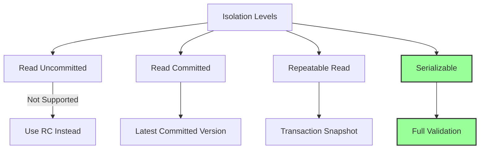
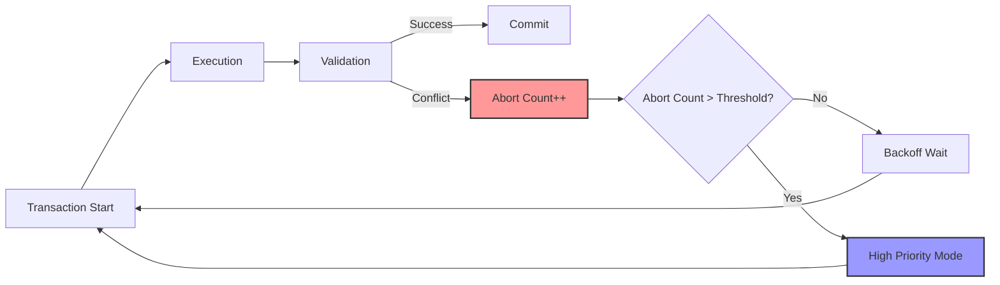

# Optimistic Concurrency Control

楽観的並行性制御（Optimistic Concurrency Control, OCC）は、トランザクション処理における並行性制御の主要な手法の一つである。1981年にH.T. KungとJohn T. Robinsonによって提案されたこの手法[^1]は、現代の分散システムやマルチバージョン管理システムにおいて広く採用されている。本稿では、OCCの理論的基盤から実装の詳細、性能特性まで、その全体像を体系的に論じる。

[^1]: Kung, H.T. and Robinson, J.T. (1981). "On optimistic methods for concurrency control". ACM Transactions on Database Systems, 6(2), pp.213-226.

## 並行性制御の基本概念

データベースシステムにおける並行性制御は、複数のトランザクションが同時実行される環境で、データの一貫性を保証するための根幹技術である。並行実行によって生じる可能性のある異常現象として、ダーティリード、ノンリピータブルリード、ファントムリードなどが知られている。これらの問題を防ぎつつ、システムのスループットを最大化することが並行性制御の目的となる。

従来の悲観的並行性制御（Pessimistic Concurrency Control, PCC）では、トランザクションがデータアクセスを行う際に事前にロックを取得する。この手法は確実性が高い反面、ロック競合によるデッドロックの発生や、待機時間の増加によるパフォーマンス低下という課題を抱えている。特に読み取り処理が多いワークロードでは、不要なロック取得がシステム全体のボトルネックとなることが多い。



上図は典型的なデッドロック状況を示している。Transaction 1がData Item Xの読み取りロックを保持しながらData Item Yの書き込みロックを要求し、Transaction 3がその逆の順序でロックを要求することで、循環待機が発生している。

## 楽観的並行性制御の原理

楽観的並行性制御は、「大部分のトランザクションは競合しない」という楽観的な仮定に基づいている。この仮定の下では、トランザクション実行中にロックを取得せず、コミット時に初めて競合の有無を検証する。この手法により、読み取り処理の並行性が大幅に向上し、デッドロックの問題も原理的に発生しない。

OCCにおけるトランザクション処理は、以下の3つのフェーズで構成される：



### Read Phase（読み取りフェーズ）

読み取りフェーズでは、トランザクションは必要なデータを自由に読み取り、更新操作をローカルなワークスペースで実行する。この段階では、他のトランザクションとの同期は一切行われない。トランザクションは読み取ったデータ項目のリスト（Read Set）と、更新予定のデータ項目のリスト（Write Set）を内部的に管理する。

重要な点は、このフェーズでの更新はすべてプライベートなコピーに対して行われることである。つまり、他のトランザクションからは一切見えない状態で処理が進行する。これにより、トランザクション間の干渉なしに並行実行が可能となる。

### Validation Phase（検証フェーズ）

検証フェーズは、OCCの核心となる部分である。ここでは、トランザクションの実行結果が直列化可能性（serializability）を満たすかどうかを判定する。Kungらの原論文では、以下の3つの検証規則が提示されている：

**Forward Validation（前方検証）**：現在のトランザクションTiと、Tiの開始後にコミットした全てのトランザクションTjとの間で競合を検証する。具体的には、以下の条件のいずれかを満たす必要がある：

1. Ti < Tj（Tiの全ての操作がTjの開始前に完了）
2. WriteSet(Ti) ∩ ReadSet(Tj) = ∅ かつ Ti < Tj（書き込み-読み取り競合なし）
3. WriteSet(Ti) ∩ ReadSet(Tj) = ∅ かつ WriteSet(Ti) ∩ WriteSet(Tj) = ∅（書き込み競合なし）

**Backward Validation（後方検証）**：現在のトランザクションTiと、既にコミット済みの全てのトランザクションTjとの間で競合を検証する。この方式では、ReadSet(Ti) ∩ WriteSet(Tj) = ∅であることを確認する。



### Write Phase（書き込みフェーズ）

検証フェーズを無事通過したトランザクションは、書き込みフェーズに進む。ここで初めて、ローカルワークスペースの更新内容が実際のデータベースに反映される。この段階では、他のトランザクションが同じデータを更新しないことが検証によって保証されているため、安全に書き込みを行うことができる。

## タイムスタンプベースのOCC実装

実用的なOCC実装では、タイムスタンプを用いた効率的な競合検出が行われる。各トランザクションには開始時刻（Start Timestamp）と検証時刻（Validation Timestamp）が割り当てられる。また、各データ項目には最終更新時刻（Write Timestamp）が記録される。



検証アルゴリズムは以下のように実装される：

```python
def validate_transaction(transaction):
    # Get validation timestamp
    ts_validate = get_current_timestamp()
    
    # Check read set
    for item in transaction.read_set:
        if item.write_timestamp > transaction.start_timestamp:
            return False  # Conflict detected
    
    # Check write set conflicts with concurrent transactions
    for other_tx in active_transactions:
        if other_tx.id != transaction.id:
            if transaction.write_set.intersects(other_tx.read_set):
                if other_tx.start_timestamp < ts_validate:
                    return False  # Conflict detected
    
    return True  # Validation passed
```

## マルチバージョンOCC

マルチバージョン並行性制御（MVCC）とOCCを組み合わせることで、より高度な並行性を実現できる。MVOCCでは、各データ項目の複数のバージョンを保持し、トランザクションは自身の開始時刻に基づいて適切なバージョンを読み取る。

MVOCCのバージョン管理メカニズムは以下のような構造を持つ：



各トランザクションは、自身の開始タイムスタンプ以前の最新バージョンを読み取る。これにより、読み取り操作が書き込み操作をブロックすることがなくなり、システム全体のスループットが向上する。

バージョン選択のアルゴリズムは、スナップショット分離（Snapshot Isolation）レベルを提供する：

```sql
-- Version selection for read operation
SELECT value, version_ts 
FROM item_versions 
WHERE item_id = ? 
  AND version_ts <= transaction_start_ts
ORDER BY version_ts DESC
LIMIT 1;
```

## 分散環境でのOCC

分散データベースシステムにおけるOCCの実装は、単一ノードシステムと比較してより複雑な課題を抱えている。ネットワーク遅延、部分的な障害、クロックスキューなどの問題に対処する必要がある。

### グローバルタイムスタンプの管理

分散環境では、全ノードで一貫したタイムスタンプを維持することが重要である。一般的なアプローチとして、以下の方式が採用される：

**Centralized Timestamp Server**: 単一のタイムスタンプサーバーが全てのタイムスタンプを発行する。実装は単純だが、単一障害点となるリスクがある。

**Lamport Timestamps**: 論理クロックを使用して因果関係を保持する。各ノードは自身のカウンタを持ち、メッセージ交換時に同期を行う[^2]。

[^2]: Lamport, L. (1978). "Time, clocks, and the ordering of events in a distributed system". Communications of the ACM, 21(7), pp.558-565.

**Hybrid Logical Clocks (HLC)**: 物理クロックと論理クロックを組み合わせ、因果関係と実時間の両方を考慮する[^3]。

[^3]: Kulkarni, S., Demirbas, M., Madappa, D., Avva, B., and Leone, M. (2014). "Logical Physical Clocks". In International Conference on Principles of Distributed Systems, pp.17-32.



### 分散検証プロトコル

分散環境でのトランザクション検証は、複数のノードにまたがるデータアクセスを考慮する必要がある。一般的なアプローチとして、2フェーズ検証プロトコルが使用される：

**Phase 1 - Local Validation**: 各参加ノードで、ローカルな競合検出を実行する。各ノードは自身が管理するデータに対する読み書きセットをチェックし、検証結果をコーディネーターに報告する。

**Phase 2 - Global Decision**: コーディネーターは全ノードからの検証結果を収集し、グローバルなコミット/アボートの決定を下す。全てのノードが検証を通過した場合のみ、トランザクションはコミットされる。

## パフォーマンス特性と最適化

OCCのパフォーマンスは、ワークロードの特性に大きく依存する。競合率が低い環境では優れた性能を発揮するが、競合率が高くなるとアボート率が上昇し、性能が劣化する可能性がある。

### 競合率とスループットの関係

トランザクションの競合確率は、以下の要因によって決定される：

- トランザクションの実行時間
- アクセスするデータ項目数
- データベースの総データ項目数
- 同時実行トランザクション数

競合確率Pは、簡略化されたモデルでは以下のように近似できる：

P ≈ 1 - (1 - 2K/N)^(T-1)

ここで、Kは各トランザクションがアクセスするデータ項目数、Nは総データ項目数、Tは同時実行トランザクション数である。



### アボート率の削減手法

高い競合環境でOCCの性能を改善するため、以下の最適化手法が提案されている：

**Early Conflict Detection**: 読み取りフェーズ中に、既にコミット済みトランザクションとの競合を早期に検出する。これにより、無駄な処理を削減できる。

**Adaptive Concurrency Control**: ワークロードの特性に応じて、OCCとPCCを動的に切り替える。競合率が閾値を超えた場合、一時的にロックベースの制御に切り替える。

**Transaction Chopping**: 長大なトランザクションを複数の小さなトランザクションに分割し、各部分の競合確率を低減する[^4]。

[^4]: Shasha, D., Llirbat, F., Simon, E., and Valduriez, P. (1995). "Transaction chopping: Algorithms and performance studies". ACM Transactions on Database Systems, 20(3), pp.325-363.

## 実システムにおけるOCC実装

現代の多くのデータベースシステムでOCCまたはその変種が採用されている。各システムは独自の最適化や拡張を施している。

### PostgreSQLのSSI実装

PostgreSQL 9.1以降では、Serializable Snapshot Isolation (SSI)と呼ばれるOCCの変種が実装されている[^5]。SSIは、スナップショット分離をベースに、書き込みスキュー異常を検出・防止するメカニズムを追加している。

[^5]: Ports, D.R. and Grittner, K. (2012). "Serializable snapshot isolation in PostgreSQL". Proceedings of the VLDB Endowment, 5(12), pp.1850-1861.

SSIでは、以下の依存関係を追跡する：
- rw-dependencies: あるトランザクションが読んだデータを、別のトランザクションが後で更新
- wr-dependencies: あるトランザクションが更新したデータを、別のトランザクションが読む
- ww-dependencies: 複数のトランザクションが同じデータを更新

危険な構造（dangerous structure）と呼ばれる特定の依存関係パターンが検出された場合、トランザクションをアボートする。

### Microsoft SQL ServerのSnapshot Isolation

SQL Server 2005以降で導入されたSnapshot Isolationは、MVCCベースのOCC実装である。各行にversion_chain_pointerを持ち、過去のバージョンをtempdbに保存する。

```sql
-- Enable snapshot isolation
ALTER DATABASE MyDatabase SET ALLOW_SNAPSHOT_ISOLATION ON;

-- Use snapshot isolation in transaction
SET TRANSACTION ISOLATION LEVEL SNAPSHOT;
BEGIN TRANSACTION;
  -- All reads see consistent snapshot
  SELECT * FROM Orders WHERE CustomerID = 123;
  UPDATE Orders SET Status = 'Shipped' WHERE OrderID = 456;
COMMIT;
```

### Google Spannerの分散OCC

Google Spannerは、グローバルに分散したデータベースでOCCを実装している[^6]。TrueTime APIを使用して、グローバルに一貫したタイムスタンプを提供し、外部一貫性（external consistency）を保証する。

[^6]: Corbett, J.C., et al. (2013). "Spanner: Google's globally distributed database". ACM Transactions on Computer Systems, 31(3), Article 8.

Spannerの革新的な点は、原子時計とGPSを使用して物理的な時刻の不確実性を管理することである。各タイムスタンプは[earliest, latest]の区間として表現され、この不確実性を考慮した上でトランザクションの順序付けを行う。

## メモリ管理とバージョン制御

OCCシステムでは、トランザクションのワークスペースとバージョン履歴の管理が重要な課題となる。効率的なメモリ管理は、システムの性能と安定性に直接影響する。

### ワークスペースの実装

各トランザクションは、読み取ったデータと更新予定のデータを保持するプライベートなワークスペースを必要とする。一般的な実装アプローチには以下がある：

**Copy-on-Write (COW)**: データの更新時にのみコピーを作成する。読み取り専用データは共有され、メモリ使用量を削減できる。

**Shadow Paging**: 更新されたページ全体のコピーを作成する。ページレベルでの原子性を提供するが、メモリオーバーヘッドが大きい。

**Delta Storage**: 元のデータとの差分のみを記録する。メモリ効率は良いが、データ再構築のコストが発生する。



### ガベージコレクション

MVOCCシステムでは、古いバージョンのデータが蓄積し続けるため、定期的なガベージコレクションが必要となる。効率的なガベージコレクションの実装には以下の考慮事項がある：

**Epoch-based Reclamation**: システム全体を時間的な期間（エポック）に分割し、あるエポック内の全てのトランザクションが完了した時点で、それ以前のバージョンを安全に削除できる。

**Reference Counting**: 各バージョンへの参照数を追跡し、参照数が0になった時点で削除する。実装は単純だが、カウンタ更新のオーバーヘッドがある。

**Tombstone Deletion**: 削除されたレコードに対して墓石（tombstone）マーカーを設定し、後でバッチ処理で物理的に削除する。

## トランザクション分離レベルとOCC

ANSI/ISO SQL標準では4つのトランザクション分離レベルが定義されているが、OCCベースのシステムでこれらをどのように実装するかは重要な設計上の選択となる。

### Read Uncommitted

このレベルはダーティリードを許容するため、OCCの基本原則と相容れない。多くのOCCシステムでは、このレベルをサポートしないか、Read Committedと同等の動作をする。

### Read Committed

各読み取り操作で最新のコミット済みバージョンを参照する。MVOCCでは、読み取り時点での最新コミット済みバージョンを選択することで実現される。

### Repeatable Read

トランザクション開始時のスナップショットを維持し、同じデータを複数回読んでも同じ値が返されることを保証する。OCCでは自然にこの特性が提供される。

### Serializable

完全な直列化可能性を保証する最も厳格なレベル。OCCの検証フェーズで、ファントムリードを含む全ての異常現象を防ぐ必要がある。



## 障害回復とログ管理

OCCシステムにおける障害回復は、トランザクションの原子性と永続性を保証するために不可欠である。ログ管理の方式は、システムの回復時間と通常運用時のパフォーマンスに大きく影響する。

### Write-Ahead Logging (WAL)

OCCでもWALの原則は適用される。ただし、検証フェーズの結果もログに記録する必要がある：

```
LOG RECORD: BEGIN_TRANSACTION tid=1001 start_ts=5000
LOG RECORD: READ_ITEM tid=1001 item=X version=100
LOG RECORD: WRITE_INTENT tid=1001 item=Y old=50 new=75
LOG RECORD: BEGIN_VALIDATION tid=1001 val_ts=5010
LOG RECORD: VALIDATION_SUCCESS tid=1001
LOG RECORD: COMMIT tid=1001 commit_ts=5011
```

### チェックポイント戦略

OCCシステムでは、実行中のトランザクションがプライベートワークスペースで作業しているため、一貫したチェックポイントの作成が比較的容易である。ファジーチェックポイントを使用することで、システムを停止することなくチェックポイントを作成できる。

チェックポイント作成時には、以下の情報を記録する：
- アクティブトランザクションリスト
- 各データ項目の最新コミット済みバージョン
- 次のタイムスタンプ値

## 実装上の詳細な考慮事項

実用的なOCCシステムの実装には、理論的な議論では触れられない多くの実践的な課題が存在する。

### インデックスの管理

Bツリーなどのインデックス構造をOCC環境で管理する場合、特別な配慮が必要である。インデックスの更新も検証の対象となるため、ファントムリードの防止が複雑になる。

一般的なアプローチとして、インデックスレベルでのバージョニングや、論理的な削除（遅延削除）が使用される：

```python
class BTreeNode:
    def __init__(self):
        self.keys = []
        self.values = []
        self.children = []
        self.version = 0
        self.deleted = False
        
    def insert(self, key, value, transaction):
        # Create new version instead of in-place update
        new_node = self.copy()
        new_node.version = transaction.timestamp
        # Perform insertion on new_node
        return new_node
```

### キャッシュコヒーレンシ

分散OCCシステムでは、各ノードがローカルキャッシュを持つ場合、キャッシュの一貫性維持が課題となる。無効化ベースまたは更新ベースのプロトコルを使用するが、OCCの特性を活かした最適化が可能である。

**Lazy Invalidation**: コミット時にのみ無効化メッセージを送信し、読み取り時に検証を行う。これにより、無効化トラフィックを削減できる。

**Version Vector**: 各ノードが保持するバージョンベクトルを使用し、必要な場合のみキャッシュを更新する。

### デッドロック回避

OCCは原理的にデッドロックフリーであるが、実装上の制約により疑似的なデッドロック状況が発生する可能性がある。例えば、検証フェーズでのリソース取得順序が不適切な場合、循環待機が発生する可能性がある。

これを防ぐため、検証フェーズでは以下の規則を適用する：
1. データ項目へのアクセスは常に同じ順序（例：キーの昇順）で行う
2. 検証に必要なリソースは事前に一括取得する
3. タイムアウトメカニズムを実装し、長時間の待機を防ぐ

## パフォーマンスチューニング

OCCシステムのパフォーマンスを最適化するには、ワークロードの特性を理解し、適切なパラメータ調整を行う必要がある。

### トランザクションサイズの最適化

トランザクションのサイズ（アクセスするデータ項目数と実行時間）は、競合率に直接影響する。大きすぎるトランザクションは競合率を上げ、小さすぎるとオーバーヘッドが増加する。

最適なトランザクションサイズは、以下の式で近似できる：

Optimal_Size ≈ sqrt(N × Overhead_Ratio / Concurrent_Transactions)

ここで、Nは総データ項目数、Overhead_Ratioはトランザクション開始・コミットのオーバーヘッドである。

### 適応的な再試行戦略

トランザクションがアボートされた場合の再試行戦略は、システム全体のスループットに大きく影響する。単純な即時再試行は、同じ競合を繰り返す可能性が高い。

効果的な再試行戦略には以下がある：

**Exponential Backoff**: 再試行間隔を指数関数的に増加させる。初期遅延をd、最大遅延をDとすると、n回目の再試行遅延は min(d × 2^n, D) となる。

**Priority Aging**: アボート回数に応じてトランザクションの優先度を上げ、検証フェーズで優先的に処理する。

**Conflict Avoidance**: アボートの原因となったデータ項目を記録し、再試行時には異なるアクセスパターンを試みる。



## 理論的な拡張と研究動向

OCCの基本概念は1980年代に確立されたが、現在でも活発な研究が続いている。特に、新しいハードウェアアーキテクチャやアプリケーション要求に対応するための拡張が提案されている。

### ハードウェアトランザクショナルメモリ (HTM) との統合

Intel TSXやIBM POWER HTMなどのハードウェアトランザクショナルメモリは、OCCの実装を大幅に効率化する可能性がある。HTMを使用することで、検証フェーズを原子的に実行し、ソフトウェアオーバーヘッドを削減できる[^7]。

[^7]: Wang, T., et al. (2017). "Eunomia: Scaling concurrent search trees under contention using HTM". In Proceedings of PPoPP '17, pp.385-399.

HTMベースのOCC実装では、以下の利点がある：
- 検証フェーズの原子性がハードウェアで保証される
- キャッシュコヒーレンシプロトコルを活用した効率的な競合検出
- アボート時の自動的なロールバック

### 機械学習を用いた競合予測

最近の研究では、機械学習を用いてトランザクションの競合を事前に予測し、実行戦略を最適化する手法が提案されている[^8]。過去の実行履歴から競合パターンを学習し、高競合が予測されるトランザクションには異なる並行性制御手法を適用する。

[^8]: Zhang, T., et al. (2018). "Rafiki: Machine Learning as an Analytics Service System". Proceedings of the VLDB Endowment, 12(2), pp.128-140.

予測モデルには以下の特徴量が使用される：
- アクセスするテーブル/インデックスの組み合わせ
- トランザクションタイプ（読み取り専用/更新）
- 時間帯やシステム負荷
- 過去の競合履歴

この予測に基づいて、OCCとPCCを動的に切り替えたり、トランザクションのスケジューリングを調整したりすることで、全体的なスループットを向上させる。

楽観的並行性制御は、その elegantな設計思想と実装の柔軟性により、現代のデータベースシステムにおいて重要な位置を占め続けている。特に、読み取り中心のワークロードや、地理的に分散したシステムにおいて、その真価を発揮する。一方で、高競合環境での性能劣化は依然として課題であり、適応的な制御やハードウェア支援などの新しいアプローチが継続的に研究されている。システム設計者は、アプリケーションの特性を十分に理解した上で、OCCの採用可否を判断する必要がある。