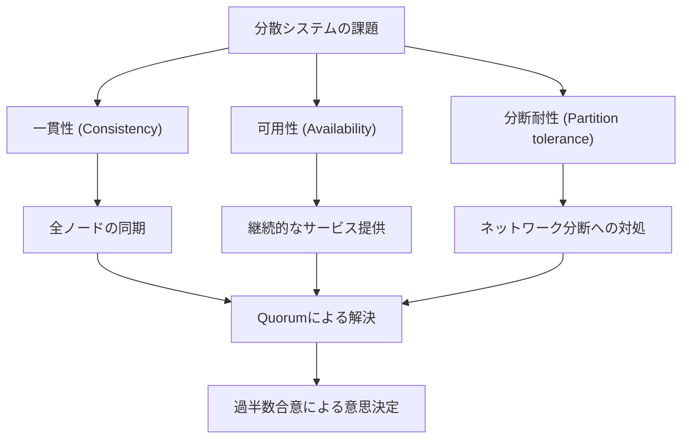
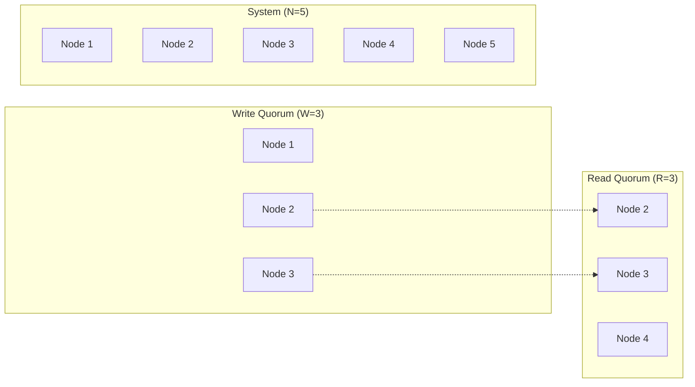
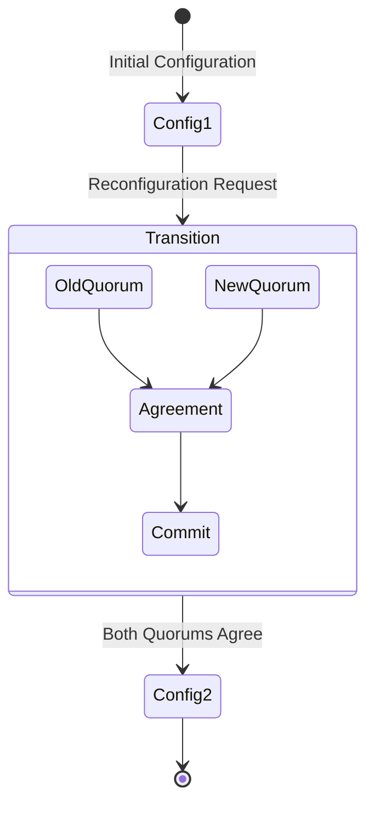
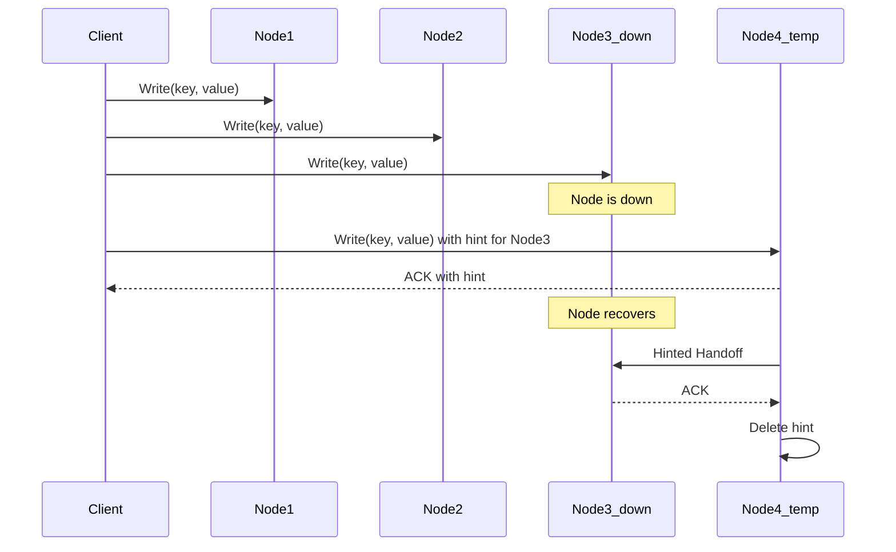

# Quorum

分散システムにおいて、複数のノードが協調して動作する際、データの一貫性と可用性をどのように保証するかという問題は、システム設計の根幹に関わる重要な課題である。単一ノードのシステムでは、トランザクションのACID特性を満たすことで一貫性を保証できるが、複数のノードにデータを複製して保持する分散システムでは、ノード間の通信遅延、ノードの故障、ネットワークの分断といった様々な障害要因が存在し、全てのノードが常に同じ状態を保つことは現実的に不可能である。

Quorumは、このような分散システムにおける合意形成（consensus）の問題に対する実用的な解決策の一つである。Quorumベースのアプローチは、全てのノードの合意を待つのではなく、過半数以上の部分集合（quorum）の合意をもって操作を完了とみなすことで、システムの可用性を保ちながら一貫性を維持する。この概念は1979年にRobert H. ThomasとDavid K. Giffordによって提案された¹「Weighted Voting for Replicated Data」に端を発し、現在では多くの分散データベースシステムやストレージシステムで採用されている基本的な手法となっている。



## Quorumの数学的基礎

Quorumの本質は、集合論的な観点から理解することができる。$N$個のノードからなる分散システムにおいて、任意の二つのQuorum集合が必ず交差（intersection）を持つという性質が、システムの一貫性を保証する鍵となる。

全体集合を$U = \{n_1, n_2, ..., n_N\}$とし、Quorum集合の集まりを$\mathcal{Q} = \{Q_1, Q_2, ..., Q_m\}$とする。このとき、Quorumシステムが満たすべき基本的な性質は以下の通りである：

**交差性（Intersection Property）**: 任意の二つのQuorum $Q_i, Q_j \in \mathcal{Q}$に対して、$Q_i \cap Q_j \neq \emptyset$が成り立つ。

この交差性により、異なるQuorumによって実行された操作間で、少なくとも一つの共通ノードが存在することが保証される。この共通ノードが、操作の順序性や一貫性を保証する上で重要な役割を果たす。

最も単純で広く使用されるQuorum構成は、多数決Quorum（Majority Quorum）である。$N$個のノードからなるシステムにおいて、任意の$\lceil \frac{N+1}{2} \rceil$個以上のノードの集合をQuorumとする。この構成では、任意の二つのQuorumが必ず交差することが容易に証明できる。

$|Q_1| \geq \lceil \frac{N+1}{2} \rceil$かつ$|Q_2| \geq \lceil \frac{N+1}{2} \rceil$のとき、
$|Q_1| + |Q_2| \geq 2 \times \lceil \frac{N+1}{2} \rceil > N$

したがって、鳩の巣原理により$Q_1 \cap Q_2 \neq \emptyset$が成り立つ。

## Read/Write Quorumの仕組み

実際の分散データベースシステムでは、読み取り操作と書き込み操作で異なるQuorumサイズを使用することで、システムの特性を調整することができる。これがRead/Write Quorumの基本的な考え方である。

$N$個のレプリカを持つシステムにおいて、書き込みQuorumのサイズを$W$、読み取りQuorumのサイズを$R$とする。一貫性を保証するために満たすべき条件は以下の通りである：

**読み書き交差条件**: $R + W > N$

この条件により、任意の読み取りQuorumと書き込みQuorumが必ず交差することが保証される。読み取り操作は、最新の書き込みを含む少なくとも一つのレプリカから値を読み取ることができる。



さらに、書き込みの一貫性を保証するために、以下の条件も通常要求される：

**書き書き交差条件**: $W + W > N$（すなわち$W > \frac{N}{2}$）

この条件により、同時に実行される二つの書き込み操作が必ず交差することが保証され、書き込みの順序性を維持できる。

Read/Write Quorumの構成により、システムの特性を柔軟に調整することが可能となる。例えば、$W = N$かつ$R = 1$とすれば、全てのレプリカへの書き込みが必要となる代わりに、任意の単一レプリカからの読み取りで最新の値を取得できる（Read-One Write-All: ROWA）。逆に$W = 1$かつ$R = N$とすれば、書き込みは高速だが読み取りには全レプリカへのアクセスが必要となる。

## バージョン管理と一貫性保証

Read/Write Quorumシステムにおいて、単にQuorumの交差性だけでは強一貫性（strong consistency）を保証するには不十分である。複数のレプリカが異なるバージョンのデータを保持している可能性があるため、読み取り操作時に最新の値を特定するメカニズムが必要となる。

最も一般的な手法は、各データ項目にバージョン番号（またはタイムスタンプ）を付与することである。書き込み操作時には、新しいバージョン番号を割り当て、読み取り操作時には、Quorumから取得した値の中で最も新しいバージョンを持つものを選択する。

```python
# Simplified version of versioned read operation
def read_with_quorum(key, quorum_size):
    responses = []
    for node in select_random_nodes(quorum_size):
        value, version = node.read(key)
        responses.append((value, version, node))
    
    # Select the value with the highest version
    latest_value, latest_version, _ = max(responses, key=lambda x: x[1])
    
    # Read repair: update stale replicas
    for value, version, node in responses:
        if version < latest_version:
            node.write(key, latest_value, latest_version)
    
    return latest_value
```

このバージョン管理の仕組みは、Leslie Lamportが提案した論理時計（Logical Clock）²の概念に基づいている。各ノードは自身の論理時計を持ち、操作のたびにインクリメントする。書き込み時には、現在の論理時計の値をバージョン番号として使用する。

しかし、単純なバージョン番号では、同時書き込みによる競合を検出できない場合がある。この問題に対処するため、多くのシステムではベクタークロック（Vector Clock）³やバージョンベクター（Version Vector）を使用している。

## 動的メンバーシップと再構成

実際の分散システムでは、ノードの追加、削除、故障が頻繁に発生する。静的なQuorum構成では、一定数以上のノードが故障するとシステム全体が利用不可能になってしまう。この問題に対処するため、動的にQuorum構成を変更する仕組みが必要となる。

動的再構成（Dynamic Reconfiguration）の基本的なアプローチは、構成変更自体もQuorumベースの操作として扱うことである。新しい構成への移行は、古い構成のQuorumと新しい構成のQuorumの両方の承認を得ることで安全に実行される。



Leslie Lamportらが提案したVertical Paxos⁴では、構成変更を特別な値の書き込みとして扱い、通常のコンセンサスプロトコルを使用して新しい構成に合意する。一方、Ongaro and Ousterhoutが提案したRaft⁵では、Joint Consensusと呼ばれる手法を使用し、古い構成と新しい構成の両方のQuorumが必要な移行期間を設けることで、安全な構成変更を実現している。

## パフォーマンス特性とトレードオフ

Quorumベースのシステムにおける性能特性は、Quorumサイズ、ネットワーク遅延、ノードの処理能力など、多くの要因に依存する。主要なトレードオフは以下の通りである。

**レイテンシとスループットのトレードオフ**: Quorumサイズが大きいほど、より多くのノードからの応答を待つ必要があるため、操作のレイテンシが増加する。特に地理的に分散したシステムでは、このレイテンシの増加が顕著になる。一方で、読み取りQuorumが小さい場合、負荷を多くのノードに分散できるため、システム全体のスループットは向上する可能性がある。

**一貫性と可用性のトレードオフ**: CAP定理⁶が示すように、ネットワーク分断時には一貫性と可用性の両方を同時に満たすことはできない。Quorumベースのシステムでは、Quorumサイズを調整することで、このトレードオフをある程度制御できる。例えば、$W = R = \lceil \frac{N+1}{2} \rceil$とすれば、最大$\lfloor \frac{N-1}{2} \rfloor$個のノード故障まで耐えられるが、それ以上のノードが利用不可能になると、読み取りも書き込みもできなくなる。

実際のシステムでは、これらのトレードオフを考慮して、アプリケーションの要件に応じた適切なQuorum構成を選択する必要がある。例えば、Amazon DynamoDB⁷では、顧客がRead/Write Quorumのサイズを動的に調整できる仕組みを提供している。

## Sloppy QuorumとHinted Handoff

厳密なQuorumの要求は、一時的なノード故障やネットワーク遅延に対してシステムを脆弱にする可能性がある。この問題に対処するため、Amazon Dynamoなどのシステムでは、Sloppy Quorumと呼ばれる緩和された手法を採用している。

Sloppy Quorumでは、本来のQuorumメンバーが利用不可能な場合、一時的に他のノードを代替として使用する。この代替ノードは、本来の宛先ノードが復旧した際にデータを転送する責任を負う（Hinted Handoff）。



Sloppy Quorumは可用性を向上させる一方で、一貫性の保証を弱める。特に、読み取り時に最新の値を見逃す可能性がある。このため、多くのシステムでは、Sloppy Quorumを使用する場合でも、定期的な反エントロピー（Anti-Entropy）プロセスやRead Repairなどの仕組みを併用して、最終的な一貫性を保証している。

## Byzantine Fault ToleranceとQuorum

これまで議論してきたQuorumシステムは、故障したノードが単に応答しない（fail-stop）か、古いデータを返すだけであることを前提としている。しかし、ノードが任意の誤った動作をする可能性がある環境（Byzantine Fault）では、より複雑なQuorum構成が必要となる。

Byzantine Quorum Systems⁸では、$f$個のByzantineノードが存在する可能性がある$N$ノードのシステムにおいて、以下の条件を満たす必要がある：

- 任意の二つのQuorumが、少なくとも$2f + 1$個のノードで交差する
- 各Quorumのサイズが$\frac{N + f}{2}$より大きい

これらの条件により、Byzantine環境下でも正しい値を特定することが可能となる。最も単純な構成では、$N = 3f + 1$のノードに対して、サイズ$2f + 1$のQuorumを使用する。

## 実装における考慮事項

Quorumベースのシステムを実装する際には、理論的な正しさだけでなく、実用的な観点からの多くの考慮事項が存在する。

**ノード選択戦略**: Quorumを構成するノードをどのように選択するかは、システムの性能と信頼性に大きな影響を与える。ランダム選択は負荷分散の観点で優れているが、地理的に近いノードを優先的に選択することでレイテンシを削減できる。一方で、データセンター間での冗長性を確保するため、異なる障害ドメインからノードを選択することも重要である。

**タイムアウト処理**: 分散システムでは、ノードの故障とネットワーク遅延を区別することは本質的に不可能である（FLP不可能性定理⁹）。適切なタイムアウト値の設定は、システムの応答性と誤検知のトレードオフとなる。多くのシステムでは、適応的タイムアウトや、Phi Accrual Failure Detector¹⁰などの高度な故障検出メカニズムを採用している。

**バックプレッシャーと流量制御**: Quorumベースの操作では、複数のノードに同時にリクエストを送信するため、ネットワークやノードに過度の負荷がかかる可能性がある。適切なバックプレッシャーメカニズムと流量制御により、システム全体の安定性を維持する必要がある。

## Quorumの発展と現代的応用

Quorumの概念は、1970年代後期の提案以来、様々な形で発展し、現代の分散システムの基礎となっている。近年では、以下のような新しい応用や拡張が研究・実装されている。

**Flexible Quorum**: 従来の固定的なQuorum構成に対して、システムの状態や負荷に応じて動的にQuorumサイズを調整する手法が提案されている。これにより、平常時は小さなQuorumで高性能を実現し、障害時には大きなQuorumで信頼性を確保することができる。

**Quorum Leases**: 一定期間、特定のノードまたはノードグループに排他的なアクセス権を与えることで、その期間中はQuorumを形成することなく操作を実行できる仕組みである。これにより、頻繁にアクセスされるデータに対する性能を大幅に向上させることができる。

**Hierarchical Quorum**: 大規模な地理分散システムにおいて、階層的なQuorum構成を使用することで、ローカルな操作とグローバルな操作を効率的に処理する手法が研究されている。例えば、同一データセンター内でのQuorumと、データセンター間でのQuorumを組み合わせることで、レイテンシと一貫性のバランスを最適化できる。

分散データベースシステムの設計において、Quorumは単なる理論的概念ではなく、実用的な問題解決のための強力なツールである。その数学的基礎の簡潔さと、実装の柔軟性により、様々なシステム要件に対応することが可能である。一方で、Quorumベースのシステムの設計と実装には、多くのトレードオフと実用的な考慮事項が存在し、これらを適切に理解し、バランスを取ることが、信頼性の高い分散システムを構築する鍵となる。

---

¹ Robert H. Thomas. A majority consensus approach to concurrency control for multiple copy databases. ACM Transactions on Database Systems, 4(2):180-209, 1979.

² Leslie Lamport. Time, clocks, and the ordering of events in a distributed system. Communications of the ACM, 21(7):558-565, 1978.

³ Colin J. Fidge. Timestamps in message-passing systems that preserve the partial ordering. Proceedings of the 11th Australian Computer Science Conference, 1988.

⁴ Leslie Lamport, Dahlia Malkhi, and Lidong Zhou. Vertical Paxos and primary-backup replication. In Proceedings of the 28th ACM symposium on Principles of distributed computing, pages 312-313, 2009.

⁵ Diego Ongaro and John Ousterhout. In search of an understandable consensus algorithm. In 2014 USENIX Annual Technical Conference, pages 305-319, 2014.

⁶ Eric Brewer. CAP twelve years later: How the "rules" have changed. Computer, 45(2):23-29, 2012.

⁷ Giuseppe DeCandia, et al. Dynamo: Amazon's highly available key-value store. ACM SIGOPS operating systems review, 41(6):205-220, 2007.

⁸ Dahlia Malkhi and Michael Reiter. Byzantine quorum systems. Distributed computing, 11(4):203-213, 1998.

⁹ Michael J. Fischer, Nancy A. Lynch, and Michael S. Paterson. Impossibility of distributed consensus with one faulty process. Journal of the ACM, 32(2):374-382, 1985.

¹⁰ Naohiro Hayashibara, et al. The φ accrual failure detector. In Proceedings of the 23rd IEEE International Symposium on Reliable Distributed Systems, pages 66-78, 2004.