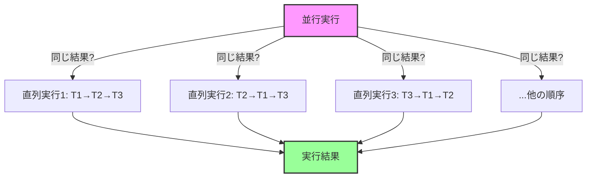
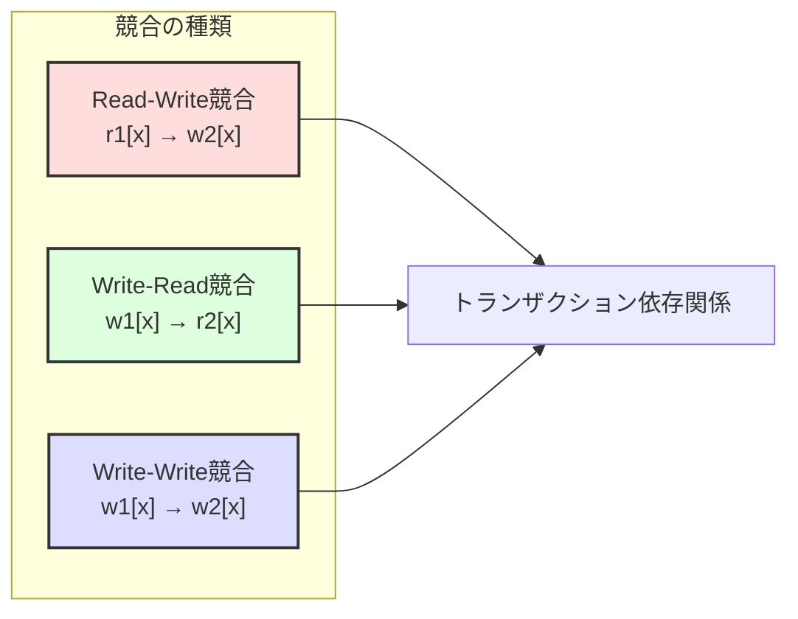
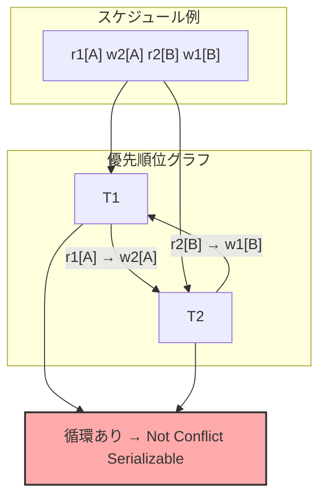
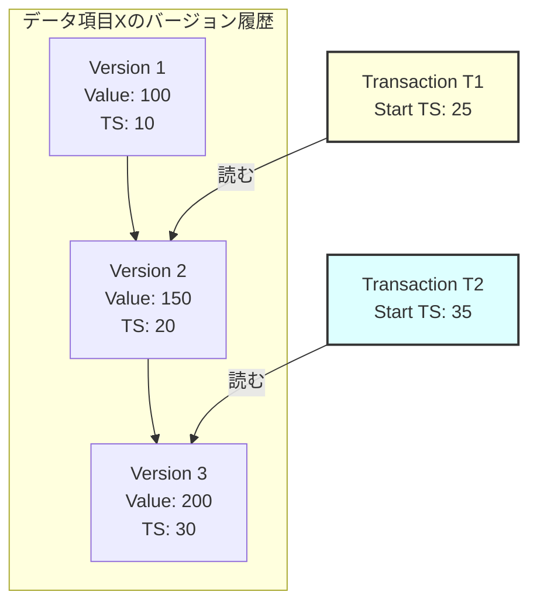
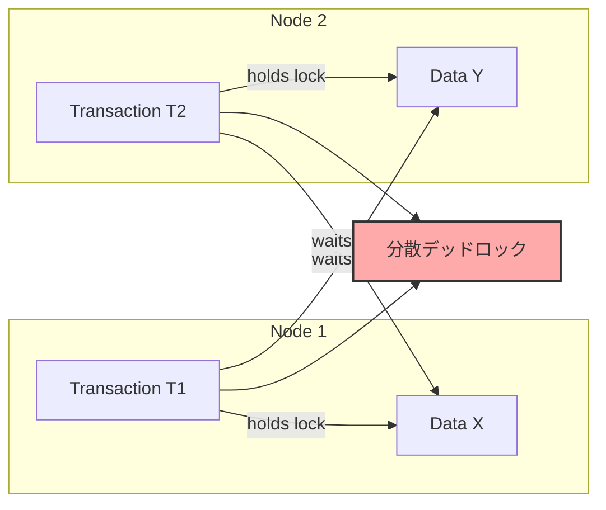
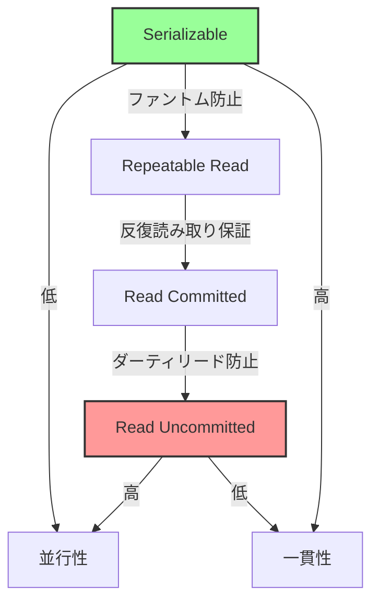

# Serializability

Serializabilityは、データベースシステムにおける並行性制御の正しさを定義する最も基本的な概念である。複数のトランザクションが同時に実行される環境において、その実行結果があたかもトランザクションを一つずつ順番に実行した場合と同じになることを保証する性質を指す。この概念は1970年代後半にEswaran、Gray、Lorie、Traversらによって形式化され[^1]、現代のデータベース理論の基礎となっている。

データベースシステムの存在意義の一つは、複数のユーザーやアプリケーションが同時にデータにアクセスできることにある。しかし、無秩序な並行アクセスは、データの不整合、更新の喪失、ダーティリードなど、様々な問題を引き起こす。Serializabilityは、これらの問題を防ぎながら並行性を実現するための理論的枠組みを提供する。

## 形式的定義と理論的基礎

トランザクションを、データベースに対する読み込み（Read）操作と書き込み（Write）操作の有限列として定義する。トランザクション$T_i$は、操作の列$o_{i1}, o_{i2}, ..., o_{in}$として表現される。ここで、各操作$o_{ij}$は$r_i[x]$（データ項目$x$の読み込み）または$w_i[x]$（データ項目$x$への書き込み）のいずれかである。

スケジュール$S$は、複数のトランザクションの操作を時系列に並べたものである。各トランザクション内の操作順序は保持されなければならない。つまり、トランザクション$T_i$において操作$o_{i1}$が$o_{i2}$より前に現れるなら、スケジュール$S$においても$o_{i1}$は$o_{i2}$より前に現れる必要がある。

スケジュール$S$がserializableであるとは、$S$と同じトランザクション集合を含む何らかの直列スケジュール$S'$が存在し、$S$と$S'$が同じ最終的なデータベース状態を生成することを意味する。この定義は一見単純だが、実際の判定は複雑である。なぜなら、データベースの初期状態や各書き込み操作の具体的な値によって結果が変わる可能性があるからだ。

## 競合と依存関係

Serializabilityの実用的な判定のため、操作間の競合（conflict）という概念が導入される。二つの操作$o_i$と$o_j$（異なるトランザクションに属する）が競合するのは、次の条件を満たす場合である：

1. 両方の操作が同じデータ項目にアクセスする
2. 少なくとも一方が書き込み操作である

競合には三つのタイプがある。読み書き競合（$r_i[x]$と$w_j[x]$）、書き読み競合（$w_i[x]$と$r_j[x]$）、書き書き競合（$w_i[x]$と$w_j[x]$）である。これらの競合関係は、トランザクション間の依存関係を生み出し、実行順序に制約を課す。

## Conflict SerializabilityとView Serializability

Serializabilityの判定には主に二つのアプローチがある。Conflict SerializabilityとView Serializabilityである。

Conflict Serializabilityは、競合する操作の順序に着目する。スケジュール$S$がconflict serializableであるとは、競合しない操作の順序を入れ替えることで、何らかの直列スケジュールに変換できることを意味する。この性質は、優先順位グラフ（precedence graph）または競合グラフ（conflict graph）を用いて判定できる。

優先順位グラフ$G = (V, E)$において、頂点集合$V$はトランザクションの集合、辺集合$E$は競合から導かれる優先順位関係を表す。トランザクション$T_i$の操作がトランザクション$T_j$の競合する操作より前に実行される場合、$T_i$から$T_j$への有向辺を追加する。スケジュールがconflict serializableであることと、対応する優先順位グラフが非循環（acyclic）であることは同値である[^2]。

View Serializabilityは、より一般的な概念である。二つのスケジュール$S$と$S'$がview equivalentであるとは、以下の条件を満たすことである：

1. 各データ項目について、最初に読むトランザクションが同じ
2. 各読み込み操作について、読む値を書いたトランザクションが同じ
3. 各データ項目について、最後に書くトランザクションが同じ

スケジュールがview serializableであるとは、何らかの直列スケジュールとview equivalentであることを意味する。すべてのconflict serializableなスケジュールはview serializableだが、逆は成り立たない。View serializabilityの判定はNP完全問題であることが知られている[^3]。

## 実装アプローチ：Two-Phase Locking

理論的なserializabilityの概念を実際のシステムで実現するため、様々な並行性制御プロトコルが開発されてきた。最も基本的かつ広く使われているのが、Two-Phase Locking（2PL）プロトコルである。

2PLプロトコルでは、各トランザクションの実行を二つのフェーズに分ける。成長フェーズ（growing phase）では、トランザクションは必要なロックを獲得することはできるが、解放することはできない。縮小フェーズ（shrinking phase）では、ロックを解放することはできるが、新たに獲得することはできない。この単純な規則により、すべての2PLスケジュールはconflict serializableであることが保証される。

```mermaid
gantt
    title Two-Phase Lockingの実行例
    dateFormat X
    axisFormat %s
    
    section Transaction T1
    Lock A     :t1_lock_a, 0, 2
    Lock B     :t1_lock_b, 2, 4
    Process    :t1_process, 4, 6
    Unlock B   :t1_unlock_b, 6, 7
    Unlock A   :t1_unlock_a, 7, 8
    
    section Transaction T2
    Wait for A :crit, t2_wait_a, 1, 7
    Lock A     :t2_lock_a, 7, 9
    Process    :t2_process, 9, 11
    Unlock A   :t2_unlock_a, 11, 12
    
    section Phase
    Growing    :milestone, 0, 0
    Shrinking  :milestone, 6, 0
```

基本的な2PLには、カスケード中止（cascading abort）の問題がある。トランザクションが中止された場合、そのトランザクションが書いた値を読んだ他のトランザクションも中止しなければならない可能性がある。この問題を解決するため、Strict 2PLやRigorous 2PLなどの変種が提案されている。

Strict 2PLでは、トランザクションはコミットまたは中止するまですべての排他ロック（書き込みロック）を保持する。これにより、他のトランザクションは未コミットのデータを読むことができなくなり、カスケード中止が防止される。現代の商用データベースシステムの多くは、Strict 2PLまたはその変種を採用している。

## Multi-Version Concurrency Control

ロックベースのアプローチの代替として、Multi-Version Concurrency Control（MVCC）がある。MVCCでは、データ項目の複数のバージョンを保持し、各トランザクションに適切なバージョンを提供することで、読み込み操作がブロックされることを防ぐ。

MVCCの基本的なアイデアは、書き込み操作が新しいバージョンを作成し、読み込み操作が適切な過去のバージョンを参照することである。各バージョンには、それを作成したトランザクションのタイムスタンプが付与される。トランザクション$T_i$がデータ項目$x$を読む際、$T_i$の開始時刻より前にコミットされた最新のバージョンを読む。

MVCCにおけるserializabilityの保証は、適切なバージョンの選択と書き込み競合の検出によって実現される。Snapshot Isolation（SI）は、MVCCの一般的な実装であり、各トランザクションが開始時点のデータベーススナップショットを見る。しかし、SIは完全なserializabilityを保証しない。Write Skew異常と呼ばれる問題が発生する可能性がある。

## 楽観的並行性制御

楽観的並行性制御（Optimistic Concurrency Control, OCC）は、競合が稀であるという前提に基づくアプローチである。トランザクションは実行中にロックを取得せず、コミット時に競合をチェックする。

OCCの実行は三つのフェーズに分かれる：

1. **読み込みフェーズ**：トランザクションはデータを読み込み、更新はプライベートなワークスペースで行う
2. **検証フェーズ**：他のトランザクションとの競合をチェックし、serializabilityが保たれるか確認する
3. **書き込みフェーズ**：検証に成功した場合、更新をデータベースに反映する

検証フェーズでは、並行して実行された他のトランザクションとの間で、読み書き集合の重なりをチェックする。Kung-Robinsonアルゴリズム[^4]は、代表的な検証手法である。トランザクション$T_i$の検証時、すでにコミットされたまたは検証中のトランザクション$T_j$に対して、以下の条件のいずれかが満たされることを確認する：

1. $T_j$が$T_i$の開始前に完了している
2. $T_j$の書き込み集合と$T_i$の読み込み集合が重ならず、$T_j$が$T_i$の書き込みフェーズ開始前に書き込みフェーズを完了している
3. $T_j$の書き込み集合が$T_i$の読み込み集合および書き込み集合と重ならない

## Serializability理論の拡張

基本的なserializability理論は、フラットなトランザクションモデルを前提としている。しかし、実際のアプリケーションでは、より複雑なトランザクション構造が必要となることがある。

ネストトランザクション（nested transaction）モデルでは、トランザクションが階層構造を持つ。親トランザクションは複数の子トランザクションを含み、子トランザクションの失敗は親トランザクション全体の失敗を必ずしも意味しない。このモデルでのserializabilityは、各レベルでの順序付けを考慮する必要がある。

長時間トランザクション（long-running transaction）やワークフローにおいては、厳密なserializabilityを維持することが現実的でない場合がある。このような場合、補償トランザクション（compensating transaction）やSagaパターン[^5]などの手法が用いられる。これらは、serializabilityを犠牲にして可用性を高めるアプローチである。

## 分散環境でのSerializability

分散データベースシステムにおけるserializabilityの実現は、単一ノードシステムよりもはるかに複雑である。データが複数のノードに分散している場合、グローバルなserializabilityを保証するためには、ノード間の調整が必要となる。

分散2PLでは、各ノードでローカルに2PLを実行するだけでなく、分散デッドロックの検出と解決が必要となる。デッドロック検出には、Wait-For Graph（WFG）の分散構築や、タイムアウトベースの手法が用いられる。

分散環境でのMVCCやOCCの実装では、グローバルなタイムスタンプの管理が課題となる。Google Spannerは、TrueTime APIを用いて、物理的に分散したノード間でもグローバルに一貫したタイムスタンプを提供し、external consistencyを実現している[^6]。

## 性能とSerializabilityのトレードオフ

完全なserializabilityの保証は、システムの並行性と性能に制約を課す。多くの実用システムでは、アプリケーションの要求に応じて、より弱い一貫性レベルを選択できるようになっている。

ANSI/ISO SQL標準では、以下の分離レベルが定義されている[^7]：

1. **Read Uncommitted**：最も弱い分離レベル。ダーティリードが許される
2. **Read Committed**：コミットされたデータのみを読む。しかし、反復不能読み取りが発生する可能性がある
3. **Repeatable Read**：同じデータを複数回読んでも同じ値が返される。しかし、ファントムリードが発生する可能性がある
4. **Serializable**：完全なserializabilityを保証する

実際のアプリケーション設計では、各トランザクションや操作の特性に応じて、適切な分離レベルを選択することが重要である。読み取り専用のレポート生成では低い分離レベルで十分かもしれないが、金融取引では最高レベルのserializabilityが必要となる。

## 実装における考慮事項

Serializabilityを実装する際には、理論的な正しさだけでなく、実用的な側面も考慮する必要がある。

**デッドロックの処理**：2PLベースのシステムでは、デッドロックは避けられない。デッドロック検出アルゴリズム（サイクル検出）、デッドロック防止（リソースの順序付け）、タイムアウトベースの解決など、様々な手法がある。選択は、システムの特性やワークロードに依存する。

**ロックの粒度**：データベース全体、テーブル、ページ、行、属性など、様々な粒度でロックを取得できる。細かい粒度は並行性を高めるが、ロック管理のオーバーヘッドが増大する。多くのシステムは、複数粒度ロック（multi-granularity locking）と意図ロック（intention lock）を組み合わせて使用する。

**インデックスとSerializability**：インデックス構造（B-treeなど）へのアクセスも、serializabilityの観点から管理する必要がある。インデックスノードへの頻繁なアクセスは、ホットスポットとなりやすい。ラッチ（短期間の物理的ロック）とロック（論理的ロック）を区別し、インデックス固有の並行性制御手法（B-linkツリーなど）が開発されている。

**リカバリとの統合**：トランザクション処理システムでは、serializabilityだけでなく、耐久性（durability）も保証する必要がある。Write-Ahead Logging（WAL）とロック管理の統合、リカバリ時のロック再取得など、複雑な相互作用を正しく実装する必要がある。

## 現代的なアプローチと研究動向

近年のハードウェアの進化とワークロードの変化により、serializabilityの実現手法も進化している。

**メモリ中心アーキテクチャ**：大容量メモリの普及により、データベース全体をメモリに保持することが可能になった。H-Store/VoltDBのような新世代システムは、単一スレッド実行とパーティショニングにより、ロックフリーでserializabilityを実現している[^8]。

**決定的データベース**：Calvin[^9]のようなシステムは、トランザクションの実行順序を事前に決定することで、分散環境でも効率的にserializabilityを保証する。すべてのレプリカが同じ順序でトランザクションを実行するため、調整のオーバーヘッドが削減される。

**ハードウェアトランザクショナルメモリ**：Intel TSXなどのハードウェアトランザクショナルメモリ（HTM）機能を活用し、楽観的実行とハードウェアレベルの競合検出を組み合わせるアプローチが研究されている。

**機械学習の活用**：ワークロードの特性を学習し、競合の可能性を予測することで、悲観的制御と楽観的制御を動的に切り替える手法が提案されている。トランザクションの実行履歴から、最適なロック粒度や分離レベルを自動的に選択するシステムも開発されている。

Serializabilityは、データベースシステムの正しさを保証する基礎的な概念として、今後も重要であり続ける。しかし、その実現方法は、ハードウェアの進化、アプリケーションの要求、分散システムの普及に伴って、継続的に進化していくことが予想される。理論的な基礎を理解した上で、実用的な実装技術を適切に選択し、応用することが、現代のデータベースエンジニアに求められている。

[^1]: Eswaran, K. P., Gray, J. N., Lorie, R. A., & Traiger, I. L. (1976). The notions of consistency and predicate locks in a database system. Communications of the ACM, 19(11), 624-633.

[^2]: Bernstein, P. A., Hadzilacos, V., & Goodman, N. (1987). Concurrency control and recovery in database systems. Addison-Wesley.

[^3]: Papadimitriou, C. H. (1979). The serializability of concurrent database updates. Journal of the ACM, 26(4), 631-653.

[^4]: Kung, H. T., & Robinson, J. T. (1981). On optimistic methods for concurrency control. ACM Transactions on Database Systems, 6(2), 213-226.

[^5]: Garcia-Molina, H., & Salem, K. (1987). Sagas. ACM SIGMOD Record, 16(3), 249-259.

[^6]: Corbett, J. C., Dean, J., Epstein, M., Fikes, A., Frost, C., Furman, J. J., ... & Woodford, M. (2013). Spanner: Google's globally distributed database. ACM Transactions on Computer Systems, 31(3), 1-22.

[^7]: Berenson, H., Bernstein, P., Gray, J., Melton, J., O'Neil, E., & O'Neil, P. (1995). A critique of ANSI SQL isolation levels. ACM SIGMOD Record, 24(2), 1-10.

[^8]: Kallman, R., Kimura, H., Natkins, J., Pavlo, A., Rasin, A., Zdonik, S., ... & Stonebraker, M. (2008). H-store: a high-performance, distributed main memory transaction processing system. Proceedings of the VLDB Endowment, 1(2), 1496-1499.

[^9]: Thomson, A., Diamond, T., Weng, S. C., Ren, K., Shao, P., & Abadi, D. J. (2012). Calvin: fast distributed transactions for partitioned database systems. Proceedings of the 2012 ACM SIGMOD International Conference on Management of Data, 1-12.