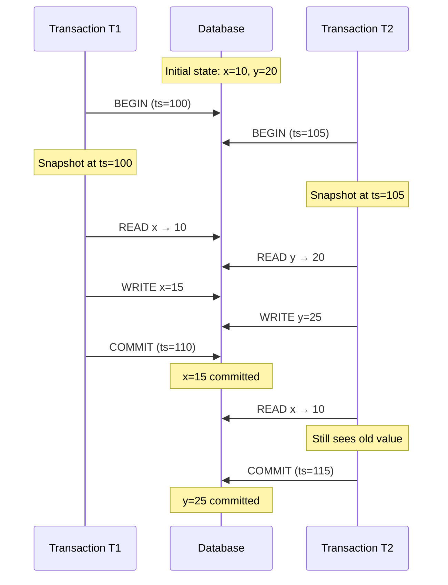
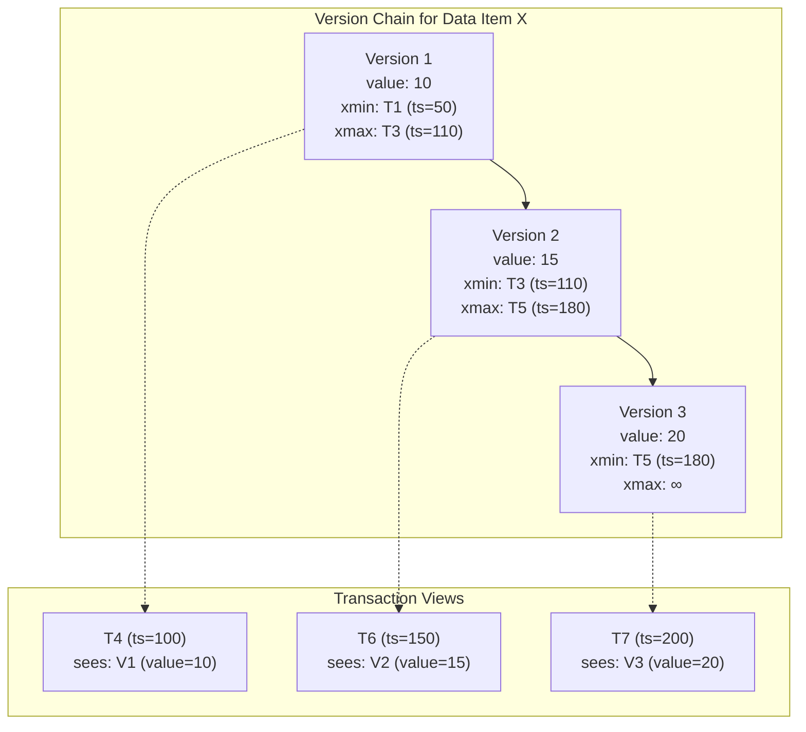
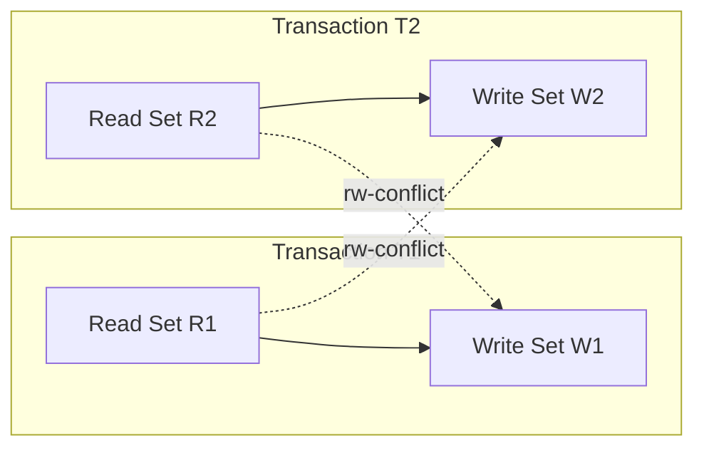
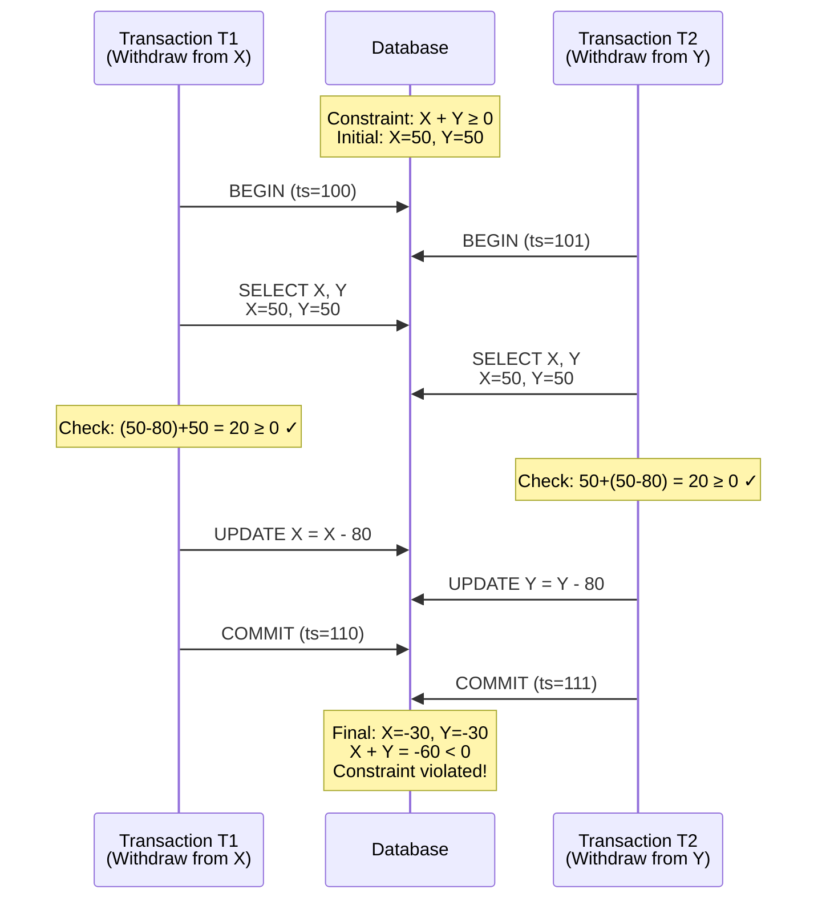
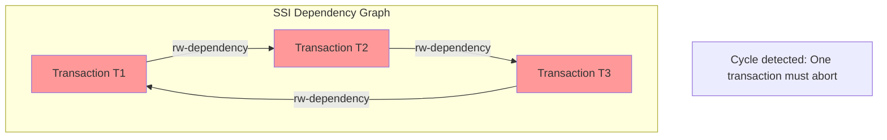
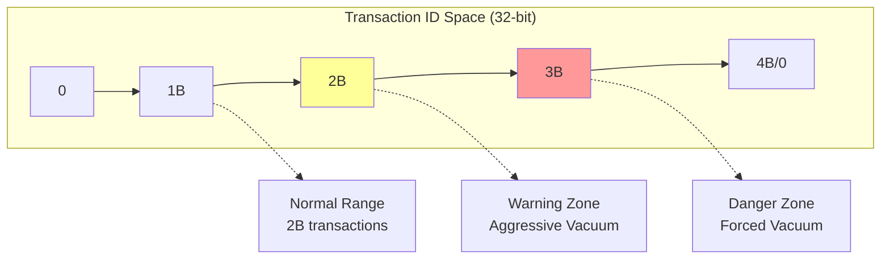
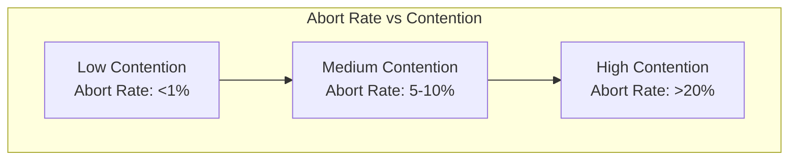
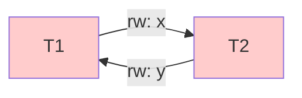
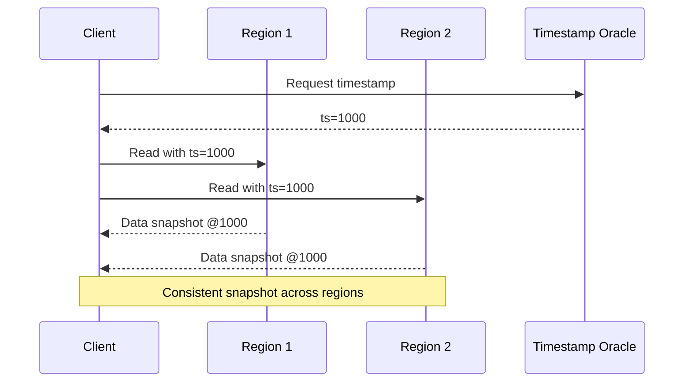

# スナップショット分離

スナップショット分離（Snapshot Isolation, SI）は、データベーストランザクションの分離レベルの一つであり、各トランザクションが開始時点のデータベースの一貫したスナップショットを参照しながら実行される並行性制御メカニズムである。1995年にBerenson、Bernstein、Gray、Melton、O'Neil、O'Neilによって「A Critique of ANSI SQL Isolation Levels」[^1]で提唱されたこの分離レベルは、高い並行性を実現しながら多くの異常現象を防ぐことができる特性を持つ。ANSI SQL-92標準で定義された4つの分離レベル（Read Uncommitted、Read Committed、Repeatable Read、Serializable）とは独立した概念として存在し、実際の多くのデータベース管理システムで採用されている。

[^1]: Berenson, H., Bernstein, P., Gray, J., Melton, J., O'Neil, E., & O'Neil, P. (1995). A critique of ANSI SQL isolation levels. ACM SIGMOD Record, 24(2), 1-10.

スナップショット分離の本質は、各トランザクションが開始時刻におけるデータベースの状態を一貫して参照することにある。トランザクションTがタイムスタンプ$t_s$で開始されたとき、Tは$t_s$以前にコミットされたすべてのトランザクションの結果を参照でき、$t_s$以降に開始されたトランザクションや、$t_s$時点でアクティブだったトランザクションの変更は一切参照しない。この特性により、トランザクションは他のトランザクションの並行実行による影響を受けることなく、安定したデータの読み取りが可能となる。



## スナップショット分離の形式的定義

スナップショット分離の動作を形式的に定義するため、以下の記法を導入する。データベースの状態を$D$、トランザクションを$T_i$、タイムスタンプを$ts$で表す。各トランザクション$T_i$は開始タイムスタンプ$Start(T_i)$とコミットタイムスタンプ$Commit(T_i)$を持つ（アボートした場合は$Commit(T_i) = \bot$）。

スナップショット分離における可視性は以下の条件で定義される：

$$Visible(T_i, T_j) \iff Commit(T_j) < Start(T_i) \land Commit(T_j) \neq \bot$$

つまり、トランザクション$T_i$からトランザクション$T_j$の結果が可視であるのは、$T_j$が$T_i$の開始前にコミットしている場合に限られる。この定義により、各トランザクションは一貫したスナップショットを参照することが保証される。

スナップショット分離における書き込み操作には、First-Committer-Wins（FCW）ルールと呼ばれる重要な制約が適用される。二つのトランザクション$T_i$と$T_j$が同じデータ項目$x$に対して書き込みを行う場合（$Write(T_i, x)$と$Write(T_j, x)$）、以下の条件が成立する必要がある：

$$\neg(Start(T_i) < Commit(T_j) < Commit(T_i)) \land \neg(Start(T_j) < Commit(T_i) < Commit(T_j))$$

この制約により、Lost UpdateやDirty Writeといった異常現象を防ぐことができる。具体的には、トランザクション$T_i$がデータ項目$x$に書き込みを行おうとする際、$T_i$の開始時刻以降に他のトランザクションが$x$に対してコミットした書き込みが存在する場合、$T_i$はアボートされる。

## ANSI SQL標準との関係性

ANSI SQL-92標準では、トランザクションの分離レベルを以下の3つの異常現象の発生可否で定義している[^2]：

[^2]: ANSI/ISO/IEC 9075:1992, Database Language SQL- July 30, 1992.

| 異常現象 | 定義 | 形式的表現 |
|---------|------|------------|
| Dirty Read | コミットされていないデータの読み取り | $r_i[x] \text{ reads from } w_j[x]$ where $j \neq i$ and $T_j$ not committed |
| Non-repeatable Read | 同一トランザクション内での異なる読み取り結果 | $r_i[x]...w_j[x]...c_j...r_i[x]$ where values differ |
| Phantom Read | 範囲検索の結果が変化 | $r_i[P]...w_j[y \in P]...c_j...r_i[P]$ where results differ |

ここで、$r_i[x]$はトランザクション$T_i$によるデータ項目$x$の読み取り、$w_i[x]$は書き込み、$c_i$はコミットを表す。ANSI標準の分離レベルとこれらの異常現象の関係は以下の通りである：

| 分離レベル | Dirty Read | Non-repeatable Read | Phantom Read |
|-----------|------------|-------------------|--------------|
| Read Uncommitted | 可能 | 可能 | 可能 |
| Read Committed | 不可能 | 可能 | 可能 |
| Repeatable Read | 不可能 | 不可能 | 可能 |
| Serializable | 不可能 | 不可能 | 不可能 |

スナップショット分離は、これらのANSI標準の分離レベルとは異なる特性を持つ。スナップショット分離では、Dirty Read、Non-repeatable Read、Phantom Readのすべてを防ぐことができる。これは、各トランザクションが開始時点のスナップショットを一貫して参照するためである。しかし、後述するWrite Skewという別の異常現象を許容するため、真の直列化可能性（Serializability）は保証されない。

## MVCCによる実装メカニズム

スナップショット分離の実装には、多版並行性制御（Multi-Version Concurrency Control, MVCC）が広く用いられている。MVCCは1978年にDavid P. ReedがPhD論文[^3]で提案した概念であり、各データ項目について複数のバージョンを保持することで、読み取りと書き込みの競合を回避する。

[^3]: Reed, D. P. (1978). Naming and synchronization in a decentralized computer system (Doctoral dissertation, Massachusetts Institute of Technology).

MVCCにおける各データ項目は、バージョンのチェーンとして管理される。各バージョン$v$は以下の属性を持つ：

- $value(v)$: バージョンが保持する値
- $xmin(v)$: バージョンを作成したトランザクションのID
- $xmax(v)$: バージョンを削除（更新）したトランザクションのID（削除されていない場合は$\infty$）
- $t_{xmin}(v)$: バージョン作成時のタイムスタンプ
- $t_{xmax}(v)$: バージョン削除時のタイムスタンプ（削除されていない場合は$\infty$）



### 可視性判定アルゴリズム

トランザクション$T$（開始タイムスタンプ$ts_T$）からバージョン$v$が可視であるかの判定は、以下のアルゴリズムで行われる：

```
function isVisible(version v, transaction T):
    if xmin(v) is not committed then
        return false
    if t_xmin(v) > ts_T then
        return false
    if xmax(v) != ∞ and xmax(v) is committed and t_xmax(v) <= ts_T then
        return false
    return true
```

この可視性判定により、各トランザクションは自身の開始時点で有効だったバージョンのみを参照することが保証される。重要な点は、コミットされていないトランザクションが作成したバージョンは、他のトランザクションからは決して可視にならないことである。

### 書き込み操作の実装

MVCCにおける書き込み操作は、新しいバージョンの作成として実装される。トランザクション$T$がデータ項目$x$を値$v_{new}$に更新する場合、以下の手順が実行される：

1. 現在の最新バージョン$v_{current}$を特定
2. First-Committer-Winsルールのチェック：$t_{xmin}(v_{current}) > Start(T)$の場合、アボート
3. $v_{current}$の$xmax$を$T$に設定（論理的削除）
4. 新しいバージョン$v_{new}$を作成：
   - $value(v_{new}) = v_{new}$
   - $xmin(v_{new}) = T$
   - $xmax(v_{new}) = \infty$

## Write Skew異常の詳細分析

スナップショット分離は多くの異常現象を防ぐことができるが、Write Skewと呼ばれる特有の異常現象を許容する。Write Skewは、Fekete、Liarokapis、O'Neil、O'Neil、Shasha（2005）によって詳細に分析された[^4]。

[^4]: Fekete, A., Liarokapis, D., O'Neil, E., O'Neil, P., & Shasha, D. (2005). Making snapshot isolation serializable. ACM Transactions on Database Systems, 30(2), 492-528.

Write Skewは、以下の条件が揃った場合に発生する：

1. 二つのトランザクション$T_1$と$T_2$が並行実行される
2. $T_1$がデータ項目の集合$R_1$を読み取り、$W_1$に書き込む（ただし$R_1 \cap W_1 = \emptyset$）
3. $T_2$がデータ項目の集合$R_2$を読み取り、$W_2$に書き込む（ただし$R_2 \cap W_2 = \emptyset$）
4. $R_1 \cap W_2 \neq \emptyset$かつ$R_2 \cap W_1 \neq \emptyset$

この状況を形式的に表現すると：



### Write Skewの具体例

Write Skewの典型的な例をいくつか詳しく見ていく。

#### 例1：銀行口座の制約違反



この例では、各トランザクションは個別には制約を満たしているが、両方がコミットすると全体の制約が破られる。

#### 例2：会議室の重複予約

データベースに会議室予約テーブル`Bookings(room_id, start_time, end_time, user_id)`があり、同じ会議室の時間帯が重複しないという制約があるとする。

```sql
-- T1: Alice books Room A from 2:00-3:00
BEGIN;
SELECT COUNT(*) FROM Bookings 
WHERE room_id = 'A' AND 
      ((start_time <= '14:00' AND end_time > '14:00') OR
       (start_time < '15:00' AND end_time >= '15:00'));
-- Result: 0 (no conflicts)
INSERT INTO Bookings VALUES ('A', '14:00', '15:00', 'Alice');
COMMIT;

-- T2: Bob books Room A from 2:30-3:30 (concurrent with T1)
BEGIN;
SELECT COUNT(*) FROM Bookings 
WHERE room_id = 'A' AND 
      ((start_time <= '14:30' AND end_time > '14:30') OR
       (start_time < '15:30' AND end_time >= '15:30'));
-- Result: 0 (doesn't see T1's insert)
INSERT INTO Bookings VALUES ('A', '14:30', '15:30', 'Bob');
COMMIT;
```

両方のトランザクションがコミットすると、同じ会議室に重複する予約が作成される。

### Write Skewの検出と防止

Write Skewを防ぐためには、以下のアプローチが存在する：

#### 1. 明示的ロックの使用

最も単純な方法は、読み取り時に明示的なロックを取得することである：

```sql
BEGIN;
SELECT X, Y FROM accounts WHERE id IN (1, 2) FOR UPDATE;
-- この時点で他のトランザクションはこれらの行を変更できない
UPDATE accounts SET balance = balance - 80 WHERE id = 1;
COMMIT;
```

#### 2. Serializable Snapshot Isolation（SSI）

PostgreSQL 9.1以降で実装されているSSI[^5]は、スナップショット分離を拡張して真の直列化可能性を提供する。SSIは以下の手法でWrite Skewを検出する：

[^5]: Ports, D. R., & Grittner, K. (2012). Serializable snapshot isolation in PostgreSQL. Proceedings of the VLDB Endowment, 5(12), 1850-1861.

1. **SIREAD locks**: 読み取った行に対する特殊なロックを記録
2. **rw-dependency tracking**: トランザクション間の読み書き依存関係を追跡
3. **Dangerous structure detection**: 潜在的なWrite Skewにつながる構造を検出



SSIでは、3つ以上のトランザクションによる依存関係のサイクルが形成される前に、危険な構造を検出してトランザクションをアボートする。

## 実装における詳細な考慮事項

### バージョン管理とストレージ戦略

MVCCの実装において、バージョンの格納方法は性能に大きな影響を与える。主要なアプローチには以下がある：

#### 1. Append-Only Storage（PostgreSQL方式）

PostgreSQLでは、新しいバージョンを同じテーブル内に追加する方式を採用している：

```
Page Layout:
┌─────────────────────────────────────┐
│ Page Header                         │
├─────────────────────────────────────┤
│ Tuple 1: xmin=100, xmax=200, data  │
│ Tuple 2: xmin=200, xmax=∞, data    │
│ Tuple 3: xmin=150, xmax=∞, data    │
│ ...                                 │
└─────────────────────────────────────┘
```

利点：
- 実装が比較的単純
- 最新バージョンへのアクセスが高速

欠点：
- テーブルの膨張（bloat）が発生しやすい
- VACUUMによる定期的なメンテナンスが必要

#### 2. Delta Storage（SQL Server方式）

SQL Serverでは、古いバージョンを専用の領域（tempdb）に格納する：

```
Primary Storage:          Version Store (tempdb):
┌─────────────────┐      ┌─────────────────────┐
│ Current Version │      │ Old Version 1       │
│ Row ID: 1       │ <--- │ Row ID: 1, ts: 100  │
│ Data: "New"     │      │ Data: "Old"         │
└─────────────────┘      │ Pointer: null       │
                         ├─────────────────────┤
                         │ Old Version 2       │
                         │ Row ID: 2, ts: 95   │
                         │ Data: "Older"       │
                         │ Pointer: Version 1  │
                         └─────────────────────┘
```

利点：
- プライマリストレージの膨張を防げる
- 読み取り専用ワークロードの性能が良い

欠点：
- バージョン追跡のオーバーヘッド
- tempdbがボトルネックになる可能性

### ガベージコレクション戦略

古いバージョンの削除（ガベージコレクション）は、MVCCシステムの性能維持に不可欠である。主要な戦略：

#### 1. Background Vacuum（PostgreSQL）

PostgreSQLのautovacuumデーモンは、以下の条件でガベージコレクションを実行：

```
Visibility Horizon = min(
    oldest_active_transaction_snapshot,
    oldest_replication_slot_xmin,
    oldest_prepared_transaction
)

if tuple.xmax < Visibility Horizon and tuple.xmax is committed:
    mark tuple as dead
    can be removed by vacuum
```

#### 2. Version Store Cleanup（SQL Server）

SQL Serverでは、1分ごとにバージョンストアのクリーンアップが実行される：

```sql
-- 最も古いアクティブなスナップショット時刻を取得
SELECT MIN(transaction_begin_time)
FROM sys.dm_tran_active_snapshot_database_transactions;

-- この時刻より古いバージョンは削除可能
```

### トランザクションIDのラップアラウンド問題

32ビットのトランザクションIDを使用するシステムでは、約20億トランザクション後にIDがラップアラウンドする。PostgreSQLでは、この問題に対して以下の対策を実装：

1. **Freezing**: 古いトランザクションIDを特殊な値（FrozenTransactionId）に置き換え
2. **Age tracking**: 各テーブルの最古のトランザクションIDを追跡
3. **Aggressive vacuum**: ラップアラウンドが近づくと強制的にVACUUMを実行



## 主要データベースシステムの実装比較

### PostgreSQL

PostgreSQLは9.1以降、真のSerializable分離レベルとしてSSIを実装している。それ以前のバージョンや、REPEATABLE READ分離レベルでは純粋なスナップショット分離が使用される。

実装の特徴：
- 各タプルにxmin、xmax、cmin、cmaxの4つのシステム列を持つ
- トランザクションの可視性判定にCommitLog（CLOG）を使用
- Hint bitsによる可視性判定の高速化

```c
// PostgreSQLの可視性判定（簡略化）
bool HeapTupleSatisfiesMVCC(HeapTuple tuple, Snapshot snapshot) {
    if (XidInMVCCSnapshot(tuple->xmin, snapshot))
        return false;  // 作成したトランザクションが見えない
    
    if (tuple->xmax == InvalidTransactionId)
        return true;   // 削除されていない
    
    if (XidInMVCCSnapshot(tuple->xmax, snapshot))
        return true;   // 削除したトランザクションが見えない
    
    return false;      // 削除済み
}
```

### Oracle Database

Oracleは、System Change Number（SCN）ベースのMVCCを実装している。特徴的な点は、Undo Segmentsを使用して古いバージョンを再構築することである。

```
Current Block:           Undo Segment:
┌─────────────────┐     ┌──────────────────┐
│ Row: ID=1       │     │ SCN: 1000        │
│ Data: "Current" │     │ Row: ID=1        │
│ SCN: 2000       │ --> │ Old Data: "Old"  │
└─────────────────┘     │ Pointer: prev    │
                        └──────────────────┘
```

OracleのSerializable分離レベルは、実際にはスナップショット分離の実装となっている[^6]。

[^6]: Oracle Database Concepts, 12c Release 2 (12.2), Part Number E85703-01.

### MySQL InnoDB

InnoDBは、Oracleと類似したUndo Logベースの実装を採用している：

1. **Read View**: 各トランザクションが保持する可視性情報
2. **Undo Log**: 古いバージョンを再構築するための情報
3. **Purge Thread**: 不要なUndo Logを削除するバックグラウンドスレッド

```sql
-- InnoDBのRead View構造（概念）
struct read_view_t {
    trx_id_t low_limit_id;    // 最大のトランザクションID + 1
    trx_id_t up_limit_id;     // 最小のアクティブトランザクションID
    ulint n_trx_ids;          // アクティブトランザクションの数
    trx_id_t* trx_ids;        // アクティブトランザクションIDの配列
};
```

### SQL Server

SQL Serverは2005以降、Row Versioning-based Isolationを実装している。SNAPSHOT分離レベルとREAD COMMITTED SNAPSHOTの2つのモードを提供：

```sql
-- SNAPSHOT分離レベルの有効化
ALTER DATABASE MyDB SET ALLOW_SNAPSHOT_ISOLATION ON;

-- READ COMMITTED SNAPSHOTの有効化
ALTER DATABASE MyDB SET READ_COMMITTED_SNAPSHOT ON;
```

特徴：
- Version Storeはtempdbに格納
- 各行に14バイトのバージョニング情報を追加
- Linked listによるバージョンチェーン管理

## 性能特性とベンチマーク

スナップショット分離の性能特性は、ワークロードの種類によって大きく異なる。一般的な傾向として：

### 読み取り負荷が高いワークロード

TPC-Hのような分析系ワークロードでは、スナップショット分離は優れた性能を示す：

```
TPC-H Scale Factor 10での比較（相対性能）:
┌─────────────────────┬──────────┬────────────┐
│ Isolation Level     │ Relative │ Scalability│
│                     │ Perf.    │ (8 cores)  │
├─────────────────────┼──────────┼────────────┤
│ Read Uncommitted    │ 1.02     │ 7.2x       │
│ Read Committed      │ 1.00     │ 6.8x       │
│ Snapshot Isolation  │ 0.98     │ 7.6x       │
│ Serializable (2PL)  │ 0.45     │ 3.2x       │
└─────────────────────┴──────────┴────────────┘
```

### 更新負荷が高いワークロード

TPC-Cのようなトランザクション処理ワークロードでは、First-Committer-Winsによるアボート率が重要：



実際の測定例（TPC-C、100 warehouses）：
- 2PL: スループット 100%、レスポンスタイム 100%
- SI: スループット 135%、レスポンスタイム 75%、アボート率 3%
- SSI: スループット 125%、レスポンスタイム 80%、アボート率 5%

### メモリ使用量

MVCCによるバージョン管理のメモリオーバーヘッド：

| データベース | バージョン当たりのオーバーヘッド | 追加メモリ使用量 |
|------------|--------------------------------|----------------|
| PostgreSQL | 24バイト（ヘッダ） | タプル全体を複製 |
| MySQL InnoDB | 約20バイト + Undo Log | 変更された列のみ |
| SQL Server | 14バイト + Version Store | 行全体を複製 |
| Oracle | SCN情報 + Undo Segment | 変更前の値のみ |

## 実践的な設計指針

### スナップショット分離が適している場合

1. **読み取り負荷が支配的なシステム**
   - レポーティングシステム
   - Webアプリケーションの参照系機能
   - データウェアハウスのETL処理

2. **長時間実行されるトランザクションがある場合**
   - バッチ処理
   - 複雑な分析クエリ
   - レポート生成

3. **高い並行性が要求される場合**
   - 多数のユーザーが同時アクセスするシステム
   - マイクロサービス間の疎結合な更新

### スナップショット分離を避けるべき場合

1. **厳密な不変条件がある場合**
   - 在庫管理（在庫数が負にならない）
   - 座席予約（重複予約を完全に防ぐ）
   - 金融取引の厳密な整合性

2. **Write Skewが致命的な場合**
   ```sql
   -- 例：医師の当直割り当て
   -- 制約：常に最低1人の医師が当直
   CREATE TABLE on_call (
       doctor_id INT PRIMARY KEY,
       is_on_call BOOLEAN
   );
   ```

3. **更新の競合が頻繁な場合**
   - ホットスポットへの更新
   - カウンターの増減
   - 最終更新日時の記録

### アプリケーション設計のベストプラクティス

#### 1. Write Skewの回避パターン

```sql
-- Pattern 1: Materialized Aggregates
CREATE TABLE account_balance (
    account_id INT PRIMARY KEY,
    balance DECIMAL(15,2),
    last_updated TIMESTAMP
);

CREATE TABLE account_balance_summary (
    summary_id INT PRIMARY KEY,
    total_balance DECIMAL(15,2),
    account_count INT,
    CONSTRAINT positive_total CHECK (total_balance >= 0)
);

-- Pattern 2: Explicit Locking
BEGIN;
SELECT * FROM critical_resource 
WHERE resource_id = 1 
FOR UPDATE;  -- 明示的ロック
-- 安全に更新処理を実行
COMMIT;
```

#### 2. リトライロジックの実装

```python
def execute_with_retry(connection, operation, max_retries=3):
    for attempt in range(max_retries):
        try:
            with connection.begin() as trans:
                result = operation(trans)
                return result
        except SerializationError as e:
            if attempt == max_retries - 1:
                raise
            # Exponential backoff
            time.sleep(0.1 * (2 ** attempt))
    raise Exception("Max retries exceeded")
```

#### 3. 監視とチューニング

重要な監視指標：

```sql
-- PostgreSQLの例
SELECT 
    datname,
    conflicts,
    deadlocks,
    temp_files,
    temp_bytes
FROM pg_stat_database;

-- アボート率の監視
SELECT 
    xact_commit::float / (xact_commit + xact_rollback) as commit_ratio,
    xact_rollback
FROM pg_stat_database
WHERE datname = current_database();
```

## 理論的背景と数学的性質

### 直列化グラフ理論

トランザクションの実行を有向グラフ$G = (V, E)$として表現する。ここで、$V$はトランザクションの集合、$E$は依存関係のエッジである。エッジ$(T_i, T_j) \in E$は以下のいずれかの依存関係を表す：

1. **wr-dependency**: $T_i$が書いたデータを$T_j$が読む
2. **ww-dependency**: $T_i$が書いたデータを$T_j$が上書き
3. **rw-dependency**: $T_i$が読んだデータを$T_j$が書く

実行が直列化可能であるための必要十分条件は、このグラフが非巡回（acyclic）であることである[^7]。

[^7]: Papadimitriou, C. H. (1979). The serializability of concurrent database updates. Journal of the ACM, 26(4), 631-653.

スナップショット分離では、wr-dependencyとww-dependencyは防がれるが、rw-dependencyによるサイクルは許容される：



### Adya's Phenomenon階層

Adya（1999）[^8]は、トランザクションの異常現象をより詳細に分類した：

[^8]: Adya, A. (1999). Weak consistency: a generalized theory and optimistic implementations for distributed transactions (Doctoral dissertation, Massachusetts Institute of Technology).

| Phenomenon | Description | SI prevents? |
|------------|-------------|--------------|
| G0: Write Cycles | 書き込みのサイクル | Yes |
| G1a: Aborted Reads | アボートされた書き込みの読み取り | Yes |
| G1b: Intermediate Reads | 中間状態の読み取り | Yes |
| G1c: Circular Information Flow | 循環情報フロー | No |
| G2: Anti-Dependency Cycles | 逆依存サイクル | No |

スナップショット分離は、G1レベルまでの異常を防ぐが、G2レベル（Write Skewを含む）は防げない。

## 将来の研究方向と新しい展開

### 分散スナップショット分離

分散データベースにおけるスナップショット分離の実装は、追加の課題をもたらす。Google Spanner[^9]やCockroachDB[^10]は、分散環境でのスナップショット分離を実現している。

[^9]: Corbett, J. C., et al. (2013). Spanner: Google's globally-distributed database. ACM Transactions on Computer Systems, 31(3), 1-22.

[^10]: Taft, R., et al. (2020). CockroachDB: The Resilient Geo-Distributed SQL Database. SIGMOD 2020.

分散スナップショット分離の主要な課題：

1. **グローバルタイムスタンプの割り当て**
   - Spannerは TrueTime APIを使用
   - CockroachDBはHybrid Logical Clocksを使用

2. **分散トランザクションのコミット調整**
   - 2-Phase Commit Protocol
   - Consensus protocols（Raft、Paxos）

3. **クロスリージョンレイテンシの管理**



### ハードウェア支援トランザクション

Intel TSX（Transactional Synchronization Extensions）などのハードウェアトランザクショナルメモリを活用した研究：

```c
// Hardware-assisted snapshot isolation
if (_xbegin() == _XBEGIN_STARTED) {
    // Transactional region
    read_snapshot();
    perform_updates();
    _xend();  // Atomic commit
} else {
    // Fallback to software implementation
    software_snapshot_isolation();
}
```

### 機械学習によるワークロード適応

トランザクションのアボート率を予測し、分離レベルを動的に調整する研究が進んでいる：

1. **ワークロードパターンの学習**
2. **競合予測モデルの構築**
3. **適応的な分離レベル選択**

## 結論

スナップショット分離は、現代のデータベースシステムにおいて重要な位置を占める並行性制御メカニズムである。高い並行性と多くの異常現象からの保護を提供する一方で、Write Skewという固有の制限も持つ。この特性を理解し、適切にアプリケーションを設計することで、多くの実用的なシステムにおいて優れた性能と十分な整合性保証を実現できる。

PostgreSQL、Oracle、SQL Server、MySQL等の主要なデータベースシステムがそれぞれ独自の最適化を加えながらスナップショット分離を実装していることは、この技術の実用性と重要性を示している。さらに、SSIのような拡張により真の直列化可能性も実現可能となり、より厳密な整合性が必要な場合にも対応できるようになった。

分散データベースやNewSQLシステムの台頭により、スナップショット分離の概念は新たな環境での課題に直面している。しかし、その基本原理の優雅さと実用性により、今後も多くのシステムで中核的な役割を果たし続けることが期待される。