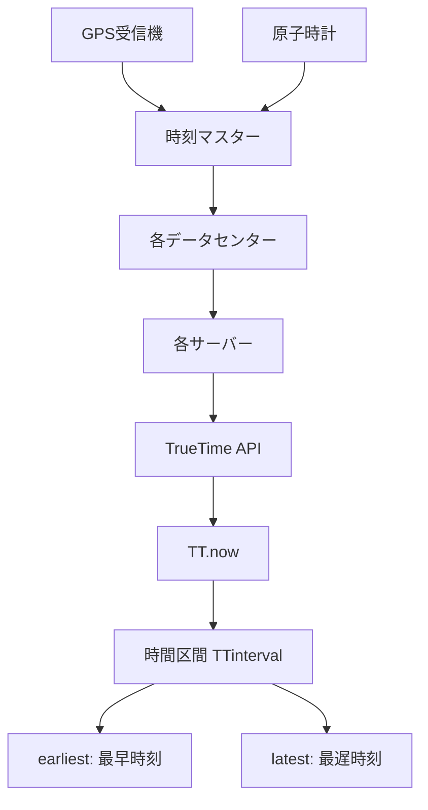
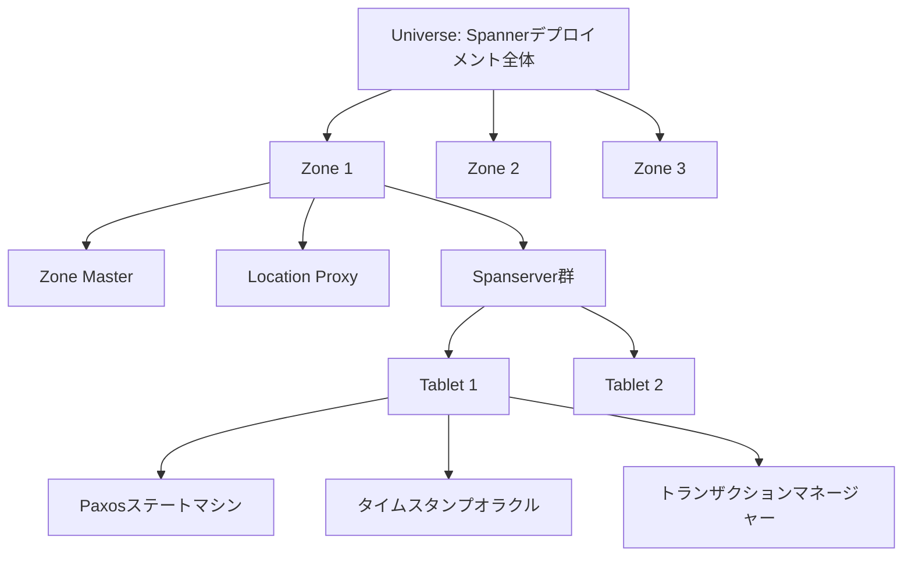
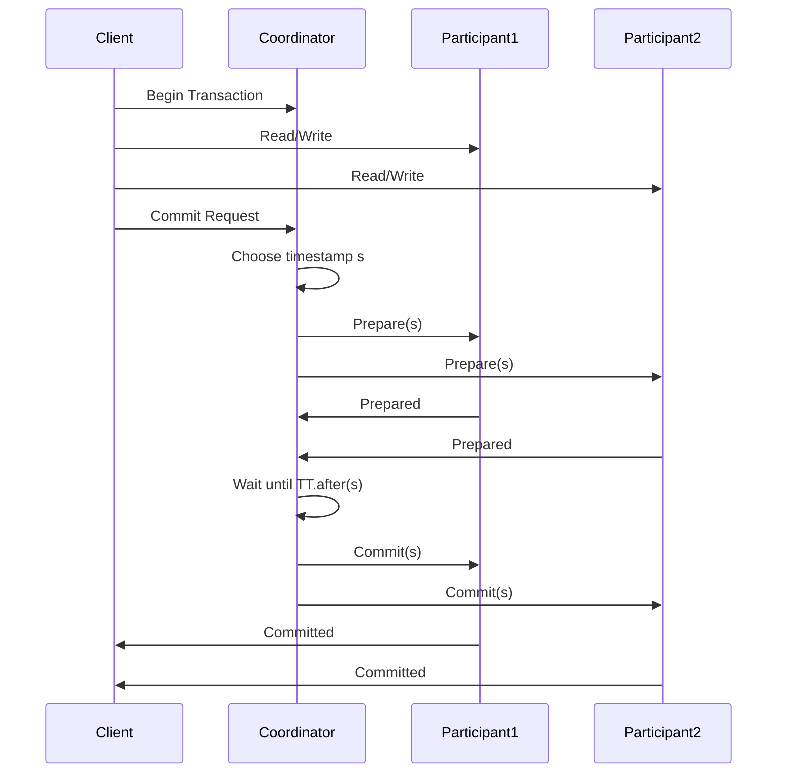

# Spanner

Google Spannerは、グローバルスケールでの強一貫性を実現する分散リレーショナルデータベースシステムである。2012年にGoogleが発表したこのシステムは[^1]、従来の分散データベースシステムでは困難とされていた、地理的に分散したデータセンター間での外部一貫性（external consistency）を保証しながら、高い可用性とスケーラビリティを実現している。

Spannerの革新性は、分散システムにおける一貫性とパフォーマンスのトレードオフに対する新たなアプローチにある。従来のNoSQLデータベースの多くは、CAP定理[^2]に基づいて一貫性を犠牲にすることで可用性とパーティション耐性を確保していた。一方、強一貫性を提供する従来のリレーショナルデータベースは、地理的な分散に対して限界があった。Spannerは、TrueTime APIという独自の時刻同期機構を導入することで、この根本的な制約を克服している。

## TrueTime: 分散システムにおける時刻の不確実性への対処

Spannerの中核技術であるTrueTimeは、分散システムにおける時刻同期の問題に対する画期的な解決策である。従来の分散システムでは、各ノードのクロックのずれ（clock skew）が一貫性保証の大きな障害となっていた。TrueTimeは、時刻を単一の値ではなく時間区間として扱うことで、この問題に対処している。

TrueTime APIは、現在時刻を`TTinterval`として返す。この区間は、真の時刻が確実に含まれる範囲を表している。つまり、真の時刻 $t_{abs}$ に対して、`TT.now().earliest ≤ t_{abs} ≤ TT.now().latest` が保証される。この不確実性の幅（ε = latest - earliest）は、通常のケースで約7ms以下に抑えられている[^3]。

TrueTimeの実装は、各データセンターに配置されたGPS受信機と原子時計を組み合わせた時刻マスターサーバー群に依存している。各サーバーは定期的に複数の時刻マスターに問い合わせを行い、Marzulloのアルゴリズム[^4]を用いて最も信頼性の高い時刻区間を計算する。この冗長性により、個々のコンポーネントの故障に対する耐性を確保している。

## アーキテクチャ: 階層的な分散システム設計

Spannerのアーキテクチャは、地理的に分散した複数のデータセンターにまたがる階層的な構造を持っている。システム全体は複数のゾーン（zone）から構成され、各ゾーンは物理的に近接したデータセンター内に配置される。この設計により、ゾーン間のレプリケーションによる耐障害性と、ゾーン内での低レイテンシ通信を両立している。

各ゾーンには、Zone Master、Location Proxy、そして多数のSpanserverが配置される。Zone Masterは、ゾーン内のSpanserverへのデータ割り当てを管理する。Location Proxyは、クライアントがデータの所在を特定するための位置情報サービスを提供する。実際のデータは、Spanserver上のタブレット（tablet）と呼ばれる単位で管理される。

各タブレットは、Paxosステートマシンレプリケーション[^5]を使用して、複数のレプリカ間で一貫性を保証する。通常、1つのタブレットは5つのレプリカを持ち、そのうち1つがリーダーとして選出される。リーダーレプリカは、そのタブレットに対するすべての書き込み操作を調整し、タイムスタンプの割り当てを行う。

## 分散トランザクションの実装

Spannerにおける分散トランザクションの実装は、2フェーズコミット（2PC）プロトコルとPaxosレプリケーションを組み合わせた洗練された設計となっている。単一のタブレットに限定されるトランザクションは、そのタブレットのPaxosグループ内で直接処理される。一方、複数のタブレットにまたがるトランザクションは、より複雑な調整が必要となる。

分散トランザクションでは、参加者の1つがコーディネーターとして選出される。コミット時、コーディネーターは全参加者に対してPrepareメッセージを送信し、各参加者はローカルでの準備が完了するとタイムスタンプの提案を返す。コーディネーターは、すべての提案の中から最大のタイムスタンプを選択し、これをトランザクションのコミットタイムスタンプとする。

重要な点は、コーディネーターがコミットタイムスタンプ $s$ を選択した後、`TT.after(s)` が真になるまで待機することである。これにより、タイムスタンプ $s$ が確実に過去の時刻となることを保証し、外部一貫性を実現している。この待機時間は、TrueTimeの不確実性の幅に依存するため、εを小さく保つことがパフォーマンスにとって重要となる。

## 一貫性モデル: 外部一貫性の保証

Spannerが提供する外部一貫性（external consistency）は、分散データベースシステムにおける最も強い一貫性保証である。これは、トランザクション $T_1$ がトランザクション $T_2$ の開始前にコミットした場合、$T_1$ のコミットタイムスタンプが $T_2$ のコミットタイムスタンプよりも小さいことを保証する。言い換えれば、トランザクションの実世界での順序関係が、タイムスタンプの順序に正確に反映される。

この保証を実現するために、Spannerは読み取り操作に対しても慎重な制御を行っている。スナップショット読み取りでは、指定されたタイムスタンプ $t$ において、すべてのトランザクションがコミット済みであることを確認する必要がある。これは、各レプリカが保持する「安全時刻（safe time）」を用いて実現される。

$$t_{safe} = \min(t_{safe}^{Paxos}, t_{safe}^{TM})$$

ここで、$t_{safe}^{Paxos}$ はPaxosステートマシンの安全時刻、$t_{safe}^{TM}$ はトランザクションマネージャーが管理する準備中のトランザクションに基づく安全時刻である。読み取り操作は、要求されたタイムスタンプが安全時刻を超えない場合にのみ実行される。

Spannerはまた、複数バージョン並行性制御（MVCC）を採用しており、各データ項目の複数のバージョンをタイムスタンプ付きで保持している。これにより、過去の任意の時点でのスナップショット読み取りが可能となり、長時間実行される分析クエリと短時間のトランザクション処理を効率的に共存させることができる。

## パフォーマンス特性と最適化

Spannerのパフォーマンス特性は、地理的な配置、レプリケーション構成、およびワークロードの特性に大きく依存する。読み取り専用トランザクションは、最も近いレプリカから直接データを読み取ることができるため、低レイテンシで処理可能である。一方、書き込みを含むトランザクションは、Paxosプロトコルによるレプリカ間の合意形成が必要となるため、より高いレイテンシが発生する。

レプリカの配置戦略は、パフォーマンスと可用性のバランスを決定する重要な要素である。Spannerでは、以下のような配置オプションを提供している：

地域内レプリケーション（Regional）では、すべてのレプリカが同一地域内に配置される。これにより、レプリカ間の通信レイテンシが最小化され、書き込みパフォーマンスが向上する。ただし、地域全体の障害に対する耐性は限定的となる。

大陸内レプリケーション（Continental）では、レプリカが同一大陸内の複数の地域に分散配置される。これにより、地域障害に対する耐性が向上するが、書き込みレイテンシは増加する。

グローバルレプリケーション（Global）では、レプリカが複数の大陸にまたがって配置される。最高レベルの可用性を提供するが、書き込みレイテンシは最も高くなる。

Spannerの実装では、様々な最適化技術が採用されている。Paxosリーダーリースにより、読み取り専用トランザクションをPaxosプロトコルを経由せずに処理できる。また、パイプライン化により、複数のPaxos操作を並行して処理し、スループットを向上させている。

## 実装の詳細: ストレージとインデックス

Spannerの最下層では、分散ファイルシステムであるColossus（GFSの後継）[^6]上にデータが永続化される。各タブレットのデータは、SSTables（Sorted String Tables）形式で保存され、定期的にコンパクションが実行される。この設計は、GoogleのBigtable[^7]から継承されたものであるが、Spannerではリレーショナルモデルをサポートするための拡張が加えられている。

インデックスの実装は、Spannerの分散環境における重要な課題の一つである。ローカルインデックスは、対応するベーステーブルと同じタブレット内に格納され、効率的な更新が可能である。一方、グローバルインデックスは独立したテーブルとして実装され、複数のタブレットにまたがって分散される。これにより、インデックスのスケーラビリティは確保されるが、ベーステーブルとインデックスの一貫性を保つために分散トランザクションが必要となる。

スキーマ変更操作も、Spannerの特徴的な機能の一つである。オンラインスキーマ変更は、サービスを停止することなく実行可能であり、これもTrueTimeを活用して実現されている。スキーマ変更は未来のタイムスタンプで予約され、すべてのノードが新しいスキーマを認識した後に有効化される。

Spannerの設計思想は、強一貫性を犠牲にすることなくグローバルスケールを実現するという、従来は不可能と考えられていた目標を達成している。TrueTimeという革新的な時刻同期機構を基盤として、分散トランザクション、外部一貫性、そして実用的なパフォーマンスを両立させたこのシステムは、分散データベースシステムの新たな可能性を示している。

[^1]: Corbett, J. C., et al. "Spanner: Google's globally distributed database." ACM Transactions on Computer Systems (TOCS) 31.3 (2013): 8.

[^2]: Brewer, E. "CAP twelve years later: How the "rules" have changed." Computer 45.2 (2012): 23-29.

[^3]: Google Cloud Spanner documentation: "TrueTime and external consistency" (2023)

[^4]: Marzullo, K. "Maintaining the time in a distributed system." Proceedings of the 2nd Annual ACM Symposium on Principles of Distributed Computing (1983): 295-305.

[^5]: Lamport, L. "Paxos made simple." ACM SIGACT News 32.4 (2001): 51-58.

[^6]: Google. "Colossus: Successor to the Google File System (GFS)" Internal documentation reference.

[^7]: Chang, F., et al. "Bigtable: A distributed storage system for structured data." ACM Transactions on Computer Systems (TOCS) 26.2 (2008): 1-26.