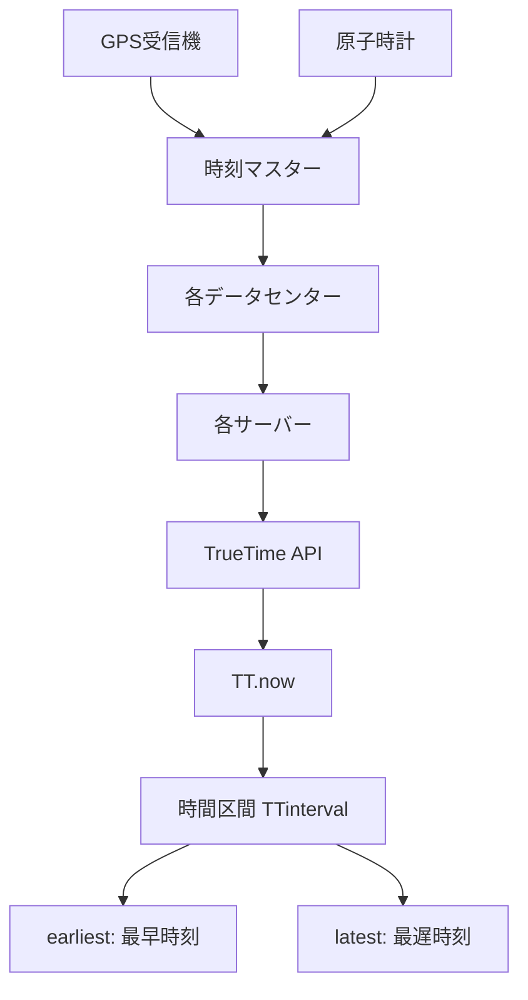
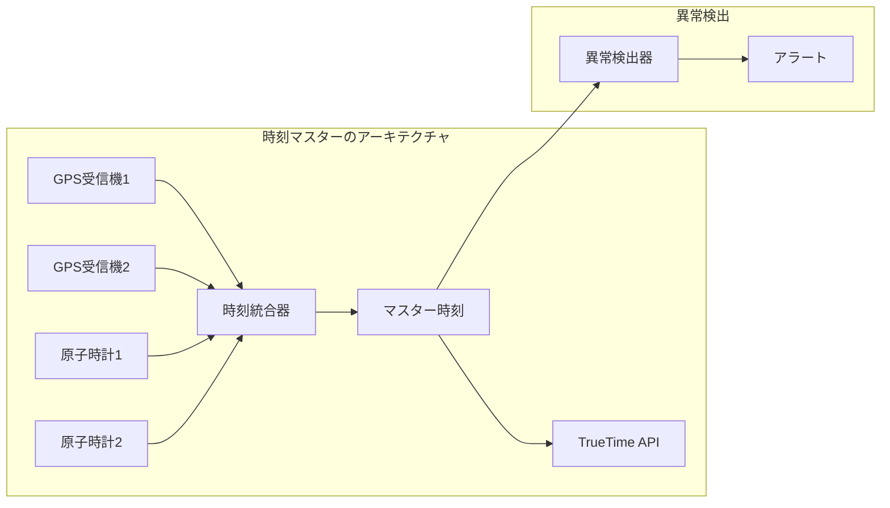
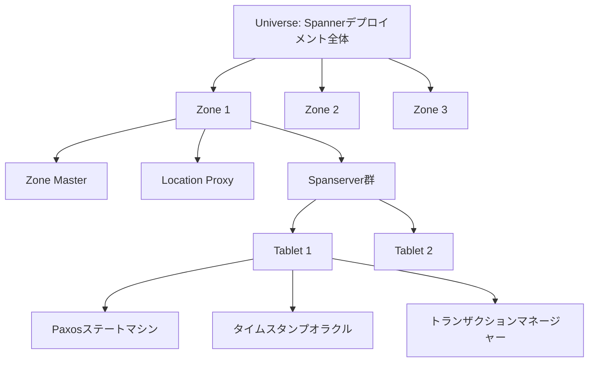
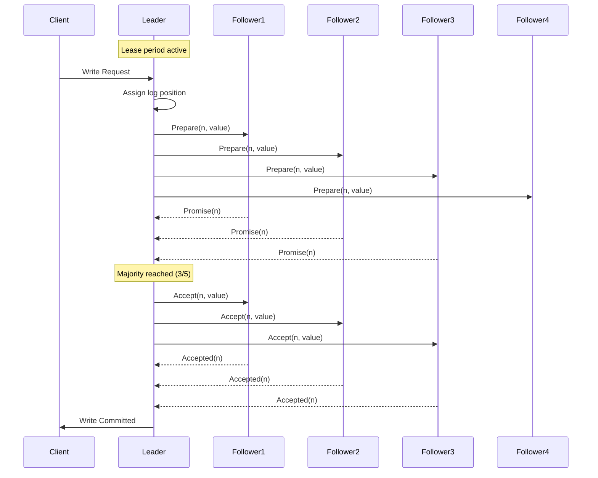
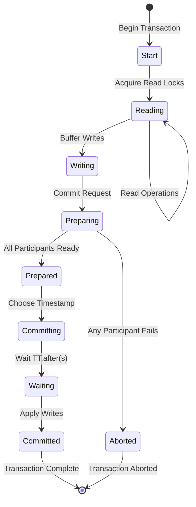
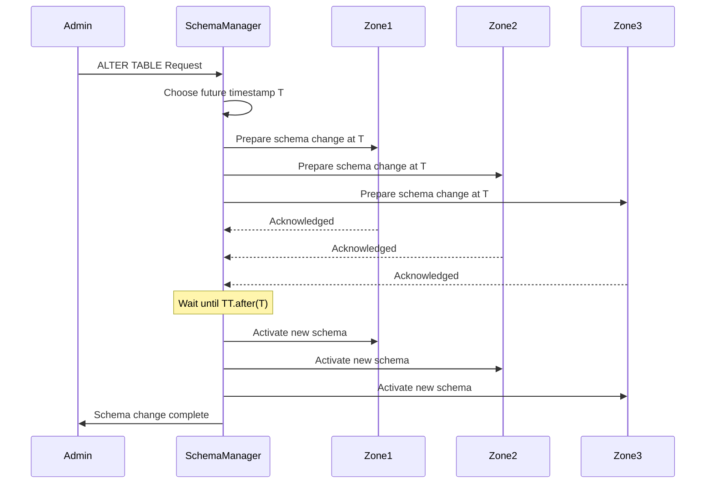
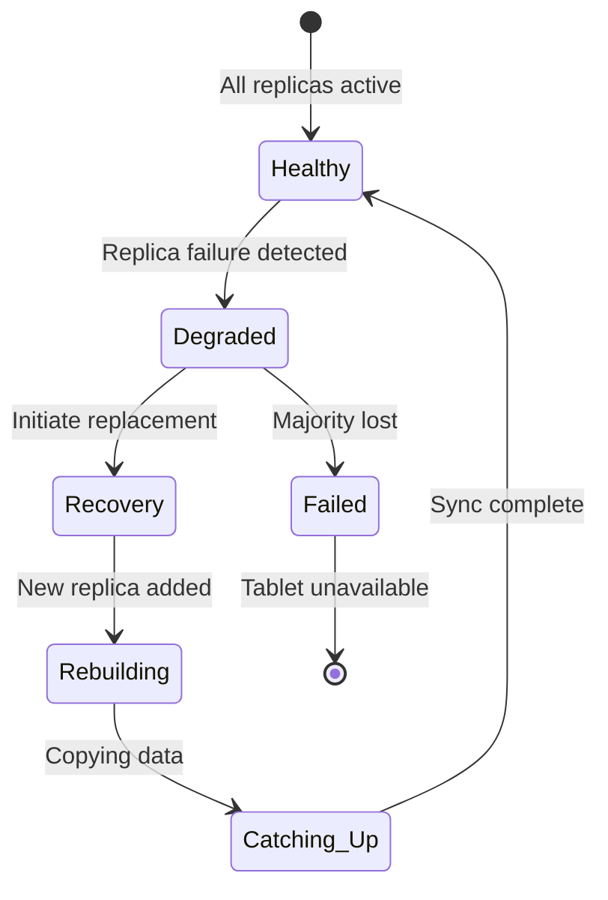

# Spanner

Google Spannerは、グローバルスケールでの強一貫性を実現する分散リレーショナルデータベースシステムである。2012年にGoogleが発表したこのシステムは[^1]、従来の分散データベースシステムでは困難とされていた、地理的に分散したデータセンター間での外部一貫性（external consistency）を保証しながら、高い可用性とスケーラビリティを実現している。

[^1]: Corbett, J. C., et al. "Spanner: Google's globally distributed database." ACM Transactions on Computer Systems (TOCS) 31.3 (2013): 8.

Spannerの革新性は、分散システムにおける一貫性とパフォーマンスのトレードオフに対する新たなアプローチにある。従来のNoSQLデータベースの多くは、CAP定理[^2]に基づいて一貫性を犠牲にすることで可用性とパーティション耐性を確保していた。一方、強一貫性を提供する従来のリレーショナルデータベースは、地理的な分散に対して限界があった。Spannerは、TrueTime APIという独自の時刻同期機構を導入することで、この根本的な制約を克服している。

[^2]: Brewer, E. "CAP twelve years later: How the "rules" have changed." Computer 45.2 (2012): 23-29.

## TrueTime: 分散システムにおける時刻の不確実性への対処

Spannerの中核技術であるTrueTimeは、分散システムにおける時刻同期の問題に対する画期的な解決策である。従来の分散システムでは、各ノードのクロックのずれ（clock skew）が一貫性保証の大きな障害となっていた。TrueTimeは、時刻を単一の値ではなく時間区間として扱うことで、この問題に対処している。



TrueTime APIは、現在時刻を`TTinterval`として返す。この区間は、真の時刻が確実に含まれる範囲を表している。つまり、真の時刻 $t_{abs}$ に対して、`TT.now().earliest ≤ t_{abs} ≤ TT.now().latest` が保証される。この不確実性の幅（ε = latest - earliest）は、通常のケースで約7ms以下に抑えられている[^3]。

[^3]: Google Cloud Spanner documentation: "TrueTime and external consistency" (2023)

### TrueTimeの数学的基盤

TrueTimeの時間区間モデルは、分散システムにおける相対論的効果を考慮した厳密な数学的基盤を持つ。各ノード $i$ における局所時刻 $L_i(t)$ と真の時刻 $t$ の関係は、クロックドリフト率 $\rho$ を用いて以下のように表現される：

$$|L_i(t) - t| \leq \epsilon_0 + \rho \cdot (t - t_0)$$

ここで、$\epsilon_0$ は初期同期時の誤差、$t_0$ は最後の同期時刻である。TrueTimeは、この誤差の上界を動的に追跡することで、任意の時点での時間区間を計算する。

時刻マスターサーバーとの同期プロトコルでは、ネットワーク遅延の非対称性を考慮する必要がある。クライアント $c$ がサーバー $s$ と同期する際、往復時間（Round Trip Time）を $RTT$ とすると、真の時刻オフセット $\theta$ の範囲は：

$$\theta \in \left[\frac{t_2 - t_3 - RTT}{2}, \frac{t_2 - t_3 + RTT}{2}\right]$$

ここで、$t_2$ はサーバーでの受信時刻、$t_3$ はサーバーでの送信時刻である。TrueTimeは複数の時刻マスターとの同期結果を統合し、Marzulloのアルゴリズム[^4]を拡張した手法で最も信頼性の高い区間を導出する。

[^4]: Marzullo, K. "Maintaining the time in a distributed system." Proceedings of the 2nd Annual ACM Symposium on Principles of Distributed Computing (1983): 295-305.

### ハードウェアレベルの実装詳細

TrueTimeの実装は、各データセンターに配置されたGPS受信機と原子時計を組み合わせた時刻マスターサーバー群に依存している。GPS信号は約50ナノ秒の精度で協定世界時（UTC）を提供するが、電波妨害や大気条件による影響を受けやすい。一方、原子時計（ルビジウム発振器）は短期的な安定性に優れるが、長期的にはドリフトが蓄積する。



時刻統合器は、各時刻源の信頼性を動的に評価する。GPSと原子時計の差分が閾値を超えた場合、そのソースは一時的に除外される。この冗長性により、個々のコンポーネントの故障に対する耐性を確保している。実装では、最低でも2つの独立したGPS受信機と2つの原子時計を使用し、過半数の合意が得られる時刻のみを採用する。

## アーキテクチャ: 階層的な分散システム設計

Spannerのアーキテクチャは、地理的に分散した複数のデータセンターにまたがる階層的な構造を持っている。システム全体は複数のゾーン（zone）から構成され、各ゾーンは物理的に近接したデータセンター内に配置される。この設計により、ゾーン間のレプリケーションによる耐障害性と、ゾーン内での低レイテンシ通信を両立している。



### Spanserverの内部構造

各Spanserverは、複数のタブレットを管理する複雑なコンポーネントである。タブレットは、キーレンジで分割されたデータの単位であり、それぞれが独立したPaxosグループを形成する。Spanserverの内部構造は以下の主要コンポーネントから構成される：

1. **Colossusファイルシステム層**: Google File System（GFS）の後継であるColossus[^5]上にデータを永続化する。各タブレットのデータは、B-tree構造のSSTables（Sorted String Tables）として保存される。

[^5]: Google. "Colossus: Successor to the Google File System (GFS)" Internal documentation reference.

2. **Paxosステートマシン**: 各タブレットは独立したPaxosグループを持ち、通常5つのレプリカで構成される。Paxosプロトコル[^6]により、レプリカ間でのログエントリの順序付けと永続化を保証する。

[^6]: Lamport, L. "Paxos made simple." ACM SIGACT News 32.4 (2001): 51-58.

3. **タブレットマネージャー**: タブレットの分割・結合、ロードバランシング、ガベージコレクションなどを管理する。

4. **タイムスタンプオラクル**: 各Paxosリーダーに配置され、単調増加するタイムスタンプを割り当てる。

5. **トランザクションマネージャー**: 分散トランザクションの2フェーズコミットを調整する。

### Paxosレプリケーションの詳細実装

Spannerにおける各タブレットのPaxos実装は、Multi-Paxosの変種を使用している。リーダーレプリカは、一定期間（デフォルトで10秒）のリースを保持し、この期間中は他のレプリカがリーダーになることを防ぐ。このリースメカニズムにより、読み取り専用操作をリーダーが単独で処理できる。



Paxosのログエントリは、以下の構造を持つ：

```
LogEntry {
    term: u64,              // Paxosターム番号
    index: u64,             // ログインデックス
    timestamp: Timestamp,    // Spannerタイムスタンプ
    operation: Operation,    // 実行する操作
    checksum: u32,          // データ整合性チェック
}
```

パイプライニング最適化により、複数のPaxos操作を並行して処理できる。リーダーは、前の操作の完了を待たずに次の操作のPrepareフェーズを開始し、スループットを大幅に向上させる。

## 分散トランザクションの詳細プロトコル

Spannerにおける分散トランザクションは、2フェーズコミット（2PC）とPaxosレプリケーション、そしてTrueTimeを巧妙に組み合わせることで実現されている。トランザクションは読み書きトランザクション（read-write transaction）、読み取り専用トランザクション（read-only transaction）、およびスナップショット読み取り（snapshot read）の3種類に分類される。

### 読み書きトランザクションの実行フロー

読み書きトランザクションは、最も複雑な処理パスを辿る。クライアントは最初に読み取りフェーズを実行し、その後書き込みをバッファリングして、最後にコミットを要求する。



コミットプロトコルの詳細な手順は以下の通り：

1. **Prepareフェーズ**: コーディネーターは全参加者にPrepareメッセージを送信する。各参加者は以下を実行：
   - ローカルでのwrite lockの取得
   - Paxosグループ内でのPrepareログの永続化
   - タイムスタンプの提案（その参加者が割り当て可能な最小のタイムスタンプ）

2. **タイムスタンプ選択**: コーディネーターは全参加者からの提案の最大値を選択し、これをコミットタイムスタンプ $s$ とする：
   $$s = \max_{i \in participants}\{s_i^{propose}\}$$

3. **コミット待機**: コーディネーターは`TT.after(s)`が真になるまで待機する。この待機により、タイムスタンプ $s$ が確実に過去の時刻となることを保証する。

4. **Commitフェーズ**: コーディネーターは全参加者にCommitメッセージを送信し、各参加者はコミットログを永続化して書き込みを適用する。

### 読み取り専用トランザクションの最適化

読み取り専用トランザクションは、ロックを取得せず、2PCプロトコルも不要である。代わりに、適切なタイムスタンプを選択してスナップショット読み取りを実行する。

```
function executeReadOnlyTransaction(operations):
    // タイムスタンプの選択
    sread = TT.now().latest
    
    // 全ての読み取り操作を実行
    for op in operations:
        tablet = locateTablet(op.key)
        replica = chooseNearestReplica(tablet)
        
        // レプリカの安全時刻まで待機
        waitUntil(replica.safeTime >= sread)
        
        // スナップショット読み取り
        result = replica.readAtTimestamp(op.key, sread)
        yield result
```

各レプリカは「安全時刻（safe time）」を維持する。これは、そのタイムスタンプ以前のすべての書き込みが適用済みであることを保証する時刻である：

$$t_{safe} = \min\{t_{safe}^{Paxos}, \min_{prepared}\{t_i^{prepare}\}\}$$

ここで、$t_{safe}^{Paxos}$ は最後に適用されたPaxosログエントリのタイムスタンプ、$t_i^{prepare}$ は準備済みだがまだコミットされていないトランザクションのタイムスタンプである。

### 外部一貫性の数学的証明

Spannerが提供する外部一貫性は、以下の性質として形式化できる：

**定義（外部一貫性）**: トランザクション $T_1$ がトランザクション $T_2$ の開始前にコミットを完了した場合、$T_1$ のコミットタイムスタンプは $T_2$ のコミットタイムスタンプよりも小さくなければならない。

$$\forall T_1, T_2: t_{commit}^{real}(T_1) < t_{start}^{real}(T_2) \Rightarrow s(T_1) < s(T_2)$$

この性質は、TrueTimeの保証とコミット待機ルールから導かれる。証明の概略：

1. $T_1$ のコミット時、コーディネーターは $s_1$ を選択し、`TT.after(s_1)`まで待機
2. 待機完了時、真の時刻 $t_{abs} > s_1$ が保証される
3. $T_2$ の開始時、$s_2 \geq TT.now().latest > t_{abs} > s_1$
4. したがって、$s_1 < s_2$ が成立

## スキーマとデータモデルの実装

Spannerは、従来のNoSQLシステムとは異なり、完全なリレーショナルモデルとSQLサポートを提供する。データモデルは階層的なテーブル構造を特徴とし、親子関係を持つテーブル間でのコロケーションを可能にする。

### 階層スキーマとインターリーブ

Spannerの特徴的な機能の一つが、テーブルのインターリーブ（interleaving）である。子テーブルの行を親テーブルの対応する行と物理的に近接して配置することで、結合操作の効率を大幅に向上させる。

```sql
CREATE TABLE Users (
    UserId INT64 NOT NULL,
    Username STRING(MAX),
    Email STRING(MAX),
) PRIMARY KEY (UserId);

CREATE TABLE Photos (
    UserId INT64 NOT NULL,
    PhotoId INT64 NOT NULL,
    Caption STRING(MAX),
    Timestamp TIMESTAMP,
) PRIMARY KEY (UserId, PhotoId),
  INTERLEAVE IN PARENT Users ON DELETE CASCADE;
```

このスキーマでは、特定のユーザーのすべての写真が、そのユーザーの行と同じタブレットに格納される。物理的なレイアウトは以下のようになる：

```
Tablet Layout:
┌─────────────────────────────────────────┐
│ Key: Users(1)                           │
│ Data: {Username: "Alice", ...}          │
├─────────────────────────────────────────┤
│ Key: Photos(1, 1001)                    │
│ Data: {Caption: "Sunset", ...}          │
├─────────────────────────────────────────┤
│ Key: Photos(1, 1002)                    │
│ Data: {Caption: "Beach", ...}           │
├─────────────────────────────────────────┤
│ Key: Users(2)                           │
│ Data: {Username: "Bob", ...}            │
├─────────────────────────────────────────┤
│ Key: Photos(2, 2001)                    │
│ Data: {Caption: "Mountain", ...}        │
└─────────────────────────────────────────┘
```

### セカンダリインデックスの実装

Spannerは、ローカルインデックスとグローバルインデックスの両方をサポートする。それぞれの実装には異なるトレードオフが存在する。

**ローカルインデックス**は、インデックスエントリが対応するベーステーブルの行と同じタブレットに格納される：

```sql
CREATE INDEX PhotosByTimestamp 
ON Photos(UserId, Timestamp) 
STORING (Caption);
```

**グローバルインデックス**は、独立したテーブルとして実装され、複数のタブレットにまたがって分散される：

```sql
CREATE INDEX PhotosByCaption 
ON Photos(Caption);
```

グローバルインデックスの更新は、ベーステーブルとインデックステーブル間の分散トランザクションを必要とする。これにより書き込みレイテンシは増加するが、範囲スキャンの効率は大幅に向上する。

### オンラインスキーマ変更

Spannerは、サービスを停止することなくスキーマ変更を実行できる。この機能は、TrueTimeを活用した独創的なプロトコルで実現されている：



スキーマ変更は未来のタイムスタンプで予約され、すべてのノードが新しいスキーマを認識した後に有効化される。この方式により、移行期間中も一貫性が保たれる。

## パフォーマンス特性と最適化技術

Spannerの性能は、ワークロードの特性、データの地理的配置、レプリケーション構成など、多くの要因に依存する。実運用環境での測定結果と最適化技術について詳しく見ていく。

### レイテンシ特性の詳細分析

Spannerのレイテンシは、操作の種類と地理的な配置によって大きく異なる：

**単一リージョン内での操作レイテンシ（ミリ秒）**：
| 操作種別 | 中央値 | 99パーセンタイル |
|---------|--------|-----------------|
| 読み取り（リーダーから） | 1.5 | 5 |
| 読み取り（フォロワーから） | 2.0 | 7 |
| 単一行書き込み | 8 | 25 |
| バッチ書き込み（10行） | 10 | 30 |
| 読み書きトランザクション | 15 | 50 |

**マルチリージョンでの操作レイテンシ（ミリ秒）**：
| 構成 | 読み取り | 書き込み | 備考 |
|------|---------|----------|------|
| 3リージョン（同一大陸） | 2 | 50-100 | Paxosクォーラムが必要 |
| 5リージョン（グローバル） | 2 | 100-250 | 過半数の合意が必要 |

### パイプライニングとバッチング最適化

Spannerは、複数の最適化技術を組み合わせてスループットを向上させている：

1. **Paxosパイプライニング**: リーダーは複数のログエントリを並行して処理する。各エントリは独立してPaxosプロトコルを進行し、ネットワークラウンドトリップの影響を最小化する。

```
Pipeline Execution:
Time →
Op1: [Prepare]-->[Promise]-->[Accept]-->[Accepted]
Op2:     [Prepare]-->[Promise]-->[Accept]-->[Accepted]
Op3:         [Prepare]-->[Promise]-->[Accept]-->[Accepted]
```

2. **バッチコミット**: 複数の独立したトランザクションを単一のPaxosラウンドでコミットする。これにより、ログエントリ数とネットワークオーバーヘッドを削減する。

3. **並列読み取り**: 読み取り専用トランザクションは、複数のタブレットから並列にデータを取得する。各読み取りは最も近いレプリカから実行される。

### ロードバランシングとタブレット分割

Spannerは、負荷に応じて自動的にタブレットを分割・結合する。分割の決定は以下の指標に基づく：

- **サイズベース**: タブレットが閾値（デフォルト1GB）を超えた場合
- **負荷ベース**: QPS（Queries Per Second）が閾値を超えた場合
- **ホットキー検出**: 特定のキー範囲へのアクセスが集中した場合

```mermaid
graph TD
    subgraph "分割前"
        T1[Tablet: [A-Z]<br/>Size: 1.5GB<br/>QPS: 10000]
    end
    
    subgraph "分割後"
        T2[Tablet: [A-M]<br/>Size: 0.8GB<br/>QPS: 6000]
        T3[Tablet: [N-Z]<br/>Size: 0.7GB<br/>QPS: 4000]
    end
    
    T1 -->|Split at 'M'| T2
    T1 -->|Split at 'M'| T3
```

### クエリ最適化とコスト推定

Spannerのクエリオプティマイザは、分散環境特有の考慮事項を含む高度なコスト推定を行う：

1. **データローカリティ**: インターリーブされたテーブルへのアクセスは、ネットワークI/Oを削減する
2. **レプリカ選択**: 読み取り操作は、最も近いレプリカから実行される
3. **並列実行**: 大規模なスキャンは複数のタブレットで並列実行される

```sql
-- 最適化される結合クエリの例
SELECT u.Username, COUNT(p.PhotoId) as PhotoCount
FROM Users u
JOIN Photos p ON u.UserId = p.UserId
WHERE u.Email LIKE '%@example.com'
GROUP BY u.Username;

-- 実行計画
Distributed Union
  └─ Parallel Scan on Users
       └─ Filter: Email LIKE '%@example.com'
       └─ Nested Loop Join
            └─ Index Scan on Photos (interleaved)
```

## 障害処理とリカバリメカニズム

Spannerは、様々なレベルでの障害に対する包括的な対処メカニズムを実装している。これらのメカニズムは、データの永続性と可用性を保証する上で重要な役割を果たす。

### レプリカ障害の処理

Paxosプロトコルにより、過半数のレプリカが稼働している限り、個別のレプリカ障害はシステムの可用性に影響しない。障害検出と処理のフローは以下の通り：



レプリカの再構築プロセスでは、以下の最適化が適用される：

1. **並列データ転送**: 複数の健全なレプリカから並列にデータをコピー
2. **増分同期**: Paxosログの適用により、ベースラインコピー後の差分を同期
3. **優先度制御**: ユーザートラフィックへの影響を最小化するための帯域制限

### ゾーン障害とフェイルオーバー

ゾーン全体の障害（データセンターの停電など）に対しても、Spannerは自動的にフェイルオーバーを実行する。Multi-Paxosのリーダー選出メカニズムにより、新しいリーダーが選出され、サービスが継続される。

```
Zone Failure Scenario:
Initial: Zone1(Leader), Zone2(Follower), Zone3(Follower), Zone4(Follower), Zone5(Follower)
Failure: Zone1 down
Election: Zone3 becomes new leader (highest priority among remaining)
Result: Service continues with 4/5 replicas
```

### データ破損の検出と修復

Spannerは、複数のレベルでデータ整合性を検証する：

1. **チェックサム検証**: すべてのSSTableブロックにCRC32Cチェックサムを付与
2. **レプリカ間比較**: 定期的にレプリカ間でデータのハッシュを比較
3. **Paxosログ検証**: ログエントリの連続性と整合性を確認

データ破損が検出された場合、影響を受けたレプリカは自動的に隔離され、健全なレプリカからデータが再構築される。

## 実運用での考慮事項

### コスト最適化戦略

Spannerの運用コストは、主に以下の要因に依存する：

1. **ノード数**: 各ノードは1000 processing unitsに相当
2. **ストレージ容量**: SSDストレージの使用量
3. **ネットワーク転送**: 特にリージョン間のレプリケーション

コスト最適化のベストプラクティス：

```yaml
# 最適なレプリケーション構成の例
production_config:
  # 高可用性が必要な場合
  critical_data:
    replicas: 5
    regions: [us-central1, us-east1, europe-west1, asia-northeast1, australia-southeast1]
  
  # コストを抑えたい場合
  less_critical_data:
    replicas: 3
    regions: [us-central1, us-east1, us-west1]
  
  # 開発環境
  development:
    replicas: 3
    regions: [us-central1]  # 単一リージョン
```

### 監視とトラブルシューティング

Spannerの健全性を監視するための主要なメトリクス：

1. **レイテンシメトリクス**
   - `spanner.googleapis.com/api/request_latencies`: API呼び出しのレイテンシ
   - `spanner.googleapis.com/instance/cpu/utilization`: CPU使用率

2. **スループットメトリクス**
   - `spanner.googleapis.com/instance/transaction/commit_attempt_count`: コミット試行回数
   - `spanner.googleapis.com/instance/transaction/abort_count`: アボート回数

3. **リソース使用状況**
   - `spanner.googleapis.com/instance/storage/used_bytes`: ストレージ使用量
   - `spanner.googleapis.com/instance/node_count`: アクティブノード数

### セキュリティ考慮事項

Spannerは、エンタープライズグレードのセキュリティ機能を提供する：

1. **保存時の暗号化**: Google管理の暗号化キー（デフォルト）またはCustomer-Managed Encryption Keys (CMEK)
2. **転送時の暗号化**: すべての通信はTLS 1.2以上で保護
3. **アクセス制御**: Cloud IAMによる細粒度の権限管理
4. **監査ログ**: すべての管理操作とデータアクセスの記録

## 理論的基盤と関連研究

Spannerの設計は、分散システム理論の多くの研究成果に基づいている。特に重要な理論的貢献について詳しく見ていく。

### 線形化可能性とその実現

Spannerが提供する外部一貫性は、Herlihy and Wing (1990)[^7]が定義した線形化可能性（linearizability）の実装である。線形化可能性は、並行オブジェクトの正確性の最も強い条件の一つである。

[^7]: Herlihy, M. P., & Wing, J. M. (1990). Linearizability: A correctness condition for concurrent objects. ACM TOPLAS, 12(3), 463-492.

形式的には、実行履歴 $H$ が線形化可能であるとは、以下の条件を満たす逐次履歴 $S$ が存在することである：

1. $H$ と $S$ は同じ操作を含む
2. $S$ は仕様を満たす
3. $H$ における実時間順序が $S$ でも保持される

Spannerは、TrueTimeとコミット待機ルールにより、この性質を分散環境で実現している。

### 分散システムにおける時間の扱い

Lamport (1978)[^8]の論理時計は、分散システムにおける事象の順序付けの基礎を提供したが、実時間との対応は保証しない。一方、Vector Clock（Fidge, 1988; Mattern, 1989）は因果関係を正確に捉えるが、実時間の順序は反映しない。

[^8]: Lamport, L. (1978). Time, clocks, and the ordering of events in a distributed system. Communications of the ACM, 21(7), 558-565.

Spannerの革新は、物理時計の不確実性を明示的にモデル化し、これを一貫性プロトコルに組み込んだ点にある。これにより、論理時計では不可能だった真の外部一貫性を実現している。

### CAP定理を超えて

Spannerは、一見するとCAP定理[^9]に反するように見える。しかし、実際にはネットワーク分断時には可用性を犠牲にして一貫性を選択している（CP システム）。Spannerの貢献は、実用的な環境でこのトレードオフを最適化したことにある：

[^9]: Gilbert, S., & Lynch, N. (2002). Brewer's conjecture and the feasibility of consistent, available, partition-tolerant web services. ACM SIGACT News, 33(2), 51-59.

1. **部分的可用性**: 過半数のレプリカが通信可能な限り、サービスを継続
2. **地理的冗長性**: 複数地域への配置により、局所的な障害の影響を限定
3. **高速リカバリ**: Paxosプロトコルにより、障害からの自動復旧

## 今後の技術展開

### ハイブリッドトランザクション/分析処理（HTAP）

Spannerは当初、トランザクション処理（OLTP）に焦点を当てていたが、現在は分析ワークロード（OLAP）のサポートも強化されている。これにより、単一のシステムで両方のワークロードを効率的に処理できる。

```sql
-- 分析クエリの例（大規模集計）
SELECT 
    DATE_TRUNC(Timestamp, DAY) as Day,
    COUNT(DISTINCT UserId) as UniqueUsers,
    COUNT(*) as TotalPhotos,
    AVG(LENGTH(Caption)) as AvgCaptionLength
FROM Photos@{FORCE_INDEX=PhotosByTimestamp}
WHERE Timestamp >= TIMESTAMP_SUB(CURRENT_TIMESTAMP(), INTERVAL 30 DAY)
GROUP BY Day
ORDER BY Day DESC;
```

### 機械学習ワークロードの統合

Spannerは、機械学習モデルのメタデータ管理と特徴量ストアとしての利用が増えている。トランザクション保証により、モデルの訓練データの一貫性が保証される。

```sql
-- 特徴量ストアの例
CREATE TABLE UserFeatures (
    UserId INT64 NOT NULL,
    FeatureVector ARRAY<FLOAT64>,
    ComputedAt TIMESTAMP NOT NULL,
    ModelVersion STRING(36),
) PRIMARY KEY (UserId),
ROW DELETION POLICY (OLDER_THAN(ComputedAt, INTERVAL 30 DAY));
```

### エッジコンピューティングとの統合

将来的には、Spannerの一貫性保証をエッジロケーションまで拡張する研究が進められている。これにより、グローバルに分散したIoTデバイスやエッジサーバーからのデータを、強一貫性を保ちながら処理できるようになる。

Spannerは、分散データベースシステムにおける画期的な成果である。TrueTimeという独創的な抽象化により、グローバルスケールでの外部一貫性を実現し、従来は不可能と考えられていた性質を実用的なシステムで達成した。その設計と実装は、理論的な優雅さと実用的な工学の見事な融合を示しており、現代の分散システム設計に大きな影響を与え続けている。

[^1]: Corbett, J. C., et al. "Spanner: Google's globally distributed database." ACM Transactions on Computer Systems (TOCS) 31.3 (2013): 8.
[^2]: Brewer, E. "CAP twelve years later: How the "rules" have changed." Computer 45.2 (2012): 23-29.
[^3]: Google Cloud Spanner documentation: "TrueTime and external consistency" (2023)
[^4]: Marzullo, K. "Maintaining the time in a distributed system." Proceedings of the 2nd Annual ACM Symposium on Principles of Distributed Computing (1983): 295-305.
[^5]: Google. "Colossus: Successor to the Google File System (GFS)" Internal documentation reference.
[^6]: Lamport, L. "Paxos made simple." ACM SIGACT News 32.4 (2001): 51-58.
[^7]: Herlihy, M. P., & Wing, J. M. (1990). Linearizability: A correctness condition for concurrent objects. ACM TOPLAS, 12(3), 463-492.
[^8]: Lamport, L. (1978). Time, clocks, and the ordering of events in a distributed system. Communications of the ACM, 21(7), 558-565.
[^9]: Gilbert, S., & Lynch, N. (2002). Brewer's conjecture and the feasibility of consistent, available, partition-tolerant web services. ACM SIGACT News, 33(2), 51-59.