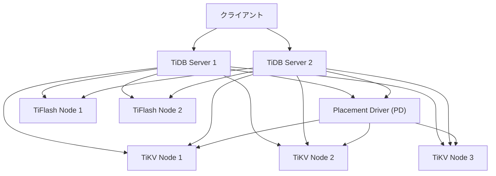
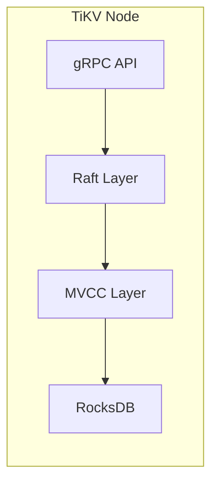
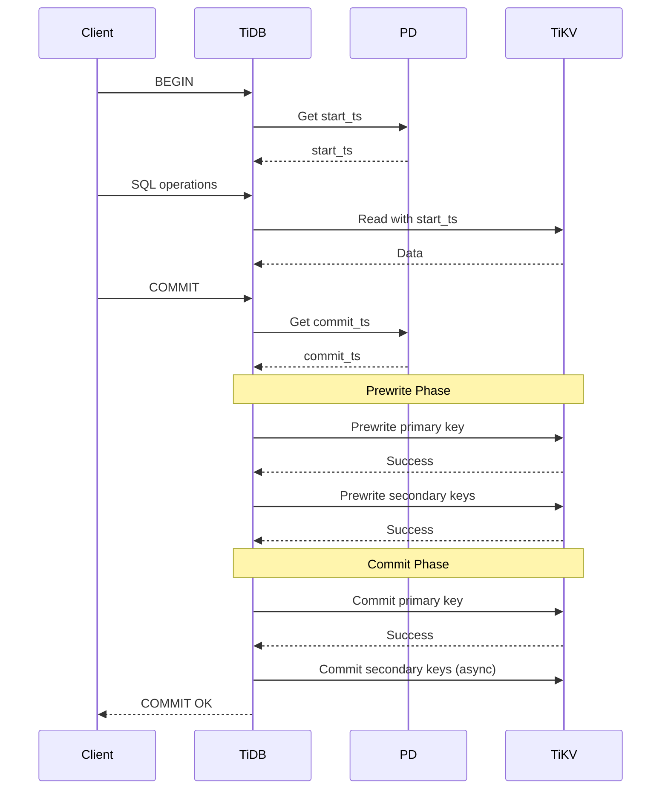
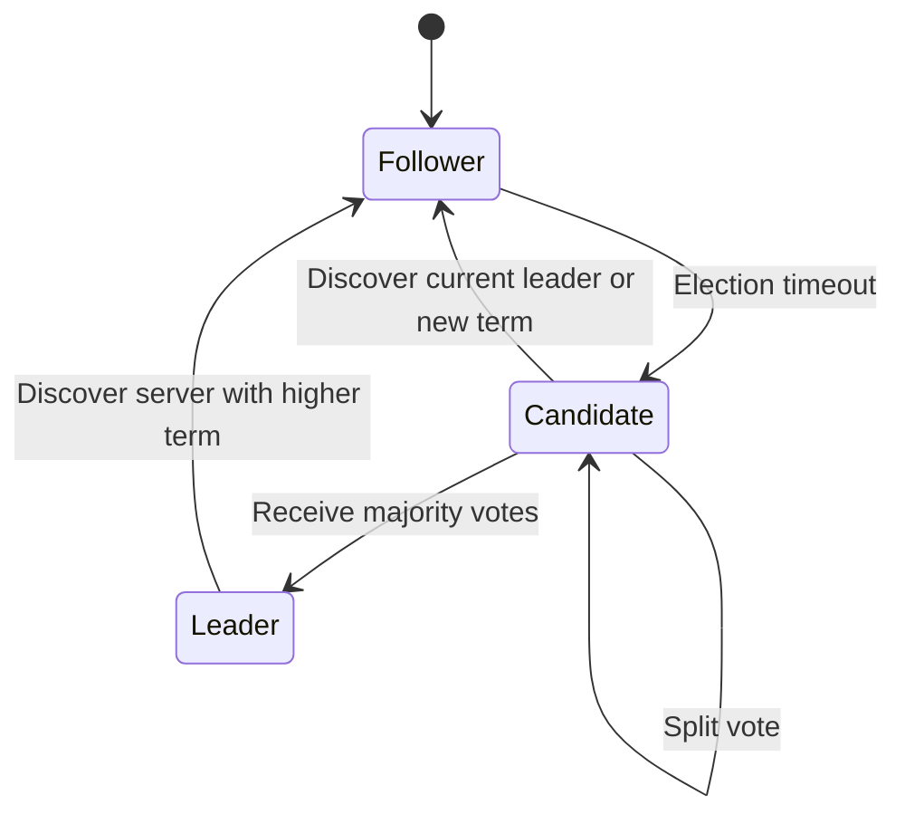
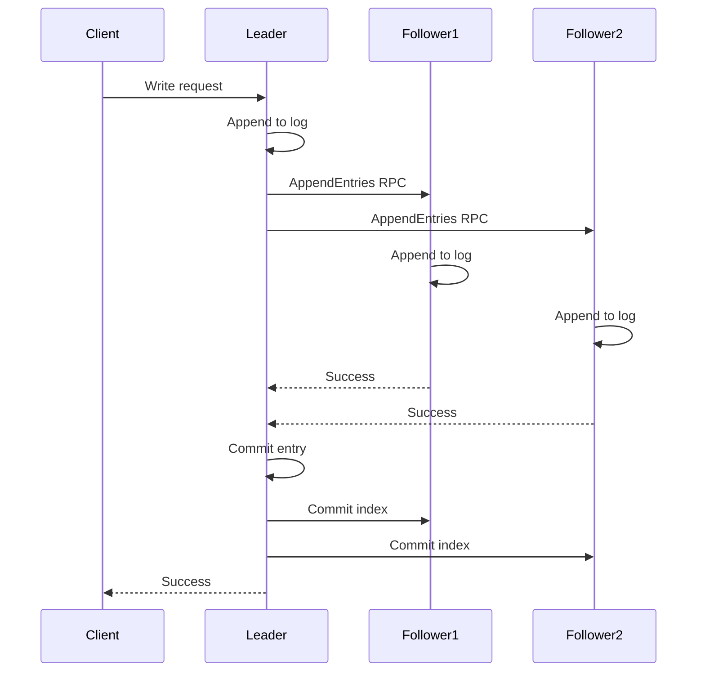
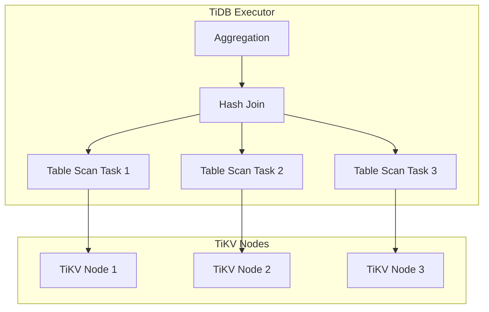
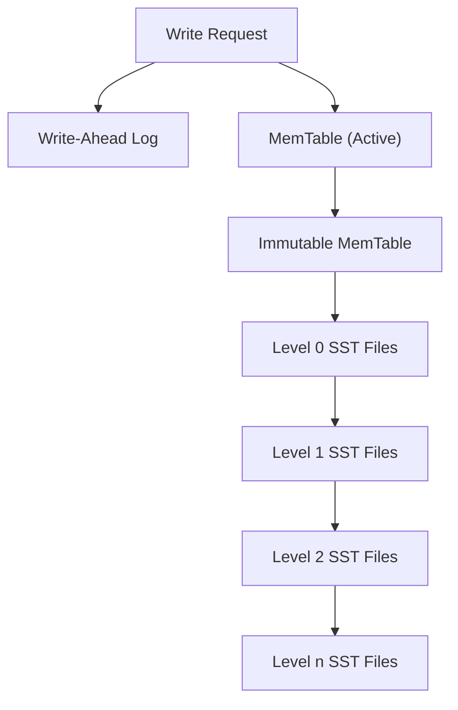
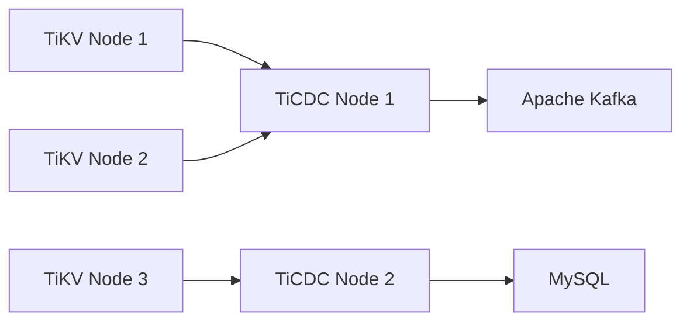

# TiDB

TiDBは、PingCAP社が開発した分散型NewSQLデータベースシステムです。MySQLプロトコルとの互換性を保ちながら、水平スケーラビリティ、強一貫性、高可用性を実現しています。従来のリレーショナルデータベースが抱えるスケーラビリティの課題と、NoSQLデータベースが持つトランザクション保証の弱さという二つの問題を同時に解決することを目指して設計されています。

## アーキテクチャ概要

TiDBは複数のコンポーネントから構成される分散システムです。各コンポーネントは独立してスケール可能であり、それぞれが特定の責務を担っています。



### TiDB Server

TiDB Serverはステートレスなコンピューティング層として機能します。クライアントからのSQL要求を受け取り、パースと最適化を行い、分散実行計画を生成します。MySQLプロトコルとの互換性を提供するため、既存のMySQLクライアントライブラリやツールをそのまま使用できます。各TiDB Serverノードは独立して動作し、任意のノードがダウンしても他のノードが要求を処理できるため、高可用性を実現しています。

SQL処理の流れは、まずパーサーによってSQL文が抽象構文木（AST）に変換され、次にバリデーターによって構文の正当性が検証されます。その後、オプティマイザが統計情報を基に最適な実行計画を選択し、エグゼキューターが実際の処理を実行します。分散環境での実行では、データの局所性を考慮してタスクを適切なTiKVノードに配置することで、ネットワーク通信を最小化しています。

### Placement Driver (PD)

Placement Driver（PD）は、クラスタ全体のメタデータ管理とスケジューリングを担当する中央管理コンポーネントです。etcdを内部的に使用してメタデータを永続化し、Raftコンセンサスアルゴリズムによって高可用性を実現しています[^1]。

PDの主要な責務には、グローバルタイムスタンプの生成と管理があります。TiDBは分散トランザクションにおいてタイムスタンプベースのMVCCを使用するため、グローバルに一意で単調増加するタイムスタンプが必要です。PDはTSO（Timestamp Oracle）として機能し、物理時刻と論理カウンタを組み合わせたハイブリッドクロックを提供します。

また、PDはリージョンのスケジューリングも担当します。TiKVに格納されたデータは「リージョン」と呼ばれる単位で分割され、各リージョンは複数のレプリカを持ちます。PDは各リージョンのサイズ、アクセス頻度、ノードの負荷状況を監視し、必要に応じてリージョンの分割、マージ、レプリカの配置変更を指示します。

### TiKV

TiKVは、TiDBの分散ストレージエンジンです。キーバリューストアとして設計されており、順序付きマップのインターフェースを提供します。内部的にはRocksDBをストレージエンジンとして使用し、その上にRaftによるレプリケーション層を構築しています[^2]。



データはリージョンと呼ばれる連続したキー範囲に分割されます。デフォルトでは各リージョンは96MBのサイズ制限を持ち、この値を超えると自動的に分割されます。各リージョンは独立したRaftグループを形成し、通常3つのレプリカを持ちます。Raftプロトコルにより、過半数のレプリカが正常に動作している限り、読み書き操作を継続できます。

TiKVはMulti-Version Concurrency Control（MVCC）を実装しており、各キーに対して複数のバージョンを保持します。これにより、読み取り操作が書き込み操作をブロックすることなく、スナップショット分離レベルでの一貫性のある読み取りを実現しています。

### TiFlash

TiFlashは、TiDBのHTAP（Hybrid Transactional and Analytical Processing）機能を実現するための列指向ストレージエンジンです。TiKVから非同期にデータをレプリケートし、分析クエリに最適化された形式で保存します。

列指向ストレージは、分析クエリで頻繁に使用される集約操作やフィルタリングに対して高い性能を発揮します。TiFlashはClickHouseのストレージエンジンをベースにしており、効率的な圧縮アルゴリズムとベクトル化実行エンジンを備えています。

## 分散トランザクション

TiDBの分散トランザクションは、Google Percolatorの設計に基づいています[^3]。Percolatorは、BigTableの上に構築された増分処理システムで、ACIDトランザクションをサポートしながら大規模な分散環境でのスケーラビリティを実現しています。

### 2フェーズコミット

TiDBは楽観的並行性制御と2フェーズコミット（2PC）を組み合わせてトランザクションを実装しています。トランザクションの実行は以下のフェーズに分かれます：



トランザクション開始時、TiDBはPDからstart_tsを取得します。このタイムスタンプは、トランザクションが読み取るデータのスナップショットを決定します。トランザクション実行中の読み取り操作は、すべてこのstart_ts時点のデータを参照します。

コミット時には、まずPDから新しいタイムスタンプcommit_tsを取得します。その後、2PCのPrewrite段階で、すべての書き込み対象キーに対してロックを取得し、暫定的な値を書き込みます。この際、プライマリキーを最初に処理し、その後セカンダリキーを処理します。プライマリキーは、トランザクションの状態を表す特別なキーで、トランザクションの成否を決定する役割を持ちます。

Commit段階では、まずプライマリキーのロックを解除してコミットを確定させます。プライマリキーがコミットされると、トランザクション全体がコミットされたとみなされます。セカンダリキーのコミットは非同期に行われ、クライアントへの応答を高速化しています。

### 衝突検出と解決

楽観的並行性制御では、トランザクション実行中は衝突検出を行わず、コミット時に初めて衝突をチェックします。Prewrite段階で、書き込み対象のキーに対して以下の検証を行います：

1. **Write-Write衝突**: 他のトランザクションがstart_tsとcommit_tsの間に同じキーを更新していないか
2. **ロック衝突**: 他のトランザクションが同じキーに対してロックを保持していないか

衝突が検出された場合、トランザクションはロールバックされ、クライアントにエラーが返されます。アプリケーション層でリトライロジックを実装することで、一時的な衝突を解決できます。

### 分散環境での一貫性保証

TiDBは、分散環境においてもACID特性を完全に保証します。原子性は2PCプロトコルによって保証され、一貫性は制約チェックとトランザクション分離によって維持されます。分離性はMVCCとスナップショット分離によって実現され、永続性はRaftレプリケーションとWAL（Write-Ahead Logging）によって保証されます。

特に重要なのは、分散環境での因果一貫性の保証です。TiDBは、PDが提供するグローバルタイムスタンプによって、異なるノード間でも時系列的な順序を保証します。これにより、あるトランザクションの結果を観測した後のトランザクションは、必ず前のトランザクションの効果を反映した状態でデータを読み取ることができます。

## Raftコンセンサスアルゴリズム

TiKVは、データのレプリケーションと一貫性保証のためにRaftコンセンサスアルゴリズムを使用しています[^4]。Raftは、分散システムにおいて複数のノード間で状態を合意形成するためのアルゴリズムで、Paxosよりも理解しやすい設計となっています。

### リーダー選出

各Raftグループは、1つのリーダーと複数のフォロワーから構成されます。リーダーはすべての書き込み要求を処理し、フォロワーにログエントリをレプリケートします。リーダーが故障した場合、フォロワーの中から新しいリーダーが選出されます。



選出プロセスは、フォロワーが一定時間リーダーからのハートビートを受信しなかった場合に開始されます。フォロワーは自身の任期（term）をインクリメントし、候補者（Candidate）状態に遷移して、他のノードに投票を要求します。過半数の票を獲得した候補者が新しいリーダーとなります。

### ログレプリケーション

リーダーは、クライアントからの書き込み要求をログエントリとして記録し、フォロワーにレプリケートします。各ログエントリには、コマンド、任期番号、インデックスが含まれます。



リーダーは、過半数のノード（自身を含む）がログエントリを永続化した時点で、そのエントリをコミットします。コミットされたエントリは、状態マシンに適用され、クライアントに成功応答が返されます。

### 安全性の保証

Raftは以下の安全性を保証します：

1. **選出安全性**: 任意の任期において、最大1つのリーダーしか存在しない
2. **ログマッチング**: 2つのログが同じインデックスと任期のエントリを含む場合、それ以前のすべてのエントリも同一である
3. **リーダー完全性**: コミットされたエントリは、将来のすべてのリーダーのログに含まれる
4. **状態マシン安全性**: 任意のノードが特定のインデックスのログエントリを状態マシンに適用した場合、他のノードも同じインデックスに同じエントリを適用する

これらの性質により、ネットワーク分断やノード障害が発生しても、データの一貫性が保たれます。

## SQL実行エンジン

TiDBのSQL実行エンジンは、分散環境での効率的なクエリ処理を実現するために設計されています。クエリの解析から実行まで、複数の段階を経て処理が行われます。

### クエリ解析と最適化

SQLクエリは、まずレキサーとパーサーによって抽象構文木（AST）に変換されます。TiDBはyaccベースのパーサーを使用しており、MySQLの構文との高い互換性を実現しています。

パース後、セマンティックアナライザーがテーブルやカラムの存在確認、型チェック、権限確認などを行います。その後、論理最適化と物理最適化の2段階で実行計画が生成されます。

論理最適化では、述語プッシュダウン、カラムプルーニング、結合順序の最適化などが行われます。これらの最適化は、リレーショナル代数の等価変換規則に基づいて実施されます。例えば、WHERE句の条件をできるだけデータソースに近い位置に移動させることで、処理するデータ量を削減します。

```sql
-- Original query
SELECT * FROM orders o 
JOIN customers c ON o.customer_id = c.id 
WHERE c.country = 'Japan' AND o.amount > 1000;

-- After predicate pushdown
SELECT * FROM 
  (SELECT * FROM orders WHERE amount > 1000) o
JOIN 
  (SELECT * FROM customers WHERE country = 'Japan') c
ON o.customer_id = c.id;
```

物理最適化では、利用可能なインデックス、データの統計情報、コスト見積もりに基づいて、具体的な実行方法を決定します。結合アルゴリズム（Hash Join、Merge Join、Index Join）の選択、アクセスパス（テーブルスキャン、インデックススキャン）の決定などが含まれます。

### 分散実行

TiDBは、MPP（Massively Parallel Processing）アーキテクチャを採用し、クエリを複数のタスクに分割して並列実行します。実行計画は、データの局所性を考慮してタスクをTiKVノードに配置します。



各TiKVノードは、受信したタスクをコプロセッサで実行します。コプロセッサは、フィルタリング、射影、部分的な集約などの操作をストレージ層で実行し、ネットワーク転送量を削減します。

### ベクトル化実行

TiDBは、SIMD（Single Instruction, Multiple Data）命令を活用したベクトル化実行をサポートしています。従来の行指向の実行モデルではなく、複数の行をバッチで処理することで、CPUキャッシュの効率的な利用と命令レベルの並列性を実現しています。

ベクトル化実行では、データは列形式でメモリに配置され、同じ操作を複数のデータ要素に対して同時に適用します。これにより、特に集約クエリやフィルタリング操作で大幅な性能向上が得られます。

## インデックス構造

TiDBは、MySQLと同様のB+ツリーベースのインデックスをサポートしていますが、分散環境に適応するための独自の実装を持っています。

### プライマリキーとクラスタードインデックス

TiDBでは、すべてのテーブルがプライマリキーを持つ必要があります。明示的にプライマリキーが指定されない場合、内部的に_tidb_rowidという隠しカラムが生成されます。

デフォルトでは、TiDBはクラスタードインデックスを使用します。これは、テーブルのデータがプライマリキーの順序で物理的に格納されることを意味します。クラスタードインデックスにより、プライマリキーによる範囲スキャンが効率的になり、データの局所性が向上します。

### セカンダリインデックス

セカンダリインデックスは、インデックスキーからプライマリキーへのマッピングとして実装されます。インデックスエントリは以下の形式でTiKVに格納されます：

```
Key: {table_id}_{index_id}_{index_value}_{primary_key}
Value: null (for unique index) or primary_key (for non-unique index)
```

この設計により、インデックススキャン後にプライマリテーブルへのルックアップが必要になりますが、分散環境でのインデックス更新の一貫性を保証しやすくなっています。

### グローバルインデックス

TiDB 5.0以降では、パーティションテーブルに対するグローバルインデックスがサポートされています。従来のローカルインデックスでは、各パーティションが独立したインデックスを持つため、パーティションをまたがる検索が非効率でした。グローバルインデックスは、すべてのパーティションのデータを単一のインデックス構造で管理し、パーティション透過的な検索を可能にします。

## ストレージエンジン詳細

TiKVの基盤となるRocksDBは、Facebookが開発したLSM-Tree（Log-Structured Merge-Tree）ベースのキーバリューストアです。LSM-Treeは、書き込み性能を最適化したデータ構造で、順次書き込みを活用してランダムI/Oを削減します。

### LSM-Treeの構造

LSM-Treeは、メモリ上のMemTableと、ディスク上の複数レベルのSSTable（Sorted String Table）から構成されます。新しい書き込みは、まずMemTableに追加され、一定サイズに達するとImmutable MemTableに変換されて、バックグラウンドでSSTファイルとしてディスクに永続化されます。



各レベルのSSTファイルは、定期的にコンパクションと呼ばれるマージ処理によって整理されます。コンパクションは、重複するキーを削除し、削除マーカーをクリーンアップし、データを下位レベルに移動させます。これにより、読み取り性能とストレージ効率のバランスを保っています。

### 書き込み最適化

RocksDBは、書き込みスループットを最大化するために複数の最適化技術を実装しています：

1. **グループコミット**: 複数の書き込み要求をバッチ化してWALに書き込むことで、fsyncの回数を削減
2. **並列フラッシュ**: 複数のカラムファミリーを並列にフラッシュすることで、MemTableからSSTへの変換を高速化
3. **パイプライン書き込み**: WAL書き込みとMemTable更新を並列化

### 読み取り最適化

読み取り性能を向上させるため、以下の機能が実装されています：

1. **ブルームフィルタ**: 各SSTファイルにブルームフィルタを付加し、キーの存在確認を高速化
2. **ブロックキャッシュ**: 頻繁にアクセスされるデータブロックをメモリにキャッシュ
3. **プレフィックスシーク**: 共通プレフィックスを持つキーの範囲スキャンを最適化

## 統計情報と実行計画

TiDBのオプティマイザは、正確な統計情報に基づいて最適な実行計画を選択します。統計情報には、テーブルの行数、カラムの値分布、インデックスの選択性などが含まれます。

### ヒストグラムとCMスケッチ

カラムの値分布は、等深ヒストグラムとCount-Min Sketch（CMスケッチ）の組み合わせで表現されます。ヒストグラムは、値域を等しい頻度のバケットに分割し、各バケットの境界値を記録します。これにより、範囲クエリの選択性を正確に見積もることができます。

CMスケッチは、個別の値の出現頻度を推定するための確率的データ構造です。特に、等値条件の選択性推定に使用されます。ハッシュ関数の配列と、カウンタの2次元配列から構成され、メモリ効率的に頻度情報を保持します。

### 動的な統計更新

TiDBは、自動的に統計情報を更新する機能を持っています。データの変更量が閾値を超えると、バックグラウンドで統計情報の再収集がトリガーされます。また、クエリ実行時のフィードバックを利用して、統計情報を段階的に改善するメカニズムも実装されています。

## HTAP機能

TiDBのHTAP（Hybrid Transactional and Analytical Processing）アーキテクチャは、同一システムでOLTPとOLAPワークロードを効率的に処理することを可能にします。

### TiFlashの列指向ストレージ

TiFlashは、デルタツリー構造を使用して列指向データを管理します。新しいデータは最初にデルタ層に書き込まれ、バックグラウンドで安定層にマージされます。この設計により、リアルタイムのデータ更新と効率的な分析クエリを両立しています。

列指向フォーマットでは、同じカラムのデータが連続して格納されるため、圧縮効率が大幅に向上します。TiFlashは、LZ4、ZSTD、などの圧縮アルゴリズムをサポートし、データ型に応じて最適な圧縮方式を選択します。

### インテリジェントなクエリルーティング

TiDBのオプティマイザは、クエリの特性に基づいて、TiKVとTiFlashのどちらでクエリを実行するかを自動的に決定します。一般的に、ポイントクエリや小規模な範囲スキャンはTiKVで、大規模な集約クエリはTiFlashで実行されます。

また、TiDBは複数のストレージエンジンを組み合わせた実行計画も生成できます。例えば、結合操作の一方のテーブルをTiKVから、もう一方をTiFlashから読み取ることで、各ストレージエンジンの特性を最大限に活用します。

## 運用とモニタリング

TiDBクラスタの安定運用には、適切なモニタリングとチューニングが不可欠です。TiDBは、Prometheusベースの包括的なメトリクス収集システムを提供しています。

### 主要メトリクス

運用上重要なメトリクスには以下があります：

1. **QPS（Queries Per Second）**: 各TiDBノードの処理能力を示す基本指標
2. **レイテンシ**: P50、P95、P99パーセンタイルでのクエリ応答時間
3. **TiKVのRaftストアCPU使用率**: レプリケーション負荷の指標
4. **リージョンの健全性**: レプリカ不足やリーダー不在のリージョン数

### パフォーマンスチューニング

TiDBのパフォーマンスを最適化するためには、ワークロードの特性に応じた設定調整が必要です。重要な設定パラメータには以下があります：

**TiDBレベル**:
- `tidb_distsql_scan_concurrency`: 分散スキャンの並列度
- `tidb_index_join_batch_size`: インデックス結合のバッチサイズ
- `tidb_mem_quota_query`: クエリごとのメモリ制限

**TiKVレベル**:
- `storage.block-cache.capacity`: RocksDBのブロックキャッシュサイズ
- `raftstore.apply-pool-size`: Raftログ適用の並列度
- `coprocessor.region-max-keys`: リージョン分割の閾値

### 障害対応

TiDBは高可用性を実現していますが、障害発生時の適切な対応が重要です。一般的な障害シナリオと対応方法：

1. **TiKVノード障害**: Raftレプリケーションにより自動的にフェイルオーバーが実行されます。PDは新しいレプリカを作成してレプリカ数を維持します。

2. **ネットワーク分断**: Raftの過半数原則により、マイナリティ側のパーティションは書き込みを受け付けなくなります。ネットワーク復旧後、自動的に同期が再開されます。

3. **ディスク容量不足**: TiKVは書き込みを拒否し始めます。不要なデータの削除やノードの追加で対応します。

## セキュリティ機能

TiDBは、エンタープライズ環境で要求される包括的なセキュリティ機能を提供しています。

### 認証と権限管理

TiDBは、MySQLと互換性のある権限システムを実装しています。ユーザー、ロール、権限の概念をサポートし、細かい粒度でのアクセス制御が可能です。

```sql
-- Create user with specific privileges
CREATE USER 'analyst'@'%' IDENTIFIED BY 'password';
GRANT SELECT ON database.* TO 'analyst'@'%';

-- Role-based access control
CREATE ROLE 'read_only';
GRANT SELECT ON *.* TO 'read_only';
GRANT 'read_only' TO 'analyst'@'%';
```

### 暗号化

TiDBは、転送中データと保存データの両方の暗号化をサポートしています：

1. **TLS/SSL通信**: クライアント-TiDB間、およびコンポーネント間の通信をTLSで暗号化
2. **透過的データ暗号化（TDE）**: TiKVに保存されるデータをAES暗号化で保護
3. **暗号化キー管理**: AWS KMSなどの外部キー管理システムとの統合

### 監査ログ

TiDBは、データベースアクセスの詳細な監査ログを生成できます。監査ログには、実行されたSQL文、アクセス時刻、ユーザー情報、実行結果などが記録されます。コンプライアンス要件に応じて、ログの保持期間やフィルタリング条件を設定できます。

## パーティショニング

TiDBは、大規模テーブルの管理を容易にするためのパーティショニング機能を提供しています。パーティショニングにより、論理的に1つのテーブルを物理的に複数の部分に分割できます。

### パーティションタイプ

TiDBがサポートするパーティションタイプ：

1. **Range Partitioning**: カラム値の範囲に基づいてパーティション分割
2. **List Partitioning**: カラム値の離散的なリストに基づいて分割
3. **Hash Partitioning**: ハッシュ関数を使用して均等に分割
4. **Key Partitioning**: 内部ハッシュ関数を使用した分割

```sql
-- Range partitioning example
CREATE TABLE sales (
    id INT,
    sale_date DATE,
    amount DECIMAL(10,2)
) PARTITION BY RANGE (YEAR(sale_date)) (
    PARTITION p2020 VALUES LESS THAN (2021),
    PARTITION p2021 VALUES LESS THAN (2022),
    PARTITION p2022 VALUES LESS THAN (2023),
    PARTITION p2023 VALUES LESS THAN (2024)
);
```

### パーティションプルーニング

クエリ実行時、TiDBのオプティマイザは、WHERE句の条件に基づいて不要なパーティションを除外します。これにより、スキャンするデータ量が削減され、クエリ性能が向上します。

## Change Data Capture (CDC)

TiCDCは、TiDBのChange Data Captureコンポーネントで、データ変更をリアルタイムでキャプチャし、下流システムに配信します。

### アーキテクチャ

TiCDCは、TiKVのRaftログを読み取り、変更イベントを抽出します。複数のCDCノードによる水平スケーラビリティをサポートし、高可用性を実現しています。



### 配信保証

TiCDCは、少なくとも一度（at-least-once）の配信保証を提供します。また、イベントの順序性も保証されており、同一行に対する変更は、発生順序通りに配信されます。これにより、下流システムでデータの一貫性を維持できます。

## まとめ

TiDBは、従来のリレーショナルデータベースの利便性と、分散システムのスケーラビリティを融合した革新的なデータベースシステムです。Raftによる強一貫性、Percolatorベースの分散トランザクション、TiFlashによるHTAP機能など、現代のデータ処理要求に応える包括的な機能を提供しています。その設計思想と実装は、大規模分散データベースシステムの構築における重要な参考事例となっています。

[^1]: Diego Ongaro and John Ousterhout. "In Search of an Understandable Consensus Algorithm." USENIX ATC 2014.
[^2]: Siddon Tang et al. "TiKV: A Distributed Transactional Key-Value Database." 
[^3]: Daniel Peng and Frank Dabek. "Large-scale Incremental Processing Using Distributed Transactions and Notifications." OSDI 2010.
[^4]: Leslie Lamport. "The Part-Time Parliament." ACM Transactions on Computer Systems, 1998.