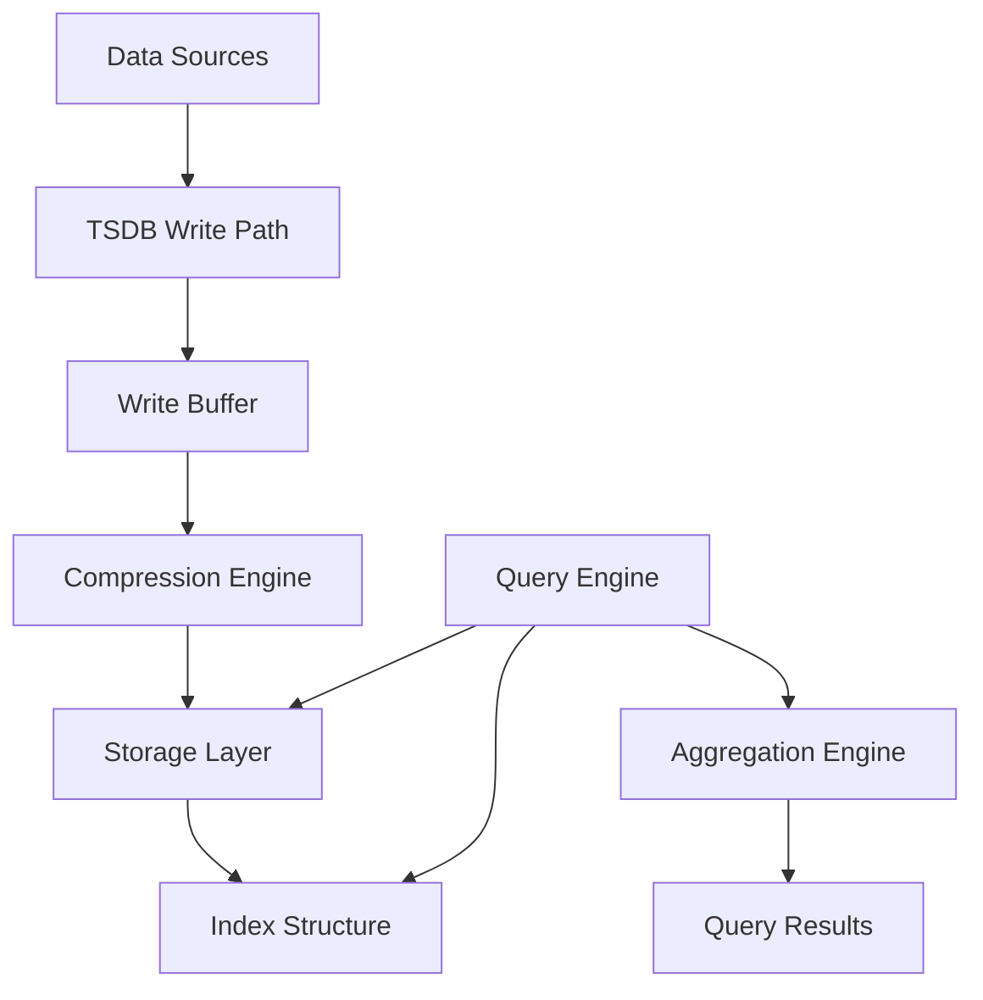
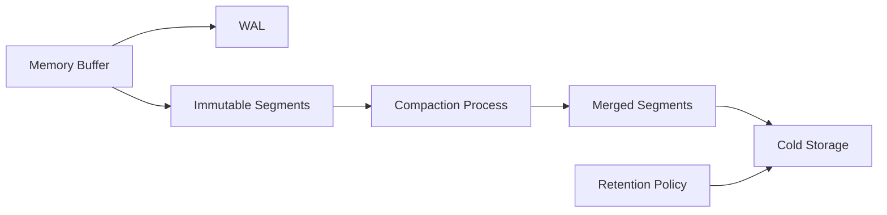
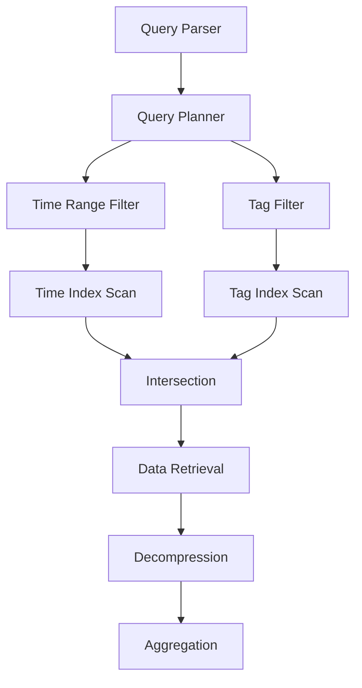
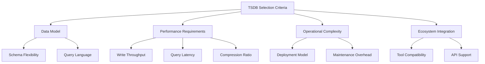

# Time Series Database

時系列データベース（Time Series Database、TSDB）は、時間軸に沿って生成される連続的なデータポイントの効率的な保存、検索、分析を目的として設計されたデータベースシステムである。IoTセンサーデータ、システムメトリクス、金融市場データなど、現代のデジタルインフラストラクチャから生成される膨大な時系列データを扱うために、従来のリレーショナルデータベースとは異なる特殊なアーキテクチャと最適化手法を採用している。

時系列データの本質的な特徴は、各データポイントがタイムスタンプと紐付けられ、通常は追記専用（append-only）であり、過去のデータの更新や削除が稀であることにある。この特性により、TSDBは書き込み性能の最適化、効率的なデータ圧縮、時間範囲クエリの高速化といった特定の要件に特化した設計が可能となっている。さらに、時系列データは多くの場合、一定の時間間隔で生成され、時間的局所性を持つため、これらの特性を活用した最適化が重要となる。

## データモデルとスキーマ設計

時系列データベースのデータモデルは、基本的にタイムスタンプ、メトリクス名、タグ（ディメンション）、フィールド値という4つの要素から構成される。このモデルは、多次元データの効率的な格納と検索を可能にし、時系列データの自然な表現を提供する。タイムスタンプは通常、エポック時刻からのナノ秒単位で表現され、高精度な時間分解能をサポートする。メトリクス名は測定対象を識別し、タグは時系列をグループ化・フィルタリングするためのメタデータとして機能する。

多くのTSDBでは、スキーマレスまたは半構造化データモデルを採用しており、新しいメトリクスやタグを動的に追加できる柔軟性を提供している。この設計により、事前のスキーマ定義なしに多様なデータソースからのデータを受け入れることが可能となる。一方で、カーディナリティの管理が重要な課題となり、タグの組み合わせが爆発的に増加することで性能問題を引き起こす可能性がある。

データの論理的な組織化において、時系列は通常、測定名とタグセットの組み合わせによって一意に識別される。例えば、`cpu_usage{host="server1", region="us-west"}` という時系列は、特定のホストとリージョンのCPU使用率を表す。この階層的な命名規則により、効率的なデータの集約とフィルタリングが可能となる。

## ストレージエンジンとデータ圧縮

時系列データベースのストレージエンジンは、データの時間的特性を最大限に活用した設計となっている。多くの実装では、Log-Structured Merge Tree（LSM-Tree）の変種を採用し、書き込み性能の最適化を図っている。新しいデータはまずメモリ内のバッファに書き込まれ、一定のサイズまたは時間間隔に達すると、ディスクにフラッシュされる。この際、データは時間順にソートされ、効率的な圧縮が適用される。

データ圧縮は時系列データベースの重要な機能であり、ストレージコストの削減と読み取り性能の向上に寄与する。時系列データの特性を活用した専用の圧縮アルゴリズムが開発されており、代表的なものにFacebook Gorillaで提案されたdouble-delta encodingとXOR compressionがある[^1]。これらの手法は、連続するデータポイント間の差分が小さいという時系列データの特性を利用し、高い圧縮率を実現している。

[^1]: Pelkonen, T., et al. (2015). "Gorilla: A Fast, Scalable, In-Memory Time Series Database." Proceedings of the VLDB Endowment, 8(12), 1816-1827.

タイムスタンプの圧縮では、delta-of-delta encodingを使用し、一定間隔で生成されるデータの場合、タイムスタンプをわずか1ビットで表現することも可能である。値の圧縮では、浮動小数点数のビットパターンの類似性を利用したXOR圧縮により、平均して1.37バイト/データポイントという高い圧縮率を達成している実装もある。

## インデックス構造とクエリ最適化

時系列データベースのインデックス構造は、時間範囲クエリとタグベースのフィルタリングを効率的にサポートするよう設計されている。多くの実装では、時間軸に対するプライマリインデックスと、タグに対するセカンダリインデックスを組み合わせたハイブリッドアプローチを採用している。

時間軸インデックスは通常、B+ツリーまたはその変種を使用し、時間範囲クエリの高速化を図っている。一方、タグインデックスには転置インデックスやハッシュマップが使用され、特定のタグ値を持つ時系列の高速検索を可能にしている。PromQLやInfluxQLなどのクエリ言語は、これらのインデックス構造を活用して、複雑なフィルタリング条件を効率的に処理する。

クエリ最適化においては、時系列データの特性を活用した独自の手法が採用されている。例えば、プッシュダウン述語により、圧縮されたデータブロックのメタデータを使用して、不要なデータの読み取りをスキップすることができる。また、並列処理により、複数の時系列を同時に処理し、クエリのレイテンシを削減している。

## 集約とダウンサンプリング

時系列データの長期保存において、データ量の増大は避けられない課題である。この問題に対処するため、多くのTSDBは自動的なダウンサンプリングと集約機能を提供している。ダウンサンプリングは、古いデータの時間解像度を低下させることで、ストレージ使用量を削減する手法である。

集約処理では、平均、最大、最小、合計、標準偏差などの統計量を事前計算し、保存することで、長期間のトレンド分析を効率的に実行できるようにしている。この際、連続的な集約（continuous aggregation）を実装することで、新しいデータが到着するたびに集約値を更新し、クエリ時の計算コストを削減している。

ダウンサンプリングのポリシーは通常、データの経年変化に応じて段階的に設定される。例えば、1分間隔の生データを1週間保持し、その後5分間隔にダウンサンプリングして1ヶ月保持、さらに1時間間隔にダウンサンプリングして1年保持するといった階層的なアプローチが一般的である。

## 主要な実装の比較分析

現在、多数の時系列データベース実装が存在し、それぞれ異なる設計思想とトレードオフを持っている。InfluxDBは、独自のTSMストレージエンジンを採用し、高い書き込み性能と効率的な圧縮を実現している。内部的にはLog-Structured Merge Treeの変種を使用し、時系列データに特化した最適化を施している。

TimescaleDBは、PostgreSQLの拡張として実装されており、SQLの完全なサポートとACID特性を提供する。ハイパーテーブルという抽象化により、時系列データを時間でパーティショニングし、自動的なデータ管理を実現している。この設計により、既存のPostgreSQLエコシステムとの互換性を保ちながら、時系列ワークロードに対する最適化を提供している。

Prometheusは、プル型のデータ収集モデルを採用し、Kubernetesなどのクラウドネイティブ環境での監視に特化している。独自の時系列ストレージフォーマットと、強力なクエリ言語PromQLを提供し、多次元データモデルによる柔軟なデータ探索を可能にしている。2時間ごとのブロック単位でデータを管理し、効率的なデータライフサイクル管理を実現している[^2]。

[^2]: Prometheus Authors. (2023). "Prometheus Storage." https://prometheus.io/docs/prometheus/latest/storage/

## 分散アーキテクチャとスケーラビリティ

大規模な時系列データを扱うシステムでは、単一ノードの容量限界を超えるスケーラビリティが要求される。分散時系列データベースは、データを複数のノードに分散させることで、水平スケーリングを実現している。シャーディング戦略として、時間ベース、メトリクスベース、またはハッシュベースのアプローチが採用されている。

時間ベースシャーディングでは、特定の時間範囲のデータを特定のノードに割り当てる。この方式は、最新のデータへのアクセスが多いワークロードに適しており、古いデータを別のストレージ層に移行しやすいという利点がある。一方、メトリクスベースシャーディングでは、特定のメトリクスやタグの組み合わせに基づいてデータを分散させ、特定の時系列へのアクセスを局所化できる。

レプリケーションは、データの可用性と読み取りスケーラビリティを向上させる重要な機能である。多くの分散TSDBでは、Raftコンセンサスアルゴリズムなどを使用して、データの一貫性を保証しながらレプリケーションを実現している。書き込みは通常、プライマリノードで処理され、レプリカノードに非同期または同期的に伝播される。

## 性能特性とベンチマーク

時系列データベースの性能評価では、書き込みスループット、クエリレイテンシ、圧縮率、リソース使用率などの指標が重要となる。典型的なワークロードでは、秒間数百万データポイントの書き込みと、数十億データポイントに対するミリ秒単位のクエリ応答が要求される。

書き込み性能の最適化では、バッチ処理、並列書き込み、効率的なインデックス更新が重要な要素となる。多くのTSDBでは、Write-Ahead Log（WAL）を使用してデータの永続性を保証しながら、メモリバッファリングにより高い書き込みスループットを実現している。バッチサイズとフラッシュ間隔のトレードオフにより、レイテンシとスループットのバランスを調整できる。

クエリ性能は、インデックスの効率性、データの局所性、圧縮アルゴリズムの解凍速度に大きく依存する。時間範囲クエリでは、データの物理的な配置が性能に直接影響するため、時間順のデータレイアウトが重要となる。また、集約クエリでは、事前計算された集約値の利用や、並列処理による高速化が効果的である。

## 運用上の考慮事項

時系列データベースの運用では、容量計画、保持ポリシー、監視、バックアップなどが重要な考慮事項となる。データの増加率を正確に予測し、適切なストレージ容量を確保することは、システムの安定運用に不可欠である。多くのTSDBでは、データの自動削除機能を提供しており、設定された保持期間を過ぎたデータを自動的に削除することで、ストレージ使用量を管理している。

監視においては、書き込み遅延、クエリ性能、ディスク使用率、メモリ使用率などのメトリクスを継続的に追跡する必要がある。これらのメトリクスは、しばしば時系列データベース自身に保存され、セルフモニタリングを実現している。アラート機能により、しきい値を超えた場合に自動的に通知を送信することも可能である。

バックアップとリカバリ戦略は、データの重要性とRPO（Recovery Point Objective）、RTO（Recovery Time Objective）の要件に基づいて設計される。多くのTSDBでは、スナップショット機能を提供しており、特定時点のデータ状態を効率的にバックアップできる。増分バックアップやレプリケーションベースのバックアップにより、大規模なデータセットでも効率的なバックアップが可能となっている。

## 実装における設計上のトレードオフ

時系列データベースの設計には、多くのトレードオフが存在する。書き込み性能と読み取り性能のバランス、圧縮率とCPU使用率のトレードオフ、柔軟性と性能の最適化など、用途に応じて異なる選択が必要となる。

メモリ使用量とディスクI/Oのトレードオフは、特に重要な設計上の決定である。大きなメモリバッファを使用することで書き込み性能を向上させられるが、クラッシュ時のデータ損失リスクが増大する。WALのフラッシュ頻度を調整することで、このトレードオフを管理できるが、適切なバランスはワークロードの特性に依存する。

インデックスの粒度も重要なトレードオフである。詳細なインデックスはクエリ性能を向上させるが、書き込み時のオーバーヘッドとストレージ使用量が増加する。多くの実装では、適応的インデックス戦略を採用し、アクセスパターンに基づいてインデックスの粒度を動的に調整している。

データモデルの柔軟性と型安全性のトレードオフも考慮すべき点である。スキーマレスモデルは柔軟性が高いが、データの一貫性を保証することが困難になる。一方、厳密なスキーマ定義は、データの品質を保証できるが、新しいメトリクスの追加が煩雑になる可能性がある。

時系列データベースは、現代のデータインフラストラクチャにおいて重要な役割を果たしており、IoT、監視、金融など様々な分野で活用されている。その設計と実装には、時系列データの特性を最大限に活用した独自の最適化手法が採用されており、従来のデータベースシステムとは異なるアプローチが取られている。適切な時系列データベースの選択と運用には、ワークロードの特性、性能要件、運用上の制約を総合的に考慮する必要があり、これらの要素を理解することが、効果的なシステム設計の鍵となる。