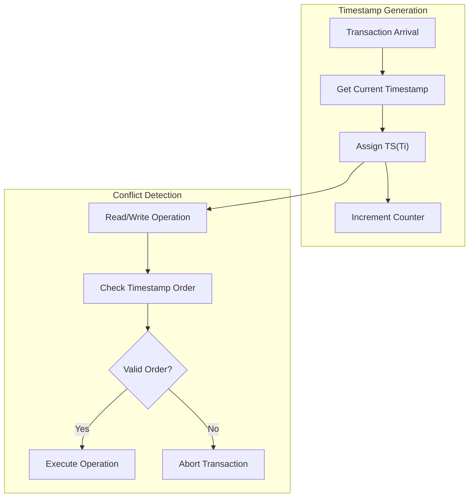
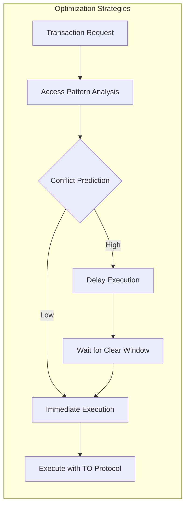
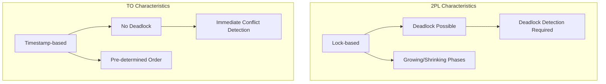

# Timestamp Ordering

Timestamp Ordering（タイムスタンプ順序付け）は、データベース管理システムにおける並行性制御手法の一つであり、各トランザクションに一意のタイムスタンプを割り当て、その順序に基づいてトランザクションの実行を制御する仕組みである。この手法は、1979年にBernsteinとGoodmanによって体系的に定式化され[^1]、楽観的並行性制御と悲観的並行性制御の中間的な性質を持つ手法として位置づけられている。

データベースシステムにおいて、複数のトランザクションが同時に実行される環境では、データの一貫性を保ちながら高い並行性を実現することが重要な課題となる。Timestamp Orderingは、この課題に対して、グローバルな時刻順序という概念を導入することで、デッドロックを原理的に発生させないという優れた特性を持つ。しかし同時に、トランザクションの中断（abort）が頻繁に発生する可能性があるというトレードオフも存在する。

本稿では、Timestamp Orderingの理論的基礎から実装の詳細まで、データベースシステムの設計・実装に携わるエンジニアが実践的に活用できる水準で解説する。特に、アルゴリズムの正確性の証明、実装時の考慮事項、そして他の並行性制御手法との詳細な比較を通じて、この手法の本質的な理解を目指す。

## 理論的基礎

Timestamp Orderingの理論的基礎は、トランザクションの直列化可能性（serializability）の概念に根ざしている。直列化可能性とは、並行に実行されたトランザクションの結果が、何らかの直列実行順序での結果と等価であることを保証する性質である。Timestamp Orderingは、この直列実行順序を事前に決定することで、並行性制御を実現する。

各トランザクション$T_i$には、開始時にタイムスタンプ$TS(T_i)$が割り当てられる。このタイムスタンプは、論理的な時刻を表現し、以下の性質を満たす必要がある：

1. **一意性**: 任意の二つのトランザクション$T_i$と$T_j$について、$TS(T_i) \neq TS(T_j)$
2. **単調増加性**: トランザクション$T_i$が$T_j$より前に開始された場合、$TS(T_i) < TS(T_j)$

タイムスタンプの生成には、物理的な時計を使用する方法と、論理的なカウンタを使用する方法がある。物理的な時計を使用する場合、分散システムにおける時刻同期の問題が発生するため、多くの実装では論理的なカウンタが採用される。



データ項目$X$に対しては、以下の二つのタイムスタンプが維持される：

- **$RTS(X)$**: データ項目$X$を最後に読み取ったトランザクションのタイムスタンプの最大値
- **$WTS(X)$**: データ項目$X$を最後に書き込んだトランザクションのタイムスタンプ

これらのタイムスタンプは、トランザクションの操作が実行されるたびに更新され、競合検出の基準として使用される。

## 基本プロトコル

Timestamp Orderingの基本プロトコルは、各読み取り操作と書き込み操作に対して、タイムスタンプの順序関係をチェックし、順序違反が検出された場合にトランザクションを中断する仕組みである。以下、読み取り操作と書き込み操作それぞれについて、詳細なアルゴリズムを示す。

### 読み取り操作のプロトコル

トランザクション$T_i$がデータ項目$X$を読み取ろうとする場合、以下の手順で処理される：

1. **$TS(T_i) < WTS(X)$の場合**：
   トランザクション$T_i$は、より新しいトランザクションによって書き込まれた値を読み取ろうとしている。これはタイムスタンプ順序に違反するため、$T_i$は中断される。

2. **$TS(T_i) \geq WTS(X)$の場合**：
   読み取り操作は許可される。操作実行後、$RTS(X) = \max(RTS(X), TS(T_i))$に更新される。

このプロトコルにより、トランザクションは自分より新しいタイムスタンプを持つトランザクションが書き込んだ値を読むことができない。これは、直列実行順序においてトランザクション$T_i$が$T_j$より前に実行されるべき場合（$TS(T_i) < TS(T_j)$）、$T_i$は$T_j$の書き込み結果を観測してはならないという原則に基づいている。

### 書き込み操作のプロトコル

トランザクション$T_i$がデータ項目$X$に書き込もうとする場合、以下の手順で処理される：

1. **$TS(T_i) < RTS(X)$の場合**：
   より新しいトランザクションが既に$X$を読み取っている。$T_i$の書き込みを許可すると、読み取られた値が無効になるため、$T_i$は中断される。

2. **$TS(T_i) < WTS(X)$の場合**：
   より新しいトランザクションが既に$X$に書き込んでいる。この場合の処理は、Thomas Write Ruleの適用有無によって異なる（後述）。

3. **上記のいずれでもない場合**：
   書き込み操作は許可される。操作実行後、$WTS(X) = TS(T_i)$に更新される。

```mermaid
flowchart TD
    subgraph "Read Protocol"
        R1["Ti reads X"] --> R2{TS(Ti) < WTS(X)?}
        R2 -->|Yes| R3["Abort Ti"]
        R2 -->|No| R4["Allow read"]
        R4 --> R5["Update RTS(X)"]
    end
    
    subgraph "Write Protocol"
        W1["Ti writes X"] --> W2{TS(Ti) < RTS(X)?}
        W2 -->|Yes| W3["Abort Ti"]
        W2 -->|No| W4{TS(Ti) < WTS(X)?}
        W4 -->|Yes| W5["Apply TWR or Abort"]
        W4 -->|No| W6["Allow write"]
        W6 --> W7["Update WTS(X)"]
    end
```

## Thomas Write Rule

Thomas Write Rule（TWR）は、1979年にRobert H. Thomasによって提案された最適化手法である[^2]。この規則は、特定の条件下で書き込み操作を無視することで、トランザクションの中断を回避する。

基本的なTimestamp Orderingプロトコルでは、$TS(T_i) < WTS(X)$の場合、トランザクション$T_i$は中断される。しかし、Thomas Write Ruleでは、この場合に書き込み操作を単に無視する。この最適化が正当である理由は、以下の観察に基づいている：

トランザクション$T_i$の書き込みが、より新しいトランザクション$T_j$（$TS(T_j) > TS(T_i)$）の書き込みによって上書きされる場合、直列実行順序において$T_i$の書き込みは$T_j$の書き込みによって無効化される。したがって、$T_i$の書き込みを実行しなくても、最終的な結果は同じになる。

Thomas Write Ruleの適用により、書き込み-書き込み競合によるトランザクションの中断を大幅に削減できる。ただし、この規則を適用するためには、すべての書き込み操作が「blind write」（読み取りなしの書き込み）である必要がある。読み取り後の書き込み（read-modify-write）操作では、読み取った値に基づいて書き込み値が決定されるため、書き込みを無視することはできない。

```python
def write_with_twr(transaction, data_item, value):
    """Thomas Write Ruleを適用した書き込み操作"""
    if transaction.timestamp < data_item.rts:
        # Rule 1: 新しいトランザクションが既に読んでいる
        abort(transaction)
    elif transaction.timestamp < data_item.wts:
        # Rule 2: TWR適用 - 書き込みを無視
        return  # 操作を無視
    else:
        # 書き込みを実行
        data_item.value = value
        data_item.wts = transaction.timestamp
```

## 実装の詳細

Timestamp Orderingの実装には、いくつかの重要な設計上の決定が必要となる。ここでは、実際のデータベースシステムにおける実装の詳細について解説する。

### タイムスタンプ管理

タイムスタンプの生成と管理は、システムの性能と正確性に直接影響する重要な要素である。一般的な実装では、以下のアプローチが採用される：

**中央集権型タイムスタンプサーバー**：
単一のサーバーがすべてのタイムスタンプを生成する。この方式は実装が簡単で、タイムスタンプの一意性と単調増加性を保証しやすい。しかし、スケーラビリティのボトルネックとなる可能性がある。

```cpp
class TimestampServer {
private:
    std::atomic<uint64_t> counter{0};
    std::mutex mutex;
    
public:
    uint64_t get_timestamp() {
        std::lock_guard<std::mutex> lock(mutex);
        return ++counter;
    }
};
```

**分散タイムスタンプ生成**：
各ノードが独立してタイムスタンプを生成する。Lamportの論理時計[^3]やハイブリッド論理時計（HLC）[^4]などの手法が使用される。この方式は高いスケーラビリティを提供するが、実装が複雑になる。

### データ構造の設計

効率的なTimestamp Orderingの実装には、適切なデータ構造の選択が不可欠である。各データ項目に対してRTSとWTSを維持する必要があるが、これらの情報をどのように格納するかは重要な設計上の決定となる。

**インライン方式**：
各データ項目と共にタイムスタンプ情報を格納する。この方式はアクセスが高速だが、データサイズが増加する。

```cpp
struct DataItem {
    Value value;
    Timestamp rts;  // Read timestamp
    Timestamp wts;  // Write timestamp
    std::shared_mutex lock;  // For concurrent access
};
```

**分離方式**：
タイムスタンプ情報を別のデータ構造で管理する。メモリ効率は良いが、追加のルックアップが必要となる。

```cpp
class TimestampManager {
private:
    std::unordered_map<ItemId, TimestampInfo> timestamp_map;
    std::shared_mutex map_lock;
    
public:
    TimestampInfo get_timestamps(ItemId id) {
        std::shared_lock<std::shared_mutex> lock(map_lock);
        return timestamp_map[id];
    }
};
```

### 並行性の考慮

Timestamp Orderingの実装では、タイムスタンプのチェックと更新を原子的に行う必要がある。これは、複数のトランザクションが同時に同じデータ項目にアクセスする場合の競合条件を防ぐためである。

```cpp
bool read_item(Transaction* txn, DataItem* item) {
    std::shared_lock<std::shared_mutex> lock(item->lock);
    
    if (txn->timestamp < item->wts) {
        // Timestamp order violation
        return false;  // Transaction should be aborted
    }
    
    // Perform the read
    txn->read_value(item->value);
    
    // Update RTS atomically
    Timestamp old_rts = item->rts;
    while (old_rts < txn->timestamp) {
        if (item->rts.compare_exchange_weak(old_rts, txn->timestamp)) {
            break;
        }
    }
    
    return true;
}
```

### メモリ管理と永続性

Timestamp Orderingの実装では、タイムスタンプ情報の永続化も重要な課題となる。システム障害からの回復時に、タイムスタンプ情報が失われると、データの一貫性が損なわれる可能性がある。

一般的なアプローチとして、Write-Ahead Logging（WAL）と組み合わせて、タイムスタンプの更新もログに記録する方法がある。これにより、障害回復時にタイムスタンプ情報を再構築できる。

```cpp
class TimestampLogger {
private:
    WAL* wal;
    
public:
    void log_timestamp_update(ItemId id, TimestampType type, 
                            Timestamp old_ts, Timestamp new_ts) {
        LogRecord record{
            .type = TIMESTAMP_UPDATE,
            .item_id = id,
            .ts_type = type,
            .old_timestamp = old_ts,
            .new_timestamp = new_ts
        };
        wal->append(record);
    }
};
```

## 性能特性と最適化

Timestamp Orderingの性能特性は、ワークロードの特性に大きく依存する。読み取り中心のワークロードでは良好な性能を示すが、書き込みが多く競合が頻繁に発生するワークロードでは、トランザクションの中断率が高くなる傾向がある。

### 中断率の分析

トランザクションの中断率は、以下の要因に影響される：

1. **競合の頻度**: 同じデータ項目に対する並行アクセスが多いほど、中断率が高くなる
2. **トランザクションの長さ**: 長いトランザクションほど、競合に遭遇する確率が高い
3. **アクセスパターン**: ホットスポット（頻繁にアクセスされるデータ）の存在は中断率を大幅に増加させる

中断率を数学的にモデル化すると、$n$個のトランザクションが$m$個のデータ項目に一様にアクセスする場合、競合確率$P_{conflict}$は近似的に：

$$P_{conflict} \approx 1 - e^{-\frac{n^2}{2m}}$$

これは、データ項目数に対してトランザクション数が増加すると、競合確率が急速に増加することを示している。

### 最適化手法

Timestamp Orderingの性能を改善するために、以下の最適化手法が提案されている：

**1. Conservative Timestamp Ordering**：
トランザクション開始時にアクセスするデータ項目を宣言し、タイムスタンプ順序でのみ実行を許可する。これによりデッドロックと中断を完全に回避できるが、並行性が制限される。

**2. Timestamp Ordering with Predeclaration**：
アクセスパターンを事前に宣言することで、競合を予測し、適切なスケジューリングを行う。



**3. Adaptive Timestamp Assignment**：
ワークロードの特性に基づいて、タイムスタンプの割り当て戦略を動的に調整する。例えば、読み取り専用トランザクションには特別なタイムスタンプを割り当てることで、書き込みトランザクションとの競合を回避する。

**4. Multi-version Timestamp Ordering (MVTO)**：
各データ項目の複数のバージョンを保持することで、読み取り操作による中断を大幅に削減する。この手法については後述する。

## 他の並行性制御手法との比較

Timestamp Orderingを正しく理解し、適切に適用するためには、他の主要な並行性制御手法との比較が不可欠である。ここでは、Two-Phase Locking（2PL）、Optimistic Concurrency Control（OCC）、およびMulti-Version Concurrency Control（MVCC）との詳細な比較を行う。

### Two-Phase Locking (2PL) との比較

Two-Phase Lockingは、最も広く使用されている並行性制御手法の一つである。Timestamp Orderingとの主な違いは以下の通りである：

**デッドロックの可能性**：
2PLではデッドロックが発生する可能性があるが、Timestamp Orderingではデッドロックは原理的に発生しない。これは、Timestamp Orderingがトランザクションの実行順序を事前に決定するためである。

**中断の特性**：
2PLでは、デッドロック検出時にのみトランザクションが中断されるが、Timestamp Orderingでは競合検出時に即座に中断される。このため、Timestamp Orderingの方が中断率が高くなる傾向がある。

**実装の複雑さ**：
2PLは概念的にシンプルで実装しやすいが、デッドロック検出・解消のメカニズムが必要。Timestamp Orderingは、タイムスタンプ管理の複雑さがあるが、デッドロック処理は不要。



### Optimistic Concurrency Control (OCC) との比較

Optimistic Concurrency Controlは、競合が稀であるという前提のもとで、検証フェーズまで競合チェックを遅延させる手法である。

**競合検出のタイミング**：
OCCでは、トランザクションのコミット時に一括して競合をチェックするが、Timestamp Orderingでは各操作時に即座にチェックする。これにより、OCCは無駄な処理を削減できる可能性があるが、コミット時の検証コストが高い。

**中断時の無駄な処理**：
Timestamp Orderingでは、競合が検出された時点で即座に中断するため、その後の無駄な処理を避けられる。OCCでは、最後まで実行してから中断するため、競合が多い環境では非効率的である。

**メモリ使用量**：
OCCは、読み取りセットと書き込みセットを保持する必要があるため、長いトランザクションではメモリ使用量が増大する。Timestamp Orderingは、データ項目ごとにタイムスタンプを保持するだけで済む。

### Multi-Version Concurrency Control (MVCC) との比較

MVCCは、データの複数バージョンを保持することで、読み取り操作をブロックフリーにする手法である。Timestamp OrderingとMVCCは組み合わせることが可能で、Multi-Version Timestamp Ordering (MVTO) として知られている。

**読み取り操作の処理**：
純粋なTimestamp Orderingでは、読み取り操作も中断される可能性があるが、MVCCでは適切なバージョンを読むことで中断を回避できる。

**ストレージオーバーヘッド**：
MVCCは複数バージョンを保持するため、ストレージ使用量が増加する。また、古いバージョンのガベージコレクションが必要となる。

**実装の複雑さ**：
MVCCは、バージョン管理、可視性の判定、ガベージコレクションなど、実装が複雑になる。しかし、読み取り性能の向上という大きなメリットがある。

## Multi-Version Timestamp Ordering (MVTO)

Multi-Version Timestamp Ordering (MVTO) は、Timestamp OrderingとMVCCの利点を組み合わせた手法である。Reed[^5]によって提案されたこの手法は、各データ項目の複数のバージョンを保持し、タイムスタンプに基づいてバージョンを選択する。

### MVTOの基本概念

MVTOでは、各データ項目$X$に対して、バージョンのリスト$\{X_1, X_2, ..., X_k\}$を保持する。各バージョン$X_i$は以下の情報を持つ：

- **値**: バージョンの実際のデータ値
- **WTS**: このバージョンを作成したトランザクションのタイムスタンプ
- **RTS**: このバージョンを読んだトランザクションの最大タイムスタンプ

```cpp
struct Version {
    Value value;
    Timestamp wts;          // Write timestamp
    Timestamp rts;          // Read timestamp (max)
    Version* next;          // Next version in chain
    std::atomic<bool> committed{false};
};

class MVTODataItem {
private:
    Version* version_chain;  // Ordered by wts
    std::shared_mutex chain_lock;
    
public:
    Version* find_version_for_read(Timestamp ts);
    bool create_new_version(Timestamp ts, Value val);
};
```

### MVTOの読み取りプロトコル

トランザクション$T_i$がデータ項目$X$を読み取る場合：

1. $WTS(X_j) \leq TS(T_i) < WTS(X_{j+1})$を満たすバージョン$X_j$を見つける
2. $RTS(X_j)$を$\max(RTS(X_j), TS(T_i))$に更新
3. $X_j$の値を返す

この方式により、読み取り操作は決して中断されない。適切なバージョンが常に存在するためである。

### MVTOの書き込みプロトコル

トランザクション$T_i$がデータ項目$X$に書き込む場合：

1. $TS(T_i) < RTS(X_j)$となるバージョン$X_j$が存在する場合、$T_i$を中断
2. それ以外の場合、新しいバージョンを作成し、$WTS = TS(T_i)$とする

```mermaid
flowchart TD
    subgraph "MVTO Read Operation"
        R1["Ti reads X"] --> R2["Find version where WTS ≤ TS(Ti)"]
        R2 --> R3["Read version value"]
        R3 --> R4["Update RTS if needed"]
        R4 --> R5["Return value"]
    end
    
    subgraph "MVTO Write Operation"
        W1["Ti writes X"] --> W2["Check all versions"]
        W2 --> W3{∃ version with TS(Ti) < RTS?}
        W3 -->|Yes| W4["Abort Ti"]
        W3 -->|No| W5["Create new version"]
        W5 --> W6["Set WTS = TS(Ti)"]
    end
```

### ガベージコレクション

MVTOの重要な課題の一つは、不要になった古いバージョンの削除である。バージョン$X_i$が削除可能となる条件は：

1. より新しいバージョン$X_{i+1}$が存在する
2. すべてのアクティブなトランザクション$T$について、$TS(T) > WTS(X_{i+1})$

ガベージコレクションは、システムの負荷が低い時期に実行されることが多い。また、バージョン数に上限を設けて、古いバージョンを積極的に削除する戦略もある。

## 実践的な考慮事項

Timestamp Orderingを実際のシステムに適用する際には、理論的な側面だけでなく、実践的な課題への対処が必要となる。ここでは、実装者が直面する具体的な問題とその解決策について詳述する。

### 長時間実行トランザクションの扱い

長時間実行されるトランザクションは、Timestamp Orderingにおいて特に問題となる。古いタイムスタンプを持つトランザクションが長時間実行されると、新しいトランザクションとの競合が増加し、システム全体のスループットが低下する。

この問題に対する一般的な対策として、以下のアプローチがある：

**1. トランザクションの分割**：
長いトランザクションを複数の短いトランザクションに分割する。ただし、これはアプリケーションレベルでの対応が必要で、原子性の保証が複雑になる。

**2. 優先度付きスケジューリング**：
古いタイムスタンプを持つトランザクションに高い優先度を与え、リソースを優先的に割り当てる。

```cpp
class PriorityScheduler {
private:
    std::priority_queue<Transaction*, 
                       std::vector<Transaction*>,
                       TimestampComparator> ready_queue;
    
public:
    void schedule_transaction(Transaction* txn) {
        // Older timestamp = higher priority
        ready_queue.push(txn);
    }
    
    Transaction* get_next_transaction() {
        if (!ready_queue.empty()) {
            auto txn = ready_queue.top();
            ready_queue.pop();
            return txn;
        }
        return nullptr;
    }
};
```

**3. タイムスタンプの更新**：
特定の条件下で、実行中のトランザクションのタイムスタンプを更新することを許可する。これは理論的な純粋性を犠牲にするが、実用的な解決策となる場合がある。

### ホットスポットへの対処

特定のデータ項目への集中的なアクセス（ホットスポット）は、どの並行性制御手法でも課題となるが、Timestamp Orderingでは特に深刻な問題となる。頻繁に更新されるカウンタやシーケンス番号などがその典型例である。

**1. データ分割**：
単一のホットなデータ項目を複数の項目に分割し、負荷を分散する。例えば、グローバルカウンタを複数のローカルカウンタに分割する。

**2. 楽観的な増分更新**：
カウンタのような単調増加する値に対しては、特別な処理を適用する。Thomas Write Ruleの拡張として、増分操作を交換可能な操作として扱う。

**3. エスクロー方式**：
リソースの一部を事前に予約し、トランザクション内でローカルに管理する。これにより、グローバルなデータ項目への直接的なアクセスを削減できる。

### 分散環境での実装

分散データベースシステムにおけるTimestamp Orderingの実装は、追加の課題を提示する。主な課題は、グローバルに一貫したタイムスタンプの生成と、ノード間でのタイムスタンプ情報の同期である。

**1. 分散タイムスタンプ生成**：
各ノードでローカルにタイムスタンプを生成し、ノードIDを含めることで一意性を保証する。

```cpp
struct DistributedTimestamp {
    uint64_t local_time;
    uint32_t node_id;
    
    bool operator<(const DistributedTimestamp& other) const {
        if (local_time != other.local_time) {
            return local_time < other.local_time;
        }
        return node_id < other.node_id;
    }
};
```

**2. ベクタークロック**：
各ノードが他のノードの論理時刻を追跡し、因果関係を保持する。これにより、分散環境でも一貫性のある順序付けが可能となる。

**3. ハイブリッド論理クロック（HLC）**：
物理時刻と論理時刻を組み合わせることで、因果関係を保持しつつ、人間が理解しやすいタイムスタンプを提供する。

### 障害回復とロギング

Timestamp Orderingシステムの障害回復は、タイムスタンプ情報の永続化と整合性の維持が重要となる。

**1. チェックポイント**：
定期的にシステムの状態（タイムスタンプ情報を含む）をディスクに保存する。これにより、障害回復時の開始点を確立できる。

**2. ログベースの回復**：
すべてのタイムスタンプ更新操作をログに記録し、障害回復時に再生する。

```cpp
class RecoveryManager {
private:
    struct CheckpointInfo {
        Timestamp global_timestamp;
        std::map<ItemId, TimestampInfo> item_timestamps;
        LSN checkpoint_lsn;
    };
    
public:
    void create_checkpoint() {
        CheckpointInfo info;
        info.global_timestamp = get_current_timestamp();
        
        // Collect all timestamp info
        for (auto& [id, item] : data_items) {
            info.item_timestamps[id] = {item.rts, item.wts};
        }
        
        write_checkpoint_to_disk(info);
    }
    
    void recover_from_checkpoint() {
        auto info = read_latest_checkpoint();
        restore_global_timestamp(info.global_timestamp);
        
        // Restore item timestamps
        for (auto& [id, ts_info] : info.item_timestamps) {
            data_items[id].rts = ts_info.rts;
            data_items[id].wts = ts_info.wts;
        }
        
        // Replay log from checkpoint
        replay_log_from(info.checkpoint_lsn);
    }
};
```

## 実システムでの採用例

Timestamp Orderingは、その理論的な優雅さにもかかわらず、純粋な形で採用されることは比較的少ない。しかし、その概念は多くのシステムで部分的に採用されており、特にMVTOの形で実装されることが多い。

### PostgreSQL

PostgreSQLは、MVCCベースのシステムであり、トランザクションIDを使用したバージョン管理を行っている。これは広義のTimestamp Orderingの一種と見なすことができる。各トランザクションには単調増加するトランザクションID（XID）が割り当てられ、これがタイムスタンプの役割を果たす。

### CockroachDB

CockroachDBは、分散SQLデータベースであり、ハイブリッド論理クロック（HLC）を使用したMVTOを実装している。これにより、地理的に分散した環境でも一貫性のあるタイムスタンプ順序を維持している。

### Amazon Aurora

Amazon Auroraは、ストレージレイヤーでMVCCとタイムスタンプベースの競合解決を組み合わせている。これにより、高い並行性と一貫性を実現している。

## 将来の展望と研究動向

Timestamp Orderingに関する研究は現在も活発に行われており、特に以下の分野で新しい発展が見られる：

### ハードウェア支援

最新のプロセッサには、トランザクショナルメモリ（HTM）などの機能が搭載されており、これらを活用したTimestamp Orderingの高速化が研究されている。特に、タイムスタンプのチェックと更新を原子的に行う操作の高速化が期待される。

### 機械学習との統合

ワークロードの特性を機械学習で分析し、タイムスタンプ割り当て戦略を動的に最適化する研究が進んでいる。これにより、アプリケーション固有の特性に適応したTimestamp Orderingの実現が可能となる。

### ブロックチェーンへの応用

ブロックチェーンシステムにおいて、Timestamp Orderingの概念は重要な役割を果たしている。分散環境でのグローバルな順序付けという課題は、ブロックチェーンの基本的な問題と共通しており、新しい応用が期待される。

Timestamp Orderingは、データベースシステムにおける並行性制御の基礎的な手法として、その理論的な重要性は今後も変わらない。実装上の課題は残されているものの、新しい技術との組み合わせにより、より実用的なシステムの構築が可能となっている。特に、分散システムやクラウド環境での応用において、その価値は再評価されており、今後もさらなる発展が期待される。

---

[^1]: Bernstein, P. A., & Goodman, N. (1979). Timestamp-based algorithms for concurrency control in distributed database systems. In Proceedings of the 6th International Conference on Very Large Data Bases (pp. 285-300).

[^2]: Thomas, R. H. (1979). A majority consensus approach to concurrency control for multiple copy databases. ACM Transactions on Database Systems, 4(2), 180-209.

[^3]: Lamport, L. (1978). Time, clocks, and the ordering of events in a distributed system. Communications of the ACM, 21(7), 558-565.

[^4]: Kulkarni, S. S., Demirbas, M., Madappa, D., Avva, B., & Leone, M. (2014). Logical physical clocks. In International Conference on Principles of Distributed Systems (pp. 17-32).

[^5]: Reed, D. P. (1978). Naming and synchronization in a decentralized computer system. MIT Laboratory for Computer Science Technical Report MIT/LCS/TR-205.