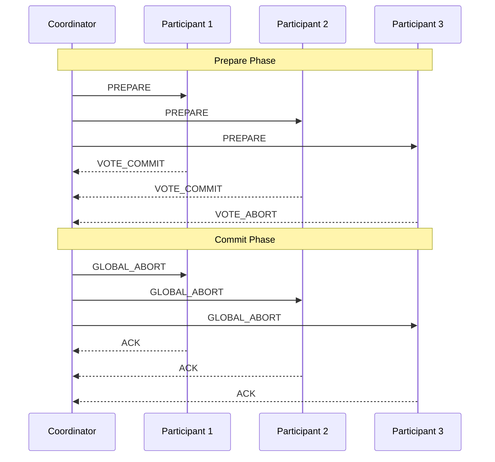
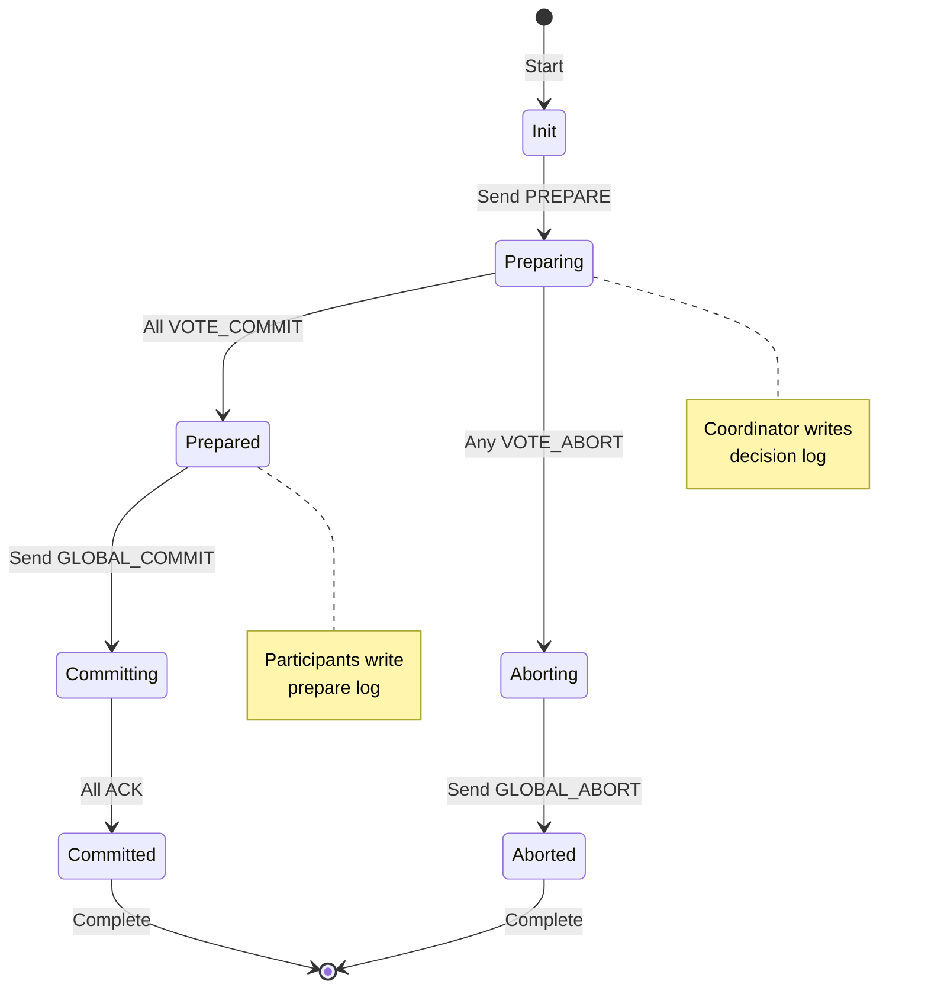
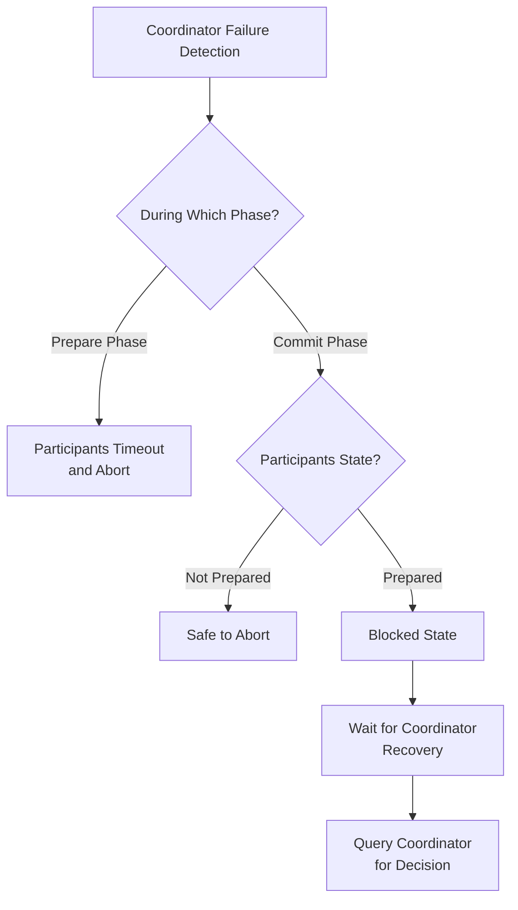
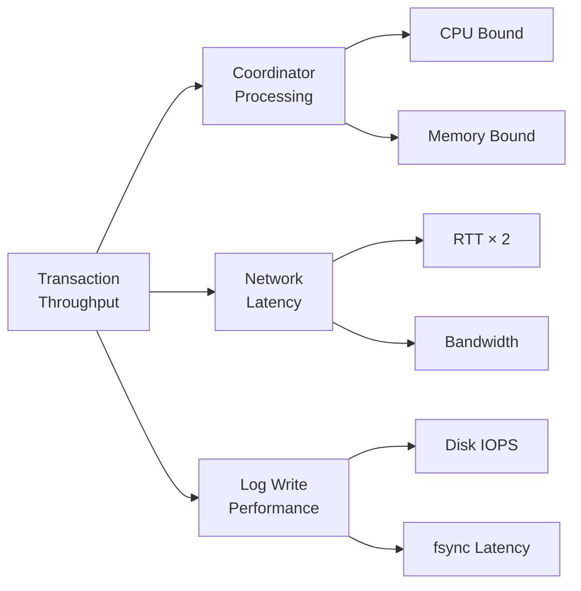

# Two-Phase Commit

分散システムにおいて、複数のノードにまたがるトランザクションを原子的に実行することは、データ整合性を保証する上で極めて重要な課題である。単一ノードのデータベースシステムでは、トランザクションのACID特性はローカルな制御によって実現できるが、複数の独立したノードが関与する場合、全てのノードが合意形成を行い、一貫した決定を下す必要がある。Two-Phase Commit（2PC）プロトコルは、この分散合意問題に対する古典的かつ基本的な解決策として、1970年代後期にJim Grayらによって提案された[^1]。

分散トランザクションの本質的な困難さは、ノード間の通信が非同期かつ信頼性が保証されないネットワークを介して行われることにある。ノードの故障、ネットワークの分断、メッセージの遅延や喪失など、様々な障害が発生する可能性がある中で、すべての参加ノードが同一の決定（コミットまたはアボート）に至ることを保証しなければならない。この問題は、分散コンピューティングにおける基本的な合意問題の一種であり、FLP不可能性定理[^2]が示すように、非同期システムにおける完全な解決は理論的に不可能である。しかし、実用的なシステムでは、タイムアウトや故障検出メカニズムを導入することで、この理論的限界を回避している。

## プロトコルの基本構造

Two-Phase Commitプロトコルは、その名前が示すように、準備フェーズ（Prepare Phase）とコミットフェーズ（Commit Phase）の2段階で構成される。プロトコルには、調整役となるコーディネータ（Coordinator）と、トランザクションに参加する複数の参加者（Participants）が存在する。コーディネータは、トランザクションの開始から終了まで全体の進行を管理し、参加者はコーディネータの指示に従って自身のローカルなトランザクション処理を実行する。



準備フェーズでは、コーディネータが各参加者に対してPREPAREメッセージを送信する。このメッセージを受信した参加者は、トランザクションをコミットする準備ができているかを判断する。具体的には、トランザクションで実行されたすべての操作が正常に完了し、必要なリソースのロックが取得され、ログエントリが永続化されているかを確認する。準備が完了した参加者はVOTE_COMMITメッセージを、何らかの理由でコミットできない参加者はVOTE_ABORTメッセージをコーディネータに返信する。

コミットフェーズでは、コーディネータが全参加者からの投票を集計し、グローバルな決定を下す。すべての参加者がVOTE_COMMITを返した場合のみ、コーディネータはGLOBAL_COMMITを送信し、そうでなければGLOBAL_ABORTを送信する。この決定は不可逆的であり、一度下された決定は変更されることはない。参加者は、コーディネータからの最終決定を受信すると、それに従ってローカルトランザクションをコミットまたはアボートし、完了通知（ACK）をコーディネータに返す。

## ログとリカバリメカニズム

Two-Phase Commitプロトコルの正確性を保証するためには、各ノードが適切なタイミングでログエントリを永続化する必要がある。これらのログは、ノード故障からのリカバリ時に、中断されたトランザクションの状態を復元し、適切な処理を再開するために使用される。

コーディネータは以下のタイミングでログを記録する：

1. トランザクション開始時：参加者リストとトランザクションIDを含む開始レコード
2. 全参加者からの投票受信後：グローバルな決定（COMMITまたはABORT）を含む決定レコード
3. 全参加者からのACK受信後：トランザクション完了を示す終了レコード

参加者は以下のタイミングでログを記録する：

1. PREPAREメッセージ受信時：トランザクションの内容と準備完了状態を含む準備レコード
2. グローバル決定受信時：最終的な決定を含む決定レコード



リカバリ時、各ノードは自身のログを読み込み、最後に記録された状態から処理を再開する。例えば、参加者が準備レコードを記録した後、グローバル決定を受信する前に故障した場合、リカバリ後はコーディネータに状態を問い合わせ、決定に従って処理を完了する。この問い合わせメカニズムは、プロトコルの正確性を保証する上で重要な役割を果たす。

## 故障モデルと対処法

Two-Phase Commitプロトコルは、様々な故障シナリオに対処する必要がある。主な故障パターンとその対処法を以下に示す。

**参加者の故障**：準備フェーズ中に参加者が故障した場合、コーディネータはタイムアウトによってこれを検出し、トランザクションをアボートする。コミットフェーズ中の故障では、参加者はリカバリ後にコーディネータから決定を取得し、処理を完了する。

**コーディネータの故障**：コーディネータの故障は、プロトコルの進行を停止させる可能性がある。特に、参加者が準備完了状態でコーディネータの決定を待っている間に故障が発生すると、参加者はトランザクションの結果を知ることができず、リソースをロックしたまま待機し続ける。この状態は「ブロッキング」と呼ばれ、Two-Phase Commitの主要な欠点の一つである。

**ネットワーク分断**：ネットワーク分断により、コーディネータと一部の参加者間の通信が不可能になる場合がある。準備フェーズでの分断は、タイムアウトによってトランザクションのアボートを引き起こす。コミットフェーズでの分断は、到達可能な参加者には決定が伝達されるが、分断された参加者は後でリカバリする必要がある。



ブロッキング問題に対処するため、実用的なシステムでは以下のような拡張が行われることがある：

- **協調的終了プロトコル**：参加者同士が通信し、他の参加者の状態を確認することで、一部のケースでコーディネータなしに決定を下す
- **ヒューリスティックな決定**：長時間のブロッキングを避けるため、管理者の介入により強制的に決定を下す（ただし、一貫性違反のリスクがある）
- **Three-Phase Commit**：追加のフェーズを導入してノンブロッキング性を実現する拡張プロトコル

## 実装上の考慮点

Two-Phase Commitプロトコルを実装する際には、理論的な正確性だけでなく、実用的な性能と信頼性も考慮する必要がある。主要な実装上の課題と解決策を以下に示す。

**タイムアウト管理**：適切なタイムアウト値の設定は、システムの応答性と誤検出のトレードオフを決定する。短すぎるタイムアウトは、一時的な遅延を故障と誤認識し、不要なアボートを引き起こす。長すぎるタイムアウトは、実際の故障検出を遅らせ、システム全体の可用性を低下させる。動的なタイムアウト調整や、ネットワーク遅延の統計情報に基づく適応的な設定が有効である。

**ログの永続化**：ログエントリの永続化は、プロトコルの正確性に不可欠であるが、ディスクI/Oのオーバーヘッドを引き起こす。グループコミットやログバッファリングなどの最適化技術により、複数のトランザクションのログエントリをまとめて書き込むことで、I/O効率を改善できる。また、不揮発性メモリ（NVRAM）の使用により、永続化のレイテンシを大幅に削減できる。

**並行性制御**：Two-Phase Commitプロトコル自体は、トランザクション間の並行性制御を規定しない。実装では、デッドロックの検出と解決、ロック粒度の最適化、楽観的並行性制御との統合など、適切な並行性制御メカニズムを組み合わせる必要がある。

```python
class TwoPhaseCommitCoordinator:
    def __init__(self, transaction_id, participants):
        self.transaction_id = transaction_id
        self.participants = participants
        self.votes = {}
        self.state = CoordinatorState.INIT
        
    def execute(self):
        # Write start log
        self.log_start()
        
        # Prepare phase
        self.state = CoordinatorState.PREPARING
        prepare_futures = []
        for participant in self.participants:
            future = self.send_prepare_async(participant)
            prepare_futures.append(future)
            
        # Collect votes with timeout
        try:
            for future in prepare_futures:
                vote = future.get(timeout=PREPARE_TIMEOUT)
                self.votes[participant] = vote
        except TimeoutError:
            self.global_decision = Decision.ABORT
            self.log_decision()
            self.send_global_abort()
            return
            
        # Make global decision
        if all(vote == Vote.COMMIT for vote in self.votes.values()):
            self.global_decision = Decision.COMMIT
        else:
            self.global_decision = Decision.ABORT
            
        # Write decision log
        self.log_decision()
        
        # Commit phase
        self.state = CoordinatorState.COMMITTING
        if self.global_decision == Decision.COMMIT:
            self.send_global_commit()
        else:
            self.send_global_abort()
            
        # Write completion log
        self.log_completion()
```

## 性能特性とスケーラビリティ

Two-Phase Commitプロトコルの性能は、主に以下の要因によって決定される：

**メッセージ複雑度**：n個の参加者に対して、プロトコルは最小でも3n個のメッセージ（n個のPREPARE、n個の投票、n個のグローバル決定）を必要とする。ACKメッセージを含めると4n個となる。この線形のメッセージ複雑度は、参加者数の増加に伴って通信オーバーヘッドを増大させる。

**レイテンシ**：プロトコルの完了には、最低でも2回のラウンドトリップ時間（準備フェーズとコミットフェーズ）が必要である。地理的に分散したシステムでは、このレイテンシが顕著になる。例えば、大陸間のRTTが100msの場合、プロトコルの基本的なレイテンシは200ms以上となる。

**スループット**：コーディネータは、各トランザクションを順次処理する必要があるため、ボトルネックとなりやすい。パイプライニングや並列処理により、複数のトランザクションを同時に処理することで、スループットを向上させることができる。



実際のシステムでの性能測定では、以下のような結果が報告されている[^3]：

- ローカルネットワーク環境（RTT < 1ms）：トランザクションあたり5-10ms
- 地域分散環境（RTT 10-50ms）：トランザクションあたり50-200ms
- グローバル分散環境（RTT > 100ms）：トランザクションあたり500ms以上

これらの性能特性は、Two-Phase Commitが比較的小規模で、レイテンシ要求が厳しくない環境に適していることを示している。

## 代替プロトコルとの比較

Two-Phase Commitの限界を克服するため、様々な代替プロトコルが提案されている。主要なプロトコルとの比較を以下に示す。

**Three-Phase Commit（3PC）**：ブロッキング問題を解決するため、準備フェーズとコミットフェーズの間に「プリコミット」フェーズを追加する。この追加フェーズにより、参加者は他の参加者の準備状態を知ることができ、コーディネータの故障時でも安全に決定を下すことができる。ただし、メッセージ複雑度が増加し（最小5n）、ネットワーク分断には依然として脆弱である[^4]。

**Paxos**：Leslie Lamportによって提案されたPaxosは、非同期システムにおける合意形成のための汎用的なプロトコルである。Two-Phase Commitと異なり、Paxosは故障耐性が高く、過半数のノードが稼働していれば進行可能である。しかし、実装が複雑で、理解が困難であることが知られている[^5]。

**Raft**：Paxosの複雑さを解決するために設計されたRaftは、リーダー選出と合意形成を明確に分離し、理解しやすい構造を持つ。分散トランザクションの文脈では、Raftをベースにしたコミットプロトコルが提案されており、高い可用性と一貫性を実現している[^6]。

各プロトコルの特性比較：

| プロトコル | メッセージ複雑度 | 故障耐性 | ブロッキング | 実装複雑度 |
|-----------|-----------------|---------|------------|-----------|
| 2PC | 3n～4n | 低 | あり | 低 |
| 3PC | 5n～6n | 中 | なし* | 中 |
| Paxos | O(n²) | 高 | なし | 高 |
| Raft | O(n) | 高 | なし | 中 |

*ネットワーク分断時を除く

## 実践的な設計指針

Two-Phase Commitプロトコルを実際のシステムに適用する際の設計指針を以下に示す。

**適用範囲の限定**：Two-Phase Commitは、すべての分散トランザクションに適しているわけではない。トランザクションの粒度、参加者数、地理的分散度を考慮し、適切な場面でのみ使用する。例えば、同一データセンター内の少数のノード間での強い一貫性が必要な場合には適しているが、グローバルに分散した多数のノード間では他のプロトコルを検討すべきである。

**補償トランザクションの活用**：長時間実行されるビジネストランザクションでは、Two-Phase Commitによるリソースのロックは実用的でない。代わりに、Sagaパターンのような補償トランザクションベースのアプローチを採用し、最終的一貫性モデルで十分な場合はこちらを選択する。

**モニタリングとアラート**：プロトコルの各フェーズの実行時間、故障率、ブロッキング発生頻度などをモニタリングし、異常を早期に検出する。特に、準備完了状態で長時間待機しているトランザクションは、システム全体のパフォーマンスに影響を与える可能性がある。

**テストとシミュレーション**：分散システムのテストは複雑であるが、故障注入（Fault Injection）やカオスエンジニアリングの手法を用いて、様々な故障シナリオでのプロトコルの動作を検証する。特に、ネットワーク分断、メッセージの遅延や喪失、ノードの故障などを系統的にテストする。

Two-Phase Commitプロトコルは、その単純さと実装の容易さから、多くの商用データベースシステムや分散トランザクション処理システムで採用されている。Oracle、PostgreSQL、MySQLなどの主要なRDBMSは、XA規格[^7]に基づいたTwo-Phase Commitの実装を提供している。また、JTAやWS-AtomicTransactionなどの標準規格も、Two-Phase Commitをベースとしている。

プロトコルの限界を理解し、適切な場面で適切に使用することで、分散システムにおける強い一貫性を効率的に実現できる。同時に、システムの要求に応じて、より高度なプロトコルや緩和された一貫性モデルを選択する柔軟性も重要である。分散トランザクション処理は、常にトレードオフの選択であり、Two-Phase Commitはその選択肢の中で重要な位置を占め続けている。

[^1]: Gray, J. (1978). Notes on data base operating systems. In Operating Systems (pp. 393-481). Springer, Berlin, Heidelberg.

[^2]: Fischer, M. J., Lynch, N. A., & Paterson, M. S. (1985). Impossibility of distributed consensus with one faulty process. Journal of the ACM (JACM), 32(2), 374-382.

[^3]: Jimenez-Peris, R., Patiño-Martinez, M., Kemme, B., & Alonso, G. (2002). Are quorums an alternative for data replication?. ACM Transactions on Database Systems (TODS), 27(3), 257-294.

[^4]: Skeen, D. (1981). Nonblocking commit protocols. In Proceedings of the 1981 ACM SIGMOD international conference on Management of data (pp. 133-142).

[^5]: Lamport, L. (1998). The part-time parliament. ACM Transactions on Computer Systems (TOCS), 16(2), 133-169.

[^6]: Ongaro, D., & Ousterhout, J. (2014). In search of an understandable consensus algorithm. In 2014 USENIX Annual Technical Conference (pp. 305-319).

[^7]: X/Open Company. (1991). Distributed Transaction Processing: The XA Specification. X/Open Company Limited.