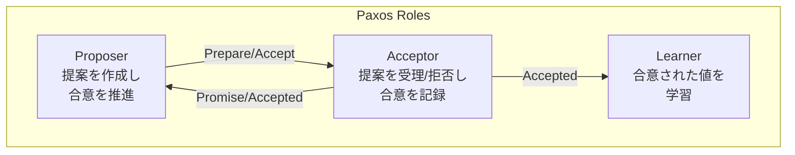
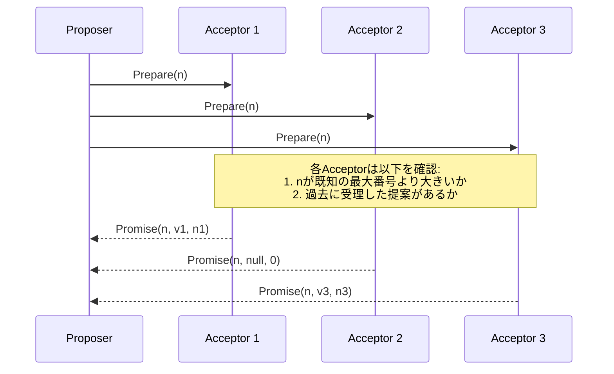
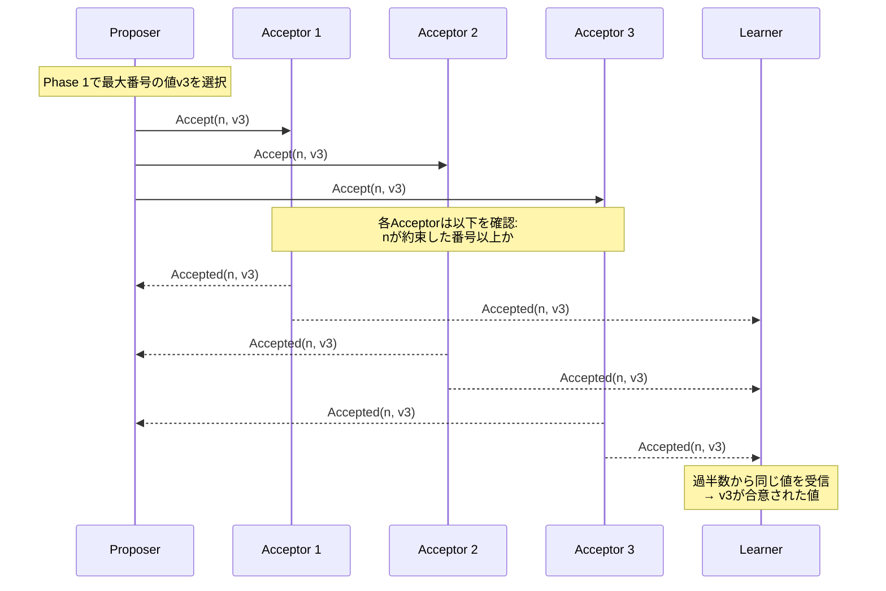
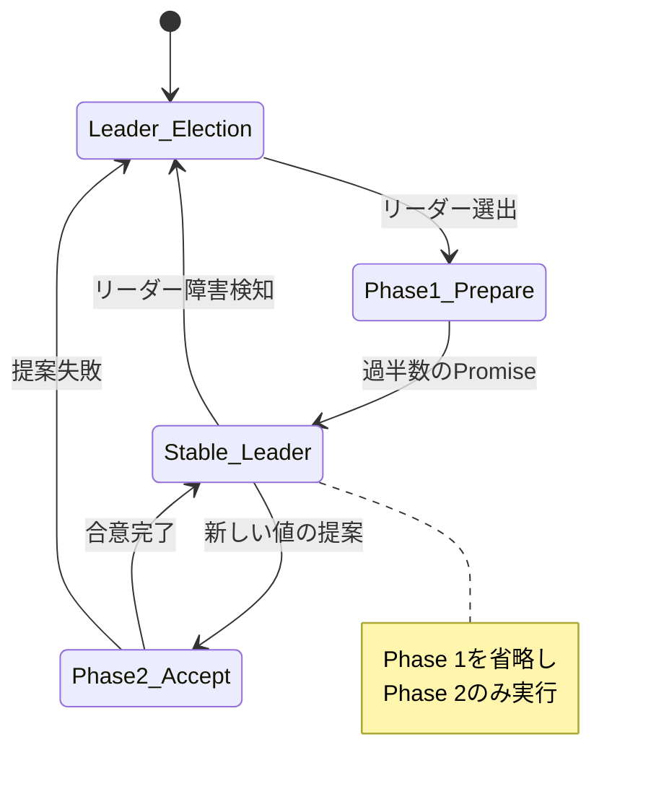

# Paxos

分散システムにおける合意形成は、複数のプロセスが単一の値に合意する必要がある基本的な問題である。ネットワーク遅延、メッセージの喪失、プロセスの故障といった障害が存在する環境において、この問題を解決することは非常に困難である。Paxosアルゴリズムは、Leslie Lamportによって提案された、非同期環境において障害耐性を持つ合意アルゴリズムである[^1]。

Paxosは、その理論的な完全性と実用性から、分散システムの分野において最も重要なアルゴリズムの一つとされている。GoogleのChubby[^2]、Apache ZooKeeper、etcdなど、多くの実用的な分散システムがPaxosまたはその派生アルゴリズムを基盤として採用している。しかし、その一方で、Paxosは理解と実装が困難であることでも知られており、「Paxos Made Simple」[^3]という論文が別途発表されるほどである。

## 合意問題とFLPの不可能性定理

Paxosを理解するためには、まず分散システムにおける合意問題の本質を理解する必要がある。合意問題は以下の特性を満たす必要がある：

- **Agreement（合意性）**: すべての正常なプロセスは同じ値に決定する
- **Validity（妥当性）**: 決定される値は、いずれかのプロセスが提案した値である
- **Termination（終了性）**: すべての正常なプロセスは最終的に何らかの値を決定する

FLP（Fischer, Lynch, Paterson）の不可能性定理[^4]は、非同期環境において、たとえ一つのプロセスの故障しか許容しない場合でも、これら三つの特性を同時に保証することは不可能であることを証明している。この定理は分散システム理論における最も重要な結果の一つであり、実用的な合意アルゴリズムは何らかの妥協を必要とすることを示している。

Paxosは、この不可能性定理に対して、終了性を犠牲にすることで対処している。つまり、Paxosは安全性（Agreement と Validity）を常に保証するが、特定の条件下では進行が停止する可能性がある。しかし実践的には、適切な条件下で高い確率で終了することが期待できる。

## Paxosの基本構造

Paxosアルゴリズムは、以下の三つの役割を持つプロセスによって構成される：

**Proposer（提案者）**は、クライアントからの要求を受けて値を提案する役割を持つ。複数のProposerが同時に異なる値を提案する可能性があり、これがPaxosが解決すべき主要な課題となる。

**Acceptor（承認者）**は、提案を受理または拒否する役割を持ち、システムの「メモリ」として機能する。Acceptorは受理した提案に関する情報を永続的に記憶し、この情報がアルゴリズムの正確性を保証する基盤となる。

**Learner（学習者）**は、合意された値を学習し、その値をシステムの他の部分に伝播する役割を持つ。Learnerは合意形成プロセスには直接参加せず、結果のみを受け取る。

実際のシステムでは、一つのプロセスが複数の役割を兼ねることが一般的である。例えば、すべてのプロセスがProposer、Acceptor、Learnerの三役を兼ねる構成も可能である。

## Paxosアルゴリズムの詳細

Paxosアルゴリズムは、二段階のプロトコルによって合意を形成する。各提案には一意の提案番号が割り当てられ、この番号によって提案の順序が決定される。

### Phase 1: Prepare段階

Proposerは、新しい提案を開始する際、まず一意の提案番号nを選択する。この番号は、これまでに使用したどの番号よりも大きくなければならない。その後、Acceptorの過半数（クォーラム）に対してPrepare(n)メッセージを送信する。

Acceptorは、Prepare(n)メッセージを受信すると、以下の処理を行う：

1. もしnが、これまでに応答したPrepareリクエストの番号よりも大きければ、nより小さい番号を持つ提案を今後受理しないことを約束する（Promise）
2. もし過去に何らかの提案を受理していれば、その中で最も番号の大きい提案の値と番号を返答に含める
3. nが既知の番号以下であれば、リクエストを無視または拒否する

Proposerは、Acceptorの過半数からPromiseメッセージを受信すると、Phase 2に進むことができる。

### Phase 2: Accept段階

Phase 1で過半数のAcceptorからPromiseを受け取ったProposerは、提案する値を決定する。この値の決定には重要なルールがある：

- もしPromiseメッセージの中に、過去に受理された提案の値が含まれていれば、その中で最も番号の大きい提案の値を採用しなければならない
- すべてのPromiseメッセージが過去の提案を含んでいなければ、Proposerは任意の値を選択できる

値vを決定した後、ProposerはAccept(n, v)メッセージを、Phase 1でPromiseを返したAcceptorに送信する。

Acceptorは、Accept(n, v)メッセージを受信すると：

1. もしnが、Phase 1で約束した番号以上であれば、提案(n, v)を受理し、この情報を永続的に記録する
2. 提案を受理した場合、Accepted(n, v)メッセージをProposerとLearnerに送信する
3. nが約束した番号より小さければ、リクエストを拒否する

Learnerは、過半数のAcceptorから同じ提案に対するAcceptedメッセージを受信すると、その値が合意されたと判断する。

## 安全性の証明

Paxosの安全性は、「一度値が選択されたら、異なる値が選択されることはない」という性質によって保証される。この証明の核心は、以下の不変条件にある：

**不変条件**: 提案番号nの提案が値vで受理されるためには、番号nより小さいすべての受理された提案の値もvでなければならない。

この不変条件は、Phase 1のメカニズムによって維持される。Proposerが新しい提案を行う際、過半数のAcceptorから過去の提案に関する情報を収集し、もし過去に提案が受理されていれば、その中で最も新しい（番号の大きい）提案の値を採用することを強制される。

過半数（クォーラム）の概念が重要である理由は、任意の二つのクォーラムが必ず共通のAcceptorを持つことにある。つまり、ある値vがクォーラムQによって受理された場合、別のクォーラムQ'を使って新しい提案を行おうとしても、Q∩Q'に属するAcceptorから必ず値vの情報を得ることになる。

## 活性と効率性

Paxosの活性（liveness）は、システムが最終的に合意に到達する性質である。しかし、前述のFLPの不可能性定理により、非同期環境では活性を保証することはできない。特に、複数のProposerが競合して提案を行う場合、以下のような活性の問題が発生する可能性がある：

二つのProposerが交互により大きな番号で提案を行い続けると、どちらの提案も完了せず、システムが進行しない状態（ライブロック）に陥る可能性がある。この問題を緩和するため、実用的なPaxos実装では以下のような対策を採用する：

1. **リーダー選出**: 単一のProposerをリーダーとして選出し、通常時はリーダーのみが提案を行う
2. **指数バックオフ**: 提案が失敗した場合、次の提案までの待機時間を指数的に増加させる
3. **提案番号の構造化**: 提案番号にProposer IDを含め、番号の衝突を避ける

メッセージの複雑性について、基本的なPaxosでは、一つの合意を達成するために以下のメッセージが必要となる：

- Phase 1: Proposerから過半数のAcceptorへのPrepare、およびその応答（2×⌈(n+1)/2⌉メッセージ）
- Phase 2: Proposerから過半数のAcceptorへのAccept、およびLearnerへの通知

合計で、O(n)のメッセージ複雑性となる。ここでnはAcceptorの数である。

## Multi-Paxosへの拡張

基本的なPaxosは単一の値に対する合意を行うが、実用的なシステムでは一連の値（ログエントリ）に対する合意が必要となる。Multi-Paxosは、この要求に対応するためのPaxosの拡張である。

Multi-Paxosの核心的なアイデアは、安定したリーダーが存在する場合、Phase 1を一度だけ実行し、その後は複数の値に対してPhase 2のみを繰り返すことである。これにより、メッセージ数を大幅に削減できる。

Multi-Paxosでは、各ログエントリに対して独立したPaxosインスタンスを実行する概念モデルを採用する。インスタンス番号iのエントリに対する合意は、他のインスタンスとは独立に進行する。しかし、実装上は、リーダーが複数のインスタンスに対するPhase 1を一括して実行することで効率化を図る。

## 実装上の考慮事項

Paxosを実用的なシステムとして実装する際には、理論的なアルゴリズムだけでなく、多くの実装上の課題に対処する必要がある。

**永続化とクラッシュリカバリ**: Acceptorは、PromiseとAcceptの情報を永続的に記憶する必要がある。これは通常、ディスクやSSDなどの不揮発性ストレージに書き込むことで実現される。クラッシュ後の再起動時には、この永続化された情報を読み込み、アルゴリズムの不変条件を維持する必要がある。

**メンバーシップ変更**: 実用的なシステムでは、Acceptorの集合（クラスタメンバーシップ）を動的に変更する必要がある。この変更自体もPaxosを使って合意する必要があり、メンバーシップ変更中の一貫性維持は複雑な問題となる。一般的なアプローチは、新旧両方のメンバーシップでクォーラムを形成する「ジョイントコンセンサス」を使用することである。

**ログコンパクション**: Multi-Paxosでは、ログが無限に成長することを防ぐため、定期的にログをコンパクション（圧縮）する必要がある。これは通常、ある時点でのシステム状態のスナップショットを作成し、それ以前のログエントリを削除することで実現される。スナップショット作成中もシステムは動作を継続する必要があり、一貫性を保ちながらこれを実現することは実装上の課題となる。

**バッチングとパイプライニング**: ネットワーク遅延を隠蔽し、スループットを向上させるため、複数の提案をバッチ処理したり、前の提案の完了を待たずに次の提案を開始するパイプライニングが使用される。これらの最適化は、アルゴリズムの正確性を維持しながら性能を向上させる重要な技術である。

**故障検知とタイムアウト**: 非同期環境では完全な故障検知は不可能であるが、実用的なシステムではタイムアウトを使用して故障を推測する。タイムアウト値の設定は、故障検知の速度と誤検知のトレードオフを決定する重要なパラメータである。

Paxosは、その理論的な優雅さと実用性から、分散システムの基盤技術として広く採用されている。しかし、その複雑性から、より理解しやすい代替アルゴリズム（特にRaft[^5]）も提案されている。それでもなお、Paxosの基本原理を理解することは、分散システムの設計と実装において重要な知識となる。特に、安全性と活性のトレードオフ、クォーラムの概念、二段階プロトコルの必要性など、Paxosが示す洞察は、他の分散アルゴリズムを理解する上でも基礎となる。

[^1]: Lamport, L. (1998). The part-time parliament. ACM Transactions on Computer Systems, 16(2), 133-169.
[^2]: Burrows, M. (2006). The Chubby lock service for loosely-coupled distributed systems. In Proceedings of the 7th symposium on Operating systems design and implementation (pp. 335-350).
[^3]: Lamport, L. (2001). Paxos made simple. ACM Sigact News, 32(4), 18-25.
[^4]: Fischer, M. J., Lynch, N. A., & Paterson, M. S. (1985). Impossibility of distributed consensus with one faulty process. Journal of the ACM, 32(2), 374-382.
[^5]: Ongaro, D., & Ousterhout, J. (2014). In search of an understandable consensus algorithm. In 2014 USENIX Annual Technical Conference (pp. 305-319).