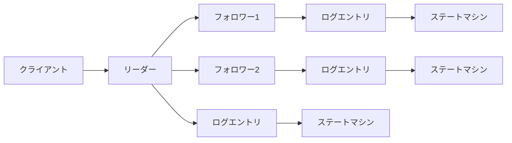
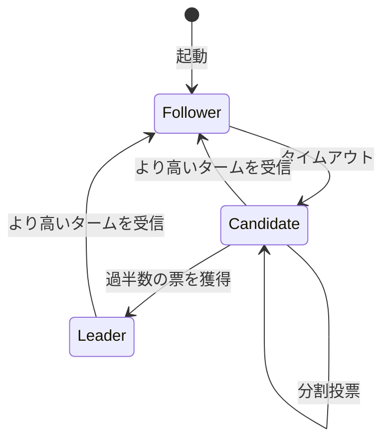
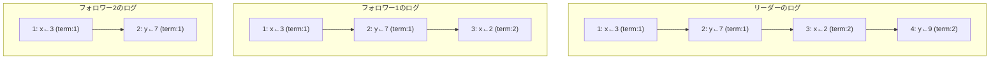
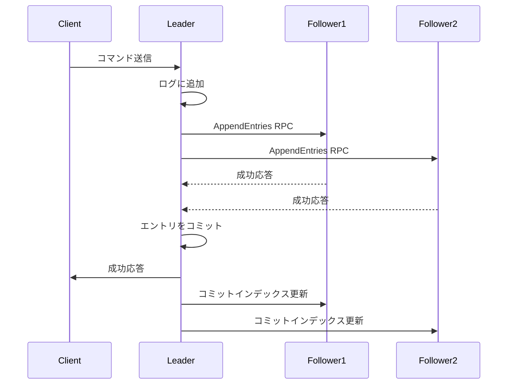

# Raft: 理解可能性を重視した分散合意アルゴリズム

分散システムにおいて、複数のノード間で一貫性のある状態を維持することは最も基本的かつ困難な課題の一つである。ネットワークの分断、ノードの故障、メッセージの遅延や喪失といった不確実性が存在する環境下で、すべてのノードが同じ値に合意する必要がある。この問題は分散合意（distributed consensus）問題として知られ、レプリケートされたステートマシンの実装において中核となる技術である。

Raftは2013年にDiego OngaroとJohn Ousterhoutによって提案された分散合意アルゴリズムである[^1]。その設計思想は、既存の合意アルゴリズムであるPaxosの複雑さに対する反省から生まれた。Paxosは理論的には完全であるものの、その抽象的な記述と実装の困難さから、多くのエンジニアにとって理解と実装が困難であった。Raftは「理解可能性」を第一の設計目標として掲げ、モジュラー性と明確な役割分担によってこの問題に取り組んだ。

[^1]: Diego Ongaro and John Ousterhout. "In Search of an Understandable Consensus Algorithm." In Proc. ATC'14, USENIX Annual Technical Conference, 2014.

## 分散合意問題の本質

分散合意問題の核心は、異なるノードが独立して動作しながらも、全体として一貫性のある決定を下す必要があることにある。この問題は、データベースのレプリケーション、分散ロック、リーダー選出など、様々な分散システムの基盤となる。FLPの不可能性定理[^2]が示すように、非同期ネットワークにおいて障害が発生する可能性がある環境では、決定的な合意アルゴリズムは存在しない。しかし、実用的なシステムでは、タイムアウトなどの仕組みを導入することで、この理論的制約を回避している。

[^2]: Michael J. Fischer, Nancy A. Lynch, and Michael S. Paterson. "Impossibility of Distributed Consensus with One Faulty Process." Journal of the ACM, 32(2):374–382, 1985.

Raftが解決する具体的な問題は、レプリケートされたログの管理である。複数のサーバーがそれぞれログのコピーを保持し、クライアントからのコマンドを同じ順序で記録する。各サーバーはこのログを順次実行することで、同じ状態に到達する。これがレプリケートされたステートマシンの基本原理である。



## Raftの基本構造

Raftは問題を3つの独立したサブ問題に分解することで、理解可能性を実現している。これらは、リーダー選出（Leader Election）、ログレプリケーション（Log Replication）、そして安全性（Safety）である。各ノードは、リーダー（Leader）、フォロワー（Follower）、候補者（Candidate）の3つの状態のいずれかを取る。



この状態遷移の設計は、システムの動作を明確にする。通常時は1つのリーダーが存在し、他のすべてのノードはフォロワーとして動作する。リーダーはクライアントからのリクエストを受け付け、ログエントリとしてフォロワーに複製する。フォロワーは受動的で、リーダーからのリクエストに応答するのみである。

タームの概念は、Raftにおける論理的な時間の単位として機能する。各タームは単調増加する整数で表され、最大1つのリーダーが存在する期間を表す。タームはリーダー選出で始まり、次のリーダー選出まで続く。この設計により、古い情報と新しい情報を明確に区別でき、スプリットブレイン問題を回避できる。

## リーダー選出の詳細メカニズム

リーダー選出は、フォロワーが一定時間リーダーからのハートビートを受信しなかった場合に開始される。このタイムアウトは選出タイムアウト（election timeout）と呼ばれ、通常150〜300ミリ秒の範囲でランダムに設定される。ランダム性は同時に複数のノードが候補者になることを防ぎ、選出の効率性を高める。

候補者になったノードは、自身のタームをインクリメントし、自分に投票した後、他のすべてのノードに投票要求（RequestVote RPC）を送信する。各ノードは1つのタームにつき最大1票しか投票できない。この制約により、1つのタームで複数のリーダーが選出されることを防ぐ。

```go
type RequestVoteArgs struct {
    Term         int    // candidate's term
    CandidateId  int    // candidate requesting vote
    LastLogIndex int    // index of candidate's last log entry
    LastLogTerm  int    // term of candidate's last log entry
}

type RequestVoteReply struct {
    Term        int  // currentTerm, for candidate to update itself
    VoteGranted bool // true means candidate received vote
}
```

投票の判断基準は2つある。第一に、候補者のタームが自身のターム以上であること。第二に、候補者のログが自身のログと同等以上に新しいこと。ログの新しさは、最後のエントリのタームで比較し、タームが同じ場合はインデックスで比較する。この制約により、古いログを持つノードがリーダーになることを防ぎ、コミット済みのエントリが失われないことを保証する。

過半数の票を獲得した候補者は新しいリーダーとなり、即座に他のノードにハートビート（AppendEntries RPCで空のエントリ）を送信して自身の権威を確立する。もし選出タイムアウトまでに過半数の票を獲得できなかった場合、新しいタームで再度選出を試みる。

## ログレプリケーションの仕組み

リーダーが確立されると、クライアントからのコマンドをログエントリとして管理し、フォロワーに複製する。各ログエントリは、ステートマシンへのコマンド、エントリが作成されたときのターム番号、そしてログ内での位置を示すインデックスを含む。



リーダーはAppendEntries RPCを使用してログエントリをフォロワーに送信する。このRPCは、新しいエントリの追加とハートビートの両方の役割を果たす。RPCには、新しいエントリの直前のエントリのインデックスとタームが含まれる。フォロワーは、この情報を使用してログの一貫性を検証する。

```go
type AppendEntriesArgs struct {
    Term         int        // leader's term
    LeaderId     int        // so follower can redirect clients
    PrevLogIndex int        // index of log entry immediately preceding new ones
    PrevLogTerm  int        // term of prevLogIndex entry
    Entries      []LogEntry // log entries to store (empty for heartbeat)
    LeaderCommit int        // leader's commitIndex
}
```

ログの一貫性チェックは、Raftの安全性を保証する重要なメカニズムである。フォロワーは、PrevLogIndexの位置に同じタームのエントリが存在する場合のみ、新しいエントリを受け入れる。存在しない場合は拒否し、リーダーはより古いエントリから再送信を試みる。この仕組みにより、リーダーとフォロワーのログが最終的に一致することが保証される。

エントリのコミットは2段階で行われる。まず、リーダーは過半数のフォロワーがエントリを複製したことを確認する。その後、エントリをコミット済みとしてマークし、ステートマシンに適用する。コミットインデックスの情報は、次のAppendEntries RPCでフォロワーに伝達され、フォロワーも同様にステートマシンに適用する。

## 安全性の保証

Raftの安全性は、いくつかの重要な性質によって保証される。最も基本的な性質は、選出制限（Election Restriction）である。これは、候補者が過半数から票を得るためには、すべてのコミット済みエントリを含んでいる必要があることを意味する。この制限により、新しいリーダーは常に最新のコミット済み状態を持つことが保証される。

リーダー完全性（Leader Completeness）は、一度コミットされたエントリは、将来のすべてのリーダーのログに存在することを保証する。これは選出制限と、リーダーが自身のタームのエントリのみをコミットするという規則によって実現される。古いタームのエントリは、新しいタームのエントリと一緒にコミットされることで間接的にコミットされる。



ステートマシン安全性（State Machine Safety）は、すべてのサーバーが同じインデックスに同じコマンドを適用することを保証する。これは、ログマッチング特性とリーダー完全性によって実現される。ログマッチング特性は、2つのエントリが同じインデックスと同じタームを持つ場合、それらは同じコマンドを含み、それ以前のすべてのエントリも一致することを保証する。

## 実装上の考慮点とパフォーマンス最適化

実際のRaft実装では、理論的な正確性を保ちながら、パフォーマンスを向上させるための様々な最適化が必要となる。最も重要な最適化の一つは、ログのスナップショット機能である。ログが無限に成長することを防ぐため、定期的にステートマシンの状態をスナップショットとして保存し、それ以前のログエントリを破棄する。

```go
type InstallSnapshotArgs struct {
    Term              int    // leader's term
    LeaderId          int    // so follower can redirect clients
    LastIncludedIndex int    // the snapshot replaces all entries up through and including this index
    LastIncludedTerm  int    // term of lastIncludedIndex
    Offset            int    // byte offset where chunk is positioned in the snapshot file
    Data              []byte // raw bytes of the snapshot chunk, starting at offset
    Done              bool   // true if this is the last chunk
}
```

バッチ処理も重要な最適化である。複数のクライアントリクエストを1つのAppendEntries RPCにまとめることで、ネットワークのラウンドトリップ回数を削減できる。ただし、レイテンシとスループットのトレードオフを考慮する必要がある。

パイプライニングは、前のRPCの応答を待たずに次のRPCを送信することで、スループットを向上させる。ただし、フォロワーのログが大きく遅れている場合は、順序を保証するために注意が必要である。

メンバーシップの変更は、運用中のクラスターの構成を安全に変更するための機能である。Raftは共同合意（joint consensus）アプローチを使用し、新旧両方の構成で過半数を得る必要がある移行期間を設けることで、安全な構成変更を実現する。

リーダーリース（leader lease）は、読み取り専用操作の最適化である。リーダーは一定期間自身がリーダーであることを保証できるため、フォロワーとの通信なしに読み取りリクエストに応答できる。これにより、読み取りのレイテンシを大幅に削減できる。

## 他の合意アルゴリズムとの比較

Raftの最も直接的な比較対象はPaxosである。Paxosは1990年代にLeslie Lamportによって提案され、長年にわたって分散合意の標準的なアルゴリズムとされてきた[^3]。Paxosは理論的には完全で、多くの実用システムで使用されているが、その理解と実装の困難さは広く認識されている。

[^3]: Leslie Lamport. "The Part-Time Parliament." ACM Transactions on Computer Systems, 16(2):133–169, 1998.

Paxosとの主な違いは、問題の分解方法にある。Paxosは単一の値に対する合意を基本とし、それを拡張してログの合意を実現する。一方、Raftは最初からログ全体の合意を考え、より自然な設計となっている。また、Paxosでは明確なリーダーの概念がなく、任意のノードが提案者となれるため、競合の解決が複雑になる。

Viewstamped Replication（VR）は、Raftと多くの類似点を持つアルゴリズムである[^4]。VRもリーダーベースのアプローチを採用し、ビュー（Raftのタームに相当）の概念を持つ。主な違いは、VRがより早い時期（1988年）に提案されたこと、そして設計の焦点が異なることである。VRは主にレプリケーションに焦点を当てているが、Raftは理解可能性を重視している。

[^4]: Barbara Liskov and James Cowling. "Viewstamped Replication Revisited." Technical Report MIT-CSAIL-TR-2012-021, MIT, 2012.

Zab（ZooKeeper Atomic Broadcast）は、Apache ZooKeeperで使用される合意アルゴリズムである。Zabもリーダーベースで、エポック（タームに相当）の概念を持つ。Zabの特徴は、プライマリーオーダーブロードキャストを提供することで、これによりZooKeeperの要件に最適化されている。

Multi-Paxosは、Paxosを拡張して複数の値の合意を効率的に行うアルゴリズムである。安定したリーダーが存在する場合、Phase 1を省略できるため、効率的な動作が可能となる。しかし、リーダーの変更時の動作が複雑で、実装が困難である。

これらのアルゴリズムと比較して、Raftの最大の利点は理解可能性である。モジュラーな設計、明確な役割分担、そして豊富な不変条件により、正しい実装を作成し、検証することが容易である。また、詳細な仕様が公開されており、多くの言語で参照実装が利用可能である点も、実用上の大きな利点となっている。

パフォーマンス面では、Raftは他のアルゴリズムと同等の性能を達成できる。リーダーベースのアプローチにより、通常時は効率的な動作が可能で、適切な最適化により高スループット・低レイテンシを実現できる。ただし、リーダー選出時には一時的にサービスが利用できなくなるため、選出の高速化が重要となる。

Raftの設計は、実用的な分散システムの構築において重要な示唆を与える。複雑な問題を理解可能な部分問題に分解し、明確な抽象化を提供することで、信頼性の高いシステムを構築できることを示している。この設計思想は、Raft以外の分散システムの設計においても適用可能であり、システムの複雑性を管理する上で重要な指針となる。