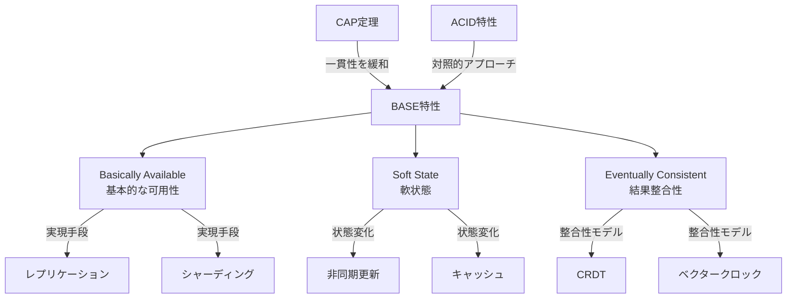
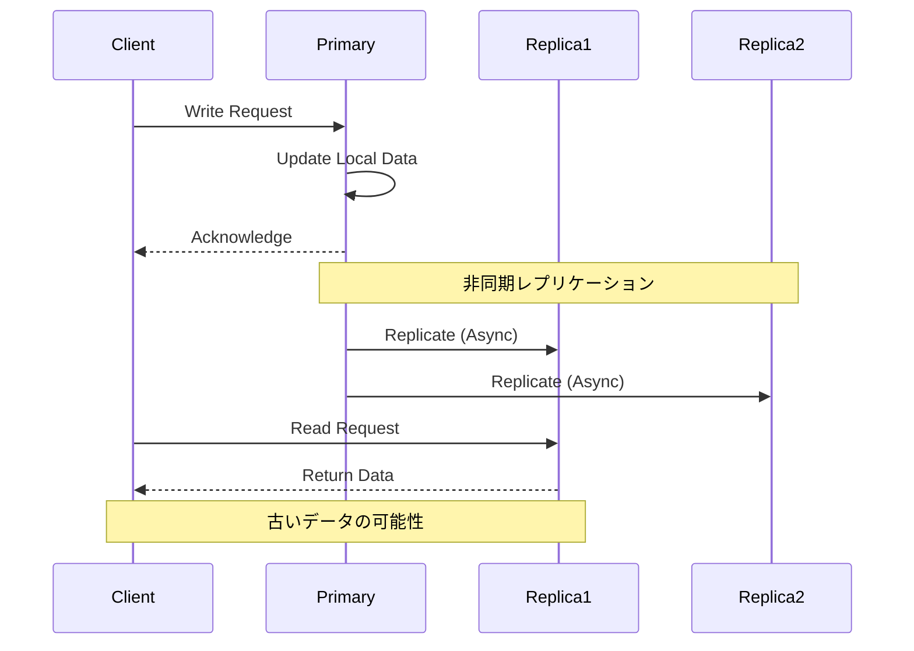
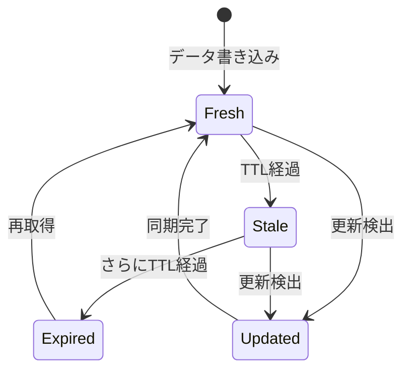
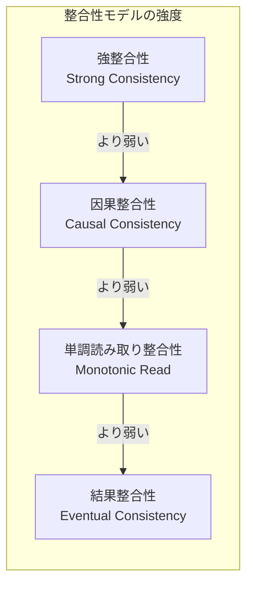
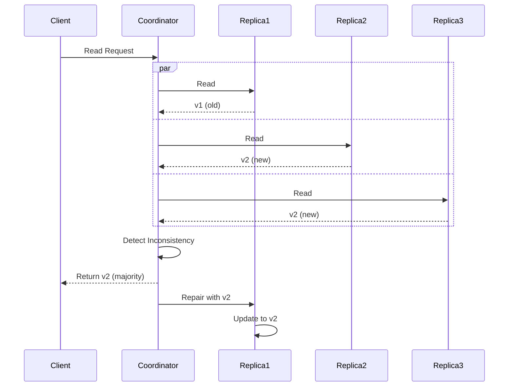
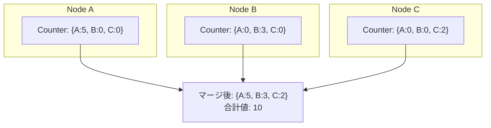
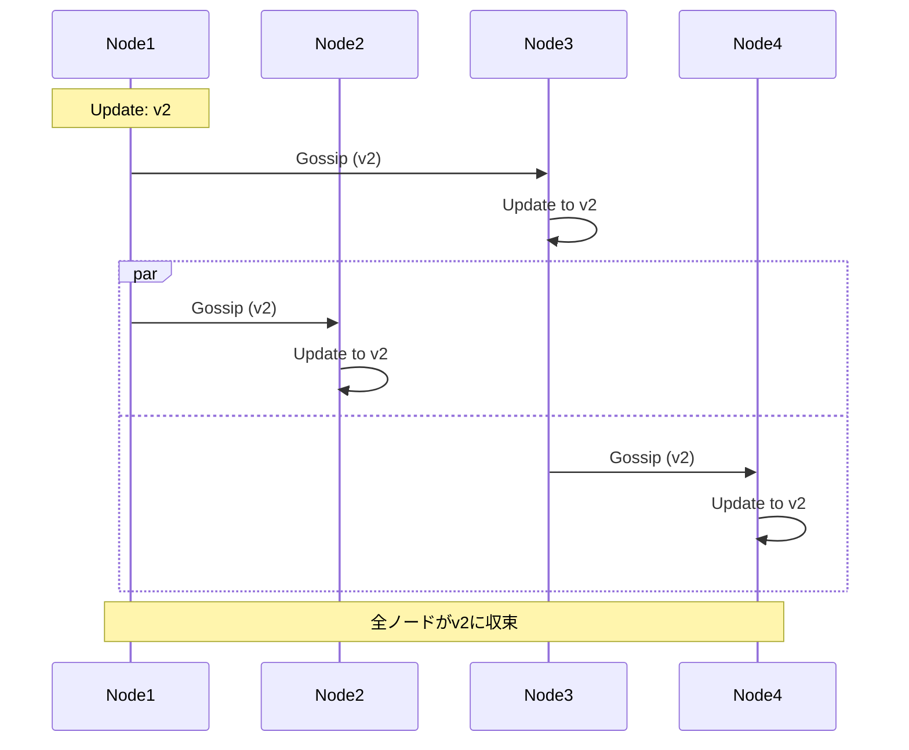

# BASE特性

分散システムの設計において、CAP定理が示す制約を受け入れながら実用的なシステムを構築するための重要なアプローチとして、BASE特性が提唱されています。BASEは「Basically Available, Soft state, Eventually consistent」の頭文字を取った造語で、2000年代初頭にeBayのエンジニアらによって広められた概念です¹。この特性は、従来のACID特性とは対照的な位置づけにあり、分散環境における可用性と性能を重視した設計指針を提供します。

CAP定理は、分散システムにおいて一貫性（Consistency）、可用性（Availability）、分断耐性（Partition tolerance）の3つを同時に満たすことは不可能であることを示しています²。現実の分散システムでは、ネットワーク分断は避けられない事象であるため、実質的には一貫性と可用性のどちらかを犠牲にする必要があります。BASE特性は、この制約の中で可用性を優先し、一貫性を緩和することで実用的なシステムを実現するアプローチです。



## Basically Available（基本的な可用性）

Basically Availableは、システムが常に基本的な動作を保証することを意味します。これは、完全な機能性や性能を保証するものではなく、システムが何らかの形で応答を返すことを優先する設計思想です。分散システムにおいて、一部のノードやネットワークに障害が発生しても、システム全体としては動作を継続できることが重要です。

基本的な可用性を実現するための主要な手法として、データのレプリケーションがあります。複数のノードにデータのコピーを保持することで、一部のノードが利用不可能になっても、他のノードからデータにアクセスできます。ただし、レプリケーション間の同期を厳密に行うと可用性が低下するため、BASE特性では非同期レプリケーションを採用することが一般的です。



シャーディングも基本的な可用性を向上させる重要な技術です。データを複数のパーティションに分割し、それぞれを異なるノードに配置することで、負荷分散と障害の影響範囲の限定化を実現します。一部のシャードが利用不可能になっても、他のシャードのデータは引き続きアクセス可能です。

基本的な可用性の実装では、障害時の振る舞いを明確に定義することが重要です。例えば、完全な機能を提供できない場合でも、読み取り専用モードで動作を継続したり、キャッシュされたデータを返したりすることで、ユーザーに対して何らかのサービスを提供し続けます。Netflixのような大規模分散システムでは、推奨システムが利用不可能な場合でも、事前に計算された一般的な推奨リストを返すことで、サービスの継続性を保っています。

## Soft State（軟状態）

Soft Stateは、システムの状態が時間とともに変化する可能性があることを認める概念です。従来のACIDトランザクションでは、明示的な変更操作なしに状態が変化することはありませんが、BASE特性では、システムの状態は外部からの入力がなくても変化し得ます。これは、非同期レプリケーション、キャッシュの期限切れ、障害からの回復プロセスなどによって引き起こされます。

軟状態の最も一般的な例は、キャッシュシステムです。キャッシュされたデータは、元のデータソースとの同期が保証されておらず、時間とともに陳腐化する可能性があります。TTL（Time To Live）を設定することで、一定期間後にキャッシュが無効化され、新しいデータで更新されます。



分散システムにおける軟状態は、レプリカ間の一時的な不整合としても現れます。マスター・スレーブ構成のデータベースでは、マスターへの書き込みがスレーブに反映されるまでに遅延が生じます。この期間中、異なるノードから読み取ったデータが異なる値を示す可能性があります。

軟状態を適切に管理するためには、状態の鮮度を示すメタデータの活用が重要です。タイムスタンプ、バージョン番号、ベクタークロックなどを用いることで、データの新旧を判断し、適切な処理を行うことができます。例えば、Cassandraでは、各データにタイムスタンプを付与し、読み取り時に複数のレプリカから異なるバージョンのデータを取得した場合、最新のタイムスタンプを持つデータを選択します³。

## Eventually Consistent（結果整合性）

Eventually Consistentは、BASE特性の中核となる概念で、システムが最終的に一貫した状態に収束することを保証します。これは、一時的な不整合を許容しながらも、十分な時間が経過し、新たな更新がなければ、すべてのレプリカが同じ値に収束することを意味します⁴。

結果整合性のモデルには、いくつかのバリエーションが存在します。最も基本的なものは、更新の順序を保証しない弱い結果整合性です。より強い保証を提供するモデルとして、因果整合性（Causal Consistency）があり、これは因果関係のある操作の順序を保証します。さらに、単調読み取り整合性（Monotonic Read Consistency）は、一度読み取った値よりも古い値を読み取らないことを保証します。



結果整合性を実現するための重要な技術として、CRDT（Conflict-free Replicated Data Types）があります⁵。CRDTは、並行して更新されたデータを自動的にマージできるデータ構造で、手動での競合解決を必要としません。例えば、G-Counter（Grow-only Counter）は、各ノードが独立してカウントを増加させ、全体の値は各ノードのカウントの合計として計算されます。

ベクタークロックは、分散システムにおける因果関係を追跡するためのメカニズムです。各ノードが論理時計を持ち、メッセージの送受信時に時計を更新することで、イベントの順序関係を決定できます。Amazon DynamoDBでは、ベクタークロックを使用して、並行更新の検出と解決を行っています⁶。

結果整合性の実装では、収束までの時間を最小化することが重要です。アンチエントロピープロトコルは、定期的にノード間でデータを比較し、差分を同期することで、結果整合性を能動的に促進します。Gossipプロトコルは、ランダムに選択したノードと情報を交換することで、効率的に情報を伝播させます。

## BASE特性の実装パターン

BASE特性を実装する際には、いくつかの確立されたパターンが存在します。Read Repairパターンは、読み取り時に複数のレプリカからデータを取得し、不整合を検出した場合に修復を行います。これにより、頻繁にアクセスされるデータほど整合性が保たれやすくなります。



Hinted Handoffパターンは、一時的に利用不可能なノードへの書き込みを、別のノードが一時的に保持し、障害が回復した後に転送します。これにより、一時的な障害があっても書き込みの可用性を維持できます。

Quorumベースのレプリケーションは、読み取りと書き込みに必要なレプリカ数を調整することで、一貫性と可用性のバランスを制御します。W + R > Nの条件を満たす場合（Wは書き込みクォーラム、Rは読み取りクォーラム、Nは総レプリカ数）、強い一貫性が保証されますが、BASE特性では通常、この条件を緩和して可用性を優先します。

## トレードオフと設計上の考慮事項

BASE特性を採用する際には、いくつかの重要なトレードオフを考慮する必要があります。まず、プログラミングモデルの複雑性が増大します。開発者は、データの不整合を前提とした設計を行う必要があり、競合解決ロジックやリトライ処理などを実装する必要があります。

パフォーマンスの観点では、BASE特性は一般的に高いスループットとレイテンシーの改善をもたらします。同期的なレプリケーションや分散トランザクションのオーバーヘッドを回避できるためです。しかし、結果整合性により、古いデータを読み取る可能性があるため、アプリケーションレベルでの対策が必要です。

運用面では、BASE特性のシステムは、部分的な障害に対してより耐性がありますが、データの整合性を監視し、必要に応じて修復するためのツールやプロセスが必要です。また、結果整合性の収束時間を測定し、SLAに含めることも重要です。

## 実世界での適用例

BASE特性は、多くの大規模分散システムで採用されています。Amazon DynamoDBは、BASE特性の代表的な実装例で、高い可用性と性能を提供しながら、結果整合性モデルを採用しています。顧客は、読み取り時に強い一貫性と結果整合性を選択でき、用途に応じて使い分けることができます。

Facebookのような大規模ソーシャルネットワークでは、ユーザーの投稿やいいねの数などが、地理的に分散したデータセンター間で非同期に同期されます。ユーザーは一時的に異なる値を見る可能性がありますが、最終的には一貫した状態に収束します。

Apache Cassandraは、BASE特性を実装した分散データベースの優れた例です。調整可能な一貫性レベル、ヒントハンドオフ、リードリペア、アンチエントロピーなど、BASE特性を実現するための多くの機能を提供しています。

## CRDTの詳細と実装

CRDT（Conflict-free Replicated Data Types）は、結果整合性を実現するための重要な技術であり、分散システムにおける並行更新の問題を根本的に解決します。CRDTには大きく分けて、状態ベースCRDT（CvRDT: Convergent Replicated Data Type）と操作ベースCRDT（CmRDT: Commutative Replicated Data Type）の2種類があります。

状態ベースCRDTは、各レプリカの状態をマージすることで収束を実現します。マージ操作は可換性、結合性、冪等性を満たす必要があります。G-Counterは最も単純な例で、各ノードが独自のカウンタを持ち、全体の値は各ノードのカウンタの合計として計算されます。



より複雑なCRDTの例として、OR-Set（Observed-Remove Set）があります。これは、要素の追加と削除を並行して行える集合データ構造です。各要素にユニークなタグを付与し、削除時にはそのタグを記録することで、追加と削除の順序に関わらず一貫した結果を得られます。

PN-Counter（Positive-Negative Counter）は、増加と減少の両方をサポートするカウンタです。内部的には2つのG-Counterを使用し、一つは増加用（P）、もう一つは減少用（N）として、最終的な値はP - Nで計算されます。

## ベクタークロックの詳細実装

ベクタークロックは、分散システムにおける因果関係を正確に追跡するメカニズムです。各ノードは論理時計のベクトルを保持し、イベントの発生順序を決定します。

```python
class VectorClock:
    def __init__(self, node_id, node_count):
        self.node_id = node_id
        self.clock = [0] * node_count
    
    def increment(self):
        """ローカルイベント発生時"""
        self.clock[self.node_id] += 1
    
    def update(self, other_clock):
        """メッセージ受信時"""
        for i in range(len(self.clock)):
            self.clock[i] = max(self.clock[i], other_clock[i])
        self.increment()
    
    def happens_before(self, other):
        """因果関係の判定"""
        return all(self.clock[i] <= other.clock[i] for i in range(len(self.clock))) \
               and any(self.clock[i] < other.clock[i] for i in range(len(self.clock)))
```

ベクタークロックの実装では、メモリ使用量が課題となることがあります。ノード数が多い場合、各メッセージにベクトル全体を付与するオーバーヘッドが大きくなります。この問題を解決するために、バージョンベクトルやドット付きバージョンベクトルなどの最適化手法が提案されています。

## Gossipプロトコルの実装詳細

Gossipプロトコルは、分散システムにおける情報伝播の効率的な手法です。各ノードは定期的にランダムな他のノードを選択し、情報を交換します。この過程は疫病の伝播に似ているため、Epidemic Protocolとも呼ばれます。



Gossipプロトコルの実装では、感染率（fanout）、ゴシップ間隔、ノード選択戦略などのパラメータが重要です。Anti-entropyとRumor-mongeringは、2つの主要なゴシップ戦略です。Anti-entropyは定期的に完全な状態を交換し、確実な収束を保証しますが、帯域幅の使用量が大きくなります。Rumor-mongeringは新しい更新のみを伝播し、効率的ですが、一部のノードに情報が届かない可能性があります。

## 監視とメトリクス

BASE特性のシステムを運用する際には、適切な監視とメトリクスの収集が不可欠です。特に重要なメトリクスには以下があります：

**収束時間メトリクス**：更新が全レプリカに伝播するまでの時間を測定します。P50、P95、P99などのパーセンタイル値を追跡することで、システムの挙動を理解できます。

**不整合ウィンドウ**：データの不整合が存在する時間帯を測定します。これは、書き込み完了から全レプリカへの伝播完了までの時間として定義されます。

**競合率**：並行更新による競合の発生頻度を測定します。高い競合率は、アプリケーション設計の見直しが必要かもしれません。

**レプリカ遅延**：マスターレプリカと各スレーブレプリカ間の遅延を継続的に監視します。異常な遅延は、ネットワーク問題やノードの過負荷を示す可能性があります。

## 性能特性と最適化

BASE特性のシステムは、適切に設計されれば優れた性能特性を示します。非同期レプリケーションにより、書き込みレイテンシーは大幅に削減されます。典型的なマスター・スレーブ構成では、同期レプリケーションと比較して10倍以上の書き込みスループット向上が見られることがあります。

読み取り性能は、レプリカの数に比例してスケールします。ただし、結果整合性により、読み取りの一貫性レベルに応じて性能が変化します。強い一貫性を要求する読み取りは、複数のレプリカへのアクセスが必要となり、レイテンシーが増加します。

キャッシングは、BASE特性のシステムにおいて特に効果的です。軟状態の概念により、キャッシュの陳腐化が許容されるため、積極的なキャッシング戦略を採用できます。CDN（Content Delivery Network）は、地理的に分散したキャッシュにより、グローバルな可用性と性能を実現する好例です。

## 実装時の設計パターン

BASE特性を実装する際の追加的な設計パターンとして、以下があります：

**Sloppy Quorum**：厳密なクォーラムではなく、利用可能な任意のN個のノードで読み書きを行います。これにより、一時的なノード障害時でも高い可用性を維持できます。

**Merkle Tree**：大量のデータの効率的な同期に使用されます。データをツリー構造でハッシュ化し、差分のある部分のみを同期することで、帯域幅を節約します。

**Read-Your-Writes Consistency**：ユーザーが自身の書き込みを必ず読み取れることを保証します。セッションアフィニティやタイムスタンプベースの読み取りにより実現されます。

**Bounded Staleness**：データの陳腐化に上限を設定します。例えば、「5秒以内の古いデータは許容するが、それ以上は許容しない」といった制約を設けます。

## BASE特性の限界と適用範囲

BASE特性がすべてのシステムに適しているわけではありません。金融取引システムや在庫管理システムなど、強い一貫性が絶対的に必要な場合には、ACID特性を維持する必要があります。これらのシステムでは、一時的な不整合が重大な問題を引き起こす可能性があります。

BASE特性とACID特性を組み合わせたハイブリッドアプローチも一般的です。例えば、重要なトランザクションにはACID特性を使用し、分析やレポーティングなどの用途にはBASE特性を使用することで、それぞれの長所を活かすことができます。

また、BASE特性のシステムでは、結果整合性の収束時間が予測困難な場合があります。ネットワークの遅延、ノードの負荷、障害の頻度などが収束時間に影響を与えるため、最悪ケースのシナリオを考慮した設計が必要です。

分散システムの設計は、常にトレードオフの選択です。BASE特性は、可用性と性能を重視するシステムにおいて強力なアプローチですが、その採用には慎重な検討と適切な実装が必要です。システムの要件を正確に理解し、適切な整合性モデルを選択することが、成功の鍵となります。

---

¹ Pritchett, D. (2008). "BASE: An Acid Alternative". ACM Queue, 6(3), 48-55.

² Brewer, E. (2000). "Towards Robust Distributed Systems". Proceedings of the 19th Annual ACM Symposium on Principles of Distributed Computing (PODC).

³ Lakshman, A., & Malik, P. (2010). "Cassandra: A Decentralized Structured Storage System". ACM SIGOPS Operating Systems Review, 44(2), 35-40.

⁴ Vogels, W. (2009). "Eventually Consistent". Communications of the ACM, 52(1), 40-44.

⁵ Shapiro, M., Preguiça, N., Baquero, C., & Zawirski, M. (2011). "Conflict-free Replicated Data Types". In Symposium on Self-Stabilizing Systems (pp. 386-400).

⁶ DeCandia, G., et al. (2007). "Dynamo: Amazon's Highly Available Key-value Store". ACM SIGOPS Operating Systems Review, 41(6), 205-220.