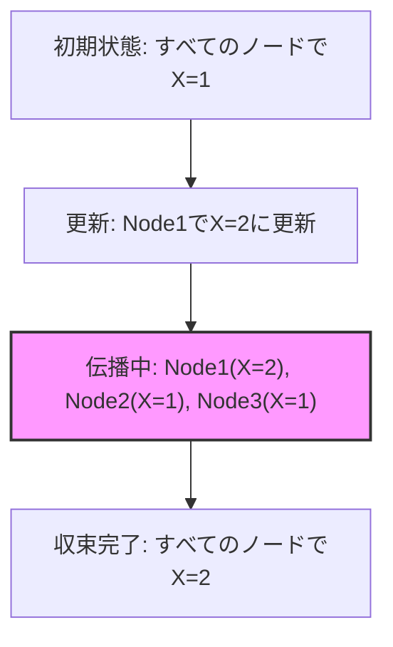
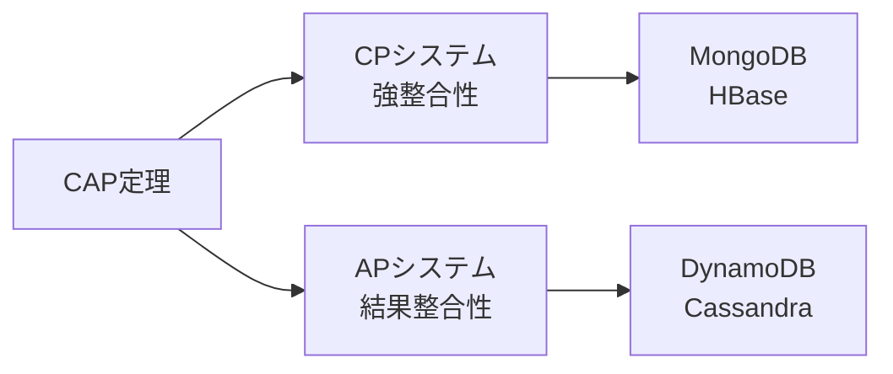
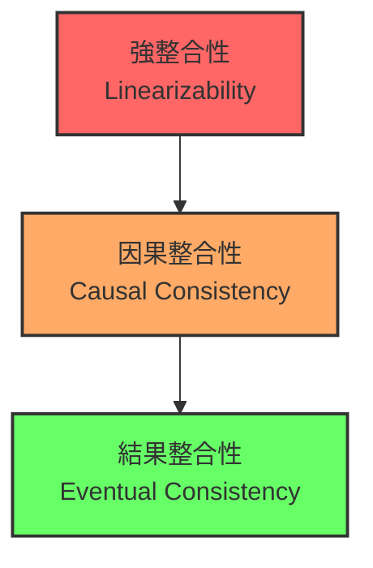
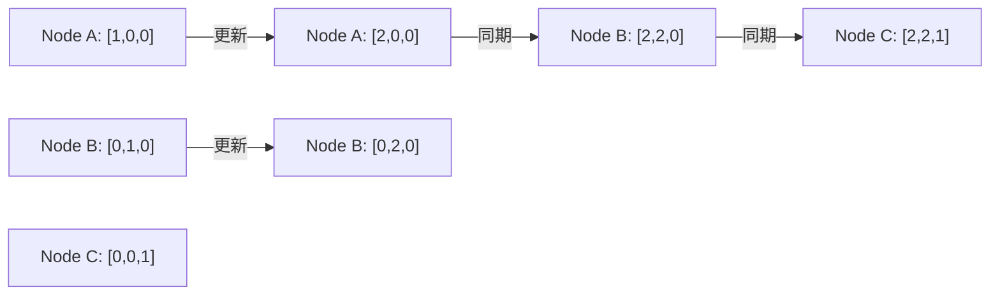
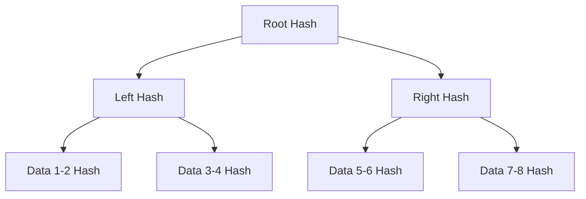

# 結果整合性（Eventual Consistency）

結果整合性は、分散システムにおいて最も重要な概念の一つであり、システムの可用性とデータ整合性のトレードオフを解決するためのアプローチです。この概念は、Amazon DynamoやCassandraといった大規模分散データベースの基礎となっており、現代のクラウドコンピューティングにおいて不可欠な要素となっています。

## 結果整合性の定義と背景

結果整合性とは、分散システムにおいて、あるデータ項目に対する更新が行われた後、一定時間が経過すれば、すべてのノードが最終的に同じ値に収束することを保証する整合性モデルです。この「最終的に」という表現が重要で、更新直後はノード間でデータの不整合が存在することを許容します。

Werner Vogelsは2009年の論文¹で結果整合性を次のように定義しています：「システムに対する更新がない状態が続けば、すべてのレプリカは最終的に同じ値に収束する」。この定義は、更新が継続的に行われる場合でも、各更新に対して独立に収束が保証されることを含意しています。



## CAP定理との関係

結果整合性を理解するには、Eric Brewerが提唱したCAP定理²との関係を理解することが不可欠です。CAP定理は、分散システムにおいて以下の3つの特性のうち、同時に満たせるのは最大2つまでであることを示しています：

- **一貫性（Consistency）**: すべてのノードが同時に同じデータを参照できる
- **可用性（Availability）**: システムは常に読み書き要求に応答できる
- **分断耐性（Partition tolerance）**: ネットワークの分断が発生してもシステムは動作を継続できる

現実の分散システムではネットワーク分断は避けられないため、実質的にはCPシステム（一貫性＋分断耐性）かAPシステム（可用性＋分断耐性）のどちらかを選択することになります。結果整合性は、APシステムを選択した場合の整合性モデルです。



## 結果整合性の理論的基礎

結果整合性の理論的基礎は、分散システムにおける時間とイベントの順序に関する研究に根ざしています。Leslie Lamportの論理時計³やベクトルクロック⁴は、分散システムにおけるイベントの因果関係を追跡するための基礎技術として、結果整合性システムの実装に不可欠です。

### 因果整合性との関係

結果整合性は、より厳密な整合性モデルである因果整合性（Causal Consistency）の緩和版として位置づけることができます。因果整合性は、因果関係のある操作については、すべてのノードで同じ順序で観測されることを保証します。一方、結果整合性は、最終的な収束のみを保証し、収束過程での順序は問いません。



## 実装メカニズム

結果整合性を実現するための主要な実装メカニズムは以下の通りです：

### ゴシッププロトコル

ゴシッププロトコル（Gossip Protocol）は、疫病の伝播モデルに基づいたデータ伝播メカニズムです。各ノードは定期的にランダムに選択した他のノードと情報を交換し、最新の更新情報を伝播させます。このプロトコルの特徴は、ネットワークの一部に障害が発生しても、残りの部分で情報伝播が継続されることです。

Amazon DynamoDBでは、ゴシッププロトコルを使用してメンバーシップ情報とデータの更新を伝播しています⁵。各ノードは毎秒1回、ランダムに選ばれたピアノードと情報を交換し、O(log N)の時間複雑度で全ノードに情報が伝播されることが証明されています。

### ベクトルクロック

ベクトルクロックは、分散システムにおけるイベントの因果関係を追跡するためのメカニズムです。各ノードは、自身のイベントカウンタと他のノードのイベントカウンタのベクトルを保持します。これにより、2つのイベント間の因果関係（happened-before関係）を判定できます。



### CRDTによる自動収束

Conflict-free Replicated Data Types（CRDT）は、更新の衝突を自動的に解決し、すべてのレプリカが同じ状態に収束することを数学的に保証するデータ構造です。CRDTには2つの主要なタイプがあります：

1. **State-based CRDT（CvRDT）**: 状態全体を交換し、結合演算子（join）によってマージする
2. **Operation-based CRDT（CmRDT）**: 操作を交換し、可換な操作によって収束を保証する

例えば、G-Counterは単調増加するカウンタのCRDTで、各ノードが独立してカウントを増やし、値の読み取り時には全ノードの値の合計を返します。

```python
class GCounter:
    def __init__(self, node_id, num_nodes):
        self.node_id = node_id
        self.counts = [0] * num_nodes
    
    def increment(self):
        self.counts[self.node_id] += 1
    
    def merge(self, other):
        for i in range(len(self.counts)):
            self.counts[i] = max(self.counts[i], other.counts[i])
    
    def value(self):
        return sum(self.counts)
```

## 実践的な設計パターン

### Read Repairパターン

Read Repairは、読み取り操作時に検出された不整合を修正するパターンです。クライアントが複数のレプリカから読み取りを行い、異なる値を受け取った場合、最新の値（通常はタイムスタンプで判定）を古い値を持つレプリカに書き戻します。

Cassandraでは、読み取り一貫性レベルに応じて、バックグラウンドでRead Repairを実行します。これにより、頻繁にアクセスされるデータほど早く整合性が達成される特性があります。

### Anti-Entropyパターン

Anti-Entropyは、定期的にレプリカ間の差分を検出し、同期を行うバックグラウンドプロセスです。Merkle Tree⁶を使用して効率的に差分を検出し、必要な部分のみを同期します。



### Hinted Handoffパターン

Hinted Handoffは、一時的に利用不可能なノードへのデータを、別のノードが一時的に保持するパターンです。元のノードが復旧した際に、保持していたデータを転送します。これにより、一時的なノード障害時でも書き込み可用性を維持できます。

## 実世界での実装例

### Amazon DynamoDB

Amazon DynamoDBは、結果整合性を基本とした分散Key-Valueストアです。以下の特徴を持ちます：

- **Consistent Hashing**: データの分散とレプリケーションに一貫性ハッシュを使用
- **Sloppy Quorum**: 厳密なクォーラムではなく、利用可能なノードでクォーラムを形成
- **Vector Clock**: 更新の衝突検出にベクトルクロックを使用
- **Merkle Tree**: Anti-Entropyプロセスで差分検出に使用

DynamoDBでは、読み取り時に「Eventually Consistent Read」と「Strongly Consistent Read」を選択でき、アプリケーションの要件に応じて整合性レベルを調整できます。

### Apache Cassandra

Apache Cassandraは、結果整合性を採用した列指向分散データベースです。以下の特徴があります：

- **Tunable Consistency**: 操作ごとに整合性レベルを調整可能
- **Gossip Protocol**: クラスタメンバーシップとスキーマ情報の伝播
- **Read Repair**: 読み取り時の不整合検出と修正
- **Hinted Handoff**: 一時的なノード障害への対応

Cassandraの整合性レベルは、ONE、QUORUM、ALLなど複数から選択でき、可用性と整合性のトレードオフを細かく制御できます。

### Redis Cluster

Redis Clusterは、結果整合性モデルを採用した分散インメモリデータストアです：

- **Asynchronous Replication**: マスターからスレーブへの非同期レプリケーション
- **Gossip Protocol**: ノード間の状態情報共有
- **Eventual Consistency**: レプリケーションラグによる一時的な不整合を許容

Redis Clusterでは、WAIT コマンドを使用して、特定の数のレプリカへの伝播を待つことで、整合性レベルを調整できます。

## 性能特性とトレードオフ

結果整合性システムの性能特性は、以下の要因に大きく依存します：

### レプリケーション遅延

レプリケーション遅延は、更新がすべてのレプリカに伝播するまでの時間です。この遅延は、ネットワーク遅延、レプリカ数、更新頻度などに依存します。一般的に、地理的に分散したシステムでは、大陸間で数百ミリ秒の遅延が発生します。

### 収束時間

収束時間は、システムが最終的に一貫した状態に到達するまでの時間です。ゴシッププロトコルを使用する場合、収束時間は O(log N) × ゴシップ間隔 となります。例えば、1000ノードのクラスタで1秒間隔のゴシップの場合、約10秒で収束します。

### 読み取り修復のオーバーヘッド

Read Repairは追加のネットワーク通信を必要とするため、読み取りレイテンシに影響を与えます。Cassandraでは、read_repair_chanceパラメータで確率的にRead Repairを実行し、オーバーヘッドを制御できます。

## 設計上の考慮事項

### 衝突解決戦略

結果整合性システムでは、同じデータに対する同時更新による衝突が避けられません。主な衝突解決戦略には以下があります：

1. **Last Write Wins (LWW)**: タイムスタンプが最新の更新を採用
2. **Multi-Value**: すべての衝突する値を保持し、アプリケーションで解決
3. **CRDT**: 数学的に衝突しないデータ構造を使用
4. **Application-specific**: アプリケーション固有のロジックで解決

LWWは実装が簡単ですが、同時更新で一方が失われる可能性があります。Multi-Valueは柔軟性が高いですが、アプリケーションの複雑性が増します。

### 監視とデバッグ

結果整合性システムの監視では、以下のメトリクスが重要です：

- **レプリケーションラグ**: 各レプリカ間の遅延時間
- **衝突頻度**: 単位時間あたりの衝突発生数
- **収束時間**: 更新から全レプリカ収束までの時間
- **Read Repair頻度**: Read Repairの実行回数

これらのメトリクスを継続的に監視し、異常な値を検出することで、システムの健全性を維持できます。

### 一貫性の境界

結果整合性システムでも、特定の操作には強い整合性が必要な場合があります。以下のパターンで対応できます：

1. **Conditional Updates**: If-Then-Else形式の条件付き更新
2. **Linearizable Operations**: 特定の操作のみ線形化可能性を保証
3. **Consistency Zones**: データの一部に強整合性を適用

例えば、銀行システムでは、残高確認は結果整合性で十分ですが、送金処理には強い整合性が必要です。

## パフォーマンスチューニング

### レプリケーションファクタの最適化

レプリケーションファクタ（RF）は、データの複製数を決定します。RFが高いほど耐障害性は向上しますが、書き込み性能とストレージコストが増加します。一般的に、RF=3が良いバランスとされています。

### クォーラムサイズの調整

読み取りクォーラム（R）と書き込みクォーラム（W）の設定により、整合性と性能のトレードオフを制御できます。R + W > RFの場合、強い整合性が保証されます。例えば、RF=3の場合：

- W=1, R=1: 高い可用性、弱い整合性
- W=2, R=2: バランス型
- W=3, R=1: 書き込み整合性重視
- W=1, R=3: 読み取り整合性重視

### ゴシップ間隔の調整

ゴシップ間隔を短くすると収束時間は短縮されますが、ネットワークトラフィックが増加します。典型的な設定値は1秒ですが、ネットワーク帯域幅とレイテンシ要件に応じて調整が必要です。

## セキュリティ考慮事項

結果整合性システムには特有のセキュリティ課題があります：

### タイミング攻撃

レプリケーション遅延を利用したタイミング攻撃により、一時的な不整合状態を悪用される可能性があります。例えば、二重支払い攻撃では、異なるレプリカに同時に矛盾する取引を送信することで、一時的に両方の取引を成功させる試みが可能です。

### Byzantine障害への対応

悪意のあるノードが存在する環境では、結果整合性だけでは不十分です。Byzantine Fault Tolerant（BFT）アルゴリズムとの組み合わせが必要になります。例えば、PBFT（Practical Byzantine Fault Tolerance）⁷を結果整合性と組み合わせることで、悪意のあるノードに対する耐性を持たせることができます。

## 数学的形式化

結果整合性の形式的な定義は、以下のように表現できます：

$$
\forall i, j \in \text{Replicas}, \forall t \geq t_0 + \Delta : \text{state}_i(t) = \text{state}_j(t)
$$

ここで、$t_0$は最後の更新時刻、$\Delta$は収束に必要な時間上限を表します。

より厳密には、Shapiroらによる形式化⁸では、以下の条件を満たすシステムとして定義されています：

1. **Eventual Delivery**: 送信されたメッセージは最終的に配送される
2. **Convergence**: 更新が停止すれば、すべてのレプリカは同じ状態に収束する
3. **Termination**: すべての操作は有限時間で完了する

## 実装上の落とし穴と回避策

### クロックスキューの問題

分散システムでは、各ノードのクロックが完全に同期していることは保証されません。NTPを使用しても、数ミリ秒から数秒のずれが生じる可能性があります。これは、LWW戦略を使用する場合に特に問題となります。

対策として、Hybrid Logical Clocks（HLC）⁹の使用が推奨されます。HLCは物理時刻と論理時刻を組み合わせ、因果関係を保持しながらクロックスキューの影響を最小化します。

### Split Brainシナリオ

ネットワーク分断により、クラスタが複数の独立したサブクラスタに分かれる場合があります。各サブクラスタが独立して更新を受け付けると、収束時に大規模な衝突が発生します。

対策として、以下のアプローチがあります：

1. **Majority Quorum**: 過半数のノードを含むサブクラスタのみが更新を受け付ける
2. **Witness Nodes**: 投票専用のノードを地理的に分散配置
3. **Fencing Token**: 各エポックに一意のトークンを割り当て、古いエポックの更新を拒否

### カスケード障害

一つのノードの障害が連鎖的に他のノードに影響を与える場合があります。例えば、Hinted Handoffにより、障害ノードの負荷が他のノードに集中し、それらのノードも過負荷で障害を起こす可能性があります。

対策として：

1. **Circuit Breaker**: 一定の失敗率を超えたら、一時的に該当ノードへの通信を停止
2. **Load Shedding**: 過負荷時に低優先度のリクエストを拒否
3. **Adaptive Timeout**: ネットワーク状況に応じてタイムアウト値を動的に調整

## 将来の発展方向

結果整合性の研究は継続的に進化しており、以下の方向での発展が期待されています：

### エッジコンピューティングへの適用

エッジコンピューティング環境では、デバイスの断続的な接続性と限られたリソースという制約があります。この環境に適した軽量な結果整合性プロトコルの開発が進んでいます。例えば、Delta-CRDTs¹⁰は、状態全体ではなく差分のみを伝播することで、帯域幅を削減します。

### 機械学習との統合

機械学習を使用して、アプリケーションのアクセスパターンを学習し、レプリケーション戦略を動的に最適化する研究が行われています。例えば、頻繁にアクセスされるデータは積極的にレプリケートし、アクセス頻度の低いデータは遅延レプリケーションを行うなどの最適化が可能です。

### ブロックチェーンとの融合

ブロックチェーン技術と結果整合性を組み合わせることで、信頼できない環境での分散合意を実現する研究が進んでいます。例えば、Conflict-free Replicated Data Types on Blockchain（CRDTs on Blockchain）では、CRDTの収束特性とブロックチェーンの不変性を組み合わせています。

結果整合性は、分散システムにおける基本的な設計原則として、今後も重要な役割を果たし続けるでしょう。システムの規模が拡大し、地理的な分散が進むにつれて、その重要性はさらに高まることが予想されます。

---

¹ Werner Vogels. "Eventually Consistent - Revisited." All Things Distributed, 2008.

² Eric Brewer. "CAP Twelve Years Later: How the 'Rules' Have Changed." IEEE Computer, 2012.

³ Leslie Lamport. "Time, Clocks, and the Ordering of Events in a Distributed System." Communications of the ACM, 1978.

⁴ Colin J. Fidge. "Timestamps in Message-Passing Systems That Preserve the Partial Ordering." Australian Computer Science Communications, 1988.

⁵ Giuseppe DeCandia et al. "Dynamo: Amazon's Highly Available Key-value Store." SOSP '07: Proceedings of the 21st ACM SIGOPS symposium on Operating systems principles, 2007.

⁶ Ralph C. Merkle. "A Digital Signature Based on a Conventional Encryption Function." CRYPTO '87: Advances in Cryptology, 1987.

⁷ Miguel Castro and Barbara Liskov. "Practical Byzantine Fault Tolerance." OSDI '99: Proceedings of the 3rd Symposium on Operating Systems Design and Implementation, 1999.

⁸ Marc Shapiro et al. "Conflict-free Replicated Data Types." SSS'11: Proceedings of the 13th international conference on Stabilization, Safety, and Security of Distributed Systems, 2011.

⁹ Sandeep Kulkarni et al. "Logical Physical Clocks." OPODIS'14: 18th International Conference on Principles of Distributed Systems, 2014.

¹⁰ Paulo Sérgio Almeida et al. "Delta State Replicated Data Types." Journal of Parallel and Distributed Computing, 2018.