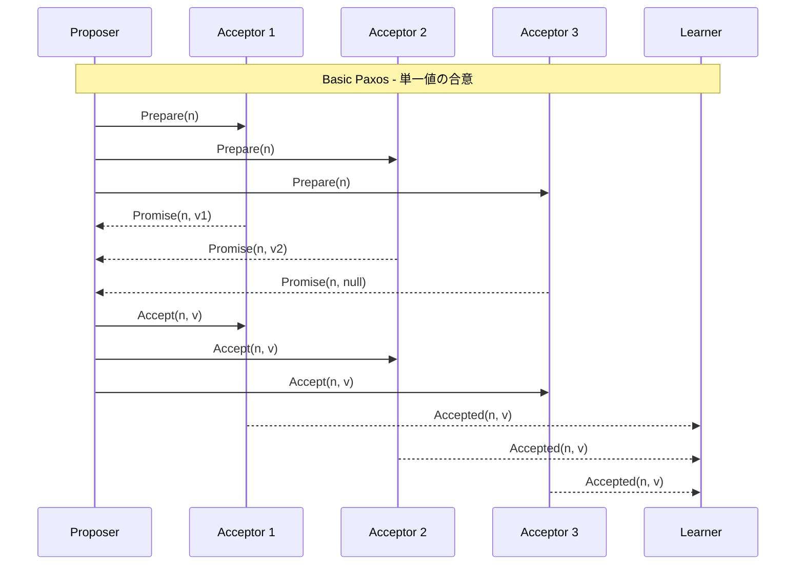
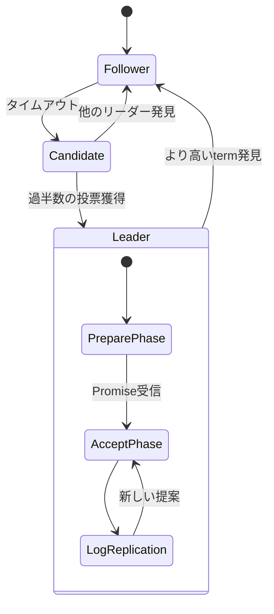
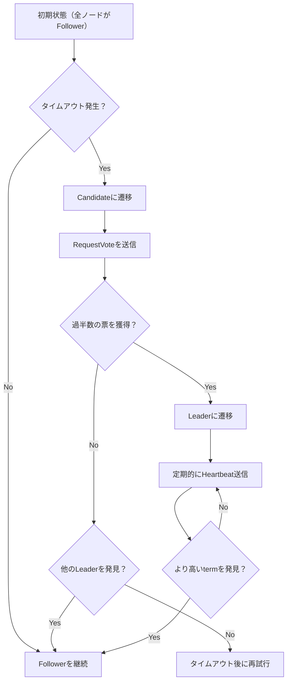
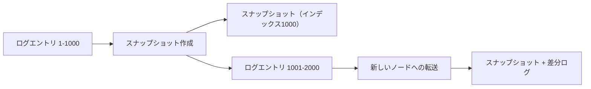
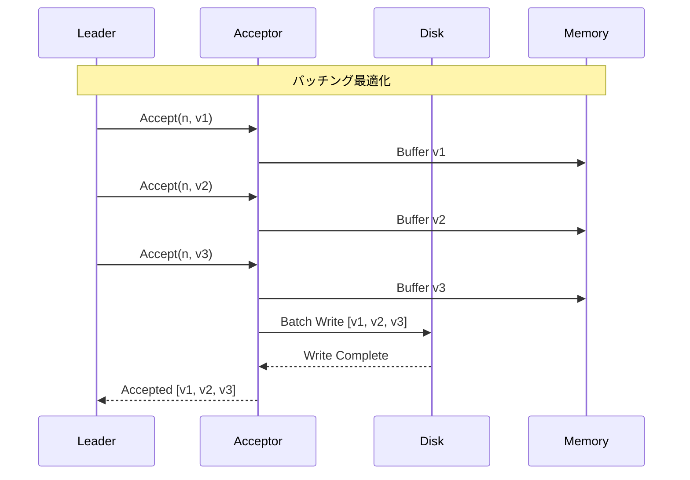
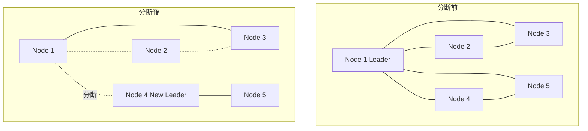
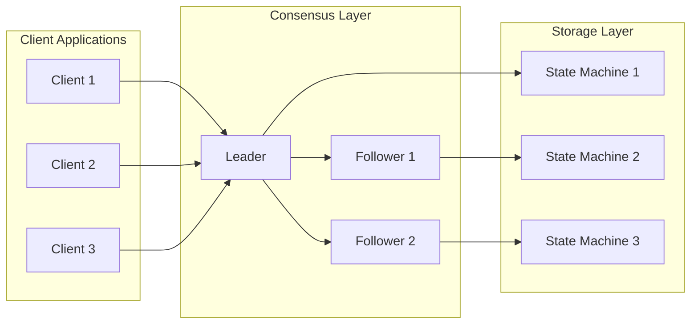

# Multi-Paxos

分散システムにおける合意形成は、複数のノードが協調して動作する上で最も基本的かつ重要な問題の一つである。Leslie LamportによってPaxosアルゴリズムが提案されて以来、このアルゴリズムは分散合意形成の理論的基盤として広く認識されている。しかし、Basic Paxosは単一の値に対する合意形成を扱うものであり、実際のシステムでは複数の値に対して連続的に合意を形成する必要がある。Multi-Paxosは、この実践的な要求に応えるためにBasic Paxosを拡張したアルゴリズムである[^1]。

本稿では、Multi-Paxosの動作原理、最適化手法、実装上の課題について詳細に解説する。特に、Basic Paxosからの進化、リーダー選出の重要性、フェーズの最適化による性能向上、そして実際のシステムでの適用例について深く掘り下げる。

## Basic Paxosからの進化

Basic Paxosは、分散環境において単一の値に対する合意を形成するアルゴリズムである。このアルゴリズムは、proposer、acceptor、learnerという3つの役割を定義し、2つのフェーズ（PrepareフェーズとAcceptフェーズ）を通じて合意を形成する。Basic Paxosの安全性は数学的に証明されており、ノードの故障やネットワークの分断が発生しても、異なる値で合意が形成されることはない。

しかし、実際の分散システムでは、単一の値ではなく、一連の操作やコマンドに対して合意を形成する必要がある。例えば、分散データベースでは、トランザクションのログエントリを順序付けて合意する必要がある。各エントリに対してBasic Paxosを実行することは可能だが、これは非常に非効率的である。なぜなら、各合意に対して2つのフェーズが必要となり、メッセージの往復回数が増大するからである。

Multi-Paxosは、この問題を解決するために、リーダーという概念を導入した。安定したリーダーが存在する場合、Prepareフェーズを一度実行するだけで、その後は複数の値に対してAcceptフェーズのみを実行できる。これにより、メッセージの往復回数を大幅に削減し、システムのスループットを向上させることができる。

## アルゴリズムの詳細

Multi-Paxosの中核となるアイデアは、proposal numberを複数のインスタンスで共有することである。各インスタンスは、合意すべき値のスロットを表す。リーダーは、一度Prepareフェーズを成功させると、そのproposal numberを使って複数のインスタンスでAcceptフェーズを実行できる。

リーダーの動作は以下のように進行する：

1. **リーダー選出**: ノードは最初followerとして動作する。一定時間リーダーからのハートビートを受信しなかった場合、candidateとなってリーダー選出を開始する。proposal numberは、ノードIDとカウンタの組み合わせで構成され、全順序関係を持つ。

2. **Prepareフェーズ**: 新しいリーダーは、最大のproposal numberでPrepareメッセージを全てのacceptorに送信する。acceptorは、それまでに受け入れた最大のproposal numberとその値を返信する。過半数のacceptorからPromiseを受信したら、リーダーはそのproposal numberを確定する。

3. **値の選択**: リーダーは、Promiseメッセージで受信した値の中から、各インスタンスについて最も新しい（proposal numberが最大の）値を選択する。値が存在しない場合は、新しい値を提案できる。

4. **Acceptフェーズの連続実行**: リーダーは、確定したproposal numberを使って、複数のインスタンスに対してAcceptメッセージを送信する。各インスタンスは独立しているため、並列に処理できる。

Multi-Paxosの重要な性質は、異なるインスタンス間での独立性である。インスタンスiの合意形成は、インスタンスjの合意形成に影響を与えない。これにより、一部のインスタンスで合意形成が遅延しても、他のインスタンスは進行できる。ただし、アプリケーション層では、通常は順序保証が必要となるため、コミットされたエントリを順番に適用する必要がある。

## リーダー選出とフェーズの最適化

Multi-Paxosの性能は、安定したリーダーの存在に大きく依存する。リーダーが頻繁に変更されると、Prepareフェーズが繰り返し実行され、性能が低下する。そのため、効率的なリーダー選出メカニズムと、リーダーの安定性を保つための工夫が重要となる。

リーダー選出では、以下の最適化が一般的に実装される：

**タイムアウトのランダム化**: 各ノードは異なるタイムアウト値を使用することで、複数のノードが同時にcandidateになることを防ぐ。タイムアウト値は通常、基準値に対してランダムなジッタを加えて決定される。例えば、150-300msの範囲でランダムに選択される。

**事前投票（Pre-vote）**: candidateになる前に、非公式な投票を行うことで、不要なリーダー選出を防ぐ。ノードは、過半数のノードから「もし選挙を開始したら投票する」という応答を得られた場合のみ、実際の選挙を開始する[^2]。

**リース（Lease）**: リーダーは一定期間、他のノードがリーダー選出を開始しないことを保証するリースを取得する。これにより、ネットワークの一時的な分断によるリーダーの変更を防ぐことができる。

フェーズの最適化において最も重要なのは、Prepareフェーズの省略である。安定したリーダーが存在する場合、以下の条件でPrepareフェーズを省略できる：

1. リーダーが自身のproposal numberが最大であることを確信している
2. 全てのacceptorがそのproposal numberより小さい値しか受け入れていない
3. リーダーのリースが有効である

これらの条件を満たす場合、リーダーは新しい値に対して直接Acceptフェーズを実行できる。これにより、合意形成のレイテンシーは1往復（1 RTT）に削減される。

## 実装上の考慮事項

Multi-Paxosを実際のシステムに実装する際には、理論的なアルゴリズムに加えて、多くの実践的な課題に対処する必要がある。

**ログの管理とスナップショット**: Multi-Paxosでは、合意されたエントリのログが無限に増大する可能性がある。これを防ぐため、定期的にスナップショットを作成し、古いログエントリを削除する必要がある。スナップショットの作成は、アプリケーションの状態と密接に関連するため、アプリケーション層との協調が必要となる。

**設定変更（Configuration Change）**: システムの運用中に、ノードの追加や削除が必要となることがある。Multi-Paxosでは、設定変更自体も合意形成の対象となる。安全な設定変更のために、joint consensusという手法が用いられる。これは、古い設定と新しい設定の両方で過半数の合意を必要とする移行期間を設けることで、split-brainを防ぐ[^3]。

**フロー制御とバックプレッシャー**: リーダーがフォロワーの処理能力を超えて提案を送信すると、システムが不安定になる可能性がある。これを防ぐため、以下のメカニズムが実装される：

1. **スライディングウィンドウ**: 各フォロワーに対して、未確認のエントリ数に上限を設ける
2. **適応的レート制限**: フォロワーの応答時間に基づいて、送信レートを動的に調整する
3. **バッチング**: 複数の提案を一つのメッセージにまとめることで、ネットワークオーバーヘッドを削減する

**永続化の最適化**: acceptorは、Promiseメッセージを送信する前に、proposal numberを永続化する必要がある。これは、ノードが再起動した後も一貫性を保つために必要である。しかし、毎回の書き込みは性能のボトルネックとなる可能性がある。以下の最適化が一般的に実装される：

**グループコミット**: 複数の書き込みを一つのディスク操作にまとめる
**並列書き込み**: 複数のディスクやSSDに並列に書き込む
**非同期書き込み**: 書き込みの完了を待たずに処理を継続し、後でバッチで確認する

## パフォーマンス特性と最適化

Multi-Paxosのパフォーマンスは、ワークロード、ネットワーク特性、ハードウェア構成によって大きく変動する。理論的には、安定したリーダーが存在する場合、各合意に必要なメッセージ数は2f+1（fは許容される故障数）である。しかし、実際のパフォーマンスは、多くの要因に影響される。

**レイテンシーの要因**: Multi-Paxosのレイテンシーは、主に以下の要因によって決定される：

1. **ネットワークRTT**: リーダーからacceptorへの往復時間
2. **ディスクI/O**: ログエントリの永続化にかかる時間
3. **処理時間**: メッセージの処理とシリアライゼーション

典型的な構成では、同一データセンター内で1-10ms、地理的に分散した環境で10-100msのレイテンシーが観測される。

**スループットの最適化**: スループットを向上させるため、以下の技術が用いられる：

**パイプライニング**: リーダーは、前の提案の確認を待たずに、次の提案を送信する。これにより、ネットワークとディスクの利用率を向上させることができる。ただし、未確認の提案数には上限を設ける必要がある。

```mermaid
gantt
    title パイプライニングによるスループット向上
    dateFormat X
    axisFormat %s

    section Leader
    Propose 1 :active, l1, 0, 1
    Propose 2 :active, l2, 1, 1
    Propose 3 :active, l3, 2, 1
    Propose 4 :active, l4, 3, 1

    section Acceptor
    Process 1 :a1, 1, 2
    Process 2 :a2, 2, 2
    Process 3 :a3, 3, 2
    Process 4 :a4, 4, 2

    section Disk Write
    Write 1 :d1, 2, 1
    Write 2 :d2, 3, 1
    Write 3 :d3, 4, 1
    Write 4 :d4, 5, 1
```

**バッチング**: 複数のクライアントリクエストを一つの提案にまとめることで、合意形成のオーバーヘッドを削減する。バッチサイズは、レイテンシーとスループットのトレードオフを考慮して決定される。

**並列コミット**: 異なるインスタンスの合意形成を並列に実行する。ただし、アプリケーション層での順序保証が必要な場合は、コミットの適用は順番に行う必要がある。

## 障害シナリオと耐障害性

Multi-Paxosは、様々な障害シナリオに対して堅牢性を持つように設計されている。以下、主要な障害シナリオとその対処について説明する。

**リーダーの故障**: リーダーが故障した場合、フォロワーはタイムアウト後に新しいリーダー選出を開始する。新しいリーダーは、Prepareフェーズを実行して、未完了の提案を発見し、完了させる。この過程で、一時的にシステムが利用不可になるが、データの一貫性は保たれる。

**ネットワーク分断**: ネットワークが分断された場合、過半数のノードを含む側でのみ合意形成が可能となる。少数派のノードは、新しい提案を受け入れることができない。分断が解消された後、少数派のノードは多数派の状態に追いつく必要がある。

**ビザンチン障害**: 標準的なMulti-Paxosは、ノードが任意の誤動作をするビザンチン障害には対応していない。ビザンチン障害に対応するためには、Byzantine Paxosなどの拡張が必要となる[^4]。

**ディスク故障**: acceptorのディスクが故障した場合、そのノードは新しいacceptorとして再参加する必要がある。この際、他のノードから状態を転送する必要がある。RAIDやレプリケーションによって、ディスク故障の影響を軽減することも一般的である。

## 実際のシステムでの適用

Multi-Paxosは、多くの実世界のシステムで採用されている。各システムは、それぞれの要件に応じてMulti-Paxosをカスタマイズしている。

**Google Spanner**: GoogleのグローバルYグレード分散データベースSpannerは、Multi-Paxosを使用してトランザクションログのレプリケーションを行っている[^5]。Spannerは、TrueTime APIと組み合わせることで、外部一貫性を提供している。各Paxosグループは、地理的に分散した5つのレプリカで構成され、2つの故障に耐えることができる。

**Apache ZooKeeper (ZAB)**: ZooKeeperは、Zookeeper Atomic Broadcast (ZAB)というMulti-Paxosの変種を使用している[^6]。ZABは、プライマリバックアップシステムとして動作し、全ての書き込みはリーダーを経由する。ZABの特徴は、プレフィックスプロパティを保証することで、部分的に適用された状態を防ぐことである。

**etcd (Raft)**: etcdは、RaftというMulti-Paxosを簡潔にしたアルゴリズムを使用している[^7]。Raftは、理解しやすさを重視して設計されており、リーダー選出、ログレプリケーション、安全性の各要素が明確に分離されている。

これらのシステムは、Multi-Paxosの基本原理を維持しながら、それぞれの用途に最適化された実装を行っている。例えば、読み取り専用のクエリの最適化、地理的分散への対応、大規模クラスタのサポートなど、様々な拡張が行われている。

Multi-Paxosの実装における共通の課題は、複雑性の管理である。正確性を保ちながら性能を最適化することは困難であり、多くのシステムでは、形式的検証やモデルチェッキングを使用して実装の正確性を確認している。

## 数学的基盤と証明

Multi-Paxosの正確性は、以下の不変条件によって保証される：

**合意の一意性（Agreement）**: あるインスタンスにおいて、異なる値で合意が形成されることはない。これは、各proposal numberに対して最大1つの値しか受け入れられないことから保証される。

形式的には、インスタンスiにおいて、値vが位置pで選択（chosen）されたとき、異なる値v'（v ≠ v'）が同じ位置pで選択されることはない：

$$\forall i, p, v, v': \text{chosen}(i, p, v) \land \text{chosen}(i, p, v') \Rightarrow v = v'$$

**進行性（Progress）**: 過半数のノードが正常に動作し、通信可能である限り、最終的に合意に到達する。ただし、FLP不可能性定理により、非同期システムでは決定的な進行性は保証できない[^8]。

**耐障害性（Fault Tolerance）**: n個のノードからなるシステムで、最大f個の故障を許容するためには、n ≥ 2f + 1が必要である。これは、過半数（f + 1個）のノードが正常である必要があることを意味する。

Multi-Paxosの安全性の証明は、以下の補題に基づく：

**補題1**: あるproposal number nで値vがacceptされた場合、それより大きいproposal number n' > nでPrepareフェーズを完了するproposerは、値vまたはvから派生した値を提案する。

**補題2**: 過半数のacceptorが値vをacceptした場合、その値は選択（chosen）される。

これらの補題から、一度値が選択されると、それ以降のproposal numberでは同じ値のみが選択可能であることが導かれる。

## 発展的なトピック

Multi-Paxosは、基本的な合意形成アルゴリズムであるが、様々な拡張や最適化が研究されている。

**Flexible Paxos**: Heidi Howardらによって提案されたFlexible Paxosは、読み取りクォーラムと書き込みクォーラムを分離することで、より柔軟な構成を可能にする[^9]。従来のMulti-Paxosでは、両方のフェーズで過半数が必要だったが、Flexible Paxosでは、PrepareフェーズとAcceptフェーズで異なるクォーラムサイズを使用できる。

**EPaxos (Egalitarian Paxos)**: EPaxosは、リーダーレスのアプローチを採用し、全てのノードが提案を行えるようにする[^10]。これにより、地理的に分散した環境でのレイテンシーを削減できる。EPaxosは、コマンド間の依存関係を追跡することで、並行して実行可能なコマンドを識別する。

**Chain Replication**: Chain Replicationは、Multi-Paxosとは異なるアプローチで、強一貫性を提供する[^11]。ノードを鎖状に配置し、書き込みはヘッドから順に伝播し、読み取りはテールから行う。これにより、読み取りの性能を向上させることができる。

パフォーマンスの理論的限界も重要な研究テーマである。Lamportは、故障のない場合の最小レイテンシーは1 RTTであることを示した。また、メッセージ複雑度についても、様々な最適化が提案されている。

[^1]: Lamport, L. (2001). "Paxos Made Simple". ACM SIGACT News, 32(4), 51-58.

[^2]: Ongaro, D., & Ousterhout, J. (2014). "In Search of an Understandable Consensus Algorithm". In 2014 USENIX Annual Technical Conference (pp. 305-319).

[^3]: Oki, B. M., & Liskov, B. H. (1988). "Viewstamped Replication: A New Primary Copy Method to Support Highly-Available Distributed Systems". In Proceedings of the 7th Annual ACM Symposium on Principles of Distributed Computing (pp. 8-17).

[^4]: Castro, M., & Liskov, B. (2002). "Practical Byzantine Fault Tolerance and Proactive Recovery". ACM Transactions on Computer Systems, 20(4), 398-461.

[^5]: Corbett, J. C., et al. (2013). "Spanner: Google's Globally Distributed Database". ACM Transactions on Computer Systems, 31(3), 8.

[^6]: Hunt, P., Konar, M., Junqueira, F. P., & Reed, B. (2010). "ZooKeeper: Wait-free Coordination for Internet-scale Systems". In USENIX Annual Technical Conference (Vol. 8, No. 9).

[^7]: Ongaro, D., & Ousterhout, J. (2014). "In Search of an Understandable Consensus Algorithm". In 2014 USENIX Annual Technical Conference (pp. 305-319).

[^8]: Fischer, M. J., Lynch, N. A., & Paterson, M. S. (1985). "Impossibility of Distributed Consensus with One Faulty Process". Journal of the ACM, 32(2), 374-382.

[^9]: Howard, H., Malkhi, D., & Spiegelman, A. (2016). "Flexible Paxos: Quorum Intersection Revisited". arXiv preprint arXiv:1608.06696.

[^10]: Moraru, I., Andersen, D. G., & Kaminsky, M. (2013). "There is More Consensus in Egalitarian Parliaments". In Proceedings of the Twenty-Fourth ACM Symposium on Operating Systems Principles (pp. 358-372).

[^11]: van Renesse, R., & Schneider, F. B. (2004). "Chain Replication for Supporting High Throughput and Availability". In OSDI (Vol. 4, No. 91-104).