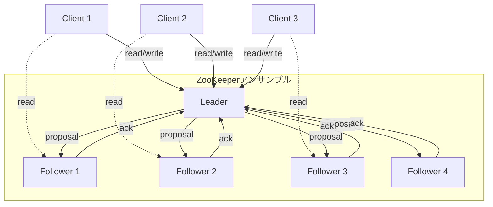
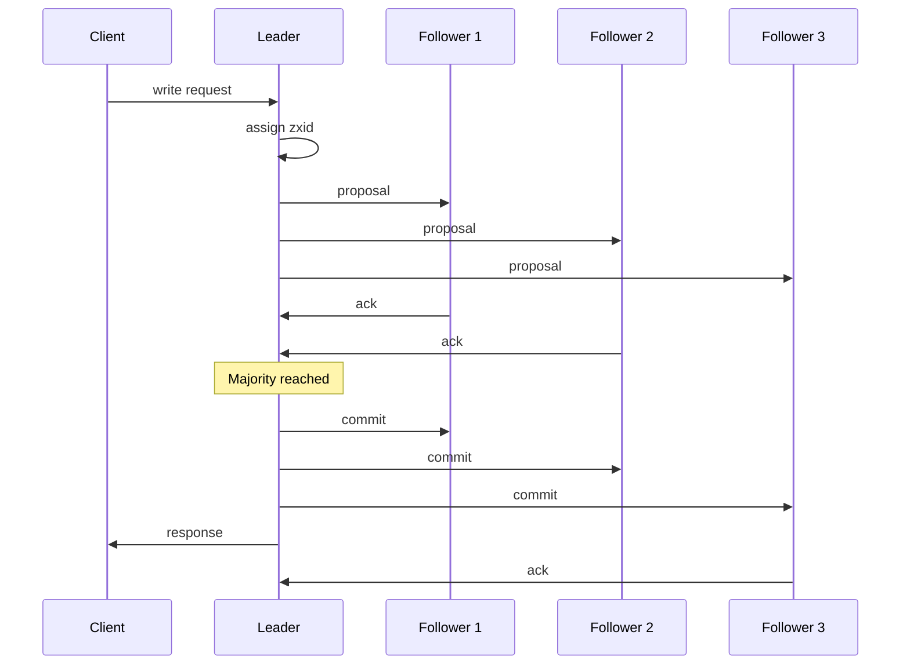
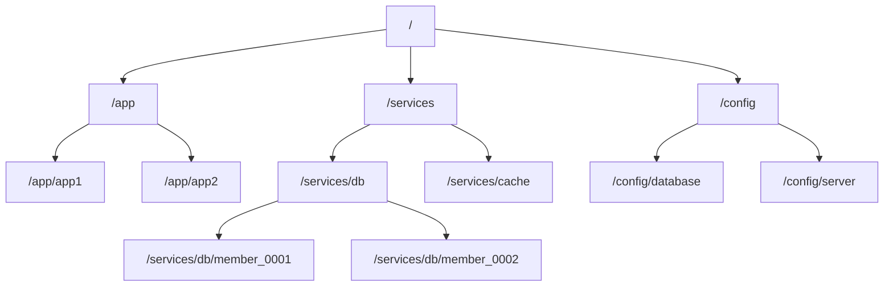
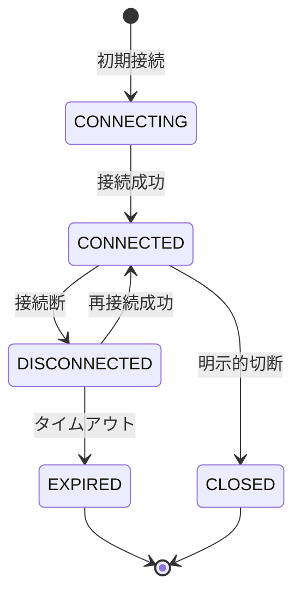
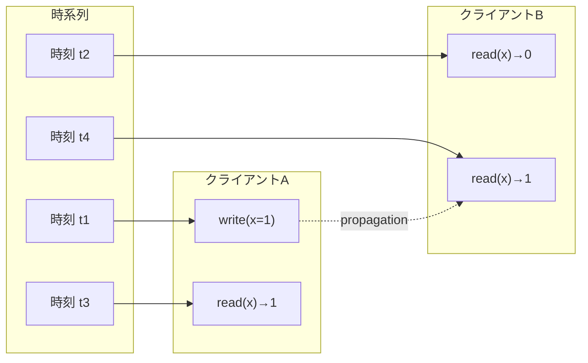
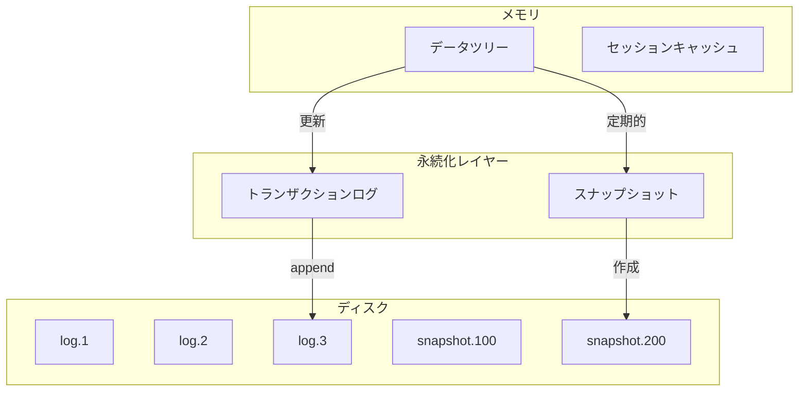
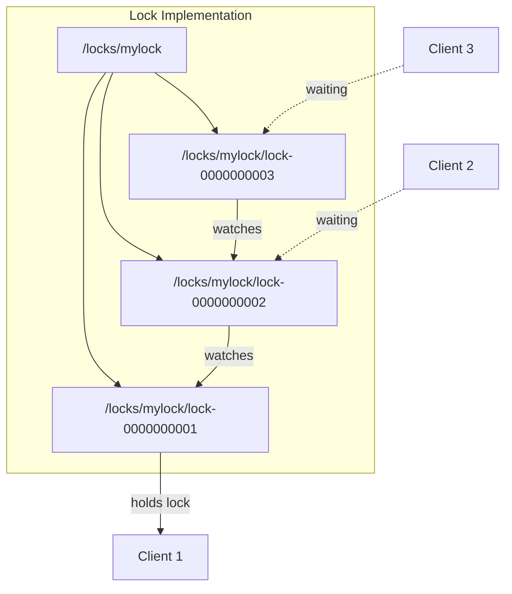

# ZooKeeper

Apache ZooKeeperは、分散システムにおける協調サービスの複雑性を隠蔽し、高い信頼性を持つ分散協調サービスを提供するシステムである。Googleの内部システムであるChubby[^1]の論文に触発されて開発され、現在では多くの大規模分散システムの基盤として利用されている。ZooKeeperの本質は、分散システムにおける「真実の源泉（single source of truth）」を提供することにあり、設定管理、サービスディスカバリ、分散ロック、リーダー選出などの基本的な協調プリミティブを実現する。

分散システムにおいて、複数のプロセスが協調して動作する際には、共有状態の管理、イベントの通知、プロセス間の同期といった課題が発生する。これらの課題を個別に解決しようとすると、実装の複雑性が増大し、バグの温床となる。ZooKeeperは、これらの協調メカニズムを統一的なインターフェースで提供することで、分散システムの開発を大幅に簡素化する。その設計思想は、シンプルで高速な操作を提供しながら、強い一貫性保証を実現することにある。

## アーキテクチャとZABプロトコル

ZooKeeperのアーキテクチャは、レプリケーテッドステートマシンの原理に基づいている。複数のサーバーがアンサンブル（ensemble）を構成し、それぞれがデータの完全なコピーを保持する。この設計により、個々のサーバーの障害に対する耐性を実現している。アンサンブルのサイズは通常奇数（3、5、7など）に設定され、過半数のサーバーが稼働している限りサービスを継続できる。



ZooKeeperの中核を成すのが、ZAB（ZooKeeper Atomic Broadcast）プロトコル[^2]である。ZABは、分散システムにおいて原子的なブロードキャストを実現するためのプロトコルで、Paxosアルゴリズムと類似した特性を持つが、より実装に適した形に最適化されている。ZABプロトコルは、リーダー選出、ディスカバリ、同期、ブロードキャストの4つのフェーズから構成される。

リーダー選出フェーズでは、アンサンブル内のサーバーが投票を行い、過半数の支持を得たサーバーがリーダーとなる。各サーバーは、自身のzxid（ZooKeeper Transaction ID）を基準に投票を行う。zxidは64ビットの整数で、上位32ビットがエポック番号、下位32ビットがカウンタを表す。エポック番号は、新しいリーダーが選出されるたびにインクリメントされ、システムの世代を表現する。

ディスカバリフェーズでは、新しく選出されたリーダーが、フォロワーから最新の状態を収集する。各フォロワーは自身が持つ最新のzxidをリーダーに報告し、リーダーは過半数のフォロワーから情報を収集した後、最新の状態を決定する。この過程により、前のリーダーの障害時に一部のフォロワーにのみ伝播された更新も適切に処理される。

同期フェーズでは、リーダーがフォロワーに対して最新の状態を伝播する。フォロワーが古い状態を持っている場合、リーダーは差分データを送信して同期を行う。大きく遅れているフォロワーに対しては、スナップショットを送信することで効率的な同期を実現する。

ブロードキャストフェーズは、通常の運用時における更新の伝播を担当する。クライアントからの書き込み要求は、すべてリーダーに転送される。リーダーは、更新をプロポーザルとしてフォロワーに送信し、過半数のフォロワーからのACKを受信した時点でコミットを決定する。このTwo-Phase Commitに似た手法により、分散環境での原子的な更新を保証する。



## データモデルとznode

ZooKeeperのデータモデルは、階層的な名前空間として設計されている。ファイルシステムに似た構造を持ち、各ノードはznode（ZooKeeper node）と呼ばれる。しかし、従来のファイルシステムとは異なり、znodeは階層構造のノードであると同時にデータを保持することができる。この設計により、メタデータと実データを統一的に管理できる。



znodeには、永続的（persistent）と一時的（ephemeral）の2種類が存在する。永続的znodeは明示的に削除されるまで存在し続けるが、一時的znodeはそれを作成したクライアントのセッションが終了すると自動的に削除される。この特性は、サービスディスカバリやクラスタメンバーシップの管理において重要な役割を果たす。例えば、各サービスインスタンスが起動時に一時的znodeを作成することで、動的なサービスレジストリを実現できる。

さらに、znodeにはシーケンシャル（sequential）という属性を付与することができる。シーケンシャルznodeを作成すると、ZooKeeperは自動的に単調増加する番号を名前の末尾に付加する。この機能は、分散環境での順序付けやキューの実装に利用される。例えば、`/queue/item-`というプレフィックスでシーケンシャルznodeを作成すると、`/queue/item-0000000001`、`/queue/item-0000000002`といった形で連番が付与される。

各znodeは、データペイロードに加えて、豊富なメタデータを保持する。バージョン番号（version）は楽観的並行性制御に使用され、作成時刻（ctime）、最終更新時刻（mtime）、子ノードの変更時刻（pzxid）などのタイムスタンプ情報も管理される。ACL（Access Control List）により、きめ細かなアクセス制御も可能である。データサイズは原則として1MB以下に制限されており、これはZooKeeperが大容量データストレージではなく、協調メカニズムの提供に特化していることを反映している。

## セッションとウォッチメカニズム

ZooKeeperのセッション管理は、クライアントとサーバー間の状態を追跡し、障害検知とリソース管理を実現する重要な機能である。クライアントがZooKeeperアンサンブルに接続すると、一意のセッションIDが割り当てられる。このセッションは、タイムアウト期間内に定期的なハートビートによって維持される。ネットワーク分断やクライアントの一時的な障害が発生しても、タイムアウト期間内に再接続すれば、セッションは継続される。

セッションの状態遷移は、分散システムにおける障害処理の基礎となる。正常な接続状態（CONNECTED）から、ネットワーク障害などにより一時的に切断された状態（DISCONNECTED）に遷移した場合、クライアントライブラリは自動的に再接続を試みる。セッションタイムアウトまでに再接続に成功すれば、セッションは維持される。しかし、タイムアウトを超過するとセッションは期限切れ（EXPIRED）となり、そのセッションに関連付けられたすべての一時的znodeが削除される。



ウォッチメカニズムは、ZooKeeperの最も特徴的な機能の一つである。クライアントは、znodeに対してウォッチを設定することで、データや子ノードの変更を非同期に通知を受けることができる。このプッシュ型の通知機構により、ポーリングによる無駄なネットワークトラフィックを削減し、リアルタイムな反応性を実現する。

ウォッチは一度だけ発火する（one-time trigger）という重要な特性を持つ。これは、通知の信頼性を保証しつつ、サーバー側のリソース消費を抑制するための設計判断である。クライアントは通知を受けた後、必要に応じて再度ウォッチを設定する必要がある。この際、通知を受けてから再設定するまでの間に発生した変更を見逃さないよう、ZooKeeperは通知とともに最新のデータを取得するAPIを提供している。

ウォッチの通知順序は、厳密に保証される。同一クライアントに対する通知は、サーバー側で観測された順序と同じ順序で配信される。また、クライアントが新しいznodeの状態を観測する前に、必ず対応するウォッチ通知が配信される。この順序保証により、クライアントは一貫性のある状態遷移を観測できる。

## 一貫性保証とCAP定理

ZooKeeperの一貫性モデルは、分散システムにおける実用性と理論的な厳密性のバランスを巧みに取っている。CAP定理[^3]の観点から見ると、ZooKeeperはCP（Consistency and Partition tolerance）システムに分類される。ネットワーク分断が発生した場合、過半数のノードを含まない側のパーティションは書き込みを受け付けなくなり、可用性を犠牲にして一貫性を保つ。

しかし、ZooKeeperの一貫性保証は、単純な強一貫性よりも洗練されている。書き込み操作に対しては線形化可能性（linearizability）を保証する一方、読み取り操作に対しては順序一貫性（sequential consistency）を提供する。この設計により、読み取り操作をローカルで処理することが可能となり、高いスループットを実現している。

クライアントの視点から見た一貫性保証は、以下の特性によって定義される。第一に、単調読み取り一貫性（monotonic read consistency）により、クライアントは一度観測した状態よりも古い状態を観測することはない。第二に、書き込みの線形化可能性により、すべての書き込み操作は全体的な順序を持ち、その順序はリアルタイムの順序と一致する。第三に、FIFO（First In First Out）クライアント順序により、単一クライアントからの操作は、発行された順序で実行される。



sync操作は、ZooKeeperの一貫性モデルにおける重要な機能である。通常の読み取り操作は、フォロワーのローカル状態から実行されるため、最新の更新を反映していない可能性がある。sync操作を実行すると、そのクライアントの後続の読み取り操作は、sync発行時点までのすべての更新を反映することが保証される。これにより、必要に応じて強い一貫性を実現できる。

## API設計と操作セマンティクス

ZooKeeperのAPIは、シンプルさと表現力のバランスを重視して設計されている。基本的な操作は、create、delete、exists、getData、setData、getChildren、syncの7つに集約される。この最小限のAPIセットから、複雑な協調パターンを構築できることがZooKeeperの強みである。

create操作は、新しいznodeを作成する。パスとデータ、ACL、ノードタイプ（永続的/一時的、シーケンシャル/非シーケンシャル）を指定する。既に存在するパスに対してcreateを実行するとNodeExistsExceptionが発生する。この特性を利用して、分散ロックの実装が可能となる。

```java
// Example API usage pattern
String path = zk.create("/lock/request-", 
                       data, 
                       ZooDefs.Ids.OPEN_ACL_UNSAFE,
                       CreateMode.EPHEMERAL_SEQUENTIAL);
```

setData操作は、既存のznodeのデータを更新する。重要な点は、バージョン番号を指定できることである。期待するバージョン番号と実際のバージョン番号が一致しない場合、BadVersionExceptionが発生する。これにより、楽観的並行性制御を実現できる。複数のクライアントが同じznodeを更新しようとする場合、読み取り時のバージョンを記憶しておき、更新時にそのバージョンを指定することで、競合を検出できる。

delete操作も同様にバージョン番号を指定でき、条件付き削除を実現する。子ノードが存在するznodeを削除しようとするとNotEmptyExceptionが発生するため、階層構造の整合性が保たれる。

マルチ操作（multi-operation）は、複数の操作を原子的に実行する機能である。トランザクション内のすべての操作が成功するか、すべて失敗するかのいずれかとなる。これにより、複数のznodeにまたがる一貫性のある更新が可能となる。

```java
// Multi-operation example
List<Op> ops = Arrays.asList(
    Op.create("/app/config", data1, acl, CreateMode.PERSISTENT),
    Op.setData("/app/version", data2, -1),
    Op.delete("/app/old-config", -1)
);
List<OpResult> results = zk.multi(ops);
```

非同期APIは、高性能なアプリケーションの構築を可能にする。各操作に対して非同期バージョンが用意されており、コールバックを登録することで結果を受け取る。これにより、多数の操作を並行して実行し、ネットワークレイテンシの影響を最小化できる。

## 実装の詳細：トランザクションログとスナップショット

ZooKeeperの永続性は、トランザクションログとスナップショットの2つのメカニズムによって実現される。トランザクションログは、すべての状態変更操作を順次記録するWrite-Ahead Log（WAL）である。各トランザクションは、zxidとともに記録され、クラッシュリカバリ時に状態を再構築するために使用される。

トランザクションログの書き込みは、パフォーマンスに直接影響するクリティカルパスである。ZooKeeperは、グループコミットとプリアロケーションの技術を使用して、ディスクI/Oを最適化する。複数のトランザクションをバッチ化して一度にディスクに書き込むことで、fsyncの呼び出し回数を削減する。また、ログファイルを事前に割り当てることで、ファイルシステムのメタデータ更新のオーバーヘッドを回避する。

スナップショットは、メモリ内のデータツリーの完全なコピーである。トランザクションログが無限に成長することを防ぐため、定期的にスナップショットを作成し、古いログエントリを削除する。スナップショットの作成は、ファジースナップショット方式を採用している。これは、スナップショット作成中もサービスを継続するため、作成開始時点と終了時点で状態が異なる可能性があることを意味する。



リカバリプロセスは、最新のスナップショットをロードし、その後のトランザクションログを再生することで実行される。ファジースナップショットの性質上、スナップショットに含まれる一部のトランザクションが重複して再生される可能性があるが、操作の冪等性により正しい状態が復元される。

データの整合性を保証するため、ZooKeeperはチェックサムとマジックナンバーを使用する。各ログエントリとスナップショットファイルには、CRCチェックサムが付加される。また、ファイルフォーマットのバージョン管理により、異なるバージョン間での互換性も考慮されている。

## パフォーマンス特性と最適化

ZooKeeperのパフォーマンス特性は、その使用パターンに大きく依存する。読み取り中心のワークロードでは、各フォロワーがローカルで読み取りを処理できるため、線形にスケールする。一方、書き込み操作はすべてリーダーを経由する必要があるため、書き込みスループットはリーダーの処理能力に制約される。

典型的な環境では、ZooKeeperは数万から数十万の読み取り操作/秒を処理できる。書き込み操作は、ハードウェア構成にもよるが、通常数千から数万操作/秒の範囲となる。レイテンシは、通常の操作で数ミリ秒程度であり、複雑な操作やネットワーク遅延が大きい環境では増加する。

パフォーマンス最適化のための重要な設定パラメータには、以下のものがある。tickTimeは、ZooKeeperの基本時間単位であり、ハートビート間隔やタイムアウトの計算に使用される。initLimitとsyncLimitは、フォロワーの初期同期と通常同期のタイムアウトを制御する。これらの値は、ネットワーク環境とデータサイズに応じて調整する必要がある。

```
tickTime=2000
initLimit=10
syncLimit=5
dataDir=/var/lib/zookeeper
clientPort=2181
```

JVMチューニングも重要な最適化ポイントである。ZooKeeperは、大量の小さなオブジェクトを扱うため、適切なヒープサイズとガベージコレクション設定が必要である。一般的には、4GBから8GBのヒープサイズが推奨され、CMS（Concurrent Mark Sweep）またはG1GCが使用される。

ディスクI/Oの最適化も重要である。トランザクションログは、専用のディスクに配置することが推奨される。SSDの使用により、特に書き込みレイテンシを大幅に改善できる。また、ログとスナップショットを異なるディスクに配置することで、I/O競合を回避できる。

## 実践的な設計パターンとトレードオフ

ZooKeeperを使用した分散システムの設計では、いくつかの重要なパターンとトレードオフを理解する必要がある。分散ロックの実装は、最も一般的な使用例の一つである。単純なアプローチでは、特定のパスにznodeを作成し、作成に成功したクライアントがロックを獲得する。しかし、この方法には、クライアントの予期しない終了時のデッドロックや、ハードエラーの問題がある。

より洗練された実装では、シーケンシャル・エフェメラルznodeを使用する。各クライアントは、ロックディレクトリ下にシーケンシャルznodeを作成し、最小の番号を持つクライアントがロックを獲得する。他のクライアントは、自分より小さい番号のznodeにウォッチを設定し、そのznodeが削除されたら再度チェックを行う。この方法により、公平性とデッドロック回避を実現できる。



リーダー選出パターンも重要な応用例である。各候補プロセスは、選出用のディレクトリにシーケンシャル・エフェメラルznodeを作成する。最小の番号を持つプロセスがリーダーとなる。フォロワーは、リーダーのznodeにウォッチを設定し、リーダーの障害を検知する。この方法により、スプリットブレイン問題を回避しつつ、迅速なフェイルオーバーを実現できる。

設定管理においては、ZooKeeperは動的な設定更新を可能にする。設定データをznodeに格納し、アプリケーションはウォッチを設定して変更を監視する。階層的な名前空間を活用することで、環境別、アプリケーション別の設定を効率的に管理できる。ただし、大容量の設定データには適さないため、設定のメタデータやポインタをZooKeeperに格納し、実際のデータは別のストレージに配置するハイブリッドアプローチも検討すべきである。

サービスディスカバリパターンでは、各サービスインスタンスが起動時にエフェメラルznodeを作成し、自身のエンドポイント情報を登録する。クライアントは、サービスディレクトリの子ノードをリストし、利用可能なインスタンスを発見する。ウォッチを設定することで、インスタンスの追加や削除をリアルタイムに検知できる。負荷分散やヘルスチェックの情報も、znodeのデータとして格納できる。

これらのパターンを適用する際の重要なトレードオフとして、一貫性と可用性のバランスがある。強い一貫性を要求する操作では、sync()を使用して最新の状態を保証する必要があるが、これはパフォーマンスに影響する。多くの場合、最終的一貫性で十分であり、必要な箇所でのみ強い一貫性を使用する設計が推奨される。

また、ZooKeeperへの依存度も重要な設計上の考慮事項である。ZooKeeperがシステムの単一障害点となることを避けるため、グレースフルデグラデーションを実装すべきである。例えば、設定情報をローカルにキャッシュし、ZooKeeperが一時的に利用できない場合でも、既存の設定で動作を継続できるようにする。

スケーラビリティの観点では、ZooKeeperのアンサンブルサイズと性能の関係を理解する必要がある。アンサンブルサイズを増やすと、読み取り性能は向上するが、書き込み性能は低下する。これは、より多くのノードで合意形成が必要となるためである。一般的には、3〜7ノードのアンサンブルが推奨され、それ以上のスケールが必要な場合は、複数のZooKeeperクラスタを用途別に分離する設計を検討すべきである。

監視とデバッグの観点では、ZooKeeperは豊富なメトリクスとコマンドを提供する。4文字コマンド（stat、ruok、dump等）により、運用中のシステムの状態を確認できる。JMXを通じて詳細なメトリクスも取得可能である。本番環境では、レイテンシ、スループット、アンサンブルの健全性を継続的に監視し、異常を早期に検知する体制が重要である。

ZooKeeperの制限事項も理解しておく必要がある。1MBのデータサイズ制限は、大容量データの格納には適さないことを意味する。また、階層が深くなりすぎるとパフォーマンスが低下するため、適切な名前空間設計が必要である。znodeの数が数百万を超える場合、メモリ使用量とガベージコレクションの影響が顕著になるため、データモデルの見直しが必要となる場合がある。

---

[^1]: Burrows, M. (2006). The Chubby lock service for loosely-coupled distributed systems. In Proceedings of the 7th symposium on Operating systems design and implementation (pp. 335-350).

[^2]: Junqueira, F. P., Reed, B. C., & Serafini, M. (2011). Zab: High-performance broadcast for primary-backup systems. In 2011 IEEE/IFIP 41st International Conference on Dependable Systems & Networks (DSN) (pp. 245-256).

[^3]: Brewer, E. (2000). Towards robust distributed systems. In Proceedings of the nineteenth annual ACM symposium on Principles of distributed computing (p. 7).