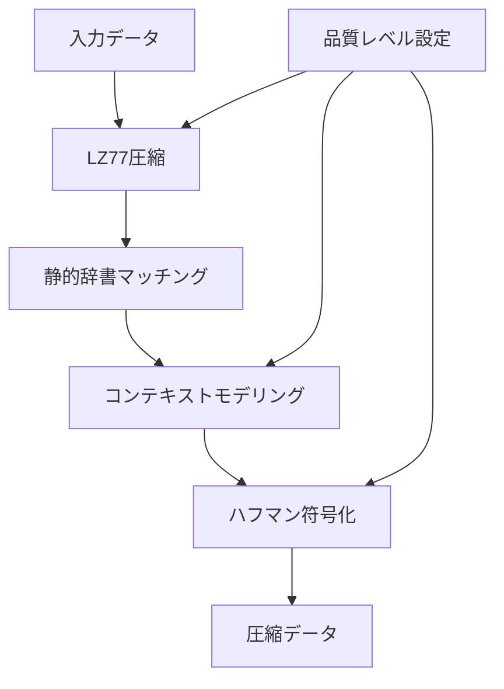
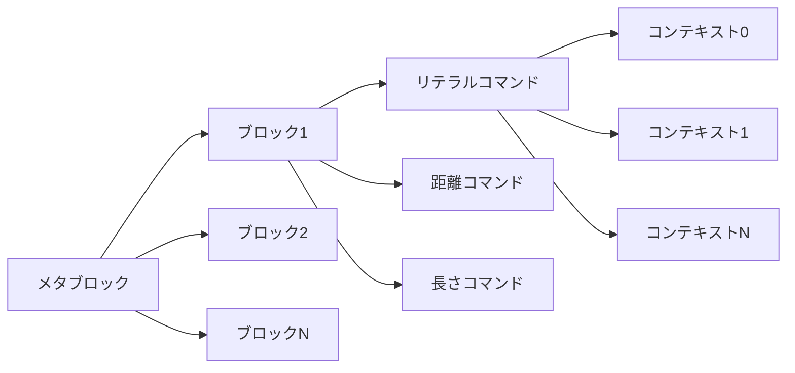
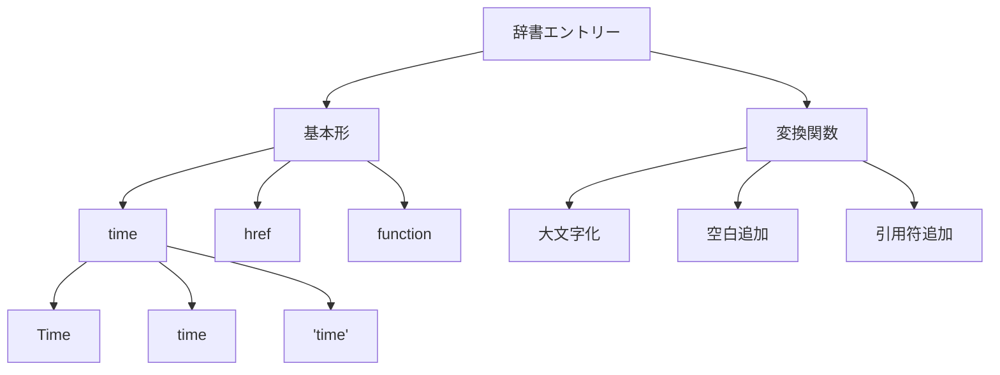
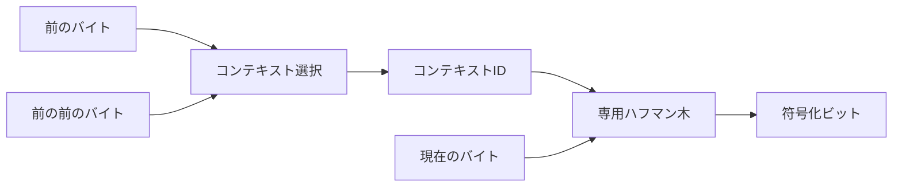
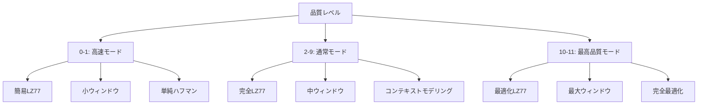
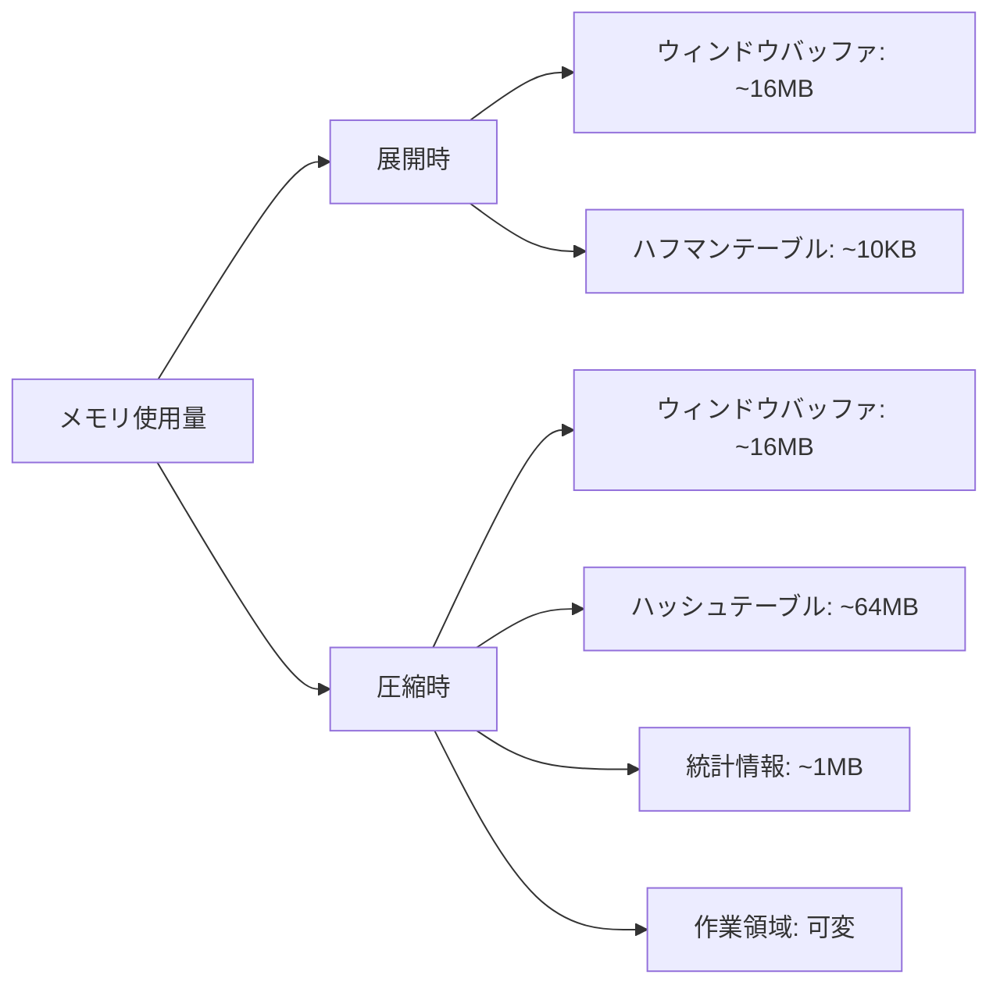
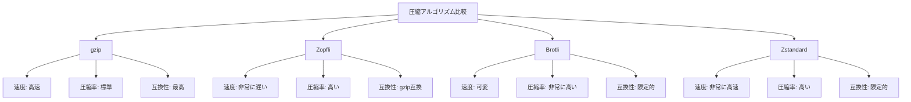
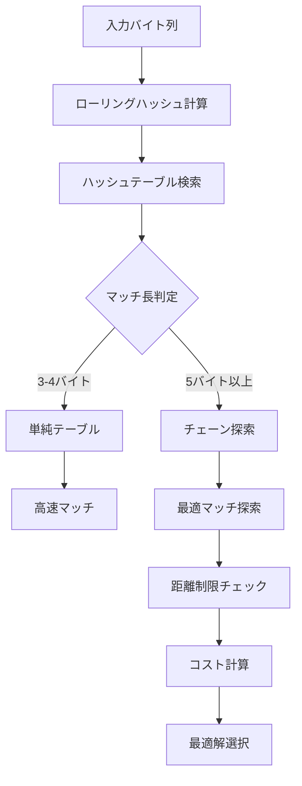

# Brotli

Brotliは、Googleが2013年に開発を開始し、2016年に標準化された汎用可逆圧縮アルゴリズムである。Web Fontsの圧縮技術として開発が始まり、その後汎用的なデータ圧縮技術へと進化した。RFC 7932として標準化されたBrotliは、特にWebコンテンツの配信において、gzipを上回る圧縮率と実用的な展開速度を実現している[^1]。

名前の由来はスイスの菓子パン「Brötli」で、開発チームのJyrki Alakuijalaがスイス滞在中に着想を得たとされる。技術的には、LZ77アルゴリズムを基盤としながら、静的辞書、高度なコンテキストモデリング、そして2次ハフマン符号化を組み合わせた洗練された設計となっている。



## アルゴリズムの基本構造

Brotliの圧縮プロセスは、入力データをメタブロックと呼ばれる単位に分割することから始まる。各メタブロックは独立して圧縮され、最大16MBまでのサイズを持つことができる。この設計により、ストリーミング処理と並列処理の両方が可能となっている。

メタブロック内では、データは更に小さなブロックに分割される。各ブロックは、リテラル（非圧縮データ）、距離、長さの3つのカテゴリに分類されたコマンドシーケンスとして表現される。これらのコマンドは、それぞれ異なるエントロピー符号化モデルで圧縮される。



ブロックサイズの決定は、圧縮効率に大きく影響する。Brotliは、入力データの特性を分析し、最適なブロックサイズを動的に決定する。一般的に、同質なデータは大きなブロックで、異質なデータは小さなブロックで処理される。

## LZ77ベースの圧縮

BrotliのコアとなるのはLZ77アルゴリズムの拡張実装である。LZ77は、過去に出現したデータパターンへの参照として繰り返しを表現する手法で、1977年にAbraham LempelとJacob Zivによって提案された[^2]。Brotliでは、このアルゴリズムを大幅に拡張している。

標準的なLZ77では、マッチの検索範囲（ウィンドウサイズ）は32KBから64KB程度に制限されることが多い。しかし、Brotliは最大16MBまでのウィンドウサイズをサポートし、より広範囲からの繰り返しパターンを検出できる。これは特に大規模なテキストファイルやソースコードの圧縮において効果的である。

マッチング処理においても、Brotliは高度な最適化を行っている。単純な最長一致検索ではなく、後続のマッチング機会を考慮した動的計画法ベースのアルゴリズムを採用している。これにより、局所的には短いマッチでも、全体として最適な圧縮率を達成できる。

```python
# Brotliのマッチング戦略の概念的な例
def find_optimal_matches(data, window_size):
    # 動的計画法による最適マッチの探索
    dp = [float('inf')] * len(data)
    matches = [None] * len(data)
    
    for i in range(len(data)):
        # リテラルとして出力する場合のコスト
        literal_cost = calculate_literal_cost(data[i])
        if i == 0:
            dp[i] = literal_cost
        else:
            dp[i] = dp[i-1] + literal_cost
        
        # 過去のデータとのマッチを探索
        for length in range(3, min(258, len(data) - i)):
            for distance in find_matches(data, i, length, window_size):
                match_cost = calculate_match_cost(length, distance)
                if i + length < len(data) and dp[i] + match_cost < dp[i + length]:
                    dp[i + length] = dp[i] + match_cost
                    matches[i + length] = (i, length, distance)
    
    return reconstruct_matches(dp, matches)
```

## 静的辞書

Brotliの最も特徴的な機能の一つが、120KBの静的辞書である。この辞書には、6つの言語（英語、スペイン語、中国語、ヒンディー語、ロシア語、アラビア語）から抽出された13,504個の文字列が含まれている。加えて、HTMLやCSSなどのWeb技術で頻出するパターンも収録されている[^3]。

辞書の構築には、大規模なWebコーパスの統計分析が用いられた。単純な頻度分析だけでなく、圧縮効果とメモリ使用量のトレードオフを考慮した最適化が行われている。各辞書エントリーは、変換関数と組み合わせて使用でき、大文字化、空白の追加、引用符で囲むなどの操作が可能である。



静的辞書の利用は、特に小さなファイルの圧縮において効果的である。通常のLZ77圧縮では、ファイルの先頭付近では参照可能な過去のデータが少ないため、圧縮効率が低下する。静的辞書は、この「コールドスタート」問題を解決し、ファイルサイズに関わらず一定の圧縮効果を提供する。

辞書のデータ構造は、高速な検索を可能にするよう最適化されている。ハッシュテーブルとトライ木を組み合わせた構造により、O(1)に近い時間複雑度でマッチングが可能となっている。メモリアクセスパターンも考慮され、キャッシュ効率が高くなるよう設計されている。

## コンテキストモデリング

Brotliの圧縮効率を支えるもう一つの重要な技術がコンテキストモデリングである。これは、データの局所的な特性に基づいて、異なるエントロピー符号化モデルを適用する手法である。Brotliでは、最大256個の異なるコンテキストを使用できる。

リテラルデータに対しては、直前の1～2バイトに基づいてコンテキストが決定される。例えば、英文テキストでは、空白の後には大文字が来やすく、母音の後には子音が来やすいといった統計的性質がある。Brotliはこれらのパターンを学習し、それぞれに最適化されたハフマン木を構築する。



コンテキストモデリングは、UTF-8エンコーディングに対して特に最適化されている。UTF-8のマルチバイト文字のパターンを認識し、適切なコンテキストを割り当てることで、国際化されたテキストの圧縮効率を向上させている。

距離コードに対しても、類似のコンテキストモデリングが適用される。コピー長や直前の距離値に基づいて、異なる距離分布モデルが選択される。これにより、構造化されたデータ（JSONやXMLなど）の圧縮効率が大幅に向上する。

## ハフマン符号化とブロック分割

Brotliでは、各コンテキストに対して個別のハフマン木が構築される。しかし、全てのコンテキストに対して完全に独立したハフマン木を保持するとオーバーヘッドが大きくなるため、類似したコンテキストではハフマン木を共有する仕組みが導入されている。

ハフマン木の構築には、正準ハフマン符号が使用される。これは、同じ長さの符号語が辞書順に並ぶという性質を持ち、符号表の圧縮表現が可能となる。Brotliでは、この符号表自体も圧縮され、メタデータのオーバーヘッドを最小化している。

```python
# 正準ハフマン符号の構築例
def build_canonical_huffman_code(frequencies):
    # ハフマン木の構築
    heap = [(freq, i) for i, freq in enumerate(frequencies) if freq > 0]
    heapq.heapify(heap)
    
    while len(heap) > 1:
        freq1, node1 = heapq.heappop(heap)
        freq2, node2 = heapq.heappop(heap)
        heapq.heappush(heap, (freq1 + freq2, (node1, node2)))
    
    # 符号長の計算
    code_lengths = [0] * len(frequencies)
    def assign_lengths(node, depth=0):
        if isinstance(node, int):
            code_lengths[node] = depth
        else:
            assign_lengths(node[0], depth + 1)
            assign_lengths(node[1], depth + 1)
    
    if heap:
        assign_lengths(heap[0][1])
    
    # 正準符号の割り当て
    codes = {}
    code = 0
    for length in range(1, max(code_lengths) + 1):
        for symbol in range(len(code_lengths)):
            if code_lengths[symbol] == length:
                codes[symbol] = format(code, f'0{length}b')
                code += 1
        code <<= 1
    
    return codes, code_lengths
```

ブロック分割の戦略も、圧縮効率に大きく影響する。Brotliは、入力データのエントロピー変化を監視し、統計的性質が大きく変化する箇所でブロックを分割する。これにより、各ブロックで最適なハフマン木を使用できる。

## 圧縮品質レベル

Brotliは0から11までの圧縮品質レベルを提供する。各レベルは、圧縮速度と圧縮率のトレードオフを表している。レベル0-1は高速モードで、簡略化されたアルゴリズムを使用する。レベル2-9は通常モードで、徐々に探索の深さと精度を向上させる。レベル10-11は最高品質モードで、計算量を度外視した徹底的な最適化を行う。



品質レベル4が、多くの用途でバランスの取れた選択とされる。このレベルでは、gzipのデフォルト設定と同程度の速度で、約20-30%優れた圧縮率を達成する。Webサーバーでの動的圧縮には、レベル4-6が推奨される。

高品質レベル（10-11）は、事前圧縮されるアセットに適している。これらのレベルでは、複数のブロック分割戦略を試行し、最適な組み合わせを探索する。また、辞書マッチングにおいても、より広範囲な変換関数の組み合わせを検討する。

## 実装と性能特性

Brotliのリファレンス実装はC言語で書かれており、高度に最適化されている。SIMD命令を活用した並列処理、キャッシュ効率を考慮したデータ構造、分岐予測を最適化したコード構造など、現代的なCPUアーキテクチャに適応した実装となっている。

メモリ使用量は、圧縮時と展開時で大きく異なる。展開時は、ウィンドウサイズに応じたバッファ（最大16MB）とハフマン復号用のテーブル（数KB）のみが必要である。一方、圧縮時は、LZ77マッチング用のハッシュテーブルやコンテキストモデリング用の統計情報など、より多くのメモリを必要とする。



スループット性能は、データの特性と品質レベルに大きく依存する。テキストデータの圧縮では、品質レベル4で約40-60MB/s、展開では約200-400MB/sの処理速度が一般的である。バイナリデータや既に圧縮されたデータでは、これらの値は低下する傾向がある。

並列処理のサポートも重要な特徴である。メタブロック単位での独立した処理が可能なため、マルチコアCPUでは複数のスレッドで並列圧縮・展開が可能である。ただし、ストリーミング処理との両立には注意が必要で、適切なバッファリング戦略が求められる。

## 他の圧縮技術との比較

Brotliは、既存の圧縮技術と比較して、多くの場合で優れた圧縮率を示す。gzipと比較すると、同等の圧縮速度で20-30%高い圧縮率を達成する。これは主に、大きなウィンドウサイズ、静的辞書、高度なコンテキストモデリングによるものである。

Zopfliは、gzip互換でありながら高い圧縮率を実現するアルゴリズムで、同じくGoogleによって開発された。Zopfliは徹底的な最適化により高い圧縮率を達成するが、圧縮速度は非常に遅い。Brotliの高品質モードは、Zopfliと同等以上の圧縮率を、より高速に実現する。



Zstandard（zstd）は、Facebookが開発した圧縮アルゴリズムで、特に高速な圧縮・展開を重視している。リアルタイム圧縮が必要な場面では、ZstandardがBrotliより適している場合がある。一方、事前圧縮されるWebアセットでは、Brotliの高圧縮率が有利となる。

LZ4やSnappyなどの超高速圧縮アルゴリズムと比較すると、Brotliは圧縮率で大きく優れるが、速度では劣る。これらのアルゴリズムは、レイテンシが極めて重要なシステム（データベースのログ圧縮など）で使用される。

## Web配信における実践的活用

BrotliはHTTPコンテンツエンコーディングとして、Accept-Encoding: brヘッダーで要求される。主要なWebブラウザ（Chrome、Firefox、Edge、Safari）は2016年以降Brotliをサポートしており、現在では広く利用可能である。

静的アセットの事前圧縮では、高品質レベル（10-11）を使用することが推奨される。CSSやJavaScriptファイルでは、gzipと比較して15-25%のファイルサイズ削減が期待できる。特に、minifyされたコードに対しても効果的で、既に最適化されたファイルでも追加の圧縮効果が得られる。

動的コンテンツの圧縮では、レスポンスタイムとCPU使用率のバランスを考慮する必要がある。一般的には品質レベル4-6が使用され、gzipの高速モードと同等の速度で、より高い圧縮率を実現する。キャッシュ可能なコンテンツについては、初回アクセス時に高品質で圧縮し、結果をキャッシュする戦略も有効である。

```python
# Nginx設定例
# static content with high quality pre-compression
location ~* \.(js|css|html)$ {
    brotli_static on;
    brotli_types text/plain text/css application/javascript;
}

# dynamic content with balanced quality
location / {
    brotli on;
    brotli_comp_level 4;
    brotli_types text/html text/plain text/xml text/css 
                 application/javascript application/json;
}
```

CDNでの活用も進んでいる。CloudflareやFastlyなどの主要CDNプロバイダーは、オリジンサーバーからの応答を自動的にBrotli圧縮する機能を提供している。これにより、オリジンサーバーの負荷を増やすことなく、エンドユーザーへの配信を最適化できる。

## アルゴリズムの詳細実装

Brotliの圧縮処理の核心部分では、複数の高度な技術が組み合わされている。リングバッファを用いた効率的なウィンドウ管理により、大きなウィンドウサイズでもメモリアクセスを最適化している。リングバッファのサイズは2の累乗に制限され、ビット演算による高速なインデックス計算を可能にしている。

ハッシュチェーンとハッシュテーブルの組み合わせにより、LZ77マッチングを高速化している。短い文字列（3-4バイト）には単純なハッシュテーブルを、長い文字列にはローリングハッシュとチェーン構造を使用する。この二段階アプローチにより、様々なデータパターンに対して効率的なマッチングが可能となる。



バックリファレンスの符号化では、距離と長さのペアを効率的に表現するため、複数の符号化モードを使い分ける。近距離の参照には短い符号を、遠距離の参照には長い符号を割り当てる。また、最近使用した距離を記憶し、それらへの参照には特別に短い符号を割り当てる。

コマンドの符号化では、リテラル挿入長とコピー長を組み合わせた複合コマンドを使用する。これにより、リテラルとマッチの切り替えオーバーヘッドを削減している。704種類の基本コマンドが定義され、それぞれが特定の長さの組み合わせを表現する。

## 最適化技術とトレードオフ

Brotliの設計には、多くの工学的トレードオフが含まれている。ウィンドウサイズを大きくすると圧縮率は向上するが、メモリ使用量とマッチング時間が増加する。実装では、データの特性に応じて動的にウィンドウサイズを調整する機能が含まれている。

コンテキスト数の選択も重要なトレードオフである。コンテキスト数を増やすとモデリング精度は向上するが、各コンテキストのサンプル数が減少し、統計的信頼性が低下する。Brotliは、データ量に応じて使用するコンテキスト数を自動調整する。

ブロックサイズの決定では、エントロピー変化の検出精度と、ブロックヘッダーのオーバーヘッドのバランスを取る必要がある。小さなブロックは局所的な最適化を可能にするが、メタデータのオーバーヘッドが増加する。Brotliは、累積エントロピーの変化率を監視し、閾値を超えた時点でブロックを分割する。

```python
# ブロック分割の決定ロジックの概念
def should_split_block(current_stats, block_size, quality):
    # エントロピー変化の計算
    entropy_change = calculate_entropy_change(current_stats)
    
    # 品質レベルに応じた閾値
    thresholds = {
        0: 1.0,   # 非常に寛容
        4: 0.1,   # バランス型
        11: 0.01  # 非常に厳格
    }
    
    threshold = thresholds.get(quality, 0.1)
    
    # ブロックサイズによる調整
    size_factor = min(1.0, block_size / 65536)
    adjusted_threshold = threshold * size_factor
    
    return entropy_change > adjusted_threshold or block_size > 1048576
```

## 将来の発展可能性と課題

Brotliの圧縮効率は既に高いレベルに達しているが、改善の余地も残されている。機械学習を用いたコンテキストモデリングの改良、ハードウェアアクセラレーションのサポート、新しいデータ型に特化した辞書の開発などが検討されている。

量子コンピューティングの発展により、現在は計算量的に困難な最適化問題が解決可能になる可能性がある。特に、最適なブロック分割やマッチング戦略の探索において、量子アルゴリズムの適用が期待される。

一方で、Brotliの普及における課題も存在する。レガシーシステムとの互換性、ハードウェアデコーダーの不足、標準化の遅れなどが挙げられる。これらの課題に対処するため、段階的な移行戦略やフォールバック機構の整備が重要となる。

セキュリティ面では、圧縮爆弾攻撃やサイドチャネル攻撃への対策が必要である。特に、圧縮率の違いから元データの情報が漏洩する可能性があり、機密性の高いデータの圧縮には注意が必要である。

Brotliは、現代のWeb技術スタックにおいて重要な位置を占めている。その高度な圧縮技術は、ネットワーク帯域の節約とユーザー体験の向上に大きく貢献している。今後も、新しいアプリケーション領域への適用と、アルゴリズムの継続的な改良により、その重要性は増していくと考えられる。

[^1]: Alakuijala, J., & Szabadka, Z. (2016). Brotli Compressed Data Format. RFC 7932. https://tools.ietf.org/html/rfc7932

[^2]: Ziv, J., & Lempel, A. (1977). A universal algorithm for sequential data compression. IEEE Transactions on Information Theory, 23(3), 337-343.

[^3]: Alakuijala, J., Kliuchnikov, E., Szabadka, Z., & Vandevenne, L. (2015). Comparison of Brotli, Deflate, Zopfli, LZMA, LZHAM and Bzip2 Compression Algorithms. Google Inc.