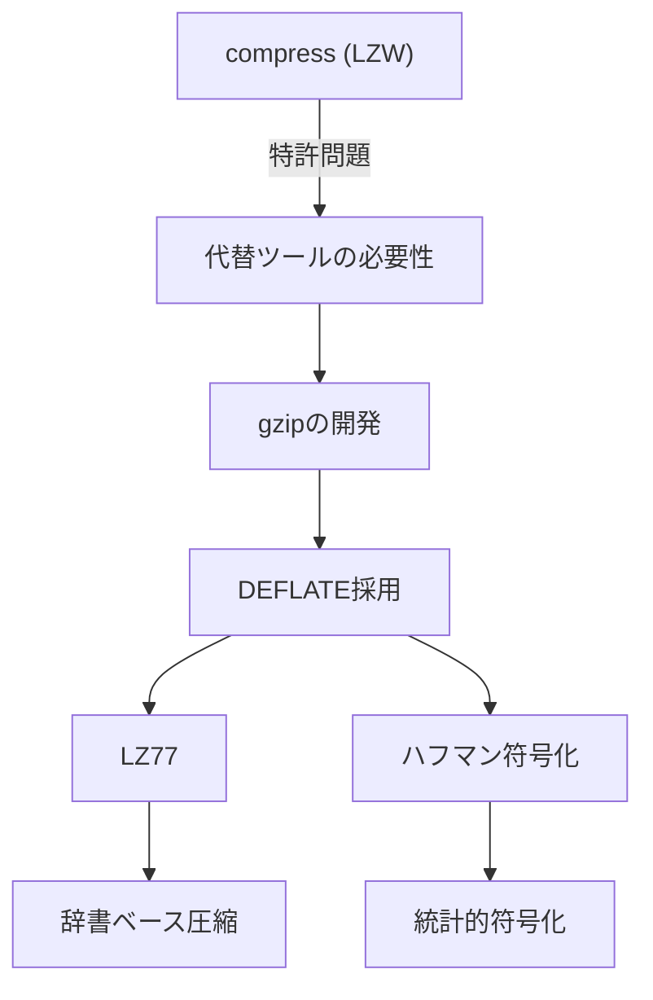
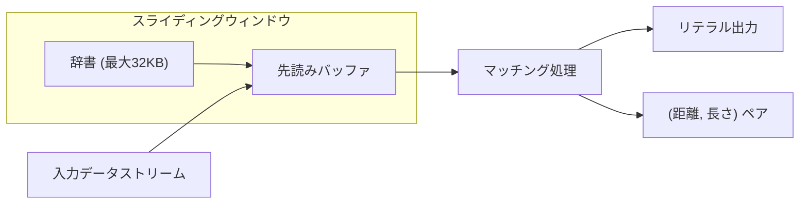
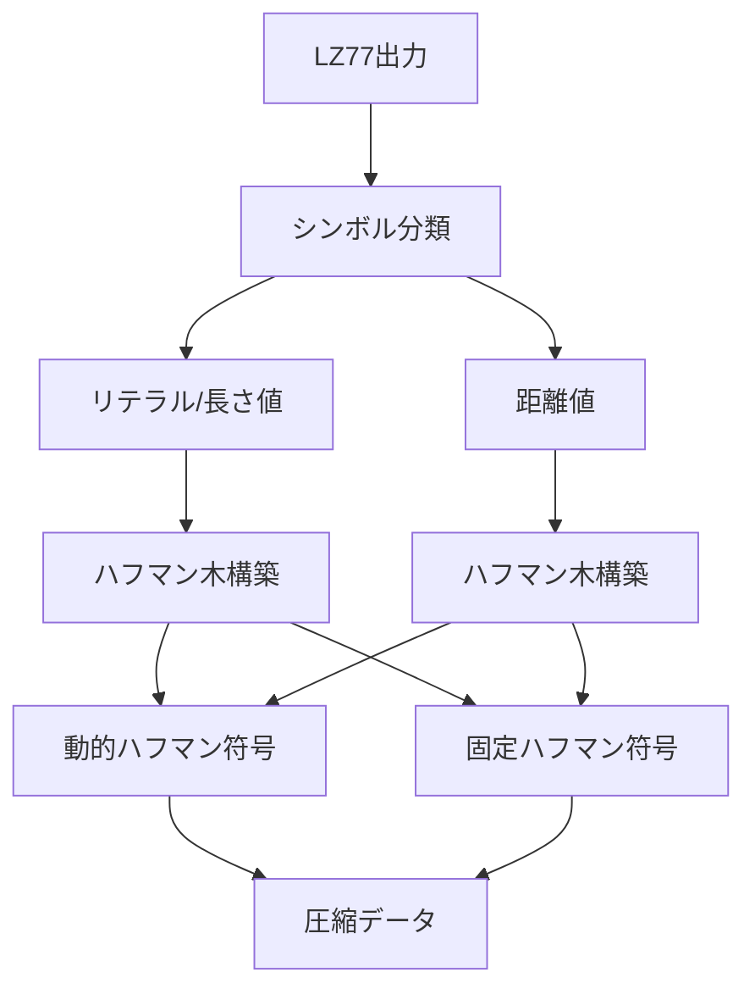
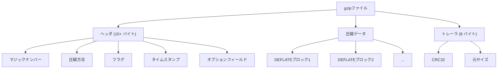
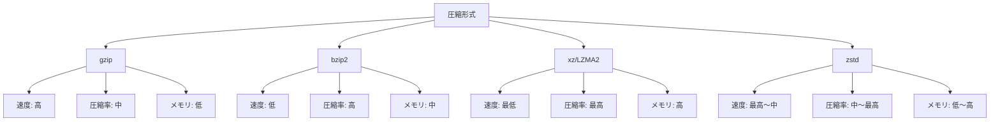
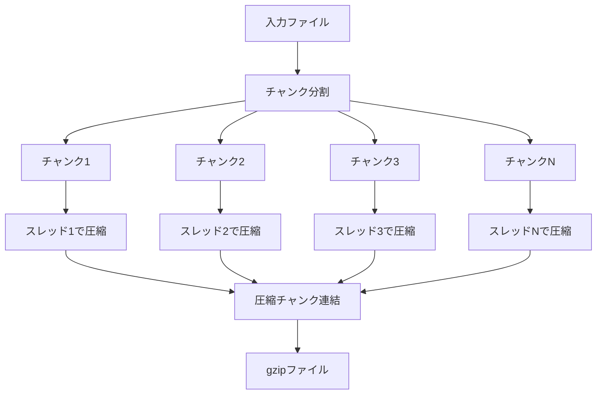
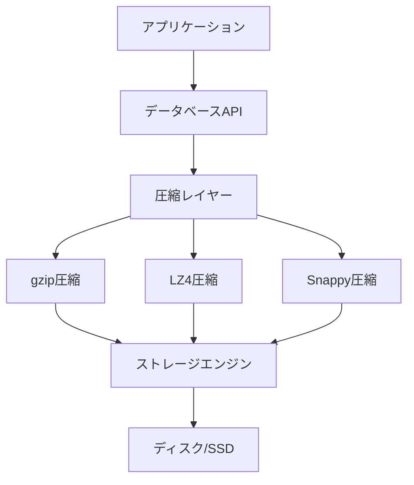

# gzip

gzipは、DEFLATE圧縮アルゴリズムに基づくファイル圧縮フォーマットであり、1992年にJean-loup GaillyとMark Adlerによって開発された。その名称は「GNU zip」の略であり、UNIX系システムにおける標準的な圧縮ツールとして広く普及している。本稿では、gzipの技術的詳細について、その圧縮アルゴリズム、データフォーマット、実装特性、そして実践的な活用方法について体系的に解説する。

## 歴史的背景と設計思想

gzipの開発は、1980年代後半から1990年代初頭にかけての特許問題と密接に関連している。当時、UNIX系システムで広く使用されていたcompressコマンドは、LZW（Lempel-Ziv-Welch）アルゴリズムを採用していたが、このアルゴリズムには特許が存在していた[^1]。この特許問題を回避し、かつ自由に使用できる圧縮ツールを提供することが、gzip開発の主要な動機となった。

gzipの設計において重要な決定は、DEFLATE圧縮アルゴリズムの採用であった。DEFLATEは、LZ77アルゴリズムとハフマン符号化を組み合わせたハイブリッド圧縮手法であり、特許に抵触しない形で実装可能でありながら、優れた圧縮率を実現できるという特徴を持っていた。この選択により、gzipは法的な制約を受けることなく、幅広い用途で活用される圧縮フォーマットとして確立されることになった。



## DEFLATE圧縮アルゴリズムの詳細

DEFLATEアルゴリズムは、RFC 1951[^2]で標準化されており、二段階の圧縮プロセスから構成される。第一段階では、LZ77アルゴリズムによる辞書ベースの圧縮を行い、第二段階では、その出力に対してハフマン符号化を適用する。

### LZ77アルゴリズム

LZ77アルゴリズムは、1977年にAbraham LempelとJacob Zivによって提案された辞書ベースの圧縮手法である[^3]。このアルゴリズムの核心は、入力データストリーム内の繰り返しパターンを検出し、それらを以前に出現した同一パターンへの参照として表現することにある。

LZ77では、圧縮処理中に「スライディングウィンドウ」と呼ばれるデータ構造を維持する。このウィンドウは、すでに処理済みのデータを保持する「辞書」部分と、これから処理するデータを含む「先読みバッファ」部分から構成される。DEFLATEの実装では、辞書のサイズは最大32KBに制限されており、これは16ビットのオフセット値で参照可能な範囲に対応している。



圧縮処理のアルゴリズムは以下のように動作する：

1. 先読みバッファ内のデータと辞書内のデータを比較し、最長一致する部分文字列を探索する
2. 十分な長さの一致が見つかった場合（通常3バイト以上）、その一致を（距離、長さ）のペアとして出力する
3. 一致が見つからない場合、または一致が短すぎる場合は、データをリテラル（生データ）として出力する
4. ウィンドウをスライドさせ、処理を継続する

この処理において、距離は辞書内での後方参照のオフセットを表し、長さは一致したバイト数を示す。DEFLATEでは、距離は1から32,768の範囲、長さは3から258の範囲で表現される。

### ハフマン符号化

LZ77の出力は、リテラルバイトと（距離、長さ）ペアの混在したストリームとなる。DEFLATEの第二段階では、このストリームに対してハフマン符号化を適用し、さらなる圧縮を実現する。

ハフマン符号化は、出現頻度の高いシンボルに短いビット列を、出現頻度の低いシンボルに長いビット列を割り当てる可変長符号化手法である。DEFLATEでは、以下の要素に対して個別のハフマン木を構築する：

1. リテラル/長さ値（0-285の範囲）
2. 距離値（0-29の範囲）

DEFLATEは、ハフマン木の表現方法として「動的ハフマン符号」と「固定ハフマン符号」の二つのモードを提供している。動的ハフマン符号では、入力データの統計的特性に基づいて最適なハフマン木を構築し、その木の情報を圧縮データに含める。一方、固定ハフマン符号では、事前に定義された標準的なハフマン木を使用する。



## gzipファイルフォーマット

gzipファイルフォーマットは、RFC 1952[^4]で定義されており、圧縮されたデータストリームにメタデータを付加する構造を持つ。gzipファイルは、ヘッダ、圧縮データブロック、トレーラの三つの主要部分から構成される。

### ヘッダ構造

gzipヘッダは、最小10バイトの固定部分と、オプションのフィールドから成る。ヘッダの構造は以下の通りである：

```
+---+---+---+---+---+---+---+---+---+---+
|ID1|ID2|CM |FLG|     MTIME     |XFL|OS |
+---+---+---+---+---+---+---+---+---+---+
```

各フィールドの意味は次の通りである：

- ID1, ID2（各1バイト）：マジックナンバー（0x1f, 0x8b）
- CM（1バイト）：圧縮方法（0x08 = DEFLATE）
- FLG（1バイト）：フラグバイト
- MTIME（4バイト）：変更時刻（Unix時刻）
- XFL（1バイト）：拡張フラグ
- OS（1バイト）：オペレーティングシステム

フラグバイトは、オプションフィールドの存在を示すビットマスクであり、以下のビットが定義されている：

- bit 0：FTEXT（テキストファイルを示す）
- bit 1：FHCRC（ヘッダCRC16の存在）
- bit 2：FEXTRA（拡張フィールドの存在）
- bit 3：FNAME（元ファイル名の存在）
- bit 4：FCOMMENT（コメントの存在）

### 圧縮データブロック

ヘッダに続く部分は、DEFLATEアルゴリズムで圧縮されたデータブロックである。このブロックは、RFC 1951に従ったDEFLATEストリームそのものであり、複数の圧縮ブロックから構成される場合がある。

各圧縮ブロックは、3ビットのヘッダで始まり、ブロックタイプと最終ブロックフラグを示す：

- bit 0：最終ブロックフラグ（1 = 最終ブロック）
- bit 1-2：ブロックタイプ（00 = 非圧縮、01 = 固定ハフマン、10 = 動的ハフマン）

### トレーラ構造

gzipファイルの末尾には、8バイトのトレーラが付加される：

```
+---+---+---+---+---+---+---+---+
|     CRC32     |     ISIZE     |
+---+---+---+---+---+---+---+---+
```

- CRC32（4バイト）：非圧縮データのCRC32チェックサム
- ISIZE（4バイト）：非圧縮データのサイズ（モジュロ2^32）



## 実装の詳細と最適化技術

gzipの実装において、圧縮率と処理速度のトレードオフは重要な設計課題である。zlibライブラリは、このトレードオフを制御するために、圧縮レベルパラメータ（0-9）を提供している。

### ハッシュチェーンによる文字列マッチング

LZ77アルゴリズムの効率的な実装において、辞書内での文字列マッチングの高速化は極めて重要である。zlibでは、ハッシュチェーンと呼ばれるデータ構造を使用してこの問題に対処している。

ハッシュチェーンの基本的な考え方は、入力位置から始まる3バイトのプレフィックスに対してハッシュ値を計算し、同じハッシュ値を持つ過去の位置をリンクリストで管理することである。これにより、潜在的なマッチ候補を効率的に絞り込むことができる。

```c
// Conceptual hash chain implementation
#define HASH_BITS 15
#define HASH_SIZE (1 << HASH_BITS)
#define HASH_MASK (HASH_SIZE - 1)

unsigned int hash_func(unsigned char *data) {
    return ((data[0] << 10) ^ (data[1] << 5) ^ data[2]) & HASH_MASK;
}
```

圧縮レベルが高い場合、より長いハッシュチェーンを探索し、最適なマッチを見つける可能性が高まる。一方、圧縮レベルが低い場合は、探索を早期に打ち切ることで処理速度を優先する。

### レイジーマッチング戦略

zlibの実装では、「レイジーマッチング」と呼ばれる最適化技術を採用している。この戦略では、現在位置でマッチが見つかった場合でも、すぐにそのマッチを採用せず、次の位置でより良いマッチが見つかる可能性を探る。

レイジーマッチングのアルゴリズムは以下のように動作する：

1. 現在位置でマッチを探索し、マッチ長を記録する
2. 次の位置に進み、再度マッチを探索する
3. 新しいマッチが前のマッチよりも良い場合（より長い、または同じ長さでより近い）、新しいマッチを採用する
4. そうでない場合は、前のマッチを採用し、その長さ分だけスキップする

この戦略により、局所的に最適なマッチではなく、より大域的に良好な圧縮結果を得ることができる。

### メモリ使用量の最適化

gzipの実装では、メモリ使用量も重要な考慮事項である。zlibでは、圧縮時のメモリ使用量を制御するために、ウィンドウサイズパラメータ（windowBits）を提供している。このパラメータは、LZ77の辞書サイズを決定し、8から15の範囲で指定できる（実際の辞書サイズは2^windowBitsバイト）。

メモリ使用量は概ね以下の式で見積もることができる：

```
圧縮時メモリ = (1 << (windowBits + 2)) + (1 << (memLevel + 9))
```

ここで、memLevelは内部圧縮状態のためのメモリ使用量を制御するパラメータである（1-9の範囲）。

## 他の圧縮形式との比較

圧縮技術の選択において、gzipと他の圧縮形式との比較は重要な検討事項である。ここでは、主要な圧縮形式との技術的な違いと、それぞれの特性について詳述する。

### bzip2との比較

bzip2は、Burrows-Wheeler変換（BWT）とMove-to-Front変換、そしてハフマン符号化を組み合わせた圧縮アルゴリズムを採用している。BWTは、入力データを並べ替えることで、同じ文字が連続しやすい形に変換する可逆変換である。

圧縮率の観点では、bzip2は一般的にgzipよりも高い圧縮率を達成する。これは、BWTがより大きなコンテキストでのパターンを捉えることができるためである。しかし、この高い圧縮率は、処理時間とメモリ使用量の増加というコストを伴う。bzip2の圧縮処理は、gzipと比較して数倍から十数倍遅く、メモリ使用量も大幅に多い（ブロックサイズに応じて数百KBから数MB）。


### xzとLZMA2

xz形式は、LZMA2圧縮アルゴリズムを採用しており、これはLZMA（Lempel-Ziv-Markov chain Algorithm）の改良版である。LZMAは、LZ77の拡張版に範囲符号化を組み合わせた手法であり、非常に高い圧縮率を実現する。

LZMAの特徴的な要素は、より大きな辞書サイズ（デフォルトで数MB、最大4GB）と、洗練された確率モデルの使用である。範囲符号化は、算術符号化の実装の一種であり、ハフマン符号化よりも理論的な圧縮限界に近い圧縮を実現できる。

xz形式の圧縮率は、多くの場合bzip2を上回り、特に大きなファイルや冗長性の高いデータに対して優れた性能を発揮する。しかし、圧縮・展開の処理時間とメモリ使用量は、gzipと比較して大幅に増加する。

### Zstandard（zstd）

Zstandard（zstd）は、2016年にFacebookによって開発された比較的新しい圧縮アルゴリズムである。zstdは、有限状態エントロピー符号化（FSE）とLZ77ベースの辞書圧縮を組み合わせており、圧縮率と速度の優れたバランスを実現している。

zstdの革新的な点は、圧縮レベルの幅広い選択肢（1-22）と、各レベルでの性能特性の予測可能性である。低い圧縮レベルでは、gzipよりも高速でありながら同等以上の圧縮率を達成し、高い圧縮レベルでは、xzに匹敵する圧縮率を実現する。



## 実践的な活用と性能特性

gzipの実践的な活用において、データの特性と使用シナリオに応じた適切なパラメータ選択は重要である。ここでは、具体的な使用例と性能最適化の指針について述べる。

### Webサーバーにおける動的圧縮

HTTPプロトコルにおいて、gzip圧縮は帯域幅の削減とページロード時間の短縮に広く活用されている。現代のWebサーバーは、Content-Encodingヘッダを通じてgzip圧縮をサポートしており、テキストベースのコンテンツ（HTML、CSS、JavaScript）に対して特に効果的である。

動的圧縮を実装する際の重要な考慮事項は、圧縮のオーバーヘッドとネットワーク帯域幅の節約のバランスである。一般的に、以下のような指針が推奨される：

1. 小さなファイル（1KB未満）は圧縮しない - 圧縮のオーバーヘッドが利益を上回る可能性がある
2. すでに圧縮されているフォーマット（JPEG、PNG、MP4など）は再圧縮しない
3. CPUリソースが限られている場合は、低い圧縮レベル（1-6）を使用する
4. 静的コンテンツは事前に圧縮し、キャッシュすることで処理負荷を削減する

Nginxでの設定例を以下に示す：

```nginx
gzip on;
gzip_vary on;
gzip_proxied any;
gzip_comp_level 6;
gzip_types text/plain text/css text/xml text/javascript application/json application/javascript application/xml+rss application/xhtml+xml application/x-font-ttf application/x-font-opentype application/vnd.ms-fontobject image/svg+xml;
gzip_min_length 1000;
```

### ストリーミング圧縮とバッファリング

gzipは、ストリーミング圧縮をサポートしており、入力データ全体をメモリに読み込むことなく圧縮処理を行うことができる。これは、大規模なデータセットやリアルタイムデータストリームの処理において重要な特性である。

zlibライブラリは、deflate()およびinflate()関数を通じてストリーミングAPIを提供している。これらの関数は、入力バッファと出力バッファを管理し、部分的なデータの圧縮・展開を可能にする。

ストリーミング圧縮の実装において重要な点は、適切なバッファサイズの選択である。小さすぎるバッファは頻繁な関数呼び出しによるオーバーヘッドを生じ、大きすぎるバッファはメモリ使用量の増加とレイテンシの悪化を招く。一般的に、8KBから64KBの範囲のバッファサイズが推奨される。

### 並列処理とマルチスレッド圧縮

標準的なgzip実装はシングルスレッドで動作するが、大規模なファイルの圧縮において並列処理は大幅な性能向上をもたらす可能性がある。pigzやpgzipなどのツールは、入力データをチャンクに分割し、複数のスレッドで並列に圧縮することでこれを実現している。

並列圧縮の実装では、各チャンクを独立したDEFLATEブロックとして圧縮し、最終的にこれらを連結する。この手法により、展開時の互換性を維持しながら、圧縮時間を大幅に短縮できる。ただし、チャンク境界での辞書のリセットにより、わずかに圧縮率が低下する可能性がある。



## セキュリティ考慮事項

gzipの使用において、いくつかのセキュリティ上の考慮事項が存在する。これらは、圧縮アルゴリズムの特性に起因するものであり、適切な対策を講じることが重要である。

### 圧縮爆弾（Zip Bomb）

圧縮爆弾は、極めて高い圧縮率を持つ悪意のあるファイルであり、展開時に予想外に大量のディスク容量やメモリを消費する。例えば、42.zipとして知られる圧縮爆弾は、42KBの圧縮ファイルが4.5PBに展開される。

gzipフォーマットのトレーラに含まれるISIZEフィールドは、展開後のサイズを示すが、これは32ビット値であるため、4GB以上のファイルでは正確な値を表現できない。また、悪意のあるファイルでは、このフィールドが偽装される可能性もある。

圧縮爆弾への対策として、以下のような手法が推奨される：

1. 展開前にファイルサイズの妥当性をチェックする
2. 展開処理中に出力サイズを監視し、閾値を超えた場合は処理を中断する
3. リソース制限（ulimitなど）を設定して、プロセスレベルでの保護を行う

### CRIME攻撃とBREACH攻撃

CRIME（Compression Ratio Info-leak Made Easy）攻撃とBREACH（Browser Reconnaissance and Exfiltration via Adaptive Compression of Hypertext）攻撃は、圧縮アルゴリズムの特性を利用したサイドチャネル攻撃である。

これらの攻撃は、攻撃者が制御できるデータと秘密情報（認証トークンなど）が同じ圧縮コンテキストで圧縮される場合に成立する。攻撃者は、様々な入力を試すことで圧縮後のサイズの変化を観察し、秘密情報を推測することができる。

HTTPSでの対策として、以下のような手法が採用されている：

1. レスポンスボディの圧縮を無効化する（極端だが確実）
2. 秘密情報をランダムなパディングで保護する
3. 圧縮前にデータをマスキングする
4. ストリーミング圧縮で辞書を頻繁にリセットする

## 高度な応用技術

gzipの基本的な使用法を超えて、より高度な応用技術がいくつか存在する。これらの技術は、特定のユースケースにおいて大幅な性能向上や新たな機能を提供する。

### 辞書圧縮の活用

zlibは、事前定義された辞書を使用した圧縮をサポートしている。この機能は、圧縮対象のデータに共通のパターンが多く含まれることが事前に分かっている場合に有効である。

辞書圧縮の典型的な応用例は、プロトコルメッセージの圧縮である。例えば、HTTPヘッダやJSONAPIレスポンスなど、決まったフィールド名や値が頻出するデータでは、これらの文字列を含む辞書を使用することで圧縮率を向上させることができる。

辞書の作成には、代表的なデータサンプルから頻出パターンを抽出する必要がある。Googleが開発したSHARED_DICTIONARYアルゴリズムなど、自動的に最適な辞書を生成する手法も研究されている。

### 差分圧縮との組み合わせ

バージョン管理システムやバックアップシステムでは、gzipと差分アルゴリズムを組み合わせることで、さらなる容量削減を実現できる。一般的なアプローチは、まず差分を計算し、その結果をgzipで圧縮するというものである。

この手法が効果的である理由は、差分データが高い冗長性を持つ傾向があるためである。例えば、ソースコードの変更では、多くの行が変更されずに残り、差分データには「変更なし」を示すマーカーが繰り返し現れる。

rsyncアルゴリズムやxdeltaなどの差分圧縮ツールとgzipを組み合わせることで、ネットワーク帯域幅とストレージ容量の両方を効率的に活用できる。

### インメモリ圧縮とデータベース応用

現代のデータベースシステムでは、メモリ内でのデータ圧縮が重要な最適化技術となっている。gzipアルゴリズムの軽量な変種は、列指向データベースのカラム圧縮や、キーバリューストアの値圧縮に活用されている。

例えば、Apache Cassandraは、SSTables（Sorted String Tables）の圧縮にLZ4、Snappy、Deflateなどのアルゴリズムをサポートしており、ユーザーはワークロードの特性に応じて選択できる。Deflate（gzipの圧縮アルゴリズム）は、圧縮率を重視する場合に選択される。

インメモリ圧縮では、圧縮・展開の速度が特に重要であるため、圧縮レベルの調整やブロックサイズの最適化が必要となる。一般的に、小さなブロックサイズ（4KB-16KB）と低い圧縮レベル（1-3）の組み合わせが推奨される。



gzipは、その誕生から30年以上が経過した現在でも、幅広い分野で活用され続けている圧縮技術である。その成功の要因は、特許フリーであること、十分な圧縮率と処理速度のバランス、そして広範なエコシステムのサポートにある。DEFLATEアルゴリズムの巧妙な設計により、実装の最適化の余地が大きく、ハードウェアの進化とともに性能も向上し続けている。

今日では、より高い圧縮率を実現するアルゴリズムや、より高速な圧縮を実現するアルゴリズムが登場しているが、gzipは依然として多くのシステムでデフォルトの選択肢となっている。これは、gzipが提供する圧縮率、速度、互換性、実装の成熟度の総合的なバランスが、多くのユースケースにおいて最適解となっているためである。

圧縮技術の選択においては、データの特性、利用可能なリソース、要求される性能特性を総合的に評価することが重要である。gzipは、その汎用性と信頼性により、今後も基本的な圧縮ツールとして重要な役割を果たし続けるであろう。

[^1]: Welch, T. (1984). "A Technique for High-Performance Data Compression". Computer, 17(6), 8-19.

[^2]: Deutsch, P. (1996). "DEFLATE Compressed Data Format Specification version 1.3". RFC 1951.

[^3]: Ziv, J., & Lempel, A. (1977). "A universal algorithm for sequential data compression". IEEE Transactions on Information Theory, 23(3), 337-343.

[^4]: Deutsch, P. (1996). "GZIP file format specification version 4.3". RFC 1952.