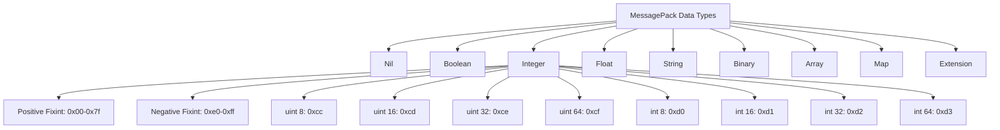
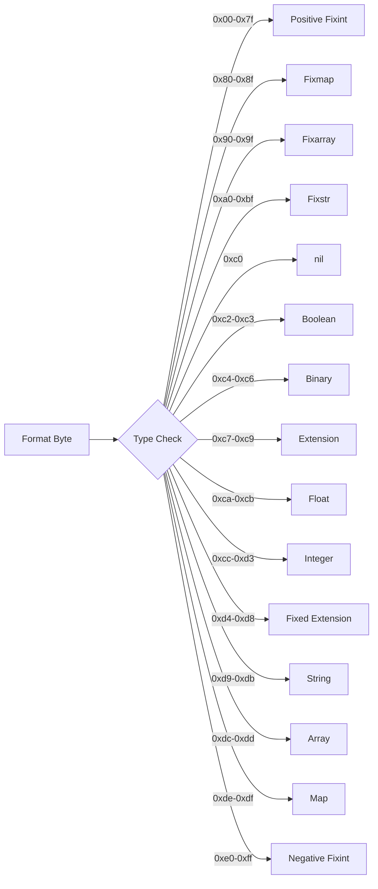
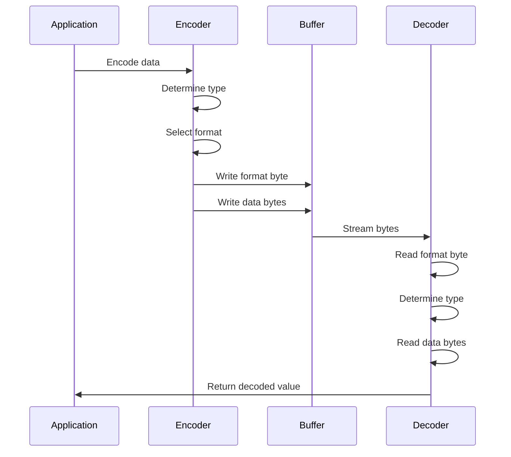

# MessagePack

MessagePackは、JSONのようなデータ構造を効率的にシリアライズするためのバイナリフォーマットである。2009年に古橋貞之によって開発され[^1]、現在では多くのプログラミング言語で実装されている。MessagePackの設計思想は「JSONよりも高速でコンパクト」という明確な目標に基づいており、この目標を達成するために様々な工学的工夫が施されている。

MessagePackの本質的な特徴は、データ型情報とデータ本体を単一のバイトストリームに効率的にエンコードする点にある。JSONがテキストベースでヒューマンリーダブルな形式を採用しているのに対し、MessagePackはマシンフレンドリーなバイナリ形式を採用することで、パース処理の高速化とデータサイズの削減を実現している。この設計判断は、ネットワーク帯域幅が限られた環境や、大量のデータを高速に処理する必要があるシステムにおいて重要な意味を持つ。

## データ型とエンコーディング仕様

MessagePackは、動的型付け言語と静的型付け言語の両方で使用できるよう、豊富なデータ型をサポートしている。基本的なデータ型として、nil、boolean、integer、float、string、binary、array、map、extensionの9種類が定義されている[^2]。これらの型は、JSONがサポートする型のスーパーセットになっており、JSONからMessagePackへの変換は常に可能である一方、逆変換では情報の損失が発生する可能性がある。



整数型のエンコーディングは特に興味深い最適化が施されている。0から127までの正の整数は1バイトでエンコードされ、-32から-1までの負の整数も同様に1バイトでエンコードされる。これはfixintと呼ばれる形式で、最も頻繁に使用される小さな整数値を効率的に表現できる。より大きな整数値に対しては、値の範囲に応じて適切なサイズの型が選択される。例えば、128から255までの値はuint8として2バイトでエンコードされ、256から65535まではuint16として3バイトでエンコードされる。

文字列のエンコーディングも同様の最適化が行われている。31バイト以下の短い文字列はfixstrとして扱われ、長さ情報が1バイトのヘッダーに含まれる。より長い文字列に対しては、str8（255バイトまで）、str16（65535バイトまで）、str32（4GBまで）の形式が用意されている。この段階的なサイズ拡張により、一般的なケースでのオーバーヘッドを最小限に抑えつつ、大きなデータにも対応できる柔軟性を確保している。

## フォーマット構造の詳細

MessagePackのフォーマット構造は、各データ型に対して最適化されたエンコーディング方式を採用している。フォーマット識別子は通常1バイトで表現され、このバイトの値によってデータ型とエンコーディング方式が決定される。



フォーマット識別子の設計には、使用頻度を考慮した最適化が施されている。最も頻繁に使用される小さな正の整数（0-127）は、フォーマット識別子自体が値を表現するため、追加のバイトを必要としない。同様に、小さな負の整数（-32から-1）、短い文字列（31バイト以下）、小さな配列（15要素以下）、小さなマップ（15エントリ以下）も、フォーマット識別子に長さ情報を埋め込むことで、コンパクトな表現を実現している。

配列とマップのエンコーディングでは、要素数に応じて異なる形式が使用される。fixarray（15要素以下）、array16（65535要素以下）、array32（約43億要素まで）の3段階の形式が用意されており、一般的なケースでのオーバーヘッドを最小限に抑えている。マップも同様にfixmap、map16、map32の3段階の形式を持つ。

## JSONとの比較とトレードオフ

MessagePackとJSONの最も顕著な違いは、データ表現の効率性にある。例えば、整数値42をエンコードする場合、JSONでは"42"という2バイトのテキスト表現が必要だが、MessagePackでは0x2aという1バイトで表現できる。この差は大きな数値や浮動小数点数でさらに顕著になる。64ビット整数9223372036854775807をJSONで表現すると19バイト必要だが、MessagePackでは型識別子を含めても9バイトで済む。

```python
# JSON representation
json_data = '{"id": 42, "name": "Alice", "score": 98.5}'
# 44 bytes

# MessagePack equivalent (conceptual hex representation)
# 0x83 (fixmap with 3 entries)
# 0xa2 "id" 0x2a (42)
# 0xa4 "name" 0xa5 "Alice"
# 0xa5 "score" 0xcb 0x40 0x58 0xa0 0x00 0x00 0x00 0x00 0x00 (98.5)
# Approximately 27 bytes
```

しかし、MessagePackにはいくつかのトレードオフも存在する。最も明白なのは、バイナリ形式であるため人間が直接読み書きすることができない点である。デバッグやログ分析の際には、MessagePackデータをデコードするツールが必要となる。また、テキストエディタで直接編集することもできないため、設定ファイルなど人間が編集する必要があるデータには適さない。

もう一つの重要なトレードオフは、スキーマレスであることによる型安全性の欠如である。MessagePackは動的型付けを前提としているため、デコード時まで実際のデータ型が分からない。これは柔軟性を提供する一方で、静的型付け言語では追加の型チェックやバリデーションが必要となる。Protocol BuffersやApache Avroなどのスキーマベースのシリアライゼーション形式と比較すると、この点は明確な違いとなる。

## 実装の詳細と性能特性

MessagePackの実装において重要な設計判断の一つは、ストリーミング処理のサポートである。MessagePackのフォーマットは、データを先頭から順次読み込んでデコードできるよう設計されており、全体をメモリに読み込む必要がない。これは大きなデータセットを扱う際に重要な特性である。

パース処理の高速化には、いくつかの工夫が施されている。まず、フォーマット識別子を1バイトに収めることで、型判定を単純なテーブルルックアップで実現できる。また、固定長型（整数、浮動小数点数など）は読み取るバイト数が事前に分かるため、効率的なメモリアクセスが可能である。可変長型（文字列、配列など）も、長さ情報が先頭に配置されているため、必要なメモリを事前に確保できる。



メモリ効率性の観点では、MessagePackのエンコーダーとデコーダーは最小限のメモリフットプリントで動作するよう設計されている。エンコード時は、出力バッファへの逐次書き込みが可能であり、入力データ全体をメモリに保持する必要がない。デコード時も同様に、ストリーミング処理により大きなデータセットを効率的に処理できる。

性能特性として特筆すべきは、CPUキャッシュの効率的な利用である。MessagePackのコンパクトなデータ表現は、より多くのデータをCPUキャッシュに収めることができ、キャッシュミスによる性能低下を抑制する。また、バイナリ形式であるため、文字列から数値への変換のような計算コストの高い処理を避けることができる。

## 拡張型とカスタマイズ

MessagePackの拡張型（Extension Type）は、標準のデータ型では表現できないカスタムデータ型をサポートするための機構である。拡張型は、-128から127までの型番号と、任意長のバイナリデータで構成される。型番号0から127はアプリケーション固有の用途に予約されており、-128から-1はMessagePack仕様で将来の拡張のために予約されている[^3]。

拡張型の実装例として、タイムスタンプ型が挙げられる。MessagePack仕様では、型番号-1をタイムスタンプ型として定義している。この型は、秒とナノ秒の精度で時刻を表現でき、32ビット、64ビット、96ビットの3つの形式をサポートしている。32ビット形式は1970年から2106年までの秒精度の時刻を表現でき、64ビット形式は秒とナノ秒を30ビットと34ビットで表現し、96ビット形式は完全な64ビット秒と32ビットナノ秒を格納できる。

## 実践的な設計指針

MessagePackを実際のシステムで使用する際には、いくつかの設計指針を考慮する必要がある。まず、データの後方互換性について慎重に検討する必要がある。MessagePackはスキーマレスであるため、フィールドの追加や削除は比較的容易だが、型の変更は互換性の問題を引き起こす可能性がある。例えば、整数型から浮動小数点型への変更は、古いデコーダーでエラーを引き起こす。

バージョニング戦略として、マップのトップレベルにバージョン番号を含める方法が一般的である。これにより、デコーダーはデータのバージョンを確認し、適切な処理を選択できる。また、オプショナルなフィールドはマップのキーとして追加し、デコーダーは知らないキーを無視するよう実装することで、前方互換性を確保できる。

```python
# Version-aware encoding example
data = {
    "version": 2,
    "id": 12345,
    "name": "Example",
    "new_field": "Added in version 2"  # Older decoders will ignore this
}
```

パフォーマンスの最適化においては、データ構造の設計が重要である。小さな整数値、短い文字列、小さな配列やマップは、MessagePackの固定長形式を活用できるため効率的である。大きなデータセットを扱う場合は、ストリーミング処理を活用し、メモリ使用量を抑制することが重要である。

エラーハンドリングについても考慮が必要である。MessagePackのデコード処理では、不正なフォーマット、予期しない型、データの切り詰めなど、様々なエラーが発生する可能性がある。堅牢なシステムでは、これらのエラーを適切に処理し、必要に応じてフォールバック処理を実装する必要がある。

セキュリティの観点では、信頼できないソースからのMessagePackデータをデコードする際の注意が必要である。特に、極端に大きなサイズ値を含む悪意のあるデータは、メモリ枯渇攻撃につながる可能性がある。デコーダーの実装では、最大サイズの制限やメモリ割り当ての検証が重要である。

## プロトコル設計における位置づけ

MessagePackは、様々なシリアライゼーション形式の中で独自の位置を占めている。JSONと比較すると効率性で優れ、Protocol BuffersやApache Thriftと比較するとスキーマレスで柔軟性が高い。この特性により、MessagePackは特定のユースケースで最適な選択となる。

リアルタイムメッセージングシステムでは、MessagePackの低レイテンシ特性が重要である。例えば、WebSocketを使用したリアルタイム通信では、メッセージサイズの削減が帯域幅の節約とレイテンシの改善につながる。また、モバイルアプリケーションでは、データ使用量の削減がユーザー体験の向上とコスト削減に貢献する。

分散システムにおけるRPC（Remote Procedure Call）フレームワークでも、MessagePackは広く採用されている。MessagePack-RPCは、MessagePackをベースとしたRPCプロトコルであり、言語中立的なインターフェースを提供する。この実装では、リクエストとレスポンスがMessagePackでエンコードされ、効率的な通信を実現している。

データストレージの文脈では、MessagePackはJSONよりもコンパクトでありながら、バイナリ形式特有の問題（エンディアンの違いなど）を回避している。MessagePackは明示的にビッグエンディアンを使用することで、プラットフォーム間の互換性を確保している。

## 実装における最適化技術

高性能なMessagePack実装では、様々な最適化技術が使用されている。SIMD（Single Instruction, Multiple Data）命令を使用した並列処理により、複数のバイトを同時に処理することで、エンコード/デコード性能を向上させることができる。特に、文字列のバリデーションや整数のバイトスワップ処理において、SIMD命令は大きな性能向上をもたらす。

ゼロコピー実装も重要な最適化である。特に大きな文字列やバイナリデータを扱う場合、データのコピーを避けることで性能とメモリ効率を改善できる。多くの実装では、デコード時に元のバッファへの参照を返すオプションを提供している。

```rust
// Zero-copy decoding example in Rust
let data: &[u8] = get_msgpack_data();
let value: Value = rmp_serde::from_slice(data)?;
match value {
    Value::String(s) => {
        // 's' is a reference to the original buffer
        // No allocation or copy occurred
    }
    _ => {}
}
```

JITコンパイルを使用した動的最適化も一部の実装で採用されている。頻繁に使用されるデータ構造のエンコード/デコード処理を、実行時に最適化されたマシンコードにコンパイルすることで、インタープリタのオーバーヘッドを削減できる。

## エコシステムと標準化

MessagePackのエコシステムは、50以上のプログラミング言語で実装が提供されている成熟したものである。各言語の実装は、言語固有の最適化や慣用的なAPIを提供しながら、フォーマットレベルでの互換性を維持している。この広範な言語サポートは、異なる言語で書かれたシステム間の相互運用性を実現する上で重要である。

標準化の取り組みとして、MessagePack仕様はGitHubで管理され、コミュニティによる改善提案を受け入れている[^4]。仕様の変更は後方互換性を重視し、既存の実装やデータとの互換性を維持することが求められる。この保守的なアプローチにより、MessagePackは安定した基盤技術として信頼されている。

テスト互換性の確保も重要な取り組みである。MessagePackコミュニティは、各実装が正しく動作することを検証するための共通テストスイートを提供している。このテストスイートには、エッジケースや境界値のテスト、各データ型の組み合わせテストが含まれており、実装間の互換性を保証している。

MessagePackは、効率性と簡潔性のバランスを追求したシリアライゼーション形式として、現代のソフトウェアシステムにおいて重要な役割を果たしている。その設計思想と実装の詳細を理解することは、適切な技術選択と効果的な活用のために不可欠である。

[^1]: Furuhashi, S. (2009). MessagePack: It's like JSON. but fast and small. https://msgpack.org/

[^2]: MessagePack specification. (2024). https://github.com/msgpack/msgpack/blob/master/spec.md

[^3]: MessagePack Extension Types Registry. https://github.com/msgpack/msgpack/blob/master/spec.md#extension-types

[^4]: MessagePack GitHub Repository. https://github.com/msgpack/msgpack