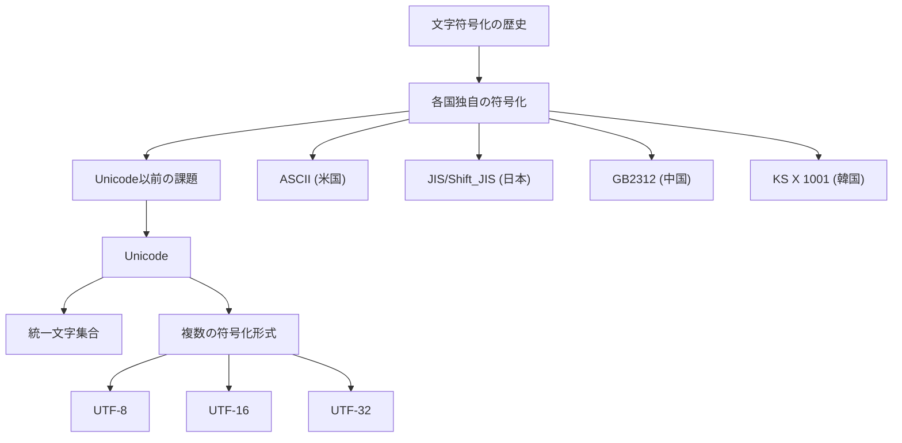
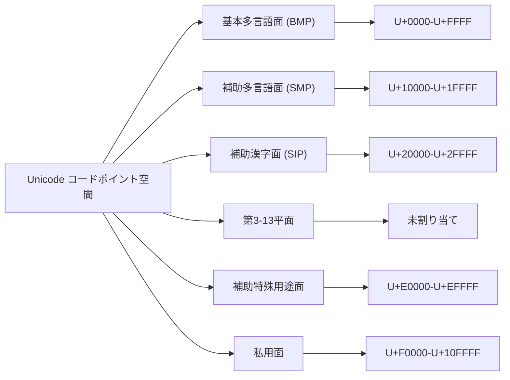
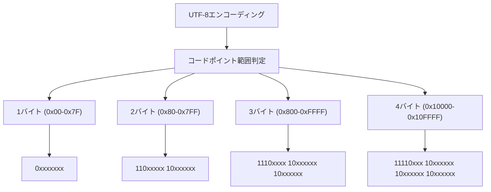
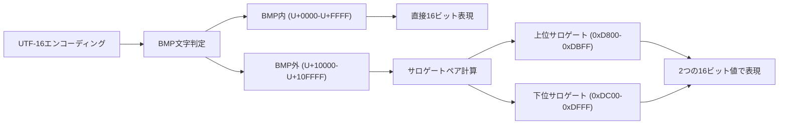
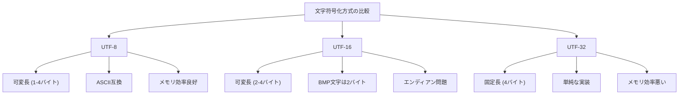
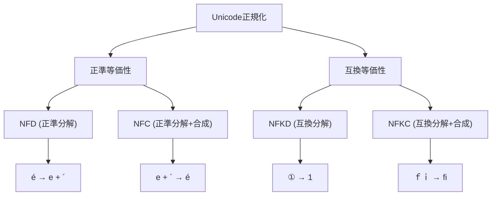
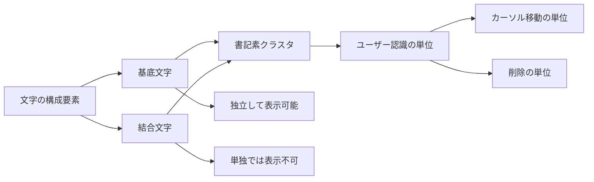
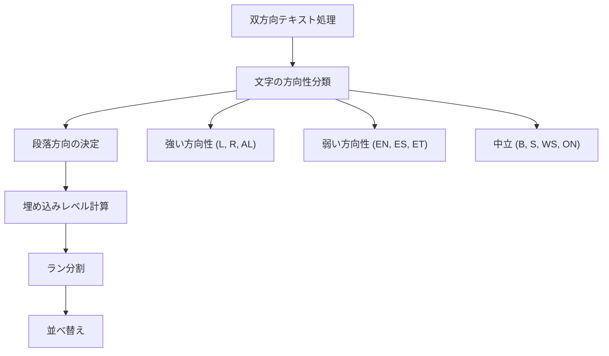
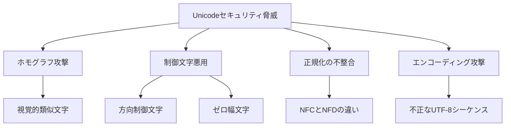
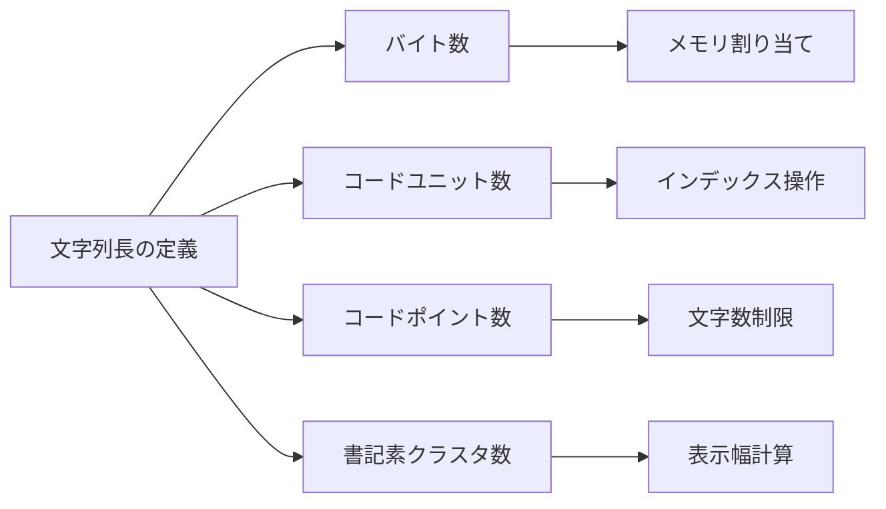

# Unicode

コンピュータ上で文字を扱うという一見単純な要求は、実際には複雑な技術的課題を内包している。世界中の言語体系は多様であり、それぞれが独自の文字体系を持つ。日本語の漢字・ひらがな・カタカナ、アラビア語の右から左への記述、タイ語の声調記号など、各言語固有の特性をコンピュータ上で統一的に扱うことは容易ではない。Unicodeは、この課題に対する包括的な解決策として設計された文字符号化標準である。

Unicodeが登場する以前、各国・各地域では独自の文字符号化方式が使用されていた。日本ではJIS、Shift_JIS、EUC-JPが並立し、欧米ではASCIIやISO-8859シリーズが使用されていた。これらの符号化方式は互いに非互換であり、異なる符号化方式間でのデータ交換には常に変換処理が必要だった。さらに、一つの文書内で複数の言語を扱うことは極めて困難であった。例えば、日本語と韓国語を同一文書内で扱う場合、文字化けを避けるための複雑な処理が必要となっていた。

Unicodeプロジェクトは1987年に開始され、1991年にVersion 1.0が公開された。その設計思想は「世界中のすべての文字を単一の文字集合で表現する」というものである。この野心的な目標は、当時としては革新的であり、多くの技術的課題を伴っていた。Unicode Consortiumは、言語学者、エンジニア、各国の標準化団体と協力し、世界中の文字体系を体系的に整理・分類していった。

## 文字集合と符号化の基本概念

Unicodeを理解する上で最も重要な概念は、「文字集合」と「符号化形式」の区別である。文字集合（Character Set）は、扱う文字の集まりとそれぞれに割り当てられた番号（コードポイント）を定義する。一方、符号化形式（Encoding Form）は、これらのコードポイントを実際のバイト列として表現する方法を定義する。

Unicodeにおいて、各文字にはU+0000からU+10FFFFまでの範囲のコードポイントが割り当てられる。この表記法において、U+は16進数のUnicodeコードポイントであることを示す接頭辞である。例えば、ラテン文字の'A'はU+0041、日本語の'あ'はU+3042、絵文字の'😀'はU+1F600というコードポイントを持つ。現在のUnicode標準では、1,114,112個のコードポイントが定義可能であり、そのうち約14万個が実際の文字に割り当てられている[^1]。

コードポイントの割り当ては、体系的に行われている。Unicode標準では、コードポイント空間を17個の平面（Plane）に分割している。各平面は65,536個（2^16）のコードポイントを含む。最も重要な平面は基本多言語面（Basic Multilingual Plane, BMP）と呼ばれる第0平面であり、U+0000からU+FFFFまでの範囲を占める。BMPには、世界の主要な言語で使用される文字の大部分が含まれている。

Unicode標準は、単に文字にコードポイントを割り当てるだけでなく、各文字の属性情報も定義している。これらの属性には、文字の一般カテゴリ（General Category）、文字の方向性（Bidirectional Class）、大文字・小文字の対応関係、数値としての値などが含まれる。例えば、文字'A'の一般カテゴリは「Lu（大文字）」であり、対応する小文字は'a'（U+0061）である。これらの属性情報は、テキスト処理において重要な役割を果たす。

## UTF-8の設計と実装

UTF-8は、Ken ThompsonとRob Pikeによって1992年に設計された可変長符号化方式である[^2]。UTF-8の最大の特徴は、ASCIIとの完全な後方互換性を持つことである。ASCIIで表現可能な文字（U+0000からU+007F）は、UTF-8でも1バイトで表現され、そのバイト値はASCIIと同一である。この設計により、既存のASCIIベースのシステムとの互換性が保たれた。

UTF-8の符号化規則は、巧妙に設計されている。各バイトの最上位ビットパターンによって、そのバイトが文字の開始バイトか継続バイトかを判別できる。具体的には以下の規則に従う：

1バイト文字（U+0000 - U+007F）：0xxxxxxx
2バイト文字（U+0080 - U+07FF）：110xxxxx 10xxxxxx
3バイト文字（U+0800 - U+FFFF）：1110xxxx 10xxxxxx 10xxxxxx
4バイト文字（U+10000 - U+10FFFF）：11110xxx 10xxxxxx 10xxxxxx 10xxxxxx

この符号化方式により、バイト列の任意の位置から文字境界を特定できる自己同期性（self-synchronizing）を実現している。継続バイトは常に10で始まるため、バイト列の途中から読み始めても、次の文字の開始位置を容易に見つけることができる。

UTF-8の設計には、セキュリティ上の考慮も含まれている。最短形式（shortest form）の原則により、各文字は可能な限り短いバイト列で符号化されなければならない。例えば、文字'A'（U+0041）を2バイト以上で符号化することは禁止されている。この制約により、同一文字の複数表現を悪用したセキュリティ攻撃を防ぐことができる。

UTF-8のもう一つの重要な特性は、コードポイントの順序とバイト列の辞書順が一致することである。つまり、UTF-8でエンコードされた文字列は、バイト単位での比較でも正しい文字順序を保つ。この特性により、UTF-8を意識しないシステムでも、ある程度正しい文字列比較が可能となる。

## UTF-16とサロゲートペア

UTF-16は、Unicodeの初期設計に基づく符号化方式である。当初、Unicodeは65,536文字で世界中のすべての文字を表現できると想定していた。この前提に基づき、UTF-16では基本多言語面の文字を2バイト（16ビット）で表現する。しかし、漢字の追加や絵文字の導入により、65,536文字では不足することが明らかになった。

この問題を解決するため、サロゲートペアという仕組みが導入された。サロゲートペアは、BMPの特定範囲（U+D800からU+DFFF）を予約し、この範囲の2つのコード単位を組み合わせてBMP外の文字を表現する。上位サロゲート（U+D800-U+DBFF）と下位サロゲート（U+DC00-U+DFFF）のペアで、U+10000からU+10FFFFまでの文字を表現できる。

サロゲートペアの計算方法は以下の通りである。コードポイントをCとすると：
1. C' = C - 0x10000（20ビットの値を得る）
2. 上位サロゲート = 0xD800 + (C' >> 10)
3. 下位サロゲート = 0xDC00 + (C' & 0x3FF)

UTF-16の利点は、多くの実用的な文字（特にBMP内の文字）を固定長2バイトで表現できることである。これは、文字列の長さ計算やインデックスアクセスを高速化する。一方で、サロゲートペアの存在により、完全な固定長符号化ではなくなった。また、バイトオーダー（エンディアン）の問題もある。UTF-16では、ビッグエンディアン（UTF-16BE）とリトルエンディアン（UTF-16LE）の両方が定義されており、バイトオーダーマーク（BOM）を使用して区別することが推奨されている。

JavaやC#、JavaScriptなどの言語は、内部文字列表現としてUTF-16を採用している。これは、これらの言語が設計された時期にUTF-16が主流だったためである。しかし、サロゲートペアの存在により、文字列処理において注意が必要となる。例えば、JavaScriptのString.lengthは16ビット単位の長さを返すため、サロゲートペアを含む文字列では実際の文字数と異なる値を返す。

## UTF-32と固定長符号化

UTF-32は、すべてのUnicodeコードポイントを4バイト（32ビット）の固定長で表現する符号化方式である。この方式の最大の利点は、その単純性にある。各文字が固定長であるため、文字列のn番目の文字へのアクセスがO(1)で可能であり、文字数の計算も容易である。

UTF-32の符号化規則は極めて単純で、コードポイントの値をそのまま32ビット整数として格納する。例えば、文字'A'（U+0041）は0x00000041として、絵文字'😀'（U+1F600）は0x0001F600として表現される。この直接的な対応関係により、エンコード・デコード処理は他の符号化方式と比べて高速である。

しかし、UTF-32には重大な欠点がある。それは、メモリ効率の悪さである。ASCII文字も4バイトを占有するため、英語のテキストではUTF-8の4倍のメモリを消費する。日本語のテキストでも、多くの文字がUTF-8では3バイトで表現できるため、UTF-32はメモリ効率が悪い。このメモリ使用量の増大は、キャッシュ効率の低下にもつながり、実際の処理速度に悪影響を与える可能性がある。

UTF-32は、主に内部処理やインデックス計算が頻繁に必要なアプリケーションで使用される。例えば、テキストエディタの内部表現や、文字単位での高速な検索・置換が必要なシステムでは、UTF-32の固定長特性が有利に働く。しかし、ファイルへの保存やネットワーク通信では、通常UTF-8やUTF-16に変換される。

## 正規化とその必要性

Unicodeでは、同じ視覚的表現を持つ文字列が複数の異なるコードポイント列で表現できる場合がある。例えば、「é」という文字は、単一の文字U+00E9（LATIN SMALL LETTER E WITH ACUTE）として表現することも、基底文字U+0065（LATIN SMALL LETTER E）と結合文字U+0301（COMBINING ACUTE ACCENT）の組み合わせとして表現することもできる。この多様性は、文字列比較やテキスト処理において問題を引き起こす。

Unicode正規化は、これらの等価な表現を標準的な形式に変換するプロセスである。Unicode標準では、4つの正規化形式が定義されている[^3]：

NFD（Canonical Decomposition）：正準分解。合成済み文字を可能な限り分解する。
NFC（Canonical Decomposition, followed by Canonical Composition）：正準分解後、正準合成。最も一般的に使用される形式。
NFKD（Compatibility Decomposition）：互換分解。視覚的に類似した文字も分解する。
NFKC（Compatibility Decomposition, followed by Canonical Composition）：互換分解後、正準合成。

正準等価性（Canonical Equivalence）と互換等価性（Compatibility Equivalence）の違いは重要である。正準等価な文字列は、完全に同一の意味と表現を持つ。一方、互換等価な文字列は、視覚的に類似しているが、微妙に異なる意味を持つ可能性がある。例えば、全角文字「Ａ」（U+FF21）と半角文字「A」（U+0041）は互換等価であるが、正準等価ではない。

正規化の実装は複雑である。Unicode標準では、各文字に結合クラス（Combining Class）という属性が定義されており、複数の結合文字が連続する場合の順序を決定する。結合クラスが0の文字は基底文字であり、非0の値を持つ文字は結合文字である。正規化処理では、結合文字を結合クラスの値に基づいて安定ソートする必要がある。

正規化は、多くの実用的な場面で必要となる。ファイルシステムでは、ファイル名の一意性を保証するために正規化が使用される。macOSのHFS+ファイルシステムは、ファイル名をNFD形式で保存する。一方、多くのWebアプリケーションでは、ユーザー入力をNFC形式に正規化してから保存する。検索エンジンでは、NFKC正規化を使用して、視覚的に類似した文字列を同一視することがある。

## 結合文字と文字クラスタ

結合文字（Combining Character）は、前の基底文字と組み合わせて一つの視覚的単位を形成する文字である。結合文字には、アクセント記号、声調記号、ヘブライ語の母音記号、アラビア語の短母音記号などが含まれる。結合文字の存在により、Unicodeは限られたコードポイント数で膨大な文字の組み合わせを表現できる。

しかし、結合文字の存在は、文字列処理を複雑にする。例えば、「文字数を数える」という単純な操作でも、コードポイント数、16ビット単位数、視覚的文字数（書記素クラスタ数）のどれを数えるかによって結果が異なる。書記素クラスタ（Grapheme Cluster）は、ユーザーが一つの文字として認識する単位であり、基底文字とそれに続くすべての結合文字から構成される。

書記素クラスタの境界を正確に判定するには、Unicode標準のGrapheme Break規則に従う必要がある[^4]。これらの規則は、各文字のGrapheme_Cluster_Break属性に基づいて定義されている。例えば、地域指示記号（Regional Indicator）は、2つ連続して国旗の絵文字を形成するため、特別な処理が必要である。

結合文字の処理で特に注意が必要なのは、文字列の部分的な操作である。文字列の切り取りや挿入を行う際に、書記素クラスタの境界を考慮しないと、不正な文字列を生成する可能性がある。例えば、基底文字と結合文字の間で文字列を分割すると、孤立した結合文字が生じ、表示が乱れる原因となる。

現代のプログラミング言語やライブラリは、書記素クラスタを適切に処理するためのAPIを提供している。例えば、Swift言語では、String型がデフォルトで書記素クラスタ単位での操作をサポートしている。ICU（International Components for Unicode）ライブラリは、多くの言語で利用可能な包括的なUnicode処理機能を提供している。

## 双方向テキストとその処理

アラビア語やヘブライ語などの言語は、右から左（RTL: Right-to-Left）に記述される。これらの言語と左から右（LTR: Left-to-Right）に記述される言語が混在する文書では、テキストの表示順序が複雑になる。Unicode双方向アルゴリズム（Unicode Bidirectional Algorithm、通称BiDi）は、このような混在テキストの表示順序を決定するための規則を定義している[^5]。

BiDiアルゴリズムの基本的な考え方は、各文字に方向性（Bidirectional Class）を割り当て、これに基づいてテキストの表示順序を決定することである。文字は、強い方向性を持つ文字（アラビア文字、ヘブライ文字、ラテン文字など）、弱い方向性を持つ文字（数字、句読点など）、中立的な文字（空白、改行など）に分類される。

BiDiアルゴリズムは、段落レベルでの基本方向の決定から始まる。段落の最初の強い方向性を持つ文字によって、段落全体の基本方向が決定される。その後、文字の方向性と文脈に基づいて、各文字の表示レベル（偶数がLTR、奇数がRTL）が計算される。最終的に、同じレベルの連続する文字がランとしてグループ化され、レベルに応じて並べ替えられる。

BiDiアルゴリズムには、明示的な方向制御文字も定義されている。これらの文字を使用することで、デフォルトのアルゴリズムでは正しく表示されないテキストの方向を制御できる。主な制御文字には以下のものがある：

- LRM（Left-to-Right Mark, U+200E）：後続のテキストをLTR方向に強制
- RLM（Right-to-Left Mark, U+200F）：後続のテキストをRTL方向に強制
- LRE（Left-to-Right Embedding, U+202A）：埋め込みレベルを上げてLTR領域を作成
- RLE（Right-to-Left Embedding, U+202B）：埋め込みレベルを上げてRTL領域を作成
- PDF（Pop Directional Formatting, U+202C）：埋め込みレベルを元に戻す

BiDiの実装は複雑であり、多くのエッジケースが存在する。例えば、括弧や引用符などのミラー文字は、RTLコンテキストでは視覚的に反転する必要がある。また、数字の表示順序は、周囲のテキストの方向性に関わらず常にLTRである。これらの規則を正確に実装することは、国際化対応アプリケーションにとって重要である。

## セキュリティとUnicode

Unicodeの豊富な文字セットは、新たなセキュリティ上の課題をもたらしている。視覚的に類似した文字を悪用したフィッシング攻撃、制御文字を使用したインジェクション攻撃、正規化の違いを利用した回避技術など、様々な攻撃手法が存在する。

ホモグラフ攻撃は、視覚的に類似した文字を使用してユーザーを欺く手法である。例えば、キリル文字の'а'（U+0430）とラテン文字の'a'（U+0061）は、多くのフォントで区別がつかない。攻撃者は、これらの文字を使用して正規のドメイン名に似せた偽のドメイン名を作成し、フィッシングサイトに誘導する。IDN（Internationalized Domain Names）では、この問題に対処するため、混在スクリプトの制限やconfusable文字の検出などの対策が実装されている[^6]。

Unicodeには、表示に影響を与えない、または予期しない影響を与える制御文字が多数存在する。これらの文字は、セキュリティ上の脆弱性を引き起こす可能性がある：

- ゼロ幅文字（ZWSP, ZWNJ, ZWJ）：見えない文字として、データの隠蔽や改ざんに悪用される可能性
- 方向制御文字（RLO, LRO）：ファイル名の偽装に使用される（例：photo_U+202Egnp.exe → photo_exe.png）
- 異体字セレクタ：同じ文字の異なる表示形を選択し、視覚的な混乱を引き起こす

正規化の問題も、セキュリティ上重要である。システムの異なる部分で異なる正規化形式を使用すると、同一性チェックをバイパスできる可能性がある。例えば、アクセス制御リストがNFC形式で保存されているが、入力検証がNFD形式で行われる場合、権限チェックを回避できる可能性がある。

これらの脅威に対処するため、アプリケーション開発者は以下の対策を実装する必要がある：

1. 入力検証：信頼できない入力に対して、許可された文字セットのみを受け入れる
2. 正規化の一貫性：システム全体で同一の正規化形式を使用する
3. 視覚的な確認：重要な操作では、ユーザーに視覚的な確認を求める
4. confusable検出：Unicode Consortiumが提供するconfusableデータを使用して、類似文字を検出する
5. エンコーディング検証：不正なUTF-8シーケンスを拒否し、最短形式を強制する

## 実装上の考慮事項

Unicodeを扱うソフトウェアを開発する際には、多くの実装上の課題に直面する。これらの課題は、パフォーマンス、メモリ使用量、互換性、正確性のバランスを取ることに関連している。

文字列の内部表現の選択は、最も基本的な設計決定の一つである。UTF-8、UTF-16、UTF-32のそれぞれに利点と欠点がある。多くの現代的なシステムでは、UTF-8が外部表現（ファイル、ネットワーク）として使用され、内部表現は用途に応じて選択される。例えば、Rustは内部的にUTF-8を使用し、GoもUTF-8を採用している。一方、Java、C#、JavaScriptはUTF-16を使用している。

文字列の長さの定義も重要な問題である。「文字列の長さ」という概念には、少なくとも以下の4つの解釈がある：

1. バイト数：メモリ使用量やバッファサイズの計算に使用
2. コードユニット数：UTF-16では16ビット単位、UTF-8では8ビット単位
3. コードポイント数：Unicode文字の数
4. 書記素クラスタ数：ユーザーが認識する文字の数

各定義は異なる用途に適しており、APIデザインではこれらを明確に区別する必要がある。

文字列の比較と照合（Collation）も複雑な問題である。単純なバイト比較では、言語固有の順序規則を反映できない。例えば、ドイツ語では「ö」は「o」と「p」の間に位置するが、スウェーデン語では「z」の後に来る。Unicode Collation Algorithm（UCA）は、言語に依存した文字列の比較と並び替えのための包括的な規則を提供している[^7]。

大文字・小文字変換も、見た目以上に複雑である。一対一の対応がない場合がある。例えば、ドイツ語の「ß」の大文字は「SS」である。また、トルコ語では、「i」の大文字は「İ」（上に点がある）であり、「I」の小文字は「ı」（点がない）である。これらの言語固有の規則を正しく処理するには、ロケール情報が必要である。

正規表現エンジンのUnicode対応も重要である。Unicode対応の正規表現エンジンは、文字クラス（\p{Letter}、\p{Number}など）、書記素クラスタのマッチング、大文字小文字を区別しない比較などをサポートする必要がある。また、サロゲートペアや結合文字を適切に処理する必要がある。

パフォーマンスの最適化も重要な考慮事項である。UTF-8の可変長特性により、ランダムアクセスはO(n)の操作となる。これを改善するため、一部の実装では、文字列と共にインデックステーブルを保持し、特定の位置へのアクセスを高速化している。また、ASCII専用の高速パスを実装することで、英語テキストの処理性能を向上させることができる。

## 将来の展望と標準化プロセス

Unicode標準は、年に一度更新され、新しい文字や絵文字が追加される。この継続的な拡張は、世界中の言語コミュニティのニーズに応えるために必要である。しかし、同時に実装者にとっては、常に最新の標準に追従する必要があるという課題をもたらしている。

Unicode Consortiumの標準化プロセスは、透明性と包括性を重視している。新しい文字の提案は、誰でも提出することができ、技術委員会によって慎重に審査される。提案には、文字の使用例、既存の使用状況の証拠、他の類似文字との区別などが必要である。このプロセスには通常、数年を要する。

近年の重要な追加には、多様性を反映した絵文字（肌の色のバリエーション、性別中立的な表現など）、歴史的な文字体系（古代エジプトのヒエログリフ、楔形文字など）、少数言語の文字などがある。これらの追加は、デジタル時代における文化的多様性の保存に貢献している。

Unicodeの実装における課題は、今後も続くと予想される。特に、機械学習やAIシステムにおける多言語処理、拡張現実（AR）や仮想現実（VR）環境での文字表示、量子コンピューティング時代の文字エンコーディングなど、新しい技術領域での課題が生じている。

国際化（i18n）とローカライゼーション（l10n）の文脈では、Unicodeは基盤技術として不可欠である。しかし、文字エンコーディングは国際化の一部に過ぎない。日付・時刻の形式、数値の表記、通貨、住所形式など、文化固有の要素も考慮する必要がある。Common Locale Data Repository（CLDR）は、これらのローカライゼーションデータを提供するプロジェクトである。

[^1]: Unicode Consortium. "The Unicode Standard, Version 15.0." Mountain View, CA: Unicode Consortium, 2022. https://www.unicode.org/versions/Unicode15.0.0/

[^2]: Pike, Rob, and Ken Thompson. "Hello World or Καλημέρα κόσμε or こんにちは 世界." Proceedings of the Winter 1993 USENIX Conference. 1993.

[^3]: Unicode Standard Annex #15: Unicode Normalization Forms. https://www.unicode.org/reports/tr15/

[^4]: Unicode Standard Annex #29: Unicode Text Segmentation. https://www.unicode.org/reports/tr29/

[^5]: Unicode Standard Annex #9: Unicode Bidirectional Algorithm. https://www.unicode.org/reports/tr9/

[^6]: Unicode Technical Standard #39: Unicode Security Mechanisms. https://www.unicode.org/reports/tr39/

[^7]: Unicode Technical Standard #10: Unicode Collation Algorithm. https://www.unicode.org/reports/tr10/