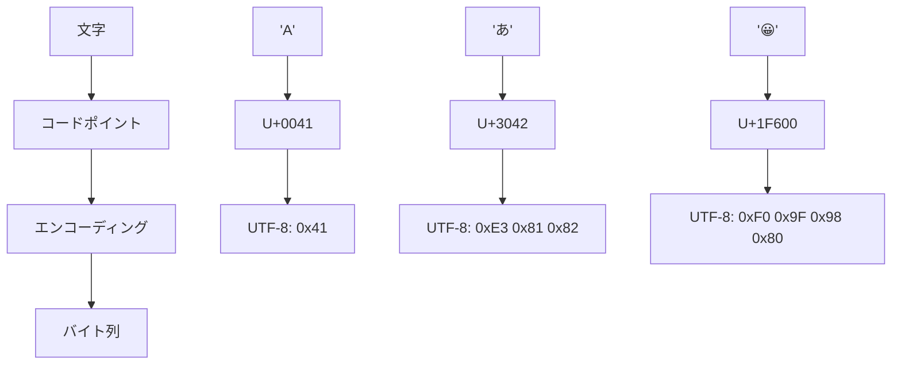
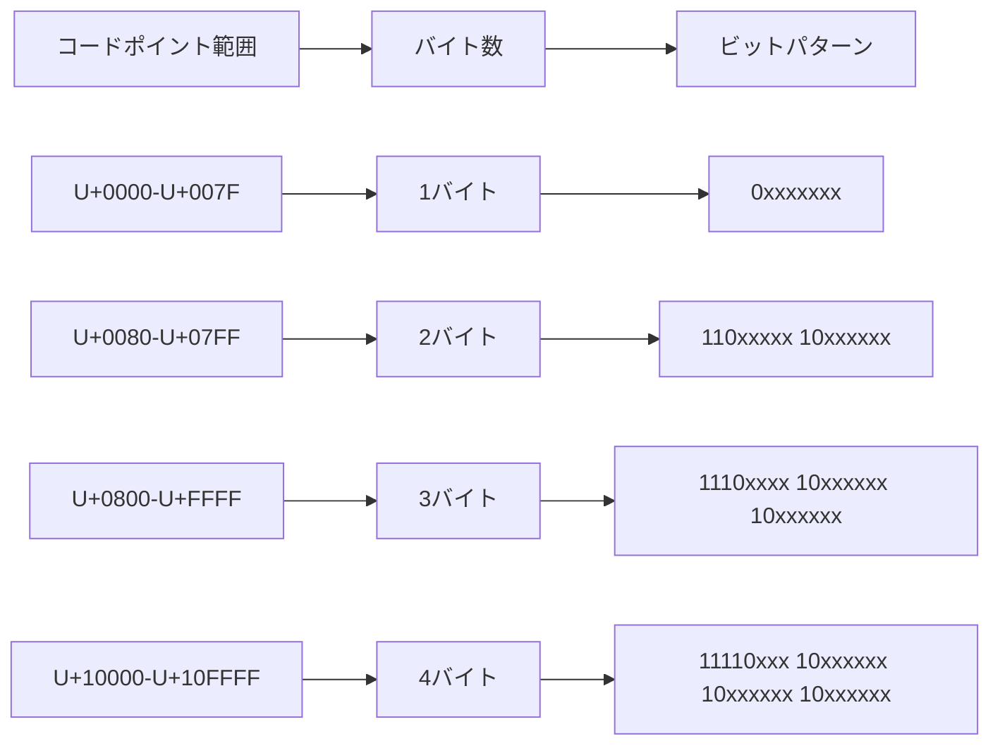
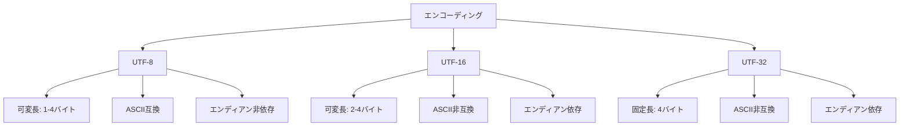

# UTF-8

UTF-8（8-bit Unicode Transformation Format）は、Unicodeコードポイントを1から4バイトの可変長バイト列にエンコードする文字エンコーディング方式である。1992年にKen ThompsonとRob Pike[^1]によって設計されたこのエンコーディング方式は、ASCIIとの完全な後方互換性を保ちながら、世界中のあらゆる文字を表現できる汎用性を持つ。現在では、Webページの98%以上がUTF-8を使用しており[^2]、事実上の標準文字エンコーディングとなっている。

UTF-8の設計は、単なる文字エンコーディング方式の枠を超えて、分散システムやネットワーク通信における文字データの取り扱いに革命をもたらした。その巧妙な設計により、既存のASCIIベースのシステムとの互換性を維持しながら、国際化対応を可能にし、バイト指向のシステムでも効率的に処理できる特性を持つ。本稿では、UTF-8の技術的詳細について、その設計思想から実装上の考慮事項まで、体系的に解説する。

## Unicodeとコードポイント

UTF-8を理解するためには、まずUnicodeの基本概念を把握する必要がある。Unicodeは、世界中のあらゆる文字体系を統一的に扱うための文字集合規格であり、各文字に一意の番号（コードポイント）を割り当てる。コードポイントは通常、U+に続く16進数で表記され、例えば、ラテン文字の'A'はU+0041、日本語の'あ'はU+3042、絵文字の'😀'はU+1F600となる。



Unicode標準[^3]では、コードポイントをU+0000からU+10FFFFまでの範囲で定義しており、これは1,114,112個の可能な値を提供する。この範囲は17個の平面（Plane）に分割され、各平面は65,536個のコードポイントを含む。最も重要なのは基本多言語面（Basic Multilingual Plane, BMP）で、U+0000からU+FFFFまでの範囲を占め、現代の主要な文字の大部分を含んでいる。

UTF-8は、これらのコードポイントを効率的にバイト列にエンコードする方式であり、以下の重要な設計原則に基づいている：

1. **ASCII互換性**: ASCIIコード（U+0000〜U+007F）は1バイトでそのまま表現される
2. **自己同期性**: バイト列の任意の位置から文字境界を判定できる
3. **可変長エンコーディング**: 使用頻度の高い文字ほど短いバイト列で表現
4. **エンディアン非依存**: バイト順序に関係なく同じ表現

## エンコーディングの仕組み

UTF-8のエンコーディング規則は、コードポイントの値に応じて1から4バイトの可変長バイト列を生成する。各バイトの最上位ビットパターンにより、そのバイトが文字の開始バイトか継続バイトかを判別できる設計となっている。



エンコーディングのアルゴリズムは以下のように動作する：

1. **1バイト文字（U+0000〜U+007F）**: ASCIIと完全に同一。最上位ビットが0で、残り7ビットでコードポイントを表現する。

2. **2バイト文字（U+0080〜U+07FF）**: 最初のバイトは110で始まり、2番目のバイトは10で始まる。11ビット分のデータを格納できる。

3. **3バイト文字（U+0800〜U+FFFF）**: 最初のバイトは1110で始まり、続く2バイトは10で始まる。16ビット分のデータを格納できる。

4. **4バイト文字（U+10000〜U+10FFFF）**: 最初のバイトは11110で始まり、続く3バイトは10で始まる。21ビット分のデータを格納できる。

具体的なエンコーディング例を見てみよう。日本語の「あ」（U+3042）をエンコードする場合：

1. U+3042は0x3042（12354）で、U+0800〜U+FFFFの範囲にあるため3バイトエンコーディングを使用
2. 0x3042を2進数で表すと：0011 0000 0100 0010
3. 3バイトパターンに当てはめる：1110xxxx 10xxxxxx 10xxxxxx
4. ビットを配置：11100011 10000001 10000010
5. 16進数表記：0xE3 0x81 0x82

この設計により、UTF-8は以下の重要な特性を持つ：

- **前方互換性**: 将来Unicodeが拡張されても、既存のUTF-8実装で処理可能
- **エラー検出**: 不正なバイト列を検出しやすい
- **部分文字列検索**: 文字境界を考慮せずにバイト単位で検索可能

## 自己同期性とエラー処理

UTF-8の最も優れた特性の一つは、自己同期性（self-synchronizing）である。これは、バイト列の任意の位置から読み始めても、文字境界を正確に判定できることを意味する。各バイトの最上位ビットパターンを見ることで、そのバイトが文字の開始位置か継続バイトかを判断できる。

```python
def find_char_boundary(data, pos):
    """任意の位置から最も近い文字境界を見つける"""
    while pos > 0 and (data[pos] & 0xC0) == 0x80:
        pos -= 1
    return pos
```

この特性は、ストリーム処理やエラー復旧において極めて重要である。通信エラーやデータ破損が発生した場合でも、次の有効な文字境界から処理を再開できる。

UTF-8のエラー処理には、いくつかの重要な考慮事項がある：

1. **オーバーロングエンコーディング**: 同じコードポイントを必要以上に長いバイト列で表現すること。例えば、ASCIIの'A'（U+0041）を2バイトで0xC1 0x81と表現することは禁止されている。これはセキュリティ上の理由による。

2. **サロゲートペア**: UTF-16で使用されるサロゲートペア（U+D800〜U+DFFF）は、UTF-8では無効とされる。

3. **範囲外のコードポイント**: U+10FFFFを超えるコードポイントは無効である。

4. **不完全なシーケンス**: マルチバイト文字が途中で切れている場合の処理。

これらのエラーに対する処理方法は、アプリケーションの要件により異なるが、一般的には以下のアプローチが取られる：

- **置換文字の使用**: 無効なバイト列をU+FFFD（REPLACEMENT CHARACTER）で置き換える
- **エラーの報告**: デコードエラーを例外として報告する
- **スキップ**: 無効なバイトを単純に無視する

## 性能特性と最適化

UTF-8の処理性能は、その可変長という性質上、固定長エンコーディングと比較して複雑になる。しかし、現代のプロセッサアーキテクチャとコンパイラの最適化により、効率的な実装が可能である。

文字列の長さを計算する操作を考えてみよう。UTF-8では、バイト長と文字数が一致しないため、文字数を数えるには全バイトを走査する必要がある：

```c
size_t utf8_strlen(const char *s) {
    size_t len = 0;
    while (*s) {
        if ((*s & 0xC0) != 0x80) len++;
        s++;
    }
    return len;
}
```

しかし、多くの実用的なケースでは、文字数よりもバイト長の方が重要であり、UTF-8はこの点で有利である。また、SIMD命令を使用した高速化も可能で、例えばSSE4.2のPCMPISTRI命令を使用して、複数バイトを並列に処理できる。

メモリ効率の観点では、UTF-8は英語テキストに対して非常に効率的である（ASCIIと同じ1バイト/文字）。日本語や中国語のテキストでは3バイト/文字となるが、これはUTF-16の2バイト/文字と比較してやや劣る。しかし、実際のアプリケーションでは、マークアップ、プログラムコード、URLなどASCII文字が多く含まれるため、全体としてはUTF-8の方が効率的なことが多い。

## 他のエンコーディング方式との比較

UTF-8の設計を理解するには、他の主要なUnicodeエンコーディング方式との比較が有用である。

**UTF-16**は、BMPの文字を2バイトで、それ以外を4バイト（サロゲートペア）で表現する。Javaや.NETの内部表現として使用されているが、以下の欠点がある：

- エンディアン依存（BOMが必要）
- ASCII非互換
- サロゲートペアの処理が複雑
- NULバイトを含む可能性がある

**UTF-32**は、すべてのコードポイントを4バイトで表現する固定長エンコーディングである。処理は単純だが、メモリ効率が悪く、実用的なケースでは採用されることは少ない。



歴史的なエンコーディング方式との比較も重要である。Shift_JISやEUC-JPなどの日本語エンコーディングは、ASCIIとの部分的な互換性はあるものの、以下の問題を抱えていた：

- 言語固有で国際化に対応できない
- エスケープシーケンスが必要な場合がある
- 文字境界の判定が複雑

UTF-8はこれらの問題を解決し、世界中のあらゆる文字を統一的に扱える初めての実用的なエンコーディング方式となった。

## 実装上の考慮事項

UTF-8を実装する際には、いくつかの重要な考慮事項がある。まず、バイト順マーク（BOM）の扱いである。UTF-8ではBOM（0xEF 0xBB 0xBF）は必須ではなく、むしろ推奨されないことが多い。特にUnix系システムでは、BOMは予期しない動作を引き起こす可能性がある。

セキュリティの観点では、以下の点に注意が必要である：

1. **オーバーロングエンコーディングの拒否**: セキュリティチェックを回避する目的で使用される可能性がある
2. **無効なコードポイントの検証**: 特にファイルシステムやURLパーサーでは重要
3. **バッファオーバーフローの防止**: 可変長という性質上、バッファサイズの管理が重要

正規化（Normalization）も重要な課題である。Unicodeでは、同じ文字を複数の方法で表現できる場合がある。例えば、「é」は単一のコードポイント（U+00E9）でも、基底文字「e」（U+0065）と結合文字「´」（U+0301）の組み合わせでも表現できる。これらを統一的に扱うために、Unicode正規化形式（NFC、NFD、NFKC、NFKD）[^4]が定義されている。

データベースやファイルシステムでの使用においては、照合順序（Collation）の問題もある。UTF-8のバイト順序は、必ずしも言語的な並び順と一致しない。例えば、日本語の「あ」（0xE3 0x81 0x82）は、「ん」（0xE3 0x82 0x93）よりもバイト値としては小さいが、五十音順では逆である。

## 現代のシステムにおけるUTF-8

今日、UTF-8は事実上の標準文字エンコーディングとなっている。その成功の要因は、技術的な優位性だけでなく、エコシステム全体での採用にある。

Webにおいては、HTML5がデフォルトエンコーディングとしてUTF-8を規定し[^5]、主要なWebブラウザはすべてUTF-8を完全にサポートしている。プログラミング言語においても、Go、Rust、Swift などの現代的な言語は、文字列の内部表現としてUTF-8を採用している。

オペレーティングシステムレベルでは、LinuxやmacOSがファイルシステムでUTF-8を標準として使用し、WindowsもWindows 10以降でUTF-8のサポートを大幅に改善している。特にWindows 11では、システムロケールとしてUTF-8を選択できるようになり、レガシーアプリケーションでもUTF-8が使用可能になった。

クラウドコンピューティングとマイクロサービスアーキテクチャの普及により、システム間でのデータ交換がますます重要になっている。UTF-8は、その互換性と効率性により、REST APIやgRPCなどの通信プロトコルでも標準的に使用されている。JSONやXMLなどのデータ交換フォーマットも、UTF-8をデフォルトエンコーディングとして採用している。

UTF-8の設計は、30年以上前のものでありながら、現代のコンピューティング環境においても最適な選択であり続けている。その巧妙な設計により、既存システムとの互換性を保ちながら、国際化の要求に応え、効率的な処理を可能にしている。今後も、UTF-8は文字エンコーディングの標準として、デジタルコミュニケーションの基盤を支え続けるだろう。

[^1]: Pike, R., & Thompson, K. (1993). "Hello World or Καλημέρα κόσμε or こんにちは 世界". Proceedings of the Winter 1993 USENIX Conference.

[^2]: W3Techs. (2024). "Usage statistics of character encodings for websites". https://w3techs.com/technologies/overview/character_encoding

[^3]: The Unicode Consortium. (2023). "The Unicode Standard, Version 15.1". https://www.unicode.org/versions/Unicode15.1.0/

[^4]: Unicode Standard Annex #15. (2023). "Unicode Normalization Forms". https://www.unicode.org/reports/tr15/

[^5]: W3C. (2014). "HTML5: A vocabulary and associated APIs for HTML and XHTML". https://www.w3.org/TR/html5/