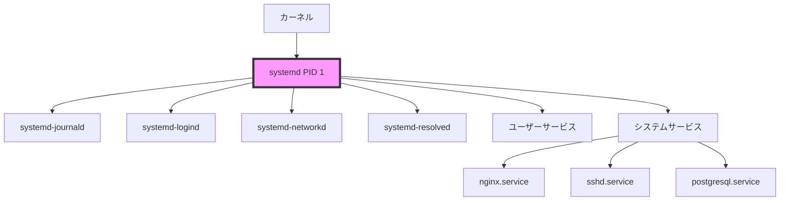
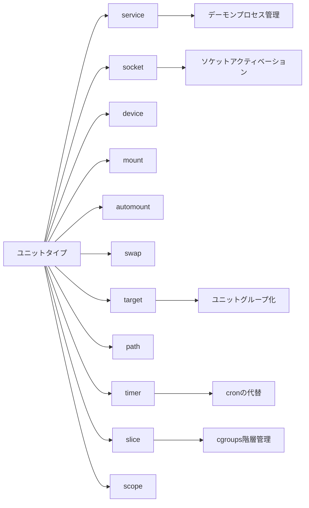
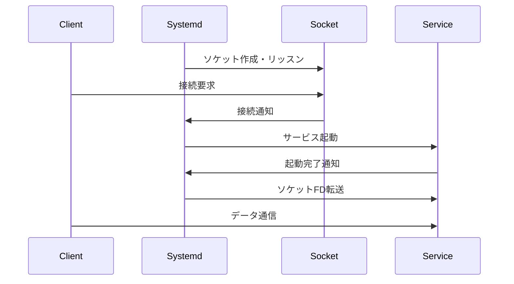
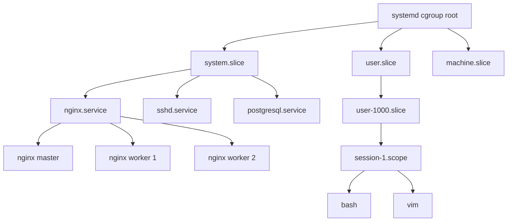
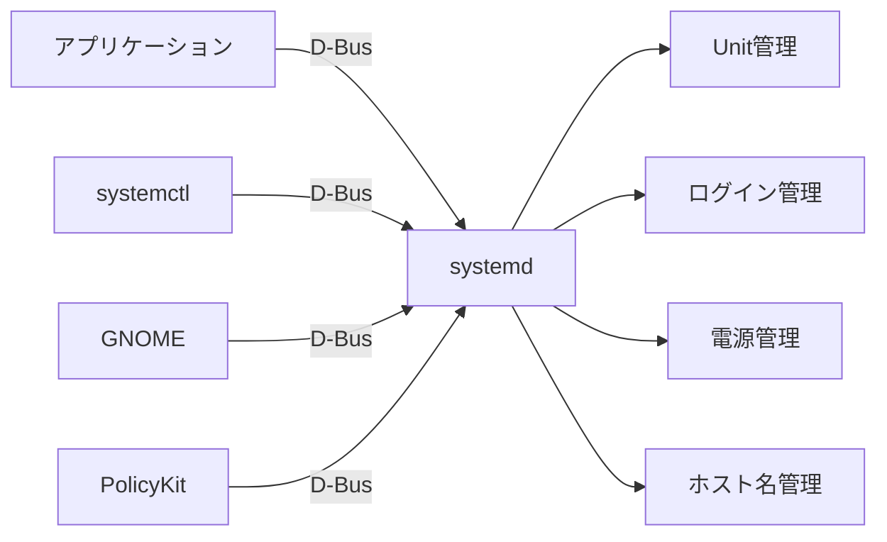

# Systemd

Systemdは、Linuxシステムにおけるinitシステムおよびシステム管理デーモンの統合的な実装である。Lennart Poetteringによって2010年に開発が開始され、現在では多くの主要なLinuxディストリビューションで標準的なinitシステムとして採用されている[^1]。従来のSysV initやUpstartと比較して、並列起動、明示的な依存関係管理、統一的なシステム管理インターフェースなどの特徴を持つ。

## 設計思想と背景

Systemdの設計は、従来のLinuxシステムが抱えていた初期化プロセスの問題を解決することを目的としている。SysV initは1980年代のSystem Vから継承されたシンプルなアーキテクチャであったが、現代のシステムにおいては多くの制限があった。特に、シェルスクリプトベースの逐次的な起動プロセスは、マルチコアプロセッサーや複雑な依存関係を持つサービスに対して効率的ではなかった。

Systemdは、これらの問題に対して以下の設計原則を採用している。第一に、並列性の最大化である。サービス間の依存関係を明示的に宣言することで、依存関係がないサービスを同時に起動できる。第二に、ソケットベースのアクティベーションにより、サービスの実際の起動を遅延させながら、依存するサービスには即座にソケットを提供できる。第三に、cgroupsを活用したプロセス管理により、サービスに関連するすべてのプロセスを確実に追跡・制御できる。



## アーキテクチャ

Systemdのアーキテクチャは、中央の管理デーモン（PID 1として動作）を中心に、複数の補助デーモンと連携する構造になっている。主要なコンポーネントには、systemd本体、systemd-journald（ログ管理）、systemd-logind（ログインセッション管理）、systemd-networkd（ネットワーク設定）、systemd-resolved（DNS解決）などがある。

これらのコンポーネントは、D-Busを介して相互に通信する。D-Busは、Linuxにおけるプロセス間通信（IPC）のための標準的なメッセージバスシステムであり、Systemdはこれを積極的に活用している[^2]。たとえば、systemctlコマンドはD-Bus経由でsystemdデーモンと通信し、サービスの状態を制御する。

Systemdの中核となる概念は「ユニット」である。ユニットは、Systemdが管理するリソースやプロセスを抽象化したもので、設定ファイルによって定義される。ユニットファイルは宣言的な形式で記述され、INIファイル形式を採用している。これにより、シェルスクリプトのような命令的なアプローチと比較して、設定の解析や検証が容易になる。

## ユニットとその種類

Systemdは複数の種類のユニットを定義しており、それぞれが異なるリソースやプロセスを管理する。主要なユニットタイプには以下がある：

サービスユニット（.service）は、最も一般的なユニットタイプで、デーモンプロセスや一度だけ実行されるプロセスを管理する。サービスユニットは、Type=ディレクティブによって異なる起動方式を指定できる。Type=simpleは最も基本的な形式で、起動したプロセスがメインプロセスとなる。Type=forkingは、従来のデーモンのようにフォークして親プロセスが終了する形式をサポートする。Type=notifyは、サービスがsystemdに対して明示的に準備完了を通知する形式で、最も正確な依存関係の管理が可能である。



ソケットユニット（.socket）は、ソケットベースのアクティベーションを実現する。ソケットユニットは対応するサービスユニットと連携し、ソケットへの接続があった時点でサービスを起動する。これにより、サービスの遅延起動が可能となり、システムの起動時間を短縮できる。また、サービスがクラッシュした場合でも、ソケットは維持されるため、接続が失われることがない。

ターゲットユニット（.target）は、複数のユニットをグループ化するための抽象的なユニットである。従来のランレベルに相当する概念だが、より柔軟で階層的な構造を持つ。たとえば、multi-user.targetは、マルチユーザーモードで必要なすべてのサービスを含むターゲットである。graphical.targetは、multi-user.targetを拡張してグラフィカル環境を追加する。

タイマーユニット（.timer）は、時間ベースのアクティベーションを提供する。cronの代替として使用でき、より柔軟な時間指定が可能である。OnBootSec=、OnUnitActiveSec=、OnCalendar=などのディレクティブにより、様々なタイミングでサービスを起動できる。また、Persistent=trueを指定することで、システムがダウンしていた期間のタイマーも遡って実行できる。

## 依存関係の管理

Systemdにおける依存関係の管理は、サービスの起動順序と起動条件を制御する重要な機能である。依存関係は大きく分けて、順序依存関係（ordering dependencies）と要求依存関係（requirement dependencies）の2種類がある。

順序依存関係は、Before=とAfter=ディレクティブで指定される。これらは純粋に起動順序のみを制御し、依存先のユニットの起動を強制しない。たとえば、After=network.targetは、ネットワークターゲットの後に起動することを指定するが、ネットワークターゲットの起動を要求するわけではない。

要求依存関係には、Requires=、Wants=、Requisite=、BindsTo=、PartOf=などがある。Requires=は強い依存関係で、依存先のユニットが失敗すると、依存元のユニットも停止する。Wants=は弱い依存関係で、依存先の失敗が依存元に影響しない。これらの使い分けにより、障害の伝播を適切に制御できる。

```ini
[Unit]
Description=PostgreSQL database server
After=network.target
Wants=network-online.target
After=network-online.target

[Service]
Type=notify
ExecStart=/usr/bin/postgres -D /var/lib/postgresql/data
ExecReload=/bin/kill -HUP $MAINPID
Restart=on-failure
RestartSec=5s

[Install]
WantedBy=multi-user.target
```

依存関係の解決において、Systemdは有向グラフを構築し、循環依存を検出する。循環依存が検出された場合、Systemdは依存関係の一部を無視してシステムの起動を継続する。また、依存関係の自動追加機能もあり、たとえばマウントポイントを参照するサービスは、自動的にそのマウントポイントへの依存関係が追加される。

## ソケットアクティベーション

ソケットアクティベーションは、Systemdの革新的な機能の一つである。この機能により、サービスは実際に必要になるまで起動を遅延できる。Systemdがソケットをリッスンし、接続があった時点で対応するサービスを起動する。この仕組みは、inetdやxinetdの概念を発展させたものだが、より効率的で柔軟な実装となっている[^3]。

ソケットアクティベーションの利点は複数ある。第一に、起動時間の短縮である。すべてのサービスを起動時に立ち上げる必要がなく、必要に応じて起動できる。第二に、並列起動の促進である。サービスAがサービスBのソケットに依存する場合、サービスBの完全な起動を待つ必要がなく、ソケットが利用可能になった時点でサービスAを起動できる。第三に、サービスの再起動時の接続維持である。サービスが再起動される間も、Systemdがソケットを保持するため、クライアントからの接続が失われない。



ソケットアクティベーションの実装には、ファイルディスクリプタの受け渡しが重要な役割を果たす。Systemdは、SD_LISTEN_FDS環境変数を通じて、サービスプロセスにリッスンソケットのファイルディスクリプタを渡す。サービスは、この環境変数を確認して、Systemdから渡されたソケットを使用する。

## cgroupsとの統合

Control Groups（cgroups）は、Linuxカーネルの機能で、プロセスグループのリソース使用を制限・監視・隔離する[^4]。Systemdは、cgroupsを全面的に活用し、各サービスを個別のcgroupに配置する。これにより、サービスに関連するすべてのプロセスを確実に追跡でき、従来のPIDファイルベースの管理よりも信頼性が高い。

Systemdのcgroups統合により、以下の機能が実現される。第一に、完全なプロセス追跡である。サービスがフォークして作成したすべての子プロセスは、同じcgroup内に配置される。これにより、killallのような不正確な方法を使わずに、サービスに関連するすべてのプロセスを確実に終了できる。第二に、リソース制限である。CPUQuota=、MemoryLimit=、IOWeight=などのディレクティブにより、サービスごとにリソース使用を制限できる。第三に、アカウンティングである。各サービスのCPU使用時間、メモリ使用量、I/O統計などを正確に測定できる。



cgroupsのバージョンについて、Systemdはcgroups v1とv2の両方をサポートしている。cgroups v2は、より一貫性のあるインターフェースと改善されたリソース管理を提供する。Systemdは、利用可能な場合はcgroups v2を優先的に使用し、統一階層（unified hierarchy）での管理を行う。

## ジャーナリング

systemd-journaldは、Systemdに統合されたログ管理システムである。従来のsyslogデーモンとは異なり、構造化されたバイナリ形式でログを保存する。この設計により、高速な検索、豊富なメタデータの保存、ログの改ざん防止などが可能となる[^5]。

ジャーナルの特徴的な機能として、構造化ログがある。各ログエントリは、メッセージ本文に加えて、プロセスID、ユーザーID、実行ファイルパス、ソースコードの位置など、多数のメタデータフィールドを持つ。これらのフィールドは、journalctlコマンドで柔軟にフィルタリングできる。たとえば、特定のサービスのログのみを表示したり、特定の優先度以上のログのみを表示したりできる。

```bash
# サービス単位でのログ表示
journalctl -u nginx.service

# 時間範囲指定
journalctl --since "2024-01-01" --until "2024-01-31"

# JSON形式での出力
journalctl -o json-pretty -n 1

# カーネルメッセージのみ
journalctl -k

# 特定のフィールドでフィルタリング
journalctl _SYSTEMD_UNIT=sshd.service _PID=1234
```

ジャーナルの保存形式は、追記専用の構造で、各エントリはハッシュチェーンでリンクされる。これにより、ログの改ざんを検出できる。また、Forward Secure Sealing（FSS）機能により、暗号学的にログの完全性を保証することも可能である。ジャーナルファイルは、/var/log/journal/に保存され、システムの再起動を跨いで永続化される。また、/run/log/journal/には揮発性のジャーナルが保存される。

ジャーナルは、従来のsyslogとの互換性も維持している。systemd-journaldは、受信したログメッセージをsyslogソケットに転送できるため、既存のsyslogベースのツールやワークフローを継続して使用できる。また、rsyslogやsyslog-ngなどの従来のsyslogデーモンと共存することも可能である。

## D-Bus統合

D-Bus（Desktop Bus）は、Linuxシステムにおけるプロセス間通信の標準的なメカニズムである。Systemdは、D-Busを全面的に採用し、システム管理のためのAPIを提供している。これにより、プログラムからSystemdの機能を利用したり、システムの状態を監視したりできる[^6]。

SystemdのD-Bus APIは、org.freedesktop.systemd1という名前空間で提供される。主要なインターフェースには、Managerインターフェース（システム全体の管理）、Unitインターフェース（個別ユニットの管理）、Jobインターフェース（ジョブの管理）などがある。これらのインターフェースを通じて、サービスの起動・停止、状態の取得、プロパティの変更などが可能である。



D-Bus統合の利点は、言語非依存のAPIを提供することである。C、Python、JavaScript、Rustなど、様々なプログラミング言語からD-Busライブラリを通じてSystemdと通信できる。また、D-Busのセキュリティ機能により、適切な権限管理が可能である。PolicyKitと連携することで、細かい権限制御も実現できる。

## システム状態の管理

Systemdは、システムの状態を複数の段階で管理する。起動時には、initrd（初期RAMディスク）段階から始まり、ルートファイルシステムのマウント、基本的なサービスの起動、ターゲットの達成という順序で進行する。各段階は、特定のターゲットユニットで表現される。

主要なシステムターゲットには以下がある。default.targetは、システムのデフォルト起動ターゲットで、通常はgraphical.targetまたはmulti-user.targetへのシンボリックリンクである。rescue.targetは、シングルユーザーモードに相当し、最小限のサービスのみが起動される。emergency.targetは、より限定的な緊急モードで、ルートファイルシステムが読み取り専用でマウントされる。

```mermaid
stateDiagram-v2
    [*] --> Kernel
    Kernel --> initrd.target
    initrd.target --> basic.target
    basic.target --> multi-user.target
    multi-user.target --> graphical.target
    
    basic.target --> rescue.target: 救急モード
    Kernel --> emergency.target: 緊急モード
    
    graphical.target --> reboot.target: 再起動
    graphical.target --> poweroff.target: シャットダウン
```

Systemdは、システムの状態遷移を管理する際に、トランザクションの概念を使用する。複数のユニットの起動や停止を要求された場合、Systemdはこれらをトランザクションとしてまとめ、依存関係を考慮して実行順序を決定する。トランザクションが矛盾する場合（たとえば、AがBを要求し、同時にBの停止も要求される場合）、Systemdはエラーを報告する。

## パフォーマンスとデバッグ

Systemdは、システムのパフォーマンス分析のための豊富なツールを提供する。systemd-analyzeコマンドは、起動時間の分析に特に有用である。systemd-analyze blameは、各サービスの起動時間を表示し、ボトルネックの特定に役立つ。systemd-analyze critical-chainは、起動時のクリティカルパスを表示する。

```bash
# 起動時間の概要
systemd-analyze

# サービスごとの起動時間
systemd-analyze blame

# クリティカルチェーンの表示
systemd-analyze critical-chain

# 起動プロセスのSVGグラフ生成
systemd-analyze plot > boot.svg

# ユニットの依存関係グラフ
systemd-analyze dot | dot -Tsvg > dependencies.svg
```

デバッグのために、Systemdは詳細なログレベルを提供する。systemd.log_level=debugカーネルパラメータを設定することで、起動時の詳細なデバッグ情報を取得できる。また、SYSTEMD_LOG_LEVEL環境変数により、実行時のログレベルを制御できる。各サービスユニットでは、StandardOutput=とStandardError=ディレクティブにより、出力先を柔軟に設定できる。

## セキュリティ機能

Systemdは、サービスの隔離とセキュリティ強化のための多数の機能を提供する。これらの機能は、最小権限の原則に基づいて、各サービスが必要最小限の権限で動作することを保証する。

名前空間の隔離機能により、サービスごとに独立したファイルシステムビュー、ネットワーク名前空間、PID名前空間などを提供できる。PrivateTmp=trueは、サービス専用の/tmpディレクトリを作成する。PrivateNetwork=trueは、独立したネットワーク名前空間を作成し、外部ネットワークへのアクセスを遮断する。ProtectSystem=strictは、ファイルシステム全体を読み取り専用にし、明示的に許可されたディレクトリのみ書き込み可能にする。

```ini
[Service]
# セキュリティ強化設定の例
PrivateTmp=yes
ProtectSystem=strict
ProtectHome=yes
ReadWritePaths=/var/lib/myapp
NoNewPrivileges=yes
PrivateDevices=yes
ProtectKernelTunables=yes
ProtectKernelModules=yes
ProtectControlGroups=yes
RestrictNamespaces=yes
LockPersonality=yes
MemoryDenyWriteExecute=yes
RestrictRealtime=yes
RestrictSUIDSGID=yes
SystemCallFilter=@system-service
SystemCallErrorNumber=EPERM
```

システムコールフィルタリング（seccomp）により、サービスが使用できるシステムコールを制限できる。SystemCallFilter=ディレクティブでホワイトリストまたはブラックリストを指定できる。Systemdは、一般的なユースケース用の事前定義されたセット（@system-service、@network-io など）も提供している。

## ネットワーク管理

systemd-networkdは、Systemdに統合されたネットワーク設定デーモンである。静的IP設定、DHCP、ブリッジ、VLAN、トンネリングなど、様々なネットワーク設定をサポートする。設定は、/etc/systemd/network/ディレクトリ内の.networkファイルで行う。

```ini
# /etc/systemd/network/10-static.network
[Match]
Name=enp0s3

[Network]
Address=192.168.1.100/24
Gateway=192.168.1.1
DNS=8.8.8.8
DNS=8.8.4.4

[Route]
Destination=10.0.0.0/8
Gateway=192.168.1.254
```

systemd-resolvedは、DNS解決を担当するデーモンで、DNS over TLS、DNSSEC検証、マルチキャストDNS（mDNS）などの現代的な機能をサポートする。/etc/resolv.confを通じて従来のアプリケーションとの互換性を維持しながら、D-Bus APIを通じてより高度な機能を提供する。

## トラブルシューティングと運用

Systemdを使用したシステムの運用において、トラブルシューティングは重要なスキルである。一般的な問題として、サービスの起動失敗、依存関係の問題、リソース制限による問題などがある。

サービスの起動失敗を調査する際は、まずsystemctl status <service>で基本的な状態を確認する。より詳細な情報が必要な場合は、journalctl -xe -u <service>でサービスのログを確認する。依存関係の問題は、systemctl list-dependencies <service>で依存関係ツリーを表示して調査する。

```bash
# サービスの詳細な状態確認
systemctl status nginx.service -l

# 失敗したサービスの一覧
systemctl --failed

# サービスの設定確認
systemctl cat nginx.service

# 環境変数の確認
systemctl show-environment

# リソース使用状況
systemd-cgtop
```

リソース制限に関する問題は、systemd-cgtopでリアルタイムのリソース使用状況を監視できる。また、各サービスのリソース制限は、systemctl show <service> -p MemoryLimit -p CPUQuotaなどで確認できる。

## 将来の展望と課題

Systemdは継続的に開発が進められており、新しい機能が定期的に追加されている。最近の開発では、systemd-homed（ポータブルホームディレクトリ）、systemd-oomd（メモリ不足時の処理）、systemd-boot（UEFIブートローダー）などの新しいコンポーネントが追加されている[^7]。

一方で、Systemdには批判も存在する。最も一般的な批判は、Unixの哲学である「一つのことをうまくやる」に反して、多機能すぎるという点である。また、バイナリログフォーマットや独自のAPIなど、既存のツールとの互換性の問題も指摘される。しかし、これらの批判に対して、Systemdの開発者は、現代のシステムの複雑性には統合的なアプローチが必要であると主張している。

Systemdの採用により、Linuxシステムの管理は大きく変化した。統一的なインターフェース、宣言的な設定、豊富な機能により、システム管理者の生産性は向上している。同時に、Systemdの複雑性を理解し、適切に活用するためには、継続的な学習が必要である。本文書で説明した概念と機能を理解することで、Systemdを効果的に活用し、堅牢で効率的なシステムを構築できるだろう。

[^1]: Poettering, Lennart. "systemd for Administrators, Part I." 0pointer.de, 2010. http://0pointer.de/blog/projects/systemd-for-admins-1.html

[^2]: Havoc Pennington, et al. "D-Bus Specification." freedesktop.org, 2023. https://dbus.freedesktop.org/doc/dbus-specification.html

[^3]: Poettering, Lennart. "Socket Activation." systemd documentation, 2023. https://www.freedesktop.org/software/systemd/man/systemd.socket.html

[^4]: Menage, Paul. "CGROUPS." Linux Kernel Documentation, 2023. https://www.kernel.org/doc/Documentation/cgroup-v2.txt

[^5]: Poettering, Lennart. "The Journal." systemd documentation, 2023. https://www.freedesktop.org/software/systemd/man/systemd-journald.service.html

[^6]: "systemd D-Bus API." freedesktop.org, 2023. https://www.freedesktop.org/wiki/Software/systemd/dbus/

[^7]: "systemd NEWS." GitHub, 2024. https://github.com/systemd/systemd/blob/main/NEWS