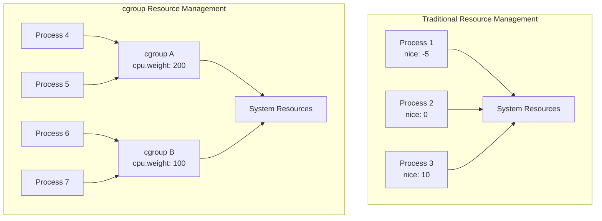
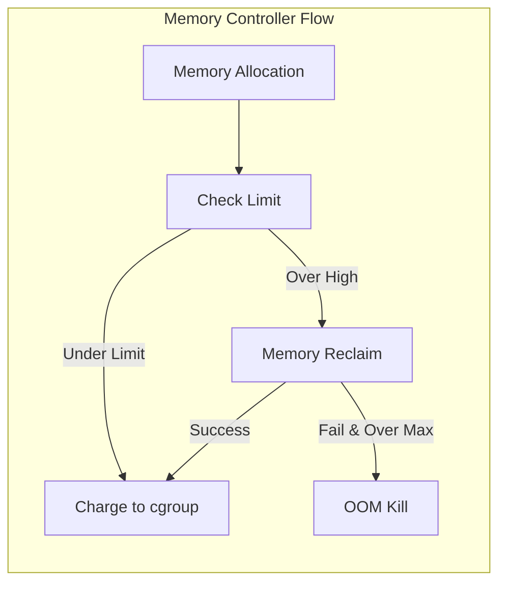
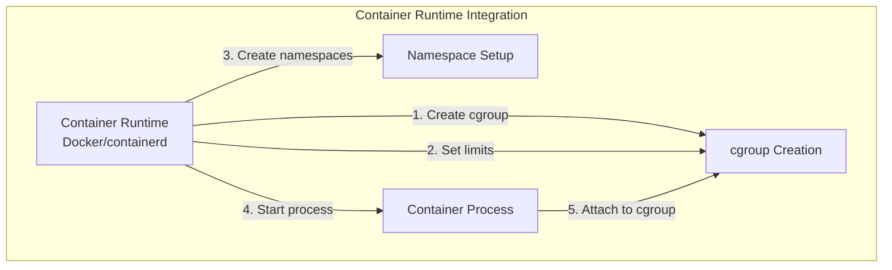

# cgroup

cgroup（Control Groups）は、Linuxカーネルが提供するプロセスグループのリソース使用量を制限、計測、および優先度付けするための機能です。2007年にPaul MenageとRohit Sethによって初期実装がメインラインカーネルに統合され[^1]、以来、コンテナ技術の基盤として、またシステムリソース管理の中核機能として進化を続けています。

cgroupの本質は、プロセスを階層的なグループに組織化し、各グループに対してリソース制限を適用する仕組みにあります。従来のUNIXシステムでは、プロセスのリソース管理は主にnice値やrlimitなどの個別プロセス単位の機構に依存していましたが、cgroupはこれをグループ単位で管理可能にし、より柔軟で強力なリソース制御を実現しています。



## 歴史的背景と設計動機

cgroupの開発は、Googleのエンジニアが直面していた大規模クラスタ環境でのリソース管理問題から始まりました。数千台のサーバーで数万のジョブを実行する環境では、個々のプロセスレベルでのリソース管理では不十分であり、ジョブやサービス単位でのリソース割り当てと隔離が必要でした。この要求に応えるため、当初は「process containers」という名称で開発が進められ、後に名前空間（namespace）機能との混同を避けるため「control groups」に改名されました[^2]。

初期の設計では、以下の要件が重視されました。第一に、既存のカーネルサブシステムとの統合性です。CPU、メモリ、I/Oなど、各リソースタイプごとに独立したサブシステムが存在し、それぞれが独自の制御ロジックを持つため、これらを統一的に扱える枠組みが必要でした。第二に、階層構造のサポートです。組織的なリソース管理では、部門、プロジェクト、タスクといった階層的な構造でリソースを配分する必要があります。第三に、動的な再構成能力です。実行中のシステムでプロセスの所属グループを変更したり、リソース制限を調整したりする機能が不可欠でした。

## cgroup v1の設計と実装

cgroup v1は、仮想ファイルシステムを通じてユーザー空間とのインターフェースを提供します。各cgroupサブシステム（cpuset、cpu、cpuacct、memory、blkio、devices等）は独立したマウントポイントを持ち、それぞれが独自の階層構造を形成できます。この設計により、柔軟性は高まりましたが、同時に複雑性も増大しました。

```mermaid
graph TD
    subgraph "cgroup v1 Multiple Hierarchies"
        subgraph "CPU Hierarchy"
            CPU_ROOT[/sys/fs/cgroup/cpu]
            CPU_A[group_a]
            CPU_B[group_b]
            CPU_A1[subgroup_a1]
            CPU_ROOT --> CPU_A
            CPU_ROOT --> CPU_B
            CPU_A --> CPU_A1
        end
        
        subgraph "Memory Hierarchy"
            MEM_ROOT[/sys/fs/cgroup/memory]
            MEM_X[group_x]
            MEM_Y[group_y]
            MEM_ROOT --> MEM_X
            MEM_ROOT --> MEM_Y
        end
        
        P1[Process 1]
        P2[Process 2]
        P1 -.-> CPU_A
        P1 -.-> MEM_X
        P2 -.-> CPU_B
        P2 -.-> MEM_Y
    end
```

v1の実装において、各サブシステムは`struct cgroup_subsys`構造体を通じてカーネルに登録されます。この構造体には、cgroupの作成・削除時のコールバック、プロセスのアタッチ・デタッチ時の処理、リソース制限の適用ロジックなどが含まれます。たとえば、CPUサブシステムは、CFS（Completely Fair Scheduler）と統合され、cpu.sharesファイルを通じてCPU時間の相対的な配分を制御します。

メモリサブシステムの実装は特に複雑で、ページ単位でのメモリ使用量追跡、LRU（Least Recently Used）リストの管理、メモリ再利用の制御などを行います。各cgroupは独自のメモリ統計情報を保持し、memory.limit_in_bytesによる上限設定、memory.soft_limit_in_bytesによるソフトリミット、memory.swappinessによるスワップ傾向の調整などが可能です。

しかし、v1の設計には根本的な問題がいくつか存在しました。まず、複数の独立した階層構造により、一貫性のあるリソース管理が困難でした。あるプロセスがCPU階層のgroup_aに属し、メモリ階層のgroup_xに属する場合、これらの関係性を管理するのはユーザー空間の責任となり、設定の複雑化を招きました。また、サブシステム間の相互作用が考慮されていないため、メモリ不足時のCPU使用率への影響など、現実的な問題に対処しづらい状況が生じました。

## cgroup v2の革新

cgroup v2は、v1の経験を踏まえて根本的な再設計が行われました[^3]。最も重要な変更は、単一階層構造（unified hierarchy）の採用です。v2では、すべてのコントローラーが同一の階層構造を共有し、プロセスは必ず一つのcgroupにのみ所属します。これにより、リソース管理の一貫性が大幅に向上しました。

```mermaid
graph TD
    subgraph "cgroup v2 Unified Hierarchy"
        ROOT[/sys/fs/cgroup]
        SYS[system.slice]
        USER[user.slice]
        INIT[init.scope]
        
        U1000[user-1000.slice]
        SESSION[session-3.scope]
        APP[app.slice]
        WEB[web.service]
        DB[db.service]
        
        ROOT --> SYS
        ROOT --> USER
        ROOT --> INIT
        USER --> U1000
        U1000 --> SESSION
        SYS --> APP
        APP --> WEB
        APP --> DB
        
        style ROOT fill:#f9f,stroke:#333,stroke-width:2px
        style SYS fill:#bbf,stroke:#333,stroke-width:2px
        style USER fill:#bbf,stroke:#333,stroke-width:2px
        style APP fill:#bfb,stroke:#333,stroke-width:2px
    end
```

v2のもう一つの重要な革新は、「no internal process」ルールの導入です。v1では、子cgroupを持つcgroupにもプロセスを配置できましたが、v2では葉ノード（子cgroupを持たないcgroup）にのみプロセスを配置できます。この制約により、リソース配分の論理が明確になり、予測可能な動作を保証できるようになりました。

コントローラーの有効化も大きく変更されました。v2では、cgroup.controllersファイルに利用可能なコントローラーが列挙され、cgroup.subtree_controlファイルを通じて子cgroupで有効にするコントローラーを選択します。この仕組みにより、必要なコントローラーのみを選択的に有効化でき、オーバーヘッドの削減と設定の簡素化が実現されました。

```bash
# Enable cpu and memory controllers for child cgroups
echo "+cpu +memory" > /sys/fs/cgroup/my_group/cgroup.subtree_control

# Check enabled controllers
cat /sys/fs/cgroup/my_group/cgroup.subtree_control
```

## 主要コントローラーの詳細実装

### CPUコントローラー

cgroup v2のCPUコントローラーは、完全に再設計されました。v1のcpu.sharesに代わり、cpu.weightが導入され、デフォルト値100を基準とした相対的な重み付けを行います。また、cpu.maxにより、絶対的なCPU使用量の上限を「使用可能時間 期間」の形式で指定できます。

```bash
# 50% CPU usage limit (50ms per 100ms period)
echo "50000 100000" > /sys/fs/cgroup/my_group/cpu.max

# Set relative weight to 200 (2x the default priority)
echo 200 > /sys/fs/cgroup/my_group/cpu.weight
```

内部実装では、各cgroupのCPU使用統計はper-CPU変数として管理され、スケジューラーのランキューと密接に統合されています。CFS（Completely Fair Scheduler）は、各cgroupの仮想実行時間を追跡し、cpu.weightに基づいて実行時間を配分します。

### メモリコントローラー

v2のメモリコントローラーは、ページキャッシュとanonymousメモリを統合的に管理します。memory.currentで現在の使用量、memory.highでソフトリミット、memory.maxでハードリミットを設定します。



メモリコントローラーの実装では、各ページに対してmemcg（memory cgroup）への参照が保持され、ページの割り当て・解放時に適切なcgroupに課金・返金が行われます。memory.highを超過した場合、割り当てプロセスは直接再利用（direct reclaim）を実行し、他のプロセスのページを解放してメモリを確保しようとします。

### I/Oコントローラー

io コントローラーは、ブロックデバイスへのI/O帯域幅とIOPSを制御します。io.maxファイルで上限を、io.latencyファイルで遅延目標を設定できます。

```bash
# Set I/O limits for device 8:0
# rbps: read bytes per second (10MB/s)
# wbps: write bytes per second (5MB/s)
# riops: read IOPS (1000)
# wiops: write IOPS (500)
echo "8:0 rbps=10485760 wbps=5242880 riops=1000 wiops=500" > /sys/fs/cgroup/my_group/io.max
```

I/Oコントローラーは、ブロック層のバイオ（bio）構造体にcgroup情報を付加し、デバイスドライバーに到達する前にトークンバケットアルゴリズムを用いて流量制御を行います。

## カーネル内部実装の詳細

cgroupの中核となるデータ構造は、`struct cgroup`と`struct css_set`です。`struct cgroup`は個々のcgroupを表現し、階層構造、有効なコントローラー、子cgroupのリストなどを保持します。一方、`struct css_set`は、プロセスが所属するcgroupのセットを表現し、各コントローラーに対するcgroup_subsys_state（CSS）への参照を保持します。

```c
struct cgroup {
    struct cgroup_subsys_state self;
    unsigned long flags;
    int level;
    int max_depth;
    int nr_descendants;
    int nr_dying_descendants;
    struct cgroup *parent;
    struct kernfs_node *kn;
    struct cgroup_root *root;
    struct list_head cset_links;
    struct list_head children;
    // ... other fields
};

struct css_set {
    struct cgroup_subsys_state *subsys[CGROUP_SUBSYS_COUNT];
    refcount_t refcount;
    struct list_head tasks;
    struct list_head mg_tasks;
    struct css_set *mg_src_cset;
    // ... other fields
};
```

プロセスがcgroupを移動する際、新しいcss_setが作成または検索され、プロセスのタスク構造体のcgroupsポインタが更新されます。この操作はRCU（Read-Copy-Update）を使用して実装され、読み取り側のロックフリーアクセスを可能にしています。

## コンテナ技術との統合

cgroupは、DockerやKubernetesなどのコンテナ技術の基盤として不可欠な役割を果たしています。コンテナランタイムは、各コンテナに対して専用のcgroupを作成し、リソース制限を適用します。

systemdベースのシステムでは、スライス（slice）、スコープ（scope）、サービス（service）という概念を用いてcgroupを管理します。たとえば、Dockerコンテナは通常、`/sys/fs/cgroup/system.slice/docker-<container-id>.scope`に配置されます。



Kubernetesでは、QoS（Quality of Service）クラスを用いてPodのリソース管理を行います。Guaranteed、Burstable、BestEffortの3つのクラスがあり、それぞれ異なるcgroup設定が適用されます。

```bash
# Kubernetes Guaranteed Pod cgroup settings
/sys/fs/cgroup/kubepods.slice/kubepods-guaranteed.slice/kubepods-guaranteed-pod<UID>.slice/
├── cpu.max          # Fixed CPU quota
├── memory.max       # Fixed memory limit
└── memory.min       # Memory guarantee
```

## パフォーマンスと最適化

cgroupの使用にはオーバーヘッドが伴います。特にメモリコントローラーは、ページ単位での追跡を行うため、メモリ集約的なワークロードでは無視できない性能影響があります。Linuxカーネル開発者は、このオーバーヘッドを最小化するため、継続的な最適化を行っています。

最近の改善には、per-cpuカウンターの使用拡大、RCUベースのcss_set管理、メモリ再利用アルゴリズムの効率化などが含まれます。また、cgroup v2では、必要なコントローラーのみを有効化できるため、不要なオーバーヘッドを回避できます。

実践的な最適化として、以下の点に注意が必要です。第一に、cgroupの階層は浅く保つべきです。深い階層は、各操作のコストを増大させます。第二に、頻繁なcgroup間の移動は避けるべきです。css_setの作成と破棄にはコストがかかります。第三に、メモリコントローラーを使用する場合は、ワークロードの特性に応じてmemory.highを適切に設定し、過度な再利用を避けることが重要です。

## 将来の展望と課題

cgroupの開発は現在も活発に続いており、新しい機能の追加と既存機能の改善が行われています。最近の開発では、PSI（Pressure Stall Information）との統合により、リソース不足の状況をより正確に把握できるようになりました[^4]。

```bash
# Check memory pressure for a cgroup
cat /sys/fs/cgroup/my_group/memory.pressure
# some avg10=0.00 avg60=0.12 avg300=0.05 total=12345
# full avg10=0.00 avg60=0.05 avg300=0.02 total=6789
```

また、eBPFとの統合により、より柔軟なリソース管理ポリシーの実装が可能になっています。BPF_PROG_TYPE_CGROUPタイプのeBPFプログラムを使用することで、cgroupレベルでのネットワークフィルタリングやデバイスアクセス制御をカスタマイズできます。

cgroupは、Linuxシステムにおけるリソース管理の中核技術として、その重要性を増し続けています。クラウドネイティブアプリケーションの普及に伴い、より精密で効率的なリソース管理が求められる中、cgroupの進化は今後も続くでしょう。開発者としては、cgroupの基本概念を理解するだけでなく、その実装詳細や最適化手法を把握することで、より効率的なシステムの構築が可能になります。

[^1]: Menage, P. (2007). "CGROUPS: Control Groups for Linux". Linux Kernel Documentation. https://www.kernel.org/doc/Documentation/cgroup-v1/cgroups.txt

[^2]: Menage, P., & Seth, R. (2006). "Resource Control and Isolation: Adding Generic Process Containers to the Linux Kernel". Proceedings of the Linux Symposium, Volume Two, pp. 45-58.

[^3]: Heo, T. (2015). "Control Group v2". Linux Kernel Documentation. https://www.kernel.org/doc/Documentation/cgroup-v2.txt

[^4]: Weiner, J. (2018). "PSI: Pressure Stall Information for CPU, memory, and IO". Linux Kernel Mailing List. https://lwn.net/Articles/759658/