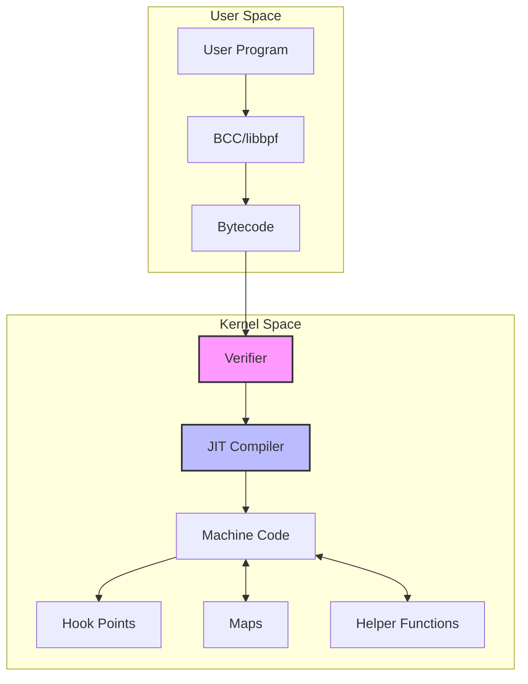
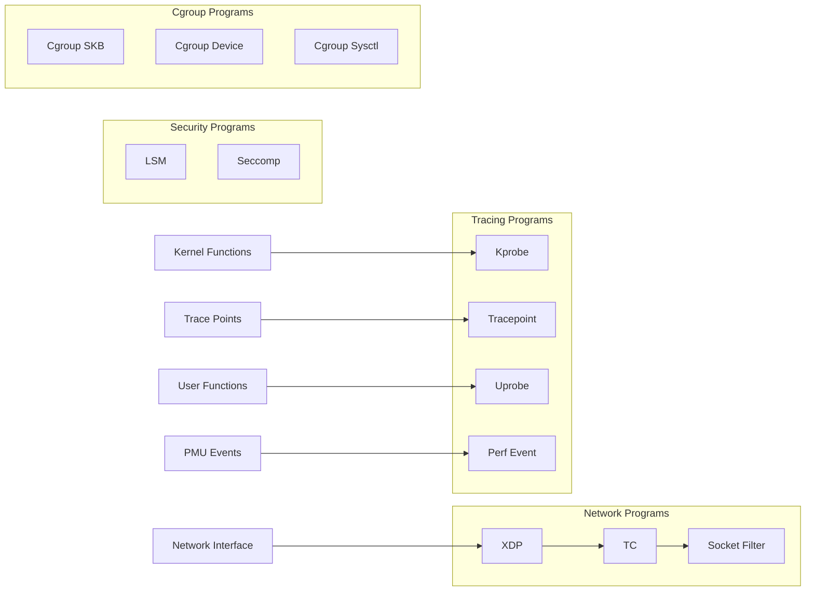
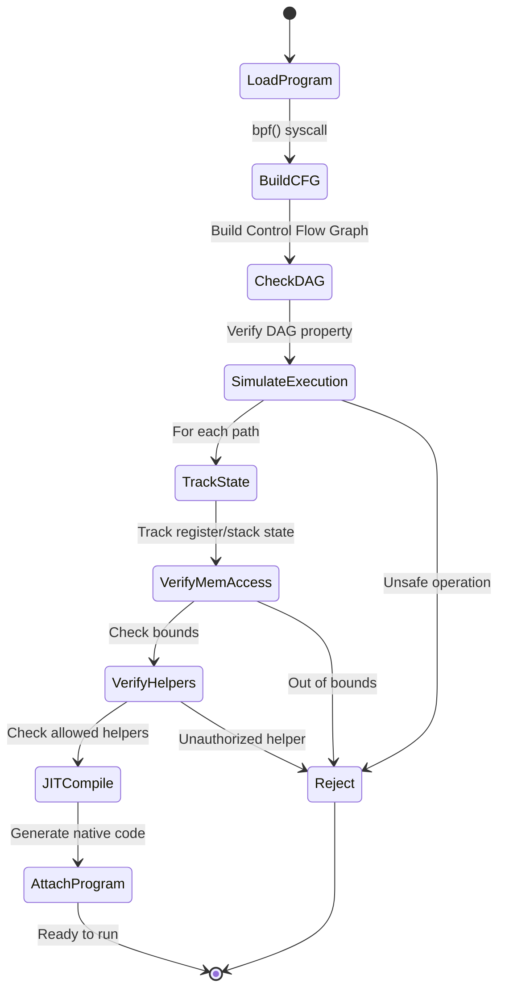
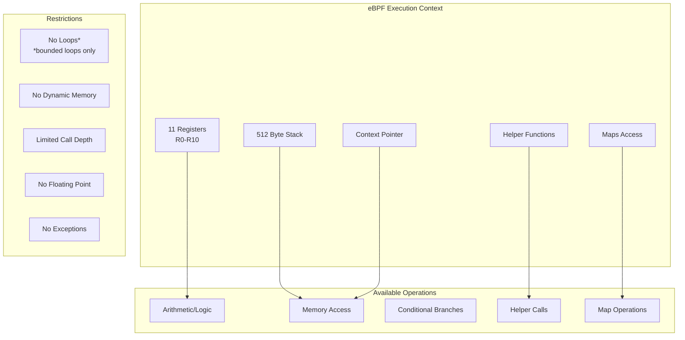
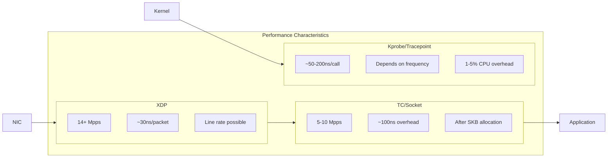

# eBPF (extended Berkeley Packet Filter)

eBPF（extended Berkeley Packet Filter）は、Linuxカーネル内で安全にプログラムを実行可能にする革新的な技術である。従来のBPFがパケットフィルタリングに特化していたのに対し、eBPFはカーネル全体にわたって様々な用途に適用できる汎用的な仮想マシンへと進化した。この技術により、カーネルモジュールを作成することなく、カーネルの挙動を動的に拡張・監視できるようになった。

eBPFの起源は1992年にBSD UNIXで開発されたBerkeley Packet Filter（BPF）にさかのぼる[^1]。当初のBPFは、tcpdumpのようなツールがパケットを効率的にフィルタリングするために設計された仮想マシンであった。2014年、Alexei StarovoitovによってLinuxカーネルに導入されたeBPFは、64ビットレジスタ、より多くのレジスタ数、新しい命令セットなど、大幅な拡張を施された[^2]。この拡張により、ネットワーキングだけでなく、トレーシング、セキュリティ、パフォーマンス監視など、幅広い用途での利用が可能になった。

## アーキテクチャと基本的な仕組み

eBPFのアーキテクチャは、カーネル内で安全にユーザー定義のプログラムを実行するという要求から生まれた独特な設計となっている。その中核をなすのは、64ビットのRISC命令セットを持つ仮想マシンである。この仮想マシンは11個の64ビットレジスタ（R0-R10）と512バイトのスタックを持ち、条件分岐、算術演算、メモリアクセスなどの基本的な操作をサポートする。



ユーザー空間で作成されたeBPFプログラムは、まずeBPFバイトコードにコンパイルされる。このバイトコードはbpf()システムコールを通じてカーネルにロードされる際、カーネル内のVerifierによって厳格な検証を受ける。Verifierは、プログラムが無限ループに陥らないこと、境界外のメモリアクセスを行わないこと、許可されていないカーネル関数を呼び出さないことなどを静的解析によって保証する[^3]。

検証を通過したプログラムは、JIT（Just-In-Time）コンパイラによってネイティブの機械語に変換される。現在のLinuxでは、x86_64、ARM64、s390x、PowerPC、SPARC、MIPS、RISCVなど、主要なアーキテクチャでJITコンパイルがサポートされている。JITコンパイルにより、eBPFプログラムはネイティブコードに近い性能で実行される。

## プログラムタイプとアタッチポイント

eBPFプログラムは、その用途に応じて様々なタイプに分類される。各プログラムタイプは特定のカーネルサブシステムと統合され、異なるコンテキストとヘルパー関数へのアクセスを持つ。主要なプログラムタイプには以下のようなものがある。

**BPF_PROG_TYPE_SOCKET_FILTER**は、最も古典的なタイプで、ソケットに到着したパケットをフィルタリングする。tcpdumpやWiresharkなどのツールで使用される。このタイプのプログラムは、sk_buff構造体へのアクセスを持ち、パケットのヘッダーやペイロードを検査できる。

**BPF_PROG_TYPE_KPROBE**と**BPF_PROG_TYPE_KRETPROBE**は、カーネル関数の入口と出口にアタッチされる動的トレーシング用のプログラムタイプである。これらを使用することで、カーネル内のほぼすべての関数の引数、戻り値、実行時の状態を観測できる。システムコールの監視、パフォーマンス分析、デバッグなどに広く利用される。

**BPF_PROG_TYPE_TRACEPOINT**は、カーネル内に静的に定義されたトレースポイントにアタッチされる。kprobeと比較して、トレースポイントはカーネルバージョン間でより安定したインターフェースを提供する。スケジューラ、メモリ管理、ネットワークスタックなど、カーネルの主要なサブシステムには多数のトレースポイントが定義されている。



**BPF_PROG_TYPE_XDP**（eXpress Data Path）は、ネットワークインターフェースカード（NIC）に最も近い位置でパケット処理を行う。XDPプログラムは、パケットがskb（socket buffer）に変換される前の早い段階で実行されるため、極めて高速なパケット処理が可能である。DDoS攻撃の緩和、ロードバランシング、パケットの転送やリダイレクトなどに使用される[^4]。

## 検証機構とセキュリティ

eBPFの最も重要な特徴の一つは、カーネル内で任意のコードを安全に実行できることである。この安全性は、Verifierと呼ばれる静的解析エンジンによって保証される。Verifierは、eBPFプログラムがロードされる際に、そのバイトコードを詳細に検査し、システムに害を与える可能性のあるコードを拒否する。

Verifierの検証プロセスは、制御フローグラフ（CFG）の構築から始まる。プログラムのすべての実行パスを列挙し、各パスが安全であることを確認する。この過程で、以下のような検査が行われる：

1. **有界性の検証**：プログラムが有限時間内に終了することを保証する。ループは最大でも定数回しか実行できないように制限される。現在のカーネルでは、プログラムの複雑さに応じて100万命令までの実行が許可されている。

2. **メモリアクセスの検証**：すべてのメモリアクセスが有効な範囲内であることを確認する。ポインタの算術演算は追跡され、境界チェックが強制される。

3. **型安全性の検証**：レジスタとスタックスロットの型情報を追跡し、型の不一致や未初期化の値の使用を防ぐ。

4. **権限の検証**：プログラムが呼び出すヘルパー関数が、そのプログラムタイプで許可されているものであることを確認する。

Verifierは、抽象解釈の技術を使用してこれらの検証を行う。各命令の実行時に、レジスタとスタックの状態を追跡し、可能なすべての値の範囲を計算する。この情報は、メモリアクセスの安全性を証明するために使用される[^5]。



セキュリティの観点から、eBPFプログラムは非特権ユーザーでも使用できるように設計されているが、その場合は追加の制限が課される。例えば、非特権ユーザーは特定のプログラムタイプのみ使用でき、一部のヘルパー関数へのアクセスが制限される。また、JITコンパイルされたコードは、Spectre型の攻撃を防ぐための緩和策が適用される。

## マップとデータ構造

eBPFマップは、eBPFプログラムとユーザー空間プログラム、または異なるeBPFプログラム間でデータを共有するための永続的なデータ構造である。マップは、キー・バリュー形式でデータを格納し、並行アクセスに対して安全に設計されている。

主要なマップタイプには以下のようなものがある：

**BPF_MAP_TYPE_HASH**と**BPF_MAP_TYPE_LRU_HASH**は、ハッシュテーブルの実装である。前者は通常のハッシュテーブル、後者はLRU（Least Recently Used）エビクションポリシーを持つ。これらは、フロー追跡、接続状態の管理、統計情報の収集などに使用される。

**BPF_MAP_TYPE_ARRAY**と**BPF_MAP_TYPE_PERCPU_ARRAY**は、固定サイズの配列である。PERCPU版は、各CPUごとに独立した配列を持ち、ロックフリーなアクセスを可能にする。カウンタや統計情報の高速な更新に適している。

**BPF_MAP_TYPE_PERF_EVENT_ARRAY**と**BPF_MAP_TYPE_RINGBUF**は、eBPFプログラムからユーザー空間へのイベント通知に使用される。PERF_EVENT_ARRAYは各CPUごとのリングバッファを持ち、RINGBUFは単一の共有リングバッファを提供する。後者は、イベントの順序保証とメモリ効率の観点で優れている[^6]。

```c
// Example of map operations in eBPF program
struct {
    __uint(type, BPF_MAP_TYPE_HASH);
    __uint(max_entries, 10000);
    __type(key, struct flow_key);
    __type(value, struct flow_stats);
} flow_table SEC(".maps");

SEC("xdp")
int track_flows(struct xdp_md *ctx) {
    struct flow_key key = {};
    struct flow_stats *stats;
    
    // Extract flow key from packet
    if (parse_flow_key(ctx, &key) < 0)
        return XDP_PASS;
    
    // Lookup or create entry
    stats = bpf_map_lookup_elem(&flow_table, &key);
    if (!stats) {
        struct flow_stats new_stats = {0};
        bpf_map_update_elem(&flow_table, &key, &new_stats, BPF_ANY);
        stats = bpf_map_lookup_elem(&flow_table, &key);
    }
    
    if (stats) {
        __sync_fetch_and_add(&stats->packets, 1);
        __sync_fetch_and_add(&stats->bytes, ctx->data_end - ctx->data);
    }
    
    return XDP_PASS;
}
```

マップへのアクセスは、bpf_map_lookup_elem()、bpf_map_update_elem()、bpf_map_delete_elem()などのヘルパー関数を通じて行われる。これらの操作は、RCU（Read-Copy-Update）やスピンロックを使用して並行性を管理する。パフォーマンスクリティカルな用途では、PERCPU版のマップを使用することで、CPUキャッシュの局所性を活用し、ロックの競合を回避できる。

## 実行環境と制限事項

eBPFプログラムは、通常のカーネルコードとは異なる制限された環境で実行される。これらの制限は、システムの安定性とセキュリティを保証するために必要である。

プログラムサイズは、現在のところ100万BPF命令に制限されている。これは、Verifierの検証時間を合理的な範囲に保ち、DoS攻撃を防ぐためである。スタックサイズは512バイトに制限され、動的メモリ割り当ては許可されていない。

eBPFプログラムは、限定されたヘルパー関数のセットのみを呼び出すことができる。これらのヘルパー関数は、パケットの操作、マップへのアクセス、時刻の取得、乱数の生成など、特定の機能を安全に実行するためのインターフェースを提供する。各プログラムタイプは、使用可能なヘルパー関数のサブセットが定義されている。



ループに関しては、初期のeBPFでは完全に禁止されていたが、Linux 5.3以降では有界ループ（bounded loops）がサポートされるようになった。Verifierがループの反復回数の上限を静的に決定できる場合に限り、ループの使用が許可される。

関数呼び出しの深さは8レベルに制限されている。eBPFプログラムは、他のeBPF関数を呼び出すことができるが、再帰は許可されていない。また、一般的なカーネル関数を直接呼び出すことはできず、事前に定義されたヘルパー関数のみが使用可能である。

## ヘルパー関数とカーネルAPI

ヘルパー関数は、eBPFプログラムがカーネルの機能にアクセスするための主要なインターフェースである。これらの関数は、安全性が検証された特定の操作を実行し、eBPFプログラムの機能を大幅に拡張する。2024年現在、200を超えるヘルパー関数が定義されている。

主要なヘルパー関数のカテゴリには以下のようなものがある：

**パケット操作関数**：bpf_skb_store_bytes()、bpf_skb_load_bytes()、bpf_l3_csum_replace()、bpf_l4_csum_replace()など。これらは、パケットの内容を読み書きし、チェックサムを更新する。

**マップ操作関数**：bpf_map_lookup_elem()、bpf_map_update_elem()、bpf_map_delete_elem()、bpf_map_push_elem()など。マップへのデータの読み書きを行う。

**時間・乱数関数**：bpf_ktime_get_ns()、bpf_get_prandom_u32()など。現在時刻の取得や疑似乱数の生成を行う。

**プロセス・システム情報関数**：bpf_get_current_pid_tgid()、bpf_get_current_uid_gid()、bpf_get_current_comm()など。実行中のプロセスに関する情報を取得する。

トレーシング用のヘルパー関数は特に充実しており、bpf_probe_read()、bpf_probe_read_kernel()、bpf_probe_read_user()などを使用して、カーネルやユーザー空間のメモリを安全に読み取ることができる。これらの関数は、無効なメモリアクセスが発生した場合でもカーネルパニックを引き起こさないように設計されている。

```c
// Example of using helper functions for tracing
SEC("kprobe/tcp_sendmsg")
int trace_tcp_sendmsg(struct pt_regs *ctx) {
    struct sock *sk;
    u32 pid = bpf_get_current_pid_tgid() >> 32;
    u64 ts = bpf_ktime_get_ns();
    
    // Read socket pointer from function argument
    bpf_probe_read(&sk, sizeof(sk), (void *)PT_REGS_PARM1(ctx));
    
    // Read socket state
    u32 state;
    bpf_probe_read(&state, sizeof(state), &sk->__sk_common.skc_state);
    
    // Log event
    struct event {
        u32 pid;
        u64 timestamp;
        u32 state;
    } e = {
        .pid = pid,
        .timestamp = ts,
        .state = state
    };
    
    bpf_perf_event_output(ctx, &events, BPF_F_CURRENT_CPU, &e, sizeof(e));
    return 0;
}
```

## パフォーマンスとオーバーヘッド

eBPFプログラムのパフォーマンスは、その使用場所と実装方法に大きく依存する。JITコンパイルにより、eBPFプログラムはネイティブコードとほぼ同等の速度で実行される。しかし、プログラムがアタッチされる場所によって、システム全体への影響は異なる。

XDPプログラムは、最も高いパフォーマンスを実現する。NICドライバレベルで実行されるため、1秒あたり数千万パケットの処理が可能である。実測値では、単純なフィルタリングやリダイレクト処理で、14Mpps（million packets per second）以上の性能を達成できる[^7]。

kprobeやtracepointプログラムのオーバーヘッドは、アタッチされる関数の呼び出し頻度に依存する。頻繁に呼び出される関数（例：スケジューラ関数）にアタッチした場合、数パーセントのCPUオーバーヘッドが発生する可能性がある。一方、稀にしか呼び出されない関数では、オーバーヘッドはほぼ無視できる。



マップ操作のパフォーマンスも重要な考慮事項である。ハッシュマップのルックアップは平均的にO(1)の時間複雑度を持つが、実際のレイテンシは数十ナノ秒程度である。PERCPU版のマップを使用することで、複数のCPUからの同時アクセス時のスケーラビリティを向上させることができる。

メモリ使用量の観点では、eBPFプログラム自体は比較的小さい（通常数KB以下）が、マップは大量のメモリを消費する可能性がある。特に、PERCPU版のマップは、CPU数に比例してメモリを消費する。システム管理者は、rlimitやcgroupを使用してeBPFプログラムのリソース使用を制限できる。

BTF（BPF Type Format）の導入により、eBPFプログラムのデバッグとプロファイリングが大幅に改善された。BTFは、eBPFプログラムとマップのデータ構造に関する型情報を保持し、実行時の内省を可能にする。これにより、bpftoolなどのツールを使用して、実行中のeBPFプログラムの状態を詳細に調査できる[^8]。

パフォーマンスの最適化においては、以下の原則が重要である：

1. **ホットパスでの処理を最小限に**：頻繁に実行されるコードパスでは、必要最小限の処理のみを行う。
2. **マップアクセスの最適化**：ルックアップ回数を減らし、可能な限りPERCPU版を使用する。
3. **早期リターン**：条件に合致しないパケットやイベントは早期に処理を終了する。
4. **バッチ処理**：可能な場合は、複数の操作をまとめて実行する。

eBPFは、カーネルの拡張性とプログラマビリティに革命をもたらした技術である。その安全性、性能、柔軟性の組み合わせにより、ネットワーキング、セキュリティ、可観測性など、様々な分野で広く採用されている。Verifierによる厳格な検証、JITコンパイルによる高速実行、豊富なヘルパー関数とマップタイプにより、システム管理者と開発者は、カーネルモジュールを作成することなく、高度なシステムレベルのプログラミングを行うことができる。

技術的には、eBPFは制限された実行環境という制約の中で、実用的な機能を提供するという困難な課題を解決している。この制約と機能のバランスは、継続的に改善されており、新しいプログラムタイプ、ヘルパー関数、マップタイプが定期的に追加されている。同時に、ツールチェーンの成熟により、eBPFプログラムの開発、デプロイ、デバッグがより容易になっている。

[^1]: McCanne, S., & Jacobson, V. (1993). The BSD packet filter: A new architecture for user-level packet capture. In Proceedings of the USENIX Winter 1993 Conference.

[^2]: Starovoitov, A. (2014). [PATCH RFC v7 net-next 00/28] BPF syscall, maps, verifier, samples, llvm. Linux Kernel Mailing List.

[^3]: Linux Kernel Documentation. (2024). BPF Design Q&A. https://www.kernel.org/doc/html/latest/bpf/bpf_design_QA.html

[^4]: Høiland-Jørgensen, T., et al. (2018). The eXpress data path: Fast programmable packet processing in the operating system kernel. In Proceedings of CoNEXT '18.

[^5]: Gershuni, E., et al. (2019). Simple and precise static analysis of untrusted Linux kernel extensions. In Proceedings of PLDI 2019.

[^6]: Linux Kernel Documentation. (2024). BPF ring buffer. https://www.kernel.org/doc/html/latest/bpf/ringbuf.html

[^7]: Vieira, M. A., et al. (2020). Fast packet processing with eBPF and XDP: Concepts, code, challenges, and applications. ACM Computing Surveys, 53(1).

[^8]: Nakryiko, A. (2020). BPF CO-RE (Compile Once – Run Everywhere). In Linux Plumbers Conference 2020.