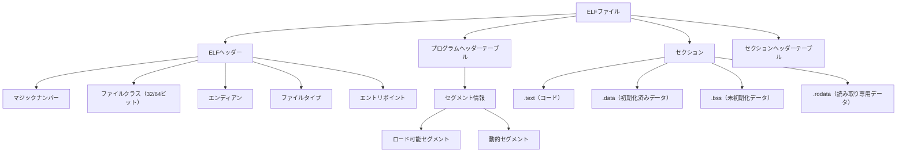
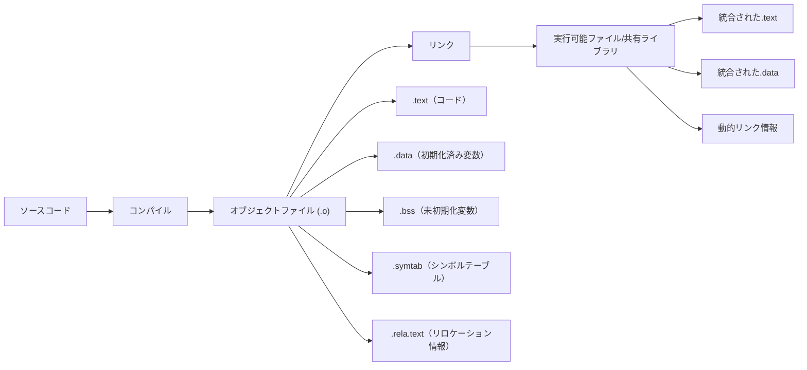
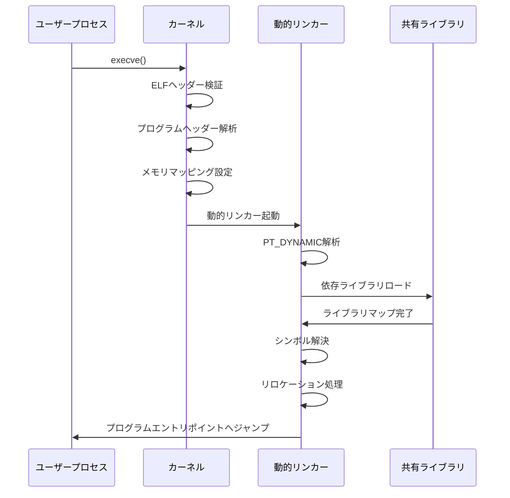
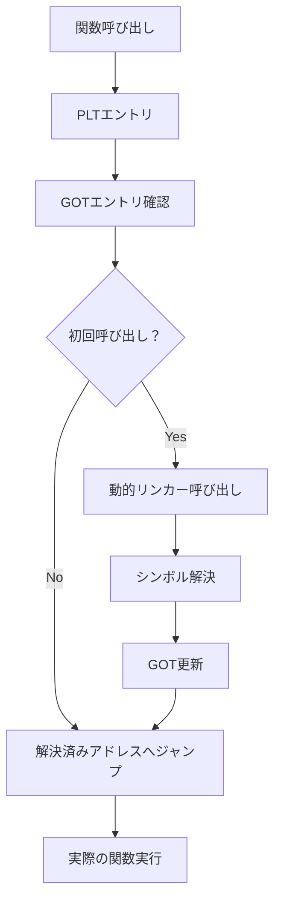
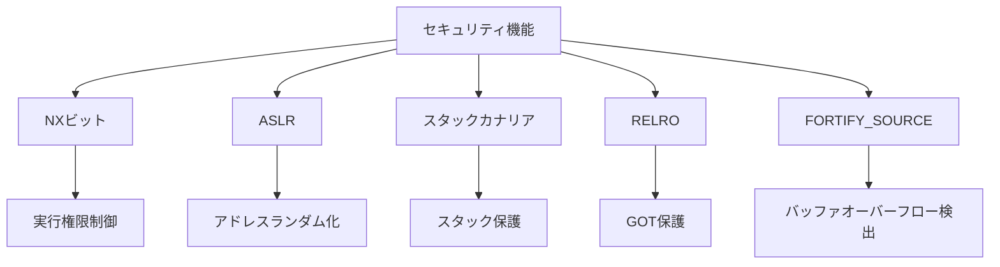
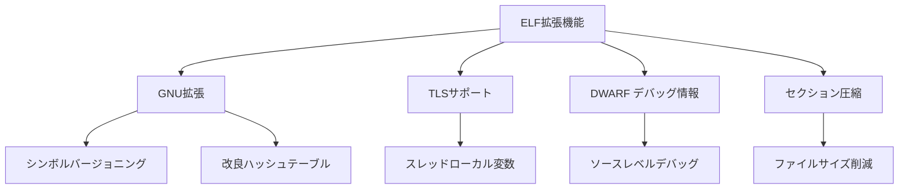

# ELF (Executable and Linkable Format)

ELF（Executable and Linkable Format）は、現代のUNIX系オペレーティングシステムにおいて実行可能ファイル、オブジェクトファイル、共有ライブラリ、コアダンプファイルの標準的なファイルフォーマットとして採用されている。1990年代前半にUNIX System V Release 4で初めて導入されたこのフォーマットは、その柔軟性と拡張性により、Linux、FreeBSD、NetBSD、OpenBSD、Solarisなど、多くのオペレーティングシステムで採用されるに至った。

ELFの設計は、従来のa.out形式やCOFF（Common Object File Format）の制限を克服することを目的としていた。特に、動的リンクのサポート、複数のアーキテクチャへの対応、デバッグ情報の効率的な格納、そして将来の拡張に対する柔軟性が重要な設計目標として掲げられていた。これらの目標は、System V Application Binary Interface (ABI)¹の一部として標準化され、今日に至るまでプログラムの実行とリンクの基盤となっている。

ELFフォーマットの最も重要な特徴は、その二重の視点である。ELFファイルは、リンカーの観点からはセクションの集合体として、ローダーの観点からはセグメントの集合体として解釈される。この二重性により、コンパイル・リンク時の最適化と実行時の効率的なメモリマッピングの両方が可能となっている。

## ELFファイルの基本構造

ELFファイルは、その用途に応じて複数の種類に分類される。ET_REL（リロケータブルファイル）は、コンパイラが生成するオブジェクトファイルであり、他のオブジェクトファイルとリンクされて実行可能ファイルや共有ライブラリを形成する。ET_EXEC（実行可能ファイル）は、固定されたメモリアドレスにロードされる従来型の実行ファイルである。ET_DYN（共有オブジェクトファイル）は、動的リンクされる共有ライブラリや、位置独立実行可能ファイル（PIE: Position Independent Executable）として使用される。ET_CORE（コアファイル）は、プロセスがクラッシュした際のメモリダンプを含むファイルである。

ELFヘッダーは、ファイルの先頭に位置し、ファイル全体の構造を定義する重要な情報を含んでいる。最初の4バイトは、マジックナンバー（0x7F, 'E', 'L', 'F'）として知られ、このファイルがELFフォーマットであることを示す識別子として機能する。続くフィールドでは、ファイルクラス（32ビットまたは64ビット）、データエンコーディング（リトルエンディアンまたはビッグエンディアン）、ELFバージョン、ターゲットABI、そしてファイルタイプが指定される。

ELFヘッダーの中でも特に重要なのは、e_entryフィールドである。これは、プログラムの実行が開始される仮想アドレスを示している。実行可能ファイルの場合、このアドレスは通常、_startシンボルが配置されるアドレスに対応する。また、e_phoffとe_shoffフィールドは、それぞれプログラムヘッダーテーブルとセクションヘッダーテーブルのファイル内オフセットを示し、これらのテーブルへのアクセスを可能にする。

プログラムヘッダーテーブルは、実行時の観点からファイルの構造を記述する。各プログラムヘッダーエントリは、セグメントと呼ばれるファイルの一部分を定義し、そのセグメントがメモリにどのようにマップされるべきかを指定する。最も一般的なセグメントタイプはPT_LOADであり、これはファイルの一部をメモリにロードすることを指示する。典型的な実行可能ファイルには、少なくとも2つのPT_LOADセグメントが存在する：テキストセグメント（読み取り・実行可能）とデータセグメント（読み書き可能）である。

## セクションとその役割

ELFファイルのセクションは、リンク時の観点から見たファイルの論理的な分割単位である。各セクションは特定の種類の情報を含み、リンカーはこれらのセクションを操作して最終的な実行可能ファイルや共有ライブラリを生成する。標準的なセクションには、プログラムコードを含む.text、初期化済みグローバル変数を含む.data、初期化されていないグローバル変数のための.bss（Block Started by Symbol）、文字列リテラルなどの読み取り専用データを含む.rodataなどがある。

.textセクションは、プログラムの機械語命令を含む最も重要なセクションの一つである。このセクションは通常、読み取りと実行の権限を持つが、書き込み権限は持たない。これにより、実行中のプログラムコードが偶発的または悪意を持って改変されることを防いでいる。コンパイラは、ソースコードから生成された機械語命令をこのセクションに配置し、関数間の呼び出しは相対アドレッシングまたは絶対アドレッシングを使用して実現される。

.dataセクションと.bssセクションは、プログラムのグローバル変数とスタティック変数を格納する。.dataセクションには初期値を持つ変数が配置され、その初期値はELFファイル内に直接格納される。一方、.bssセクションは初期値を持たない（またはゼロで初期化される）変数のために予約され、ファイル内には実際のデータは含まれず、必要なサイズ情報のみが記録される。プログラムのロード時に、カーネルは.bssセクションに対応するメモリ領域をゼロで初期化する。

シンボルテーブルは、プログラム内の関数や変数の名前とアドレスの対応関係を記録する重要なセクションである。.symtabセクションは完全なシンボル情報を含み、主にデバッグやリンク時に使用される。一方、.dynsymセクションは動的リンクに必要な最小限のシンボル情報のみを含み、実行時のシンボル解決に使用される。各シンボルエントリには、シンボル名へのインデックス、値（通常はアドレス）、サイズ、タイプ、バインディング属性、可視性、そして関連するセクションインデックスが含まれる。

## プログラムのロードと実行プロセス

プログラムの実行は、execve()システムコールから始まる複雑なプロセスである。カーネルは、指定されたELFファイルを開き、ELFヘッダーを読み込んでファイルの妥当性を検証する。マジックナンバーの確認、アーキテクチャの互換性チェック、ファイルタイプの確認などが行われる。検証が成功すると、カーネルはプログラムヘッダーテーブルを解析し、PT_LOADセグメントを特定する。

各PT_LOADセグメントに対して、カーネルは指定された仮想アドレスにメモリ領域を割り当て、ファイルの対応する部分をそのメモリにマップする。このプロセスでは、mmap()システムコールが内部的に使用され、効率的なメモリマッピングが実現される。重要な点は、実際のファイルデータのコピーは遅延評価され、ページフォルトが発生した時点で初めて物理メモリにロードされることである。これにより、大規模なプログラムでも起動時間が短縮される。

プログラムが動的リンクを使用している場合、カーネルはPT_INTERPセグメントを確認し、動的リンカー（通常は/lib64/ld-linux-x86-64.so.2など）のパスを取得する。このインタープリタは、プログラムの実行前に必要な共有ライブラリをロードし、シンボルの解決を行う特別なプログラムである。カーネルは、実際のプログラムの代わりに、まず動的リンカーをメモリにロードし、制御を渡す。

動的リンカーは、PT_DYNAMICセグメントを解析して、プログラムが依存する共有ライブラリのリストを取得する。各共有ライブラリは、DT_NEEDEDエントリとして記録されており、動的リンカーはこれらのライブラリを順次ロードする。ライブラリの検索は、環境変数LD_LIBRARY_PATH、/etc/ld.so.conf、そしてデフォルトのシステムライブラリパス（/lib、/usr/libなど）の順で行われる。

## 動的リンクとシンボル解決

動的リンクは、現代のシステムにおいて重要な役割を果たしている。共有ライブラリの使用により、ディスク容量の節約、メモリ使用量の削減、セキュリティアップデートの容易化などの利点が得られる。しかし、これらの利点を実現するためには、複雑なシンボル解決メカニズムが必要となる。

シンボル解決は、プログラムや共有ライブラリ内の未定義シンボルを、他の共有ライブラリやプログラム本体で定義されているシンボルと結びつけるプロセスである。動的リンカーは、グローバルシンボルテーブルを構築し、各シンボルの定義を追跡する。シンボルの検索は、依存関係の順序に従って行われ、最初に見つかった定義が使用される。この検索順序は、シンボルの衝突や意図しない動作を引き起こす可能性があるため、慎重な設計が必要である。

PLT（Procedure Linkage Table）とGOT（Global Offset Table）は、動的リンクにおける遅延結合（lazy binding）を実現する重要なメカニズムである。PLTは、外部関数呼び出しのためのトランポリンコードを含む特別なセクションである。プログラムが外部関数を呼び出す際、まずPLTエントリにジャンプし、そこからGOTを介して実際の関数アドレスに到達する。初回の呼び出し時には、GOTエントリは動的リンカーの解決関数を指しており、この関数が実際のシンボルアドレスを解決してGOTを更新する。

GOTは、動的にリンクされたシンボルのアドレスを格納するテーブルである。プログラムのロード時、GOTエントリは初期値として動的リンカーのスタブ関数のアドレスを持つ。遅延結合が有効な場合、シンボルの解決は実際に使用されるまで延期される。これにより、プログラムの起動時間が短縮され、使用されない関数のシンボル解決オーバーヘッドが回避される。

RELRO（RELocation Read-Only）は、GOTを含むデータセクションのセキュリティを向上させる技術である。部分的RELRO（Partial RELRO）では、.got.pltセクション以外のGOT領域が読み取り専用になる。完全RELRO（Full RELRO）では、すべてのシンボル解決がプログラム起動時に行われ、その後GOT全体が読み取り専用となる。これにより、GOT上書き攻撃などのセキュリティ脅威を軽減できるが、起動時間の増加というトレードオフが存在する。

## リロケーション処理

リロケーションは、オブジェクトファイルや実行可能ファイル内のアドレス参照を、実際のメモリアドレスに変換するプロセスである。コンパイル時には、外部シンボルへの参照や、セクション間の相対アドレスは未確定であり、リンク時または実行時に解決される必要がある。ELFフォーマットは、このプロセスを効率的に実行するための詳細なリロケーション情報を提供する。

リロケーションエントリは、.rela.textや.rela.dataなどのセクションに格納される。各エントリは、リロケーションが適用されるべきオフセット、リロケーションタイプ、関連するシンボルインデックス、そして加算値（addend）を含む。x86-64アーキテクチャでは、R_X86_64_64（64ビット絶対アドレス）、R_X86_64_PC32（32ビット相対アドレス）、R_X86_64_GOTPCREL（GOT相対アドレス）など、多数のリロケーションタイプが定義されている。

位置独立コード（PIC: Position Independent Code）は、共有ライブラリの実装において重要な概念である。PICを使用することで、コードセクションは任意のメモリアドレスにロード可能となり、複数のプロセス間でコードページを共有できる。PICの実現には、GOTを介した間接アドレッシングや、PC相対アドレッシングが使用される。コンパイラは-fPICオプションが指定された場合、これらの技術を使用してコードを生成する。

リロケーション処理は、静的リンク時と動的リンク時の両方で行われる。静的リンク時には、リンカーが各オブジェクトファイルのリロケーションエントリを処理し、最終的な実行可能ファイルを生成する。一方、動的リンク時には、動的リンカーが共有ライブラリのロードアドレスに基づいてリロケーションを適用する。この二段階のアプローチにより、柔軟性と効率性のバランスが取られている。

## セキュリティ機能と保護メカニズム

ELFフォーマットは、様々なセキュリティ機能をサポートしており、これらは現代のシステムセキュリティにおいて重要な役割を果たしている。NX（No eXecute）ビットは、データセグメントでのコード実行を防ぐ基本的な保護機能である。プログラムヘッダーのp_flagsフィールドで、各セグメントの実行権限が指定される。これにより、バッファオーバーフロー攻撃によってインジェクトされたシェルコードの実行を防ぐことができる。

ASLR（Address Space Layout Randomization）は、プログラムのメモリレイアウトをランダム化することで、攻撃者が特定のアドレスを予測することを困難にする。PIE（Position Independent Executable）として構築されたバイナリは、任意のベースアドレスにロード可能であり、ASLRの恩恵を最大限に受けることができる。カーネルは、実行時にランダムなベースアドレスを選択し、すべてのアドレス参照をそれに応じて調整する。

スタックカナリア（Stack Canary）は、スタックバッファオーバーフローを検出するための機能である。関数のプロローグで、リターンアドレスの直前に特別な値（カナリア）を配置し、関数のエピローグでこの値が変更されていないかを確認する。GCCの-fstack-protectorオプションを使用することで、この保護機能を有効にできる。カナリア値は、プロセス起動時にランダムに生成され、攻撃者による予測を困難にする。

FORTIFY_SOURCEは、標準ライブラリ関数の安全なバージョンを提供するコンパイル時の機能である。strcpy()、sprintf()などの危険な関数呼び出しを、バッファサイズチェックを含む安全なバージョンに置き換える。コンパイル時に-D_FORTIFY_SOURCE=2オプションを指定することで、より厳格なチェックが有効になる。

## 実装の詳細と性能特性

ELFローダーの実装は、オペレーティングシステムカーネルの重要な部分である。Linuxカーネルでは、fs/binfmt_elf.cファイルに主要な実装が含まれている。load_elf_binary()関数は、ELFファイルの検証、メモリマッピングの設定、プロセス構造体の初期化などを行う。この実装は、効率性とセキュリティのバランスを考慮して設計されている。

メモリマッピングの最適化は、プログラムの起動時間と実行時性能に大きく影響する。デマンドページングにより、実際に使用されるページのみが物理メモリにロードされる。また、同じ共有ライブラリを使用する複数のプロセスは、コードページを共有することができる。これは、カーネルのページキャッシュメカニズムによって実現され、メモリ使用量の大幅な削減につながる。

動的リンカーの性能は、シンボル解決アルゴリズムの効率性に大きく依存する。GNU/Linuxの動的リンカー（ld.so）は、ハッシュテーブルを使用してシンボル検索を高速化している。.gnu.hashセクションは、改良されたハッシュアルゴリズムを使用し、従来の.hashセクションよりも優れた性能を提供する。特に、ブルームフィルターを使用した事前フィルタリングにより、不要なシンボル比較を削減している。

プリリンキング（prelinking）は、動的リンクのオーバーヘッドを削減する技術である。プリリンカーは、共有ライブラリとプログラムのロードアドレスを事前に決定し、リロケーションを適用した状態でディスクに保存する。これにより、プログラムの起動時に必要な処理が大幅に削減される。ただし、ASLRとの互換性の問題や、システムアップデート時の再プリリンクの必要性などの課題も存在する。

## ELFフォーマットの拡張と将来

ELFフォーマットは、その設計当初から拡張性を考慮して作られており、新しい要求に対応するための様々な拡張が行われてきた。GNU拡張は、その代表的な例であり、.gnu.version、.gnu.version_r、.gnu.hashなどの新しいセクションタイプを導入している。これらの拡張により、シンボルのバージョニング、改良されたハッシュアルゴリズム、より効率的な動的リンクが可能となっている。

TLS（Thread Local Storage）のサポートは、マルチスレッドプログラミングの普及に伴って追加された重要な機能である。各スレッドが独自のデータ領域を持つことを可能にし、__thread修飾子を使用した変数宣言をサポートする。ELFフォーマットは、PT_TLSセグメントタイプと、特別なリロケーションタイプ（R_X86_64_TPOFFなど）を導入することで、TLSを実現している。

デバッグ情報の格納も、ELFフォーマットの重要な用途の一つである。DWARF（Debugging With Attributed Record Formats）形式のデバッグ情報は、.debug_*セクションに格納される。これらのセクションには、ソースコードの行番号情報、変数の型情報、関数のスコープ情報などが含まれる。現代のデバッガーは、この情報を使用してソースレベルデバッグを実現している。

## パフォーマンス最適化技術

ELFフォーマットを使用したプログラムのパフォーマンス最適化には、様々な技術が適用される。コールドコードとホットコードの分離は、命令キャッシュの効率を向上させる重要な技術である。頻繁に実行されるコード（ホットコード）を連続したメモリ領域に配置することで、キャッシュミスを削減し、実行性能を向上させることができる。GCCの-freorder-functionsオプションは、プロファイル情報に基づいて関数の配置を最適化する。

リンク時最適化（LTO: Link Time Optimization）は、複数のコンパイル単位にまたがる最適化を可能にする技術である。通常のコンパイルでは、各ソースファイルは独立してコンパイルされるため、ファイル間の最適化機会が失われる。LTOを使用すると、中間表現がオブジェクトファイルに保存され、リンク時に全体的な最適化が行われる。これにより、インライン展開、定数伝播、デッドコード除去などの最適化が、プログラム全体で可能となる。

セクションのアライメントとパディングも、性能に影響を与える重要な要素である。キャッシュラインやページ境界に合わせてセクションを配置することで、メモリアクセスの効率が向上する。リンカースクリプトを使用して、セクションの配置を細かく制御することが可能である。特に、頻繁にアクセスされるデータ構造を同じキャッシュラインに配置することで、キャッシュの局所性を改善できる。

## 実践的な開発への応用

ELFフォーマットの理解は、システムプログラミングやパフォーマンスチューニングにおいて重要である。開発者は、readelfやobjdumpなどのツールを使用して、ELFファイルの構造を調査し、問題の診断や最適化の機会を見つけることができる。例えば、シンボルテーブルのサイズを確認することで、不要なシンボルが含まれていないかを確認し、stripコマンドでファイルサイズを削減できる。

動的ライブラリの設計では、ABI（Application Binary Interface）の互換性を考慮する必要がある。シンボルのバージョニングを使用することで、ライブラリの新しいバージョンでも古いプログラムとの互換性を維持できる。.symverディレクティブを使用して、同じシンボル名で異なるバージョンの実装を提供することが可能である。これにより、段階的なAPI移行が実現できる。

セキュリティを重視したアプリケーション開発では、適切なコンパイルオプションとリンクオプションの使用が重要である。-fPIE -pieオプションでPIEバイナリを生成し、-Wl,-z,relro,-z,nowでFull RELROを有効にし、-fstack-protector-strongでスタック保護を有効にする。これらのオプションを組み合わせることで、多層防御を実現できる。

プロファイリングとパフォーマンス分析においても、ELFフォーマットの知識は有用である。perfやvalgrindなどのツールは、ELFファイルのシンボル情報とデバッグ情報を使用して、詳細なパフォーマンスレポートを生成する。開発者は、これらの情報を基に、ボトルネックを特定し、最適化の方針を決定できる。

---

¹ System V Application Binary Interface, "Generic ABI" (gABI), http://www.sco.com/developers/gabi/
² Ulrich Drepper, "How To Write Shared Libraries", https://www.akkadia.org/drepper/dsohowto.pdf
³ John R. Levine, "Linkers and Loaders", Morgan Kaufmann Publishers, 1999
⁴ Linux Standard Base Core Specification, Generic Part, https://refspecs.linuxfoundation.org/lsb.shtml
⁵ Intel, "Intel® 64 and IA-32 Architectures Software Developer's Manual", Volume 1: Basic Architecture