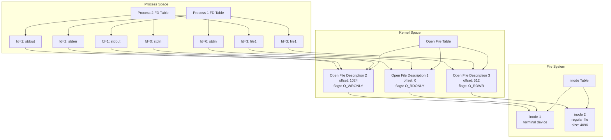
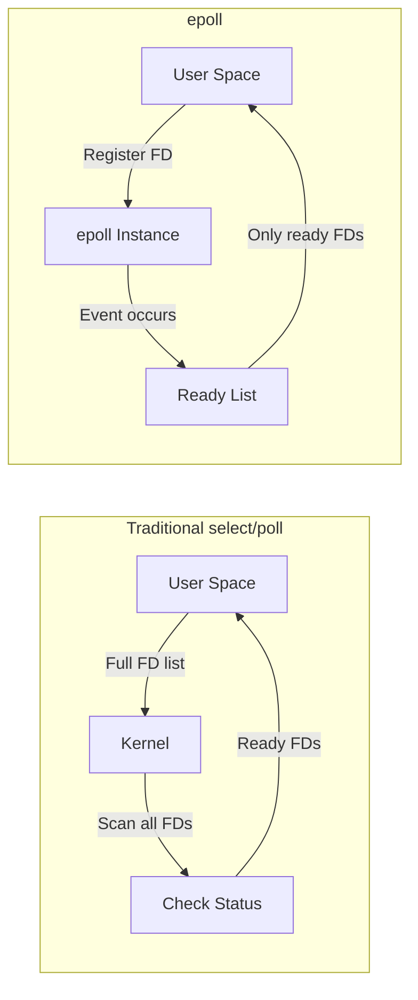

# File Descriptor

File DescriptorはUNIX系オペレーティングシステムにおいて、プロセスがアクセスするリソース（ファイル、ソケット、パイプ、デバイスなど）を抽象化した整数値である。この抽象化により、プロセスは統一的なインターフェースでさまざまなI/Oリソースを操作できる。POSIX.1-2017仕様[^1]では、File Descriptorを「プロセスごとのファイルやソケットへのアクセスを識別する非負整数」と定義している。

File Descriptorの本質は、プロセスがカーネルに対してI/O操作を要求する際の識別子として機能することにある。プロセスはファイルの物理的な位置やデバイスの詳細を知る必要はなく、単に整数値を使ってread()、write()、close()などのシステムコールを呼び出すだけでよい。この設計は、UNIXの「すべてはファイルである」という哲学を体現しており、異なる種類のリソースに対して同一のインターフェースを提供することで、プログラミングモデルを単純化している。

## File Descriptorテーブルの階層構造

File Descriptorの実装は、プロセスレベル、システムレベル、ファイルシステムレベルの3層構造で構成される。各層は異なる責務を持ち、相互に参照関係を持つことで、効率的なリソース管理と共有を実現している。



プロセスのFile Descriptorテーブルは、各プロセスが独立して保持する配列構造であり、File Descriptorの値がこの配列のインデックスとなる。各エントリは、カーネル空間のOpen File Description（Open File Table Entryとも呼ばれる）へのポインタを保持する。fork()システムコールによって子プロセスが生成される際、親プロセスのFile Descriptorテーブルがコピーされるが、ポインタが指すOpen File Descriptionは共有される。これにより、親子プロセス間でファイルオフセットが共有される動作が実現される。

Open File Descriptionは、開かれたファイルの状態を管理する構造体であり、現在のファイルオフセット、ファイルのオープンモード（読み取り専用、書き込み専用、読み書き可能）、ファイルステータスフラグ（O_APPEND、O_NONBLOCK等）を保持する。複数のFile Descriptorが同一のOpen File Descriptionを参照することが可能であり、これがdup()やdup2()システムコールの基礎となっている。

inodeテーブルは、ファイルシステムレベルでファイルのメタデータを管理する。inodeには、ファイルのサイズ、所有者、パーミッション、データブロックへのポインタなどが含まれる。Open File Descriptionはinodeへの参照を保持し、実際のファイルデータへのアクセスを可能にする。同一のinodeに対して複数のOpen File Descriptionが存在することも可能であり、これは同じファイルを複数回open()した場合に発生する。

## File Descriptorの生成と管理

File Descriptorは、open()、socket()、pipe()などのシステムコールによって生成される。カーネルは新しいFile Descriptorを割り当てる際、現在使用されていない最小の非負整数を選択する。この動作はPOSIX仕様で規定されており[^2]、プログラムが予測可能な動作をすることを保証している。

```c
int fd = open("/path/to/file", O_RDONLY);
if (fd == -1) {
    perror("open");
    exit(EXIT_FAILURE);
}
```

標準的なUNIXプロセスは、起動時に3つの標準File Descriptorを持つ：標準入力（stdin、fd=0）、標準出力（stdout、fd=1）、標準エラー出力（stderr、fd=2）。これらの値は<unistd.h>でSTDIN_FILENO、STDOUT_FILENO、STDERR_FILENOとして定義されている。シェルはプロセスを起動する前にこれらのFile Descriptorを適切に設定し、リダイレクション機能を実現する。

File Descriptorの複製は、dup()とdup2()システムコールによって行われる。dup()は引数として渡されたFile Descriptorを複製し、新しいFile Descriptorを返す。dup2()は複製先のFile Descriptor番号を指定できる。これらのシステムコールは、既存のOpen File Descriptionへの新しい参照を作成するだけであり、ファイルオフセットやステータスフラグは共有される。

```c
int new_fd = dup(old_fd);
// old_fdとnew_fdは同じOpen File Descriptionを参照

int result = dup2(old_fd, target_fd);
// target_fdがold_fdと同じOpen File Descriptionを参照するようになる
```

## File Descriptorフラグとファイルステータスフラグ

File Descriptorには、File Descriptor自体に関連付けられたフラグと、Open File Descriptionに関連付けられたフラグの2種類が存在する。この区別は重要であり、fork()やdup()による動作の違いに影響する。

File Descriptorフラグは、現在のところFD_CLOEXEC（close-on-exec）フラグのみが定義されている。このフラグはfcntl()のF_GETFDおよびF_SETFDコマンドで操作され、execve()システムコール実行時にFile Descriptorを自動的にクローズするかどうかを制御する。FD_CLOEXECフラグはFile Descriptorごとに独立しており、dup()で複製されたFile Descriptorには継承されない。

```c
int flags = fcntl(fd, F_GETFD);
fcntl(fd, F_SETFD, flags | FD_CLOEXEC);
```

一方、ファイルステータスフラグはOpen File Descriptionに保存され、同じOpen File Descriptionを参照するすべてのFile Descriptorで共有される。これにはO_APPEND（追記モード）、O_NONBLOCK（非ブロッキングモード）、O_ASYNC（非同期I/O通知）などが含まれる。これらのフラグはfcntl()のF_GETFLおよびF_SETFLコマンドで操作される。

## File Descriptorの限界値

システムは、プロセスごとおよびシステム全体でのFile Descriptorの使用数に制限を設けている。これらの制限は、リソースの枯渇を防ぎ、システムの安定性を保つために重要である。

プロセスごとの制限は、getrlimit()およびsetrlimit()システムコールでRLIMIT_NOFILEリソースとして管理される。この値は通常1024に設定されているが、必要に応じて増やすことができる。ただし、ハードリミットを超えることはできず、ハードリミット自体を増やすには特権が必要である。

```c
struct rlimit rlim;
getrlimit(RLIMIT_NOFILE, &rlim);
printf("Soft limit: %ld\n", rlim.rlim_cur);
printf("Hard limit: %ld\n", rlim.rlim_max);
```

システム全体の制限は、/proc/sys/fs/file-maxで確認・設定できる。この値は、システム全体で同時に開くことができるファイルの最大数を示す。現在の使用状況は/proc/sys/fs/file-nrで確認できる。

Linuxカーネルの実装では、File Descriptorテーブルは動的に拡張可能な構造として実装されている。初期状態では小さな固定サイズの配列を使用し、必要に応じてより大きな配列を割り当てる。この設計により、多くのFile Descriptorを使用しないプロセスのメモリオーバーヘッドを最小限に抑えつつ、必要な場合には数千のFile Descriptorを効率的に管理できる。

## I/O多重化とFile Descriptor

複数のFile Descriptorを同時に監視する必要がある場合、select()、poll()、epoll()などのI/O多重化メカニズムが使用される。これらのシステムコールは、複数のFile Descriptorの状態を効率的に監視し、I/O可能になったFile Descriptorを通知する。

select()は最も古いI/O多重化メカニズムであり、POSIX.1-2001で標準化されている[^3]。File Descriptorの集合をビットマスクとして管理し、読み取り可能、書き込み可能、例外条件の3つの集合を監視する。しかし、監視できるFile Descriptorの最大値がFD_SETSIZE（通常1024）に制限されるという問題がある。

```c
fd_set readfds;
FD_ZERO(&readfds);
FD_SET(fd1, &readfds);
FD_SET(fd2, &readfds);

struct timeval timeout = {5, 0}; // 5 seconds
int result = select(max_fd + 1, &readfds, NULL, NULL, &timeout);
```

poll()はselect()の制限を解決するために導入され、File Descriptorの配列を使用することで、FD_SETSIZEの制限を回避している。各File Descriptorに対して監視するイベントを個別に指定でき、より柔軟な制御が可能である。

epoll()はLinux固有のメカニズムであり、大量のFile Descriptorを効率的に監視するために設計された。epoll自体がFile Descriptorとして実装されており、監視対象のFile Descriptorをepoll_ctl()で登録し、epoll_wait()でイベントを待機する。内部的にはレッドブラックツリーとリンクリストを使用して、O(1)の性能で動作する。



## File Descriptorの継承とプロセス間通信

fork()システムコールによって作成された子プロセスは、親プロセスのFile Descriptorテーブルの完全なコピーを継承する。重要な点は、File Descriptorの値はコピーされるが、それが参照するOpen File Descriptionは共有されることである。この動作により、親子プロセスが同じファイルオフセットを共有し、一方のプロセスでの読み書きが他方に影響を与える。

execve()システムコールは、プロセスのイメージを新しいプログラムで置き換えるが、FD_CLOEXECフラグが設定されていないFile Descriptorは新しいプログラムに引き継がれる。これにより、シェルのリダイレクション機能が実現される。シェルはfork()で子プロセスを作成し、必要なFile Descriptorの操作（dup2()によるリダイレクション）を行った後、execve()で目的のプログラムを実行する。

パイプは、プロセス間通信の基本的なメカニズムであり、2つのFile Descriptorのペアとして実装される。pipe()システムコールは、読み取り用と書き込み用の2つのFile Descriptorを作成し、一方に書き込まれたデータが他方から読み取れるようにする。

```c
int pipefd[2];
if (pipe(pipefd) == -1) {
    perror("pipe");
    exit(EXIT_FAILURE);
}

pid_t pid = fork();
if (pid == 0) {  // Child process
    close(pipefd[1]);  // Close write end
    // Read from pipefd[0]
} else {  // Parent process
    close(pipefd[0]);  // Close read end
    // Write to pipefd[1]
}
```

## 非ブロッキングI/OとFile Descriptor

デフォルトでは、read()やwrite()などのI/O操作はブロッキングモードで動作し、操作が完了するまでプロセスをブロックする。しかし、O_NONBLOCKフラグを設定することで、File Descriptorを非ブロッキングモードにできる。非ブロッキングモードでは、I/O操作が即座に完了できない場合、EAGAINまたはEWOULDBLOCKエラーを返す。

非ブロッキングI/Oは、単一スレッドで複数のI/Oストリームを処理する際に特に有用である。I/O多重化メカニズムと組み合わせることで、効率的なイベント駆動型プログラムを実装できる。

```c
int flags = fcntl(fd, F_GETFL);
fcntl(fd, F_SETFL, flags | O_NONBLOCK);

ssize_t n = read(fd, buffer, sizeof(buffer));
if (n == -1) {
    if (errno == EAGAIN || errno == EWOULDBLOCK) {
        // No data available right now
    } else {
        // Real error occurred
    }
}
```

## File Descriptorリークとリソース管理

File Descriptorリークは、プログラムがFile Descriptorをclose()せずに失うことで発生する。リークしたFile Descriptorは、プロセスが終了するまで解放されず、プロセスのFile Descriptor制限に達する可能性がある。特に長時間実行されるサーバープロセスでは、File Descriptorリークは深刻な問題となる。

リークを防ぐための一般的な手法として、RAIIパターン（C++）やdefer文（Go）などの言語機能を使用する方法がある。Cでは、エラーハンドリングパスを慎重に設計し、すべての実行パスでclose()が呼ばれることを保証する必要がある。

```c
int process_file(const char *filename) {
    int fd = open(filename, O_RDONLY);
    if (fd == -1) {
        return -1;
    }
    
    char *buffer = malloc(BUFFER_SIZE);
    if (buffer == NULL) {
        close(fd);  // Don't forget to close on error path
        return -1;
    }
    
    // Process file...
    
    free(buffer);
    close(fd);
    return 0;
}
```

## File Descriptorの実装とパフォーマンス特性

LinuxカーネルにおけるFile Descriptorの実装は、高度に最適化されている。File Descriptorテーブルは、struct fdtableとして実装され、小さなFile Descriptor値に対しては固定サイズの配列を使用し、必要に応じて動的に拡張される。

File Descriptorの検索はO(1)の操作であり、配列のインデックスアクセスによって実現される。新しいFile Descriptorの割り当ては、ビットマップを使用して空きスロットを効率的に見つける。close()操作も基本的にO(1)であるが、最後の参照がクローズされる場合は、関連するリソースの解放が必要となる。

パフォーマンスの観点から重要な考慮事項として、File Descriptorの値が大きくなるほど、select()のオーバーヘッドが増加することがある。これは、select()がFile Descriptorセットを走査する必要があるためである。epoll()はこの問題を解決し、監視するFile Descriptorの数に関わらず一定の性能を提供する。

システムコールのオーバーヘッドを削減するため、バッファリングされたI/Oライブラリ（stdioなど）を使用することが推奨される。これらのライブラリは、ユーザー空間でバッファリングを行い、システムコールの回数を削減する。ただし、バッファリングは遅延を引き起こす可能性があるため、リアルタイム性が要求される場合は直接システムコールを使用する必要がある。

[^1]: The Open Group Base Specifications Issue 7, 2018 edition, IEEE Std 1003.1-2017
[^2]: POSIX.1-2017, System Interfaces, open()
[^3]: POSIX.1-2001, System Interfaces, select()