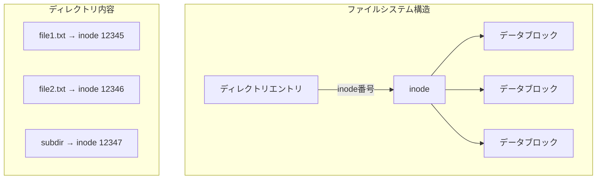
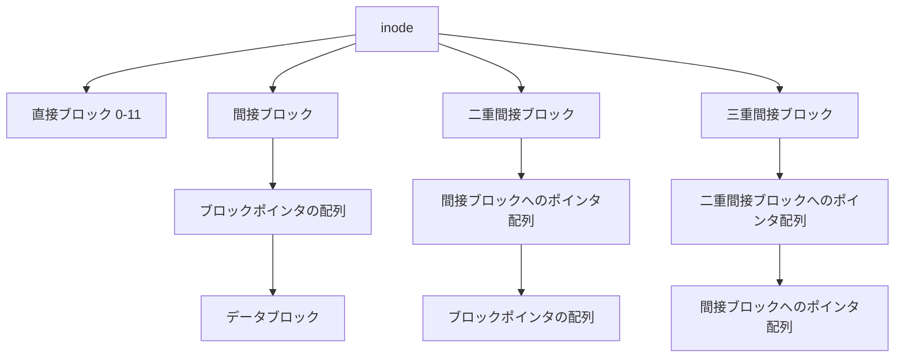
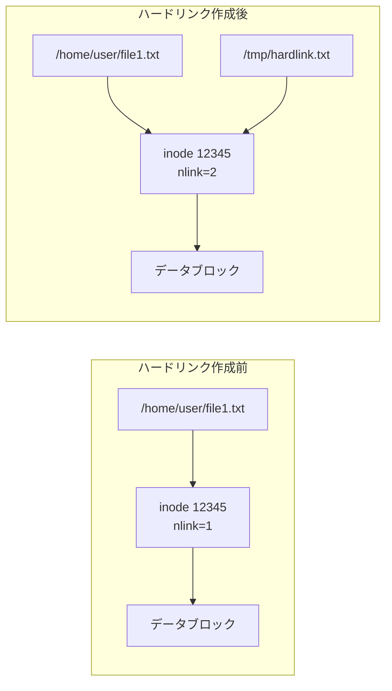
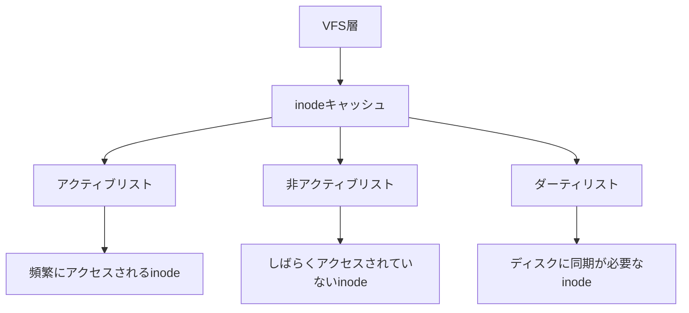

# inode

UNIXおよびLinuxファイルシステムにおいて、inodeは中核的な概念である。ファイルのメタデータを管理するデータ構造として、ファイルシステムの設計と実装の根幹を成している。本稿では、inodeの詳細な構造、動作原理、そして実装における設計上の考慮事項について、POSIX標準[^1]とLinuxカーネルの実装を基に解説する。

## inodeの基本概念

inodeという名称は「index node」に由来し、1970年代初頭のUNIX V1において初めて導入された[^2]。ファイルシステムにおいてファイルを一意に識別し、そのメタデータを格納するためのデータ構造である。重要な点は、inodeにはファイル名が含まれないということである。ファイル名とinodeの対応関係は、ディレクトリエントリによって管理される。



この設計により、同一のinodeを複数のディレクトリエントリから参照することが可能となり、ハードリンクの実装基盤となっている。また、ファイル名の変更はディレクトリエントリの更新のみで済み、inode自体への変更は不要となる。

## inodeの内部構造

POSIX.1-2017[^3]で規定されるstat構造体は、inodeが保持すべき最小限の情報を定義している。Linuxカーネルにおける実際のinode構造体は、これらの標準フィールドに加えて、性能最適化やセキュリティ機能のための追加フィールドを含んでいる。

```c
struct inode {
    umode_t         i_mode;      // ファイルタイプとアクセス権限
    uid_t           i_uid;       // 所有者のユーザーID
    gid_t           i_gid;       // 所有者のグループID
    unsigned long   i_ino;       // inode番号
    dev_t           i_rdev;      // デバイスファイルの場合のデバイス番号
    loff_t          i_size;      // ファイルサイズ（バイト単位）
    struct timespec i_atime;     // 最終アクセス時刻
    struct timespec i_mtime;     // 最終修正時刻
    struct timespec i_ctime;     // 最終状態変更時刻
    unsigned int    i_nlink;     // ハードリンク数
    blkcnt_t        i_blocks;    // 割り当てられたブロック数
    // ... その他のフィールド
};
```

各フィールドの意味と役割について詳述する。

### ファイルタイプとアクセス権限（i_mode）

i_modeフィールドは16ビットの値で、上位4ビットがファイルタイプ、下位12ビットがアクセス権限を表す。ファイルタイプには以下が定義されている：

- S_IFREG (0100000): 通常ファイル
- S_IFDIR (0040000): ディレクトリ
- S_IFCHR (0020000): キャラクタデバイス
- S_IFBLK (0060000): ブロックデバイス
- S_IFIFO (0010000): FIFO（名前付きパイプ）
- S_IFLNK (0120000): シンボリックリンク
- S_IFSOCK (0140000): ソケット

アクセス権限は、所有者・グループ・その他に対する読み取り・書き込み・実行権限の組み合わせで表現される。さらに、setuid、setgid、sticky bitの特殊権限も含まれる。

### タイムスタンプの管理

inodeは3つのタイムスタンプを管理する：

1. **atime（Access Time）**: ファイルの内容が最後に読み取られた時刻
2. **mtime（Modification Time）**: ファイルの内容が最後に変更された時刻
3. **ctime（Change Time）**: inodeの状態が最後に変更された時刻

ctimeはファイルの内容変更だけでなく、権限変更、所有者変更、リンク数の変更など、inode自体の変更時にも更新される。この仕様により、システム管理者はファイルの改ざんを検出できる。ただし、atimeの頻繁な更新は性能上の問題を引き起こすため、多くのファイルシステムではnoatimeやrelatimeオプションによる最適化が行われている。

### データブロックの管理

inodeはファイルの実データが格納されているディスクブロックへのポインタを保持する。ext4ファイルシステムでは、以下の階層的なブロックポインタ構造を採用している：



この構造により、小さなファイルは直接ブロックのみで効率的に管理でき、大きなファイルも間接参照により対応できる。4KBのブロックサイズを仮定すると、直接ブロックのみで48KB、一重間接ブロックを含めると4MB+48KB、二重間接ブロックで4GB+4MB+48KB、三重間接ブロックで4TB以上のファイルサイズに対応できる。

## ディレクトリとinodeの関係

ディレクトリは特殊なファイルであり、その内容はディレクトリエントリの集合である。各ディレクトリエントリは、ファイル名とinode番号のペアから構成される。ext4では、ディレクトリエントリは以下の構造を持つ：

```c
struct ext4_dir_entry_2 {
    __le32  inode;      // inode番号
    __le16  rec_len;    // このエントリの長さ
    __u8    name_len;   // ファイル名の長さ
    __u8    file_type;  // ファイルタイプ（最適化用）
    char    name[];     // ファイル名（可変長）
};
```

この設計により、ファイル名の最大長は255バイトに制限される。また、同一ディレクトリ内でのファイル名の重複は許されない。

### ハードリンクの実装

ハードリンクは、既存のinodeに対する新しいディレクトリエントリを作成することで実現される。link(2)システムコールは以下の処理を行う：

1. 対象ファイルのinodeを取得
2. 新しいディレクトリエントリを作成し、同じinode番号を設定
3. inodeのリンクカウント（i_nlink）をインクリメント



ハードリンクには以下の制約がある：

- ディレクトリに対するハードリンクは作成できない（ファイルシステムの循環を防ぐため）
- 異なるファイルシステム間でのハードリンクは作成できない（inode番号の一意性が保証されないため）

### シンボリックリンクの実装

シンボリックリンクは、リンク先のパス名を内容として持つ特殊なファイルである。symlink(2)システムコールは新しいinodeを作成し、そのファイルタイプをS_IFLNKに設定する。リンク先のパス名は、以下のいずれかの方法で格納される：

1. **インラインシンボリックリンク**: パス名が短い場合（ext4では60バイト以下）、inodeの直接ブロックポインタ領域に格納
2. **通常のシンボリックリンク**: パス名が長い場合、通常のファイルと同様にデータブロックに格納

シンボリックリンクの解決は、パス名解決の過程で行われる。カーネルは最大40回までのシンボリックリンクの連鎖を許可し、それを超えるとELOOPエラーを返す[^4]。

## inodeの割り当てと管理

ファイルシステムにおけるinodeの総数は、通常フォーマット時に決定される。ext4では、デフォルトで16KBごとに1つのinodeが割り当てられる。この比率は、予想されるファイルサイズ分布に基づいて調整可能である。

### inodeテーブルとビットマップ

ext4では、各ブロックグループにinodeテーブルとinodeビットマップが配置される。inodeビットマップは、どのinodeが使用中かを追跡する。新しいファイル作成時のinode割り当ては以下の手順で行われる：

1. 親ディレクトリと同じブロックグループから空きinodeを探す（局所性の原理）
2. 見つからない場合、他のブロックグループを探索
3. inodeビットマップの該当ビットをセット
4. inodeテーブルから対応するinodeを初期化

### inode枯渇問題

ディスク容量に余裕があってもinodeが枯渇すると、新しいファイルを作成できなくなる。この問題は、小さなファイルを大量に扱うシステム（メールサーバーなど）で発生しやすい。対策として以下が挙げられる：

- フォーマット時にinode数を増やす
- 動的inode割り当てをサポートするファイルシステム（btrfsなど）の使用
- 小さなファイルをアーカイブ化して統合

## メモリ上のinodeキャッシュ

カーネルは頻繁にアクセスされるinodeをメモリ上にキャッシュする。Linuxでは、inodeキャッシュはSLABアロケータで管理され、LRU（Least Recently Used）アルゴリズムによって退避される。



inodeキャッシュの効率は、システム全体の性能に大きく影響する。/proc/sys/fs/inode-nrとinode-stateファイルで、現在のinode使用状況を監視できる。

## 拡張属性とセキュリティ

現代のファイルシステムでは、POSIX標準のinode情報に加えて、拡張属性（Extended Attributes）をサポートしている。これにより、SELinuxのセキュリティコンテキスト、ACL（Access Control List）、ユーザー定義のメタデータなどを格納できる。

拡張属性は名前空間で分類される：

- **user**: ユーザー定義の属性
- **trusted**: 特権プロセスのみアクセス可能
- **security**: SELinuxラベルなどのセキュリティ情報
- **system**: ACLなどのシステム情報

ext4では、拡張属性はinodeの拡張領域または外部ブロックに格納される。小さな属性はinode内に収まるため、追加のディスクアクセスが不要となる。

## 実装の最適化と性能特性

### 遅延割り当て（Delayed Allocation）

ext4やXFSなどの現代的なファイルシステムでは、遅延割り当てを実装している。書き込み時にすぐにディスクブロックを割り当てるのではなく、ページキャッシュに保持し、実際のディスクへの書き込み時にブロックを割り当てる。これにより：

- 連続したブロックの割り当てが可能となり、フラグメンテーションを削減
- 一時ファイルがディスクに書き込まれることなく削除される場合の無駄を削減
- 複数の小さな書き込みを統合して、より効率的なI/Oを実現

### エクステントベースの割り当て

従来のブロックポインタ方式では、大きなファイルで多数の間接ブロックが必要となる。ext4では、エクステント（連続したブロックの範囲）を使用することで、メタデータのオーバーヘッドを削減している：

```c
struct ext4_extent {
    __le32  ee_block;   // ファイル内の論理ブロック番号
    __le16  ee_len;     // エクステントの長さ
    __le16  ee_start_hi;// 物理ブロック番号の上位16ビット
    __le32  ee_start_lo;// 物理ブロック番号の下位32ビット
};
```

1つのエクステントで最大32,768個（128MB、4KBブロックサイズの場合）の連続ブロックを表現できる。

### ジャーナリングとinodeの整合性

ext4などのジャーナリングファイルシステムでは、inodeの更新もジャーナルに記録される。ジャーナリングモードには以下がある：

1. **data=journal**: データとメタデータの両方をジャーナルに記録（最も安全だが遅い）
2. **data=ordered**: メタデータのみジャーナルに記録、データは先に書き込み（デフォルト）
3. **data=writeback**: メタデータのみジャーナルに記録（最速だがクラッシュ時にデータ不整合の可能性）

## 実践的な設計指針

### ファイルシステム選択の考慮事項

アプリケーションの特性に応じて、適切なファイルシステムを選択することが重要である：

- **大量の小ファイル**: inode数の上限に注意し、必要に応じてフォーマット時に調整
- **大容量ファイル**: エクステントベースのファイルシステム（ext4、XFS）を選択
- **頻繁なメタデータ更新**: noatimeマウントオプションやrelatimeの使用を検討
- **高い信頼性要求**: ジャーナリングモードの適切な選択

### inode使用状況の監視

運用環境では、inode使用状況を定期的に監視することが重要である：

```bash
# ファイルシステムごとのinode使用状況
df -i

# 特定ディレクトリ配下のファイル数カウント
find /path/to/directory -type f | wc -l

# inode使用率の高いディレクトリの特定
for dir in /*; do echo -n "$dir: "; find "$dir" -xdev -type f | wc -l; done
```

### 性能チューニングのポイント

1. **ディレクトリ構造の最適化**: 1つのディレクトリに大量のファイルを配置することを避ける。ext4のdir_indexは効果的だが、それでも限界がある

2. **適切なブロックサイズの選択**: ファイルサイズ分布に応じてブロックサイズを選択。小さなファイルが多い場合は1KBまたは2KB、大きなファイルが多い場合は4KBまたはそれ以上

3. **予約領域の活用**: ext4では、rootユーザー用に5%の領域が予約される。この値は、ファイルシステムの用途に応じて調整可能

## 結論

inodeは、UNIXファイルシステムの設計思想を体現する基本的なデータ構造である。ファイル名とメタデータの分離、ハードリンクの実現、効率的なブロック管理など、その設計は40年以上にわたって基本的な構造を保ちながら、現代の要求に応じて進化を続けている。

システム管理者や開発者にとって、inodeの動作原理を理解することは、ファイルシステムの性能特性を把握し、適切な設計判断を下すために不可欠である。特に、大規模なシステムやI/O集約的なアプリケーションにおいては、inodeの制約と最適化手法を考慮することが、システム全体の性能と信頼性に直結する。

[^1]: IEEE Std 1003.1-2017, The Open Group Base Specifications Issue 7, 2018 Edition
[^2]: Dennis M. Ritchie and Ken Thompson, "The UNIX Time-Sharing System", Communications of the ACM, Vol. 17, No. 7, July 1974
[^3]: POSIX.1-2017, System Interfaces, stat Structure, https://pubs.opengroup.org/onlinepubs/9699919799/
[^4]: Linux Kernel Documentation, Path walking and name lookup, https://www.kernel.org/doc/html/latest/filesystems/path-lookup.html