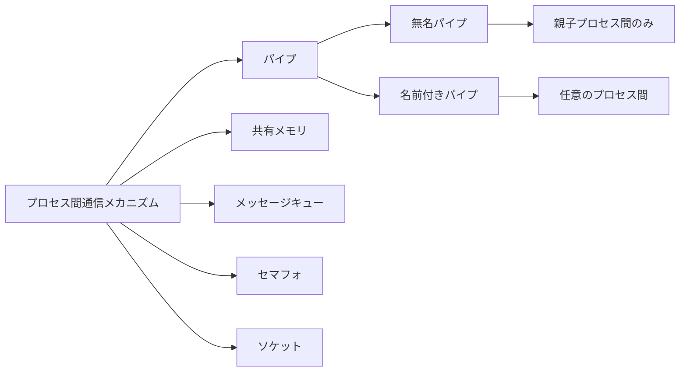
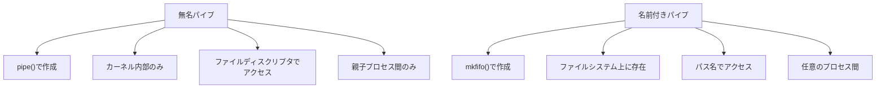
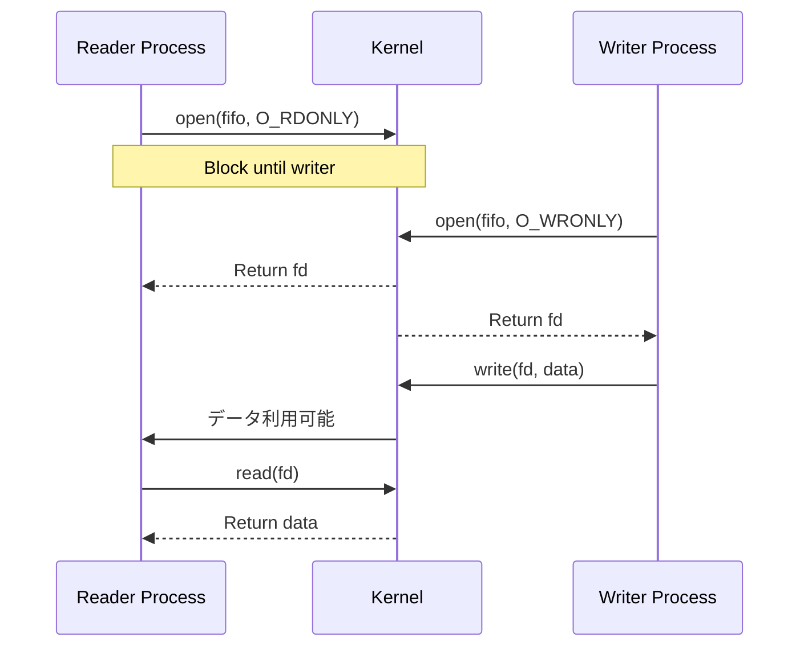
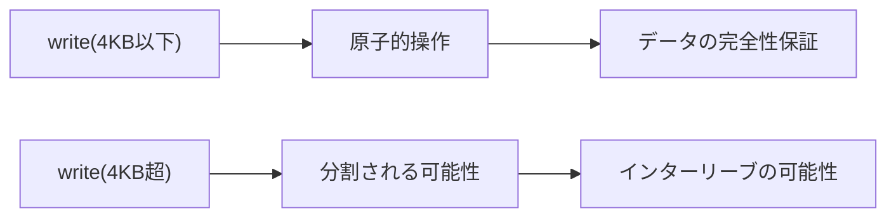
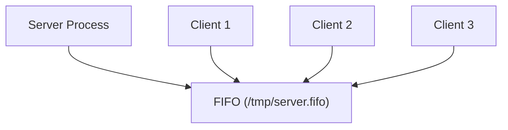
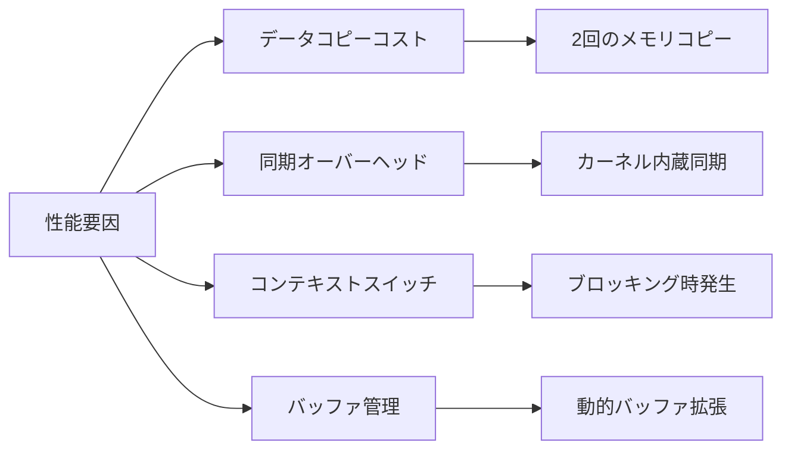

# 名前付きパイプ

名前付きパイプ（named pipe）は、FIFOとも呼ばれ、UNIXおよびLinuxシステムにおけるプロセス間通信（IPC）メカニズムの一つである。通常のパイプが親子関係にあるプロセス間でのみ使用可能であるのに対し、名前付きパイプはファイルシステム上に名前を持つ特殊ファイルとして存在し、任意のプロセス間での通信を可能にする。この特性により、システムプログラミングにおいて重要な役割を果たしている。

## プロセス間通信における位置づけ

UNIXシステムには多様なプロセス間通信メカニズムが存在する。共有メモリ、メッセージキュー、セマフォ、ソケット、そしてパイプである。これらの中で、パイプは最も古くから存在し、シンプルでありながら強力な機構として広く利用されている。名前付きパイプは、通常のパイプ（無名パイプ）の制約を克服し、より柔軟なプロセス間通信を実現するために導入された。



名前付きパイプの本質は、ファイルシステムの名前空間を利用してプロセス間の通信チャネルを確立することにある。これにより、親子関係にないプロセスや、異なるタイミングで起動されたプロセス間でも、共通の名前を介して通信が可能となる。さらに、ファイルシステムの権限機構を利用したアクセス制御も自然に実現される。

## 通常のパイプとの本質的な違い

無名パイプと名前付きパイプの最も根本的な違いは、その生存期間とアクセス可能性にある。無名パイプは`pipe()`システムコールによってカーネル内に作成され、作成時に得られるファイルディスクリプタを通じてのみアクセス可能である。このファイルディスクリプタは`fork()`によって子プロセスに継承されるが、それ以外の方法で他のプロセスと共有することはできない。

一方、名前付きパイプは`mkfifo()`システムコールによってファイルシステム上に作成される。作成されたFIFOファイルは、通常のファイルと同様にパス名を持ち、`open()`システムコールによって任意のプロセスからアクセス可能である。ただし、その内部実装は通常のファイルとは大きく異なり、ディスク上にデータを保存することはない。



この違いは、システム設計において重要な意味を持つ。無名パイプは一時的な通信に適しており、シェルのパイプライン処理などで活用される。対して名前付きパイプは、より永続的な通信チャネルを提供し、クライアント・サーバモデルの実装や、非同期的に起動されるプロセス間の通信に適している。

## カーネルレベルでの実装

名前付きパイプの内部実装を理解することは、その動作特性と制約を把握する上で重要である。Linuxカーネルにおいて、名前付きパイプは`pipefs`と呼ばれる仮想ファイルシステムを利用して実装されている。このファイルシステムは、通常のファイルシステムとは異なり、メモリ上にのみ存在し、ディスクI/Oを発生させない。

名前付きパイプがファイルシステム上に作成されると、対応するinodeが生成される。このinodeは、通常のファイルのinodeとは異なり、`S_IFIFO`タイプとしてマークされる。カーネルは、このタイプ情報を元に、ファイル操作を適切なハンドラにディスパッチする。

```c
// Kernel internal structure (simplified)
struct pipe_inode_info {
    struct mutex mutex;
    wait_queue_head_t wait;
    unsigned int readers;
    unsigned int writers;
    unsigned int waiting_writers;
    unsigned int r_counter;
    unsigned int w_counter;
    struct page *bufs[PIPE_DEF_BUFFERS];
    // ... other fields
};
```

名前付きパイプのバッファ管理は、カーネル内で効率的に実装されている。デフォルトでは、16個のページ（通常64KB）がバッファとして使用される。データの読み書きは循環バッファ方式で管理され、読み手と書き手のポインタが独立して移動する。この実装により、小さなデータの頻繁な読み書きでも効率的な処理が可能となる。

重要な点として、名前付きパイプのバッファサイズは`/proc/sys/fs/pipe-max-size`で設定された上限まで動的に拡張可能である。ただし、この拡張はページ単位で行われ、メモリ圧迫時には制限される可能性がある。

## システムコールインタフェース

名前付きパイプの操作には、複数のシステムコールが関与する。まず、`mkfifo()`または`mknod()`によってFIFOファイルを作成する。これらのシステムコールは、指定されたパス名にFIFO型の特殊ファイルを作成する。

```c
int mkfifo(const char *pathname, mode_t mode);
int mknod(const char *pathname, mode_t mode | S_IFIFO, dev_t dev);
```

作成されたFIFOファイルは、通常のファイルと同様に`open()`システムコールでオープンされる。ここで重要なのは、`open()`の動作がフラグによって大きく異なることである。デフォルトでは、読み込み用にオープンする場合は書き手が現れるまでブロックし、書き込み用にオープンする場合は読み手が現れるまでブロックする。この同期機構により、プロセス間の協調が自動的に実現される。



`O_NONBLOCK`フラグを使用することで、この同期動作を回避できる。非ブロッキングモードでは、相手側のプロセスが存在しない場合、`open()`は即座に返る。読み込み用の場合は成功し、書き込み用の場合は`ENXIO`エラーとなる。この違いは、サーバ・クライアントモデルの実装において重要な意味を持つ。

## 同期機構と原子性

名前付きパイプにおける同期は、カーネルレベルで厳密に管理されている。`PIPE_BUF`（Linuxでは通常4096バイト）以下のデータの書き込みは原子的に行われることが保証されている。これは、複数のプロセスが同時に書き込みを行っても、各書き込みが混在することなく、完全な単位として処理されることを意味する。

この原子性の保証は、POSIX標準で規定されており[^1]、信頼性の高いプロセス間通信を実現する上で重要である。ただし、`PIPE_BUF`を超えるデータの書き込みについては、この保証はない。大きなデータは複数の断片に分割される可能性があり、複数の書き手が存在する場合、データが交互に混在する可能性がある。



読み込み側においても、同様の考慮が必要である。`read()`システムコールは、要求されたバイト数を必ずしも返すとは限らない。パイプ内に利用可能なデータが要求サイズより少ない場合、部分的な読み込みが発生する。これは、ストリーム指向の通信において自然な動作であるが、メッセージ指向のプロトコルを実装する場合には適切な処理が必要となる。

ブロッキングと非ブロッキングの動作は、`select()`、`poll()`、`epoll()`などの多重化システムコールと組み合わせることで、より柔軟な制御が可能となる。これらのシステムコールを使用することで、複数のFIFOを同時に監視し、データの到着や書き込み可能状態を効率的に検出できる。

## セキュリティと権限管理

名前付きパイプのセキュリティは、通常のファイルシステムの権限機構によって管理される。FIFOファイルの作成時に指定されたモードビットにより、読み込み・書き込みの権限が決定される。これは、UNIXの統一的なファイルインタフェースの利点の一つである。

```c
// Create a FIFO with specific permissions
mkfifo("/tmp/myfifo", 0660);  // rw-rw----
```

しかし、名前付きパイプ特有のセキュリティ上の考慮事項も存在する。まず、FIFOファイルは誰でも作成可能な場所（`/tmp`など）に配置されることが多い。このような環境では、シンボリックリンク攻撃やレースコンディションに対する注意が必要である。

特に重要なのは、既存のFIFOファイルを開く際の検証である。悪意のあるプロセスが、期待されるFIFOファイルと同じ名前で別のファイルを作成する可能性がある。これを防ぐため、`stat()`を使用してファイルタイプを確認するか、`O_CREAT | O_EXCL`フラグを使用して排他的な作成を行うことが推奨される。

```c
struct stat st;
if (stat(fifo_path, &st) == 0) {
    if (!S_ISFIFO(st.st_mode)) {
        // Not a FIFO, potential security issue
        return -1;
    }
}
```

また、名前付きパイプを介した通信では、通信相手の認証が課題となる。ファイルシステムの権限だけでは、特定のプロセスからの接続のみを許可することは困難である。より高度な認証が必要な場合は、UNIXドメインソケットを使用し、`SO_PEERCRED`オプションによるプロセスID検証を検討すべきである。

## 実践的な使用パターン

名前付きパイプは、様々なシステム設計パターンで活用される。最も基本的なパターンは、単一のサーバプロセスと複数のクライアントプロセスによる通信である。サーバは既知のパスにFIFOを作成し、クライアントはそのFIFOに接続する。



しかし、このシンプルなモデルには制約がある。複数のクライアントが同時に書き込みを行う場合、メッセージの境界を保持する仕組みが必要となる。一般的な解決策は、固定長のヘッダを使用してメッセージ長を示すか、デリミタを使用してメッセージを区切ることである。

より洗練されたパターンとして、双方向通信の実装がある。単一のFIFOは単方向通信しかサポートしないため、双方向通信には2つのFIFOを使用する。さらに、各クライアントに専用の応答用FIFOを割り当てることで、サーバからクライアントへの個別応答が可能となる。

```c
// Client-specific response FIFO pattern
char response_fifo[256];
snprintf(response_fifo, sizeof(response_fifo), 
         "/tmp/client_%d.fifo", getpid());
mkfifo(response_fifo, 0600);

// Send request with response FIFO path
struct request {
    char response_path[256];
    char command[1024];
};
```

ログ収集システムやイベント配信システムでは、名前付きパイプが効果的に活用される。複数のプロセスがログを生成し、単一のログ収集プロセスがそれらを集約する場合、名前付きパイプは自然な選択肢となる。ただし、書き手の一つがブロックした場合の影響を考慮し、非ブロッキングI/Oやタイムアウト処理を適切に実装する必要がある。

## 性能特性とトレードオフ

名前付きパイプの性能特性は、その実装に起因する複数の要因によって決定される。まず、データのコピーについて考察する。名前付きパイプを通じたデータ転送では、ユーザ空間からカーネル空間へのコピー、そしてカーネル空間から別のユーザ空間へのコピーが発生する。これは、共有メモリと比較して追加的なオーバーヘッドとなる。

しかし、この単純な比較は全体像を捉えていない。名前付きパイプは、カーネルによる同期機構を内蔵しており、プロセス間の協調を自動的に処理する。共有メモリを使用する場合、この同期を明示的に実装する必要があり、その複雑性とオーバーヘッドを考慮すると、小〜中規模のデータ転送では名前付きパイプの方が効率的な場合も多い。



レイテンシの観点では、名前付きパイプは優れた特性を示す。データが書き込まれると、読み手のプロセスは即座に起床される。この wake-up メカニズムは、カーネルのスケジューラと密接に統合されており、低レイテンシの通信を実現する。ただし、頻繁なコンテキストスイッチが発生する場合、全体的なスループットに影響を与える可能性がある。

スループットの最適化には、適切なバッファサイズの選択が重要である。小さすぎるバッファは頻繁なブロッキングを引き起こし、大きすぎるバッファはメモリの無駄遣いとなる。一般的な指針として、予想されるメッセージサイズと頻度に基づいて、数メッセージ分のバッファを確保することが推奨される。

## システム設計における考慮事項

名前付きパイプを使用したシステム設計では、いくつかの重要な考慮事項がある。まず、エラー処理とリカバリメカニズムである。パイプの一端が予期せず閉じられた場合、`SIGPIPE`シグナルが発生する。このシグナルのデフォルト動作はプロセスの終了であるため、適切なシグナルハンドリングか、`MSG_NOSIGNAL`フラグの使用が必要である。

プロセスのライフサイクル管理も重要な課題である。サーバプロセスが再起動した場合、既存のクライアント接続はどうなるか。クライアントが異常終了した場合、サーバはどのように検出し、リソースをクリーンアップするか。これらの問題に対処するため、ハートビートメカニズムやタイムアウト処理の実装が一般的である。

名前付きパイプの制約を理解することも重要である。まず、ネットワーク透過性がないため、分散システムには適さない。また、多対多の通信パターンには向いておらず、より複雑な通信要件にはメッセージキューやソケットが適している。さらに、永続性がないため、システムの再起動時にはすべてのデータが失われる。

これらの制約にもかかわらず、名前付きパイプは特定の用途において優れた選択肢となる。ローカルシステム内での軽量なプロセス間通信、シンプルなプロデューサ・コンシューマパターンの実装、既存のファイルベースのツールとの統合などである。特に、UNIXの哲学である「一つのことをうまくやる」プログラムの組み合わせにおいて、名前付きパイプは自然な接続手段を提供する。

## 高度な利用技法

名前付きパイプの高度な利用技法として、splice()システムコールの活用がある。splice()は、カーネル空間でのゼロコピーデータ転送を可能にし、パイプ間やパイプとファイル間でのデータ移動を効率化する。これは、大量のデータを扱うプロキシやルーティングアプリケーションで特に有効である。

```c
// Zero-copy data transfer between pipes
ssize_t splice(int fd_in, loff_t *off_in, int fd_out,
               loff_t *off_out, size_t len, unsigned int flags);
```

また、Linux固有の機能として、F_SETPIPE_SZによるパイプバッファサイズの動的調整がある。これにより、アプリケーションの要求に応じて、デフォルトの64KBから最大1MB（システム設定に依存）までバッファサイズを拡張できる。この機能は、バースト的なデータ転送が発生するシステムで有用である。

名前付きパイプと他のIPCメカニズムの組み合わせも、実践的なシステムで見られる。例えば、制御チャネルとしてUNIXドメインソケットを使用し、大量のデータ転送には名前付きパイプを使用するハイブリッドアプローチである。これにより、認証と制御の柔軟性を保ちながら、データ転送の効率性を確保できる。

## 実装例とベストプラクティス

実際のシステムにおける名前付きパイプの実装では、堅牢性と保守性を確保するためのベストプラクティスに従うことが重要である。エラー処理、リソース管理、そして適切な抽象化が鍵となる。

基本的な実装パターンとして、タイムアウト付きの読み書き操作がある。これは、select()やpoll()を使用して実現され、デッドロックやハングアップを防ぐ重要な技法である。また、部分的な読み書きに対する適切な処理も必要である。

```c
// Robust read with timeout
ssize_t read_with_timeout(int fd, void *buf, size_t count, int timeout_ms) {
    struct pollfd pfd = {.fd = fd, .events = POLLIN};
    int ret = poll(&pfd, 1, timeout_ms);
    
    if (ret < 0) return -1;  // Error
    if (ret == 0) return 0;  // Timeout
    
    return read(fd, buf, count);
}
```

プロダクション環境では、名前付きパイプの作成と削除を適切に管理する必要がある。起動時の既存ファイルのクリーンアップ、終了時の確実な削除、そして異常終了時のリカバリメカニズムが重要である。systemdなどのinitシステムと統合する場合、これらの処理をサービス定義に組み込むことが推奨される。

## デバッグとトラブルシューティング

名前付きパイプを使用したシステムのデバッグには、特有の課題と手法が存在する。通常のファイルとは異なり、パイプ内のデータは一時的であり、読み取られると消失するため、従来のデバッグ手法がそのまま適用できない場合がある。

最も基本的なデバッグ手法は、straceやltraceを使用したシステムコールのトレースである。これにより、プロセスがFIFOに対してどのような操作を行っているかを詳細に観察できる。特に、ブロッキングの発生箇所や、予期しないエラーの原因を特定する際に有効である。

```bash
# Trace all FIFO-related system calls
strace -e trace=open,read,write,close,mkfifo -p <pid>
```

より高度なデバッグには、Linuxのftrace機能を活用できる。ftraceを使用することで、カーネル内部でのパイプ操作の詳細なトレースが可能となる。これは、パフォーマンス問題の分析や、レースコンディションの検出に特に有用である。

パイプの状態を確認する別の方法として、`/proc`ファイルシステムの活用がある。各プロセスの`/proc/<pid>/fd`ディレクトリには、オープンしているファイルディスクリプタへのシンボリックリンクが含まれており、FIFOの使用状況を確認できる。また、`/proc/<pid>/fdinfo`には、より詳細な情報が含まれている。

```bash
# Check FIFO usage by a process
ls -la /proc/<pid>/fd | grep FIFO
cat /proc/<pid>/fdinfo/<fd>
```

## 実際のプロダクションシステムでの活用事例

名前付きパイプは、多くの実用的なシステムで活用されている。例えば、PostgreSQLデータベースシステムでは、バックアップとリストアの処理において名前付きパイプが効果的に使用される。pg_dumpコマンドの出力を直接圧縮プログラムに渡す際、中間ファイルを作成することなくストリーム処理が可能となる。

```bash
# PostgreSQL backup with compression via FIFO
mkfifo /tmp/pgdump.fifo
gzip < /tmp/pgdump.fifo > backup.sql.gz &
pg_dump mydb > /tmp/pgdump.fifo
```

syslogやrsyslogなどのロギングシステムでも、名前付きパイプは重要な役割を果たす。複数のアプリケーションからのログを集約し、フィルタリングや転送を行う際に、名前付きパイプを介した非同期処理が実装されている。これにより、ログ出力がアプリケーションの性能に与える影響を最小限に抑えることができる。

音声・動画処理システムでは、FFmpegなどのツールが名前付きパイプを活用している。リアルタイムエンコーディングやストリーミング処理において、複数の処理段階を名前付きパイプで接続することで、メモリ効率的なパイプライン処理を実現している。

## パフォーマンスチューニングの詳細

名前付きパイプのパフォーマンスを最適化するには、システムレベルとアプリケーションレベルの両方でのチューニングが必要である。システムレベルでは、カーネルパラメータの調整が重要となる。

```bash
# Check current pipe size limits
cat /proc/sys/fs/pipe-max-size
cat /proc/sys/fs/pipe-user-pages-hard
cat /proc/sys/fs/pipe-user-pages-soft

# Adjust pipe buffer size for better performance
echo 1048576 > /proc/sys/fs/pipe-max-size
```

アプリケーションレベルでは、バッファリング戦略の最適化が重要である。頻繁な小さな書き込みは避け、適切なサイズでバッファリングすることで、システムコールのオーバーヘッドを削減できる。また、非ブロッキングI/Oとイベント駆動アーキテクチャの組み合わせにより、複数のFIFOを効率的に処理できる。

CPU親和性（affinity）の設定も、パフォーマンス向上に寄与する場合がある。読み手と書き手のプロセスを同じCPUコアまたは同じNUMAノードに配置することで、キャッシュの局所性を改善し、メモリアクセスのレイテンシを削減できる。

```c
// Set CPU affinity for better cache locality
cpu_set_t cpuset;
CPU_ZERO(&cpuset);
CPU_SET(0, &cpuset);
sched_setaffinity(0, sizeof(cpuset), &cpuset);
```

## 将来の展望と代替技術

名前付きパイプは、40年以上の歴史を持つ成熟した技術であるが、現代のシステムにおいても重要な役割を果たし続けている。しかし、新しい要求事項に対応するため、様々な代替技術や拡張が提案されている。

io_uringは、Linuxカーネル5.1で導入された新しい非同期I/O機構であり、名前付きパイプを含む様々なI/O操作を効率的に処理できる。従来のepollベースの設計と比較して、システムコールのオーバーヘッドを大幅に削減し、高性能なイベント駆動アプリケーションの実装を可能にする。

また、BPF（Berkeley Packet Filter）の進化により、カーネル内でのデータ処理とフィルタリングが可能となっている。これにより、名前付きパイプを通過するデータに対して、カーネル空間での前処理や統計収集が可能となり、新しい利用シナリオが開かれている。

コンテナ技術の普及に伴い、名前空間を跨いだプロセス間通信の需要も高まっている。名前付きパイプは、適切なファイルシステムのマウント設定により、コンテナ間通信にも利用可能であるが、セキュリティと分離の観点から慎重な設計が必要である。

[^1]: IEEE Std 1003.1-2017 (POSIX.1-2017), Section 2.9.7 "Thread Interactions with Regular File Operations"