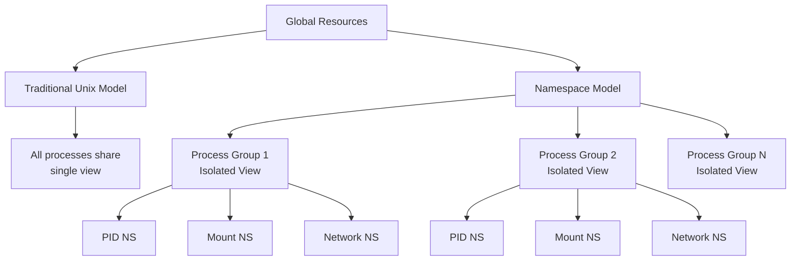
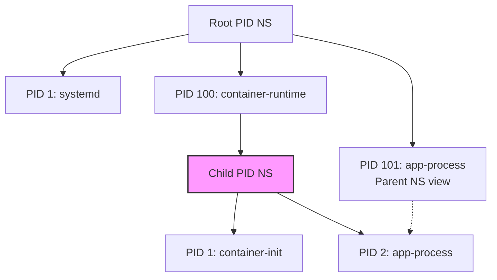
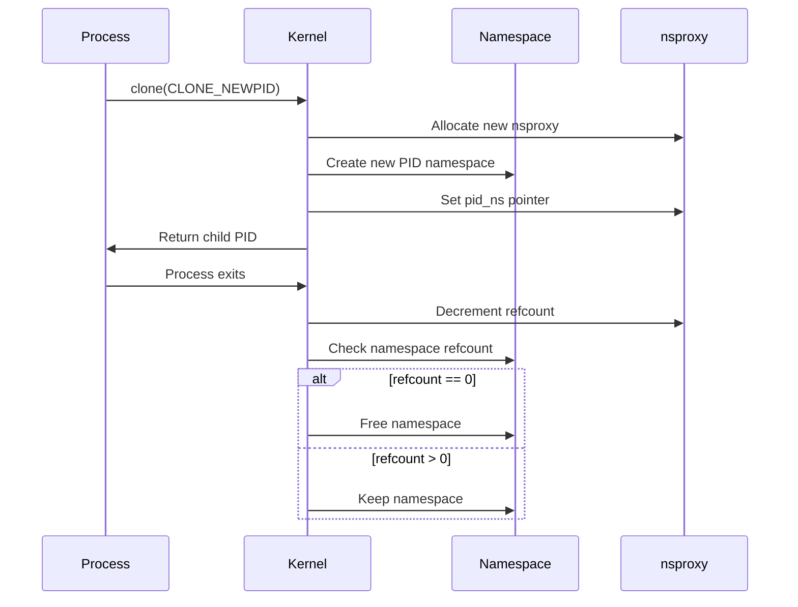

# Linux Namespace

Linux Namespaceは、プロセスが参照可能なシステムリソースのビューを分離する機構である。この技術は、単一のカーネル上で複数の独立したユーザー空間インスタンスを実現し、現代のコンテナ技術の基盤となっている。プロセスの視点から見ると、Namespaceは特定のグローバルリソースを抽象化し、同一システム上で動作する他のプロセスから隔離された環境を提供する。

Unixシステムの設計思想において、すべてのプロセスは単一のグローバルなリソース空間を共有するという前提があった。ファイルシステム、プロセスID、ネットワークインターフェースなど、これらのリソースはシステム全体で一意であり、すべてのプロセスから参照可能であった。しかし、仮想化技術の発展とセキュリティ要件の高度化に伴い、この設計思想に変革が求められるようになった。Linux Namespaceは、この要求に応える形で2002年頃から段階的に実装されてきた[^1]。

[^1]: Kerrisk, M. (2013). "Namespaces in operation, part 1: namespaces overview". Linux Weekly News. https://lwn.net/Articles/531114/



## Namespaceの種類と特性

Linux カーネルは現在、8種類のNamespaceを実装している。それぞれが異なるシステムリソースの分離を担当し、独立して、あるいは組み合わせて使用できる。これらのNamespaceは、`clone()`、`unshare()`、`setns()`といったシステムコールを通じて操作される。

Mount Namespace (CLONE_NEWNS) は、2002年にLinux 2.4.19で最初に導入されたNamespaceである。プロセスグループごとに独立したマウントポイントのビューを提供し、あるNamespace内でのマウント操作が他のNamespaceに影響を与えないことを保証する。この機能により、各コンテナが独自のファイルシステム階層を持つことが可能となった。Mount Namespaceの実装は、VFSレイヤーにおいて`struct mount`構造体をNamespaceごとに管理することで実現されている。

PID Namespace (CLONE_NEWPID) は、プロセスID空間を分離する。新しいPID Namespace内で最初に作成されたプロセスはPID 1となり、そのNamespace内でinitプロセスとしての役割を果たす。興味深いことに、プロセスは複数のPID Namespaceに属することができ、各Namespace内で異なるPIDを持つ。これは階層的な構造を形成し、親Namespaceからは子Namespace内のプロセスが見えるが、その逆は成立しない。



Network Namespace (CLONE_NEWNET) は、ネットワークスタック全体を分離する。これには、ネットワークデバイス、IPアドレス、ルーティングテーブル、ファイアウォールルール、`/proc/net`ディレクトリなどが含まれる。各Network Namespaceは完全に独立したネットワーク環境を持ち、ループバックインターフェース（lo）も個別に存在する。Network Namespace間の通信は、vethペアやmacvlanなどの仮想ネットワークデバイスを通じて実現される。

UTS Namespace (CLONE_NEWUTS) は、ホスト名とドメイン名を分離する。UTSは"Unix Time-sharing System"の略であり、`uname()`システムコールで返される情報の一部を制御する。この機能により、各コンテナが独自のホスト名を持つことができる。

IPC Namespace (CLONE_NEWIPC) は、System V IPCオブジェクトとPOSIXメッセージキューを分離する。これには、共有メモリセグメント、セマフォセット、メッセージキューが含まれる。IPC Namespaceの分離により、異なるNamespace間でのIPCリソースの衝突を防ぎ、セキュリティを向上させる。

User Namespace (CLONE_NEWUSER) は、ユーザーIDとグループIDの空間を分離する。この機能により、あるNamespace内でroot（UID 0）として動作するプロセスが、親Namespace内では非特権ユーザーとして扱われることが可能となる。User Namespaceは他のNamespaceと異なり、非特権ユーザーでも作成でき、これがrootlessコンテナの実現を可能にしている[^2]。

[^2]: Kerrisk, M. (2013). "User namespaces". Linux manual pages. https://man7.org/linux/man-pages/man7/user_namespaces.7.html

Cgroup Namespace (CLONE_NEWCGROUP) は、cgroupルート階層のビューを仮想化する。プロセスが参照する`/proc/[pid]/cgroup`ファイルの内容が、そのプロセスのcgroup namespaceに相対的なパスで表示される。

Time Namespace (CLONE_NEWTIME) は、Linux 5.6で導入された最新のNamespaceである。CLOCK_MONOTONICとCLOCK_BOOTTIMEクロックのオフセットを提供し、コンテナのマイグレーションやチェックポイント・リストア機能の実装を支援する。

## カーネル実装の詳細

Namespaceの実装は、Linuxカーネルの`struct task_struct`と`struct nsproxy`を中心に構築されている。各プロセスは`task_struct`内に`nsproxy`へのポインタを持ち、この構造体が各種Namespaceへの参照を保持する。

```c
struct nsproxy {
    atomic_t count;
    struct uts_namespace *uts_ns;
    struct ipc_namespace *ipc_ns;
    struct mnt_namespace *mnt_ns;
    struct pid_namespace *pid_ns_for_children;
    struct net *net_ns;
    struct time_namespace *time_ns;
    struct time_namespace *time_ns_for_children;
    struct cgroup_namespace *cgroup_ns;
};
```

プロセスが新しいNamespaceを作成または参加する際、カーネルは適切な`nsproxy`構造体を割り当て、必要なNamespaceへの参照を設定する。Copy-on-Write的なアプローチにより、Namespaceを共有するプロセス間では同じ`nsproxy`を参照し、メモリ効率を向上させている。

Namespaceのライフサイクル管理は参照カウントによって行われる。各Namespace構造体は参照カウンタを持ち、プロセスがNamespaceに参加するとカウントが増加し、離脱すると減少する。カウントが0になると、Namespaceとその関連リソースが解放される。ただし、PID Namespaceは特殊で、子プロセスが存在する限り解放されない。



## 性能特性とオーバーヘッド

Namespaceの使用に伴うパフォーマンスオーバーヘッドは、一般的に非常に小さい。多くの場合、追加のポインタ参照による間接参照が発生する程度である。しかし、特定の状況下では無視できないオーバーヘッドが発生する可能性がある。

Network Namespaceは、独立したネットワークスタックを維持するため、最も大きなメモリフットプリントを持つ。各Network Namespaceは、ルーティングテーブル、netfilterルール、ソケットバッファなどを個別に保持する必要がある。大規模なコンテナ環境では、このメモリ使用量が累積して significant な影響を与える可能性がある。

PID Namespaceの階層構造は、プロセス管理に若干のオーバーヘッドをもたらす。`getpid()`のような単純なシステムコールでも、現在のPID Namespaceを特定し、適切なPIDを返す必要がある。ただし、このオーバーヘッドは通常の使用では測定困難なレベルである。

Mount Namespaceは、パス解決時に追加のチェックを必要とする。VFSレイヤーは、現在のプロセスのMount Namespaceコンテキストでマウントポイントを解決する必要があり、深くネストされたディレクトリ構造では、このオーバーヘッドが累積する可能性がある。

## セキュリティ考慮事項

Namespaceは強力な分離機構を提供するが、完全なセキュリティ境界ではないことを理解することが重要である。カーネルは依然として共有されており、カーネルの脆弱性は全てのNamespaceに影響を与える可能性がある。

User Namespaceは特に注意深い設計が必要である。非特権ユーザーがUser Namespaceを作成し、その中でroot権限を取得できることは、新たな攻撃ベクトルを生む可能性がある。このため、多くのディストリビューションでは、`/proc/sys/kernel/unprivileged_userns_clone`を通じてこの機能を制限している。

Namespace間の情報漏洩も考慮すべき問題である。例えば、`/proc`ファイルシステムの一部は、PID Namespaceの境界を越えて情報を露出する可能性がある。また、共有メモリやファイルシステムを通じた意図しない情報共有も発生しうる。

## コンテナランタイムとの統合

Dockerやcontainerdなどのコンテナランタイムは、Namespaceを基盤技術として使用している。これらのランタイムは、通常、新しいコンテナを作成する際に複数のNamespaceを同時に作成する。

```mermaid
graph LR
    A[Container Runtime] --> B[clone() with flags]
    B --> C[CLONE_NEWNS]
    B --> D[CLONE_NEWPID]
    B --> E[CLONE_NEWNET]
    B --> F[CLONE_NEWIPC]
    B --> G[CLONE_NEWUTS]
    B --> H[CLONE_NEWUSER]
    C --> I[Isolated Container Process]
    D --> I
    E --> I
    F --> I
    G --> I
    H --> I
```

runcのようなOCI準拠のランタイムは、Namespace操作を抽象化し、設定ファイルベースのインターフェースを提供する。これにより、開発者は低レベルのシステムコールを直接扱うことなく、Namespaceの恩恵を受けることができる。

Kubernetesのようなオーケストレーションシステムは、さらに高いレベルの抽象化を提供する。PodというコンセプトにおいてはNamespaceの共有パターンが定義されており、例えば、同一Pod内のコンテナはNetwork NamespaceとIPC Namespaceを共有するが、Mount NamespaceとPID Namespaceは分離される。

## 実装上の制約と今後の展望

現在のNamespace実装にはいくつかの制約が存在する。最も顕著なのは、すべてのリソースがNamespace化されていないことである。例えば、システム時刻（CLOCK_REALTIME）、カーネルモジュール、デバイスドライバなどは依然としてグローバルリソースのままである。

また、Namespaceの入れ子や部分的な共有に関する柔軟性も限定的である。例えば、ファイルシステムの一部だけを共有したい場合、現在のMount Namespaceモデルでは複雑な bind mount の組み合わせが必要となる。

パフォーマンスの観点では、大量のNamespaceを作成・破棄する際のスケーラビリティが課題となることがある。特にNetwork Namespaceは、作成時に完全なネットワークスタックの初期化が必要であり、高頻度な作成・破棄はシステムに負荷をかける可能性がある。

Linux Namespaceは、システムリソースの仮想化と分離において革新的なアプローチを提供し、現代のクラウドネイティブ技術の基盤となっている。その設計は、Unixの伝統的な「everything is a file」という哲学を拡張し、「everything is a namespace」という新たなパラダイムを提示している。カーネルレベルでの効率的な実装により、仮想マシンと比較して極めて低いオーバーヘッドでリソース分離を実現し、マイクロサービスアーキテクチャやサーバーレスコンピューティングの実現を可能にしている。